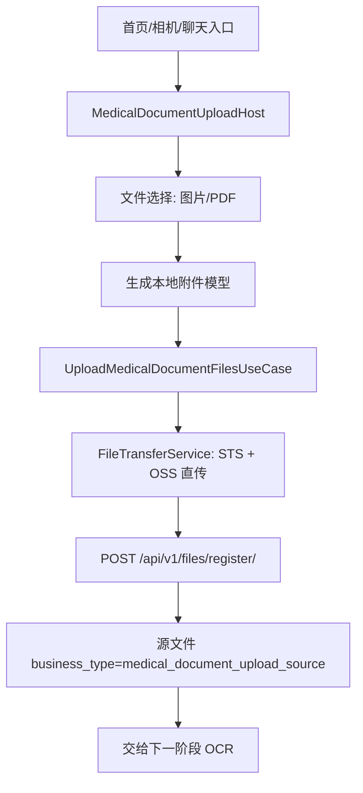
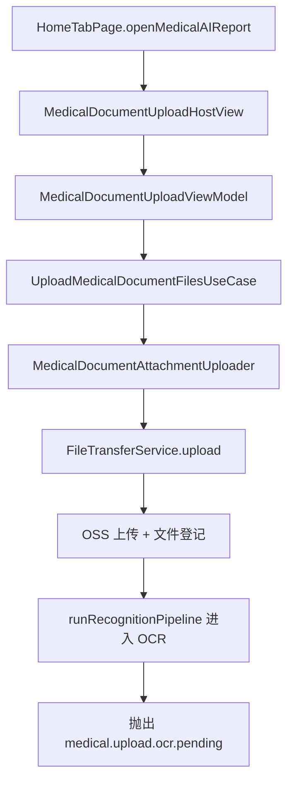
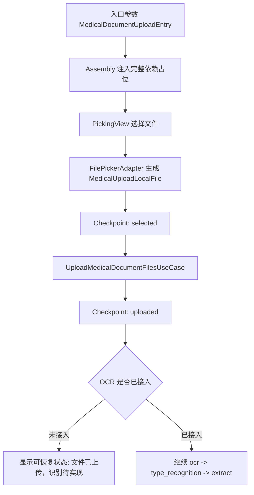

# HOS-MED-UPLOAD-0001 入口装配与文件 OSS 上传 iOS 对齐工单

> 状态：待实施（仅完成工单梳理与修复方案整理，未变更任何实现代码）  
> 范围：仅覆盖 AI 上传报告迁移的前两个阶段，即“入口与装配”“文件选择与 OSS 上传”。OCR、类型识别、结构化抽取、附件绑定、结果页和业务保存只作为下游边界说明，不在本工单直接实现。  
> 硬性约束：**本工单只允许修改 HarmonyOS 侧内容；不要改动任何 iOS 代码，不要改动任何服务器代码。**  
> 参考端：`SparkClient/SparkClient/Projects/Features/MedicalDocumentUpload/`、`SparkClient/SparkClient/Projects/Core/FileStorage/`、`SparkService/file_manager/`。  
> 当前端：`SparkClientHarmonyOS/entry/src/main/ets/Projects/Features/MedicalDocumentUpload/`、`SparkClientHarmonyOS/entry/src/main/ets/Core/FileStorage/`、`SparkClientHarmonyOS/entry/src/main/ets/Projects/Core/OSS/`。  
> 外部参考代码：`/Users/hua/Downloads/files (1)/SupportingModels.ets`、`MedicalDocumentUploadHostView.ets`、`MedicalDocumentUploadPickingView.ets`、`MedicalDocumentUploadViewModel.ets`。

> 说明：本工单只用于统一范围、问题、修复路径和验收口径，不直接实现代码改动。

## 1. 对标范围与结论

### 1.1 当前迁移阶段

当前 HarmonyOS 端已经完成“能从首页进入 AI 上传报告，并把选中文件上传到 OSS/文件中心”的基础对齐，但尚未形成 iOS 等价的上传识别总线。

| 阶段 | iOS 目标职责 | HarmonyOS 当前事实 | 对齐结论 |
| --- | --- | --- | --- |
| 入口与装配 | 从首页、相机、聊天等入口进入统一上传 Host；由 Assembly 注入成员上下文、文件上传、OCR、类型识别、抽取、保存、绑定、通知、AI 配置 | 首页已能拉起上传页；`AppContainer.createMedicalDocumentUploadViewModel()` 已接入 `MedicalDocumentUploadAssembly`；Assembly 当前只注入成员上下文、文件传输、上传 UseCase、通知 | 已部分对齐。入口跑通，但依赖装配只到 upload，iOS 的 pipeline 依赖仍缺失 |
| 文件选择与 OSS 上传 | 选择图片/PDF，生成本地附件模型，计算文件元数据，OSS 直传，登记文件中心，支持跳过已上传文件和重试 | 公共 `FileTransferService`、`MedicalDocumentAttachmentUploader`、`UploadMedicalDocumentFilesUseCase` 已可批量上传；AI 上传报告业务使用 `medical_document_upload_source` 作为源文件业务类型 | 基本对齐。需要补文件选择适配器、上传阶段错误归一化、断点状态持久化和上传后交接契约 |

一句话结论：**HarmonyOS 现在处于“前置文件链路已落地，识别闭环未接入”的阶段**。本工单的目标不是重写公共文件底座，而是把前两个阶段整理成 iOS 同等可扩展的业务入口，为后续 OCR/type_recognition/extract 接入留出稳定断点。

### 1.2 不能混淆的边界

| 能力 | 当前是否属于本工单 | 原因 |
| --- | --- | --- |
| OSS STS、上传、登记、下载 URL、缓存 | 是，但只消费公共能力 | 公共方案已在 `文件与 OSS/文件与OSS详细技术方案.md` 中定义，本工单只定义 AI 上传报告如何使用 |
| OCR 多引擎融合 | 否 | `Projects/Core/OCR/` 在 HarmonyOS 端尚未建立，应进入下一张工单 |
| 医疗文档类型判定 | 否 | 依赖 OCR 输出文本和 AI Runtime 场景配置 |
| 结构化抽取和重试反馈 | 否 | iOS 有完整 UseCase/Prompt/ErrorNormalizer，HarmonyOS 当前缺失 |
| 结果页编辑和业务保存 | 否 | 依赖文档类型、抽取结果和首页医疗画像写接口 |

### 1.4 明确不做

| 不做项 | 说明 |
| --- | --- |
| 不改 iOS 代码 | 只把 iOS 作为对标参考和契约来源，不修改任何 Swift / SwiftUI / iOS 工程文件 |
| 不改服务器代码 | 只引用后端文件接口契约，不修改任何 Django / API / serializer / model 代码 |
| 不直接实现业务代码 | 本工单只整理 HarmonyOS 的修复方案、目录边界、验收口径和后续拆分 |

### 1.3 当前问题清单

| 问题 | 现状 | 修复目标 |
| --- | --- | --- |
| 入口只到 upload | 首页能拉起上传页，但统一入口参数还不完整 | 统一入口来源、成员、默认类型和外部文件输入 |
| Assembly 只装配 upload | 当前只接了成员上下文、文件传输、上传 UseCase、通知 | 补 capability 占位，让后续 OCR/抽取/保存可无痛接入 |
| Picker 仍偏骨架 | UI 已有，但真实文件选择适配器未形成业务稳定层 | 把文件选择下沉到 Infrastructure，UI 只消费结果 |
| 上传阶段缺少恢复语义 | 已上传、待登记、失败阶段的边界不够清楚 | 增加 checkpoint 和阶段化错误归一化 |
| 上传后交接不稳定 | OCR 还未接入，当前容易被误读为闭环完成 | 输出稳定 `MedicalDocumentOCRInput`，明确留给下一张工单 |

## 2. 华为端目录设计

### 2.1 当前目录事实

```text
SparkClientHarmonyOS/entry/src/main/ets/
├── App/
│   └── AppContainer.ets
├── Core/
│   ├── FileStorage/
│   └── AI/
├── Projects/
│   ├── App/
│   │   └── HomeTabPage.ets
│   ├── Core/
│   │   ├── Networking/API/File/
│   │   ├── Networking/API/OSS/
│   │   └── OSS/
│   └── Features/
│       ├── Home/Presentation/MedicalLists/
│       │   └── MedicalDocumentAttachmentUploader.ets
│       └── MedicalDocumentUpload/
│           ├── Application/
│           │   ├── MedicalDocumentUploadAssembly.ets
│           │   ├── MedicalDocumentUploadViewModel.ets
│           │   └── UploadMedicalDocumentFilesUseCase.ets
│           ├── Domain/
│           └── Presentation/
```

当前目录最大问题不是文件缺少，而是“业务分层还停在上传壳”：`MedicalDocumentUploadViewModel` 已经有 pipeline 状态命名，但真实执行在 OCR 阶段主动抛出 pending。

### 2.2 本工单目标目录

```text
SparkClientHarmonyOS/entry/src/main/ets/Projects/Features/MedicalDocumentUpload/
├── Application/
│   ├── MedicalDocumentUploadAssembly.ets
│   ├── MedicalDocumentUploadViewModel.ets
│   ├── UploadMedicalDocumentFilesUseCase.ets
│   ├── MedicalDocumentUploadEntryFactory.ets        # 新增：入口参数归一化
│   └── MedicalDocumentUploadCheckpointStore.ets     # 新增：上传断点与阶段快照
├── Domain/
│   ├── MedicalDocumentUploadModels.ets              # 新增或补齐：领域模型统一出口
│   ├── MedicalDocumentUploadPipeline.ets            # 新增：阶段枚举和进度模型
│   └── MedicalDocumentUploadErrors.ets              # 新增：文件选择/上传阶段错误归一化
├── Infrastructure/
│   └── HarmonyMedicalDocumentFilePicker.ets         # 新增：Photo/PDF 选择适配器
└── Presentation/
    ├── MedicalDocumentUploadHostView.ets
    ├── MedicalDocumentUploadPickingView.ets
    └── MedicalDocumentUploadProgressView.ets
```

### 2.3 目录职责修复原则

| 层级 | 应放内容 | 禁止内容 |
| --- | --- | --- |
| Presentation | ArkUI 页面、用户动作、弹窗、列表、进度展示 | 直接调用 OSS SDK、直接拼后端 URL、直接持有 STS |
| Application | UseCase、ViewModel、Assembly、断点恢复、入口上下文组装 | 具体文件选择 API、具体 OSS SDK 类型 |
| Domain | 上传阶段、附件模型、错误、入口来源、业务类型常量 | UI 文案、平台 API、网络实现 |
| Infrastructure | HarmonyOS file picker、文件临时拷贝、平台 MIME/URI 解析 | 医疗业务保存、AI Prompt |

## 3. 分层职责与请求链路

### 3.1 iOS 等价业务流程



### 3.2 HarmonyOS 当前链路



当前链路跑通了 A-G，H-I 是刻意留下的待接入点。这个状态应在代码和文档中显式表达，避免团队误判为“AI 上传报告已完整完成”。

### 3.3 修复后的上传交接链路



### 3.4 入口来源必须保留

| 入口 | 入口参数 | 用途 |
| --- | --- | --- |
| 首页 | `memberId`、`memberName`、`preferredKind?` | 默认归属成员，选择文档类型 |
| 相机 | `memberId`、`capturedFiles`、`source=second_camera` | 跳过重复选择，直接进入预览/上传 |
| 聊天 | `threadId?`、`memberId?`、`source=chat` | 保留聊天附件到医疗业务的转化路径 |

## 4. 核心关键技术与实现方案

### 4.1 入口装配修复方案

当前 `MedicalDocumentUploadAssembly` 只注入上传链路。为了不阻塞本工单，可先定义完整依赖槽位，OCR/抽取/保存依赖允许为 `undefined`，但 ViewModel 必须通过 capability 判断给出明确状态，而不是在流程深处抛通用错误。

示例代码为方案骨架，落地时需按现有 ArkTS lint 与工程 import 调整：

```ts
// Pseudocode: Projects/Features/MedicalDocumentUpload/Application/MedicalDocumentUploadAssembly.ets
export interface MedicalDocumentUploadDependencies {
  memberContextStore: MemberContextStore
  fileTransferService: FileTransferService
  activeAccountIdProvider: () => string | undefined
  sessionGenerationProvider: () => number
  notificationClient: NotificationClient
  ocrOrchestrator?: MedicalOCROrchestrator
  typeResolver?: MedicalDocumentTypeResolver
  extractor?: TypedMedicalDocumentExtractor
  saver?: TypedMedicalDocumentSaver
  attachmentBinder?: UploadedMedicalFileBinder
}

export class MedicalDocumentUploadAssembly {
  static makeViewModel(deps: MedicalDocumentUploadDependencies): MedicalDocumentUploadViewModel {
    const attachmentUploader = new MedicalDocumentAttachmentUploader(
      deps.fileTransferService,
      deps.activeAccountIdProvider,
      deps.sessionGenerationProvider
    )

    return new MedicalDocumentUploadViewModel({
      memberContextStore: deps.memberContextStore,
      uploadFilesUseCase: new UploadMedicalDocumentFilesUseCase(attachmentUploader),
      notificationClient: deps.notificationClient,
      capabilities: {
        upload: true,
        ocr: deps.ocrOrchestrator !== undefined,
        typeRecognition: deps.typeResolver !== undefined,
        extraction: deps.extractor !== undefined,
        save: deps.saver !== undefined && deps.attachmentBinder !== undefined
      }
    })
  }
}
```

### 4.2 文件选择适配器

用户给的 `MedicalDocumentUploadPickingView.ets` 已经给出目标 UI 骨架，但 `openFilePicker()` 仍是占位。HarmonyOS 应把平台选择逻辑移入 Infrastructure，UI 只消费结果。

```ts
// Pseudocode: Projects/Features/MedicalDocumentUpload/Infrastructure/HarmonyMedicalDocumentFilePicker.ets
import { picker } from '@kit.CoreFileKit'

export class HarmonyMedicalDocumentFilePicker {
  async pickFiles(): Promise<MedicalUploadLocalFile[]> {
    const documentPicker = new picker.DocumentViewPicker()
    const uris = await documentPicker.select({
      maxSelectNumber: 9,
      fileSuffixFilters: ['.pdf', '.jpg', '.jpeg', '.png', '.heic']
    })

    return uris.map((uri: string): MedicalUploadLocalFile => {
      return {
        localId: generateUUID(),
        uri,
        displayName: inferDisplayName(uri),
        mimeType: inferMimeType(uri),
        sizeBytes: 0,
        remoteFile: undefined,
        uploadState: 'pending'
      }
    })
  }
}
```

实现注意：

| 点位 | 方案 |
| --- | --- |
| 图片选择 | 可复用 Photo Picker；若本期只做 PDF/文件统一入口，可以先使用 DocumentViewPicker |
| URI 权限 | 选中文件应尽快拷贝到应用私有缓存，避免后续上传/断点恢复时源 URI 不可读 |
| MIME 推断 | 以后缀推断为兜底；上传前用文件头/系统元数据补齐 |
| 大文件 | 本工单继续走公共 `FileTransferService`，不在业务层实现分片 |

### 4.3 OSS 上传业务绑定

AI 上传报告的源文件不应该一开始绑定到体检报告/检查报告等最终业务记录，因为此时文档类型和业务 ID 尚未生成。当前使用 `medical_document_upload_source` 是合理的，但需要约束：

| 字段 | 当前建议 |
| --- | --- |
| `business_type` | `medical_document_upload_source` |
| `business_id` | 优先 `memberId`；如果后续加入 upload session，应改为 `uploadSessionId` |
| `is_public` | `false` |
| `storage_type` | `oss` |

后续 `attachment_binding` 阶段再调用 `PATCH /api/v1/files/business/update/` 或批量绑定服务，将源文件关联到最终业务：

```ts
// Pseudocode: later attachment_binding stage, not implemented in this ticket.
await fileBusinessAPI.updateBusiness({
  file_id: uploaded.remoteFile.id,
  business_type: finalBusinessType,
  business_id: finalBusinessId
})
```

### 4.4 断点快照

iOS 参考 ViewModel 里已有 checkpoint/auto retry 语义。HarmonyOS 前两个阶段至少需要保存到“已选择”和“已上传”：

```ts
// Pseudocode: Projects/Features/MedicalDocumentUpload/Application/MedicalDocumentUploadCheckpointStore.ets
export interface MedicalDocumentUploadCheckpoint {
  uploadSessionId: string
  memberId: string
  source: MedicalDocumentUploadSource
  selectedFiles: MedicalUploadLocalFile[]
  uploadedFiles: UploadedMedicalDocumentFile[]
  stage: 'picking' | 'uploading' | 'uploaded' | 'ocr_pending'
  updatedAt: string
}

export interface MedicalDocumentUploadCheckpointStore {
  save(snapshot: MedicalDocumentUploadCheckpoint): Promise<void>
  load(uploadSessionId: string): Promise<MedicalDocumentUploadCheckpoint | undefined>
  clear(uploadSessionId: string): Promise<void>
}
```

最小落地可以先使用账号隔离 Preferences/RDB；不允许把 STS、Token、API Key 写入快照。

### 4.5 上传错误归一化

现状错误会在 ViewModel 里被粗粒度处理。为了让用户知道“是选择失败、读取失败、STS 失败、OSS 失败还是登记失败”，需要把公共 FileTransfer 错误映射为业务阶段错误。

```ts
// Pseudocode: Projects/Features/MedicalDocumentUpload/Domain/MedicalDocumentUploadErrors.ets
export type MedicalDocumentUploadErrorStage =
  'file_pick' | 'file_read' | 'sts' | 'oss_upload' | 'file_register' | 'business_bind' | 'ocr_pending'

export interface MedicalDocumentUploadStageError {
  stage: MedicalDocumentUploadErrorStage
  code: string
  message: string
  recoverable: boolean
}

export function normalizeUploadError(error: Error): MedicalDocumentUploadStageError {
  if (error.message.includes('uploaded_unregistered')) {
    return {
      stage: 'file_register',
      code: 'medical.upload.file_register_pending',
      message: '文件已上传到 OSS，但文件中心登记未完成，可重试恢复。',
      recoverable: true
    }
  }

  return {
    stage: 'oss_upload',
    code: 'medical.upload.failed',
    message: error.message,
    recoverable: true
  }
}
```

### 4.6 与 HarmonyOS 官方能力的对应

| 能力 | 官方能力 | 本工单使用方式 |
| --- | --- | --- |
| 文件选择 | File Picker / Core File Kit | `DocumentViewPicker` 或 Photo Picker 选择图片/PDF |
| 应用私有文件访问 | Core File Kit /应用沙箱文件 | 将外部 URI 拷贝到账号隔离缓存后再上传 |
| 页面承载 | Navigation / bindContentCover | 首页全屏拉起 AI 上传 Host |
| 生命周期恢复 | UIAbility 生命周期 | 上传任务前后台恢复时依赖 checkpoint 和 FileTransfer 状态 |

官方文档参考：

- [File Picker](https://developer.huawei.com/consumer/cn/doc/harmonyos-references/js-apis-file-picker)
- [App file access](https://developer.huawei.com/consumer/en/doc/harmonyos-guides/app-file-access)
- [Navigation](https://developer.huawei.com/consumer/en/doc/harmonyos-guides/arkts-navigation-navigation)
- [bindContentCover](https://developer.huawei.com/consumer/cn/doc/harmonyos-guides/arkts-contentcover-page)
- [UIAbility lifecycle](https://developer.huawei.com/consumer/en/doc/harmonyos-guides/uiability-lifecycle)

## 5. 接口契约与数据模型

### 5.1 后端文件接口契约

以后端 `SparkService/file_manager/` 为单一事实源：

| 接口 | 方法 | 用途 | 本工单使用 |
| --- | --- | --- | --- |
| `/api/v1/oss/sts/credentials/` | GET | 获取普通 OSS STS | `FileTransferService` 内部使用 |
| `/api/v1/oss/ocr/sts/credentials/` | GET | 获取 OCR 相关 STS | 本工单不直接调用 |
| `/api/v1/files/register/` | POST | OSS 直传后登记文件元数据 | 上传完成后必须调用 |
| `/api/v1/files/` | GET | 按 business 查询文件 | 断点恢复/已上传文件展示可用 |
| `/api/v1/files/business/update/` | PATCH | 更新业务绑定 | 后续 attachment_binding 阶段使用 |
| `/api/v1/files/<file_id>/download-url/` | GET | 下载 URL | 预览/重新 OCR 可用 |
| `/api/v1/files/<file_id>/` | DELETE | 软删除 | 用户移除已上传源文件时使用 |

### 5.2 文件登记请求体

| 字段 | 类型 | 必填 | 说明 |
| --- | --- | --- | --- |
| `file_uuid` | string | 是 | 客户端生成 UUID |
| `original_name` | string | 是 | 用户可见文件名 |
| `file_size` | number | 是 | 字节数 |
| `mime_type` | string | 是 | MIME |
| `file_path` | string | 是 | OSS object key 或文件路径 |
| `object_key` | string | 否 | OSS object key |
| `storage_type` | string | 否 | 默认 `oss` |
| `business_type` | string | 否 | 本工单固定 `medical_document_upload_source` |
| `business_id` | string | 否 | 当前成员 ID 或 upload session |
| `is_public` | boolean | 否 | 默认 `false` |
| `file_md5` | string | 否 | 完整性校验 |

### 5.3 文件登记响应模型

| 字段 | 类型 | 说明 |
| --- | --- | --- |
| `id` | number | 文件中心主键 |
| `file_uuid` | string | 文件 UUID |
| `file_path` | string | 文件路径 |
| `original_name` | string | 原文件名 |
| `file_size` | number | 字节数 |
| `mime_type` | string | MIME |
| `file_md5` | string? | MD5 |
| `is_public` | boolean | 是否公开 |
| `business_type` | string? | 业务类型 |
| `business_id` | string? | 业务 ID |
| `object_key` | string? | OSS object key |
| `storage_type` | string | 存储类型 |
| `created_at` | string | 创建时间 |

### 5.4 AI 上传报告领域模型

```ts
// Pseudocode: Projects/Features/MedicalDocumentUpload/Domain/MedicalDocumentUploadModels.ets
export type MedicalDocumentUploadSource = 'home' | 'second_camera' | 'chat'

export interface MedicalDocumentUploadEntry {
  source: MedicalDocumentUploadSource
  memberId: string
  memberName?: string
  preferredKind?: MedicalDocumentKind
  initialFiles?: MedicalUploadLocalFile[]
}

export interface MedicalUploadLocalFile {
  localId: string
  uri: string
  displayName: string
  mimeType: string
  sizeBytes: number
  fileMd5?: string
  remoteFile?: ManagedFileRecord
  uploadState: 'pending' | 'uploading' | 'uploaded' | 'failed'
}

export interface UploadedMedicalDocumentFile {
  localId: string
  remoteFile: ManagedFileRecord
  sourceBusinessType: 'medical_document_upload_source'
  sourceBusinessId: string
}
```

### 5.5 与后续 pipeline 的边界模型

本工单完成后，向 OCR 阶段输出的最小输入应固定为：

```ts
// Pseudocode
export interface MedicalDocumentOCRInput {
  uploadSessionId: string
  memberId: string
  files: UploadedMedicalDocumentFile[]
}
```

这样下游 OCR 可以独立决定使用下载 URL、本地缓存路径或 object key，不反向依赖页面选择器。

## 6. iOS-HarmonyOS 功能对照矩阵

| 功能点 | iOS 参考 | HarmonyOS 当前 | 差距 | 修复动作 | 验收 |
| --- | --- | --- | --- | --- | --- |
| 首页入口 | 首页可进入统一 `MedicalDocumentUploadHost` | `HomeTabPage` 已可拉起上传页 | 入口来源参数还不完整 | 增加 `MedicalDocumentUploadEntryFactory`，统一 home/camera/chat 来源 | 首页进入后 memberId、source、默认类型可追踪 |
| 依赖装配 | AppContainer 注入 upload/OCR/type/extract/save/bind/AI config/notification | 当前只注入 upload 和 notification | pipeline 依赖槽位缺失 | Assembly 增加 capability 结构，未实现能力显式置 false | 未接 OCR 时显示“文件已上传，识别待接入”，不误报失败 |
| 文件选择 | 图片/PDF 多选，生成本地文件模型 | UI 骨架存在，平台 picker 待补 | 选择器和本地模型未公共化 | 新增 `HarmonyMedicalDocumentFilePicker` | 可选择 PDF/JPG/PNG 并进入上传列表 |
| OSS 上传 | OSS 直传、登记、业务源绑定 | `FileTransferService` + `UploadMedicalDocumentFilesUseCase` 已通 | 阶段错误和断点快照不足 | 增加 checkpoint 和错误归一化 | 上传失败能区分阶段；重进页面可恢复已上传文件 |
| 跳过已上传 | iOS 可跳过已上传附件 | UseCase 已支持 `reuploadAll=false` | UI 未完整暴露 | Picking/Progress 展示 uploaded 状态 | 重试不重复上传成功文件 |
| 上传后交接 | 上传结果进入 OCR | 当前进入 OCR 后 pending | 待下游工单 | 输出稳定 `MedicalDocumentOCRInput` | 后续 OCR 不需改上传模块 |

## 7. 示例工程与官方文档参考结论

### 7.1 工程内可复用代码

| 来源 | 可复用点 | 使用方式 |
| --- | --- | --- |
| `Core/FileStorage/FileTransferService.ets` | STS、OSS 上传、登记、缓存、账号隔离 | AI 上传报告继续只调用公共服务，不绕过 |
| `Projects/Core/OSS/OSSClientAdapter.ets` | 阿里云 OSS SDK 适配 | 只由 FileTransferService 使用 |
| `MedicalDocumentAttachmentUploader.ets` | 医疗上传源文件业务绑定 | 保留并补常量/错误映射 |
| `UploadMedicalDocumentFilesUseCase.ets` | 批量上传、跳过已上传 | 继续作为 Application 层唯一上传入口 |
| `Features/Chat/Infrastructure/HarmonyVisionOCRAdapter.ets` | 系统 Vision OCR 参考 | 只作为下一阶段 OCR 公共模块参考，不在本工单直接耦合 |

### 7.2 用户提供参考代码结论

| 文件 | 对 HarmonyOS 当前代码的价值 | 本工单采用点 |
| --- | --- | --- |
| `SupportingModels.ets` | 已定义完整 pipeline、上传文件、进度、预提交问题、AI 场景 | 抽取前两阶段模型进入 Domain |
| `MedicalDocumentUploadHostView.ets` | 给出 picking/processing/result 宿主页面结构 | 保持 Host 只协调状态，不直接处理上传 |
| `MedicalDocumentUploadPickingView.ets` | 给出成员卡、文档类型、文件网格、预览、底部操作 | 补真实 file picker 与上传状态展示 |
| `MedicalDocumentUploadViewModel.ets` | 给出完整 pipeline、重试、取消、保存、断点的目标形态 | 当前先落 capability、checkpoint、上传后交接 |

### 7.3 官方能力结论

HarmonyOS 端不需要照搬 iOS 的 Photos/UIDocumentPicker 结构。正确做法是以 File Picker/Photo Picker 作为 Infrastructure 适配器，向业务层输出稳定的 `MedicalUploadLocalFile`。页面和 ViewModel 不应知道平台 picker 的细节。

## 8. 实施拆分与验收

### 8.1 实施拆分

| 子任务 | 类型 | 文件 | 说明 |
| --- | --- | --- | --- |
| T1 | 文档/矩阵 | `开发详细技术文档/AI 上传报告/`、`iOS-HarmonyOS功能对照矩阵.md` | 已更新为待实施工单，统一边界和验收口径 |
| T2 | 领域模型 | `Domain/MedicalDocumentUploadModels.ets`、`Pipeline.ets`、`Errors.ets` | 待补 Entry/LocalFile/OCRInput/Capabilities/错误归一化 |
| T3 | 入口归一化 | `Application/MedicalDocumentUploadEntryFactory.ets`、`HomeTabPage.ets` | 待统一 home/camera/chat/externalPdf；首页入口改为 Factory |
| T4 | 装配修复 | `Application/MedicalDocumentUploadAssembly.ets` | 待补 Dependencies + capability；OCR 槽位保持显式预留 |
| T5 | 文件选择 | `Infrastructure/HarmonyMedicalDocumentFilePicker.ets`、`PickingView.ets` | 待接入真实适配器；上限、类型和 URI 读取要稳定化 |
| T6 | 断点与错误 | `Application/MedicalDocumentUploadCheckpointStore.ets`、`Errors.ets` | 待补 Checkpoint + 阶段化错误 |
| T7 | 上传交接 | `Presentation/MedicalDocumentUploadViewModel.ets`、`ProgressView.ets` | 待输出稳定 OCRInput；ocr=false 时明确进入 pending |
| T8 | 测试 | `entry/src/test/ets/MedicalDocumentUpload/MedicalDocumentUpload0001.test.ets` | 待补 Entry/Error/Checkpoint/LocalFile roundtrip |

### 8.2 验收标准

| 验收项 | 标准 |
| --- | --- |
| 首页入口 | 从首页点击 AI 上传报告，Host 可打开，成员上下文正确 |
| 文件选择 | 至少支持 PDF/JPG/PNG 多选，选择后列表显示文件名、大小、类型 |
| 上传 | 文件通过 `FileTransferService` 上传并登记，响应包含 `ManagedFileRecord` |
| 跳过重复 | 已有 `remoteFile` 且 `reuploadAll=false` 时不重复上传 |
| 错误阶段 | 文件选择、读取、STS、OSS、登记至少能映射到不同业务错误 |
| 断点 | 上传成功后退出重进，能展示已上传文件或提示可继续识别 |
| 下游边界 | OCR 未接入时不继续伪造结果，不调用保存接口 |
| 单测 | 上传 UseCase、错误归一化、checkpoint store 有最小单测 |

### 8.3 推荐推进顺序

```text
T1 文档和矩阵
  -> T2 领域模型
    -> T3 入口归一化
      -> T4 装配 capability
        -> T5 文件选择
          -> T6 断点与错误
            -> T7 上传交接
              -> T8 单测
```

## 9. 风险与待确认项

| 风险 | 影响 | 建议 |
| --- | --- | --- |
| `business_id` 当前使用 memberId，后续若多个上传会话并发会不够精确 | 源附件恢复和 OCR 任务追踪可能混淆 | 增加 `uploadSessionId`，源文件先绑定 session，最终保存后再绑定业务 |
| Picker 返回 URI 的长期可读性不稳定 | 上传中断后可能无法恢复源文件 | 选择后复制到应用私有缓存，并记录缓存路径 |
| 上传成功但登记失败 | OSS 上有孤儿文件，客户端以为失败 | 使用公共 `uploaded_unregistered` 恢复机制，重试登记 |
| OCR 未接入但 UI 状态名已出现 processing/result | 误导测试和产品验收 | capability 为 false 时展示明确“识别待接入”状态 |
| 文件选择和上传都在 UI 层补逻辑 | 后续相机/聊天入口无法复用 | Picker、Upload、Checkpoint 必须独立于页面 |
| STS/Token/隐私字段被写入 checkpoint | 安全风险 | checkpoint 只保存文件 UUID、远端文件记录、阶段，不保存密钥 |

### 待产品/后端确认

| 问题 | 默认建议 |
| --- | --- |
| AI 上传报告源文件的 `business_id` 是否继续用 memberId | 短期可用 memberId；中期改 uploadSessionId |
| 是否允许一次上传混合 PDF 和图片 | 允许，但 OCR 阶段需按文件排序合并文本 |
| 上传文件数量上限 | 先按 9 个文件控制，与参考 PickingView 的网格体验一致 |
| 是否需要源文件删除 | 需要，调用文件中心软删除，并清理 checkpoint |

### 下一阶段工单边界

本工单验收后，下一张工单应进入：

```text
Projects/Core/OCR/
  -> MedicalDocumentTypeRecognition/
    -> TypedMedicalDocumentExtraction/
      -> PreSubmitValidation/
        -> ResultPages/
          -> SaveAndAttachmentBinding/
```

下一阶段必须重点对齐 iOS 的 `OCROrchestrator`、`ResolveMedicalDocumentTypeUseCase`、`DefaultTypedMedicalDocumentExtractor`、`MedicalPromptFactory`、`MedicalExtractionErrorNormalizer` 和 `SaveTypedMedicalDocumentUseCase`。
