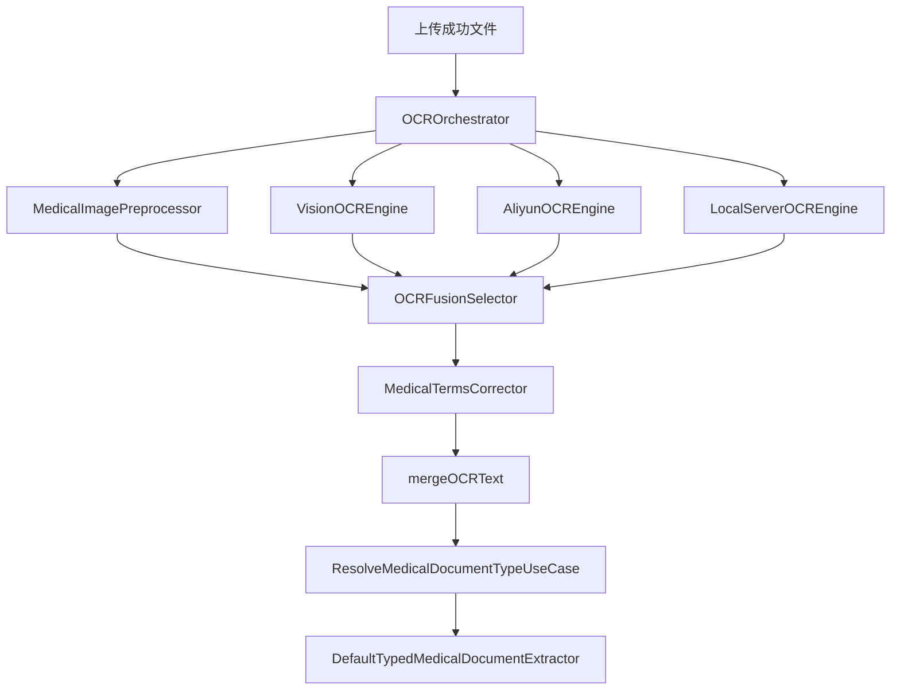
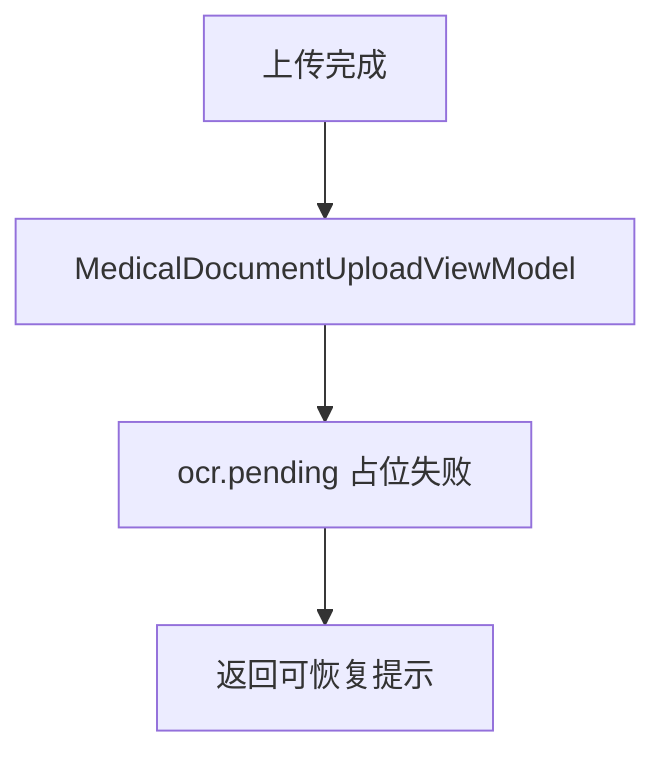
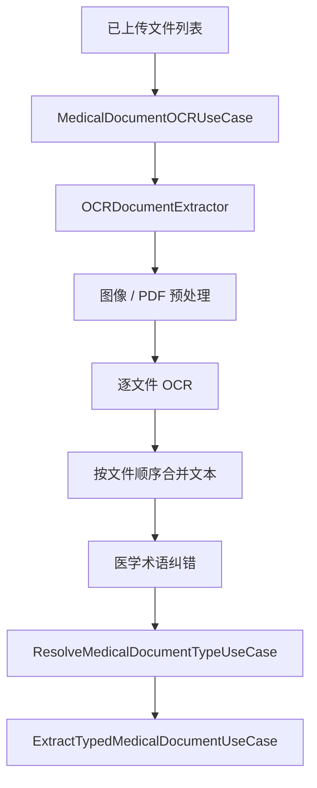

# HOS-MED-UPLOAD-0002 OCR 与文本合并 iOS 对齐工单

> 状态：已实施（待真机 OCR/PDF 验收）
> 范围：仅覆盖 AI 上传报告链路中的 `OCR` 与 `文本合并` 阶段。
> 硬性约束：只整理 HarmonyOS 侧的修复方案、目录结构、业务流程和验收口径，不修改 iOS 代码，也不修改服务器代码。
> 触发证据：`[MedicalDocumentUploadViewModel.ets](../../../entry/src/main/ets/Projects/Features/MedicalDocumentUpload/Presentation/MedicalDocumentUploadViewModel.ets)` 原 OCR 占位已替换为 `MedicalDocumentOCRUseCase`；类型识别走本地规则 `ResolveMedicalDocumentTypeUseCase`；结构化抽取仍为下一工单。
> 参考端：`SparkClient/SparkClient/Projects/Core/OCR/`、`SparkClient/SparkClient/Projects/Features/MedicalDocumentUpload/`。
> 当前端：`SparkClientHarmonyOS/entry/src/main/ets/Projects/Features/MedicalDocumentUpload/`、`Projects/Core/OCR/`。
> 衔接前序工单：`HOS-MED-UPLOAD-0001-入口装配与文件OSS上传iOS对齐工单.md`。
> 真机失败修复工单：`HOS-MED-UPLOAD-0004-OCR识别失败真机问题修复iOS对齐工单.md`。

## 1. 对标范围与结论

### 1.1 当前迁移阶段

当前 HarmonyOS 端已完成入口、选文件、OSS 上传，并已接通 OCR 编排、文本合并、医学术语纠错与本地类型识别。结构化抽取 / 附件绑定 / 保存仍属后续工单。

| 阶段 | iOS 目标职责 | HarmonyOS 当前事实 | 对齐结论 |
| --- | --- | --- | --- |
| OCR 与文本合并 | 对图片、PDF、扫描件做识别，按文件顺序合并文本，必要时做医学术语纠错，然后把合并文本交给类型识别 | 已建 `Projects/Core/OCR/`；`MedicalDocumentOCRUseCase` + `MedicalDocumentOCRTextMerger`；ViewModel 走真实 OCR 而非 `ocr.pending` | **已实现**（真机 Vision/PDF Kit 待验收） |
| OCR 后交接 | 输出稳定的 `mergedOCRText`、单文件识别结果、可恢复的 OCR 输入对象，供类型识别继续使用 | `pipelineOCRText` / `MedicalDocumentOCRResult` / checkpoint `ocr_done` / `type_resolved`；本地规则类型识别已接通 | **已实现**（AI 类型兜底与抽取待续） |

一句话结论：**HarmonyOS 当前已经接通本地 OCR 编排、文本合并和本地类型识别，但仍需要补齐 iOS 级别的多引擎并发、PDF 文本层真机验证、图像预处理效果验证和 AI 类型兜底衔接。** 本工单不再是纯待实现清单，而是实现后复核和补齐验收口径。

### 1.2 iOS 侧真实能力

iOS 这块不是单点 OCR，而是一个完整的小编排器：

| 组件 | iOS 目录 | 作用 |
| --- | --- | --- |
| OCR 编排器 | `SparkClient/SparkClient/Projects/Core/OCR/OCROrchestrator.swift` | 同时协调 Vision、本地服务、阿里云 OCR，收集多引擎输出并做融合 |
| 文档提取器 | `SparkClient/SparkClient/Projects/Core/OCR/OCRDocumentExtractor.swift` | 负责 PDF 文本层、扫描 PDF、图片缩略图转识别输入 |
| 图像预处理 | `SparkClient/SparkClient/Projects/Core/OCR/MedicalImagePreprocessor.swift` | 对医疗图片做纠偏、增强、降噪等预处理 |
| 识别结果融合 | `SparkClient/SparkClient/Projects/Core/OCR/OCRFusionSelector.swift` | 在多个引擎输出中选出最佳文本 |
| 医学术语纠错 | `SparkClient/SparkClient/Projects/Core/OCR/MedicalTermsCorrector.swift` | 对 OCR 文本做医学词汇纠错 |
| 类型化抽取入口 | `SparkClient/SparkClient/Projects/Features/MedicalDocumentUpload/Application/ExtractTypedMedicalDocumentUseCase.swift` | 统一入口：OCR → 类型识别 → 结构化提取 |
| 类型识别入口 | `SparkClient/SparkClient/Projects/Features/MedicalDocumentUpload/Application/ResolveMedicalDocumentTypeUseCase.swift` | 基于合并 OCR 文本判断单据类型 |
| 结构化抽取实现 | `SparkClient/SparkClient/Projects/Features/MedicalDocumentUpload/Infrastructure/DefaultTypedMedicalDocumentExtractor.swift` | 真正把 OCR 文本喂给 Prompt 和 AI Runtime，生成结构化数据 |
| Prompt 工厂 | `SparkClient/SparkClient/Projects/Features/MedicalDocumentUpload/Infrastructure/MedicalPromptFactory.swift` | 按文档类型生成 OCR/抽取 Prompt |
| 流式 JSON 解码 | `SparkClient/SparkClient/Projects/Features/MedicalDocumentUpload/Infrastructure/StructuredJSONStreamDecoder.swift` | 负责把 AI 流式输出转成稳定 JSON |
| 错误归一化 | `SparkClient/SparkClient/Projects/Features/MedicalDocumentUpload/Domain/MedicalExtractionErrorNormalizer.swift` | 把抽取失败变成可重试、可反馈的结构化错误 |

### 1.3 实现后偏差与遗漏复核

| 偏差/遗漏 | HarmonyOS 当前实现 | iOS 对标行为 | 修复/验收要求 |
| --- | --- | --- | --- |
| 多引擎并发 | `OCROrchestrator.ets` 已有 Vision、阿里云、本地服务引擎入口，但识别路径偏顺序收集 | iOS `OCROrchestrator` 使用多引擎并发收集后融合 | 补 `Promise.allSettled` 或等价并发策略，单引擎失败不拖垮整体 |
| PDF 文本层签名 | `OCRDocumentExtractor.ets` 已实现文本层优先和扫描件逐页 OCR，但 `getTextContent` 的 ArkTS 调用签名需真机复核 | iOS 明确先读 PDF 文本层，失败再渲染扫描页 OCR | 用 DevEco/真机验证 PDF Kit API，避免把函数对象字符串化为文本 |
| 图像预处理 | `MedicalImagePreprocessor.ets` 当前是入口透传 | iOS 有医疗图片预处理链路 | 至少补方向归一、压缩/增强策略或明确按平台能力降级 |
| 文本合并 | `MedicalDocumentOCRTextMerger` 已保留 `=== File N: name ===` 边界 | iOS 按文件/页顺序合并，并保留来源信息 | 保持边界并补多页 PDF 来源信息验收 |
| 医学术语纠错 | `MedicalTermsCorrector.ets` 已落地保守纠错 | iOS 纠错后再交给类型识别和抽取 | 继续扩充高频医学词，避免过度改写 |
| 类型识别衔接 | OCR 后已进入本地规则类型识别 | iOS 本地规则未命中后继续 AI 判定 | AI 类型兜底转入 `HOS-MED-UPLOAD-0003` |
| Vision 资源释放 | 真机日志出现 `Cannot read property release of undefined`，导致 `ocr_failed` | iOS 释放阶段不会覆盖 OCR 主流程，多引擎失败互相隔离 | 具体修复转入 `HOS-MED-UPLOAD-0004` |

## 2. 华为端目录设计

### 2.1 当前目录事实

```text
SparkClientHarmonyOS/entry/src/main/ets/
├── App/
├── Core/
│   ├── AI/
│   └── FileStorage/
├── Projects/
│   ├── App/
│   ├── Core/
│   │   ├── Networking/API/File/
│   │   └── Networking/API/OSS/
│   └── Features/
│       └── MedicalDocumentUpload/
│           ├── Application/
│           ├── Domain/
│           ├── Infrastructure/
│           └── Presentation/
```

当前问题是：`MedicalDocumentUpload` 里已经有上传、进度、结果壳，但没有独立的 OCR 编排目录，导致 OCR 能力被塞在 ViewModel 的占位分支里。

### 2.2 目标目录设计

```text
SparkClientHarmonyOS/entry/src/main/ets/
├── Projects/
│   ├── Core/
│   │   └── OCR/
│   │       ├── OCRModels.ets
│   │       ├── OCROrchestrator.ets
│   │       ├── OCRDocumentExtractor.ets
│   │       ├── OCRFusionSelector.ets
│   │       ├── MedicalImagePreprocessor.ets
│   │       ├── MedicalTermsCorrector.ets
│   │       └── OCRCredentialsAdapter.ets
│   └── Features/
│       └── MedicalDocumentUpload/
│           ├── Application/
│           │   ├── MedicalDocumentOCRUseCase.ets
│           │   ├── ResolveMedicalDocumentTypeUseCase.ets
│           │   └── ExtractTypedMedicalDocumentUseCase.ets
│           ├── Domain/
│           │   ├── MedicalDocumentOCRModels.ets
│           │   ├── MedicalDocumentOCRResult.ets
│           │   └── MedicalDocumentTypeResolution.ets
│           ├── Infrastructure/
│           │   ├── HarmonyMedicalDocumentOCRAdapter.ets
│           │   ├── HarmonyMedicalDocumentPDFExtractor.ets
│           │   └── MedicalDocumentOCRTextMerger.ets
│           └── Presentation/
│               └── MedicalDocumentUploadViewModel.ets
```

### 2.3 分层职责

| 层级 | 应放内容 | 禁止内容 |
| --- | --- | --- |
| Core/OCR | OCR 引擎、文档拆解、图像预处理、结果融合、术语纠错 | 业务保存、页面 UI、后端业务绑定 |
| Feature/Application | 用例编排、输入输出 DTO、类型识别串联 | 直接操作系统 OCR API |
| Feature/Infrastructure | HarmonyOS 适配器、PDF 解析、图片读取、文件句柄转换 | 业务规则、Prompt 规则 |
| Feature/Presentation | 进度、错误、状态切换、重试按钮 | OCR 具体实现 |

## 3. 分层职责与请求链路

### 3.1 iOS 真实业务流程



### 3.2 当前 HarmonyOS 链路



当前链路只到 B->C，没有 OCR 引擎、没有文档拆解、没有文本合并，也没有把结果交给类型识别。

### 3.3 目标 HarmonyOS 链路



### 3.4 业务边界

| 输入 | 输出 | 说明 |
| --- | --- | --- |
| 上传后的 `MedicalUploadLocalFile[]` | `MedicalDocumentOCRResult` | 保存单文件 OCR 文本和合并文本 |
| `MedicalDocumentOCRResult.mergedOCRText` | `MedicalDocumentTypeResolution` | 类型识别只依赖合并文本，不依赖 UI |
| `MedicalDocumentTypeResolution` | `MedicalDocumentTypedExtractionOutput` | 进入抽取阶段，继续后面业务闭环 |

## 4. 核心关键技术与实现方案

### 4.1 OCR 编排器修复方案

iOS 的 `OCROrchestrator` 是“多引擎并发 + 结果融合”的核心。HarmonyOS 先不要把 OCR 写死在 ViewModel，而是先抽一个业务服务门面，后面再把平台能力接进去。

```ts
// Pseudocode: Projects/Core/OCR/OCROrchestrator.ets
export interface OCRTextEngine {
  name: string
  recognize(imageData: ArrayBuffer, hints: OCRRecognitionHints): Promise<OCRTextOutput>
}

export class OCROrchestrator {
  constructor(
    private readonly config: OCRConfiguration,
    private readonly visionEngine: OCRTextEngine,
    private readonly aliyunEngine?: OCRTextEngine,
    private readonly localEngine?: OCRTextEngine,
    private readonly logger: Logger = new Logger()
  ) {}

  async recognize(input: OCRRecognitionInput): Promise<OCRRecognition> {
    const workingImage = input.applyPreprocess
      ? MedicalImagePreprocessor.preprocess(input.imageData)
      : input.imageData

    const outputs: OCRTextOutput[] = []
    outputs.push(await this.visionEngine.recognize(workingImage, input.hints))
    if (this.config.enableAliyunOCR && this.aliyunEngine) {
      outputs.push(await this.aliyunEngine.recognize(input.imageData, input.hints))
    }
    if (this.config.enableLocalOCR && this.localEngine) {
      outputs.push(await this.localEngine.recognize(input.imageData, input.hints))
    }
    return OCRFusionSelector.selectBest(outputs)
  }
}
```

### 4.2 文档提取方案

iOS 端不是只认图片，它会先判断 PDF 是否自带文本层。如果有文本层，就直接读取；没有文本层时，才把每页渲染成图片再 OCR。

```swift
// 参考端逻辑摘要
if let textLayer = extractPDFTextLayer(url), !textLayer.isEmpty {
    return OCRRecognition(text: textLayer, selectedEngine: "pdf_text_layer", outputs: ...)
}
return try await ocrScannedPDF(url: url, orchestrator: orchestrator, options: options)
```

HarmonyOS 的修复思路要保持同样顺序：

| 顺序 | 规则 |
| --- | --- |
| 1 | 如果是 PDF，优先尝试文本层抽取 |
| 2 | 文本层不存在或为空时，按页渲染后 OCR |
| 3 | 图片文件直接走 OCR 引擎 |
| 4 | 每个文件的 OCR 结果先保存，再统一合并 |

### 4.3 文本合并方案

合并不是简单 `join("\n")`，至少要保留文件边界，否则后续类型识别很容易混淆不同页、不同文件的内容。

建议的合并规则：

| 规则 | 说明 |
| --- | --- |
| 保留文件顺序 | 按用户上传顺序合并，不能乱序 |
| 保留来源标题 | 每个文件前加文件名和页码信息 |
| 统一换行 | 连续空行压缩，避免 Prompt 过长 |
| 保留引擎元数据 | 记录是 Vision、OCR SDK 还是 PDF 文本层 |
| 记录单文件结果 | 便于重试、断点恢复和问题定位 |

```ts
// Pseudocode: MedicalDocumentOCRTextMerger.ets
export function mergeOCRResults(results: MedicalFileOCRResult[]): string {
  return results.map((item, index) => {
    const header = `=== File ${index + 1}: ${item.displayName} ===`
    const body = normalizeBlankLines(item.text)
    return `${header}\n${body}`
  }).join('\n\n')
}
```

### 4.4 医学术语纠错方案

iOS 在 OCR 后会用 `MedicalTermsCorrector` 做轻量纠错，目标不是“改写内容”，而是尽量把 OCR 里容易错读的医学词校正回来，给类型识别和 Prompt 更干净的输入。

HarmonyOS 的修复路径：

| 处理点 | 建议 |
| --- | --- |
| 简单替换 | 常见医院、科室、药品名的字符级纠错 |
| 结构化词典 | 用固定词典校正高频医学实体 |
| 保守策略 | 不要大改句子，只修明显错字 |
| 可回溯 | 保留原始 OCR 文本和纠错后文本 |

### 4.5 ViewModel 修复方案

当前 `MedicalDocumentUploadViewModel` 在 OCR 分支里直接抛出 `medical.upload.ocr.pending`。修复后应该变成“先调 OCR 服务，再走类型识别”，只在服务未配置时才报 capability 缺失。

```ts
// Pseudocode: Projects/Features/MedicalDocumentUpload/Presentation/MedicalDocumentUploadViewModel.ets
if (!this.capabilities.ocr || !this.ocrUseCase) {
  this.persistCheckpoint('ocr_pending')
  throw new Error('OCR_PENDING')
}

const ocrResult = await this.ocrUseCase.execute({
  uploadSessionId: this.uploadSessionId,
  memberId: this.selectedMemberID,
  files: this.selectedFiles
})

this.pipelineOCRText = ocrResult.mergedOCRText
const resolution = await this.resolveTypeUseCase.execute(
  this.selectedKind,
  ocrResult.mergedOCRText
)
```

### 4.6 HarmonyOS 官方能力对应

| 能力 | 作用 | 本工单用法 |
| --- | --- | --- |
| 文件选择 | 读取图片 / PDF | 作为 OCR 输入的上游，不在 OCR 内直接做 UI |
| 应用私有文件访问 | 文件缓存和临时转换 | 把外部文件 URI 转成可读私有文件后再识别 |
| 页面承载 | OCR 进度与结果展示 | 只展示状态，不实现 OCR 逻辑 |
| 生命周期恢复 | 中断后重新进入 | 依赖 checkpoint 和 `MedicalDocumentOCRInput` 恢复 |

## 5. 接口契约与数据模型

### 5.1 iOS 侧核心数据模型

| 模型 | 位置 | 说明 |
| --- | --- | --- |
| `OCRRequestOptions` | `SparkClient/SparkClient/Projects/Core/OCR/OCRModels.swift` | 控制是否预处理、是否纠错、候选数等 |
| `OCRRecognitionHints` | `SparkClient/SparkClient/Projects/Core/OCR/OCRModels.swift` | OCR 引擎提示信息 |
| `OCRTextOutput` | `SparkClient/SparkClient/Projects/Core/OCR/OCRModels.swift` | 单引擎输出 |
| `OCRRecognition` | `SparkClient/SparkClient/Projects/Core/OCR/OCRModels.swift` | 多引擎融合后的识别结果 |
| `MedicalPromptInput` | `SparkClient/SparkClient/Projects/Features/MedicalDocumentUpload/Infrastructure/MedicalPromptFactory.swift` | 类型识别与抽取 Prompt 输入 |

### 5.2 HarmonyOS 目标模型

```ts
// Pseudocode: Projects/Features/MedicalDocumentUpload/Domain/MedicalDocumentOCRModels.ets
export class MedicalDocumentOCRInput {
  uploadSessionId: string = ''
  memberId: number = 0
  selectedKind: MedicalDocumentKind = MedicalDocumentKind.AUTO
  files: MedicalAttachmentInput[] = []
  reRecognizeAll: boolean = false
}

export class MedicalFileOCRResult {
  localId: string = ''
  displayName: string = ''
  engine: string = ''
  text: string = ''
  confidence?: number
}

export class MedicalDocumentOCRResult {
  mergedOCRText: string = ''
  fileResults: MedicalFileOCRResult[] = []
  selectedEngine: string = ''
  correctedText: string = ''
}
```

### 5.3 交接契约

| 阶段 | 输入 | 输出 | 约束 |
| --- | --- | --- | --- |
| 上传 -> OCR | 已上传文件列表 | `MedicalDocumentOCRInput` | 不再依赖 UI 状态 |
| OCR -> 类型识别 | `mergedOCRText` | `MedicalDocumentTypeResolution` | 只依赖合并文本和选定类型 |
| 类型识别 -> 抽取 | 类型 + OCR 文本 | `MedicalDocumentTypedExtractionOutput` | 后续工单接管 |

## 6. iOS-HarmonyOS 功能对照矩阵

| 功能点 | iOS 代码/行为 | HarmonyOS 当前 | 差距 | 修复动作 | 对齐状态 |
| --- | --- | --- | --- | --- | --- |
| OCR 编排 | `OCROrchestrator` 并发调度多个 OCR 引擎 | `Projects/Core/OCR/OCROrchestrator.ets` + `HarmonyVisionOCREngine` | 远端引擎默认关闭 | 新建 Core/OCR，Vision 优先 | **已实现** |
| PDF 文本层 | `OCRDocumentExtractor` 优先读文本层 | `OCRDocumentExtractor` + `HarmonyMedicalDocumentPDFExtractor`（PDF Kit） | 扫描件依赖 `getPagePixelMap` 真机能力 | 文本层优先，再逐页 OCR | **已实现**（待真机验收） |
| 文本合并 | 多文件识别后按顺序合并 | `MedicalDocumentOCRTextMerger` | 无 | 保留 `=== File N ===` 边界 | **已实现** |
| 医学词纠错 | `MedicalTermsCorrector` 修正 OCR 误读 | `MedicalTermsCorrector.ets` | 词典可继续扩充 | 保守 pattern + fuzzy | **已实现** |
| 类型识别入口 | `ResolveMedicalDocumentTypeUseCase` | 本地规则 + manual；AI 兜底未接 | AI 路径待续 | OCR 后直接调用 | **部分实现** |
| 抽取前置输入 | `ExtractTypedMedicalDocumentUseCase.mergeOCRText` | `mergeOCRText` / `resolveType` 已通；`extractStructured` 抛 `EXTRACT_PENDING` | 抽取本体待续 | 输出 `MedicalDocumentOCRResult` | **部分实现** |

## 7. 示例工程与官方文档参考结论

### 7.1 iOS 可直接对照的实现点

| iOS 文件 | 值得复用的结论 |
| --- | --- |
| `OCROrchestrator.swift` | OCR 应该是可注入、可并发、可融合的服务，不应该放在 UI 层 |
| `OCRDocumentExtractor.swift` | PDF 需要区分文本层和扫描件 |
| `DefaultTypedMedicalDocumentExtractor.swift` | OCR 结果要先被合并，再进入类型识别和 AI 抽取 |
| `MedicalPromptFactory.swift` | OCR 的最终目标是为 Prompt 和结构化抽取服务 |
| `StructuredJSONStreamDecoder.swift` | OCR 之后的抽取阶段必须保留可解码、可重试的边界 |

### 7.2 HarmonyOS 端参考点

| 文件 | 作用 |
| --- | --- |
| `SparkClientHarmonyOS/entry/src/main/ets/Projects/Features/MedicalDocumentUpload/Presentation/MedicalDocumentUploadViewModel.ets` | 当前 OCR pending 占位点 |
| `SparkClientHarmonyOS/entry/src/main/ets/Projects/Features/MedicalDocumentUpload/Domain/SupportingModels.ets` | 已经有 OCR 输入和流转模型入口 |
| `SparkClientHarmonyOS/entry/src/main/ets/Projects/Features/Chat/Infrastructure/HarmonyVisionOCRAdapter.ets` | 只能当聊天场景参考，不能直接复用成医疗 OCR 主实现 |

### 7.3 结论

OCR 这层最重要的不是“识别 API 名字”，而是把医疗文档的识别过程做成一条稳定的业务链路：**文件拆解 -> OCR -> 合并 -> 纠错 -> 类型识别**。只要这层边界稳定，后面抽取、保存和附件绑定就都能顺着接上。

## 8. 实施拆分与验收

### 8.1 实施拆分

| 子任务 | 目标文件 | 说明 |
| --- | --- | --- |
| T1 | `Projects/Core/OCR/OCRModels.ets` | ✅ 已完成 |
| T2 | `Projects/Core/OCR/OCROrchestrator.ets` | ✅ 已完成 |
| T3 | `Projects/Core/OCR/OCRDocumentExtractor.ets` | ✅ 已完成 |
| T4 | `Projects/Core/OCR/MedicalImagePreprocessor.ets` | ✅ 入口已落地（当前透传） |
| T5 | `Projects/Core/OCR/OCRFusionSelector.ets` | ✅ 已完成 |
| T6 | `Projects/Core/OCR/MedicalTermsCorrector.ets` | ✅ 已完成 |
| T7 | `MedicalDocumentOCRUseCase.ets` + `ResolveMedicalDocumentTypeUseCase.ets` | ✅ OCR+本地类型已串联 |
| T8 | `MedicalDocumentUploadViewModel.ets` | ✅ 已替换 `ocr.pending` 占位 |
| T9 | `Projects/Core/OCR/OCROrchestrator.ets` | 待补多引擎并发收集与单引擎失败容错 |
| T10 | `Projects/Core/OCR/OCRDocumentExtractor.ets` | 待真机验证 PDF `getTextContent` 调用签名和扫描件逐页 OCR |
| T11 | `Projects/Core/OCR/MedicalImagePreprocessor.ets` | 待补真实图像增强或明确平台降级策略 |

### 8.2 验收标准

| 验收项 | 标准 |
| --- | --- |
| OCR 入口 | 上传完成后能进入真实 OCR，而不是直接报 `ocr.pending` |
| PDF 处理 | 可文本 PDF 直接读文本层，扫描件 PDF 可逐页识别 |
| 图片处理 | 图片文件能独立 OCR，且按顺序合并 |
| 文本合并 | 输出包含文件边界信息，且可作为类型识别输入 |
| 结果可恢复 | OCR 中断后能恢复到 `MedicalDocumentOCRInput` |
| 下游交接 | OCR 完成后能进入类型识别，不再停在 ViewModel 占位分支 |
| 多引擎容错 | Vision、阿里云、本地服务任一失败时，其他可用结果仍能参与融合 |
| PDF 真机验收 | 可文本 PDF 不应输出函数名/对象字符串；扫描件 PDF 能按页识别 |
| 图像预处理 | 预处理链路有可观察效果或有明确降级记录，不再只是静默透传 |

### 8.3 推荐推进顺序

```text
T1 OCR 模型
  -> T2 OCR 编排器
    -> T3 PDF 提取器
      -> T4 图像预处理
        -> T5 结果融合
          -> T6 医学术语纠错
            -> T7 用例串联
              -> T8 ViewModel 接入
                -> T9 多引擎并发容错
                  -> T10 PDF 真机验收
                    -> T11 图像预处理补强
```

## 9. 风险与待确认项

| 风险 | 影响 | 建议 |
| --- | --- | --- |
| 多引擎仍按顺序执行 | 慢引擎拖慢整体，单引擎失败影响用户体感 | 补并发收集与失败隔离 |
| PDF 文本层调用签名未经真机验证 | 可能把函数对象或空文本误当成识别结果 | 用真实可文本 PDF、扫描 PDF 分别验收 |
| PDF 文本层和扫描件混用 | 识别质量不稳定 | 保持 PDF 文本层优先，文本层为空才逐页 OCR |
| 合并文本过长 | Prompt 超长、类型识别不稳定 | 在合并前做空行压缩和段落裁剪 |
| 纠错过度 | 医学原文被错误改写 | 只做保守替换，保留原始文本 |
| 图像预处理当前透传 | 低质量照片识别率低于 iOS | 补方向归一、压缩/增强或明确降级 |

### 待产品/技术确认

| 问题 | 默认建议 |
| --- | --- |
| OCR 是否优先本地系统能力 | 优先本地能力，远端能力作为补充 |
| 是否需要 OCR 结果预览页 | 需要，至少展示文件边界和合并文本 |
| 是否支持多文件混合上传 | 支持，但文本合并必须保留来源 |
| OCR 和类型识别是否分两步可重试 | 建议分开，便于排障和断点恢复 |

### 下一阶段工单边界

本工单完成后，下一张工单应继续对齐：

```text
type_recognition
  -> extract
    -> attachment_binding
      -> save
```

重点将落在 `ResolveMedicalDocumentTypeUseCase`、`DefaultTypedMedicalDocumentExtractor`、`MedicalPromptFactory`、`StructuredJSONStreamDecoder`、`MedicalExtractionErrorNormalizer` 和 `SaveTypedMedicalDocumentUseCase`。
