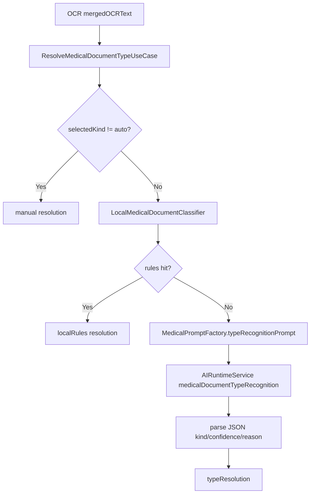
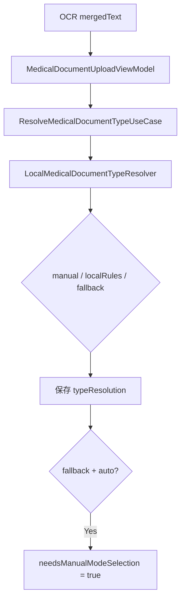
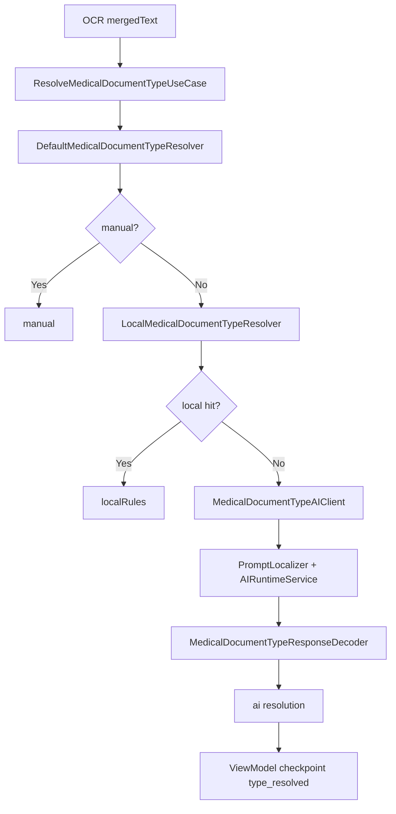

# HOS-MED-UPLOAD-0003 医疗文档类型判定 iOS 对齐工单

> 状态：已实施（AI 兜底依赖账号 Runtime 配置；真机待验）。
> 范围：仅覆盖 AI 上传报告链路中的 `type_recognition` 阶段，即 OCR 文本完成后判断文档类型。
> 硬性约束：本工单整理 HarmonyOS 侧修复方案、目录结构、业务流程、关键代码与验收口径；不修改 iOS 代码，不修改服务器代码。
> 触发背景：已完成 `LocalMedicalDocumentTypeResolver` + ViewModel 串联；本轮补齐 `DefaultMedicalDocumentTypeResolver`、AI Client/Decoder、source 收敛与规则增强。
> 前置依赖：`HOS-MED-UPLOAD-0002-OCR与文本合并iOS对齐工单.md` 输出稳定 `mergedOCRText`。
> 后续衔接：结构化抽取、结果页、附件绑定与保存工单。

## 1. 对标范围与结论

### 1.1 当前迁移阶段

医疗文档类型判定已对齐 iOS 的 `manual -> localRules -> ai -> ai_fallback_default` 三段式（含失败降级）。

| 阶段 | iOS 目标职责 | HarmonyOS 当前事实 | 对齐结论 |
| --- | --- | --- | --- |
| 用户手动选择类型 | 用户选择非 `auto` 时直接采用该类型 | `DefaultMedicalDocumentTypeResolver` / Factory.manual | **已对齐** |
| OCR 后本地规则判断 | 对 OCR 文本做六类文档加权特征判定 | `LocalMedicalDocumentTypeResolver` 已增强标题/结构/互斥 | **已对齐**（词典可持续扩充） |
| AI 语义兜底 | 本地规则未命中时调用 AI，返回 JSON | `MedicalDocumentTypeAIClient` + `PromptLocalizer` + `AIRuntimeService` | **已对齐**（需账号 AI 配置） |
| 判定结果交接 | ViewModel 保存 `typeResolution` | checkpoint `type_resolved`；低置信 / `ai_fallback_default` 触发确认 | **已对齐** |

一句话结论：**HarmonyOS 医疗文档类型判定已经不是“只有枚举和 UI”，而是“本地规则链路已接通，AI 判定链路未接通”。** 本工单要继续对齐 iOS 的 `manual -> localRules -> ai` 三段式判定。

### 1.2 iOS 侧真实能力

iOS 的核心实现位于：

| iOS 文件 | 职责 |
| --- | --- |
| `DefaultMedicalDocumentTypeResolver.swift` | 默认类型判定服务，包含手动选择、本地规则和 AI 兜底 |
| `ResolveMedicalDocumentTypeUseCase.swift` | 类型判定用例入口 |
| `MedicalPromptFactory.swift` | 生成类型识别 Prompt |
| `Core/AIRuntime/PromptLocalizer.swift` | 维护医疗文档类型识别 Prompt 文案 |
| `MedicalDocumentTypedModels.swift` | `MedicalDocumentTypeResolution` 与 `Source` 枚举 |
| `MedicalDocumentUploadViewModel.swift` | OCR 后进入 `typeRecognition` 步骤并保存结果 |

iOS 实际流程：

```text
if selectedKind != auto:
  return manual selectedKind

if local rules hit:
  return localRules result

prompt = MedicalPromptFactory.typeRecognitionPrompt(ocrText)
aiText = AIRuntimeService.generateTextStream(
  scenario: medicalDocumentTypeRecognition,
  reasoning: disabled
)
return parseAIResponse(aiText) ?? ai_fallback_default medicalReport
```

### 1.3 HarmonyOS 当前实现事实

| HarmonyOS 文件 | 当前事实 |
| --- | --- |
| `MedicalDocumentKind` / `MedicalDocumentKindOption` | 已覆盖 `auto`、病历、体检、检查、处方、用药计划、家庭药箱 |
| `LocalMedicalDocumentTypeResolver.ets` | 委托 `MedicalDocumentClassifier`（对齐 iOS LocalMedicalDocumentClassifier + 参考包）；`resolveAutoOnly`：>=30 强命中 / >=10 弱命中 |
| `MedicalDocumentClassifier.ets` | 六类 DetectorConfig：加权特征 + additionalScoring 互斥；`classify()` 输出六类得分 |
| `ResolveMedicalDocumentTypeUseCase.ets` | 包装 `DefaultMedicalDocumentTypeResolver`（manual → localRules → AI） |
| `MedicalDocumentUploadAssembly.ets` | 已注入 Default resolver + AI Client；`capabilities.typeRecognition = true` |
| `MedicalDocumentUploadViewModel.ets` | OCR 后 `TYPE_RECOGNITION`；低置信 / `ai_fallback_default` / 弱规则触发确认 |
| `Core/AI/Domain/AIConfigModels.ets` | 已存在 `AIScenario.MEDICAL_DOCUMENT_TYPE_RECOGNITION` |
| `Core/AI/Runtime/PromptLocalizer.ets` | 已存在 `medicalDocumentTypeRecognitionPrompt(ocrText)` |
| `Core/AI/Runtime/StructuredRuntimeClient.ets` | 已存在 `recognizeMedicalDocumentType()`，但没有接入本功能用例 |

## 2. 华为端目录设计

### 2.1 当前目录事实

```text
SparkClientHarmonyOS/entry/src/main/ets/
├── Core/
│   └── AI/
│       ├── Domain/AIConfigModels.ets
│       └── Runtime/
│           ├── PromptLocalizer.ets
│           └── StructuredRuntimeClient.ets
└── Projects/
    └── Features/
        └── MedicalDocumentUpload/
            ├── Application/
            │   ├── ResolveMedicalDocumentTypeUseCase.ets
            │   └── ExtractTypedMedicalDocumentUseCase.ets
            ├── Domain/
            │   └── MedicalDocumentTypedModels.ets
            ├── Infrastructure/
            │   ├── MedicalDocumentClassifier.ets
            │   └── LocalMedicalDocumentTypeResolver.ets
            └── Presentation/
                └── MedicalDocumentUploadViewModel.ets
```

当前目录基本合理，但命名上 `LocalMedicalDocumentTypeResolver` 只覆盖本地规则，不能承载完整默认 resolver。继续对齐 iOS 时建议保留本地规则类，再新增默认编排类。

### 2.2 目标目录设计

```text
SparkClientHarmonyOS/entry/src/main/ets/Projects/Features/MedicalDocumentUpload/
├── Application/
│   └── ResolveMedicalDocumentTypeUseCase.ets
├── Domain/
│   ├── MedicalDocumentTypedModels.ets
│   └── MedicalDocumentTypeResolverProtocol.ets
├── Infrastructure/
│   ├── DefaultMedicalDocumentTypeResolver.ets
│   ├── LocalMedicalDocumentTypeResolver.ets
│   ├── MedicalDocumentClassifier.ets
│   ├── MedicalDocumentTypeAIClient.ets
│   └── MedicalDocumentTypeResponseDecoder.ets
└── Presentation/
    └── MedicalDocumentUploadViewModel.ets
```

### 2.3 分层职责

| 层级 | 应放内容 | 禁止内容 |
| --- | --- | --- |
| Domain | 类型判定结果模型、source 枚举、resolver 协议 | Prompt 拼接、AI Runtime 调用 |
| Application | `ResolveMedicalDocumentTypeUseCase` 编排入口 | 直接写关键词规则 |
| Infrastructure | 本地规则、AI 客户端、JSON 解码、kind 映射 | ArkUI 状态和页面提示 |
| Presentation | 展示判定结果、fallback 时请求用户确认 | 创建 AI Runtime 或 Prompt |

## 3. 分层职责与请求链路

### 3.1 iOS 目标链路



### 3.2 HarmonyOS 当前链路



当前链路的关键差距是：`fallback` 是客户端默认 `medicalReport`，不是 iOS 那种 AI 语义兜底。

### 3.3 目标 HarmonyOS 链路



### 3.4 业务边界

| 输入 | 输出 | 约束 |
| --- | --- | --- |
| `selectedKind` + `mergedOCRText` | `MedicalDocumentTypeResolution` | 空文本必须失败，不应静默默认 |
| `manual` 判定 | confidence `1` | 用户显式选择优先于 AI |
| 本地规则命中 | source `localRules` | 置信度和 reason 必须可展示、可诊断 |
| AI 判定 | source `ai` | 仅接收白名单 kind；JSON 解码失败要降级 |
| AI 失败降级 | `medicalReport` + low confidence | 应保留 `ai_fallback_default` 或等价 reason |

## 4. 核心关键技术与实现方案

### 4.1 新增默认 Resolver

当前 `ResolveMedicalDocumentTypeUseCase` 直接依赖 `LocalMedicalDocumentTypeResolver`。建议引入 `DefaultMedicalDocumentTypeResolver`，让它负责完整三段式策略。

```ts
// Projects/Features/MedicalDocumentUpload/Infrastructure/DefaultMedicalDocumentTypeResolver.ets
export class DefaultMedicalDocumentTypeResolver {
  constructor(
    private readonly localResolver: LocalMedicalDocumentTypeResolver,
    private readonly aiClient: MedicalDocumentTypeAIClient
  ) {}

  async resolve(
    selectedKind: MedicalDocumentKind,
    mergedOCRText: string,
    cancellationToken?: CancellationToken
  ): Promise<MedicalDocumentTypeResolution> {
    if (selectedKind !== MedicalDocumentKind.AUTO) {
      return MedicalDocumentTypeResolutionFactory.manual(selectedKind);
    }

    const local = this.localResolver.resolveAutoOnly(mergedOCRText);
    if (local !== undefined) {
      return local;
    }

    const ai = await this.aiClient.recognize(mergedOCRText, cancellationToken);
    if (ai !== undefined) {
      return ai;
    }

    return MedicalDocumentTypeResolutionFactory.aiFallbackDefault();
  }
}
```

### 4.2 AI Client 接入现有 Runtime

HarmonyOS 已有 `AIScenario.MEDICAL_DOCUMENT_TYPE_RECOGNITION` 和 `PromptLocalizer.medicalDocumentTypeRecognitionPrompt()`，不要另起一套 Prompt 常量。推荐让医疗上传 Feature 通过薄适配器消费 Core AI。

```ts
// Projects/Features/MedicalDocumentUpload/Infrastructure/MedicalDocumentTypeAIClient.ets
export class MedicalDocumentTypeAIClient {
  constructor(
    private readonly runtimeService: AIRuntimeService,
    private readonly promptLocalizer: PromptLocalizer,
    private readonly decoder: MedicalDocumentTypeResponseDecoder,
    private readonly accountIdProvider: AccountIdProvider
  ) {}

  async recognize(
    mergedOCRText: string,
    cancellationToken?: CancellationToken
  ): Promise<MedicalDocumentTypeResolution | undefined> {
    const prompt = this.promptLocalizer.medicalDocumentTypeRecognitionPrompt(mergedOCRText);
    const text = await this.runtimeService.generateText({
      accountId: this.accountIdProvider.requireAccountId(),
      scenario: AIScenario.MEDICAL_DOCUMENT_TYPE_RECOGNITION,
      messages: [{ role: 'user', content: prompt }],
      reasoning: 'disabled',
      cancellationToken
    });
    return this.decoder.decode(text);
  }
}
```

### 4.3 AI JSON 解码与 kind 映射

iOS 会剥离 Markdown 代码块，并只接受白名单类型。HarmonyOS 也要保持这个边界，避免模型输出中文说明或未知类型时污染后续抽取。

```ts
// Projects/Features/MedicalDocumentUpload/Infrastructure/MedicalDocumentTypeResponseDecoder.ets
type RawTypeRecognitionResponse = {
  kind?: string
  confidence?: number
  reason?: string
}

export class MedicalDocumentTypeResponseDecoder {
  decode(rawText: string): MedicalDocumentTypeResolution | undefined {
    const jsonText = this.stripCodeFence(rawText).trim();
    const parsed = JSON.parse(jsonText) as RawTypeRecognitionResponse;
    const kind = this.mapKind(parsed.kind ?? '');
    if (kind === undefined) {
      return undefined;
    }

    const resolution = new MedicalDocumentTypeResolution();
    resolution.kind = kind;
    resolution.kindLabel = MedicalDocumentKindFormatter.label(kind);
    resolution.source = MedicalDocumentTypeResolutionSource.AI;
    resolution.sourceLabel = 'AI 判定';
    resolution.confidence = this.clamp(parsed.confidence ?? 0.4);
    resolution.reason = parsed.reason ?? 'ai_type_recognition';
    return resolution;
  }

  private mapKind(raw: string): MedicalDocumentKind | undefined {
    switch (raw.trim().toLowerCase()) {
      case 'case_document':
        return MedicalDocumentKind.CASE_DOCUMENT;
      case 'health_exam_report':
        return MedicalDocumentKind.HEALTH_EXAM_REPORT;
      case 'medical_report':
        return MedicalDocumentKind.MEDICAL_REPORT;
      case 'prescription':
        return MedicalDocumentKind.PRESCRIPTION;
      case 'medication_plan':
      case 'medication':
        return MedicalDocumentKind.MEDICATION_PLAN;
      case 'medicine_box':
        return MedicalDocumentKind.MEDICINE_BOX;
      default:
        return undefined;
    }
  }
}
```

### 4.4 source 类型收敛

iOS `MedicalDocumentTypeResolution.Source` 只有 `manual`、`localRules`、`ai`。HarmonyOS 当前模型里 `source` 是字符串，且本地 resolver 会返回 `fallback`。建议改成严格常量或枚举，避免 UI、checkpoint 和后续抽取各自猜字符串。

```ts
export enum MedicalDocumentTypeResolutionSource {
  MANUAL = 'manual',
  LOCAL_RULES = 'localRules',
  AI = 'ai'
}

export class MedicalDocumentTypeResolution {
  kind: MedicalDocumentKind = MedicalDocumentKind.MEDICAL_REPORT;
  kindLabel: string = '';
  source: MedicalDocumentTypeResolutionSource = MedicalDocumentTypeResolutionSource.LOCAL_RULES;
  sourceLabel: string = '';
  confidence: number = 0;
  reason: string = '';
}
```

如果产品仍希望保留“需要用户确认”的状态，不建议用 `source = fallback` 表达；更稳的是给 ViewModel 增加 UI 态：

```ts
needsManualModeSelection = resolution.confidence < 0.5 || resolution.reason === 'ai_fallback_default';
```

### 4.5 本地规则补齐方向

当前 HarmonyOS 本地关键词规则已经覆盖六类，但 iOS 的规则更细：有互斥、组合特征、英文关键词、特殊标题和权重阈值。建议不要一次性堆大词典，而是先按误判风险补齐。

| 类型 | 需要重点补的规则 |
| --- | --- |
| 病历资料 `caseDocument` | 入院记录、出院小结、病程记录、主诉、现病史、既往史、诊断经过 |
| 体检报告 `healthExamReport` | 健康体检、总检结论、一般检查、体检编号、建议复查、体检中心 |
| 医疗检查报告 `medicalReport` | 检验报告、影像报告、病理报告、项目/结果/参考范围、检查所见 |
| 处方 `prescription` | Rp、处方笺、剂量、用法、开方医生、药房、取药 |
| 用药计划 `medicationPlan` | 服药计划、每日、早中晚、疗程、提醒、长期用药 |
| 家庭药箱 `medicineBox` | 药品清单、库存、有效期、批号、剩余数量、家庭药箱 |

### 4.6 ViewModel 接入要求

ViewModel 已经能在 OCR 后进入类型识别。后续修复不要把 AI 逻辑塞回 ViewModel，只替换 `ResolveMedicalDocumentTypeUseCase` 的依赖装配。

```ts
const resolution = await this.resolveTypeUseCase.execute(
  this.selectedKind,
  mergedText,
  this.cancellationToken
);
this.typeResolution = resolution;

if (this.selectedKind === MedicalDocumentKind.AUTO) {
  this.selectedKind = resolution.kind;
}

this.needsManualModeSelection =
  resolution.confidence < 0.5 || resolution.reason === 'ai_fallback_default';
```

## 5. 接口契约与数据模型

### 5.1 类型输入输出契约

| 名称 | 字段 | 说明 |
| --- | --- | --- |
| `ResolveMedicalDocumentTypeInput` | `selectedKind`、`mergedOCRText`、`accountId`、`cancellationToken` | `accountId` 仅 AI 路径需要 |
| `MedicalDocumentTypeResolution` | `kind`、`kindLabel`、`source`、`sourceLabel`、`confidence`、`reason` | checkpoint 和结果页共用 |
| `MedicalDocumentTypeAIResponse` | `kind`、`confidence`、`reason` | AI 返回 JSON，只允许白名单 |

### 5.2 文档类型白名单

| AI JSON kind | HarmonyOS enum | iOS enum 语义 |
| --- | --- | --- |
| `case_document` | `CASE_DOCUMENT` | 病历资料 |
| `health_exam_report` | `HEALTH_EXAM_REPORT` | 体检报告 |
| `medical_report` | `MEDICAL_REPORT` | 医疗检查报告 |
| `prescription` | `PRESCRIPTION` | 处方 |
| `medication_plan` | `MEDICATION_PLAN` | 用药计划 |
| `medicine_box` | `MEDICINE_BOX` | 家庭药箱 |

### 5.3 错误和降级语义

| 场景 | 建议行为 |
| --- | --- |
| OCR 文本为空 | 抛出业务错误，不进入类型判定 |
| 用户手动选择 | 直接返回 `manual`，不调用 AI |
| 本地规则高置信命中 | 返回 `localRules`，不调用 AI |
| 本地规则低置信或未命中 | 调用 AI |
| AI 返回未知 kind | 降级 `medicalReport`，reason `ai_fallback_default` |
| AI 调用失败 | 若允许自动降级，返回低置信 `medicalReport` 并提示用户确认；否则抛可重试错误 |

## 6. iOS-HarmonyOS 功能对照矩阵

| 功能点 | iOS 代码/行为 | HarmonyOS 当前 | 差距 | 修复动作 | 对齐状态 |
| --- | --- | --- | --- | --- | --- |
| 手动选择优先 | 非 auto 直接返回用户选择 | 已实现 | 无 | 保持现状 | **已对齐** |
| 六类本地规则 | `LocalMedicalDocumentClassifier` 多维权重 | `MedicalDocumentClassifier` + `LocalMedicalDocumentTypeResolver` | 词典可继续扩充 | 已按参考包/iOS 重构 DetectorConfig | **已对齐** |
| AI 兜底 | 本地未命中后调用 AI Runtime | `MedicalDocumentTypeAIClient` 已注入 | 依赖账号 AI bootstrap | Default resolver + Assembly | **已对齐** |
| JSON 解码 | 剥离代码块，解析 `kind/confidence/reason` | `MedicalDocumentTypeResponseDecoder` | 无 | 白名单 + fenced JSON | **已对齐** |
| Source 语义 | `manual/localRules/ai` enum | `MedicalDocumentTypeResolutionSource` | 无 | fallback 改为 reason | **已对齐** |
| ViewModel 串联 | OCR 后 typeRecognition checkpoint | 已串联；低置信确认 | 无 | use case 层替换依赖 | **已对齐** |

## 7. 示例工程与官方文档参考结论

### 7.1 本项目可复用能力

| 能力 | 现有位置 | 复用结论 |
| --- | --- | --- |
| AI 场景枚举 | `Core/AI/Domain/AIConfigModels.ets` | 直接使用 `MEDICAL_DOCUMENT_TYPE_RECOGNITION` |
| Prompt 本地化 | `Core/AI/Runtime/PromptLocalizer.ets` | 直接使用 `medicalDocumentTypeRecognitionPrompt()` |
| 结构化 Runtime | `Core/AI/Runtime/StructuredRuntimeClient.ets` | 可参考 `recognizeMedicalDocumentType()`，但建议 Feature 层加专用 adapter |
| 上传 ViewModel 流程 | `MedicalDocumentUploadViewModel.ets` | 保持 OCR 后调用 use case，不把 AI 细节放进 UI |

### 7.2 官方能力结论

医疗文档类型判定本身不依赖新的 HarmonyOS 系统 Kit。平台相关能力已经在 OCR 工单覆盖，本工单主要复用项目内 `Core/AI/Runtime` 和账号级 AI 配置。实施前需要确认目标账号是否已完成 AI Runtime bootstrap，否则 AI 兜底要给出“可重试/需手动选择”的 UI 降级。

### 7.3 与 OCR 工单的边界

`0002` 只保证 `mergedOCRText` 稳定输出；`0003` 不重新处理图片/PDF，也不重新合并文本。类型判定只消费 OCR 结果，不持有文件句柄。

## 8. 实施拆分与验收

### 8.1 实施拆分

| 子任务 | 目标文件 | 说明 |
| --- | --- | --- |
| T1 | `Domain/MedicalDocumentTypeResolverProtocol.ets` | ✅ |
| T2 | `Infrastructure/MedicalDocumentClassifier.ets` + `LocalMedicalDocumentTypeResolver.ets` | ✅ 参考包对齐重构 |
| T3 | `Infrastructure/MedicalDocumentTypeResponseDecoder.ets` | ✅ |
| T4 | `Infrastructure/MedicalDocumentTypeAIClient.ets` | ✅ |
| T5 | `Infrastructure/DefaultMedicalDocumentTypeResolver.ets` | ✅ |
| T6 | `Application/ResolveMedicalDocumentTypeUseCase.ets` | ✅ |
| T7 | `Application/MedicalDocumentUploadAssembly.ets` | ✅ 注入 AI Runtime |
| T8 | `Presentation/MedicalDocumentUploadViewModel.ets` | ✅ 低置信确认 |
| T9 | `MedicalDocumentUpload0003.test.ets` | ✅ |

### 8.2 验收标准

| 验收项 | 标准 |
| --- | --- |
| 手动类型 | 用户选择处方时，不论 OCR 文本如何，都输出 `prescription/manual/confidence=1` |
| 本地规则 | 六类典型 OCR 文本能命中正确类型 |
| AI fallback | 本地规则未命中时会调用 AI 场景 `medical_document_type_recognition` |
| AI 解码 | 支持纯 JSON 和 Markdown 代码块 JSON；未知 kind 不进入后续抽取 |
| 低置信提示 | AI 失败或低置信默认类型时，ViewModel 标记需要用户确认 |
| checkpoint | `type_resolved` 能恢复 `kind/source/confidence/reason` |
| 取消 | 用户取消上传流程时，AI 类型判定不继续写回 UI 状态 |

### 8.3 推荐推进顺序

```text
T1 source/model 收敛
  -> T2 本地规则增强
    -> T3 AI JSON decoder
      -> T4 AI client
        -> T5 Default resolver
          -> T6 UseCase 替换
            -> T7 Assembly 注入
              -> T8 ViewModel 低置信确认
                -> T9 单测与真机验收
```

## 9. 风险与待确认项

| 风险 | 影响 | 建议 |
| --- | --- | --- |
| 把 `fallback` 当成真实 source | 后续抽取无法区分 AI 失败和真实判定 | source 收敛为 `manual/localRules/ai`，fallback 放到 reason |
| AI Runtime 未完成账号级配置 | 自动判定不可用 | 保留手动选择，并给用户明确可恢复提示 |
| 本地规则过强 | 错把检查报告判成体检报告 | 使用阈值、互斥词和单测控制 |
| AI 输出不合规 | JSON 解码失败影响流程 | decoder 严格白名单，失败降级并要求确认 |
| 类型判定和抽取耦合 | 后续重试困难 | 类型判定只输出 resolution，抽取工单单独消费 |

### 待产品/技术确认

| 问题 | 默认建议 |
| --- | --- |
| AI 类型判定失败时是否自动默认检查报告 | 可以默认 `medicalReport`，但必须低置信并要求用户确认 |
| 是否展示判定来源 | 建议在调试/灰度态展示，正式 UI 可只展示“已识别为” |
| 本地规则和 AI 谁优先 | 保持 iOS：手动 > 本地规则 > AI |
| 是否允许用户在结果页改类型 | 建议允许，改类型后重新进入对应抽取结果页 |

### 下一阶段工单边界

本工单完成后继续进入：

```text
extract
  -> validation/checkpoint resume
    -> result pages
      -> attachment_binding
        -> save
```

下一张工单应重点覆盖 `MedicalPromptFactory`、结构化 JSON 解码、抽取失败重试、错误归一化和六类业务结果模型。
