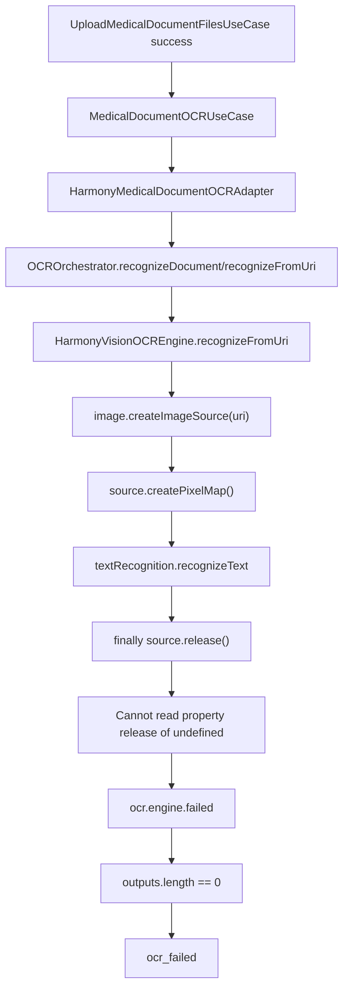
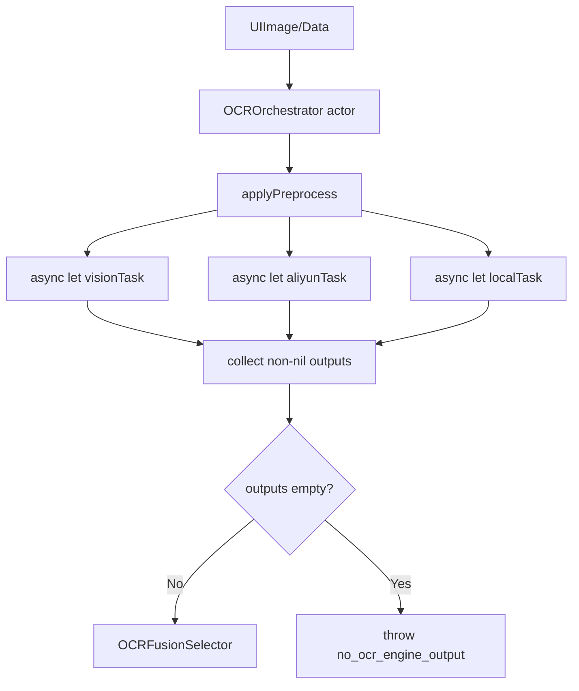
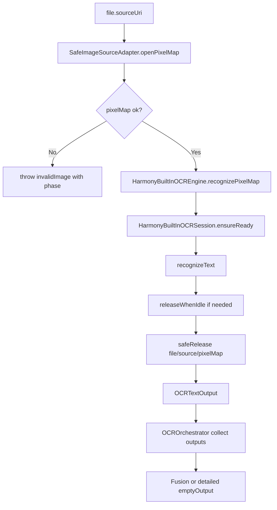

# HOS-MED-UPLOAD-0004 OCR 识别失败真机问题修复 iOS 对齐工单

> 状态：已实施（代码已落地；真机 browser 截图 / 相册 / 空白图仍需验收）。
> 范围：仅覆盖 AI 上传报告 OCR 真机失败：`ocr.engine.failed`、`Cannot read property release of undefined`、最终 `ocr_failed`。
> 实施说明：已按本工单方案完成 Core OCR 安全读图、内置引擎 Session、编排器失败隔离、错误归一化与单测；本文件保留对标与验收口径。
> 触发日志：2026-07-24 21:52:24，文件 `screenshot_20260724_201307_com.huawei.hmos.browser.jpg`，Vision 引擎失败 `Cannot read property release of undefined`，ViewModel 对用户展示 `ocr_failed`。
> 上游工单：`HOS-MED-UPLOAD-0002-OCR与文本合并iOS对齐工单.md`。
> 关联工单：`HOS-MED-UPLOAD-0003-医疗文档类型判定iOS对齐工单.md`。
> 后续真机问题：`HOS-MED-UPLOAD-0005-OCR初始化超时与预热兜底iOS对齐工单.md`，处理 `vision_init_failed:Run timed out`。

## 1. 对标范围与结论

### 1.1 真机日志结论

本次失败链路：

```text
medical.upload.ocr.file_start
  -> ocr.engine.failed engine=vision error=Cannot read property release of undefined
    -> medical.upload.error_presented code=ocr_failed retryable=true
      -> medical.upload.vm.pipeline_failed step=ocr
```

一句话结论：**HarmonyOS 当前 OCR 失败高度疑似发生在 `HarmonyVisionOCREngine.recognizeFromUri()` 的资源释放阶段，而不是 AI 上传报告业务流程本身。** 当前代码在 `finally` 中直接调用 `source.release()`，但真机对象可能没有可调用的 `release` 方法；该异常导致唯一 Vision 引擎无输出，编排器最终抛 `ocr_failed`。

### 1.2 与 iOS 对齐结论

| 能力 | iOS 事实 | HarmonyOS 当前事实 | 对齐结论 |
| --- | --- | --- | --- |
| 图片解码输入 | iOS 将 `UIImage` 转成 JPEG data，解码失败抛 `invalidImage` | HarmonyOS 直接 `image.createImageSource(uri)`，未记录 URI 可读性、source 是否可释放 | **未对齐** |
| 资源释放 | iOS 使用 Swift 对象生命周期，释放阶段不会二次抛覆盖主错误 | HarmonyOS `finally` 里 `source.release()` 未做可调用性保护 | **未对齐** |
| 引擎失败隔离 | iOS 多引擎 `try? await`，单引擎失败不阻断其他引擎 | HarmonyOS 已 try/catch 单引擎，但默认只装配 Vision，一个释放异常就无输出 | **部分对齐** |
| 错误归因 | iOS 区分 `invalidImage`、`response(no_ocr_engine_output)` 等 | HarmonyOS 用户态只看到 `ocr_failed`，日志没有 image source 阶段字段 | **部分对齐** |
| 真机验收 | iOS OCR 链路覆盖图片/PDF/文档 | HarmonyOS 需要针对 picker URI、browser screenshot、相册图片分别验收 | **待补** |

### 1.3 本工单目标

| 目标 | 说明 |
| --- | --- |
| 修复直接崩点 | `release of undefined` 不得再让 OCR 失败 |
| 保留真实错误 | 区分 `image_source_create`、`create_pixel_map`、`recognize_text`、`release` |
| 对齐 iOS 容错 | Vision 失败时，阿里云/本地 OCR 配置存在则继续尝试 |
| 增强用户可恢复 | 单文件失败要能提示“图片读取失败/系统 OCR 不可用/无识别文本” |
| 给出验收样本 | browser 截图、相册图片、PDF 文本层、扫描 PDF 四类都要覆盖 |

## 2. 华为端目录设计

### 2.1 当前目录事实

```text
SparkClientHarmonyOS/entry/src/main/ets/Projects/Core/OCR/
├── HarmonyVisionOCREngine.ets          # 兼容入口，委托 BuiltIn
├── HarmonyBuiltInOCREngine.ets         # 内置 OCR 包装
├── HarmonyBuiltInOCRSession.ets        # init/release 引用计数
├── OCRImageSourceAdapter.ets           # fd 优先读图 + 安全释放
├── OCRDiagnostics.ets                  # 阶段化脱敏日志
├── OCROrchestrator.ets
├── OCRDocumentExtractor.ets
├── OCRFusionSelector.ets
├── OCRModels.ets
├── MedicalImagePreprocessor.ets
└── MedicalTermsCorrector.ets
```

### 2.2 目标目录设计

本问题不需要新建大模块，但建议在现有 OCR Core 内补两个职责边界：

```text
SparkClientHarmonyOS/entry/src/main/ets/Projects/Core/OCR/
├── HarmonyVisionOCREngine.ets              # 当前：临时 Vision OCR 引擎，需改造成内置 OCR 包装入口
├── HarmonyBuiltInOCREngine.ets             # 目标：鸿蒙通用内置 OCR 的 iOS 风格包装器
├── HarmonyBuiltInOCRSession.ets            # 目标：textRecognition init/release 生命周期管理
├── OCRImageSourceAdapter.ets               # 目标：按官方 fileIo.open(fd) 封装 URI -> ImageSource -> PixelMap
├── OCROrchestrator.ets                     # 补多引擎并发/降级/日志字段
├── OCRModels.ets                           # 补 engine failure reason / phase
└── OCRDiagnostics.ets                      # 目标：收敛 OCR 诊断字段，避免日志散落
```

### 2.3 文件职责表

| 文件 | 当前职责 | 修复后职责 | 状态 |
| --- | --- | --- | --- |
| `HarmonyVisionOCREngine.ets` | Vision OCR 引擎，直接创建 ImageSource 和 PixelMap | 安全读取图片、识别、释放；释放失败只记诊断不覆盖结果 | 已实施（委托 BuiltIn） |
| `HarmonyBuiltInOCREngine.ets` | 未独立存在 | 对齐 iOS `VisionOCREngine`，作为鸿蒙通用内置 OCR 的稳定包装器 | 已实施 |
| `HarmonyBuiltInOCRSession.ets` | 未独立存在 | 管理 `textRecognition.init()` / `release()`，避免每张图重复初始化和释放 | 已实施 |
| `OCRImageSourceAdapter.ets` | 未独立存在 | 按官方示例使用 `fileIo.open(uri)` + `image.createImageSource(fd)`，统一释放 fd/source/pixelMap | 已实施 |
| `OCROrchestrator.ets` | 顺序尝试 Vision/阿里云/本地服务 | 改为并发或准并发收集；输出失败明细 | 已实施 |
| `OCRDocumentExtractor.ets` | PDF/txt/图片分流 | 对图片 URI 失败补阶段化错误；PDF 部分仍归 0002 验收 | 已补安全释放 |
| `MedicalDocumentOCRUseCase.ets` | 多文件 OCR 上传业务用例 | 透传更细粒度错误给 ViewModel | 已实施（phase 日志） |
| `MedicalDocumentUploadViewModel.ets` | 展示 OCR 失败 banner | 按错误类型展示更准确文案和重试入口 | 已实施 |

## 3. 分层职责与请求链路

### 3.1 当前失败链路



### 3.2 iOS 对标链路



iOS 的关键不是 API 名字，而是两个行为：**资源异常不覆盖主流程状态，多引擎失败互相隔离**。

### 3.3 目标 HarmonyOS 修复链路



### 3.4 用户可见状态

| 失败点 | 当前用户状态 | 修复后用户状态 |
| --- | --- | --- |
| source 创建失败 | `ocr_failed` | “无法读取图片，请重新选择原图或授权相册访问” |
| pixelMap 创建失败 | `ocr_failed` | “图片格式暂不支持或文件损坏” |
| Vision Kit 不可用 | `ocr_failed` | “系统 OCR 暂不可用，可重试或稍后再试” |
| release 失败 | `ocr_failed` | 不影响识别结果；仅记 warn |
| 所有引擎无文本 | `ocr_failed` | “未识别到文字，请换清晰图片或手动录入” |

## 4. 核心关键技术与实现方案

### 4.1 根因定位

当前 `HarmonyVisionOCREngine.ets` 关键代码：

```ts
// 当前代码摘要
const source = image.createImageSource(uri);
let pixelMap: image.PixelMap | undefined = undefined;
try {
  pixelMap = await source.createPixelMap();
  return await this.recognizePixelMap(pixelMap, hints);
} finally {
  if (pixelMap !== undefined) {
    pixelMap.release();
  }
  source.release();
}
```

偏差点：

| 偏差 | 影响 |
| --- | --- |
| `source` 没有声明为可选 | 无法表达 `createImageSource` 返回不可用对象的状态 |
| `source.release()` 没有 `try/catch` | release 阶段异常会覆盖识别阶段成功/失败 |
| 未检查 `release` 是否是函数 | 真机对象结构与类型声明不一致时直接抛 `Cannot read property release of undefined` |
| `pixelMap.release()` 未隔离 | pixelMap 释放失败也可能覆盖主流程 |
| 没有阶段日志 | 无法判断失败发生在 URI、解码、识别还是释放 |

### 4.2 修复方案一：资源释放必须安全且不覆盖主结果

伪代码，具体 ArkTS SDK 签名以当前 DevEco SDK 为准：

```ts
// Pseudocode: HarmonyVisionOCREngine.ets
async recognizeFromUri(uri: string, hints: OCRRecognitionHints): Promise<OCRTextOutput> {
  if (uri.length === 0) {
    throw new OCRError('invalidImage', 'empty_uri');
  }

  let source: image.ImageSource | undefined = undefined;
  let pixelMap: image.PixelMap | undefined = undefined;
  try {
    source = image.createImageSource(uri);
    if (source === undefined) {
      throw new OCRError('invalidImage', 'image_source_undefined');
    }

    pixelMap = await source.createPixelMap();
    if (pixelMap === undefined) {
      throw new OCRError('invalidImage', 'pixel_map_undefined');
    }

    return await this.recognizePixelMap(pixelMap, hints);
  } catch (error) {
    throw OCRPhaseErrorMapper.map('vision_from_uri', error);
  } finally {
    SafeOCRResourceRelease.pixelMap(pixelMap, 'vision_pixel_map');
    SafeOCRResourceRelease.imageSource(source, 'vision_image_source');
  }
}
```

释放原则：

| 原则 | 要求 |
| --- | --- |
| release 不得覆盖主结果 | `finally` 里的释放失败只记 warn |
| release 前检查对象 | 对象 undefined/null 时跳过 |
| release 前检查方法 | `release` 不存在时记诊断，不抛业务错误 |
| 释放顺序 | 先释放 pixelMap，再释放 source |
| 日志脱敏 | 不打印完整 URI，只打印文件名、mime、阶段、错误码 |

### 4.3 修复方案二：Vision Kit 生命周期隔离

当前 `recognizePixelMap()` 已对 `textRecognition.release()` 做 try/catch，这是正确方向，但仍需要补阶段日志和 init/recognize 区分。

```ts
// Pseudocode: HarmonyVisionOCREngine.ets
async recognizePixelMap(pixelMap: image.PixelMap, hints: OCRRecognitionHints): Promise<OCRTextOutput> {
  const started = Date.now();
  try {
    await textRecognition.init();
  } catch (error) {
    throw new OCRError('engineUnavailable', `vision_init_failed:${toMessage(error)}`);
  }

  try {
    const result = await textRecognition.recognizeText({ pixelMap });
    return OCRTextOutputFactory.vision(result, started);
  } catch (error) {
    throw new OCRError('engineUnavailable', `vision_recognize_failed:${toMessage(error)}`);
  } finally {
    try {
      await textRecognition.release();
    } catch (error) {
      OCRDiagnostics.warn('vision_release_failed', error);
    }
  }
}
```

### 4.4 修复方案三：按官方文档包装鸿蒙通用内置 OCR

用户提供的鸿蒙官方“用文字识别”资料（更新时间：2026-05-12 17:31）给出了两个关键实现事实：

| 官方事实 | 对本项目的修正 |
| --- | --- |
| 使用 `textRecognition.init()` 初始化文字识别服务，使用 `textRecognition.release()` 释放资源 | 不建议每张图都无脑 init/release；应放到可控 session 或引用计数包装层 |
| 从图库 URI 读取图片时，示例先 `fileIo.open(uri, READ_ONLY)`，再 `image.createImageSource(file.fd)`，最后创建 PixelMap | 当前直接 `image.createImageSource(uri)` 与官方路径不一致，是本次 browser screenshot 真机失败的重要疑点 |
| 调用 `recognizeText` 时传入 `VisionInfo { pixelMap }` 和 `TextRecognitionConfiguration` | 包装器应显式传配置，至少暴露是否支持朝向检测 |
| 示例捕获 `BusinessError` 并记录 code/message | 本项目需要映射成 `OCRError`，不把完整系统错误直接展示给用户 |

#### 4.4.1 iOS 包装方法对齐

iOS 的 `VisionOCREngine` 在业务上不是页面代码，而是实现 `OCRTextEngine` 的引擎适配层。HarmonyOS 应保持同样结构：

```text
OCROrchestrator
  -> OCRTextEngine interface
    -> HarmonyBuiltInOCREngine
      -> HarmonyBuiltInOCRSession
      -> OCRImageSourceAdapter
      -> textRecognition.recognizeText
```

这意味着官方示例里的 `aboutToAppear/aboutToDisappear`、按钮、页面状态不能直接复制到医疗上传页面；我们只复用系统能力调用顺序，把它包成可注入、可测试、可复用的 Core/OCR 引擎。

#### 4.4.2 目标包装器职责

| 包装对象 | 职责 | 禁止事项 |
| --- | --- | --- |
| `HarmonyBuiltInOCREngine` | 实现 `OCRTextEngine`，对外提供 `recognizeFromUri` / `recognizePixelMap` | 不直接处理 UI、Picker、通知 |
| `HarmonyBuiltInOCRSession` | 单飞初始化、引用计数释放、前后台/流程结束时清理 | 不在每张图 finally 里无条件 release 全局 OCR 服务 |
| `OCRImageSourceAdapter` | 用 `fileIo.open` + fd 创建 ImageSource，安全生成 PixelMap | 不假设所有 URI 都能直接 `createImageSource(uri)` |
| `OCRDiagnostics` | 统一输出阶段化日志，脱敏 URI | 不打印完整本地路径或系统 URI |

#### 4.4.3 ArkTS 伪代码：内置 OCR 包装器

以下是职责骨架，不是已编译代码，具体类型与 Kit 签名以当前 DevEco SDK 24 复核：

```ts
// Pseudocode: Projects/Core/OCR/HarmonyBuiltInOCREngine.ets
export class HarmonyBuiltInOCREngine implements OCRTextEngine {
  readonly name: string = 'harmony_builtin_ocr';

  constructor(
    private readonly session: HarmonyBuiltInOCRSession,
    private readonly imageSourceAdapter: OCRImageSourceAdapter,
    private readonly diagnostics: OCRDiagnostics
  ) {}

  async recognizeFromUri(uri: string, hints: OCRRecognitionHints): Promise<OCRTextOutput> {
    const opened = await this.imageSourceAdapter.openPixelMap(uri);
    try {
      return await this.recognizePixelMap(opened.pixelMap, hints);
    } finally {
      opened.releaseSafely();
    }
  }

  async recognizePixelMap(pixelMap: image.PixelMap, hints: OCRRecognitionHints): Promise<OCRTextOutput> {
    await this.session.ensureReady();
    const started = Date.now();
    try {
      const visionInfo: textRecognition.VisionInfo = { pixelMap };
      const config: textRecognition.TextRecognitionConfiguration = {
        isDirectionDetectionSupported: hints.enableDirectionDetection
      };
      const result = await textRecognition.recognizeText(visionInfo, config);
      return OCRTextOutputFactory.fromBuiltInOCR(result.value, Date.now() - started);
    } catch (error) {
      throw OCRErrorMapper.fromBusinessError('builtin_recognize_text', error);
    } finally {
      await this.session.releaseWhenIdle();
    }
  }
}
```

#### 4.4.4 ArkTS 伪代码：OCR Session 生命周期

官方示例在页面 `aboutToAppear` 初始化、`aboutToDisappear` 释放。医疗上传不是单页面 demo，因此建议把它收敛为 Core/OCR session：

```ts
// Pseudocode: Projects/Core/OCR/HarmonyBuiltInOCRSession.ets
export class HarmonyBuiltInOCRSession {
  private initTask?: Promise<void>;
  private ready: boolean = false;
  private activeUsers: number = 0;

  async ensureReady(): Promise<void> {
    this.activeUsers += 1;
    if (this.ready) {
      return;
    }
    if (this.initTask === undefined) {
      this.initTask = this.initInternal();
    }
    await this.initTask;
  }

  async releaseWhenIdle(): Promise<void> {
    this.activeUsers = Math.max(0, this.activeUsers - 1);
    if (this.activeUsers > 0 || !this.ready) {
      return;
    }
    try {
      await textRecognition.release();
    } finally {
      this.ready = false;
      this.initTask = undefined;
    }
  }

  private async initInternal(): Promise<void> {
    try {
      await textRecognition.init();
      this.ready = true;
    } catch (error) {
      this.initTask = undefined;
      throw OCRErrorMapper.fromBusinessError('builtin_init', error);
    }
  }
}
```

#### 4.4.5 ArkTS 伪代码：按官方方式读取 URI

官方示例明确通过 `fileIo.open(name, READ_ONLY)` 获取 fd，再 `image.createImageSource(fileSource.fd)`。本项目要把这个动作放进适配器，统一 close/release：

```ts
// Pseudocode: Projects/Core/OCR/OCRImageSourceAdapter.ets
export class OCRImageSourceAdapter {
  async openPixelMap(uri: string): Promise<OCRPixelMapHandle> {
    let file: fileIo.File | undefined = undefined;
    let source: image.ImageSource | undefined = undefined;
    let pixelMap: image.PixelMap | undefined = undefined;
    try {
      file = await fileIo.open(uri, fileIo.OpenMode.READ_ONLY);
      source = image.createImageSource(file.fd);
      pixelMap = await source.createPixelMap();
      return new OCRPixelMapHandle(file, source, pixelMap);
    } catch (error) {
      SafeOCRResourceRelease.pixelMap(pixelMap, 'open_pixel_map_failed');
      SafeOCRResourceRelease.imageSource(source, 'open_source_failed');
      SafeOCRResourceRelease.file(file, 'open_file_failed');
      throw OCRErrorMapper.fromBusinessError('image_uri_to_pixel_map', error);
    }
  }
}
```

#### 4.4.6 内置 OCR 包装验收点

| 验收项 | 标准 |
| --- | --- |
| 初始化 | 同一批多文件 OCR 不重复无意义 init/release |
| URI 读取 | picker/browser screenshot 走 fd 创建 ImageSource |
| 朝向检测 | `TextRecognitionConfiguration.isDirectionDetectionSupported` 有明确默认值和配置入口 |
| 资源释放 | file/source/pixelMap 释放失败不覆盖识别结果 |
| 错误映射 | `BusinessError.code/message` 被转换成 `OCRError` 和阶段化日志 |
| 业务隔离 | 页面不直接 import `textRecognition`，只消费 `MedicalDocumentOCRUseCase` |

### 4.5 修复方案四：多引擎容错从“顺序”升级为“并发/准并发”

iOS 使用 `async let` 同时启动 Vision、阿里云、本地服务。HarmonyOS 当前顺序执行，且默认只有 Vision。一旦 Vision 因释放异常失败，outputs 为空。建议：

| 场景 | 修复策略 |
| --- | --- |
| 只配置 Vision | Vision 失败时输出阶段化错误，用户可重试 |
| Vision + 阿里云 | Vision 失败不阻断阿里云 |
| Vision + 本地服务 | 本地服务可作为设备 Kit 异常兜底 |
| 多引擎均失败 | `emptyOutput` detail 带 engines failed summary |

伪代码：

```ts
// Pseudocode: OCROrchestrator.ets
const tasks: Promise<OCRTextOutput>[] = [];
tasks.push(this.visionEngine.recognizeFromUri(uri, hints));

if (this.config.enableAliyunOCR && this.aliyunEngine) {
  tasks.push(this.aliyunEngine.recognizeFromUri(uri, hints));
}
if (this.config.enableLocalServerOCR && this.localServerEngine) {
  tasks.push(this.localServerEngine.recognizeFromUri(uri, hints));
}

const settled = await Promise.allSettled(tasks);
const outputs = collectFulfilled(settled);
const failures = collectRejected(settled);
this.logEngineFailures(failures);

if (outputs.length === 0) {
  throw new OCRError('emptyOutput', `no_ocr_engine_output;failures=${summarize(failures)}`);
}
```

### 4.6 修复方案五：图片 URI 读取策略复核

本次文件名来自浏览器截图：`screenshot_20260724_201307_com.huawei.hmos.browser.jpg`。结合官方资料，优先修正为 `fileIo.open(uri)` + `image.createImageSource(fd)`；同时需要确认 `file.sourceUri` 是否为以下任一种：

| URI 类型 | 风险 | 建议 |
| --- | --- | --- |
| 应用沙箱路径 | 风险低 | 直接 `createImageSource(path)` |
| `file://` URI | 部分 API 接收 path，部分接收 fd/uri | 统一剥离或复制到沙箱后读取 |
| picker 返回 URI | 官方示例路径即 `fileIo.open(uri)` 后用 fd | 优先 fd 创建 ImageSource；必要时复制到可控沙箱 |
| content/media URI | `createImageSource(uri)` 可能失败 | 优先 `fileIo.open(uri)` 后用 fd 创建 ImageSource |

### 4.7 错误归一化与用户提示

| 内部 detail | UI 建议 | retryable |
| --- | --- | --- |
| `image_source_undefined` | 图片读取失败，请重新选择 | true |
| `pixel_map_undefined` | 图片格式暂不支持或文件损坏 | true |
| `vision_init_failed` | 系统 OCR 初始化失败，请重试 | true |
| `vision_recognize_failed` | 系统 OCR 识别失败，请换清晰图片 | true |
| `vision_release_failed` | 不展示，仅诊断日志 | false |
| `no_ocr_engine_output` | 未识别到可用文字 | true |

### 4.8 官方文档参考

| 官方资料 | URL | 本工单用途 |
| --- | --- | --- |
| 用文字识别，更新时间 2026-05-12 17:31 | `/Users/hua/.codex/attachments/9ca499ae-0051-4f97-886e-9d9cb793fdff/pasted-text.txt` | 确认官方推荐的 `fileIo.open(uri)` -> `image.createImageSource(fd)` -> `createPixelMap()` -> `recognizeText()` 流程 |
| Core Vision Kit OCR 示例文章 | https://developer.huawei.com/consumer/cn/blog/topic/03184279410646110 | 确认 `textRecognition.init()`、`recognizeText()`、`release()` 的典型调用顺序 |
| Image Kit PixelMap API | https://developer.huawei.com/consumer/cn/doc/harmonyos-references-v5/js-apis-image-V5 | 确认 `ImageSource` / `PixelMap` 属于图片解码核心对象，需按 SDK 复核释放方法 |
| 图片解码开发指导 | https://developer.huawei.com/consumer/cn/doc/harmonyos-guides-V5/image-decoding-V5 | 确认图片解码对象在不再使用后按需释放，释放时机不能早于异步方法完成 |

## 5. 接口契约与数据模型

### 5.1 OCR 失败诊断字段

| 字段 | 类型 | 必填 | 敏感 | 来源 | 生命周期 |
| --- | --- | --- | --- | --- | --- |
| `engine` | string | 是 | 否 | `OCRTextEngine.name` | 单次 OCR |
| `phase` | string | 是 | 否 | source/createPixelMap/init/recognize/release | 单次 OCR |
| `errorCode` | string | 是 | 否 | `OCRError.code` 或映射结果 | 日志/错误归一化 |
| `errorMessage` | string | 是 | 需脱敏 | Error message | 日志截断 |
| `fileIndex` | number | 是 | 否 | `MedicalDocumentOCRUseCase` | 上传会话 |
| `fileName` | string | 是 | 低敏 | 上传文件 displayName | 上传会话 |
| `mimeType` | string | 否 | 否 | picker/upload metadata | 上传会话 |
| `uriKind` | string | 否 | 否 | path/file/content/media/sandbox | 诊断 |
| `retryable` | boolean | 是 | 否 | 错误归一化 | UI |

### 5.2 OCR 错误映射

| 阶段 | 原始错误 | `OCRError.code` | detail 建议 | 用户行为 |
| --- | --- | --- | --- | --- |
| URI 为空 | empty string | `invalidImage` | `empty_uri` | 重新选择文件 |
| ImageSource 创建失败 | undefined/null/throw | `invalidImage` | `image_source_create_failed` | 重新选择或复制到沙箱 |
| PixelMap 创建失败 | undefined/null/throw | `invalidImage` | `pixel_map_create_failed` | 换图片/原图 |
| Vision 初始化失败 | init throw | `engineUnavailable` | `vision_init_failed` | 重试 |
| Vision 识别失败 | recognize throw | `engineUnavailable` | `vision_recognize_failed` | 换清晰图片 |
| release 失败 | release throw/undefined | 不改变主错误 | `vision_release_failed` warn | 用户无感 |
| 全部引擎无输出 | outputs empty | `emptyOutput` | `no_ocr_engine_output` | 重试或手动录入 |

### 5.3 与上传附件模型的关系

本工单不改变 OSS 上传契约，也不新增后端 API。它只消费已上传/已选择文件中的：

| 输入 | 来源 | 用途 |
| --- | --- | --- |
| `sourceUri` | `MedicalUploadLocalFile` | OCR 读取 |
| `displayName` | picker/upload metadata | 日志和文件边界 |
| `mimeType` | picker/upload metadata | 判断图片/PDF/txt |
| `uploadedAttachment` | 文件上传结果 | OCR 失败后仍可断点复用 |

### 5.4 内置 OCR 包装状态模型

| 模型/属性 | ArkTS 类型 | 必填 | 敏感 | 来源与验证 | 生命周期/持久化 | 兼容规则 |
| --- | --- | --- | --- | --- | --- | --- |
| `HarmonyBuiltInOCRSession.ready` | boolean | 是 | 否 | `textRecognition.init()` 成功后置 true | 进程内，不持久化 | 初始化失败必须重置为 false |
| `HarmonyBuiltInOCRSession.initTask` | `Promise<void>` 或 undefined | 否 | 初始化单飞任务 | 进程内，不持久化 | 并发 OCR 共用一次初始化 |
| `HarmonyBuiltInOCRSession.activeUsers` | number | 是 | 否 | OCR 调用开始/结束计数 | 进程内，不持久化 | 归零后才允许 release |
| `OCRPixelMapHandle.file` | `fileIo.File` 或 undefined | 否 | `fileIo.open(uri)` | 单次图片读取 | finally 必须 close |
| `OCRPixelMapHandle.source` | `image.ImageSource` 或 undefined | 否 | `image.createImageSource(fd)` | 单次图片读取 | release 失败只记 warn |
| `OCRPixelMapHandle.pixelMap` | `image.PixelMap` | 是 | 否 | `source.createPixelMap()` | 单次识别 | 识别完成后 release |
| `TextRecognitionConfiguration.isDirectionDetectionSupported` | boolean | 是 | 否 | OCR 配置 | 单次识别 | 默认 false，医疗上传可按样本验证后调整 |

## 6. iOS-HarmonyOS 功能对照矩阵

| 功能点 | iOS 代码/行为 | HarmonyOS 当前 | 偏差 | 修复动作 | 对齐状态 |
| --- | --- | --- | --- | --- | --- |
| 图片 OCR 资源生命周期 | `UIImage/Data` 局部对象，失败不被释放阶段覆盖 | `source.release()` 可能抛 `release of undefined` | release 异常覆盖主流程 | 安全释放 + 阶段化错误 | **已对齐** |
| 鸿蒙内置 OCR 包装 | iOS `VisionOCREngine` 作为 `OCRTextEngine` 被编排器注入 | 当前 `HarmonyVisionOCREngine` 直接调用 Kit，缺 session / fd 读取 / 配置包装 | 未按官方 fd 读取路径包装，生命周期太散 | 新增/改造 `HarmonyBuiltInOCREngine` + `HarmonyBuiltInOCRSession` + `OCRImageSourceAdapter` | **已对齐** |
| Vision OCR 调用 | Vision 引擎失败被 `try?` 隔离 | Vision release 失败后唯一引擎无输出 | 默认无兜底引擎 | 多引擎容错或明确用户提示 | **部分对齐**（默认仍仅 Vision；失败文案可操作） |
| 多引擎收集 | `async let` 并发收集 | 顺序尝试 | 慢/失败引擎影响整体 | `Promise.allSettled` 或等价策略 | **已对齐**（`Promise.all` + 单引擎 try/catch） |
| 图片 URI 适配 | iOS 本地 file URL 明确 | HarmonyOS picker/browser screenshot URI 未分型 | `createImageSource(uri)` 真机不稳定 | URI kind 诊断 + fd/sandbox fallback | **已实施待真机验** |
| 用户错误提示 | 可区分 invalid image / no output | 用户只看到 `ocr_failed` | 排障成本高 | 错误归一化与 UI 文案细化 | **已对齐** |

## 7. 示例工程与官方文档参考结论

| 类型 | 标题/代码位置 | URL/绝对路径 | 可借鉴内容 | 禁止直接复制/版本注意事项 |
| --- | --- | --- | --- | --- |
| 官方/用户提供 | 用文字识别，更新时间 2026-05-12 17:31 | `/Users/hua/.codex/attachments/9ca499ae-0051-4f97-886e-9d9cb793fdff/pasted-text.txt` | `textRecognition.init/release` 生命周期、`fileIo.open(uri)` + fd 创建 `ImageSource`、`VisionInfo` + `TextRecognitionConfiguration` | 示例是页面 demo，不复制 Button、State、hilog 全量结果打印；本项目应封装为 Core/OCR 引擎 |
| 官方 | Core Vision Kit OCR 示例文章 | https://developer.huawei.com/consumer/cn/blog/topic/03184279410646110 | OCR 典型顺序：init -> recognizeText -> release | 示例文章不是项目编译契约，需按本工程 SDK 24 复核 |
| 官方 | Image Kit PixelMap API | https://developer.huawei.com/consumer/cn/doc/harmonyos-references-v5/js-apis-image-V5 | ImageSource/PixelMap 对象生命周期 | release 方法签名以当前 DevEco SDK 为准 |
| 官方 | 图片解码开发指导 | https://developer.huawei.com/consumer/cn/doc/harmonyos-guides-V5/image-decoding-V5 | 异步解码完成后再释放对象 | 不能过早释放，release 失败不能覆盖业务结果 |
| 本项目 | `Projects/Core/OCR/HarmonyVisionOCREngine.ets` | `/Users/hua/Documents/project/Reference/LookHealthClient/SparkClientHarmonyOS/entry/src/main/ets/Projects/Core/OCR/HarmonyVisionOCREngine.ets` | 真机失败直接对应的修复点 | 不能继续无保护 `source.release()` |
| 本项目 | iOS `OCROrchestrator.swift` | `/Users/hua/Documents/project/Reference/LookHealthClient/SparkClient/SparkClient/Projects/Core/OCR/OCROrchestrator.swift` | 多引擎并发和失败隔离 | 不逐行翻译 Swift actor，只对齐行为 |

## 8. 实施拆分与验收

### 8.1 修复拆分

| 阶段 | 目标文件/模块 | 依赖 | 实施结果 | 自动化测试 | 人工验收 |
| --- | --- | --- | --- | --- | --- |
| T1 | `HarmonyVisionOCREngine.ets` | Image Kit/Core Vision Kit | 已实施：委托 BuiltIn + 安全释放 | 单测 mock release undefined/throw | browser 截图不再报 release undefined |
| T2 | `HarmonyVisionOCREngine.ets` | Logger/OCRError | 已实施：init/create/recognize/release 阶段化错误 | 单测覆盖 error detail | 日志能区分失败阶段 |
| T3 | `HarmonyBuiltInOCREngine.ets` | Core Vision Kit | 已实施：iOS 风格内置 OCR 包装器 | mock recognizeText 成功/失败 | 页面不直接依赖 `textRecognition` |
| T4 | `HarmonyBuiltInOCRSession.ets` | Core Vision Kit | 已实施：init/release 单飞与引用计数 | 并发 ensureReady / releaseWhenIdle | 多文件 OCR 不重复无意义 init/release |
| T5 | `OCRImageSourceAdapter.ets` | Core File Kit/Image Kit | 已实施：按官方 fd 路径读取 URI | mock path/file/content URI | picker 图片、截图、沙箱图片均可读 |
| T6 | `OCROrchestrator.ets` | OCRTextEngine | 已实施：多引擎准并发收集 | mock 三引擎 success/fail | Vision 失败时可用兜底引擎继续 |
| T7 | `MedicalDocumentOCRUseCase.ets` | OCR 错误模型 | 已实施：单文件 phase 日志 | 单测文件失败映射 | UI 显示更准确提示 |
| T8 | `MedicalDocumentUploadViewModel.ets` | NotificationClient | 已实施：按错误类型提示 | ViewModel / normalizer 单测 | 失败 banner 文案可操作 |

### 8.2 必验样本

| 样本 | 来源 | 预期 |
| --- | --- | --- |
| 浏览器截图 jpg | 与本次日志同类 | OCR 不再报 `release of undefined` |
| 相册原图 jpg/png | picker | 能识别或输出明确 `pixel_map_create_failed` |
| 微信/浏览器保存图片 | media/content URI | 能通过 fd/sandbox fallback 读取 |
| 可文本 PDF | PDF Kit | 文本层直接成功 |
| 扫描 PDF | PDF Kit + OCR | 逐页 OCR，失败页不拖垮整份文档 |
| 空白图片 | 人造样本 | 不崩溃，输出“未识别到文字” |

### 8.3 日志验收

成功日志应包含：

```text
medical.upload.ocr.file_start
ocr.recognize.complete selected=vision engines=vision textLen=...
medical.upload.ocr.file_done
```

释放失败但识别成功时：

```text
ocr.resource.release_failed phase=vision_image_source
ocr.recognize.complete selected=vision ...
```

Vision 识别失败时：

```text
ocr.engine.failed engine=vision phase=vision_recognize error=...
ocr.recognize.failed code=emptyOutput detail=no_ocr_engine_output;failures=vision:...
```

验收底线：**不得再出现 `Cannot read property release of undefined` 作为导致用户 OCR 失败的主错误。**

### 8.4 构建与真机验证

| 验收项 | 标准 |
| --- | --- |
| ArkTS 编译 | `assembleHap` / `CompileArkTS` 错误数为 0 |
| 单元测试 | OCR 资源释放 mock、引擎失败 mock、错误映射 mock 全通过 |
| 真机日志 | browser 截图、相册图、空白图至少各跑一次 |
| 用户提示 | 错误提示可操作，不泄露完整本地 URI |
| 回归 | OCR 成功后仍能进入 `type_recognition` |

## 9. 风险与待确认项

| 编号 | 风险/待确认项 | 影响模块 | 证据 | 依赖方 | 关闭条件 |
| --- | --- | --- | --- | --- | --- |
| R1 | `image.createImageSource(uri)` 对 picker/browser screenshot URI 的真实支持边界待确认 | `HarmonyVisionOCREngine` | 真机日志 `release of undefined` | DevEco SDK / 真机 | 明确 path/fd/uri 读取策略并验收 |
| R2 | `ImageSource.release()` 在当前 SDK 类型声明和真机对象上可能不一致 | OCR Core | 当前 release 调用抛 undefined | HarmonyOS Image Kit | 安全释放封装通过真机验证 |
| R3 | Vision 是默认唯一引擎，失败即无输出 | `OCROrchestrator` | 当前 assembly 未注入阿里云/本地 OCR | AI 上传报告 | 至少有明确错误提示；可选接远端兜底 |
| R4 | release 阶段异常覆盖真实识别结果 | OCR Core | `finally source.release()` 无保护 | OCR Core | release 失败仅 warn，不影响主结果 |
| R5 | 错误文案过粗 | ViewModel/Notification | 当前用户只见 `ocr_failed` | 产品/客户端 | 按阶段映射为可操作文案 |
| R6 | PDF 与图片 OCR 修复混在一起可能扩大风险 | OCR Core | `0002` 已有 PDF 真机验收项 | 客户端测试 | 本工单优先图片 release 崩点，PDF 放回 0002 验收 |
| R7 | 官方 demo 的页面生命周期不能直接复制到医疗上传 Feature | OCR Core / Presentation | 官方示例使用 `aboutToAppear/aboutToDisappear` 和页面 State | 客户端架构 | 封装为 `HarmonyBuiltInOCRSession`，由用例/编排器管理生命周期 |
| R8 | 直接打印 `recognizeText` 完整结果可能泄露报告内容 | OCR 日志 | 官方 demo 用 hilog 打印 JSON 结果 | 安全/日志 | 日志只记录 textLen、engine、phase，不打印 OCR 全文 |
