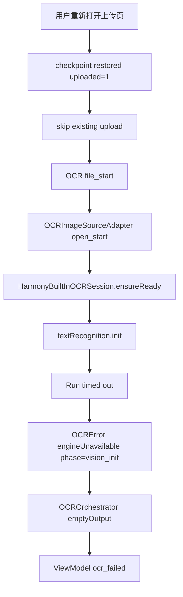
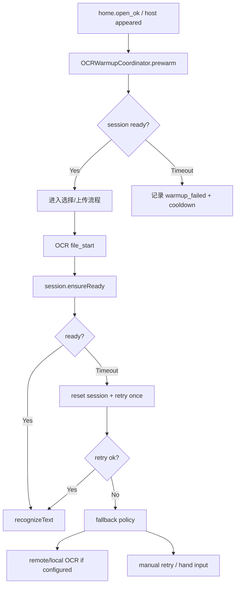

# HOS-MED-UPLOAD-0005 OCR 初始化超时与预热兜底 iOS 对齐工单

> 状态：已实施并针对真机 `builtin_ocr_cooldown` / `init` 5s 超时二次修复。
> 二次修复要点（对齐官方）：`init` 超时改为 soft/lazy ready，继续 `recognizeText`；不再用 cooldown 跳过 Vision；PixelMap 强制 RGBA_8888；关页不强制 release。
> 范围：仅覆盖 AI 上传报告 OCR 真机失败中的 `vision_init_failed:Run timed out`、`emptyOutput:no_ocr_engine_output` 与用户侧 `ocr_failed`。
> 实施说明：已按本工单完成 Session 状态机、上传页预热、init 超时 reset+一次重试、TTL 保活、cooldown 熔断、rootCause 错误文案与单测。
> 触发日志：2026-07-24 22:49:45 至 22:49:50，文件 `screenshot_20260724_201307_com.huawei.hmos.browser.jpg`，phase=`vision_init`，error=`Run timed out, please try again later.`。
> 上游工单：`HOS-MED-UPLOAD-0004-OCR识别失败真机问题修复iOS对齐工单.md` 已完成 fd 读图、安全释放、阶段化错误与内置 OCR 包装。

## 1. 对标范围与结论

### 1.1 真机日志结论

这次日志与 `0004` 的 `release of undefined` 已经不是同一个问题。新的失败链路如下：

```text
home.open_ok ocrCap=true
  -> checkpoint.restored uploaded=1
    -> skip_existing fileID=1827
      -> ocr.file_start mime=image/*
        -> ocr.image.open_start kind=file
          -> 5.052s gap
            -> ocr.engine.failed phase=vision_init
              error=engineUnavailable:vision_init_failed:Run timed out, please try again later.
            -> ocr.recognize.failed code=emptyOutput;no_ocr_engine_output
              failures=vision:vision_init:...
            -> medical.upload.ocr.file_failed phase=orchestrator_collect
            -> medical.upload.vm.pipeline_failed step=ocr
```

一句话结论：**文件读取与上传断点恢复已工作，当前失败点收敛到鸿蒙内置 OCR 服务初始化 `textRecognition.init()` 超时。** 这说明 `0004` 的 fd 读图与资源释放问题已经推进到下一阶段，现在需要补的是：预热、初始化状态机、超时重试、短时保活、熔断降级和更准确的错误提示。

### 1.2 当前事实判断

| 事实 | 证据 | 结论 |
| --- | --- | --- |
| 上传不是本次失败原因 | `skip_existing fileID=1827`、`batch_done uploaded=0 skipped=1` | OSS 文件已存在，断点续跑有效 |
| 图片读取大概率已过第一关 | 出现 `ocr.image.open_start`，随后失败 phase 是 `vision_init` | 失败不在 `fileIo.open` / `createPixelMap` 主路径 |
| 失败耗时约 5 秒 | 22:49:45.071 到 22:49:50.123 | 系统 OCR init 自身或包装层等待超时 |
| 只有 Vision 一个输出候选 | failures 只有 `vision:vision_init` | 默认无阿里云/本地服务兜底 |
| 用户看到泛化失败 | `medical.upload.error_presented code=ocr_failed` | UI 未区分“初始化超时”和“图片无文字” |

### 1.3 iOS 对齐结论

| 能力 | iOS 事实 | HarmonyOS 当前事实 | 对齐结论 |
| --- | --- | --- | --- |
| 引擎初始化 | iOS Vision 不需要每次上传前阻塞加载外部模型 | HarmonyOS `textRecognition.init()` 可能加载模型并超时 | **平台差异，需要预热/保活** |
| 多引擎容错 | iOS `async let` 并发收集，单引擎失败不阻断其他引擎 | HarmonyOS 编排已能隔离单引擎失败，但默认只有 Vision | **部分对齐** |
| 失败语义 | iOS 可区分 invalid image / no output / engine failure | HarmonyOS `emptyOutput` 包含 `vision_init` 时仍可能被理解成“无文字” | **待修复** |
| 重试策略 | iOS 可由上层重试 OCR，不重复上传 | HarmonyOS 已 skip uploaded，但 init 超时后没有 reset + retry 策略 | **待修复** |
| 用户体验 | iOS 上传流程可展示阶段进度 | HarmonyOS 现在 5 秒后直接失败 | **待补“系统 OCR 准备中”状态** |

## 2. 华为端目录设计

### 2.1 当前目录事实

```text
SparkClientHarmonyOS/entry/src/main/ets/Projects/Core/OCR/
├── HarmonyBuiltInOCREngine.ets
├── HarmonyBuiltInOCRSession.ets
├── OCRImageSourceAdapter.ets
├── OCROrchestrator.ets
├── OCRDiagnostics.ets
└── OCRModels.ets

SparkClientHarmonyOS/entry/src/main/ets/Projects/Features/MedicalDocumentUpload/
├── Application/MedicalDocumentOCRUseCase.ets
├── Domain/MedicalDocumentUploadErrors.ets
└── Presentation/MedicalDocumentUploadViewModel.ets
```

### 2.2 目标目录设计

```text
SparkClientHarmonyOS/entry/src/main/ets/Projects/Core/OCR/
├── HarmonyBuiltInOCRSession.ets            # 补预热、状态机、reset、cooldown、TTL keep-alive
├── HarmonyBuiltInOCREngine.ets             # 补 init 超时后 retry 策略入口
├── OCRWarmupCoordinator.ets                # 目标新增：上传页打开/应用前台后的 OCR 预热协调
├── OCRFallbackPolicy.ets                   # 目标新增：内置 OCR 失败后的远端/手动降级策略
├── OCROrchestrator.ets                     # 补 init failure 优先级、fallback summary
├── OCRModels.ets                           # 补 init timeout / warmup 状态字段
└── OCRDiagnostics.ets                      # 补 warmup/init/retry/circuit_breaker 日志
```

### 2.3 文件职责表

| 文件 | 当前职责 | 目标职责 | 状态 |
| --- | --- | --- | --- |
| `HarmonyBuiltInOCRSession.ets` | 单飞 init + 引用计数 release | 状态机、预热、短 TTL 保活、init 失败 reset/cooldown | 已实施 |
| `HarmonyBuiltInOCREngine.ets` | 调 `session.ensureReady()` 后识别 | init timeout 后可触发 reset + 一次重试，输出明确 phase | 已实施 |
| `OCROrchestrator.ets` | 多引擎准并发收集，空输出抛 `emptyOutput` | `emptyOutput` 里保留 rootCause=`vision_init_timeout`，便于 UI 显示 | 已实施 |
| `MedicalDocumentUploadErrors.ets` | OCR 错误归一化 | `emptyOutput` 包含 `vision_init` 时优先展示初始化失败 | 已实施 |
| `MedicalDocumentUploadViewModel.ets` | OCR 失败 banner | OCR warmup/loading 状态和重试提示 | 已实施 |
| `OCRWarmupCoordinator.ets` | — | 上传页打开预热协调 | 已实施 |
| `OCRFallbackPolicy.ets` | — | cooldown 跳过 Vision / rootCause 分类 | 已实施 |

## 3. 分层职责与请求链路

### 3.1 当前失败链路



### 3.2 目标修复链路



### 3.3 阶段状态

| 阶段 | 触发 | 成功 | 临时失败/恢复 | 用户可见状态 |
| --- | --- | --- | --- | --- |
| Warmup | 上传页打开、进入前台、OCR 前 | `ocr.session.ready` | 超时后进入 cooldown，不阻塞选文件 | 可不展示或显示“识别服务准备中” |
| Init | OCR 前 `ensureReady` | session ready | reset 后重试一次 | “系统 OCR 正在启动” |
| Recognize | session ready 后 | 输出文本 | 识别失败可换图/重试 | “正在识别文字” |
| Fallback | 内置 OCR 初始化连续失败 | 远端/本地 OCR 输出 | 未配置则提示用户 | “系统 OCR 暂不可用，请稍后重试” |

## 4. 核心关键技术与实现方案

### 4.1 根因分析

当前日志不是 `recognizeText` 失败，而是 `vision_init` 失败：

```text
engine=vision;
phase=vision_init;
error=engineUnavailable:vision_init_failed:Run timed out, please try again later.
```

因此不能只靠换图片、改 PixelMap 或 PDF 逻辑解决。需要围绕 `textRecognition.init()` 做专项治理。

### 4.2 修复方案一：Session 状态机

当前 `HarmonyBuiltInOCRSession` 只有 `ready/initTask/activeUsers`，缺少失败态和冷却态。建议扩展为显式状态：

```ts
// Pseudocode: Projects/Core/OCR/HarmonyBuiltInOCRSession.ets
export type BuiltInOCRSessionState =
  'idle' | 'warming' | 'ready' | 'failed' | 'cooldown';

export class BuiltInOCRSessionSnapshot {
  state: BuiltInOCRSessionState = 'idle';
  lastInitStartedAtMs: number = 0;
  lastInitFinishedAtMs: number = 0;
  lastFailureReason: string = '';
  consecutiveInitFailures: number = 0;
  cooldownUntilMs: number = 0;
}
```

状态机规则：

| 当前状态 | 事件 | 下一状态 | 说明 |
| --- | --- | --- | --- |
| `idle` | `prewarm/ensureReady` | `warming` | 创建单飞 initTask |
| `warming` | init 成功 | `ready` | 记录耗时 |
| `warming` | init 超时 | `failed` | reset initTask，记录失败 |
| `failed` | 未达到重试上限 | `idle` | 允许 reset 后重试 |
| `failed` | 达到重试上限 | `cooldown` | 一段时间内不再打系统 OCR |
| `ready` | keepAlive TTL 到期 | `idle` | release |
| `cooldown` | 到期 | `idle` | 允许重新预热 |

### 4.3 修复方案二：上传页预热

本次日志里从打开上传页到点击继续 OCR 有约 6.7 秒窗口：

```text
22:49:38.351 home.open_ok
22:49:45.071 ocr.file_start
```

如果在 `home.open_ok` 或 `host_view.appeared` 之后立即后台预热 OCR，用户真正点“开始识别”时 init 很可能已经完成。

伪代码：

```ts
// Pseudocode: Projects/Core/OCR/OCRWarmupCoordinator.ets
export class OCRWarmupCoordinator {
  constructor(private readonly session: HarmonyBuiltInOCRSession) {}

  prewarm(reason: string): void {
    void this.session.prewarm(reason).catch((error: Error) => {
      OCRDiagnostics.warn('ocr.warmup.failed',
        `reason=${reason};error=${OCRDiagnostics.errorMessage(error)}`);
    });
  }
}
```

建议接入点：

| 接入点 | 说明 |
| --- | --- |
| `MedicalDocumentUploadAssembly` | 注入 `OCRWarmupCoordinator` |
| `HomeTabPage.openMedicalUpload` | 打开上传页后触发预热，不阻塞 UI |
| `MedicalDocumentUploadHostView.aboutToAppear` | 页面出现时再次尝试轻量预热 |
| `AppLifecycleCoordinator` | App 回前台且用户已登录时可低频预热，需避免耗电 |

### 4.4 修复方案三：init 超时后 reset + 一次重试

系统返回 “Run timed out, please try again later” 时，下一次立即调用可能仍失败，但完全不重试会让用户每次都手动点。建议在同一次 OCR 中仅重试一次，避免死循环。

```ts
// Pseudocode: HarmonyBuiltInOCRSession.ets
async ensureReadyWithRetry(policy: OCRInitRetryPolicy): Promise<void> {
  try {
    await this.ensureReady();
    return;
  } catch (error) {
    if (!OCRInitFailureClassifier.isTimeout(error) || !policy.allowOneRetry) {
      throw error;
    }
  }

  await this.forceReset('init_timeout_before_retry');
  await delay(policy.retryDelayMs);
  await this.ensureReady();
}
```

推荐默认：

| 参数 | 默认值 | 说明 |
| --- | --- | --- |
| `allowOneRetry` | true | 同一 OCR 文件最多一次 |
| `retryDelayMs` | 500-800 | 给系统服务恢复时间 |
| `initSoftTimeoutMs` | 不短于系统默认 | 不要比系统自身更短 |
| `cooldownAfterFailures` | 2 | 连续两次 init timeout 进入 cooldown |
| `cooldownMs` | 60_000 | 1 分钟内不再重复打系统 OCR |

### 4.5 修复方案四：短 TTL 保活，避免每张图反复 init/release

当前 `recognizePixelMap()` finally 调 `releaseWhenIdle()`，如果每张图片都 release，下一张或下一次重试又要重新 init。对于医疗上传，多文件通常在同一短流程内完成，应保留 30-120 秒。

```ts
// Pseudocode: HarmonyBuiltInOCRSession.ets
releaseWhenIdle(): void {
  this.activeUsers = Math.max(0, this.activeUsers - 1);
  if (this.activeUsers > 0 || !this.ready) {
    return;
  }
  this.scheduleReleaseAfter(this.keepAliveMs);
}
```

保活策略：

| 场景 | 建议 |
| --- | --- |
| 单文件 OCR 成功 | 延迟 60 秒 release |
| 多文件 OCR | 整批完成后延迟 release |
| 页面关闭 | 可立即 release 或缩短 TTL |
| App 后台 | release，避免后台耗资源 |
| init 失败 | 不保活，立即 reset/cooldown |

### 4.6 修复方案五：失败熔断和兜底策略

当内置 OCR 连续初始化失败，继续调用只会消耗 5 秒并给用户挫败感。需要熔断：

| 条件 | 行为 |
| --- | --- |
| 1 次 init timeout | reset 后重试一次 |
| 同一流程 2 次 init timeout | 标记 `builtin_ocr_cooldown` |
| cooldown 内再次 OCR | 跳过内置 OCR，直接尝试阿里云/本地 OCR |
| 无远端/本地 OCR | 提示用户稍后重试或手动录入 |

这也是当前最大的 iOS 偏差：iOS 有多引擎设计，HarmonyOS 现在默认只有内置 Vision，所以单点系统服务超时会直接中断。

### 4.7 修复方案六：错误提示优先级

当前 `OCROrchestrator` 抛的是：

```text
emptyOutput:no_ocr_engine_output;failures=vision:vision_init:...
```

如果 UI 只看 `emptyOutput`，容易显示“未识别到可用文字”，但真实原因是 OCR 初始化超时。错误归一化应优先解析 failures 里的 root cause：

```ts
// Pseudocode: MedicalDocumentUploadErrors.ets
if (raw.indexOf('vision_init') >= 0 || raw.indexOf('vision_init_failed') >= 0) {
  return '系统 OCR 初始化超时，请稍后重试';
}
if (raw.indexOf('emptyOutput') >= 0 || raw.indexOf('no_ocr_engine_output') >= 0) {
  return '未识别到可用文字，请换清晰图片或手动录入';
}
```

同时建议新增错误 detail：

```text
code=engineUnavailable
phase=vision_init
rootCause=init_timeout
retryable=true
fallbackAvailable=false
```

## 5. 接口契约与数据模型

### 5.1 OCR Session 状态字段

| 字段 | 类型 | 必填 | 敏感 | 来源 | 生命周期 |
| --- | --- | --- | --- | --- | --- |
| `state` | `idle/warming/ready/failed/cooldown` | 是 | 否 | Session 内部状态 | 进程内 |
| `initTask` | Promise 或 undefined | 否 | 否 | 单飞初始化任务 | 进程内 |
| `activeUsers` | number | 是 | 否 | OCR 调用引用计数 | 进程内 |
| `lastInitStartedAtMs` | number | 否 | 否 | init 开始时间 | 进程内诊断 |
| `lastInitFinishedAtMs` | number | 否 | 否 | init 完成时间 | 进程内诊断 |
| `lastFailureReason` | string | 否 | 否 | init 错误归一化 | 进程内诊断 |
| `consecutiveInitFailures` | number | 是 | 否 | 连续失败计数 | 进程内 |
| `cooldownUntilMs` | number | 否 | 否 | 熔断截止时间 | 进程内 |
| `keepAliveUntilMs` | number | 否 | 否 | 延迟释放截止时间 | 进程内 |

### 5.2 OCR init 错误字段

| 字段 | 示例 | 用途 |
| --- | --- | --- |
| `phase` | `vision_init` | 区分 init / recognize / image open |
| `rootCause` | `init_timeout` | UI 和熔断策略 |
| `engine` | `vision` | 多引擎失败摘要 |
| `retryCount` | `1` | 防止无限重试 |
| `fallbackAvailable` | `false` | 决定是否提示远端兜底 |
| `elapsedMs` | `5052` | 判断是否命中系统超时 |

### 5.3 用户提示映射

| 原始 detail | 当前风险 | 目标文案 |
| --- | --- | --- |
| `vision_init_failed:Run timed out` | 被包成 `emptyOutput` 后误判无文字 | 系统 OCR 初始化超时，请稍后重试 |
| `no_ocr_engine_output;failures=vision:vision_init` | 用户以为图片没有文字 | 系统 OCR 暂不可用，请重试 |
| `vision_recognize_failed` | 识别阶段失败 | 系统 OCR 识别失败，请换清晰图片 |
| `emptyOutput` 且无 failures | 无文本 | 未识别到可用文字，请换清晰图片或手动录入 |

## 6. iOS-HarmonyOS 功能对照矩阵

| 功能点 | iOS 代码/行为 | HarmonyOS 当前 | 偏差 | 修复动作 | 对齐状态 |
| --- | --- | --- | --- | --- | --- |
| OCR 服务预热 | iOS Vision 基本无显式模型 init 阻塞 | HarmonyOS `textRecognition.init()` 可能 5 秒超时 | 未预热，用户点击后阻塞失败 | 上传页打开后后台预热 | **已对齐** |
| Session 状态机 | iOS Vision 任务生命周期简单 | HarmonyOS 只有 ready/initTask/activeUsers | 无 failed/cooldown/keepAlive | 补显式状态机 | **已对齐** |
| init retry | iOS 上层可重试 OCR | HarmonyOS init timeout 后直接 emptyOutput | 无 reset + retry | 超时后 reset 并重试一次 | **已对齐** |
| keepAlive | iOS 不需要频繁 init/release | HarmonyOS 每次识别后可能 release | 多文件/重试反复 init | 短 TTL 保活 | **已对齐** |
| fallback | iOS 多引擎设计 | HarmonyOS 默认仅 Vision | 系统 OCR 单点失败 | 熔断后走远端/本地或手动降级 | **部分对齐**（cooldown + 文案；远端默认未开） |
| UI 错误语义 | 区分引擎失败和无文字 | `emptyOutput` 可能掩盖 `vision_init` | 文案误导 | rootCause 优先级 | **已对齐** |

## 7. 示例工程与官方文档参考结论

| 类型 | 标题/代码位置 | URL/绝对路径 | 可借鉴内容 | 禁止直接复制/版本注意事项 |
| --- | --- | --- | --- | --- |
| 官方/用户提供 | 用文字识别，更新时间 2026-05-12 17:31 | `/Users/hua/.codex/attachments/9ca499ae-0051-4f97-886e-9d9cb793fdff/pasted-text.txt` | 官方在页面出现时 init、页面消失时 release，说明 init 是生命周期能力，不适合完全放在每张图识别瞬间 | 不复制页面 demo；医疗上传应由 Core/OCR session 管理 |
| 本项目 | `HarmonyBuiltInOCRSession.ets` | `/Users/hua/Documents/project/Reference/LookHealthClient/SparkClientHarmonyOS/entry/src/main/ets/Projects/Core/OCR/HarmonyBuiltInOCRSession.ets` | 当前 init 超时发生点 | 不能只靠用户手动重试 |
| 本项目 | `OCROrchestrator.ets` | `/Users/hua/Documents/project/Reference/LookHealthClient/SparkClientHarmonyOS/entry/src/main/ets/Projects/Core/OCR/OCROrchestrator.ets` | failures summary 已具备，可继续补 rootCause | 不把 engine failure 全部归为无文字 |
| iOS | `OCROrchestrator.swift` | `/Users/hua/Documents/project/Reference/LookHealthClient/SparkClient/SparkClient/Projects/Core/OCR/OCROrchestrator.swift` | 多引擎并发和失败隔离 | 不逐行翻译 Swift actor |

## 8. 实施拆分与验收

### 8.1 修复拆分

| 阶段 | 目标文件/模块 | 依赖 | 实施结果 | 自动化测试 | 人工验收 |
| --- | --- | --- | --- | --- | --- |
| T1 | `HarmonyBuiltInOCRSession.ets` | Core Vision Kit | 已实施：显式状态机 | init success/fail/cooldown 单测 | 日志出现 state 转换 |
| T2 | `HarmonyBuiltInOCRSession.ets` | Promise/Timer | 已实施：预热接口和单飞 | 并发 prewarm 只触发一次 init | 打开上传页后可见 warmup 日志 |
| T3 | `HarmonyBuiltInOCRSession.ets` | OCRDiagnostics | 已实施：init timeout reset + 一次重试 | timeout mock 后 retry once | init timeout 后不会立即失败给用户 |
| T4 | `HarmonyBuiltInOCRSession.ets` | Timer | 已实施：短 TTL keepAlive | 多文件不重复 init | 连续两张图片只 init 一次 |
| T5 | `OCRFallbackPolicy.ets` / `OCROrchestrator.ets` | OCRConfiguration | 已实施：熔断与 fallback | 连续 timeout 后跳过 Vision | cooldown 内不再等待 5 秒 |
| T6 | `MedicalDocumentUploadErrors.ets` | 错误归一化 | 已实施：rootCause 优先级 | emptyOutput+vision_init 显示 init 文案 | 用户看到初始化超时而不是无文字 |
| T7 | `MedicalDocumentUploadViewModel.ets` | UI 状态 | 已实施：OCR warming 状态 | ViewModel / Host 预热接入 | 上传页显示“系统 OCR 正在启动” |

### 8.2 真机验收样本

| 样本 | 步骤 | 预期 |
| --- | --- | --- |
| browser 截图复测 | 打开上传页等待 1-2 秒后开始 OCR | 不再出现 `vision_init_failed:Run timed out` |
| 立即点击 OCR | 打开上传页立刻开始 | 可显示 warming，失败时 reset 重试一次 |
| 连续两次同图 OCR | checkpoint restored + skip upload | 第二次不重复 init 或不再等待 5 秒 |
| 模拟 init 连续失败 | mock/真机故障 | 进入 cooldown，提示系统 OCR 暂不可用 |
| 无文字图片 | 空白图片 | 显示“未识别到可用文字”，不误报 init |

### 8.3 日志验收

目标日志：

```text
ocr.warmup.start reason=upload_open
ocr.session.state from=idle;to=warming
ocr.session.ready initMs=...
ocr.builtin.recognize_ok engine=vision;textLen=...
```

init 超时后：

```text
ocr.session.init_failed rootCause=init_timeout;elapsedMs=...
ocr.session.reset reason=init_timeout_before_retry
ocr.session.retry index=1
```

熔断后：

```text
ocr.session.cooldown start=...;until=...
ocr.engine.skipped engine=vision;reason=builtin_ocr_cooldown
```

## 9. 风险与待确认项

| 编号 | 风险/待确认项 | 影响模块 | 证据 | 依赖方 | 关闭条件 |
| --- | --- | --- | --- | --- | --- |
| R1 | `textRecognition.init()` 在部分设备上可能稳定超时 | OCR Core | 真机日志 `Run timed out` | HarmonyOS Core Vision Kit / 设备环境 | 预热+重试+cooldown 后用户路径可恢复 |
| R2 | 每次识别后立即 release 会导致反复 init | OCR Session | 当前 `recognizePixelMap finally releaseWhenIdle` | OCR Core | TTL keepAlive 真机验证 |
| R3 | init 失败路径引用计数语义不干净 | OCR Session | `ensureReady` catch 和 finally release 都可能减计数 | OCR Core | 状态机测试覆盖失败路径 |
| R4 | 无远端/本地 OCR 兜底 | OCR Orchestrator | 默认只有 Vision | 产品/AI/后端 | 明确是否启用阿里云/本地 OCR |
| R5 | `emptyOutput` 掩盖 init rootCause | 错误归一化/UI | 日志里 emptyOutput 包含 vision_init | 客户端 | UI 文案优先解析 rootCause |
| R6 | 预热可能增加耗电或后台资源占用 | OCR Warmup | 上传页打开自动 init | 客户端/产品 | 只在上传页/前台/账号就绪短时预热 |
