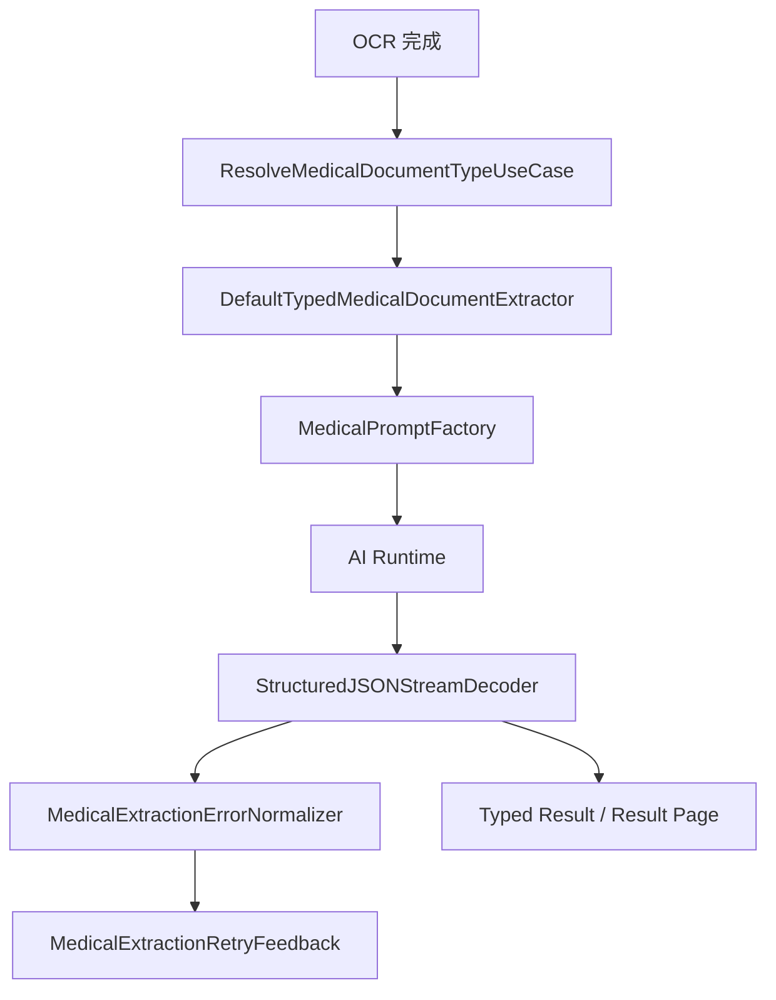
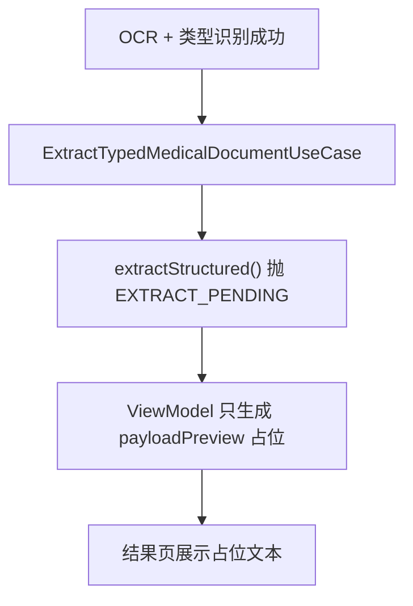
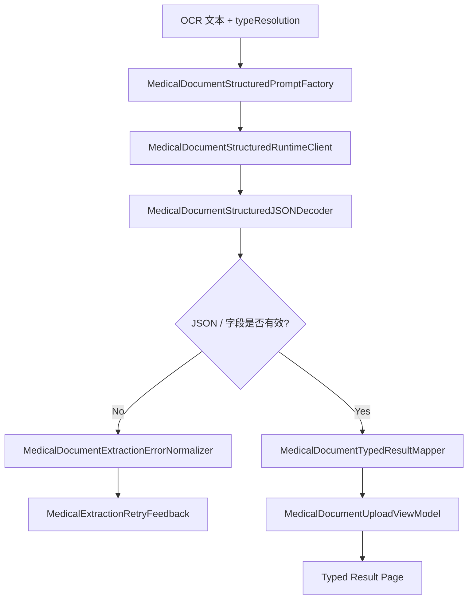

# HOS-MED-UPLOAD-0006 结构化抽取 iOS 对齐工单

> 状态：已实施（待真机验收）。
> 范围：仅覆盖 AI 上传报告链路中的 `extract` 阶段，不包含附件绑定、业务保存和结果提交。
> 硬性约束：本工单只整理 HarmonyOS 侧的业务流程、目录结构、数据架构、实现方案和验收口径；不修改 iOS 代码，不修改服务器代码。
> 触发证据（历史）：`extractStructured()` 曾抛 `EXTRACT_PENDING`；`typedOutput` 为空壳；`capabilities.extraction` 依赖外部 extractor/saver。
> 前置工单：`HOS-MED-UPLOAD-0002`、`HOS-MED-UPLOAD-0003`、`HOS-MED-UPLOAD-0004`、`HOS-MED-UPLOAD-0005`。
> 后续衔接：附件与业务结果匹配、结果确认与保存工单。

## 实施摘要（2026-07-24）

已落地闭环：

1. Domain：`MedicalDocumentStructuredExtractionRequest` / `MedicalDocumentStructuredExtractionError` / 增强 `MedicalExtractionRetryFeedback` / Typed 输出字段
2. Infrastructure：Prompt 工厂、Runtime Client、JSON Decoder、Error Normalizer、Typed Result Mapper
3. Application：`ExtractTypedMedicalDocumentUseCase.extractStructured()` 真实串联；Assembly 在存在 `AIRuntimeService` 时打开 `capabilities.extraction`
4. Presentation：ViewModel EXTRACT 步写入真实 `typedOutput`；`MedicalDocumentTypedResultPage` 承接草稿
5. 测试：`MedicalDocumentUpload0006.test.ets`（Prompt / Decoder / Normalizer / Mapper / UseCase）

未纳入本工单：attachment_binding、save、六类单据强类型 Codable 子模型。

## 1. 对标范围与结论

### 1.1 当前迁移阶段

当前 HarmonyOS 端已经完成：

1. 入口与装配
2. 文件选择与 OSS 上传
3. OCR 与文本合并
4. 医疗文档类型判定

现在停在 `type_recognition -> extract` 的交界处。也就是说，**有通用 AI Runtime 的底座，也有医疗抽取相关的占位模型，但没有真正的医疗结构化抽取闭环**。

| 阶段 | iOS 目标职责 | HarmonyOS 当前事实 | 对齐结论 |
| --- | --- | --- | --- |
| 抽取入口 | 统一把 OCR 文本、类型结果、文档上下文、重试反馈装进抽取用例 | `ExtractTypedMedicalDocumentUseCase` 串联 Prompt / Runtime / Decode / Normalize | 已对齐 |
| Prompt 组装 | 按文档类型生成结构化抽取 Prompt | `MedicalDocumentStructuredPromptFactory` 委托 `PromptLocalizer` | 已对齐 |
| 结构化抽取 | 调用 AI Runtime 生成 JSON，并稳定解码成 Typed 结果 | Runtime Client + JSON Decoder + Typed Mapper | 已对齐（待真机） |
| 错误反馈 | 把字段缺失、类型冲突、AI 输出不合法等问题归一化成可重试反馈 | `MedicalDocumentExtractionErrorNormalizer` + RetryFeedback | 已对齐 |
| 结果页承接 | 抽取完成后进入结果确认页，支持编辑和继续保存 | `MedicalDocumentTypedResultPage` 展示 Typed 草稿；保存未接 | 部分对齐 |

一句话结论：**这一步不是再补一个“抽取按钮”，而是把 OCR / 类型识别的结果真正送进 iOS 同款的结构化抽取链路，产出可落库的 Typed 输出。**

### 1.2 iOS 侧真实能力

iOS 端这块是完整闭环，不是只做“拿到 AI 回答”：

| iOS 组件 | 作用 |
| --- | --- |
| `ExtractTypedMedicalDocumentUseCase.swift` | 统一入口，串联 OCR、类型识别和结构化抽取 |
| `DefaultTypedMedicalDocumentExtractor.swift` | 真正执行结构化抽取，调用 Prompt 和 AI Runtime |
| `MedicalPromptFactory.swift` | 按文档类型组装抽取 Prompt |
| `StructuredJSONStreamDecoder.swift` | 把 AI 输出解码为稳定 JSON / Typed 对象 |
| `MedicalExtractionErrorNormalizer.swift` | 把字段错误、格式错误、模型拒答归一成可重试错误 |
| `MedicalExtractionRetryFeedback.swift` | 为“再试一次”提供结构化反馈 |
| `MedicalDocumentUploadViewModel.swift` | 把抽取结果推到结果页，驱动后续确认与保存 |

### 1.3 HarmonyOS 当前事实

| HarmonyOS 文件 | 当前事实 | 结论 |
| --- | --- | --- |
| `MedicalDocumentUploadViewModel.ets` | 已有 `typedOutput?: MedicalDocumentTypedExtractionOutput`、`typeResolution?: MedicalDocumentTypeResolution`；`typedOutput` 仅填 preview，不填真正抽取 JSON | 结果页是空壳 |
| `ExtractTypedMedicalDocumentUseCase.ets` | 仅完成 `mergeOCRText()` / `resolveType()`；`extractStructured()` 直接抛 `EXTRACT_PENDING` | 抽取主链路未接通 |
| `MedicalDocumentTypedModels.ets` | 已有 `MedicalDocumentTypedExtractionOutput`、`MedicalDocumentTypedEnvelope`、`MedicalTypedResultPayload` 占位 | 数据结构在位，语义未落地 |
| `MedicalExtractionRetryFeedback.ets` | 已定义 retry feedback 领域接口 | 反馈模型在位，但没接 UI 和错误归一化 |
| `MedicalDocumentUploadAssembly.ets` | `extractUseCase` 已注入，但 `capabilities.extraction` 默认取决于 `extractor/saver`，没有真实业务注入时为 false | 装配位在，业务闭环不在 |

## 2. 华为端目录设计

### 2.1 当前目录事实

```text
SparkClientHarmonyOS/entry/src/main/ets/Projects/Features/MedicalDocumentUpload/
├── Application/
│   ├── ExtractTypedMedicalDocumentUseCase.ets
│   ├── MedicalDocumentOCRUseCase.ets
│   ├── ResolveMedicalDocumentTypeUseCase.ets
│   └── MedicalDocumentUploadAssembly.ets
├── Domain/
│   ├── MedicalDocumentTypedModels.ets
│   ├── MedicalExtractionInputSource.ets
│   └── MedicalExtractionRetryFeedback.ets
├── Infrastructure/
│   ├── DefaultMedicalDocumentTypeResolver.ets
│   ├── LocalMedicalDocumentTypeResolver.ets
│   └── MedicalDocumentTypeAIClient.ets
└── Presentation/
    └── MedicalDocumentUploadViewModel.ets
```

### 2.2 目标目录设计

```text
SparkClientHarmonyOS/entry/src/main/ets/Projects/Features/MedicalDocumentUpload/
├── Application/
│   ├── ExtractTypedMedicalDocumentUseCase.ets
│   ├── MedicalDocumentOCRUseCase.ets
│   ├── ResolveMedicalDocumentTypeUseCase.ets
│   └── MedicalDocumentUploadAssembly.ets
├── Domain/
│   ├── MedicalDocumentTypedModels.ets
│   ├── MedicalExtractionInputSource.ets
│   ├── MedicalExtractionRetryFeedback.ets
│   ├── MedicalDocumentStructuredExtractionRequest.ets   # 目标新增
│   └── MedicalDocumentStructuredExtractionError.ets      # 目标新增
├── Infrastructure/
│   ├── MedicalDocumentStructuredPromptFactory.ets        # 目标新增
│   ├── MedicalDocumentStructuredRuntimeClient.ets        # 目标新增
│   ├── MedicalDocumentStructuredJSONDecoder.ets          # 目标新增
│   ├── MedicalDocumentExtractionErrorNormalizer.ets      # 目标新增
│   └── MedicalDocumentTypedResultMapper.ets              # 目标新增
└── Presentation/
    ├── MedicalDocumentUploadViewModel.ets
    └── MedicalDocumentTypedResultPage.ets                # 目标新增
```

### 2.3 文件职责表

| 文件 | 当前职责 | 目标职责 | 状态 |
| --- | --- | --- | --- |
| `ExtractTypedMedicalDocumentUseCase.ets` | 仅转发 OCR 与类型识别 | 串联 Prompt 组装、AI Runtime、JSON 解码、错误归一化、retry feedback | 已实现 |
| `MedicalDocumentTypedModels.ets` | Typed 输出与 envelope 占位 | 定义结构化输出主模型、结果页数据、字段级 payload | 已增强 |
| `MedicalExtractionRetryFeedback.ets` | 结构化 retry 领域接口 | 承接错误归因、字段缺失、AI 输出不合法等反馈 | 已接入 |
| `MedicalDocumentStructuredPromptFactory.ets` | 不存在 | 负责按文档类型生成 Prompt 与上下文 | 已实现 |
| `MedicalDocumentStructuredJSONDecoder.ets` | 不存在 | 把 AI 输出解析成稳定 JSON / Typed 模型 | 已实现 |
| `MedicalDocumentExtractionErrorNormalizer.ets` | 不存在 | 归一化抽取失败、字段冲突、超长输出、JSON 非法 | 已实现 |
| `MedicalDocumentUploadViewModel.ets` | 结果页占位 | 接收真正的 typed 输出、retry feedback、手动修正结果 | 已改造 |

## 3. 分层职责与请求链路

### 3.1 iOS 真实业务流程



### 3.2 当前 HarmonyOS 链路



### 3.3 目标 HarmonyOS 链路



### 3.4 阶段状态

| 阶段 | 输入 | 成功输出 | 失败处理 | 用户可见状态 |
| --- | --- | --- | --- | --- |
| Prompt 构建 | `mergedOCRText`、`typeResolution`、`selectedKind` | 可发送给 AI Runtime 的 structured prompt | 输入空、类型未知则提前拦截 | “正在准备抽取内容” |
| 结构化推理 | prompt + 上下文 | 原始 AI 文本 / 流式 JSON | AI 拒答、超长、超时、格式错误 | “正在抽取字段” |
| JSON 解码 | 原始 AI 输出 | `MedicalDocumentTypedExtractionOutput` | 非法 JSON、字段类型不匹配 | “抽取结果异常，可重试” |
| 错误归一化 | 解码失败或字段冲突 | `MedicalExtractionRetryFeedback` | 提供可重试提示和字段路径 | “请补充/修正后重试” |
| 结果页承接 | typed output | 可编辑的 Typed 结果页 | 回退到 OCR/type 页面 | “识别结果待确认” |

## 4. 核心关键技术与实现方案

### 4.1 现状问题

现在的关键问题不是“没有类型”，而是“没有把类型结果继续喂给真正的结构化抽取器”。

`MedicalDocumentUploadViewModel.ets` 里已经把链路写成：

```text
upload -> OCR -> type_recognition -> extract -> attachment_binding -> save
```

但真正执行到 `extract` 时，当前逻辑只是：

1. 检查 `capabilities.extraction`
2. 如果没有 extractor/saver，直接显示 `结构化抽取待接入`
3. 如果有入口但没有完整实现，仍然是 `EXTRACT_PENDING`

这就是“有通用地基，没医疗业务闭环”。

### 4.2 修复方案一：抽取用例真正接通 Prompt 工厂

建议把结构化抽取单独收进一个稳定的用例，不再让 ViewModel 直接拼 Prompt。

```ts
// Pseudocode: Projects/Features/MedicalDocumentUpload/Application/ExtractTypedMedicalDocumentUseCase.ets
export class ExtractTypedMedicalDocumentUseCase {
  constructor(
    private readonly promptFactory: MedicalDocumentStructuredPromptFactory,
    private readonly runtimeClient: MedicalDocumentStructuredRuntimeClient,
    private readonly decoder: MedicalDocumentStructuredJSONDecoder,
    private readonly errorNormalizer: MedicalDocumentExtractionErrorNormalizer
  ) {}

  async extractStructured(request: MedicalDocumentStructuredExtractionRequest):
    Promise<MedicalDocumentTypedExtractionOutput> {
    const prompt = this.promptFactory.build(request);
    try {
      const raw = await this.runtimeClient.generate(prompt);
      const decoded = this.decoder.decode(raw);
      return MedicalDocumentTypedResultMapper.map(decoded, request);
    } catch (error) {
      throw this.errorNormalizer.normalize(error, request);
    }
  }
}
```

关键点：

1. Prompt 工厂负责文档类型、OCR 文本、字段约束和输出 schema
2. Runtime Client 只负责调用 AI，不夹杂业务判断
3. Decoder 只负责把 AI 输出变成结构化对象
4. Error Normalizer 只负责把错误转成可重试、可展示、可记录的反馈

### 4.3 修复方案二：Typed 输出必须带完整上下文

当前 `typedOutput` 只有 `envelope.typeResolution`、`payloadPreview` 和空 `extractedJSON`，这不够。抽取阶段要承接后续确认和保存，至少要带：

1. 识别类型
2. OCR 文本摘要
3. 原始 AI 输出
4. 解析后的 Typed payload
5. 字段级错误提示
6. 重试反馈

### 4.4 修复方案三：结构化 JSON 解码要比“字符串判断”更严格

iOS 端的 `StructuredJSONStreamDecoder` 是这一步的核心。HarmonyOS 这边建议按同样思路做成独立解码器，规则如下：

| 规则 | 说明 |
| --- | --- |
| JSON 必须可解析 | 不能靠 `contains('{')` 这种弱判断 |
| 字段缺失要可定位 | 给出 `fieldPath`，便于 retry feedback |
| 枚举必须严格收敛 | 例如报告日期、类型、单位、部位、结论不能自由漂移 |
| 允许部分结果 | 非关键字段缺失时可先进入结果页，但要标记 warning |
| 记录原始输出 | 方便追查 AI 输出漂移 |

### 4.5 修复方案四：错误归一化与重试反馈

`MedicalExtractionRetryFeedback` 已经存在，说明领域模型已经意识到“失败后还要继续交互”。

这个模块要接的不是一个简单 `error.message`，而是：

1. 哪个字段失败了
2. 失败类型是什么
3. 是模型输出问题、输入不足，还是类型不一致
4. 是否允许自动重试
5. 重试时是否要带上一次失败原因

### 4.6 修复方案五：结果页先承接 Typed 草稿，再接保存

这个工单不直接做附件绑定/save，但要把结果页的入口形态定清楚：

| 结果页输入 | 说明 |
| --- | --- |
| `typeResolution` | 当前识别的文档类型 |
| `typedOutput` | 结构化抽取后的草稿模型 |
| `retryFeedback` | 可重试提示和字段问题 |
| `ocrTextPreview` | 便于用户核对原始文本 |

这样后续“附件与业务结果匹配”“结果确认与保存”才能顺着这个 Typed 草稿往下接。

## 5. 接口契约与数据模型

### 5.1 抽取请求模型

建议定义一个独立的抽取请求对象，避免把所有参数继续挂在 ViewModel 上：

```ts
export class MedicalDocumentStructuredExtractionRequest {
  memberId: number = 0;
  uploadSessionId: string = '';
  selectedKind: MedicalDocumentKind = MedicalDocumentKind.AUTO;
  typeResolution?: MedicalDocumentTypeResolution;
  mergedOCRText: string = '';
  files: MedicalAttachmentInput[] = [];
  promptSource: MedicalExtractionPromptSource = MedicalExtractionPromptSource.OCR_TEXT;
  previousRetryFeedback?: MedicalExtractionRetryFeedback;
}
```

### 5.2 抽取输出模型

现有 `MedicalDocumentTypedExtractionOutput` 建议扩展成以下语义：

| 字段 | 语义 |
| --- | --- |
| `envelope.memberID` | 结果属于哪个成员 |
| `envelope.typeResolution` | 当前文档类型判定 |
| `typedResult` | 结构化业务 payload |
| `extractedJSON` | 原始 AI 输出或标准化 JSON |
| `payloadPreview` | 结果页预览文本 |
| `source` | OCR 文本 / 图片 Vision 结果 / 混合输入 |
| `retryFeedback` | 抽取失败后的反馈信息 |

### 5.3 错误与反馈模型

`MedicalExtractionRetryFeedback` 在 HarmonyOS 侧已经存在，建议继续保持以下字段语义：

| 字段 | 作用 |
| --- | --- |
| `kind` | 当前文档类型 |
| `step` | 失败发生在哪一步 |
| `errorCode` | 错误码 |
| `fieldPath` | 哪个字段出问题 |
| `expectedType` | 期望类型 |
| `actualType` | 实际类型 |
| `rawMessage` | 原始错误信息 |
| `aiOutputPreview` | 方便给用户和日志看的输出摘要 |
| `suggestion` | 重新识别或手动修正建议 |
| `createdAt` | 反馈时间 |

### 5.4 ViewModel 交互契约

`MedicalDocumentUploadViewModel` 里与抽取有关的状态，建议形成稳定约定：

| 字段 | 用法 |
| --- | --- |
| `typeResolution` | 抽取前的类型输入 |
| `typedOutput` | 抽取成功后的结果页状态 |
| `failedStep` | 抽取失败时定位到 `EXTRACT` |
| `errorPresentation` | 失败提示和重试入口 |
| `needsManualModeSelection` | 当 AI 类型或抽取低置信时提示人工确认 |

## 6. iOS-HarmonyOS 功能对照矩阵

| 项目 | iOS 真实实现 | HarmonyOS 当前实现 | 目标差距 |
| --- | --- | --- | --- |
| 抽取入口 | `ExtractTypedMedicalDocumentUseCase.swift` 统一入口 | `ExtractTypedMedicalDocumentUseCase.ets` 仅做 merge / resolve | 需接真实抽取主流程 |
| Prompt 组装 | `MedicalPromptFactory.swift` 按类型生成 Prompt | 无独立 Prompt 工厂 | 需新增工厂和上下文模型 |
| JSON 解码 | `StructuredJSONStreamDecoder.swift` | 无对应解码器 | 需补严格解码和字段校验 |
| 错误归一化 | `MedicalExtractionErrorNormalizer.swift` | 无对应模块 | 需补字段级可重试错误 |
| 重试反馈 | `MedicalExtractionRetryFeedback.swift` | 仅有领域接口，无链路接入 | 需接到 UI / 日志 / 重试 |
| 结果页输出 | `DefaultTypedMedicalDocumentExtractor.swift` 产出 Typed 结果 | `typedOutput` 仅 preview，占位 JSON 为空 | 需改造成可编辑草稿 |

## 7. 示例工程与官方文档参考结论

### 7.1 iOS 参考文件

| 文件 | 结论 |
| --- | --- |
| `ExtractTypedMedicalDocumentUseCase.swift` | 结构化抽取不是独立脚本，而是 OCR/type/extract 的统一编排 |
| `DefaultTypedMedicalDocumentExtractor.swift` | 真正抽取发生在这里，而不是在 ViewModel |
| `MedicalPromptFactory.swift` | Prompt 必须按文档类型切换 |
| `StructuredJSONStreamDecoder.swift` | 解码器是稳定性核心，不是可有可无的后处理 |
| `MedicalExtractionErrorNormalizer.swift` | 错误必须被业务语义化，才能支持重试和编辑 |

### 7.2 HarmonyOS 可复用底座

| 文件 | 可复用点 |
| --- | --- |
| `Core/AI/Runtime/PromptLocalizer.ets` | 已有场景化 Prompt 文案能力 |
| `Core/AI/Runtime/StructuredRuntimeClient.ets` | 已有结构化 AI 调用入口，可复用作抽取客户端 |
| `MedicalExtractionInputSource.ets` | 抽取输入来源概念已在位 |
| `MedicalExtractionRetryFeedback.ets` | 失败反馈模型已经存在，可直接接链路 |
| `MedicalDocumentTypedModels.ets` | Typed envelope / result 占位已经打底 |

### 7.3 建议的关键技术实现顺序

1. 先接 Prompt 工厂和请求模型
2. 再接 Runtime Client 和 JSON Decoder
3. 再接 Error Normalizer 和 Retry Feedback
4. 最后把 ViewModel 的 `typedOutput` 从占位改成真结果页模型

## 8. 实施拆分与验收

### 8.1 修复拆分

| 拆分项 | 目标 | 验收点 |
| --- | --- | --- |
| 抽取请求模型 | 固化输入边界 | 能从 ViewModel 构造出独立 request |
| Prompt 工厂 | 生成按类型变化的抽取 Prompt | 不同类型输出不同 schema |
| Runtime Client | 调用 AI Runtime | 可拿到原始输出或流式结果 |
| JSON Decoder | 解码成 Typed 对象 | 失败时有明确字段路径 |
| Error Normalizer | 统一失败语义 | 可展示、可重试、可记录 |
| ViewModel 接入 | 结果页承接真实抽取结果 | `typedOutput` 不再是空壳 |

### 8.2 真机验收样本

建议至少覆盖以下样本：

1. 体检报告照片
2. 检查报告照片
3. 处方照片
4. 用药计划截图
5. 家庭药箱清单
6. OCR 文本很短但类型明显的样本
7. AI 输出非法 JSON 的故障样本

### 8.3 日志验收

建议新增并确认以下日志：

```text
medical.upload.extract.start
medical.upload.extract.prompt_ready
medical.upload.extract.runtime_success
medical.upload.extract.decode_success
medical.upload.extract.decode_failed
medical.upload.extract.error_presented
medical.upload.extract.retry_feedback
medical.upload.vm.pipeline_failed step=extract
```

### 8.4 构建与单测

建议至少补以下测试：

1. Prompt 工厂按文档类型生成正确 schema
2. Decoder 能处理正常 JSON 和缺失字段
3. Error Normalizer 能把无效输出转成 retry feedback
4. ViewModel 在 extraction 未装配时只提示 pending，不破坏 OCR/type 状态
5. 抽取成功后 `typedOutput` 和 `typeResolution` 都能进入结果页

## 9. 风险与待确认项

### 9.1 风险

1. AI Runtime 输出 schema 如果不稳定，抽取结果会频繁漂移
2. 如果继续把 Prompt 拼接写在 ViewModel，后续结果页和保存会越来越难维护
3. `typedOutput` 仍然是占位对象的话，结果页很容易和真实业务数据脱节
4. 如果错误归一化不完善，用户会只看到“抽取失败”，没有继续操作的方向
5. 如果不把抽取阶段与保存阶段拆开，后面附件绑定会和 AI 输出纠缠在一起

### 9.2 待确认项

1. 结构化抽取是否默认走 `Core/AI/Runtime` 的现有结构化接口，还是需要单独建医疗抽取 client
2. 结果页是否先展示可编辑草稿，再进入业务保存
3. `MedicalTypedResultPayload` 是否需要按六种单据拆分为独立子模型
4. 抽取失败时是否允许手动补录后直接进入下一步
5. 后续 `attachment_binding/save` 是否继续沿用这份 typed payload，还是单独建立保存 DTO

