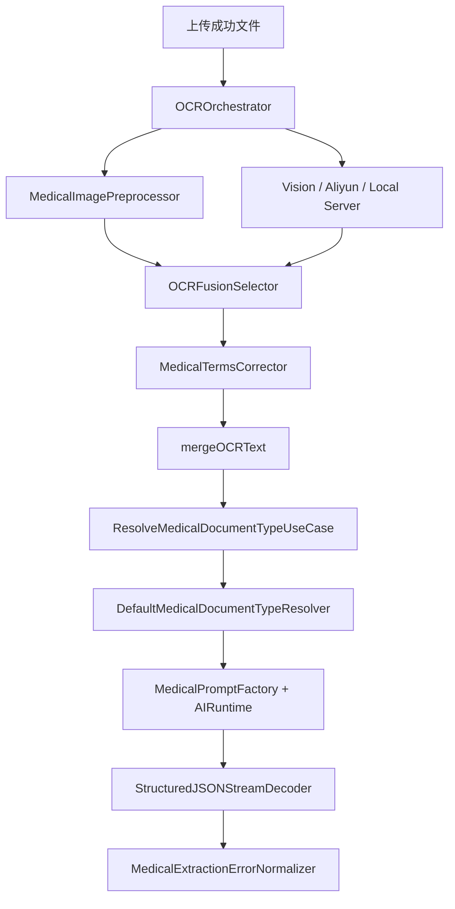
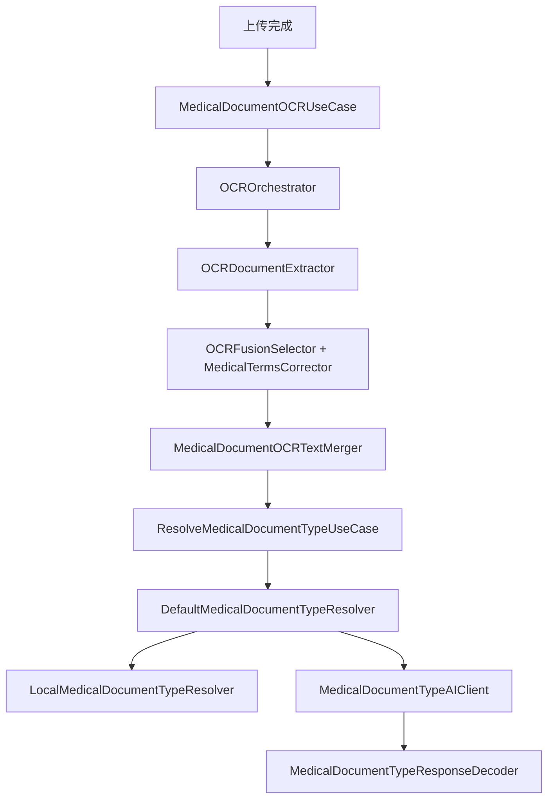

# HOS-MED-UPLOAD-0007 OCR 与类型判定偏差复核 iOS 对齐工单

> 状态：核心偏差已修复，待真机验收。
> 范围：仅覆盖 AI 上传报告链路中的 `OCR`、`文本合并`、`医疗文档类型判定` 三段，不包含结构化抽取、附件绑定和保存。
> 硬性约束：本工单只整理 HarmonyOS 侧的偏差、修复方案、目录结构、业务流程、关键代码与验收口径；不修改 iOS 代码，也不修改服务器代码。
> 触发背景：`HOS-MED-UPLOAD-0002` 与 `HOS-MED-UPLOAD-0003` 已经把 OCR/类型判定从占位状态推进到可运行状态，但和 iOS 的语义、错误分层、文件边界、低置信确认还有差异，需要单独复核。
> 参考端：`SparkClient/SparkClient/Projects/Core/OCR/`、`SparkClient/SparkClient/Projects/Features/MedicalDocumentUpload/`。
> 当前端：`SparkClientHarmonyOS/entry/src/main/ets/Projects/Core/OCR/`、`SparkClientHarmonyOS/entry/src/main/ets/Projects/Features/MedicalDocumentUpload/`。
> 关联工单：`HOS-MED-UPLOAD-0002-OCR与文本合并iOS对齐工单.md`、`HOS-MED-UPLOAD-0003-医疗文档类型判定iOS对齐工单.md`、`HOS-MED-UPLOAD-0006-结构化抽取iOS对齐工单.md`。
> 实施记录（2026-07-25）：已修复 `getTextContent()` 调用、未知文档缩略图兜底、`pdfRenderScale` 扫描页渲染、关闭 `OCRMockFallback`、弱命中 reason 对齐 iOS、`ai_fallback_default` confidence=0.4、解码缺省 confidence=0.5、低置信暂停流水线 + 确认/改类型 UI；单测见 `MedicalDocumentUpload0007.test.ets`。

## 1. 对标范围与结论

### 1.1 当前迁移阶段

当前 HarmonyOS 端已经不再是 `ocr.pending`、`type recognition placeholder` 那种纯占位状态，而是已经接通：

1. 文件输入
2. OCR 编排
3. PDF / 图片 / 文本识别
4. OCR 文本合并
5. 医疗文档类型判定
6. AI 类型兜底

但是，和 iOS 相比，这里仍然有两类偏差：

1. **OCR 偏差**：多引擎编排和 PDF / 图片 / 未知文件兜底的语义已经接近，但仍需要把文件边界、文档格式兜底、真机 PDF 文本层、图像预处理效果和错误分层再压实。
2. **类型判定偏差**：`manual -> localRules -> AI -> fallback` 的主链路已经有了，但低置信确认、AI 响应契约、错误回传和 `reason/source` 语义仍需要和 iOS 再对一次。

| 阶段 | iOS 目标职责 | HarmonyOS 当前事实 | 偏差结论 |
| --- | --- | --- | --- |
| OCR 编排 | Vision / 阿里云 / 本地服务并发，失败隔离，结果融合 | `OCROrchestrator.ets` 已经有并发任务、结果融合和失败隔离 | 基本对齐，仍需真机与边界验收 |
| PDF / 文档提取 | PDF 文本层优先，扫描页再 OCR，未知格式走缩略图 / 兜底路径 | `OCRDocumentExtractor.ets` 已有 PDF / txt / image 分流 | 已接通，但未知文档兜底语义仍需核验 |
| 文本合并 | 保留文件顺序、页序和边界，供类型识别 / 抽取使用 | `MedicalDocumentOCRTextMerger.ets` 保留 `=== File N: name ===` 边界 | 对齐度较高 |
| 类型判定 | 手动优先，本地规则兜底，AI 再兜底，失败可回退 | `DefaultMedicalDocumentTypeResolver.ets` + `LocalMedicalDocumentTypeResolver.ets` + `MedicalDocumentTypeAIClient.ets` | 主链路已接通，契约细节需复核 |
| 类型响应解析 | 只接受白名单类型、稳定解析 `kind/confidence/reason` | `MedicalDocumentTypeResponseDecoder.ets` 已限制白名单 | 已对齐，但容错范围需严格控制 |

一句话结论：**0002 / 0003 现在已经从“未实现”推进到了“可运行，但与 iOS 的工程语义还没完全收敛”**。这张工单要做的不是重复造轮子，而是把这些偏差收口成可执行的修复项。

### 1.2 iOS 侧真实能力

#### OCR 与文本合并

iOS 不是单一识别函数，而是一个小型编排器：

| iOS 文件 | 作用 |
| --- | --- |
| `Projects/Core/OCR/OCROrchestrator.swift` | 并发驱动 Vision / 阿里云 / 本地服务，收集并融合结果 |
| `Projects/Core/OCR/OCRDocumentExtractor.swift` | PDF 文本层优先，扫描页再 OCR，未知文件走缩略图兜底 |
| `Projects/Core/OCR/OCRFusionSelector.swift` | 按文本长度、数字密度、医学词命中和置信度选最优结果 |
| `Projects/Core/OCR/MedicalTermsCorrector.swift` | 对 OCR 文本做医疗词汇校正 |

#### 类型判定

| iOS 文件 | 作用 |
| --- | --- |
| `Projects/Features/MedicalDocumentUpload/Application/ResolveMedicalDocumentTypeUseCase.swift` | 类型判定用例入口 |
| `Projects/Features/MedicalDocumentUpload/Infrastructure/DefaultMedicalDocumentTypeResolver.swift` | manual -> localRules -> AI -> fallback 的总调度 |
| `Projects/Features/MedicalDocumentUpload/Infrastructure/MedicalPromptFactory.swift` | 类型识别 / 抽取 Prompt 组装 |
| `Projects/Features/MedicalDocumentUpload/Infrastructure/StructuredJSONStreamDecoder.swift` | 稳定解析 AI 流式输出 |
| `Projects/Features/MedicalDocumentUpload/Domain/MedicalExtractionErrorNormalizer.swift` | 把解码失败归一成可重试反馈 |

### 1.3 HarmonyOS 侧当前事实

| HarmonyOS 文件 | 当前事实 | 备注 |
| --- | --- | --- |
| `Projects/Core/OCR/OCROrchestrator.ets` | 已接通 Vision / 阿里云 / 本地服务并发任务和融合 | 需要真机验收并发收益和失败隔离 |
| `Projects/Core/OCR/OCRDocumentExtractor.ets` | 已做 PDF / txt / image 分流 | 未知文件兜底路径需和 iOS 对齐 |
| `Projects/Core/OCR/OCRFusionSelector.ets` | 已有综合评分 | 分数策略要持续和 iOS 语义对齐 |
| `Projects/Core/OCR/MedicalImagePreprocessor.ets` | 有预处理层 | 是否等价于 iOS 医疗图像预处理仍需验收 |
| `Projects/Features/MedicalDocumentUpload/Infrastructure/MedicalDocumentOCRTextMerger.ets` | 按文件顺序合并并保留边界 | 与 iOS 的文件边界策略基本一致 |
| `Projects/Features/MedicalDocumentUpload/Infrastructure/DefaultMedicalDocumentTypeResolver.ets` | 已有 manual / localRules / AI / fallback | 重点看 fallback 语义与低置信确认 |
| `Projects/Features/MedicalDocumentUpload/Infrastructure/MedicalDocumentTypeAIClient.ets` | 已接入 Core AI Runtime | 账号缺失时的退化语义要统一 |
| `Projects/Features/MedicalDocumentUpload/Infrastructure/MedicalDocumentTypeResponseDecoder.ets` | 只接受白名单 kind，并剥离 code fence | 需要防止模型输出漂移污染后续链路 |

### 1.4 本工单要修的偏差

#### OCR 侧偏差

1. `OCRDocumentExtractor` 对 PDF 文本层和扫描页的分流已经有了，但需要再确认当前实现和 iOS 的语义是否一致，尤其是：
   - PDF 文本层是不是始终优先；
   - 扫描 PDF 的每页渲染是否稳定；
   - 未知文档是否需要和 iOS 一样走缩略图 / 兜底识别，而不是直接把 URI 交给 OCR。
2. `OCROrchestrator` 已有并发编排，但要确认：
   - 失败引擎不会拖垮整条链路；
   - `selectedEngine` 和 `outputs` 的语义和 iOS 一致；
   - 多引擎融合规则是否会因为不同机型 / SDK 产生偏移。
3. `MedicalImagePreprocessor` 当前是否等价于 iOS 的医疗图像预处理链路，还需要真机验收。这里更像“质量收益待证实”，而不是“代码不存在”。

#### 类型判定侧偏差

1. `DefaultMedicalDocumentTypeResolver` 已经有总调度，但要明确：
   - `manual` 选择的优先级是否始终最高；
   - `localRules` 弱命中是不是和 iOS 一样能进入低置信确认；
   - `AI fallback` 的默认值是不是必须固定为医疗报告；
   - `reason` 字段是否需要保留更稳定的枚举语义。
2. `MedicalDocumentTypeResponseDecoder` 当前只接受 `kind/type/confidence/reason`，这对当前需求够用，但如果 iOS 后续 prompt 增加额外字段，HarmonyOS 端要明确“忽略”还是“扩展”。
3. `MedicalDocumentUploadViewModel` 需要把低置信结果与手动确认的 UI 逻辑彻底收口，避免“已经判定成功，但用户其实应该被要求确认”的语义漂移。

## 2. 华为端目录设计

### 2.1 当前目录事实

```text
SparkClientHarmonyOS/entry/src/main/ets/
├── Projects/
│   ├── Core/
│   │   └── OCR/
│   │       ├── OCROrchestrator.ets
│   │       ├── OCRDocumentExtractor.ets
│   │       ├── OCRFusionSelector.ets
│   │       ├── MedicalImagePreprocessor.ets
│   │       ├── MedicalTermsCorrector.ets
│   │       └── OCRModels.ets
│   └── Features/
│       └── MedicalDocumentUpload/
│           ├── Application/
│           │   ├── MedicalDocumentOCRUseCase.ets
│           │   ├── ResolveMedicalDocumentTypeUseCase.ets
│           │   └── ExtractTypedMedicalDocumentUseCase.ets
│           ├── Domain/
│           │   ├── MedicalDocumentOCRModels.ets
│           │   ├── MedicalDocumentOCRResult.ets
│           │   ├── MedicalDocumentTypeResolverProtocol.ets
│           │   ├── MedicalDocumentTypedModels.ets
│           │   ├── MedicalExtractionRetryFeedback.ets
│           │   └── MedicalDocumentStructuredExtractionRequest.ets
│           ├── Infrastructure/
│           │   ├── HarmonyMedicalDocumentOCRAdapter.ets
│           │   ├── HarmonyMedicalDocumentPDFExtractor.ets
│           │   ├── MedicalDocumentOCRTextMerger.ets
│           │   ├── DefaultMedicalDocumentTypeResolver.ets
│           │   ├── LocalMedicalDocumentTypeResolver.ets
│           │   ├── MedicalDocumentClassifier.ets
│           │   ├── MedicalDocumentTypeAIClient.ets
│           │   └── MedicalDocumentTypeResponseDecoder.ets
│           └── Presentation/
│               └── MedicalDocumentUploadViewModel.ets
```

### 2.2 目标目录设计

本工单不新增新的顶层功能目录，建议继续沿用：

```text
Projects/Core/OCR/
Projects/Features/MedicalDocumentUpload/
```

原因很简单：

1. OCR 和类型判定已经分层，不需要再拆出第二套目录。
2. 当前偏差主要是“语义收敛”和“验收修复”，不是“结构缺失”。
3. 再新建一个 `TypeRecognition/` 目录只会把职责撕碎，反而更难对齐 iOS。

### 2.3 文件职责表

| 文件 | 当前职责 | 修复重点 |
| --- | --- | --- |
| `Projects/Core/OCR/OCROrchestrator.ets` | 多引擎并发编排、结果融合 | 失败隔离、融合评分、真机日志 |
| `Projects/Core/OCR/OCRDocumentExtractor.ets` | PDF / txt / image 分流 | 未知文档兜底、PDF 文本层验收 |
| `Projects/Core/OCR/OCRFusionSelector.ets` | 选出最优 OCR 文本 | 和 iOS 的评分语义对齐 |
| `Projects/Core/OCR/MedicalImagePreprocessor.ets` | 医疗图像预处理 | 预处理是否真的带来收益 |
| `Projects/Features/MedicalDocumentUpload/Infrastructure/MedicalDocumentOCRTextMerger.ets` | 按文件边界合并 OCR 文本 | 保留顺序、边界、空行语义 |
| `Projects/Features/MedicalDocumentUpload/Infrastructure/DefaultMedicalDocumentTypeResolver.ets` | 类型判定总调度 | fallback / confidence / reason |
| `Projects/Features/MedicalDocumentUpload/Infrastructure/MedicalDocumentTypeAIClient.ets` | AI 语义兜底 | 账号缺失与 prompt 语义 |
| `Projects/Features/MedicalDocumentUpload/Infrastructure/MedicalDocumentTypeResponseDecoder.ets` | AI 输出解析 | schema 收敛、未知字段处理 |

## 3. 分层职责与请求链路

### 3.1 iOS 真实业务流程



### 3.2 当前 HarmonyOS 链路



### 3.3 业务边界

| 输入 | 输出 | 说明 |
| --- | --- | --- |
| 本地文件 URI / MIME / OCR 选项 | `OCRRecognition` | 输出单文件 OCR 文本和选中的引擎 |
| 多文件 OCR 结果 | `mergedOCRText` | 保留文件边界，给类型判定和后续抽取使用 |
| `mergedOCRText` + `selectedKind` | `MedicalDocumentTypeResolution` | 返回 manual / localRules / ai 三类来源 |

### 3.4 偏差链路说明

这张工单的重点，不是再描述“流程长什么样”，而是明确哪些地方和 iOS 还没完全一致：

1. OCR 输入层已经接上，但未知文档的兜底路径仍要确认。
2. OCR 输出层已经能合并文本，但边界和排序规则还要继续用真机 case 复核。
3. 类型判定层已经接通三段式策略，但低置信结果和 fallback 语义仍需收口。

## 4. 核心关键技术与实现方案

### 4.1 OCR 偏差修复方案

#### 方案 A：保留多引擎并发，但补齐边界和失败隔离

当前 HarmonyOS 侧已经接入了并发任务和结果融合。下一步不是推翻重做，而是把语义补齐：

```ts
// 伪代码：保持并发收集，但失败引擎只影响局部，不影响整体输出
const tasks = [
  vision.recognizeFromUri(uri, hints),
  aliyun?.recognizeFromUri(uri, hints),
  localServer?.recognizeFromUri(uri, hints)
].filter(Boolean);

const attempts = await Promise.allSettled(tasks);
const outputs = attempts
  .filter(item => item.status === 'fulfilled')
  .map(item => item.value);

if (outputs.length === 0) {
  throw new OCRError('emptyOutput', 'no_ocr_engine_output', 'orchestrator_collect');
}

return OCRFusionSelector.selectBest(outputs, MedicalTermsCorrector.shared(), options.correctMedicalTerms);
```

#### 方案 B：PDF 文本层优先，扫描页再 OCR

这一点 iOS 的语义很清楚，HarmonyOS 也应该继续保持：

```ts
if (isPdf) {
  const textLayer = extractPdfTextLayer(document);
  if (textLayer.trim().length > 0) {
    return makeRecognition('pdf_text_layer', textLayer);
  }
  return ocrScannedPdf(document, recognizer, options);
}
```

工单里要补的不是“有没有 PDF 处理”，而是：

1. `page.getTextContent` 的 API 语义是否和当前 SDK 一致；
2. 扫描页渲染后 OCR 的输出是否足够稳定；
3. 多页 PDF 合并后是否仍能保持页序。

#### 方案 C：未知文档格式不要悄悄吞掉

iOS 对未知格式会尝试缩略图式兜底。HarmonyOS 当前如果只是直接把 URI 丢给 OCR，就需要确认不会把某些文件类型误判为空输出。

建议规则：

1. 已知图片直接识别。
2. 已知 PDF 先文本层，后扫描页。
3. txt 直接读。
4. 未知格式优先做缩略图 / 预览图兜底，再决定是否进入 OCR。

### 4.2 类型判定偏差修复方案

#### 方案 A：保留 `manual -> localRules -> AI -> fallback` 的总调度

这个调度已经存在，关键是把它和 iOS 语义对齐得更彻底：

```ts
export class DefaultMedicalDocumentTypeResolver implements MedicalDocumentTypeResolving {
  async resolve(selectedKind, mergedOCRText, cancellationToken) {
    if (selectedKind !== MedicalDocumentKind.AUTO) {
      return MedicalDocumentTypeResolutionFactory.manual(selectedKind);
    }

    const local = this.localResolver.resolveAutoOnly(mergedOCRText.trim());
    if (local !== undefined) {
      return local;
    }

    const ai = await this.aiClient?.recognize(mergedOCRText.trim(), cancellationToken);
    if (ai !== undefined) {
      return ai;
    }

    return MedicalDocumentTypeResolutionFactory.aiFallbackDefault();
  }
}
```

#### 方案 B：AI 响应严格白名单

这部分不要放松。类型判定不是自由文本聊天，必须只认白名单。

```ts
const kind = MedicalDocumentTypeResponseDecoder.mapKind(kindRaw);
if (kind === undefined) {
  return undefined;
}
```

修复重点：

1. 不接受未知类型；
2. 不接受空 kind；
3. 不让模型自由发明新类型名；
4. 不把 markdown code fence 当成有效结构。

#### 方案 C：低置信确认一定要有明确 UI 语义

类型判定不是“返回一个结果就结束”。

建议在 ViewModel 里把这些场景分开：

1. `manual`：直接通过。
2. `localRules` 强命中：直接通过。
3. `localRules` 弱命中：进入低置信确认。
4. `ai` 命中：如果 confidence 低于阈值，仍要提示确认。
5. `fallback_default`：明确提示是兜底，不是高可信结论。

### 4.3 关键代码修复建议

#### OCR 合并

```ts
// 保留文件边界，避免后续类型识别把不同文件混成一段
export class MedicalDocumentOCRTextMerger {
  static merge(results: MedicalFileOCRResult[]): string {
    return results.map((item, index) => {
      const header = `=== File ${index + 1}: ${item.displayName} ===`;
      const body = normalizeBlankLines(item.text);
      return `${header}\n${body}`;
    }).join('\n\n');
  }
}
```

#### 类型判定结果

```ts
export class MedicalDocumentTypeResolution {
  kind: MedicalDocumentKind = MedicalDocumentKind.MEDICAL_REPORT;
  kindLabel: string = '';
  sourceLabel: string = '';
  confidence: number = 0;
  source: string = 'localRules';
  reason: string = '';
}
```

#### AI 解析

```ts
const jsonText = MedicalDocumentTypeResponseDecoder.stripCodeFence(rawText).trim();
const parsed = JSON.parse(jsonText);
const kind = MedicalDocumentTypeResponseDecoder.mapKind(`${parsed['kind'] ?? parsed['type'] ?? ''}`);
```

## 5. 接口契约与数据模型

### 5.1 OCR 数据模型

| 模型 | 作用 | 关键字段 |
| --- | --- | --- |
| `OCRRecognition` | 单文件或单文档 OCR 结果 | `text`、`selectedEngine`、`outputs` |
| `OCRTextOutput` | 每个引擎的输出 | `engine`、`text`、`confidence`、`elapsedMs` |
| `MedicalDocumentOCRResult` | 医疗上传 OCR 结果汇总 | `fileResults`、`rawMergedOCRText`、`mergedOCRText`、`selectedEngine` |
| `MedicalFileOCRResult` | 单文件 OCR 结果 | `localId`、`displayName`、`engine`、`rawText`、`text`、`confidence` |

### 5.2 类型判定数据模型

| 模型 | 作用 | 关键字段 |
| --- | --- | --- |
| `MedicalDocumentTypeResolution` | 类型判定结果 | `kind`、`kindLabel`、`source`、`sourceLabel`、`confidence`、`reason` |
| `MedicalDocumentTypeResolutionSource` | 类型来源枚举 | `manual`、`localRules`、`ai` |
| `MedicalDocumentTypeResponseDecoder` | AI 输出解析器 | `kind/type`、`confidence`、`reason` |

### 5.3 当前接口边界

1. OCR 侧：输入是文件 URI / MIME / OCR 选项，输出是 `OCRRecognition` 和 `mergedOCRText`。
2. 类型判定侧：输入是 `selectedKind` + `mergedOCRText`，输出是 `MedicalDocumentTypeResolution`。
3. 这两段都不应该直接耦合页面状态，页面只看 ViewModel 里的阶段和结果。

## 6. iOS-HarmonyOS 功能对照矩阵

| 能力 | iOS 实现 | HarmonyOS 当前实现 | 偏差 | 是否需要补工 |
| --- | --- | --- | --- | --- |
| 多引擎 OCR 编排 | `OCROrchestrator.swift` | `OCROrchestrator.ets` | 结构已对齐；并发收益待真机 | 待真机验收 |
| PDF 文本层优先 | `OCRDocumentExtractor.swift` | `getTextContent()` 已改为真实调用 | 代码已修；真机 PDF 样本待验 | 待真机验收 |
| 扫描 PDF 逐页 OCR | `OCRDocumentExtractor.swift` | `getCustomPagePixelMap` + `pdfRenderScale` | 已接通 | 待真机验收 |
| 未知文档缩略图兜底 | QuickLook thumbnail | `desiredSize` 缩略图 → URI OCR → 明确失败 | 已对齐策略 | 待真机验收 |
| OCR 文本合并 | `mergeOCRText` / `buildMergedOCRText` | `MedicalDocumentOCRTextMerger.ets` | 基本对齐 | 继续验收 |
| 医疗词汇校正 | `MedicalTermsCorrector.swift` | `MedicalTermsCorrector.ets` | 已有 | 继续验收 |
| 图像预处理 | Core Image 滤镜链 | 入口透传（未经验证不套滤镜） | 效果待证实 | 待确认 |
| 类型判定总调度 | `DefaultMedicalDocumentTypeResolver.swift` | `DefaultMedicalDocumentTypeResolver.ets` | 已对齐 | 已完成 |
| 本地规则判定 | `LocalMedicalDocumentClassifier` | 弱/强命中均 `advanced_keyword_rules` | 已对齐 iOS reason | 已完成 |
| AI 类型兜底 | parse 失败 → medicalReport / 0.4 | `ai_fallback_default` confidence=0.4 | 已对齐 | 已完成 |
| JSON 响应解析 | strip fence + whitelist | 白名单 + 缺省 confidence=0.5 | 已对齐（未知 kind 更严） | 已完成 |
| 低置信确认 | iOS 生产未闸门；产品意图需确认 | 暂停流水线 + 确认/改类型 UI | 按工单 4.2/8.2 收口 | 已完成（产品强于 iOS 现状） |

## 7. 示例工程与官方文档参考结论

### 7.1 本地参考工程

1. `SparkClientHarmonyOS/entry/src/main/ets/Projects/Core/OCR/`
2. `SparkClientHarmonyOS/entry/src/main/ets/Projects/Features/MedicalDocumentUpload/`
3. `SparkClient/SparkClient/Projects/Core/OCR/`
4. `SparkClient/SparkClient/Projects/Features/MedicalDocumentUpload/`

### 7.2 这次工单可直接借鉴的实现点

1. `OCROrchestrator.ets` 的并发和融合结构，已经足够作为 iOS 对齐基线。
2. `OCRDocumentExtractor.ets` 的 PDF / txt / image 分流，是类型判定前的稳定输入保障。
3. `DefaultMedicalDocumentTypeResolver.ets` 的总调度已经正确，不需要再拆成多个互相抢控制权的入口。
4. `MedicalDocumentTypeResponseDecoder.ets` 的白名单映射思路必须保留，不要退回到“模型说什么就信什么”。

### 7.3 不能直接照搬的部分

1. 不要把 iOS 的 `async let` 和 `actor` 语义硬翻成同名代码，HarmonyOS 要按 ArkTS 的并发方式实现。
2. 不要把 iOS 的 `PDFKit / QuickLook` 路径直接搬过来，必须按当前 HarmonyOS SDK 能力做等价实现。
3. 不要把 `MedicalPromptFactory.swift` 的 prompt 字符串直接硬拷到 HarmonyOS 代码里，应该统一走本地化层。

## 8. 实施拆分与验收

### 8.1 实施拆分

#### 第一阶段：OCR 偏差修复

1. 复核 `OCRDocumentExtractor` 的 PDF 文本层与扫描页路径。
2. 复核未知文档的兜底路径。
3. 复核 `OCRFusionSelector` 与 `MedicalTermsCorrector` 的结果稳定性。
4. 通过真机 / 不同文件类型验证 `mergedOCRText` 的边界保留。

#### 第二阶段：类型判定偏差修复

1. 复核 `DefaultMedicalDocumentTypeResolver` 的 fallback 语义。
2. 复核 `LocalMedicalDocumentTypeResolver` 的弱命中确认路径。
3. 复核 `MedicalDocumentTypeResponseDecoder` 对 code fence / unknown kind 的处理。
4. 复核低置信结果是否需要进入手动确认页。

#### 第三阶段：回归与验收

1. 以真实 PDF、图片、txt 做回归。
2. 以六类文档做类型判定回归。
3. 以低置信文本、空文本、无账号场景做异常回归。

### 8.2 验收用例

| 用例 | 输入 | 预期 |
| --- | --- | --- |
| 图片报告 OCR | 单张医疗图片 | 有稳定 OCR 文本和引擎信息 |
| PDF 文本层 | 带文本层的 PDF | 直接返回文本层，不走扫描 OCR |
| 扫描 PDF | 纯图片型 PDF | 按页 OCR 并合并文本 |
| 类型手动选择 | `selectedKind != auto` | 直接返回 manual |
| 本地强命中 | 明显体检 / 处方 / 病历文本 | 直接返回 localRules |
| 本地弱命中 | 特征不足但仍可猜测 | 返回 low-confidence localRules，并提示确认 |
| AI 兜底 | 本地规则未命中 | 返回 AI 判定或 fallback |
| 空 OCR 文本 | 空输入 | 明确失败，不伪造成功 |

### 8.3 这张工单的完成标准

1. OCR / 文本合并 / 类型判定的链路都能稳定跑通。
2. 和 iOS 的差异项都被标成“已验收”或“待确认”，不能继续混写成“已对齐”。
3. 低置信和 fallback 的 UI 语义要和 iOS 一样清楚。

## 9. 风险与待确认项

1. `getTextContent()` 已按官方签名调用；仍需用「文本层 PDF / 扫描 PDF」真机样本验收分流是否正确。
2. `OCROrchestrator` 的多引擎并发在不同设备上的耗时收益要真机验证，否则只能算结构对齐，不能算效果对齐。
3. `MedicalImagePreprocessor` 当前刻意透传；是否接入 ImageEffect 需真机对比 OCR 收益后再定。
4. `MedicalDocumentTypeResponseDecoder` 的容错边界不能再放宽，否则会把模型输出漂移带进后续抽取。
5. 如果后续 iOS Prompt 增加字段，HarmonyOS 端要先定 schema 版本策略，再决定是否扩展解析器。
6. iOS 生产代码当前不会把 `needsManualModeSelection` 置 true；HarmonyOS 按本工单验收用例实现了低置信闸门。若产品后续要求与 iOS「始终继续抽取」完全一致，需再开需求单收敛。
7. 未知文档缩略图依赖 ImageKit 能否解码该 URI；非图片类未知格式仍可能落到 `unsupported_document_or_thumbnail_failed`（与 iOS QuickLook 覆盖面不完全等价）。

