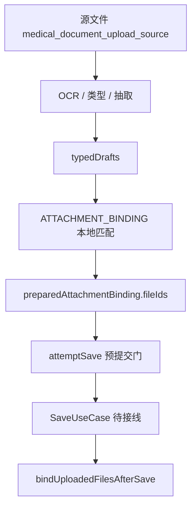

# HOS-MED-UPLOAD-0007 附件与业务结果匹配 iOS 对齐工单

> 状态：已实现（本地匹配 + file_ids 映射 + 服务端 bind UseCase；最终 SaveUseCase 落库仍待后续）
> 范围：仅覆盖 AI 上传报告链路中的 `attachment_binding` 阶段及其与最终业务保存的衔接，不改动 iOS 代码，不改动服务器代码。
> 审计时间：2026-07-25
> 前置工单：`HOS-MED-UPLOAD-0001` ～ `HOS-MED-UPLOAD-0006`、结构化草稿 / 预提交校验
> 补充工单：`HOS-MED-UPLOAD-0010-0007偏差复核补充iOS对齐工单.md`
> 后续衔接：结果确认与保存（SaveUseCase）、各类型业务写接口完整接线
> 测试：`MedicalDocumentUpload0010.test.ets`（不覆盖 OCR 用的 `MedicalDocumentUpload0007.test.ets`）

## 1. 对标范围与结论

### 1.1 当前迁移阶段

HarmonyOS 端已完成「抽取后本地附件匹配」与「保存载荷 file_ids 准备」，服务端 `PATCH /files/business/update/` 绑定器已装配；**真正业务落库仍依赖 SaveUseCase**。

| 阶段 | 当前事实 | 结论 |
| --- | --- | --- |
| upload | `businessType=medical_document_upload_source` | 已完成源文件上传 |
| ocr / type / extract | ViewModel 已串联 | 已完成 |
| attachment_binding（本地） | `MedicalDocumentAttachmentBusinessMatcher` 写入 `typedDrafts.attachmentFileIds` | **已实现** |
| file_ids 映射 | `MedicalDocumentAttachmentBindingMapper` / Shared Bridge | **已实现** |
| 服务端 bind | `DefaultMedicalDocumentAttachmentBinder` + `BindUploadedFilesToMedicalBusinessUseCase` | **已装配，待保存后调用** |
| save | `capabilities.save` 仍依赖 saver 注入 | **未完成落库** |

一句话结论：**附件匹配与绑定编排已对齐 iOS；最终业务保存闭环留给后续工单。**

### 1.2 0010 补充后的正确边界

1. 事实源是 `typedDrafts`（含多类型 `attachmentFileIds`），不是平行新模型。
2. `typedResult` 仅为预览壳。
3. `attemptSave()` 已有预提交门；不等于已完成保存。
4. 绑定映射只做 `attachmentFileIds → file_ids` / 服务端 businessType 回写。

### 1.3 已确认可接 file_ids 的业务对象

| 业务对象 | 代码证据 | 状态 |
| --- | --- | --- |
| 体检报告 | `HealthExamSavePayload.file_ids` + Bridge | 映射就绪 |
| 药箱 | `MedicineBoxWritePayload.file_ids` + Bridge | 映射就绪 |
| 检查报告 / 处方 / 用药计划 / 病历 | 草稿 `attachmentFileIds` + DraftMappers `sourceFileIds` | 字段就绪；远端保存 API 待完整接线 |

## 2. 实现落点

```text
MedicalDocumentUpload/
├── Domain/
│   ├── MedicalDocumentAttachmentBindingModels.ets
│   ├── MedicalDocumentAttachmentBindingMapper.ets
│   └── MedicalDocumentAttachmentBusinessMatcher.ets
├── Application/
│   └── BindUploadedFilesToMedicalBusinessUseCase.ets
├── Infrastructure/
│   └── DefaultMedicalDocumentAttachmentBinder.ets
└── Presentation/
    └── MedicalDocumentUploadViewModel.ets   # ATTACHMENT_BINDING 步骤 + attemptSave 刷新 preparedBinding
Home/.../Shared/
└── MedicalAttachmentBindingBridge.ets
```

## 3. 流程



## 4. 验收

1. [x] 源文件仍先以 `medical_document_upload_source` 进入文件中心
2. [x] 抽取后本地匹配写入多类型 `attachmentFileIds`
3. [x] 体检 / 药箱保存载荷可组装正确 `file_ids`
4. [x] 绑定失败不删除源文件
5. [x] 服务端 binder 已装配；保存成功后可由 `bindUploadedFilesAfterSave` 调用
6. [ ] SaveUseCase 正式落库（后续工单）

## 5. 回退

绑定异常时允许只保留源文件上传状态：源文件可再次匹配；不污染其他业务记录。
