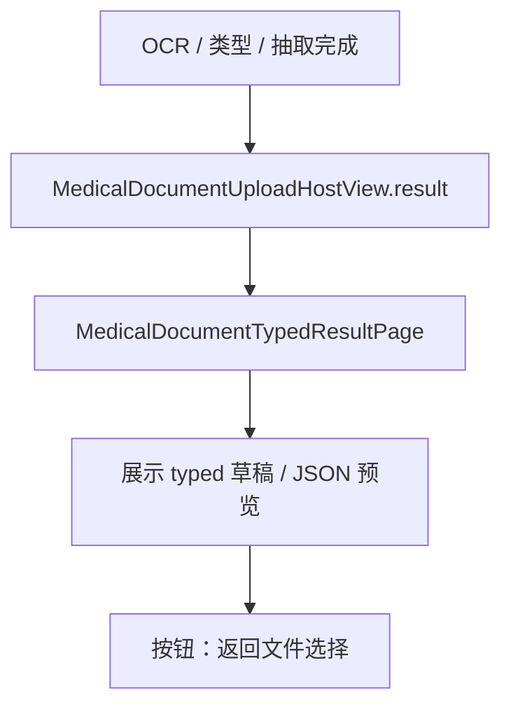
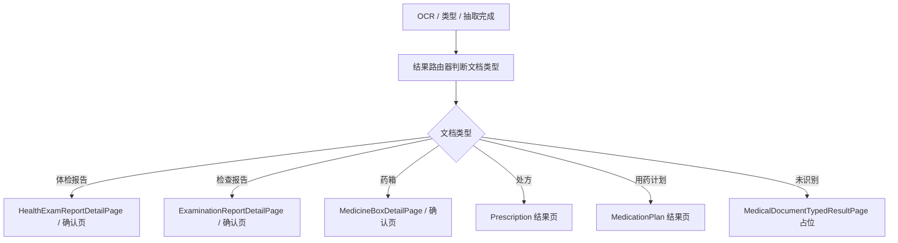

# HOS-MED-UPLOAD-0008 各类型结果页 iOS 对齐工单

> 状态：已实现（上传确认壳分流；正式保存 / 详情态菜单待后续）
> 范围：仅覆盖 AI 上传报告链路中的“各类型结果页”承接，不改动 iOS 代码，不改动服务器代码。
> 审计时间：2026-07-25
> 实现时间：2026-07-25
> 前置工单：`HOS-MED-UPLOAD-0001` ～ `HOS-MED-UPLOAD-0007`、同号「预提交校验与断点续跑」
> 后续衔接：结果确认与保存、附件与业务结果匹配、列表详情页双向桥接
> 测试：`entry/src/test/ets/MedicalDocumentUpload/MedicalDocumentUpload0008c.test.ets`

## 1. 对标范围与结论

### 1.1 当前迁移阶段

HarmonyOS 端上传 Host 已按类型分流到六类识别确认壳；统一 Typed 页降级为 AUTO / 未知兜底。

| 结果页类型 | 当前状态 | 说明 |
| --- | --- | --- |
| 统一 typed 结果页 | 兜底 | `MedicalDocumentTypedResultPage` 仅 AUTO / 未识别 |
| 病例结果页 | 已实现确认壳 | `CaseRecognitionResultPage` |
| 体检报告结果页 | 已实现确认壳 | `HealthExamRecognitionResultPage`（风险总览 + 明细筛选） |
| 检查报告结果页 | 已实现确认壳 | `MedicalReportRecognitionResultPage` |
| 处方结果页 | 已实现确认壳 | `PrescriptionRecognitionResultPage`（药箱候选占位） |
| 用药计划结果页 | 已实现确认壳 | `MedicationRecognitionResultPage` |
| 药箱结果页 | 已实现确认壳 | `MedicineBoxRecognitionResultPage` |

一句话结论：**Host 已通过 `MedicalDocumentResultRouter` 按 kind 分流；六类确认壳可编辑草稿、展示附件与预提交问题；正式 SaveUseCase 与列表详情双向桥接仍待后续。**

### 1.2 这一步和前置工单的关系

这张工单只解决“展示承接”和“页面分流”问题，不负责保存接口本身。

| 上游能力 | 当前状态 | 对本工单的影响 |
| --- | --- | --- |
| OCR / 类型判定 / 结构化抽取 | 已接通 | 结果页可以拿到类型和 Typed 草稿 |
| 附件与业务结果匹配 | 待实施 | 结果页需要保留附件回显入口 |
| 结果确认与保存 | 待实施 | 结果页要为保存动作留出确认入口 |

## 2. 华为端目录设计

### 2.1 当前目录事实（已落地）

```text
SparkClientHarmonyOS/entry/src/main/ets/Projects/Features/MedicalDocumentUpload/
├── Domain/
│   └── MedicalDocumentResultKindResolver.ets
└── Presentation/
    ├── MedicalDocumentUploadHostView.ets          # result → ResultRouter
    ├── MedicalDocumentTypedResultPage.ets         # AUTO 兜底
    ├── MedicalDocumentUploadViewModel.ets
    └── ResultPages/
        ├── MedicalDocumentResultRouter.ets
        ├── Shared/
        │   ├── MedicalDocumentResultChrome.ets
        │   └── PreSubmitValidation/
        │       └── MedicalPreSubmitValidationBanner.ets
        ├── CaseRecognitionResult/CaseRecognitionResultPage.ets
        ├── HealthExamRecognitionResult/HealthExamRecognitionResultPage.ets
        ├── MedicalReportRecognitionResult/MedicalReportRecognitionResultPage.ets
        ├── PrescriptionRecognitionResult/PrescriptionRecognitionResultPage.ets
        ├── MedicationRecognitionResult/MedicationRecognitionResultPage.ets
        └── MedicineBoxRecognitionResult/MedicineBoxRecognitionResultPage.ets
```

### 2.2 本工单建议的目标目录

已按 iOS `ResultPages/` 落地上传侧确认壳；`Home/.../MedicalLists/Shared/MedicalDocumentResultBridge.ets` 留待与列表详情双向桥接时再补。

### 2.3 目录职责边界

| 层级 | 应放内容 | 不应放内容 |
| --- | --- | --- |
| `MedicalDocumentUpload/Presentation` | 上传 Host、结果路由、结果页外壳 | 业务保存细节 |
| `MedicalDocumentUpload/Domain` | 结果类型枚举、Typed 输出、页面分流模型 | UI 文案和按钮逻辑 |
| `Home/Presentation/MedicalLists/*` | 体检、检查、药箱等真实业务详情页 | 通用 OCR 或 AI Prompt |
| `Home/Presentation/MedicalLists/Shared` | 结果页与业务详情页之间的桥接 | 上传状态机 |

## 3. 分层职责与请求链路

### 3.1 当前请求链路



### 3.2 目标请求链路



### 3.3 关键职责表

| 责任 | 当前实现 | 本工单目标 |
| --- | --- | --- |
| 上传 Host 分流 | `result` 分支存在 | 分流到类型化结果页 |
| 统一 typed 预览 | `MedicalDocumentTypedResultPage` 已存在 | 保留为兜底页，不作为最终业务页 |
| 体检结果页 | `HealthExamReportDetailPage` 已存在 | 接入上传结果来源 |
| 检查结果页 | `ExaminationReportDetailPage` 已存在 | 接入上传结果来源 |
| 药箱结果页 | `MedicineBoxDetailPage` 已存在 | 接入上传结果来源 |
| 处方 / 用药计划 | 未确认页面 | 需要补骨架或明确兜底策略 |

## 4. 结果页设计与分流规则

### 4.1 结果页分层原则

1. `MedicalDocumentTypedResultPage` 只负责“通用草稿展示”和“未识别兜底”
2. 体检、检查、药箱等已有真实业务页应该承担主要编辑/确认职责
3. 处方、用药计划如果没有现成业务页，应先创建轻量确认页，再逐步接入完整保存
4. 结果页必须保留“返回文件选择”和“继续编辑”的回退路径

### 4.2 现有证据

| 文件 | 证据 |
| --- | --- |
| `Projects/Features/MedicalDocumentUpload/Presentation/MedicalDocumentUploadHostView.ets` | `result` 分支直接渲染 `MedicalDocumentTypedResultPage` |
| `Projects/Features/MedicalDocumentUpload/Presentation/MedicalDocumentTypedResultPage.ets` | 页内文案包含“识别结果待确认”和兜底的草稿 JSON 展示 |
| `Projects/Features/MedicalDocumentUpload/Domain/SupportingModels.ets` | 文案 key `medical.upload.result.pending` 对应“识别结果页面待接入” |
| `Projects/Features/Home/Presentation/MedicalLists/HealthExamReports/HealthExamReportDetailPage.ets` | 体检报告已有真实详情页 |
| `Projects/Features/Home/Presentation/MedicalLists/ExaminationReports/ExaminationReportDetailPage.ets` | 检查报告已有真实详情页 |
| `Projects/Features/Home/Presentation/MedicalLists/MedicineBox/MedicineBoxDetailPage.ets` | 药箱已有真实详情页和附件展示 |

### 4.3 建议的页面策略

| 文档类型 | 目标页面 | 说明 |
| --- | --- | --- |
| 体检报告 | `HealthExamReportDetailPage` 或其上传确认壳 | 复用现成详情页，补“从上传进入”的入口参数 |
| 检查报告 | `ExaminationReportDetailPage` 或其上传确认壳 | 复用现成详情页，补“从上传进入”的入口参数 |
| 药箱 | `MedicineBoxDetailPage` 或表单确认页 | 现有详情页能回显附件，适合作为结果页承接点 |
| 处方 | 新确认页或兜底页 | 当前未确认有成熟结果页骨架 |
| 用药计划 | 新确认页或兜底页 | 当前未确认有成熟结果页骨架 |

### 4.4 分流规则建议

| 输入条件 | 输出页面 |
| --- | --- |
| `typeResolution.kind` 为体检报告 | 体检结果页 |
| `typeResolution.kind` 为检查报告 | 检查结果页 |
| `typeResolution.kind` 为药箱相关 | 药箱结果页 |
| `typeResolution.kind` 为处方 | 处方结果页或统一兜底页 |
| `typeResolution.kind` 为用药计划 | 用药计划结果页或统一兜底页 |
| 类型未识别或抽取失败 | `MedicalDocumentTypedResultPage` |

## 5. 当前实现、缺口与演进

### 5.1 当前实现

| 模块 | 当前状态 | 说明 |
| --- | --- | --- |
| 上传 Host | 已有 `result` 分支 | 但只是统一 typed 结果页 |
| 通用结果页 | 已有 | 只承接草稿，不承担业务编辑闭环 |
| 体检详情页 | 已有 | 可作为结果页承接候选 |
| 检查详情页 | 已有 | 可作为结果页承接候选 |
| 药箱详情页 | 已有 | 可作为结果页承接候选 |
| 处方 / 用药计划 | 未确认 | 需补页面或明确兜底策略 |

### 5.2 关键缺口

| 缺口 | 现象 | 影响 |
| --- | --- | --- |
| 结果页未按类型分流 | Host 直接进统一 typed 页 | 用户无法进入对应业务确认界面 |
| 统一页过于抽象 | 只展示草稿和 JSON | 不能完成最终业务编辑 |
| 现有业务页未接上传入口 | 详情页是独立业务页 | 上传结果无法直达确认保存 |
| 处方/用药计划页缺失 | 扫描未找到对应结果页骨架 | 无法形成全类型闭环 |

### 5.3 演进顺序

1. 先新增结果路由器，按文档类型选择页面
2. 再把体检、检查、药箱这三类已存在详情页接进上传结果
3. 然后补处方、用药计划的结果页骨架
4. 最后把统一 typed 页降级为兜底页

## 6. 测试与验收标准

### 6.1 建议测试目录

```text
SparkClientHarmonyOS/entry/src/test/ets/MedicalDocumentUpload/
└── MedicalDocumentUpload0008.test.ets   # 目标新增
```

### 6.2 建议测试场景

| 场景 | 预期结果 |
| --- | --- |
| 上传完成后进入结果页 | 根据类型进入对应业务结果页 |
| 类型识别不明确 | 回落到统一 `MedicalDocumentTypedResultPage` |
| 体检报告结果页 | 能承接上传来的草稿并进入确认/编辑 |
| 检查报告结果页 | 能承接上传来的草稿并进入确认/编辑 |
| 药箱结果页 | 能承接上传来的草稿并展示附件 |
| 处方 / 用药计划 | 若页面缺失，则有明确兜底页，不崩溃 |
| 返回文件选择 | 能保留已上传源文件，不丢失断点 |

### 6.3 整体验收标准

1. `MedicalDocumentUploadHostView` 的结果分支不再只停留在统一 typed 页
2. 体检、检查、药箱至少三类能进入对应业务结果页或确认壳
3. `MedicalDocumentTypedResultPage` 只作为兜底和未识别承接，不是最终业务页
4. 处方、用药计划不会因为页面未接入而直接崩溃
5. 从结果页返回文件选择时，源文件和当前识别上下文仍可恢复

## 7. 页面设计总则

### 7.1 统一设计原则

结果页不是简单的“把字段列出来”，而是要同时满足四个目标：

1. 让用户一眼知道这是哪一类医疗单据
2. 让用户看见识别结果的可信度、缺失项和可编辑项
3. 让用户能继续进入最终业务保存或确认
4. 让用户在返回、重选、失败重试时不丢数据

### 7.2 iOS 对齐基线

iOS 端结果页并不是单个“表单页面”，而是分成两种结构：

| iOS 页面形态 | 职责 | HarmonyOS 对齐目标 |
| --- | --- | --- |
| 识别确认页 | 展示 OCR / 类型识别 / 抽取草稿，允许继续确认 | `MedicalDocumentTypedResultPage` 的增强版 |
| 业务详情页 | 展示已保存业务的真实详情、附件、操作菜单 | 体检/检查/药箱详情页的上传承接壳 |

因此 HarmonyOS 的结果页设计也要保持这两个层次：

1. 通用 typed 页负责兜底和草稿展示
2. 类型化业务页负责真正的编辑、确认和保存

### 7.3 页面视觉基调

| 维度 | 推荐表现 |
| --- | --- |
| 背景 | 浅灰分组背景，避免纯白一屏到底 |
| 卡片 | 圆角卡片、分区清晰、区块之间保持 12~16vp 间距 |
| 主标题 | 18~20sp，加粗，语义明确 |
| 次级说明 | 13~14sp，灰色，避免喧宾夺主 |
| 强提示 | 红/橙色，只用于缺失字段、风险和错误 |
| 正常状态 | 蓝/绿/青色，和 iOS 健康类页面保持一致 |

### 7.4 页面组织方式

每个结果页都按以下顺序组织：

```text
顶部导航
  ↓
页面标题与类型标签
  ↓
主体信息卡
  ↓
识别/编辑核心区
  ↓
附件与关联区
  ↓
保存 / 确认 / 返回操作区
```

## 8. 统一 Typed 结果页设计

### 8.1 页面定位

`MedicalDocumentTypedResultPage` 在 HarmonyOS 里应该承担的角色是：

1. 未识别类型的兜底页
2. 抽取草稿的统一预览页
3. 业务类型不支持时的安全出口
4. 结果页路由失败时的保护层

它不应该承担最终业务编辑闭环，也不应该取代体检、检查、药箱这些已有业务详情页。

### 8.2 页面设计

页面风格应接近 iOS 的识别确认页，而不是一个普通 debug 页面：

| 设计点 | 说明 |
| --- | --- |
| 页面定位 | “识别结果待确认”而不是“结果已保存” |
| 顶部标题 | 直接说明当前是识别确认，不要只显示系统页名 |
| 内容密度 | 允许展示部分 JSON，但主视觉应是草稿摘要而不是原始文本 |
| 交互 | 提供“返回文件选择”或“继续确认”按钮 |
| 失败兜底 | OCR 未产出时展示预览文本或占位说明 |

### 8.3 页面模块

```text
MedicalDocumentTypedResultPage
├── 页面标题区
│   ├── 主标题：识别结果待确认
│   ├── 副标题：识别类型 / 草稿来源
│   └── 类型标签：体检 / 检查 / 处方 / 用药计划 / 药箱 / 未识别
├── 结果摘要区
│   ├── resultTitle
│   ├── resultSummary
│   └── warningText
├── 结构化预览区
│   ├── payloadPreview
│   └── typedOutputJson
├── OCR 预览区
│   └── ocrPreview
└── 操作区
    ├── 返回文件选择
    └── 继续确认 / 进入业务页（目标）
```

### 8.4 页面要素

| 要素 | 作用 | 当前状态 | 对齐建议 |
| --- | --- | --- | --- |
| 主标题 | 传达当前处于确认流程 | 已有 | 文案要稳定，不要只写通用系统提示 |
| 类型标签 | 显示识别类型 | 已有 | 用明确业务词，不用缩写 |
| 结果摘要 | 告诉用户识别到什么 | 已有 | 可根据类型切换显示规则 |
| 缺失字段提示 | 告诉用户哪些字段待补 | 基础占位 | 后续接入字段级校验 |
| JSON 预览 | 排查问题和兜底 | 已有 | 仅调试级，不作为主交互 |
| 返回文件选择按钮 | 支持撤回与重选 | 已有 | 保留且不弱化 |

### 8.5 iOS 对齐点

iOS 对应的是上传确认页而不是详情页：

1. 上方是识别结果语义，不是原始模型输出
2. 中间是关键字段摘要，而不是单纯 JSON
3. 底部是继续确认动作，而不是让用户自己理解协议结构

HarmonyOS 当前的 `MedicalDocumentTypedResultPage` 已经有这层骨架，但需要继续向“业务确认壳”演进。

## 9. 体检报告结果页设计

### 9.1 页面定位

体检报告是这条链路里最接近 iOS 识别结果页的一类页面。它既要支持上传结果的确认，又要支持保存后的只读详情查看。

在 HarmonyOS 中，建议把体检结果页拆成两个层级：

1. 结果确认壳：接上传草稿，允许编辑、补齐、保存
2. 详情只读壳：接已保存数据，允许归档、删除、分享

### 9.2 页面设计

体检页面应保持 iOS 一贯的“健康记录”风格：

| 设计点 | 说明 |
| --- | --- |
| 主色 | 健康类页面偏青绿/蓝绿色 |
| 信息结构 | 先摘要、再风险、再明细、最后附件 |
| 阅读顺序 | 从上到下是“这是什么、有什么风险、有哪些条目、附了什么文件” |
| 操作语义 | 识别确认页强调“保存/继续确认”，详情页强调“归档/删除/分享” |

### 9.3 页面模块

```text
HealthExamResultPage
├── 顶部导航
│   ├── 返回
│   ├── 页面标题
│   └── 菜单（详情态）
├── 识别状态区
│   ├── 类型标签
│   ├── 风险提示
│   └── 保存状态 / 记录 ID
├── 成员信息区
│   ├── 成员头像或名称
│   └── 关联成员指标计数
├── 基础信息区
│   ├── 机构名
│   ├── 报告号
│   ├── 体检日期
│   ├── 报告类型
│   └── 综述摘要
├── 风险总览区
│   ├── 高风险计数
│   ├── 中风险计数
│   └── 低风险计数
├── 明细分组区
│   ├── 分类折叠组
│   ├── 每条明细卡片
│   └── 全部 / 正常 / 异常筛选
├── 附件区
│   ├── 源文件预览
│   ├── 远端附件网格
│   └── 添加/替换附件入口
└── 操作区
    ├── 保存确认
    ├── 返回文件选择
    └── 详情态：分享 / 归档 / 删除
```

### 9.4 页面要素

| 模块 | 页面要素 | 作用 |
| --- | --- | --- |
| 顶部导航 | 返回、标题、详情菜单 | 区分确认态和详情态 |
| 识别状态区 | 类型标签、风险提示、记录 ID | 让用户知道当前数据阶段 |
| 成员信息区 | 成员名、头像、指标总数 | 确认归属成员 |
| 基础信息区 | 机构、报告号、日期、类型、摘要 | 体检报告的核心识别结果 |
| 风险总览区 | 高/中/低风险统计块 | 复用 iOS 风险卡片语义 |
| 明细分组区 | 分类折叠、异常颜色、筛选 | 对齐 iOS `categoryGroups` 和 summary row |
| 附件区 | 原始文件、远端文件 | 支持上传结果与详情结果共用 |
| 操作区 | 保存、返回、分享、归档、删除 | 覆盖确认与详情两种状态 |

### 9.5 iOS 对齐点

体检结果页应对齐 iOS 的这些结构：

1. 成员信息和报告基础信息先出现
2. 风险总览优先于长明细列表
3. 明细按分类折叠，而不是直接平铺一长列
4. 附件区必须保留，因为上传结果和详情页都要展示附件
5. 详情态工具菜单要和识别确认态分开

### 9.6 当前 HarmonyOS 现状与缺口

| 现状 | 缺口 |
| --- | --- |
| 有 `HealthExamReportDetailPage` | 没有上传结果确认壳 |
| 有列表和详情 | 没有从上传页进入的入口参数 |
| 有附件展示 | 没有把源文件和草稿一起承接的桥接层 |
| 有归档/删除 | 没有保存前的字段校验和确认按钮 |

## 10. 检查报告结果页设计

### 10.1 页面定位

检查报告比体检报告更像“总览 + 分类细页”结构。它既要能承接上传识别结果，也要能进入不同分类的明细页。

### 10.2 页面设计

检查结果页的设计要先给出整体报告语义，再按分类把信息展开：

| 设计点 | 说明 |
| --- | --- |
| 先总览后细节 | 先让用户知道这是哪张检查报告，再看各分类明细 |
| 分类驱动 | 实验室、影像、病理是三条主要阅读路径 |
| 结果密度 | 不同分类展示密度不同，不能一刀切 |
| 行为入口 | 提供保存、编辑、归档、删除和查看完整明细 |

### 10.3 页面模块

```text
ExaminationResultPage
├── 顶部导航
│   ├── 返回
│   ├── 页面标题
│   └── 菜单（详情态）
├── 识别总览区
│   ├── 类型标签
│   ├── 报告标题
│   └── 保存状态
├── 报告摘要区
│   ├── 就诊机构
│   ├── 日期
│   ├── 科室
│   └── 医生
├── 总览说明区
│   ├── findings
│   └── impression
├── 分类导航区
│   ├── 实验室
│   ├── 影像
│   └── 病理
├── 分类明细区
│   ├── 每条明细摘要卡
│   ├── 完整检验表入口
│   └── 单行详情页入口
├── 附件区
│   ├── 源文件
│   └── 远端附件
└── 操作区
    ├── 保存确认
    ├── 返回文件选择
    └── 详情态：分享 / 归档 / 删除
```

### 10.4 页面要素

| 模块 | 页面要素 | 作用 |
| --- | --- | --- |
| 报告摘要区 | 机构、日期、科室、医生 | 快速确认来源 |
| 总览说明区 | findings、impression | 对齐 iOS 总览页叙事卡 |
| 分类导航区 | 实验室/影像/病理 | 提供明细入口 |
| 分类明细区 | 项目名、结果、单位、参考范围、flag | 对齐 iOS 行级展示 |
| 附件区 | 原图/PDF/远端附件 | 支持保存前后统一回看 |

### 10.5 iOS 对齐点

iOS 检查报告的结构核心是：

1. 总览详情页负责摘要和页面级操作
2. 实验室、影像、病理有独立明细结构
3. 上传确认页和详情页共享同构数据，但模式不同
4. 附件必须和报告并列展示，不能藏在角落

HarmonyOS 应把现有 `ExaminationReportDetailPage` 作为详情壳，再补一个上传确认壳承接草稿。

## 11. 药箱结果页设计

### 11.1 页面定位

药箱既是识别结果页，也是最终业务编辑页。它和体检、检查不同，除了确认识别内容，还要支持保存为药品实体并立刻回到列表。

### 11.2 页面设计

药箱结果页的设计要更像“编辑表单 + 附件管理 + 详情确认”组合页：

| 设计点 | 说明 |
| --- | --- |
| 表单优先 | 药品名称、类型、剂型、规格、单位等字段必须前置 |
| 附件显眼 | 药品图片和外包装图对确认非常关键 |
| 适合编辑 | 允许用户在识别后继续改品牌、数量、有效期 |
| 强操作 | 保存、归档、删除、编辑入口要直接可见 |

### 11.3 页面模块

```text
MedicineBoxResultPage
├── 顶部导航
│   ├── 返回
│   ├── 页面标题
│   └── 菜单（详情态）
├── 识别摘要区
│   ├── 药品识别标签
│   ├── 候选名称
│   └── 保存状态
├── 药品信息区
│   ├── 药品名称
│   ├── 药品类型
│   ├── 品牌
│   ├── 剂型
│   ├── 规格
│   └── 剂量单位
├── 库存与有效期区
│   ├── 总数量
│   ├── 是否设置有效期
│   └── 有效期日期
├── 备注区
│   └── 备注文本
├── 附件区
│   ├── 已保存附件
│   ├── 待上传附件
│   └── 预览卡片
└── 操作区
    ├── 保存确认
    ├── 返回文件选择
    ├── 编辑
    ├── 归档 / 取消归档
    └── 删除
```

### 11.4 页面要素

| 模块 | 页面要素 | 作用 |
| --- | --- | --- |
| 药品信息区 | 名称、类型、品牌、剂型、规格、单位 | 药箱核心识别字段 |
| 库存区 | 数量、有效期开关、日期 | 药品管理核心字段 |
| 备注区 | 说明文本 | 存放补充语义 |
| 附件区 | 外包装、说明书、药品图片 | 对齐 iOS 的附件展示和绑定思路 |
| 操作区 | 保存、编辑、归档、删除 | 对齐详情页动作 |

### 11.5 iOS 对齐点

iOS 药箱页面的核心是：

1. 列表、详情、表单是同一个药箱实体的不同外壳
2. 附件必须在详情里可见，也必须能在表单中继续上传
3. OCR 结果进入后，需要和药箱实体合流，而不是另起一套识别页
4. 处方候选绑定是药箱结果页的重要扩展方向

HarmonyOS 当前已有 `MedicineBoxDetailPage`，但还缺少从医疗文档上传结果直接进入它的结果确认壳。

## 12. 处方与用药计划结果页设计

### 12.1 当前状态

这两类页面在 HarmonyOS 本次代码扫描里没有找到足够清晰的结果页骨架，因此本工单先按 iOS 的模式给出目标设计，实际实现时需要再补代码证据核验。

### 12.2 页面设计

处方与用药计划都应该遵循“识别确认 + 可编辑 + 可保存”的模式，但页面重点不同：

| 类型 | 页面重点 | 风险 |
| --- | --- | --- |
| 处方 | 药品、用法、频次、疗程、关联药箱 | 字段多、歧义高 |
| 用药计划 | 周期、时间点、剂量、提醒规则、关联成员 | 时间语义复杂 |

### 12.3 页面模块

#### 处方结果页

```text
PrescriptionResultPage
├── 顶部导航
├── 识别摘要区
├── 处方基本信息区
│   ├── 开方机构
│   ├── 开方日期
│   ├── 医生
│   └── 处方号
├── 药品明细区
│   ├── 每味药品卡
│   ├── 规格
│   ├── 用法用量
│   └── 疗程
├── 药箱候选区
│   ├── 已有药箱绑定
│   └── 新建药箱候选
├── 附件区
└── 操作区
```

#### 用药计划结果页

```text
MedicationPlanResultPage
├── 顶部导航
├── 识别摘要区
├── 计划主体区
│   ├── 成员
│   ├── 开始日期
│   ├── 结束日期
│   ├── 周期
│   └── 提醒规则
├── 药品与剂量区
│   ├── 药品名
│   ├── 单次剂量
│   ├── 每日次数
│   └── 备注
├── 附件区
└── 操作区
```

### 12.4 页面要素

| 页面 | 必备要素 | 说明 |
| --- | --- | --- |
| 处方 | 药品、频次、剂量、疗程、药箱候选 | 必须能把处方落到药箱或计划中 |
| 用药计划 | 成员、时间、剂量、提醒、药品 | 必须能关联提醒系统 |

### 12.5 iOS 对齐点

从 iOS 侧的总领文档看，处方和用药计划不是简单的文本展示，而是可以继续绑定到药箱和提醒体系的结构化页面。因此 HarmonyOS 不能把它们做成一个纯预览页，而要预留可编辑、可保存、可绑定的结构。

## 13. 页面状态、错误与交互细节

### 13.1 页面状态

每个结果页都至少要支持以下状态：

| 状态 | 页面表现 |
| --- | --- |
| 加载中 | skeleton / loading / 占位卡 |
| 成功 | 显示结构化数据 |
| 空数据 | 显示“待补充”或“无识别结果” |
| 失败 | 显示错误文案和重试按钮 |
| 部分成功 | 已有字段展示，缺失字段高亮 |
| 可编辑 | 字段可点选或可切换到表单 |

### 13.2 交互细节

| 交互 | 说明 |
| --- | --- |
| 返回文件选择 | 保留当前识别上下文，不重置源文件 |
| 重新识别 | 保留已上传文件，重跑 OCR / 类型 / 抽取 |
| 保存确认 | 进入最终业务保存，不只是关闭页面 |
| 取消 | 仅退出当前结果页，不删除源文件 |
| 附件预览 | 允许查看原始文件或远端文件 |

### 13.3 当前 HarmonyOS 需要补的公共能力

1. 类型路由器
2. 结果页桥接器
3. 各类型页面的统一顶部操作栏
4. 识别结果草稿和业务详情之间的数据转换器

## 14. 结果页总体验收标准

### 14.1 页面级验收

1. [x] 统一 typed 页兜底 AUTO / 未知类型
2. [x] 体检、检查、药箱进入对应确认壳
3. [x] 处方、用药计划有明确确认壳，不空路由
4. [x] 每页含标题区、主体区、附件区、操作区
5. [x] 字段承接 `typedDrafts`，非仅 JSON

### 14.2 交互级验收

1. [x] 返回文件选择保留源文件（`returnToPickingPreservingFiles`）
2. [x] 预提交问题横幅 + fieldKey / scrollTargetID 锚点
3. [x] `attemptSave` 校验门（正式 SaveUseCase 待接线）
4. [ ] 与列表详情页双向桥接（后续）
5. [ ] 处方药箱候选远端匹配（后续）

### 14.3 本轮实现落点

| 能力 | 落点 |
| --- | --- |
| 分流 | `MedicalDocumentResultKindResolver` + `MedicalDocumentResultRouter` |
| 六类确认壳 | `ResultPages/*RecognitionResult*` |
| 共享 UI | `MedicalDocumentResultChrome` + `MedicalPreSubmitValidationBanner` |
| VM | `resultDocumentKind` / `notifyTypedDraftChanged` / `expandPreSubmitSection` |
| Host | `ResultBody` → Router |
| 单测 | `MedicalDocumentUpload0008c.test.ets` |
