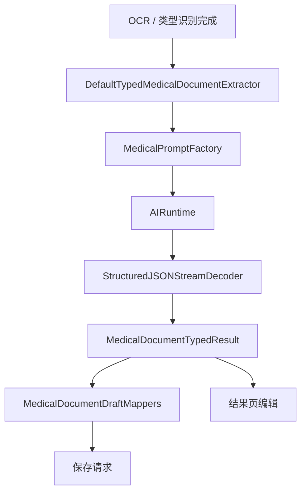
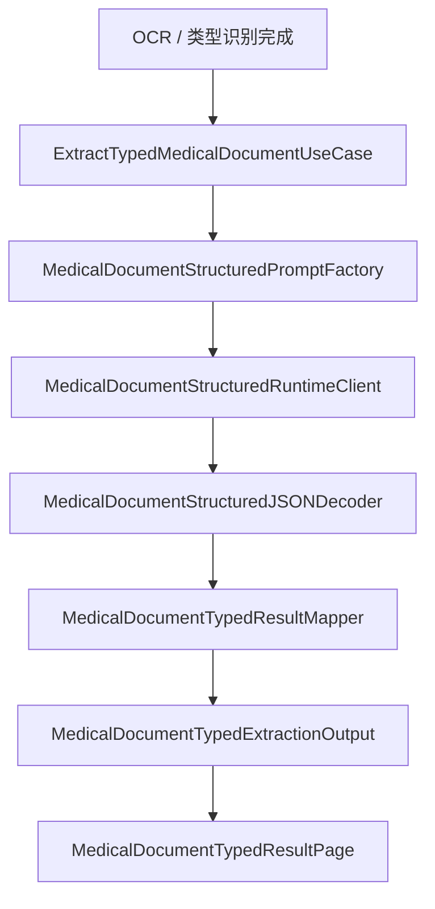

# HOS-MED-UPLOAD-0008 结构化草稿数据模型字段级对齐 iOS 工单

> 状态：分类型草稿树、规范化与保存映射已落地，待真机/联调验收。
> 范围：仅覆盖 AI 上传报告链路中的“结构化草稿数据模型”层，不包含 OCR 编排、类型判定、附件绑定、业务保存实现细节。
> 硬性约束：本工单只整理 HarmonyOS 侧的草稿数据模型、字段语义、保存承接、目录结构、对齐偏差与验收口径；不修改 iOS 代码，不修改服务器代码。
> 触发背景：`HOS-MED-UPLOAD-0006` 已把抽取闭环接通，但当前需要把每一种文档类型的草稿字段、嵌套结构、规范化逻辑和保存映射全部拆开复核，避免“能出结果，但字段不对齐”的隐性漂移。
> 参考端：`SparkClient/SparkClient/Projects/Features/MedicalDocumentUpload/Domain/MedicalDocumentTypedModels.swift`、`SparkClient/SparkClient/Projects/Features/MedicalDocumentUpload/Domain/MedicalDocumentDraftMappers.swift`、`SparkClient/SparkClient/Projects/Features/MedicalDocumentUpload/Domain/PrescriptionFieldNormalization.swift`、`SparkClient/SparkClient/Projects/Features/MedicalDocumentUpload/Domain/PrescriptionRecognitionDraftMapper.swift`。
> 当前端：`SparkClientHarmonyOS/entry/src/main/ets/Projects/Features/MedicalDocumentUpload/Domain/MedicalDocumentTypedModels.ets`、`MedicalDocumentRecognitionDrafts.ets`、`MedicalDocumentDraftBuilders.ets`、`MedicalDocumentDraftMappers.ets`、`PrescriptionFieldNormalization.ets`、`Infrastructure/MedicalDocumentTypedResultMapper.ets`。
> 关联工单：`HOS-MED-UPLOAD-0006-结构化抽取iOS对齐工单.md`、`HOS-MED-UPLOAD-0007-OCR与类型判定偏差复核iOS对齐工单.md`。

## 0. 本轮落地摘要（2026-07-25）

| 能力 | 文件 | 状态 |
| --- | --- | --- |
| 分类型草稿树 | `Domain/MedicalDocumentRecognitionDrafts.ets` | 已落地 |
| JSON → 草稿 | `Domain/MedicalDocumentDraftBuilders.ets` | 已落地 |
| 状态/频次规范化 | `Domain/PrescriptionFieldNormalization.ets` | 已落地 |
| 草稿 → 保存请求 DTO | `Domain/MedicalDocumentDraftMappers.ets` | 已落地（不发起网络） |
| Mapper 产出 typedDrafts | `Infrastructure/MedicalDocumentTypedResultMapper.ets` | 已落地 |
| 单元测试 | `entry/src/test/ets/MedicalDocumentUpload/MedicalDocumentUpload0008.test.ets` | 已接入 |

仍待后续：分类型结果编辑页 `ResultPages/`、真实网络保存接线、PrescriptionRecognitionDraftMapper 远端互转。

---

## 1. 对标范围与结论

### 1.1 当前迁移阶段

当前 HarmonyOS 端已经可以做到：

1. OCR 结果进入结构化抽取
2. AI 输出被解码成 typed 草稿
3. typed 草稿进入结果页
4. typed 草稿可以继续承接保存前规范化

但是，和 iOS 对比后，真正要对齐的不是“有没有一个 typedResult”，而是每一类草稿数据模型是否都满足以下要求：

1. 字段集合一致
2. 字段语义一致
3. 可选性一致
4. 默认值与兜底一致
5. 嵌套结构一致
6. 规范化规则一致
7. 保存请求映射一致
8. 结果页编辑模型一致

一句话结论：**这张工单不是再看“抽取有没有接通”，而是逐个字段核对“抽取出来的数据能不能直接进入 iOS 同款结果确认与保存路径”。**

### 1.2 iOS 侧真实能力

iOS 的结构化草稿不是单层 DTO，而是三层组合：

1. `MedicalDocumentTypedResult`
2. 各类型 `RecognitionDraft`
3. 各类型保存 / 远端请求映射器

#### iOS 结构化草稿清单

| 模型 | iOS 文件位置 | 作用 |
| --- | --- | --- |
| `CaseRecognitionDraft` | `MedicalDocumentTypedModels.swift` | 病例汇总草稿 |
| `SymptomRecognitionDraft` | `MedicalDocumentTypedModels.swift` | 症状草稿 |
| `VisitRecognitionDraft` | `MedicalDocumentTypedModels.swift` | 就诊草稿 |
| `SurgeryRecognitionDraft` | `MedicalDocumentTypedModels.swift` | 手术草稿 |
| `FollowUpRecognitionDraft` | `MedicalDocumentTypedModels.swift` | 随访草稿 |
| `HealthExamRecognitionDraft` | `MedicalDocumentTypedModels.swift` | 体检报告草稿 |
| `MedicalReportRecognitionDraft` | `MedicalDocumentTypedModels.swift` | 医疗报告草稿 |
| `MedicalReportItem` | `MedicalDocumentTypedModels.swift` | 医疗报告指标项 |
| `ItemDraft` | `MedicalDocumentTypedModels.swift` | 通用明细编辑草稿 |
| `PrescriptionRecognitionDraft` | `MedicalDocumentTypedModels.swift` | 处方草稿 |
| `MedicationPlanRecognitionDraft` | `MedicalDocumentTypedModels.swift` | 用药计划草稿 |
| `MedicineBoxRecognitionDraft` | `MedicalDocumentTypedModels.swift` | 药箱草稿 |
| `MedicalDocumentRecognitionEnvelope` | `MedicalDocumentTypedModels.swift` | 识别上下文壳 |

#### iOS 保存 / 规范化路径

| 文件 | 作用 |
| --- | --- |
| `MedicalDocumentDraftMappers.swift` | 将草稿转换为保存请求 |
| `PrescriptionFieldNormalization.swift` | 处方 / 用药计划 / 药箱字段规范化 |
| `PrescriptionRecognitionDraftMapper.swift` | 处方、用药计划、药箱之间的远端 / 本地草稿互转 |

### 1.3 HarmonyOS 侧当前事实

| HarmonyOS 文件 | 当前事实 | 结论 |
| --- | --- | --- |
| `MedicalDocumentTypedModels.ets` | `envelope` / 预览 payload / `typedDrafts` 壳 | 预览 + 草稿树双层 |
| `MedicalDocumentRecognitionDrafts.ets` | 六类草稿 + 子草稿 + ItemDraft / MedicalReportItem / ReminderTime | 字段级模型已对齐 |
| `MedicalDocumentDraftBuilders.ets` | JSON → 草稿树（camel/snake） | 已接通 |
| `PrescriptionFieldNormalization.ets` | 处方状态 / 用药状态 / 频次 / 提醒归一 | 已对齐 iOS 规则 |
| `MedicalDocumentDraftMappers.ets` | 草稿 → CreateRequest DTO | 映射层已落地，未发网 |
| `MedicalDocumentTypedResultMapper.ets` | 抽取后同时填充 `typedDrafts` 与预览 payload | 已接通 |
| `MedicalDocumentTypedResultPage.ets` | 仍以预览为主 | 分类型编辑页待后续 |

### 1.4 本工单要修的核心偏差

1. HarmonyOS 当前的 `MedicalTypedResultPayload` 是“统一草稿预览壳”，没有像 iOS 一样分成病例、体检、医疗报告、处方、用药计划、药箱的明确 typed 结构。
2. HarmonyOS 当前的 typed mapper 只抽了 `title / summary / diagnosis / occurredAt / rawType / fieldsJSON / itemsJSON` 等通用字段，不能等价表达 iOS 的细粒度草稿模型。
3. HarmonyOS 当前缺少 iOS 那种“草稿 -> 保存请求”的完整映射层，尤其是处方 / 用药计划 / 药箱的组合式保存语义。
4. HarmonyOS 当前还没有把“预校验问题”与“草稿字段缺失”一一对应到字段级别，这会影响结果页编辑和保存前校验。

## 2. 华为端目录设计

### 2.1 当前目录事实

```text
SparkClientHarmonyOS/entry/src/main/ets/Projects/Features/MedicalDocumentUpload/
├── Application/
├── Domain/
│   ├── MedicalDocumentTypedModels.ets
│   ├── MedicalDocumentStructuredExtractionRequest.ets
│   ├── MedicalDocumentStructuredExtractionError.ets
│   ├── MedicalExtractionRetryFeedback.ets
│   └── ...
├── Infrastructure/
│   ├── MedicalDocumentTypedResultMapper.ets
│   ├── MedicalDocumentStructuredJSONDecoder.ets
│   └── MedicalDocumentExtractionErrorNormalizer.ets
└── Presentation/
    ├── MedicalDocumentTypedResultPage.ets
    └── ResultPages/
        ├── MedicalReportRecognitionResult/
        ├── PrescriptionRecognitionResult/
        ├── MedicationRecognitionResult/
        └── MedicineBoxRecognitionResult/
```

### 2.2 目标目录设计

本工单不建议新增新的顶层目录，原因如下：

1. 草稿模型本身已经全部放在 `Domain/`。
2. 结果页和草稿模型是强耦合的，不需要再拆第二套 DTO 目录。
3. 当前缺口是字段级对齐，不是目录分层不足。

### 2.3 文件职责表

| 文件 | 当前职责 | 对齐重点 |
| --- | --- | --- |
| `MedicalDocumentTypedModels.ets` | 定义 typed 输出壳、类型判定结果、统一 payload | 是否足以表达每个类型的完整草稿字段 |
| `MedicalDocumentTypedResultMapper.ets` | 把 JSON 结果塞入统一 payload | 是否需要按类型分支生成更细粒度草稿 |
| `MedicalDocumentTypedResultPage.ets` | 展示抽取结果和 JSON 预览 | 是否能承接字段级编辑和缺失提醒 |
| `MedicalDocumentStructuredExtractionRequest.ets` | 结构化抽取输入壳 | 是否携带足够上下文给结果页和保存层 |

## 3. 分层职责与请求链路

### 3.1 iOS 真实链路



### 3.2 HarmonyOS 当前链路



### 3.3 草稿模型层级

HarmonyOS 和 iOS 的草稿结构都可以分成四层：

1. **上下文壳**：识别成员、上传会话、OCR 预览、类型判定来源。
2. **主业务草稿**：病例、体检、医疗报告、处方、用药计划、药箱。
3. **嵌套子草稿**：症状、就诊、手术、随访、明细、药品行。
4. **保存映射层**：把草稿转成创建请求或远端对象。

### 3.4 对齐结论

1. HarmonyOS 的上下文壳已经有了。
2. HarmonyOS 的统一 payload 也有了。
3. 但 HarmonyOS 的“分类型草稿树”还没有像 iOS 一样在结果页和保存层完整展开。
4. 这意味着当前的主要问题不是抽取失败，而是“抽到之后如何保持字段级一致”。

## 4. 核心关键技术与实现方案

### 4.1 结构化草稿的分层设计原则

#### 原则一：先保留草稿，再谈保存

抽取阶段不要直接生成保存请求，必须先进入草稿层。原因很简单：

1. 草稿层允许缺字段。
2. 草稿层允许用户编辑。
3. 草稿层允许保存前规范化。
4. 草稿层允许 UI 做局部校验和高亮。

#### 原则二：类型不同，草稿结构不同

统一 `payload` 只能用于预览，不适合表达全部业务语义。建议按文档类型明确区分：

1. `caseDocument -> CaseRecognitionDraft`
2. `healthExamReport -> HealthExamRecognitionDraft`
3. `medicalReport -> [MedicalReportRecognitionDraft]`
4. `prescription -> [PrescriptionRecognitionDraft]`
5. `medicationPlan -> [MedicationPlanRecognitionDraft]`
6. `medicineBox -> [MedicineBoxRecognitionDraft]`

#### 原则三：先做字段规范化，再做保存映射

处方、用药计划、药箱这几类字段复杂度最高，必须先规范化再保存：

1. 状态值归一
2. 频次类型归一
3. 日期格式归一
4. 药箱绑定关系归一
5. 排序序号补齐

### 4.2 HarmonyOS 应补的数据模型方向

当前 HarmonyOS 的 `MedicalTypedResultPayload` 适合做“入口汇总”，但不适合做“最终业务草稿树”。建议在后续工单里补齐以下类型表达：

| 建议能力 | 说明 |
| --- | --- |
| 病例草稿树 | 包含症状、就诊、手术、随访、处方、检查报告 |
| 体检草稿树 | 包含机构、报告号、体检日期、体检结论、指标数组 |
| 医疗报告草稿树 | 包含主标题、医院、医生、内容、日期、明细项 |
| 处方草稿树 | 包含处方主信息和药品计划数组 |
| 用药计划草稿树 | 包含药品 / 频次 / 提醒 / 状态 / 药箱关系 |
| 药箱草稿树 | 包含药品包装识别字段和绑定信息 |

### 4.3 关键代码修复方案

#### 方案 A：结果映射不要只落一个统一 payload

当前 mapper 里只把 JSON 的头几个字段抽出来，再把完整 JSON 原样塞进 `fieldsJSON` 和 `itemsJSON`。这对调试够用，但对业务不够。

建议改造方向：

```ts
// 伪代码：不要只产出一个通用 payload，而是按 kind 产出类型草稿
switch (kind) {
  case MedicalDocumentKind.CASE_DOCUMENT:
    output.caseDraft = buildCaseDraft(...)
    break
  case MedicalDocumentKind.HEALTH_EXAM_REPORT:
    output.healthExamDraft = buildHealthExamDraft(...)
    break
  case MedicalDocumentKind.MEDICAL_REPORT:
    output.medicalReportDrafts = buildMedicalReportDrafts(...)
    break
  case MedicalDocumentKind.PRESCRIPTION:
    output.prescriptionDrafts = buildPrescriptionDrafts(...)
    break
  case MedicalDocumentKind.MEDICATION_PLAN:
    output.medicationPlanDrafts = buildMedicationPlanDrafts(...)
    break
  case MedicalDocumentKind.MEDICINE_BOX:
    output.medicineBoxDrafts = buildMedicineBoxDrafts(...)
    break
}
```

#### 方案 B：在 typed 模型里保留“可编辑字段”和“原始字段”

建议每一类草稿都至少保留两套语义：

1. `normalized`：UI 和保存使用。
2. `raw`：AI 原始输出和追溯使用。

这样可以避免用户改了一半，又找不到原始识别依据。

#### 方案 C：统一的 envelope 要承接字段级来源

`MedicalDocumentTypedEnvelope` 当前只有 `memberID`、`typeResolution`、`uploadSessionId`、`ocrTextPreview`。建议后续补充以下信息：

1. 文件数
2. 文件边界摘要
3. 识别来源类型
4. 抽取场景
5. 是否携带 retry feedback

### 4.4 结果页与草稿联动方案

当前 HarmonyOS 的结果页更多是预览入口。建议后续补成三段式：

1. 摘要区：显示类型、标题、摘要、风险提示。
2. 编辑区：逐字段编辑草稿。
3. 保存区：显示保存前校验问题。

## 5. 接口契约与数据模型

本节是本工单的核心：按类型逐个字段对齐。

### 5.1 通用上下文壳

#### `MedicalDocumentRecognitionEnvelope`

| 字段 | iOS | HarmonyOS | 类型 | 必填 | 语义 | 对齐状态 |
| --- | --- | --- | --- | --- | --- | --- |
| `memberID` / `memberId` | `Int?` | `number?` | 可选 | 否 | 识别归属成员 | 已对齐 |
| `sourceFiles` / `files` | `[MedicalUploadLocalFile]` | `MedicalAttachmentInput[]` | 数组 | 否 | 原始文件引用 | 基本对齐 |
| `rawOCRText` / `mergedOCRText` 预览 | `String` | `string` | 文本 | 否 | OCR 上下文摘要 | 已对齐 |
| `typeResolution` | `MedicalDocumentTypeResolution` | `MedicalDocumentTypeResolution` | 对象 | 否 | 类型判定结果 | 已对齐 |

#### `MedicalDocumentTypedExtractionOutput`

| 字段 | iOS | HarmonyOS | 作用 | 对齐状态 |
| --- | --- | --- | --- | --- |
| `envelope` | `MedicalDocumentRecognitionEnvelope` | `MedicalDocumentTypedEnvelope` | 识别上下文壳 | 部分对齐 |
| `typedResult` | `MedicalDocumentTypedResult` | `MedicalTypedResultPayload` | 结构化草稿主体 | 需要继续细化 |
| `extractedJSON` | `String` | `string` | 原始结构化 JSON | 已对齐 |
| `payloadPreview` | `String` | `string` | 结果页预览 | 已对齐 |

### 5.2 病例草稿模型

#### `CaseRecognitionDraft`

| 字段 | iOS 类型 | HarmonyOS 现状 | 语义 | 保存映射 | 对齐状态 |
| --- | --- | --- | --- | --- | --- |
| `title` | `String` | 当前未单独建模 | 病例标题 | `title` | 缺失 |
| `summary` | `String?` | 当前未单独建模 | 病情摘要 | `diagnosis_summary` 合并字段 | 缺失 |
| `diagnosis` | `String?` | 当前未单独建模 | 诊断结论 | `diagnosis_summary` 合并字段 | 缺失 |
| `hospitalName` | `String?` | 当前未单独建模 | 医院名称 | `hospital_name` | 缺失 |
| `ageAtVisit` | `String?` | 当前未单独建模 | 就诊年龄 | `age_at_visit` | 缺失 |
| `occurredAt` | `String?` | 当前未单独建模 | 就诊日期 | 写入 `extra["occurred_at"]` | 缺失 |
| `attachmentFileIds` | `[UUID]` | 当前仅在统一 payload 中预留 | 附件关联 | `sourceFileIds` / `attachmentFileIds` | 缺失 |
| `symptom` | `SymptomRecognitionDraft?` | 缺失 | 单条症状 | `symptom` 创建请求 | 缺失 |
| `visit` | `VisitRecognitionDraft?` | 缺失 | 单条就诊 | `visit` 创建请求 | 缺失 |
| `surgery` | `SurgeryRecognitionDraft?` | 缺失 | 单条手术 | `surgery` 创建请求 | 缺失 |
| `followUps` | `[FollowUpRecognitionDraft]?` | 缺失 | 随访数组 | `follow_up` 创建请求 | 缺失 |
| `prescriptions` | `[PrescriptionRecognitionDraft]?` | 缺失 | 处方数组 | 处方创建请求 | 缺失 |
| `examinationReports` | `[MedicalReportRecognitionDraft]?` | 缺失 | 检查 / 检验报告数组 | 检查报告创建请求 | 缺失 |

#### iOS 子草稿字段

`SymptomRecognitionDraft`

| 字段 | 类型 | 语义 | 保存映射 | 状态 |
| --- | --- | --- | --- | --- |
| `name` | `String` | 症状名称 | `name` | 缺失 |
| `code` | `String?` | 症状编码 | `code` | 缺失 |
| `severity` | `String?` | 严重程度 | `severity` | 缺失 |
| `startedAt` | `String?` | 开始时间 | `started_at` | 缺失 |
| `durationValue` | `String?` | 持续时间数值 | 转 int | 缺失 |
| `durationUnit` | `String?` | 持续时间单位 | `duration_unit` | 缺失 |
| `bodyPart` | `String?` | 身体部位 | `body_part` | 缺失 |
| `notes` | `String?` | 备注 | `notes` | 缺失 |
| `attachmentFileIds` | `[UUID]` | 附件 | `sourceFileIds` | 缺失 |

`VisitRecognitionDraft`

| 字段 | 类型 | 语义 | 保存映射 | 状态 |
| --- | --- | --- | --- | --- |
| `visitType` | `String?` | 就诊类型 | `visit_type` | 缺失 |
| `visitedAt` | `String?` | 就诊时间 | `visited_at` | 缺失 |
| `department` | `String?` | 科室 | `department` | 缺失 |
| `doctorName` | `String?` | 医生姓名 | `doctor_name` | 缺失 |
| `visitNo` | `String?` | 就诊号 / 病历号 | `visit_no` | 缺失 |
| `notes` | `String?` | 备注 | `notes` | 缺失 |
| `attachmentFileIds` | `[UUID]` | 附件 | `sourceFileIds` | 缺失 |

`SurgeryRecognitionDraft`

| 字段 | 类型 | 语义 | 保存映射 | 状态 |
| --- | --- | --- | --- | --- |
| `procedureName` | `String` | 手术名称 | `procedure_name` | 缺失 |
| `procedureCode` | `String?` | 手术编码 | `procedure_code` | 缺失 |
| `site` | `String?` | 手术部位 | `site` | 缺失 |
| `performedAt` | `String?` | 手术时间 | `performed_at` | 缺失 |
| `surgeon` | `String?` | 主刀医生 | `surgeon` | 缺失 |
| `anesthesiaType` | `String?` | 麻醉方式 | `anesthesia_type` | 缺失 |
| `incisionLevel` | `String?` | 切口等级 | `incision_level` | 缺失 |
| `asaClass` | `String?` | ASA 分级 | `asa_class` | 缺失 |
| `notes` | `String?` | 备注 | `notes` | 缺失 |
| `attachmentFileIds` | `[UUID]` | 附件 | `sourceFileIds` | 缺失 |

`FollowUpRecognitionDraft`

| 字段 | 类型 | 语义 | 保存映射 | 状态 |
| --- | --- | --- | --- | --- |
| `plannedAt` | `String?` | 计划随访时间 | `planned_at` | 缺失 |
| `completedAt` | `String?` | 实际完成时间 | `completed_at` | 缺失 |
| `status` | `String?` | 随访状态 | `status` | 缺失 |
| `method` | `String?` | 随访方式 | `method` | 缺失 |
| `outcome` | `String?` | 随访结果 | `outcome` | 缺失 |
| `nextAction` | `String?` | 下一步行动建议 | `next_action` | 缺失 |
| `attachmentFileIds` | `[UUID]` | 附件 | `sourceFileIds` | 缺失 |

### 5.3 体检报告草稿模型

#### `HealthExamRecognitionDraft`

| 字段 | iOS 类型 | HarmonyOS 现状 | 语义 | 保存映射 | 对齐状态 |
| --- | --- | --- | --- | --- | --- |
| `institutionName` | `String?` | 当前未单独建模 | 体检机构名称 | `organization_name` | 缺失 |
| `reportNo` | `String?` | 当前未单独建模 | 报告号 | `report_no` | 缺失 |
| `examDate` | `String?` | 当前未单独建模 | 体检日期 | `performed_at` / `exam_date` | 缺失 |
| `examType` | `String?` | 当前未单独建模 | 体检类型 | `exam_type` | 缺失 |
| `summary` | `String?` | 当前未单独建模 | 体检结论 / 建议 | `summary` | 缺失 |
| `items` | `[MedicalReportItem]` | 当前未单独建模 | 指标明细 | 体检项目列表 | 缺失 |
| `attachmentFileIds` | `[UUID]` | 当前统一 payload 未分类型承接 | 附件 | `sourceFileIds` | 缺失 |

#### `MedicalReportItem`

| 字段 | 类型 | 语义 | 保存映射 | 对齐状态 |
| --- | --- | --- | --- | --- |
| `category` | `String` | 科目类别 | `category` | 缺失 |
| `subCategory` | `String?` | 子类别 | `sub_category` | 缺失 |
| `itemName` | `String?` | 项目名称 | `item_name` | 缺失 |
| `itemCode` | `String?` | 项目代码 | `item_code` | 缺失 |
| `resultValue` | `String?` | 结果数值 | `result_value` | 缺失 |
| `unit` | `String?` | 单位 | `unit` | 缺失 |
| `referenceRange` | `String?` | 参考范围 | `reference_range` | 缺失 |
| `flag` | `String?` | 异常标记 | `flag` | 缺失 |
| `resultAt` | `String?` | 采样日期 | `result_at` | 缺失 |
| `modality` | `String?` | 检测方法 | `modality` | 缺失 |
| `bodyPart` | `String?` | 检测部位 | `body_part` | 缺失 |
| `diagnosis` | `String?` | 医生诊断 | `diagnosis` | 缺失 |
| `extra` | `[String: String]?` | 扩展信息 | `extra` | 缺失 |
| `attachmentFileIds` | `[UUID]` | 附件 | `sourceFileIds` | 缺失 |
| `sortOrder` | `String?` | 排序序号 | `sort_order` | 缺失 |

#### `ItemDraft`

`ItemDraft` 不是最终保存模型，而是 UI 编辑用中间态。它比 `MedicalReportItem` 更适合页面输入，但最终要转回 `MedicalReportItem`。

| 字段 | 作用 |
| --- | --- |
| `id` | 编辑项标识 |
| `category` | 类别输入 |
| `subCategory` | 子类别输入 |
| `itemName` | 项目名输入 |
| `resultValue` | 结果值输入 |
| `unit` | 单位输入 |
| `referenceRange` | 参考范围输入 |
| `flag` | 异常标记输入 |
| `modality` | 检测方法输入 |
| `bodyPart` | 部位输入 |
| `resultAt` | 日期输入 |
| `diagnosis` | 结论输入 |

### 5.4 医疗报告草稿模型

#### `MedicalReportRecognitionDraft`

| 字段 | iOS 类型 | HarmonyOS 现状 | 语义 | 保存映射 | 对齐状态 |
| --- | --- | --- | --- | --- | --- |
| `category` | `String?` | 当前未单独建模 | 报告分类 | `category` | 缺失 |
| `title` | `String` | 当前仅有统一 `title` | 报告标题 | `item_name` / `title` | 部分对齐 |
| `hospital` | `String?` | 当前未单独建模 | 医院名称 | `organization_name` | 缺失 |
| `doctor` | `String?` | 当前未单独建模 | 检查医生 | `doctor_name` | 缺失 |
| `content` | `String?` | 当前统一 payload 里没有独立字段 | 所见 / 内容 | `findings` | 缺失 |
| `date` | `String?` | 当前统一 payload 里只有 `occurredAt` | 检查日期 | `performed_at` | 部分对齐 |
| `details` | `[ItemDraft]` | 当前通过 `itemsJSON` 透传 | 明细项 | `details` | 部分对齐 |
| `attachmentFileIds` | `[UUID]` | 当前未单独承接 | 附件 | `sourceFileIds` | 缺失 |

#### `MedicalReportItem` 与 `MedicalReportRecognitionDraft` 的关系

1. `MedicalReportRecognitionDraft` 是报告头。
2. `MedicalReportItem` 是报告明细。
3. `ItemDraft` 是编辑态桥梁。

这三者要一起看，否则会出现“标题有了，但明细不能编辑”或“明细有了，但保存时字段名不一致”的问题。

### 5.5 处方草稿模型

#### `PrescriptionRecognitionDraft`

| 字段 | iOS 类型 | HarmonyOS 现状 | 语义 | 保存映射 | 对齐状态 |
| --- | --- | --- | --- | --- | --- |
| `medicalCase` | `Int?` | 当前未单独建模 | 关联病历 ID | `medical_case` | 缺失 |
| `prescriberName` | `String?` | 当前未单独建模 | 开方医生 | `prescriber_name` | 缺失 |
| `institutionName` | `String?` | 当前未单独建模 | 开方机构 | `institution_name` | 缺失 |
| `prescribedAt` | `String?` | 当前统一 payload 里未专门表达 | 开方日期 | `prescribed_at` | 缺失 |
| `diagnosis` | `String?` | 当前统一 payload 里未专门表达 | 诊断 | `diagnosis` | 缺失 |
| `prescriptionNo` | `String?` | 当前未单独建模 | 处方号 | `prescription_no` | 缺失 |
| `status` | `String?` | HarmonyOS 已有通用字符串字段 | 生命周期状态 | `status` | 部分对齐 |
| `extra` | `[String: String]?` | HarmonyOS 已有 `warnings` / `rawType` 之类通用信息 | 扩展信息 | `extra` | 部分对齐 |
| `medicationPlans` | `[MedicationPlanRecognitionDraft]?` | 当前统一 payload 未分层表达 | 处方内药品计划 | `medication_plans` | 缺失 |
| `attachmentFileIds` | `[UUID]` | 当前统一 payload 未分层表达 | 附件 | `sourceFileIds` | 缺失 |

#### 处方状态规范化

iOS 对处方有一层显式的状态规范化：

1. 识别 `active / completed / cancelled`
2. 容忍支付状态、处方类型文本混入 `extra`
3. 未知值默认回落到 `active`

HarmonyOS 目前要特别注意：

1. 不要把任意文本直接当状态。
2. 不要把“支付状态”误塞进业务状态。
3. 不要把字符串归一化写死在页面层。

### 5.6 用药计划草稿模型

#### `MedicationPlanRecognitionDraft`

| 字段 | iOS 类型 | HarmonyOS 现状 | 语义 | 保存映射 | 对齐状态 |
| --- | --- | --- | --- | --- | --- |
| `medicineName` | `String?` | 当前未单独建模 | 药品名称 | `medicine_name` | 缺失 |
| `medicineType` | `String?` | 当前未单独建模 | 药品类型 | `medicine_type` | 缺失 |
| `totalQuantity` | `String?` | 当前未单独建模 | 总数量 | `total_quantity` | 缺失 |
| `expireDate` | `String?` | 当前未单独建模 | 有效期 | `expire_date` | 缺失 |
| `medicineBox` | `MedicineBoxRecognitionDraft?` | 当前未单独建模 | 关联药箱草稿 | `medicine_box` | 缺失 |
| `brandName` | `String?` | 当前未单独建模 | 品牌名 | `brand_name` | 缺失 |
| `dosageForm` | `String?` | 当前未单独建模 | 剂型 | `dosage_form` | 缺失 |
| `strength` | `String?` | 当前未单独建模 | 规格含量 | `strength` | 缺失 |
| `doseUnit` | `String?` | 当前未单独建模 | 剂量单位 | `dose_unit` | 缺失 |
| `dosePerTime` | `String?` | 当前未单独建模 | 单次用量描述 | `dose_per_time` | 缺失 |
| `doseValue` | `String?` | 当前未单独建模 | 剂量数值 | `dose_value` | 缺失 |
| `frequencyType` | `String?` | 当前未单独建模 | 频次类型 | `frequency_type` | 缺失 |
| `everyNDays` | `String?` | 当前未单独建模 | 间隔天数 | `every_n_days` | 缺失 |
| `weeklyWeekdays` | `[Int]?` | 当前未单独建模 | 每周星期数组 | `weekly_weekdays` | 缺失 |
| `frequencyText` | `String?` | 当前未单独建模 | 可读频次文本 | `frequency_text` | 缺失 |
| `startDate` | `String?` | 当前未单独建模 | 开始日期 | `start_date` | 缺失 |
| `endDate` | `String?` | 当前未单独建模 | 结束日期 | `end_date` | 缺失 |
| `instructions` | `String?` | 当前未单独建模 | 用药叮嘱 | `instructions` | 缺失 |
| `reminderEnabled` | `Bool?` | 当前未单独建模 | 是否提醒 | `reminder_enabled` | 缺失 |
| `reminderTimes` | `[ReminderTime]?` | 当前未单独建模 | 提醒时间数组 | `reminder_times` | 缺失 |
| `status` | `String?` | HarmonyOS 有通用 status 字段 | 生命周期状态 | `status` | 部分对齐 |
| `sortOrder` | `String?` | 当前未单独建模 | 排序 | `sort_order` | 缺失 |
| `extra` | `[String: String]?` | 当前仅有通用 extra/警告概念 | 扩展信息 | `extra` | 缺失 |
| `attachmentFileIds` | `[UUID]` | 当前统一 payload 未分层表达 | 附件 | `sourceFileIds` | 缺失 |

#### `MedicationPlan` 的规范化重点

1. `frequencyType` 必须被归一为有限集合。
2. `status` 必须被归一为有限集合。
3. `reminderTimes` 需要特殊编码，不要直接用普通数组扁平化。
4. `medicineBox` 与 `extra` 中的绑定标记必须联动。

### 5.7 药箱草稿模型

#### `MedicineBoxRecognitionDraft`

| 字段 | iOS 类型 | HarmonyOS 现状 | 语义 | 保存映射 | 对齐状态 |
| --- | --- | --- | --- | --- | --- |
| `medicineName` | `String?` | 当前未单独建模 | 药品名称 | `medicine_name` | 缺失 |
| `medicineType` | `String?` | 当前未单独建模 | 药品类型 | `medicine_type` | 缺失 |
| `brandName` | `String?` | 当前未单独建模 | 品牌名 | `brand_name` | 缺失 |
| `dosageForm` | `String?` | 当前未单独建模 | 剂型 | `dosage_form` | 缺失 |
| `strength` | `String?` | 当前未单独建模 | 规格含量 | `strength` | 缺失 |
| `doseUnit` | `String?` | 当前未单独建模 | 剂量单位 | `dose_unit` | 缺失 |
| `totalQuantity` | `String?` | 当前未单独建模 | 总数量 | `total_quantity` | 缺失 |
| `expireDate` | `String?` | 当前未单独建模 | 有效期 | `expire_date` | 缺失 |
| `notes` | `String?` | 当前未单独建模 | 备注 | `notes` | 缺失 |
| `extra` | `[String: String]?` | 当前未单独建模 | 扩展信息 | `extra` | 缺失 |
| `sortOrder` | `String?` | 当前未单独建模 | 排序 | `sort_order` | 缺失 |
| `attachmentFileIds` | `[UUID]` | 当前统一 payload 未分层表达 | 附件 | `sourceFileIds` | 缺失 |

### 5.8 中间态与辅助模型

#### `MedicalTypedResultPayload`

HarmonyOS 当前的统一 payload 字段如下：

| 字段 | 作用 | 是否足够表达 iOS 草稿树 |
| --- | --- | --- |
| `kind` | 文档类型 | 不足 |
| `title` | 标题 | 不足 |
| `summary` | 摘要 | 不足 |
| `diagnosis` | 诊断 | 不足 |
| `occurredAt` | 时间 | 不足 |
| `rawType` | 原始类型 | 不足 |
| `fieldsJSON` | 整体 JSON 字符串 | 只能做预览 |
| `itemsJSON` | 数组 JSON 字符串 | 只能做预览 |
| `warningCount` | 风险计数 | 足够做 UI 提示 |
| `warnings` | 风险字段名 | 足够做 UI 提示 |

结论：`MedicalTypedResultPayload` 适合“预览”，不适合“最终草稿数据模型”。

#### `MedicalExtractionRetryFeedback`

| 字段 | 作用 | 是否应该继续传到草稿层 |
| --- | --- | --- |
| `kind` | 失败对应文档类型 | 是 |
| `step` | 失败步骤 | 是 |
| `errorCode` | 错误码 | 是 |
| `fieldPath` | 出错字段路径 | 是 |
| `expectedType` | 预期类型 | 是 |
| `actualType` | 实际类型 | 是 |
| `rawMessage` | 原始消息 | 是 |
| `aiOutputPreview` | AI 输出预览 | 是 |
| `suggestion` | 修复建议 | 是 |
| `createdAt` | 时间戳 | 否，主要用于日志 |

## 6. iOS-HarmonyOS 功能对照矩阵

### 6.1 总矩阵

| 模型域 | iOS 是否存在 | HarmonyOS 是否存在 | 对齐级别 | 主要缺口 |
| --- | --- | --- | --- | --- |
| 上下文壳 | 是 | 是 | 基本对齐 | 编辑/保存上下文可继续扩展 |
| 病例草稿树 | 是 | 是 | 已对齐 | 结果页编辑待续 |
| 体检草稿树 | 是 | 是 | 已对齐 | 结果页编辑待续 |
| 医疗报告草稿树 | 是 | 是 | 已对齐 | 结果页编辑待续 |
| 处方草稿树 | 是 | 是 | 已对齐 | 远端互转 Mapper 待续 |
| 用药计划草稿树 | 是 | 是 | 已对齐 | 提醒编码联调待续 |
| 药箱草稿树 | 是 | 是 | 已对齐 | 绑定确认 UI 待续 |
| 通用预览 payload | 是 | 是 | 已有 | 与草稿树并存 |
| 规范化层 | 是 | 是 | 已对齐 | 真机脏数据回归 |
| 保存映射层 | 是 | 是（DTO） | 部分对齐 | 未接线真实网络保存 |

### 6.2 处方与药箱链路对照

| iOS 能力 | HarmonyOS 当前 | 差异 |
| --- | --- | --- |
| `PrescriptionRecognitionDraft` | 只有统一 payload | 没有主单 + 药品计划分层 |
| `MedicationPlanRecognitionDraft` | 只有统一 payload | 没有频次 / 提醒 / 药箱关系 |
| `MedicineBoxRecognitionDraft` | 只有统一 payload | 没有药箱识别字段 |
| `normalizePrescriptionDraft()` | 仅有通用状态文本 | 状态归一层不完整 |
| `remotePrescription()` / `remoteMedicationPlan()` / `remoteMedicineBox()` | 保存映射尚未完整对齐 | 业务链路缺少最终对象级映射 |

### 6.3 医疗报告与体检链路对照

| iOS 能力 | HarmonyOS 当前 | 差异 |
| --- | --- | --- |
| `MedicalReportRecognitionDraft` | 统一 payload 中只有 `title/summary/diagnosis/occurredAt` | 缺少报告头字段 |
| `MedicalReportItem` | 只有 JSON 原文 | 缺少指标项结构化模型 |
| `ItemDraft` | 只有 JSON 预览字符串 | 缺少编辑态桥接 |
| `HealthExamRecognitionDraft` | 统一 payload 只有 `warningCount/warnings` | 缺少机构、报告号、指标数组 |

## 7. 示例工程与官方文档参考结论

### 7.1 本地参考文件

1. `[MedicalDocumentTypedModels.swift](/Users/hua/Documents/project/Reference/LookHealthClient/SparkClient/SparkClient/Projects/Features/MedicalDocumentUpload/Domain/MedicalDocumentTypedModels.swift)`
2. `[MedicalDocumentDraftMappers.swift](/Users/hua/Documents/project/Reference/LookHealthClient/SparkClient/SparkClient/Projects/Features/MedicalDocumentUpload/Domain/MedicalDocumentDraftMappers.swift)`
3. `[PrescriptionFieldNormalization.swift](/Users/hua/Documents/project/Reference/LookHealthClient/SparkClient/SparkClient/Projects/Features/MedicalDocumentUpload/Domain/PrescriptionFieldNormalization.swift)`
4. `[PrescriptionRecognitionDraftMapper.swift](/Users/hua/Documents/project/Reference/LookHealthClient/SparkClient/SparkClient/Projects/Features/MedicalDocumentUpload/Domain/PrescriptionRecognitionDraftMapper.swift)`
5. `[MedicalDocumentTypedModels.ets](/Users/hua/Documents/project/Reference/LookHealthClient/SparkClientHarmonyOS/entry/src/main/ets/Projects/Features/MedicalDocumentUpload/Domain/MedicalDocumentTypedModels.ets)`
6. `[MedicalDocumentTypedResultMapper.ets](/Users/hua/Documents/project/Reference/LookHealthClient/SparkClientHarmonyOS/entry/src/main/ets/Projects/Features/MedicalDocumentUpload/Infrastructure/MedicalDocumentTypedResultMapper.ets)`

### 7.2 本工单建议优先借鉴的 iOS 设计

1. `CaseRecognitionDraft` 的汇总树结构。
2. `MedicalReportItem` 与 `ItemDraft` 的双层设计。
3. `PrescriptionRecognitionDraft` 和 `MedicationPlanRecognitionDraft` 的主单 / 子单分层。
4. `PrescriptionFieldNormalization` 的状态、频次、提醒、绑定关系归一方式。
5. `PrescriptionRecognitionDraftMapper` 的保存映射思路。

### 7.3 HarmonyOS 当前可借鉴但不能直接照搬的部分

1. `MedicalTypedResultPayload` 不能替代完整 typed 草稿树。
2. `payloadPreview` 不能替代字段级编辑模型。
3. `fieldsJSON` / `itemsJSON` 只能做追溯，不能做业务对象唯一来源。

## 8. 实施拆分与验收

### 8.1 实施拆分

#### 第一阶段：病例与体检草稿树补齐

1. 补齐病例主档字段映射。
2. 补齐症状、就诊、手术、随访子草稿。
3. 补齐体检机构、报告号、体检日期、明细数组。
4. 将 HarmonyOS 统一 payload 拆为“预览层 + 草稿层”。

#### 第二阶段：医疗报告与报告明细补齐

1. 增加医疗报告头模型。
2. 增加医疗报告明细模型。
3. 增加编辑态 `ItemDraft` 等价模型。
4. 建立“头 + 明细”编辑同步机制。

#### 第三阶段：处方、用药计划、药箱补齐

1. 补齐处方主单字段。
2. 补齐用药计划字段。
3. 补齐药箱字段。
4. 补齐状态归一、频次归一、绑定关系归一。
5. 补齐保存前预检逻辑。

### 8.2 验收用例

| 用例 | 输入 | 预期 |
| --- | --- | --- |
| 病例草稿抽取 | 病例 OCR 文本 | 生成病例主档 + 子项草稿 |
| 体检草稿抽取 | 体检报告 OCR 文本 | 生成机构、报告号、体检结论、指标项 |
| 医疗报告抽取 | CT / B 超 / 检验报告 | 生成报告头 + 明细项 |
| 处方抽取 | 处方 OCR 文本 | 生成处方主单 + 药品计划数组 |
| 用药计划抽取 | 用药说明 / 药盒文本 | 生成频次、提醒、状态、药箱绑定字段 |
| 药箱抽取 | 药盒 / 包装文本 | 生成药箱草稿和识别信息 |
| 规范化回归 | 低质量 OCR / 脏字段 | 状态、频次、日期、数字字段可收敛 |
| 编辑回写 | 用户修改草稿字段 | 结果页与 typed model 同步 |

### 8.3 完成标准

1. 每个文档类型都能在 HarmonyOS 上找到对应的草稿结构，不再只是一层统一 payload。
2. 每个关键字段都能在 iOS 和 HarmonyOS 之间建立一一对应关系。
3. 每个草稿模型都能说明它如何进入保存请求。
4. 每个高风险字段都能说明默认值、兜底值和校验规则。

## 9. 风险与待确认项

1. HarmonyOS 当前统一 payload 很适合预览，但不适合替代最终草稿树，后续需要新建更细粒度 typed 模型。
2. 处方、用药计划、药箱三者关系非常容易在“抽取”阶段和“保存”阶段混淆，必须明确谁是主单、谁是子单、谁是绑定对象。
3. `extra` / `warnings` / `rawType` 这类字段不能承担所有扩展信息，否则会把结构化模型重新打散成字典。
4. `String` 承载数值是当前阶段的现实选择，但进入保存层前必须做数值归一和格式校验。
5. 体检与医疗报告的“头 / 明细”结构如果不补齐，后续 UI 编辑和保存会继续出现语义漂移。
6. 本工单只覆盖模型对齐，不覆盖后续服务端字段新增或后端契约漂移；一旦后端字段变化，需要先更新契约再同步模型。

