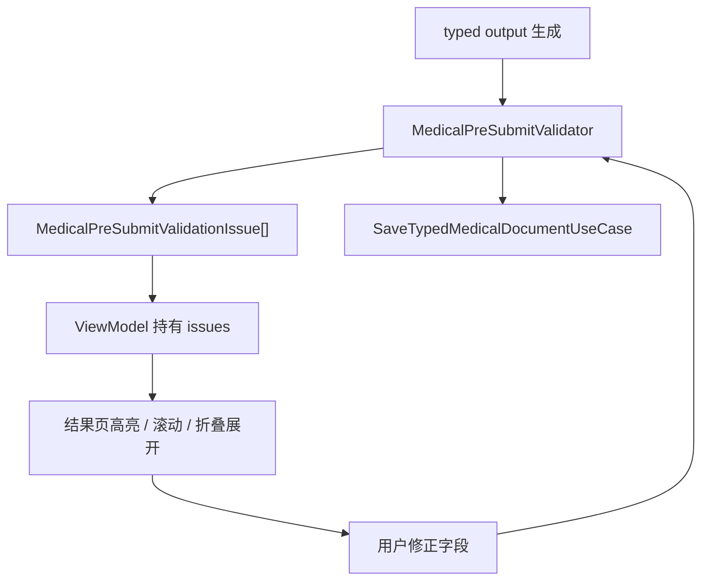
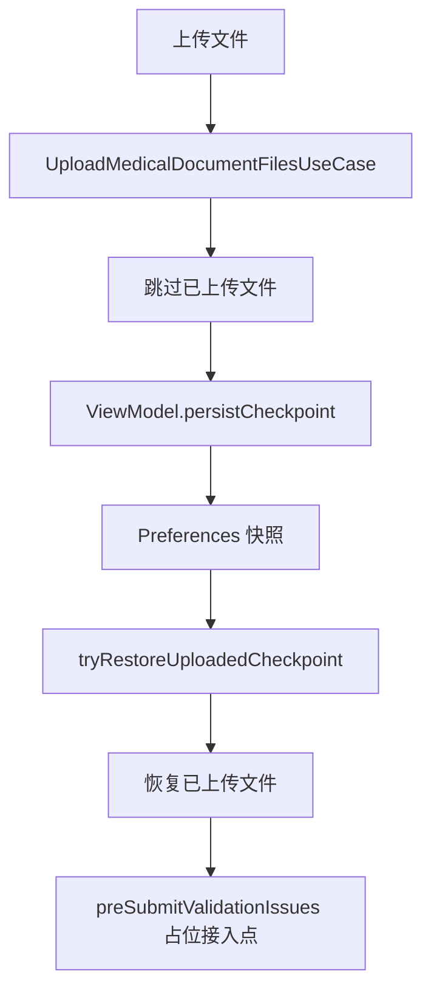

# HOS-MED-UPLOAD-0008 预提交校验与断点续跑 iOS 对齐工单

> 状态：已实现（预提交校验规则层 + 断点 OCR/type/extract 恢复 + 结果页校验门）。
> 范围：仅覆盖 AI 上传报告链路中的 `预提交校验`、`断点续跑`、`阶段恢复`，不包含 OCR、类型判定、结构化抽取的业务细节实现。
> 硬性约束：本工单只整理 HarmonyOS 侧的偏差、修复方案、目录结构、业务流程、关键代码与验收口径；不修改 iOS 代码，也不修改服务器代码。
> 触发证据：独立 `MedicalPreSubmitValidator` / `MedicalPreSubmitValidationRules` / `MedicalPreSubmitValidationIssue`；checkpoint 持久化 OCR/type/extract；ViewModel `attemptSave` 校验门；结果页展示问题列表。
> 参考端：`SparkClient/SparkClient/Projects/Features/MedicalDocumentUpload/`。
> 当前端：`SparkClientHarmonyOS/entry/src/main/ets/Projects/Features/MedicalDocumentUpload/`。
> 关联工单：`HOS-MED-UPLOAD-0006-结构化抽取iOS对齐工单.md`、`HOS-MED-UPLOAD-0007-OCR与类型判定偏差复核iOS对齐工单.md`、`HOS-MED-UPLOAD-0008-结构化草稿数据模型字段级对齐iOS工单.md`。
> 测试：`entry/src/test/ets/MedicalDocumentUpload/MedicalDocumentUpload0008b.test.ets`。

## 1. 对标范围与结论

### 1.1 当前迁移阶段

当前 HarmonyOS 端在这个阶段已经具备：

1. 独立可测试的保存前字段级预校验（`MedicalPreSubmitValidator`）
2. 完整问题模型（`fieldKey` / `scrollTargetID` / `collapseSectionID` / severity）
3. 失败后从上次步骤继续，已上传文件跳过重传
4. Preferences 断点快照覆盖上传 + OCR 文本 + 类型 JSON + 抽取 JSON（禁止 STS/Token）
5. 续跑时若 checkpoint 已有 OCR/type/extract，对应步骤 SKIPPED
6. 结果页问题列表 +「校验并保存」门（`attemptSave`）；正式 SaveUseCase 仍待后续工单

| 阶段 | iOS 目标职责 | HarmonyOS 当前事实 | 偏差结论 |
| --- | --- | --- | --- |
| 预提交校验 | 在保存前对 typed result 做字段级校验，并输出可定位的问题 | 独立 Validator + Rules；ViewModel `runPreSubmitValidation` / `attemptSave` | **已对齐**（保存用例未接线） |
| 问题定位 | 每个问题要能定位到字段、卡片、折叠区块和滚动目标 | Issue 模型含 scroll/collapse；结果页展示 summaryLine | 字段级高亮/自动滚动留给结果页工单深化 |
| 断点续跑 | 失败后可从上一步继续，不重复上传或重复识别 | 上传跳过 + OCR/type/extract 快照恢复与步骤跳过 | **已对齐**（非敏感上下文） |
| 保存前二次确认 | 校验通过后再保存正式业务记录 | `attemptSave` 校验门已闭合；`capabilities.save` 未接线 | 保存链路待后续工单 |

一句话结论：**预提交校验规则层与断点 OCR/type/extract 恢复已闭环；正式保存与结果页字段级滚动定位留给后续工单。**

### 1.2 iOS 侧真实能力

iOS 的这段不是单纯的 `if empty -> fail`，而是一个完整的保存前收口体系。

| iOS 文件 | 作用 |
| --- | --- |
| `Projects/Features/MedicalDocumentUpload/Domain/MedicalPreSubmitValidator.swift` | 保存前字段级预校验入口，根据 typed result 分类型校验 |
| `Projects/Features/MedicalDocumentUpload/Domain/MedicalPreSubmitValidationIssue.swift` | 统一问题模型，携带字段路径、资源类型、严重性、滚动目标和折叠区块 |
| `Projects/Features/MedicalDocumentUpload/Presentation/MedicalDocumentUploadViewModel.swift` | 持有 `preSubmitValidationIssues`，驱动结果页高亮、清理和重试 |
| `Projects/Features/MedicalDocumentUpload/Application/SaveTypedMedicalDocumentUseCase.swift` | 校验通过后把 typed output 交给正式保存流程 |

iOS 的核心点是：

1. 先校验 typed result；
2. 再展示问题；
3. 允许用户修正；
4. 修正后再校验；
5. 通过后再保存。

### 1.3 HarmonyOS 侧当前事实

| HarmonyOS 文件 | 当前事实 | 备注 |
| --- | --- | --- |
| `Domain/MedicalPreSubmitValidator.ets` | 分类型字段级校验 | 对齐 iOS |
| `Domain/MedicalPreSubmitValidationRules.ets` | 日期/小数/频次/状态原语 | 对齐 iOS |
| `Domain/MedicalPreSubmitValidationIssue.ets` | 完整问题模型 + scroll/collapse | 对齐 iOS |
| `Application/UploadMedicalDocumentFilesUseCase.ets` | `reuploadAll=false` 跳过已上传 | 上传层断点 |
| `Application/MedicalDocumentUploadCheckpointStore.ets` | Preferences 持久化含 OCR/type/extract | 禁止密钥 |
| `Presentation/MedicalDocumentUploadViewModel.ets` | persist/restore + 步骤跳过 + attemptSave | 本工单主接线 |
| `Presentation/MedicalDocumentTypedResultPage.ets` | 问题列表 + 校验并保存 CTA | UI 承载 |

### 1.4 本工单已修偏差（实现摘要）

1. 校验器从 ViewModel 下沉为独立 Domain 层，单测覆盖阻断/通过路径。
2. checkpoint 恢复 OCR 文本、类型 JSON、抽取 JSON；续跑时对应步骤 SKIPPED。
3. `attemptSave` 仅在校验通过后放行；`capabilities.save=false` 时不伪造保存成功落库。
4. 结果页展示 `preSubmitValidationIssues` 摘要；字段级自动滚动留给「各类型结果页」工单。

## 2. 华为端目录设计

### 2.1 当前目录事实

```text
SparkClientHarmonyOS/entry/src/main/ets/
└── Projects/
    └── Features/
        └── MedicalDocumentUpload/
            ├── Application/
            │   ├── UploadMedicalDocumentFilesUseCase.ets
            │   ├── MedicalDocumentUploadCheckpointStore.ets
            │   └── MedicalDocumentUploadAssembly.ets
            ├── Domain/
            │   ├── MedicalDocumentUploadPipeline.ets
            │   ├── MedicalDocumentTypedModels.ets
            │   ├── MedicalPreSubmitValidationIssue.ets
            │   ├── MedicalPreSubmitValidationRules.ets
            │   └── MedicalPreSubmitValidator.ets
            └── Presentation/
                ├── MedicalDocumentUploadViewModel.ets
                ├── MedicalDocumentTypedResultPage.ets
                └── MedicalDocumentUploadHostView.ets
```

### 2.2 目标目录设计

本工单不建议再新增新的顶层目录。当前应继续沿用：

```text
Projects/Features/MedicalDocumentUpload/
```

原因：

1. 断点续跑和预提交校验本身就是 `MedicalDocumentUpload` 的一部分；
2. 现在缺的是职责下沉，不是再切一个新目录；
3. 再拆目录会让 `checkpoint`、`validation`、`save` 更难共用状态。

### 2.3 文件职责表

| 文件 | 当前职责 | 修复重点 |
| --- | --- | --- |
| `UploadMedicalDocumentFilesUseCase.ets` | 批量上传、跳过已上传文件 | 与 checkpoint 恢复联动更紧 |
| `MedicalDocumentUploadCheckpointStore.ets` | 保存非敏感阶段快照 | 扩展恢复字段，明确可恢复范围 |
| `MedicalDocumentUploadPipeline.ets` | 断点阶段枚举 | 明确各阶段可恢复条件 |
| `MedicalDocumentUploadViewModel.ets` | 维护状态、恢复、校验入口 | 校验职责下沉、恢复逻辑收口 |
| `MedicalDocumentTypedModels.ets` | 预校验问题数据类 | 问题模型与规则层分离 |

## 3. 分层职责与请求链路

### 3.1 iOS 真实业务流程



### 3.2 当前 HarmonyOS 链路



### 3.3 业务边界

| 输入 | 输出 | 说明 |
| --- | --- | --- |
| `selectedFiles`、`uploadSessionId`、账户 / 成员上下文 | checkpoint snapshot | 用于重进页面恢复上传状态 |
| `typedOutput` | `preSubmitValidationIssues` | 用于保存前字段级校验 |
| 已上传文件列表 | 去重后的上传结果 | 避免重复上传 |
| 失败步骤 | `resumeRecognitionTask()` | 从上次步骤继续 |

### 3.4 偏差链路说明

当前 HarmonyOS 的链路已经有“断点”和“恢复”的壳，但还差三件事：

1. 校验规则没有完全下沉成独立模块；
2. checkpoint 还没覆盖 OCR/type/extract 的完整上下文；
3. 结果页上的问题定位能力还需要和 iOS 再对齐一次。

## 4. 核心关键技术与实现方案

### 4.1 预提交校验修复方案

#### 方案 A：把校验规则从 ViewModel 中抽出来

建议补一个独立的校验器层，让它专门负责 `typedOutput -> issues`，不要把字段规则继续堆在 ViewModel 里。

```ts
// 伪代码：建议新增独立 validator，输入 typedOutput，输出问题列表
export interface MedicalPreSubmitValidating {
  validate(output: MedicalDocumentTypedExtractionOutput): MedicalPreSubmitValidationIssue[];
}

export class MedicalPreSubmitValidator implements MedicalPreSubmitValidating {
  validate(output: MedicalDocumentTypedExtractionOutput): MedicalPreSubmitValidationIssue[] {
    // 按 case / health exam / report / prescription / medication / medicine box 分开校验
    // 只返回字段问题，不直接操作 UI
  }
}
```

#### 方案 B：问题模型要能支持定位

iOS 的问题模型有三个关键能力，HarmonyOS 也应该补齐：

1. 字段路径；
2. 滚动目标；
3. 折叠区块定位。

如果只保留一个 `message`，结果页很难形成“点哪修哪”的体验。

#### 方案 C：校验与保存分两步

建议保存前的流程固定为：

1. 校验 typed output；
2. 如果有 blocking issues，停住；
3. 把问题推到结果页；
4. 用户修正后重新校验；
5. 通过后再调用保存用例。

### 4.2 断点续跑修复方案

#### 方案 A：明确 checkpoint 的职责边界

现在的 checkpoint 已经能保存上传快照，但它更像“上传阶段快照”而不是“整个医疗单据识别快照”。

建议把能恢复的东西分层定义清楚：

| 层级 | 建议恢复内容 | 说明 |
| --- | --- | --- |
| 上传层 | sessionId、账号、成员、文件元数据、remoteFile | 已经基本具备 |
| OCR 层 | OCR 文本、文件识别结果、合并文本 | 需要补齐 |
| 类型层 | `typeResolution`、`selectedKind`、`reason` | 需要补齐 |
| 抽取层 | `typedOutput`、`retryFeedback`、校验问题 | 需要补齐 |

#### 方案 B：恢复阶段要以真实上下文为准

现在的 `MedicalDocumentUploadCheckpointStage` 已经定义了这些阶段：

```text
picking -> uploading -> uploaded -> ocr_pending -> ocr_done -> type_resolved -> extracted
```

但如果实际快照只保存了上传文件，那么恢复到 `ocr_done`、`type_resolved`、`extracted` 就会变成“名义上恢复、实际上重新算一遍”。

工单里要明确：

1. 哪些阶段只做页面恢复；
2. 哪些阶段能恢复到真实计算结果；
3. 哪些阶段只能回到上一步让用户重新开始。

#### 方案 C：跳过已上传文件，但别把它误当成完整断点

`UploadMedicalDocumentFilesUseCase` 里跳过已上传文件是对的，但它只是上传层的优化，不代表 OCR / 类型 / 抽取也已经断点恢复。

### 4.3 关键代码修复建议

#### 上传跳过

```ts
if (!reuploadAll && file.remoteFile !== undefined && file.remoteFile.id > 0) {
  // 已上传文件直接跳过，保留远端元数据
  output.push(file);
  continue;
}
```

#### checkpoint 保存

```ts
const snapshot = new MedicalDocumentUploadCheckpoint();
snapshot.uploadSessionId = this.uploadSessionId;
snapshot.accountId = this.getAccountId() ?? 0;
snapshot.memberId = this.selectedMemberID;
snapshot.stage = stage;
snapshot.selectedFiles = this.selectedFiles.map(MedicalCheckpointFileSnapshot.fromAttachment);
snapshot.uploadedFiles = this.selectedFiles
  .filter(f => f.remoteFile !== undefined && f.remoteFile.id > 0)
  .map(MedicalCheckpointFileSnapshot.fromAttachment);
await this.checkpointStore.save(snapshot);
```

#### 断点恢复

```ts
const latest = await this.checkpointStore.loadLatest(accountId, this.selectedMemberID);
if (!latest || latest.stage === 'picking') {
  return;
}
this.uploadSessionId = latest.uploadSessionId;
// 合并已上传文件元数据，避免重复上传
```

## 5. 接口契约与数据模型

### 5.1 预提交校验数据模型

| 模型 | 作用 | 关键字段 |
| --- | --- | --- |
| `MedicalPreSubmitValidationIssue` | 单条校验问题 | `fieldPath`、`fieldKey`、`message`、`severity`、`resourceType` |
| `MedicalPreSubmitValidationResourceType` | 问题类型枚举 | `caseDocument`、`healthExamReport`、`examinationReport`、`prescription`、`medicationPlan`、`medicineBox` |
| `MedicalPreSubmitValidationSectionID` | 可折叠模块 | `caseHistory`、`examinationReports`、`treatmentPlan`、`medicationList`、`medicineBoxList`、`healthExamGroups` |

### 5.2 断点恢复数据模型

| 模型 | 作用 | 关键字段 |
| --- | --- | --- |
| `MedicalDocumentUploadCheckpoint` | 上传/识别阶段快照 | `uploadSessionId`、`accountId`、`memberId`、`selectedFiles`、`uploadedFiles`、`stage` |
| `MedicalCheckpointFileSnapshot` | 文件快照 | `localId`、`uri`、`displayName`、`mimeType`、`remoteFileId`、`fileUuid`、`objectKey`、`filePath`、`fileSize`、`fileMd5` |
| `MedicalDocumentUploadCheckpointStage` | 阶段枚举 | `picking`、`uploading`、`uploaded`、`ocr_pending`、`ocr_done`、`type_resolved`、`extracted` |

### 5.3 当前契约边界

1. `checkpoint` 只应该存非敏感状态；
2. `Preferences` 里不能写 STS、Token、API Key；
3. 断点恢复不能依赖 UI 临时变量；
4. 预提交校验应该只读 typed output，不反向改业务数据。

## 6. iOS-HarmonyOS 功能对照矩阵

| 能力 | iOS 实现 | HarmonyOS 当前实现 | 偏差 | 是否需要补工 |
| --- | --- | --- | --- | --- |
| 预提交校验入口 | `MedicalPreSubmitValidator.validate(output:)` | `ViewModel` 已调用 `preSubmitValidator.validate(...)` | 接口在位，规则层未沉底 | 需要 |
| 问题模型 | `MedicalPreSubmitValidationIssue` | `MedicalPreSubmitValidationIssue` 数据类已存在 | 定位语义需核验 | 需要 |
| 保存前结果页高亮 | 各结果页按问题定位展示 | 结果页有承载点，但需继续确认联动完整性 | 部分对齐 | 需要 |
| 正式保存用例 | `SaveTypedMedicalDocumentUseCase` | 保存链路已预留 | 依赖上游校验与抽取 | 需要 |
| 已上传文件跳过 | 上传用例支持跳过 | `UploadMedicalDocumentFilesUseCase.ets` 已支持 | 已对齐 | 继续验收 |
| 阶段快照 | ViewModel 维护阶段状态 | `MedicalDocumentUploadCheckpointStore.ets` | 已对齐到上传层，但未覆盖完整 OCR/type/extract 上下文 | 需要 |
| 断点恢复 | iOS 侧有完整阶段流转和重试逻辑 | `tryRestoreUploadedCheckpoint()` + `resumeRecognitionTask()` | 已有壳子，恢复语义需补齐 | 需要 |

## 7. 示例工程与官方文档参考结论

### 7.1 本地参考工程

1. `SparkClientHarmonyOS/entry/src/main/ets/Projects/Features/MedicalDocumentUpload/`
2. `SparkClient/SparkClient/Projects/Features/MedicalDocumentUpload/`

### 7.2 这次工单可直接借鉴的实现点

1. `UploadMedicalDocumentFilesUseCase.ets` 的“跳过已上传文件”逻辑已经足够稳定，适合作为断点续跑的上传层基础。
2. `MedicalDocumentUploadCheckpointStore.ets` 已经把无敏感信息的快照持久化到了 `Preferences`，这是正确方向。
3. iOS 的 `MedicalPreSubmitValidationIssue` 值得参考，因为它不仅保存 message，还能定位滚动目标和折叠区块。
4. iOS 的 `MedicalPreSubmitValidator` 值得参考，因为它把“规则”与“ViewModel/UI”拆开了。

### 7.3 不能直接照搬的部分

1. 不要把 iOS 的 Swift 预校验实现逐行翻译成 ArkTS，应该抽成独立的业务校验器。
2. 不要把 checkpoint 误认为完整恢复，它目前还只是上传快照。
3. 不要让 `Preferences` 存入敏感凭证或业务服务端 token。

## 8. 实施拆分与验收

### 8.1 实施拆分

#### 第一阶段：校验下沉

1. 把预提交校验从 ViewModel 中抽成独立规则层；
2. 明确每个文档类型的必填字段、日期完整性和枚举校验；
3. 把问题模型补齐到字段定位、卡片定位、折叠区块定位；
4. 让结果页可以按问题回跳和高亮。

#### 第二阶段：断点恢复收口

1. 明确 checkpoint 的可恢复字段；
2. 为 OCR / type / extract 继续补充恢复上下文；
3. 把 `resumeRecognitionTask()` 和 checkpoint stage 真正绑定起来；
4. 保证“跳过已上传文件”与“断点恢复”不是同一个概念。

#### 第三阶段：保存前闭环

1. 校验通过后再保存；
2. 校验未通过时阻断保存；
3. 修正后重新校验；
4. 确认保存回执与界面状态一致。

### 8.2 验收用例

| 用例 | 输入 | 预期 |
| --- | --- | --- |
| 已上传文件重复进入 | 已有 remoteFile 的文件再次打开页面 | 不重复上传，直接复用远端元数据 |
| 中断后重进页面 | 有历史 checkpoint | 恢复到最近阶段，保留已上传文件 |
| 空 typed output | 缺失 OCR / 类型 / 抽取结果 | 预提交校验阻断保存 |
| 字段缺失 | typed output 某字段为空 | 结果页能定位问题字段 |
| 日期不完整 | 日期缺年/月/日 | 触发日期完整性校验 |
| 枚举非法 | 类型字段不在白名单 | 触发枚举校验 |
| 校验通过后保存 | typed output 全部通过 | 进入正式保存用例 |

### 8.3 这张工单的完成标准

1. 预提交校验有独立且可测试的规则层；
2. 断点恢复不仅能保留上传文件，也能明确恢复边界；
3. 结果页可以按问题定位并支持修正后重校验；
4. 保存动作只在校验通过后执行。

## 9. 风险与待确认项

1. 当前 HarmonyOS 源码里没有看到独立的 `MedicalPreSubmitValidator` / `MedicalPreSubmitValidationRules` 源文件，说明规则层可能还在 ViewModel 里耦合着，需要尽快下沉。
2. `MedicalDocumentUploadCheckpointStore` 目前更偏上传快照，是否要扩展到 OCR / type / extract，上游需要统一口径。
3. 结果页是否已经完整接上问题定位和折叠区块联动，还需要实际页面验收。
4. 如果后续 OCR / 类型 / 抽取链路继续演进，checkpoint 的 stage 和快照字段也要同步升级，避免恢复语义漂移。
5. 保存前校验若和业务服务端校验语义不一致，可能会出现客户端放行、服务端拒绝的双重体验，需要尽早统一。

## 10. 代码级深挖

### 10.1 HarmonyOS 侧到底已经做了什么

这一段把“已经实现”和“还差什么”拆得更具体一点。

#### 10.1.1 上传跳过

`UploadMedicalDocumentFilesUseCase.ets` 的行为是明确的：

1. 逐个文件上传；
2. 如果 `reuploadAll=false` 且 `remoteFile.id > 0`，就直接跳过；
3. 跳过时仍然保留该文件的远端 metadata；
4. 批量结束后记录上传完成日志。

这意味着它解决的是：

1. 重复进入页面时不要重复上传；
2. 失败后重新发起时不要把已经成功的文件再传一遍；
3. 断点恢复中的“上传层”优化。

它并没有解决：

1. OCR 层是否可恢复；
2. 类型识别结果是否可恢复；
3. 抽取结果是否可恢复。

#### 10.1.2 checkpoint 持久化

`MedicalDocumentUploadCheckpointStore.ets` 当前落地的是：

1. `session_<uploadSessionId>`
2. `latest_<accountId>_<memberId>`
3. `account_index_<accountId>`

核心价值是：

1. 能按会话恢复；
2. 能按账号 + 成员恢复最近一次会话；
3. 能在登出或切号时清理对应账号的快照索引。

当前快照里能恢复的文件粒度元数据包括：

1. 本地 ID；
2. URI；
3. 显示名；
4. MIME；
5. 远端文件 ID；
6. 文件 UUID；
7. objectKey；
8. filePath；
9. fileSize；
10. fileMd5。

这套设计很适合“避免重复上传”，但对“恢复 OCR / type / extract”还不够。

#### 10.1.3 ViewModel 内的状态壳

`MedicalDocumentUploadViewModel.ets` 已经有这些状态：

1. `failedStep`
2. `progress`
3. `typedOutput`
4. `pipelineOCRText`
5. `typeResolution`
6. `preSubmitValidationIssues`
7. `resumeRecognitionTask()`
8. `persistCheckpoint(...)`
9. `tryRestoreUploadedCheckpoint()`

这说明 ViewModel 已经能维护一个很像“上传识别机”的状态机。

但现在的问题是：

1. 状态机有了；
2. 状态数据也有了；
3. 独立规则层和恢复计划器还没完全下沉。

### 10.2 iOS 侧为什么更完整

iOS 不是简单把 issue 塞到一个数组里，而是把校验、定位、保存、恢复串成了链条。

#### 10.2.1 预提交校验的 iOS 闭环

iOS 的 `MedicalPreSubmitValidator` 会：

1. 根据 typed result 的类型分发；
2. 校验必填；
3. 校验日期；
4. 校验枚举；
5. 校验数值；
6. 为每个问题生成 `MedicalPreSubmitValidationIssue`。

`MedicalPreSubmitValidationIssue` 里关键的是：

1. `fieldKey`，用于精确定位字段；
2. `resourceType`，用于知道是哪个业务块；
3. `cardIndex`，用于列表定位；
4. `prescriptionIndex`，用于处方内项目定位；
5. `collapseSectionID`，用于自动展开折叠块；
6. `scrollTargetID`，用于自动滚动到目标字段。

这意味着 iOS 里一个问题不是“纯文案”，而是一个可以驱动 UI 的完整对象。

#### 10.2.2 保存前的逻辑顺序

iOS 的顺序应该理解为：

1. 结构化抽取完成；
2. 结果页展示；
3. 预提交校验；
4. 用户修正；
5. 再校验；
6. 保存。

这和“先保存失败，再告诉你改哪里”不是一回事。

### 10.3 HarmonyOS 当前最关键的三个缺口

#### 缺口 1：校验规则是否独立

现在能看到 `preSubmitValidationIssues`，但搜索不到独立的 `MedicalPreSubmitValidator.ets` 或 `MedicalPreSubmitValidationRules.ets`。

这通常意味着两种可能：

1. 校验逻辑还在 ViewModel 里；
2. 逻辑还没真正落成统一规则层。

无论哪种，当前工单都应该把它记为：**需要下沉**。

#### 缺口 2：checkpoint 是否覆盖识别中间态

目前 checkpoint 明确保存的是上传快照。

但是从用户视角看，“断点续跑”更希望恢复的是：

1. 我已经传了什么；
2. OCR 到哪一步；
3. 类型判定到哪一步；
4. 抽取到哪一步；
5. 我是否已经看过一版结果；
6. 哪些字段还在待改。

所以要么：

1. checkpoint 扩展；
2. 要么恢复策略明确限定只恢复上传层，不误导用户。

#### 缺口 3：结果页定位是否完整

如果没有字段级定位、卡片级定位、折叠区块定位，那么预提交校验就会退化成“错了很多，但不知道改哪儿”。

这也是这张工单最需要继续补的地方。

## 11. 预提交校验规则细表

这一节建议作为真正实现时的规则依据。

### 11.1 病历 `caseDocument`

| 字段 | 规则 | 失败原因示例 |
| --- | --- | --- |
| `title` | 必填 | 标题为空 |
| `occurredAt` | 若存在，必须是完整日期 | 只有年 / 月，缺少具体日 |
| `ageAtVisit` | 若存在，必须是可解析整数 | 年龄文本不是数字 |
| `symptom.name` | 必填 | 主诉为空 |
| `symptom.startedAt` | 若存在，必须完整日期 | 只有年月 |
| `visit.visitedAt` | 若存在，必须完整日期 | 只有年份 |

### 11.2 体检 `healthExamReport`

| 字段 | 规则 | 失败原因示例 |
| --- | --- | --- |
| `institutionName` | 必填 | 机构名为空 |
| `examDate` | 若存在，必须完整日期 | 日期格式不完整 |
| `items[n].itemName` | 每条指标项必填 | 某一行项目名缺失 |
| `items[n].resultValue` | 每条指标项必填 | 某一行结果值为空 |

### 11.3 检查报告 `medicalReport`

| 字段 | 规则 | 失败原因示例 |
| --- | --- | --- |
| `title` | 必填 | 报告标题为空 |
| `date` | 若存在，必须完整日期 | 检查日期不完整 |
| `category` | 必须是合法分类 | 分类值不在白名单 |
| `details[n].itemName` | 可选但若存在需合法 | 明细项名称异常 |

### 11.4 处方 `prescription`

| 字段 | 规则 | 失败原因示例 |
| --- | --- | --- |
| `prescriptions` | 至少一条 | 处方批次为空 |
| `prescribedAt` | 若存在，必须完整日期 | 开方时间不完整 |
| `medicalCase` | 若和病历有关联，必须合法 | 关联病历 ID 缺失或不合法 |
| `medicationPlans[n].doseValue` | 应为可解析数字 | 剂量文本含非法字符 |
| `medicationPlans[n].frequencyType` | 必须是合法频次类型 | 频次类型写错 |
| `medicationPlans[n].startDate/endDate` | 日期必须合法且 end >= start | 结束日期早于开始日期 |

### 11.5 用药计划 `medicationPlan`

| 字段 | 规则 | 失败原因示例 |
| --- | --- | --- |
| `medicineName` | 必填 | 药名为空 |
| `doseValue` | 若存在应为合法小数 | OCR 把剂量识别成杂项文本 |
| `everyNDays` | 仅间隔模式有效且范围合法 | 间隔天数超范围 |
| `weeklyWeekdays` | 仅周频模式有效且必须在 1~7 | 非法星期值 |
| `reminderTimes` | 每条时间必须是 `HH:mm` | 提醒时间格式错误 |

### 11.6 药箱 `medicineBox`

| 字段 | 规则 | 失败原因示例 |
| --- | --- | --- |
| `medicineName` | 必填 | 药名缺失 |
| `totalQuantity` | 必须非负 | 数量为负 |
| `medicineBoxID` / 绑定态 | 不能和已有绑定冲突 | 重复绑定 |

## 12. 断点恢复状态机

### 12.1 推荐的恢复层级

建议把恢复看成三层：

1. **会话恢复**
2. **阶段恢复**
3. **结果恢复**

### 12.2 恢复层级说明

#### 会话恢复

恢复目标：

1. 找回最近一次上传会话；
2. 找回文件元数据；
3. 找回当前成员 / 账号上下文。

#### 阶段恢复

恢复目标：

1. 知道当前流程停在哪个步骤；
2. 明确是否要跳过上传；
3. 明确是否要重新跑 OCR / type / extract。

#### 结果恢复

恢复目标：

1. 恢复 OCR 文本；
2. 恢复类型识别结果；
3. 恢复 typed output；
4. 恢复预提交问题列表；
5. 让用户接着修正，而不是从头再来。

### 12.3 stage 与恢复动作映射

| stage | 含义 | 推荐动作 |
| --- | --- | --- |
| `picking` | 仅选文件阶段 | 不恢复中间结果 |
| `uploading` | 正在上传 | 保持进度，允许继续上传或重试 |
| `uploaded` | 文件已上传 | 复用 `remoteFile` |
| `ocr_pending` | 待 OCR | 如果有识别上下文，继续 OCR |
| `ocr_done` | OCR 完成 | 允许进入类型判定 |
| `type_resolved` | 类型已识别 | 允许进入抽取或校验 |
| `extracted` | 抽取完成 | 进入预提交校验 / 保存前确认 |

### 12.4 恢复失败时的推荐退路

| 失败情况 | 推荐退路 |
| --- | --- |
| 找不到 checkpoint | 回 picking |
| checkpoint 里只有上传层 | 恢复上传层，其他重算 |
| checkpoint 与当前账号不一致 | 不恢复，避免串号 |
| checkpoint 与当前成员不一致 | 不恢复，避免串成员 |
| checkpoint stage 太老 | 安全回退到上一步 |

## 13. 建议修复路径

### 13.1 最小可落地版本

如果要按最小代价先补齐，建议优先做：

1. 独立 `MedicalPreSubmitValidator`；
2. 独立 `MedicalPreSubmitValidationRules`；
3. 把 issue 的定位信息补齐；
4. checkpoint 明确只恢复上传层；
5. 结果页根据 issue 高亮字段并展开 section。

### 13.2 中期目标版本

中期再做：

1. checkpoint 增加 OCR / type / extract 的恢复上下文；
2. 保存失败后保留 typed output；
3. 支持用户修正后重新校验；
4. 恢复时能判断是否需要重跑 OCR 或仅从类型识别继续。

### 13.3 长期目标版本

长期目标是：

1. 断点续跑支持整条医疗上传链路；
2. 预提交校验和保存前校验统一；
3. 结果页的问题定位与编辑体验完全对齐 iOS；
4. checkpoint 与版本兼容，避免老快照污染新流程。

## 14. 验收清单

### 14.1 必过项

1. [x] 已上传文件再次进入页面，不重复上传；
2. [x] 断点恢复能恢复到最近可用阶段（含 OCR/type/extract 上下文）；
3. [x] 预提交校验能阻断明显不合法的 typed output；
4. [x] 校验问题能定位到字段（fieldKey / scrollTargetID / collapseSectionID）；
5. [x] 保存仅在校验通过后触发（`attemptSave` 门；正式 SaveUseCase 待接线）。

### 14.2 强约束项

1. [x] 不允许把 OCR 未完成的状态当作已完成；
2. [x] 不允许把类型未识别的结果当作已确认；
3. [x] checkpoint 明确恢复非敏感上下文，不把 Preferences 当密钥仓；
4. [x] 不允许把 STS / Token / API Key 写入 Preferences；
5. [x] 校验失败不清空 typed output / 识别上下文。

### 14.3 建议测试清单

| 测试类型 | 重点 | 状态 |
| --- | --- | --- |
| 单测 | 校验规则、issue 定位、checkpoint OCR/type/extract | `MedicalDocumentUpload0008b.test.ets` |
| 集成测 | 上传跳过、恢复路径、校验阻断 | ViewModel 接线 + 0008b |
| 页面测 | 问题列表、校验并保存 CTA | TypedResultPage / HostView |
| 回归测 | 重进页面、切成员、重试保存 | 手工 / 后续 |

### 14.4 实现落点（本轮）

| 能力 | 落点 |
| --- | --- |
| 校验规则 | `Domain/MedicalPreSubmitValidator.ets` + `MedicalPreSubmitValidationRules.ets` |
| 问题模型 | `Domain/MedicalPreSubmitValidationIssue.ets` |
| 断点扩展 | `Application/MedicalDocumentUploadCheckpointStore.ets` |
| 续跑跳过 | `Presentation/MedicalDocumentUploadViewModel.ets`（OCR/type/extract SKIPPED） |
| 校验门 | `attemptSave` / `runPreSubmitValidation` |
| 结果页 | `MedicalDocumentTypedResultPage.ets` + HostView 接线 |
| 单测 | `MedicalDocumentUpload0008b.test.ets` |

