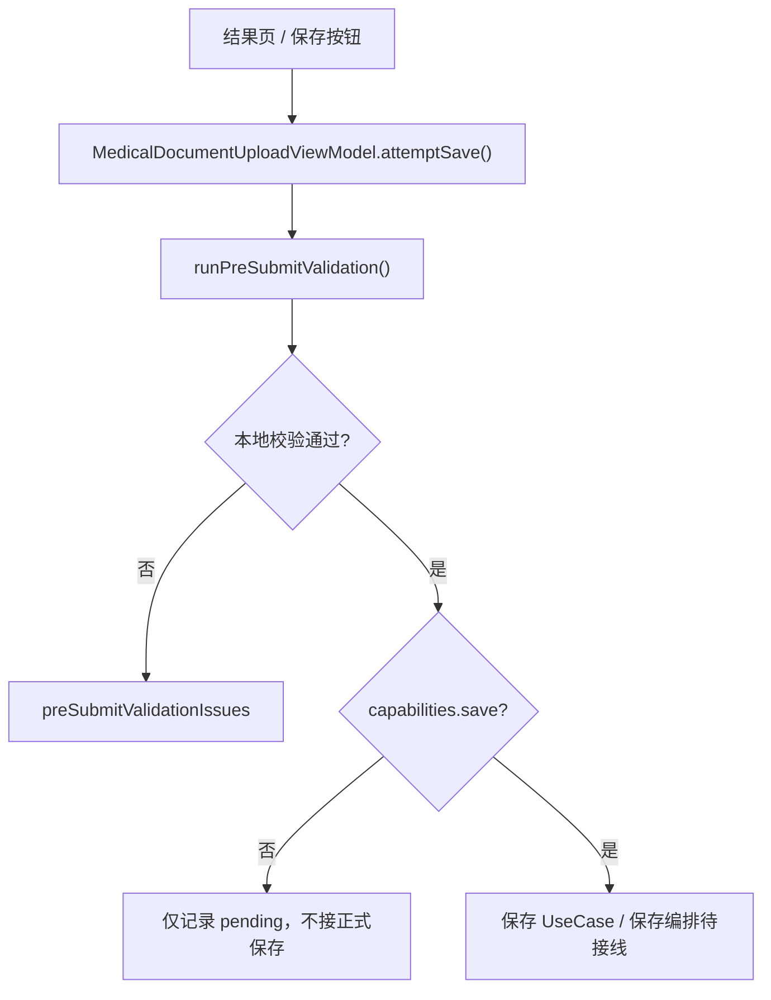
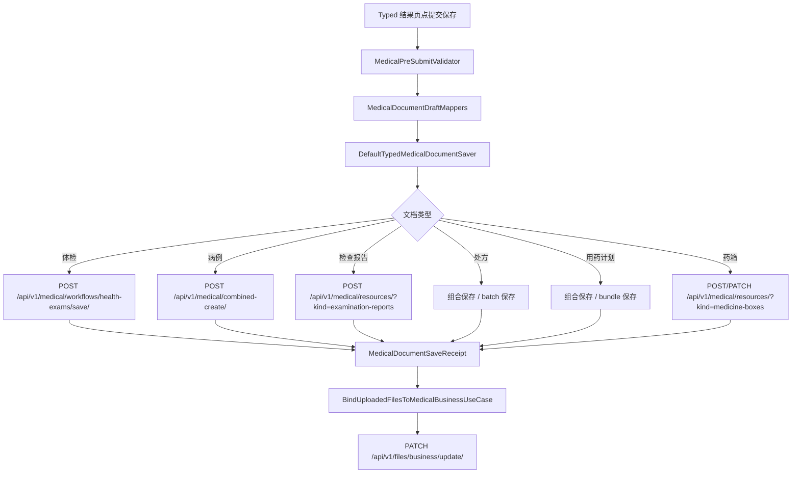
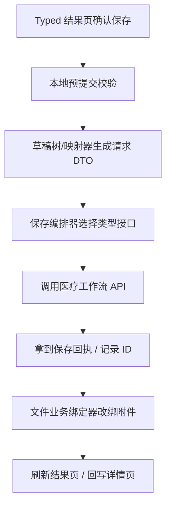
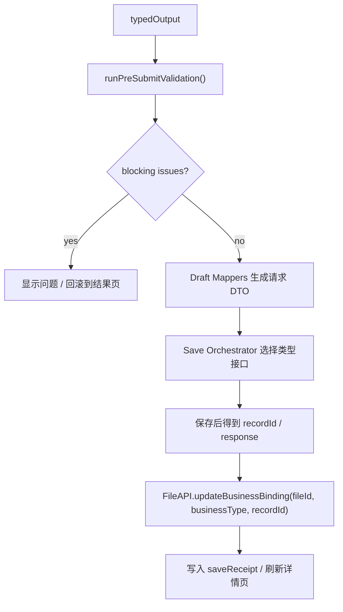

# HOS-MED-UPLOAD-0009 结果确认与保存 iOS 对齐工单

> 状态：已实现（六类保存编排 + AppContainer 接线；真机联调待验收）
> 范围：仅覆盖 AI 上传报告链路中的“结果确认与保存”闭环，包括保存前预提交校验、Typed 草稿到后端请求体映射、保存接口调用、附件业务归属更新和保存回执处理。
> 审计时间：2026-07-25
> 实现时间：2026-07-25
> 前置工单：`HOS-MED-UPLOAD-0001` ～ `HOS-MED-UPLOAD-0008`
> 后续衔接：附件与业务结果匹配深化、列表刷新监听 `saveSucceededRevision`
> 测试：`entry/src/test/ets/MedicalDocumentUpload/MedicalDocumentUpload0009.test.ets`

## 1. 对标范围与结论

### 1.1 当前迁移阶段

HarmonyOS 端的医疗文档上传链路已经进入“可以得到 Typed 草稿、可以做本地预提交校验、可以组装保存请求体，但最终保存闭环还没有完全接通”的阶段。

当前已确认的事实：

1. `MedicalDocumentUploadViewModel` 已经有 `attemptSave()` 和 `runPreSubmitValidation()`
2. Typed 结果已存在分类型草稿树：`MedicalDocumentTypedDraftTree`
3. 草稿到保存请求的映射层已存在：`MedicalDocumentDraftMappers`
4. 预提交校验规则已存在：`MedicalPreSubmitValidator` / `MedicalPreSubmitValidationRules`
5. 体检保存接口已接通：`saveHealthExam`
6. 药箱保存接口已接通：`createMedicineBox` / `updateMedicineBox`
7. 文件业务绑定接口已接通：`FileAPI.updateBusinessBinding`
8. 但处方、用药计划、组合创建、完整结果确认页与保存回执串联还没有形成统一闭环

| 阶段 | 当前事实 | 结论 |
| --- | --- | --- |
| typed 结果生成 | 已完成 | `MedicalDocumentTypedExtractionOutput` / `MedicalDocumentTypedDraftTree` 已可承接结果页编辑态 |
| pre-submit 校验 | 已完成 | 已有规则和问题模型，可阻断不完整草稿 |
| 请求体映射 | 已完成 | 草稿能够映射到 `MedicalDocumentDraftMappers` 里的请求模型 |
| 保存接口 | 部分完成 | 体检、药箱已接通；处方/用药计划/组合创建仍待完善 |
| 附件绑定 | 部分完成 | 文件业务更新接口已在公共文件底座存在，但医疗保存后编排尚未统一 |
| 保存回执 | 部分完成 | 有 `MedicalDocumentSaveReceipt` 语义；尚未形成所有类型一致的结果页闭环 |

一句话结论：**现在不是“没有保存模型”，而是“保存链路已经分层齐了，但还缺一个把 Typed 草稿、后端请求、接口回执和文件绑定全部串起来的统一保存编排层”。**

### 1.2 iOS 侧真实形态

iOS 端这条链路不是单个按钮，而是一个完整的工作流：

1. `MedicalPreSubmitValidator` 先做保存前阻断
2. `MedicalDocumentDraftMappers` 把识别草稿转成保存请求
3. `DefaultTypedMedicalDocumentSaver` 按文档类型调用不同后端接口
4. `BindUploadedFilesToMedicalBusinessUseCase` 在保存成功后，把源文件改绑到最终业务对象
5. `SaveTypedMedicalDocumentUseCase` 只包一层保存职责

HarmonyOS 端当前已经有对应的模型命名和部分 API，但还没有把这些层统一接在 `MedicalDocumentUploadViewModel` 的 `save` 阶段上。

### 1.3 这张工单要解决什么

这张工单不是泛泛地写“保存功能待实现”，而是要把以下五件事一次讲透：

1. `Typed` 草稿结构和最终保存 DTO 的对应关系
2. 每种文档类型走哪一个后端接口
3. 每种接口的请求体、响应体和保存回执
4. 保存成功后的附件业务归属如何从 `medical_document_upload_source` 改绑到最终业务记录
5. 哪些能力在 HarmonyOS 已有模型，哪些只是 iOS 已有实现，哪些仍是待接线

## 2. 华为端目录设计

### 2.1 当前目录事实

```text
SparkClientHarmonyOS/entry/src/main/ets/
├── Core/
│   ├── FileStorage/
│   │   ├── FileAPI.ets
│   │   ├── FileStorageModels.ets
│   │   └── FileTransferService.ets
│   └── Networking/API/Medical/
│       ├── CombinedMedicalCreateAPI.ets
│       ├── MedicalWorkflowAPI.ets
│       ├── MedicalSyncAPI.ets
│       └── SparkMedicalResourceKind.ets
└── Projects/
    ├── Features/MedicalDocumentUpload/
    │   ├── Application/
    │   ├── Domain/
    │   │   ├── MedicalDocumentDraftBuilders.ets
    │   │   ├── MedicalDocumentDraftMappers.ets
    │   │   ├── MedicalDocumentRecognitionDrafts.ets
    │   │   ├── MedicalDocumentTypedModels.ets
    │   │   ├── MedicalPreSubmitValidationIssue.ets
    │   │   ├── MedicalPreSubmitValidationRules.ets
    │   │   └── MedicalPreSubmitValidator.ets
    │   ├── Infrastructure/
    │   └── Presentation/
    └── Features/Home/Presentation/MedicalLists/
        ├── HealthExamReports/
        ├── ExaminationReports/
        ├── MedicineBox/
        └── Medications/
```

### 2.2 本工单建议的目标目录

```text
SparkClientHarmonyOS/entry/src/main/ets/Projects/
├── Features/
│   └── MedicalDocumentUpload/
│       ├── Application/
│       │   ├── MedicalDocumentSaveUseCase.ets              # 目标新增
│       │   ├── MedicalDocumentSaveReceiptStore.ets        # 目标新增
│       │   └── MedicalDocumentAttachmentBindingUseCase.ets # 目标新增
│       ├── Domain/
│       │   ├── MedicalDocumentSaveModels.ets               # 目标新增
│       │   ├── MedicalDocumentSaveErrors.ets              # 目标新增
│       │   └── MedicalDocumentSaveWorkflow.ets             # 目标新增
│       ├── Infrastructure/
│       │   ├── MedicalDocumentSaveOrchestrator.ets         # 目标新增
│       │   └── MedicalDocumentBusinessTypeMapper.ets      # 目标新增
│       └── Presentation/
│           ├── MedicalDocumentUploadHostView.ets
│           ├── MedicalDocumentTypedResultPage.ets
│           └── MedicalDocumentUploadViewModel.ets
└── Core/
    ├── Networking/API/Medical/
    └── FileStorage/
```

### 2.3 目录职责边界

| 层级 | 应放内容 | 不应放内容 |
| --- | --- | --- |
| `MedicalDocumentUpload/Application` | 保存编排、回执管理、绑定编排、流程控制 | 具体页面 UI |
| `MedicalDocumentUpload/Domain` | 保存模型、错误模型、workflow 枚举、业务类型映射 | 网络细节、按钮文案 |
| `MedicalDocumentUpload/Infrastructure` | 调用工作流 API、文件业务绑定 API、DTO 组装 | 页面跳转和列表缓存 |
| `Core/Networking/API/Medical` | 体检、处方、用药计划、药箱等真实请求 DTO 和 API | UI 状态和结果页 |
| `Core/FileStorage` | 文件登记、业务绑定、下载、删除 | 医疗业务语义 |

## 3. 分层职责与请求链路

### 3.1 当前请求链路



### 3.2 iOS 真实保存链路



### 3.3 HarmonyOS 目标请求链路



## 4. 数据模型全景

### 4.1 保存链路核心对象

| 层次 | iOS 侧名称 | HarmonyOS 侧名称 | 作用 |
| --- | --- | --- | --- |
| 信封 | `MedicalDocumentRecognitionEnvelope` | `MedicalDocumentTypedEnvelope` | 保存成员、类型、OCR 摘要、文件边界等上下文 |
| 草稿树 | `MedicalDocumentTypedResult` / 关联值 | `MedicalDocumentTypedDraftTree` | 按类型承载可编辑草稿 |
| 预览壳 | `MedicalTypedResultPayload` | `MedicalTypedResultPayload` | 通用标题/摘要/JSON 预览 |
| 保存 DTO | `*CreateRequest` / `*SavePayload` | `MedicalDocumentDraftMappers` / `MedicalWorkflowAPI` 请求体 | 从草稿映射到后端契约 |
| 保存回执 | `MedicalDocumentSaveReceipt` | `MedicalDocumentSaveReceipt` 语义待统一 | 记录保存结果和记录 ID |
| 附件绑定 | `ManagedFileBusinessUpdateItem` | `FileBusinessUpdateBody` | 把源文件改绑到最终业务记录 |

### 4.2 HarmonyOS Typed 草稿树

`MedicalDocumentTypedModels.ets` 里当前的关键结构如下：

| 结构 | 语义 | 对应类型 |
| --- | --- | --- |
| `MedicalDocumentTypeResolution` | 类型识别结果 | 全类型通用 |
| `MedicalDocumentTypedEnvelope` | 保存上下文 | 全类型通用 |
| `MedicalTypedResultPayload` | 统一预览壳 | 全类型通用 |
| `MedicalDocumentTypedExtractionOutput` | 统一输出包 | 全类型通用 |
| `MedicalDocumentTypedDraftTree` | 分类型草稿树 | `caseDocument` / `healthExamReport` / `medicalReport` / `prescription` / `medicationPlan` / `medicineBox` |

### 4.3 分类型草稿模型

| 文档类型 | 草稿根类型 | 关键子模型 | 备注 |
| --- | --- | --- | --- |
| 病例 | `CaseRecognitionDraft` | `SymptomRecognitionDraft`、`VisitRecognitionDraft`、`SurgeryRecognitionDraft`、`FollowUpRecognitionDraft`、`PrescriptionRecognitionDraft`、`MedicalReportRecognitionDraft` | 允许一个病例内带多个子单据 |
| 体检报告 | `HealthExamRecognitionDraft` | `MedicalReportItem` | 通常拆成指标行 |
| 检查报告 | `MedicalReportRecognitionDraft` | `ItemDraft` | 适配影像 / 病理 / 检验报告 |
| 处方 | `PrescriptionRecognitionDraft` | `MedicationPlanRecognitionDraft` | 处方内含多个用药计划 |
| 用药计划 | `MedicationPlanRecognitionDraft` | `MedicineBoxRecognitionDraft`、`ReminderTime` | 既可独立保存，也可挂在处方内 |
| 药箱 | `MedicineBoxRecognitionDraft` | 无更深层子模型 | 直接创建/更新药箱条目 |

### 4.4 草稿字段与保存字段的对应关系

| 草稿字段 | 保存侧字段 | 说明 |
| --- | --- | --- |
| `attachmentFileIds` | `sourceFileIds` / `file_ids` | 识别草稿里保留的源文件引用，映射到后端保存请求 |
| `title` | `title` / `itemName` / `medicineName` | 根据类型写入不同字段 |
| `summary` / `diagnosis` | `diagnosisSummary` / `findings` / `impression` | 不同接口语义不同 |
| `examDate` / `performedAt` / `prescribedAt` | `exam_date` / `performed_at` / `prescribed_at` | 日期字段需要完整性校验 |
| `status` | `status` | 处方、用药计划、药箱按白名单保存 |
| `extra` | `extra` | 扩展字段保留原始信息 |

### 4.5 预提交校验问题模型

`MedicalPreSubmitValidationIssue` 已经把“可阻断字段错误”做成了结构化模型：

| 字段 | 作用 |
| --- | --- |
| `resourceType` | 错误属于哪类单据 |
| `fieldPath` / `fieldKey` | 字段路径，便于滚动定位和高亮 |
| `fieldLabel` | UI 展示文案 |
| `message` | 错误说明 |
| `severity` | 阻断 / 提醒 |
| `sectionTitle` | 结果页里要展开到哪一段 |
| `cardIndex` / `prescriptionIndex` | 定位子卡片 |

### 4.6 预提交校验覆盖范围

| 类型 | 已校验项 | 例子 |
| --- | --- | --- |
| 病例 | 标题、就诊日期、年龄、症状名、就诊时间、手术日期、随访字段 | `medical_case.title`、`symptom.name` |
| 体检报告 | 机构名、体检日期、指标项名称、结果值 | `health_exam.items[0].result_value` |
| 检查报告 | 报告标题、检查日期、分类、明细项 | `examination_reports[0].item_name` |
| 处方 | 开方日期、处方状态、药品计划 | `prescriptions[0].status` |
| 用药计划 | 药名、日期、剂量、频次、状态、提醒时间 | `prescriptions[0].medication_plans[0].dose_value` |
| 药箱 | 药名、数量、有效期、归属字段 | `medicine_box.*` |

## 5. 后端服务接口全对齐

### 5.1 公共文件业务绑定接口

| 能力 | 接口 | 请求模型 | 作用 |
| --- | --- | --- | --- |
| 业务绑定更新 | `PATCH /api/v1/files/business/update/` | `FileBusinessUpdateBody` / `ManagedFileBusinessUpdateItem` | 把已上传文件从源业务改绑到最终业务记录 |

#### 5.1.1 HarmonyOS 当前实现

| 文件 | 位置 | 说明 |
| --- | --- | --- |
| `Projects/Core/Networking/API/File/FileAPI.ets` | `updateBusinessBinding(fileId, businessType, businessId)` | 已实现 |
| `Core/FileStorage/FileTransferService.ets` | `updateBusinessBinding(...)` | 已透传到 `FileAPI` |
| `Core/FileStorage/FileStorageModels.ets` | `FileBusinessUpdateBody` | 请求体字段已定义 |

#### 5.1.2 请求模型

```text
FileBusinessUpdateBody
├── file_id: number
├── business_type: string
└── business_id: string
```

#### 5.1.3 业务类型映射

| Typed 类型 | 最终 `business_type` | 说明 |
| --- | --- | --- |
| 病例 | `medical_case` | iOS 绑定器使用的最终值 |
| 体检报告 | `health_exam_report` | iOS 绑定器使用的最终值 |
| 检查报告 | `examination_report` | iOS 绑定器使用的最终值 |
| 处方 | `prescription_batch` | iOS 绑定器使用的最终值 |
| 用药计划 | `medication_plan` | iOS 绑定器使用的最终值 |
| 药箱 | `medicine_box` | iOS 绑定器使用的最终值 |
| 自动/未知 | `medical_document` | 仅兜底，不应作为最终保存目标 |

### 5.2 体检保存接口

| 能力 | 接口 | HarmonyOS 请求模型 | 响应 |
| --- | --- | --- | --- |
| 体检报告保存 | `POST /api/v1/medical/workflows/health-exams/save/` | `HealthExamSavePayload` | `number`（保存后的记录 ID） |

#### 5.2.1 请求体字段

```text
HealthExamSavePayload
├── member: number
├── institution_name: string
├── report_no: string
├── exam_date?: string
├── exam_type: number
├── summary?: string
├── source: number
├── raw_ocr?: Record<string, string>
├── status: number
├── extra: Record<string, string>
├── details: HealthExamDetailSaveRow[]
└── file_ids: number[]
```

#### 5.2.2 明细行字段

```text
HealthExamDetailSaveRow
├── category
├── sub_category
├── item_name
├── item_code
├── result_value
├── unit
├── reference_range
├── flag
├── result_at
├── modality
├── body_part
├── diagnosis
└── sort_order
```

### 5.3 检查报告保存接口

HarmonyOS 当前已经有检查报告的查询、归档和详情展示，但本次审计中没有看到单独的“检查报告保存”专用 API 方法名。

| 当前状态 | 说明 |
| --- | --- |
| DTO 侧 | `RemoteExaminationReportWithAttachments` 已存在 |
| 展示侧 | `ExaminationReportDetailPage` 已存在 |
| 保存侧 | 需要单独确认是否走 `createResource(kind: .examination-reports)` 或后端专用 workflow |

#### 5.3.1 与 iOS 对齐的推断

iOS 端对检查报告的保存走的是独立 resource create 路径，而不是体检专用 save 接口。HarmonyOS 当前已有 `SparkMedicalWorkflowAPI.createResource(kind:body:)`，因此检查报告最可能的落点是：

```text
POST /api/v1/medical/resources/?kind=examination-reports
```

但该保存方法名在当前 HarmonyOS `MedicalWorkflowAPI.ets` 中尚未显式封装为 `saveExaminationReport`，因此本工单必须把它标记为“接口契约已确认、方法封装待补全”。

### 5.4 病例 / 组合创建接口

| 能力 | 接口 | 说明 |
| --- | --- | --- |
| 组合创建 | `POST /api/v1/medical/combined-create/` | iOS 端已完整实现；HarmonyOS 侧当前是 `SparkCombinedMedicalCreateAPI` 桩 |

#### 5.4.1 HarmonyOS 当前状态

| 文件 | 状态 |
| --- | --- |
| `Projects/Core/Networking/API/Medical/CombinedMedicalCreateAPI.ets` | 桩占位，仅有 `isConfigured()` |
| `Projects/Features/MedicalDocumentUpload/Domain/MedicalDocumentDraftMappers.ets` | 已能构造 `MedicalCaseCreateRequest`、`ExaminationReportCreateRequest`、`PrescriptionCreateRequest` 等中间请求体 |

#### 5.4.2 iOS 侧组合创建请求

iOS `CombinedMedicalCreateRequest` 关键字段如下：

```text
CombinedMedicalCreateRequest
├── member
├── medicalCase
├── symptom?
├── visit?
├── surgery?
├── followUp?
├── examinationReports?
├── prescriptions?
└── sourceFileIds?
```

#### 5.4.3 HarmonyOS 对应请求形态

HarmonyOS `MedicalDocumentDraftMappers.ets` 已经有对应的请求模型：

```text
MedicalCaseCreateRequest
SymptomCreateRequest
VisitCreateRequest
SurgeryCreateRequest
FollowUpCreateRequest
ExaminationReportCreateRequest
PrescriptionCreateRequest
MedicationPlanBundleItemPayload
MedicineBoxCreateRequest
```

但组合保存 API 入口还没有完全接上线。

### 5.5 处方与用药计划保存接口

| 能力 | iOS 侧 | HarmonyOS 侧 | 现状 |
| --- | --- | --- | --- |
| 处方批量保存 | `savePrescriptionsBatch` | 当前未封装同名方法 | 需要补全 |
| 用药计划 bundle 保存 | `saveMedicationPlanBundleResponse` | 当前未封装同名方法 | 需要补全 |
| 处方内药箱候选 | 组合保存 / 绑定逻辑 | 已有草稿与字段规范化 | 需要补全 API 层 |

#### 5.5.1 HarmonyOS 草稿对应 DTO

```text
PrescriptionRecognitionDraft -> PrescriptionCreateRequest
MedicationPlanRecognitionDraft -> MedicationPlanBundleItemPayload
MedicineBoxRecognitionDraft -> MedicineBoxCreateRequest
```

#### 5.5.2 HarmonyOS 当前接口缺口

当前 `MedicalWorkflowAPI.ets` 里已存在：

| 方法 | 状态 |
| --- | --- |
| `saveHealthExam(payload)` | 已实现 |
| `createMedicineBox(payload)` | 已实现 |
| `updateMedicineBox(id, payload)` | 已实现 |
| `createResource(kind, body)` | 已实现，底层泛化能力已在 |

但尚未看到：

| 期望方法 | 备注 |
| --- | --- |
| `savePrescriptionsBatch(...)` | 需要新增 |
| `saveMedicationPlanBundleResponse(...)` | 需要新增 |
| `saveExaminationReport(...)` | 可基于 `createResource` 封装 |
| `saveCaseDocument(...)` | 可基于 `CombinedMedicalCreateAPI` 封装 |

### 5.6 药箱保存接口

| 能力 | 接口 | HarmonyOS 当前方法 |
| --- | --- | --- |
| 药箱创建 | `POST /api/v1/medical/resources/?kind=medicine-boxes` | `createMedicineBox(payload)` |
| 药箱更新 | `PATCH /api/v1/medical/resources/{id}/?kind=medicine-boxes` | `updateMedicineBox(id, payload)` |

#### 5.6.1 药箱请求体

```text
MedicineBoxWritePayload
├── member?
├── entry_member_id
├── medicine_name
├── medicine_type?
├── brand_name
├── dosage_form
├── strength
├── dose_unit
├── total_quantity?
├── expire_date?
├── notes
├── extra
└── file_ids
```

### 5.7 保存回执模型

| 模型 | 作用 |
| --- | --- |
| `MedicalDocumentSaveReceipt` | 统一保存结果，承载 record ID、保存时间、成功状态 |
| `CombinedMedicalCreateResponse` | 组合创建响应，返回 member / case / prescriptions / medicationPlan / medicineBox IDs |
| `RemoteMedicineBox` | 药箱保存后返回的远端模型 |
| `RemoteHealthExamReportWithAttachments` | 体检保存后或查询后的远端模型 |
| `RemoteExaminationReportWithAttachments` | 检查报告保存后或查询后的远端模型 |

## 6. 保存编排与附件绑定

### 6.1 iOS 保存顺序

iOS 端的真实顺序是：

1. 结果页提交保存
2. 本地预提交校验
3. 由 `DefaultTypedMedicalDocumentSaver` 选择对应保存接口
4. 获得 `MedicalDocumentSaveReceipt`
5. `BindUploadedFilesToMedicalBusinessUseCase` 把已上传源文件改绑到最终业务记录
6. 结果页/列表页刷新

### 6.2 HarmonyOS 当前顺序

HarmonyOS 当前已经有：

1. `runPreSubmitValidation()`
2. `attemptSave()`
3. `MedicalDocumentDraftBuilders`
4. `MedicalDocumentDraftMappers`
5. `FileAPI.updateBusinessBinding(...)`

但缺少：

1. 统一的 `MedicalDocumentSaveUseCase`
2. 统一的保存编排器
3. 保存成功后统一触发文件改绑
4. 保存回执和结果页状态回写

### 6.3 建议的保存编排顺序



### 6.4 绑定业务类型映射

| 文档类型 | 保存目标 businessType | 保存记录 ID 来源 |
| --- | --- | --- |
| 病例 | `medical_case` | 组合创建返回的 case ID |
| 体检报告 | `health_exam_report` | `saveHealthExam()` 返回 ID |
| 检查报告 | `examination_report` | 检查报告创建返回 ID |
| 处方 | `prescription_batch` | 处方批量保存返回 ID |
| 用药计划 | `medication_plan` | 计划 bundle 保存返回 ID |
| 药箱 | `medicine_box` | `createMedicineBox()` / `updateMedicineBox()` 返回 ID |

### 6.5 保存成功后清理规则

保存成功后，建议做以下清理：

1. 清理当前 `uploadSessionId` 对应的保存断点
2. 清理结果页的 blocking validation issue
3. 保留当前 typed 结果用于详情页回显，直到导航离开
4. 文件业务绑定成功后，源文件从 `medical_document_upload_source` 迁移到最终业务 businessType

## 7. 当前实现、缺口与演进

### 7.1 当前实现（本轮已落地）

| 模块 | 当前状态 | 说明 |
| --- | --- | --- |
| 预提交校验 | 已实现 | `attemptSave` 门控 |
| 草稿 -> DTO 映射 | 已实现 | `MedicalDocumentDraftMappers` |
| `SaveTypedMedicalDocumentUseCase` | 已实现 | 薄封装 |
| `DefaultTypedMedicalDocumentSaver` | 已实现 | 六类 switch |
| 体检 / 检查 / 处方 / 用药计划 / 药箱 / 病例 | 已接线 | workflow + combined-create |
| 附件改绑 | 已实现（best-effort） | 保存成功后 `bindUploadedFilesAfterSave`；失败不阻断 UX |
| AppContainer | 已注入 | `medicalWorkflow` + `medicalCombinedCreate` → `capabilities.save=true` |

### 7.2 仍可增强项

| 项 | 说明 |
| --- | --- |
| 处方 preflight 专用错误 → issues UI | iOS 有 `PrescriptionPayloadPreflightError`；HOS 目前靠预提交校验 |
| 首页监听 `saveSucceededRevision` | 保存成功后列表自动刷新 |
| 绑定失败显式提示 | 当前仅打日志，不阻断 dismiss |

### 7.3 实现落点

| 能力 | 文件 |
| --- | --- |
| UseCase | `Application/SaveTypedMedicalDocumentUseCase.ets` |
| Saver | `Infrastructure/DefaultTypedMedicalDocumentSaver.ets` |
| Protocol | `Domain/TypedMedicalDocumentSaving.ets` |
| Combined API | `CombinedMedicalCreateAPI.ets` |
| Workflow 扩展 | `MedicalWorkflowAPI.ets`（report/rx/plan） |
| VM | `attemptSave` → `saveResult`；`isSaving` / `saveReceipt` / dismiss |
| 单测 | `MedicalDocumentUpload0009.test.ets` |

## 8. 测试与验收标准

### 8.1 测试目录

```text
SparkClientHarmonyOS/entry/src/test/ets/MedicalDocumentUpload/
└── MedicalDocumentUpload0009.test.ets
```

### 8.2 验收清单

1. [x] `attemptSave` 接入正式 `SaveTypedMedicalDocumentUseCase`
2. [x] 病例 / 体检 / 检查 / 处方 / 用药计划 / 药箱六类均可编排保存
3. [x] 保存成功后 best-effort 附件改绑；失败不丢业务记录
4. [x] 保存失败保留 Typed 草稿，可再次提交
5. [x] 成功后清理 checkpoint、toast、dismiss、`saveSucceededRevision++`
6. [ ] 真机联调六类接口与附件可见性

