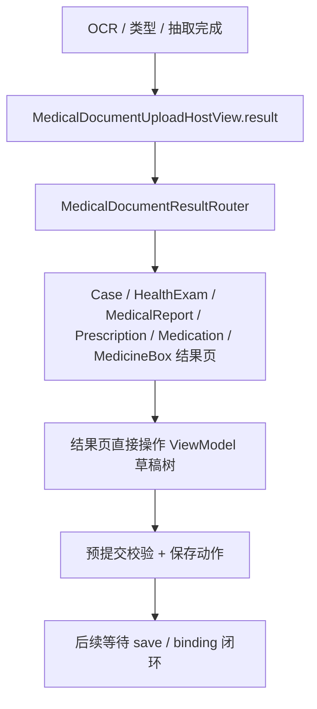
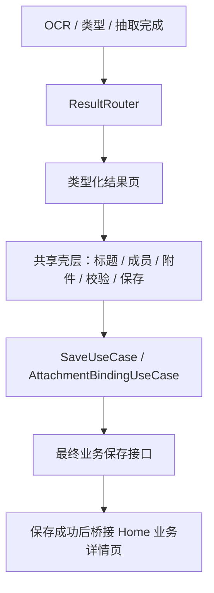

# HOS-MED-UPLOAD-0011 各类型结果页实现偏差与优化方向 iOS 对齐工单

> 状态：已实现
> 范围：仅复核 AI 上传报告“各类型结果页”在 HarmonyOS 端的当前实现偏差，并给出优化方向，不改动 iOS 代码，不改动服务器代码。
> 审计时间：2026-07-25
> 参考工单：`HOS-MED-UPLOAD-0008-各类型结果页iOS对齐工单.md`
> 关联链路：结果确认与保存、附件与业务结果匹配

## 1. 对标范围与结论

### 1.1 当前实现阶段

HarmonyOS 端的结果页已经不再是单一的占位页，而是进入了“路由器 + 六类结果页 + 通用兜底页”的阶段。

当前代码事实如下：

1. `MedicalDocumentUploadHostView` 的 `result` 分支已经切到 `MedicalDocumentResultRouter`
2. `MedicalDocumentResultRouter` 可以按文档类型分流到 6 类结果页
3. `MedicalDocumentTypedResultPage` 已经降级为 AUTO / 未识别兜底页
4. 结果页内部已经接入预提交校验、编辑草稿、附件回显和保存动作

| 结果页能力 | 当前实现 | 结论 |
| --- | --- | --- |
| Host 结果分流 | `MedicalDocumentUploadHostView` → `MedicalDocumentResultRouter` | 已完成 |
| 类型化结果页 | 6 类结果页已存在 | 已完成骨架与主体编辑 |
| 通用兜底页 | `MedicalDocumentTypedResultPage` | 已完成且仅应作为兜底 |
| 预提交校验 | `MedicalPreSubmitValidationBanner` + `preSubmitValidationIssueLines()` | 已接入 |
| 保存动作 | `MedicalDocumentResultActionBar` + `attemptSave()` | 已接入但仍待最终业务闭环 |

一句话结论：**0008 所定义的“结果页分流”已实现，但实现路径已经从“统一 typed 页承接”演进为“结果路由器 + 分类型编辑页 + 共用壳层”。**

### 1.2 与 0008 目标的偏差总结

| 维度 | 0008 目标 | 当前实现 | 偏差性质 |
| --- | --- | --- | --- |
| 页面入口 | 以统一结果页承接，再逐步向业务页收敛 | 已直接引入 `MedicalDocumentResultRouter` | 架构前移，结果页粒度更细 |
| 页面职责 | 统一页偏向兜底，类型页偏向确认壳 | 类型页已承担编辑、校验、保存 | 功能更完整，但也更复杂 |
| 状态归属 | 页面展示为主 | 结果页直接操作 ViewModel 草稿树 | UI 与编排层耦合偏强 |
| 业务衔接 | 结果页后续应桥接最终业务保存 | 目前仍主要停留在上传侧确认页 | 保存闭环仍未完全打通 |
| 复用结构 | 目标上希望保持页面轻量 | 页面已出现较多重复编辑结构 | 需要进一步抽象公共壳层 |

## 2. 华为端目录设计

### 2.1 当前目录事实

```text
SparkClientHarmonyOS/entry/src/main/ets/Projects/Features/MedicalDocumentUpload/
├── Domain/
│   ├── MedicalDocumentKind.ets
│   ├── MedicalDocumentRecognitionDrafts.ets
│   ├── MedicalDocumentResultKindResolver.ets
│   ├── MedicalDocumentAttachmentBindingModels.ets
│   └── MedicalPreSubmitValidationRules.ets
└── Presentation/
    ├── MedicalDocumentUploadHostView.ets
    ├── MedicalDocumentTypedResultPage.ets
    ├── MedicalDocumentUploadViewModel.ets
    └── ResultPages/
        ├── MedicalDocumentResultRouter.ets
        ├── Shared/
        │   ├── MedicalDocumentResultChrome.ets
        │   └── PreSubmitValidation/
        │       └── MedicalPreSubmitValidationBanner.ets
        ├── CaseRecognitionResult/
        ├── HealthExamRecognitionResult/
        ├── MedicalReportRecognitionResult/
        ├── PrescriptionRecognitionResult/
        ├── MedicationRecognitionResult/
        └── MedicineBoxRecognitionResult/
```

### 2.2 偏差对应的优化目录

```text
SparkClientHarmonyOS/entry/src/main/ets/Projects/Features/MedicalDocumentUpload/Presentation/
├── ResultPages/
│   ├── Shared/
│   │   ├── MedicalDocumentResultChrome.ets
│   │   ├── MedicalDocumentResultActionBar.ets        # 优化方向：进一步收敛
│   │   ├── MedicalDocumentResultMemberBar.ets        # 优化方向：进一步收敛
│   │   └── PreSubmitValidation/
│   ├── CaseRecognitionResult/
│   ├── HealthExamRecognitionResult/
│   ├── MedicalReportRecognitionResult/
│   ├── PrescriptionRecognitionResult/
│   ├── MedicationRecognitionResult/
│   └── MedicineBoxRecognitionResult/
└── MedicalDocumentUploadHostView.ets
```

### 2.3 目录职责边界

| 层级 | 应放内容 | 不应放内容 |
| --- | --- | --- |
| `MedicalDocumentUpload/Presentation/ResultPages` | 类型化结果页、共享壳层、预提交提示 | 后端保存契约、文件上传逻辑 |
| `MedicalDocumentUpload/Domain` | 草稿树、类型分流、预提交规则、绑定模型 | 页面布局与按钮文案 |
| `Home/Presentation/MedicalLists` | 真正业务详情页和业务结果页承接目标 | 上传侧识别逻辑 |

## 3. 分层职责与请求链路

### 3.1 当前请求链路



### 3.2 目标请求链路



### 3.3 关键职责表

| 责任 | 当前实现 | 说明 |
| --- | --- | --- |
| 页面分流 | `MedicalDocumentResultRouter` | 已从 HostView 中抽离 |
| 通用兜底 | `MedicalDocumentTypedResultPage` | 只用于 AUTO / 未识别 |
| 类型页编辑 | `HealthExamRecognitionResultPage` 等 | 已承担编辑与校验 |
| 保存编排 | `MedicalDocumentUploadViewModel.attemptSave()` | 仍集中在 ViewModel |
| 结果桥接 | `bindUploadedFilesAfterSave()` 等待下游 | 仍待最终闭环 |

## 4. 偏差分析

### 4.1 页面层偏差

**偏差 1：结果页不再只是“确认壳”，而是实际编辑页。**

0008 的目标更接近“确认壳 + 兜底页”结构，但当前实现已经把下面这些能力都放进来了：

- 草稿编辑
- 预提交校验
- 附件回显
- 保存按钮
- 结果页内直接修改 ViewModel

这意味着页面已经从“展示确认”偏向“轻量编辑器”。

**偏差 2：统一 typed 页与类型化结果页的边界更清晰，但职责仍偏混。**

`MedicalDocumentTypedResultPage` 已经保留为兜底页，这一点是对的；但现在它仍承载了“结果标题、预览、返回选择、保存入口”等一部分通用语义，和类型页之间的交界还不够明确。

### 4.2 状态层偏差

**偏差 3：结果页直接依赖并修改 `MedicalDocumentUploadViewModel`。**

当前结果页大量调用以下能力：

- `ensureTypedDraftTree(...)`
- `notifyTypedDraftChanged(...)`
- `preSubmitValidationIssueLines()`
- `attemptSave()`
- `returnToPickingPreservingFiles()`

这让页面层和编排层绑定得很紧，页面很难独立测试，也不方便把某一类结果页替换成更轻的承接页。

### 4.3 数据层偏差

**偏差 4：草稿模型仍偏“字段容器”，业务保存契约仍是另一套。**

`MedicalDocumentRecognitionDrafts.ets` 中的草稿结构已经覆盖了病例、体检、检查、处方、用药计划、药箱，但它们的附件字段仍然是 `attachmentFileIds: string[]`，而最终保存链路仍需要面向 `file_ids`、`RemoteManagedFile` 和业务保存 payload。

这说明当前结果页虽然能编辑，但“编辑态数据”与“保存态数据”的分界还不够硬。

### 4.4 复用层偏差

**偏差 5：页面共享壳层已经出现，但仍有重复。**

当前每个结果页都重复出现了：

- 标题
- 校验横幅
- 成员条
- 附件区
- 底部操作区

这会导致后续每新增一种文档类型，都要复制一套相似布局。

## 5. 优化方向

### 5.1 先把“结果页壳”固定下来

建议保留 `MedicalDocumentResultRouter` 作为唯一入口，但进一步把各页面共有结构收敛为一层稳定壳：

1. 顶部类型标题
2. 成员与文档类型条
3. 校验横幅
4. 主体编辑区
5. 附件区
6. 底部保存栏

这样每个类型页只需要实现“主体编辑区”。

### 5.2 把 ViewModel 中的结果页职责下沉成页面服务

建议把下面这类职责从 `MedicalDocumentUploadViewModel` 继续下沉：

- 结果页草稿初始化
- 预提交问题定位
- 校验问题折叠区展开
- 保存前附件绑定准备

目标是让 ViewModel 保留“状态编排”，页面服务负责“页面态计算”。

### 5.3 把保存前后的数据边界分清

建议明确三层数据：

| 层级 | 例子 | 责任 |
| --- | --- | --- |
| 识别草稿 | `MedicalDocumentRecognitionDrafts` | 供页面编辑 |
| 预提交结果 | `MedicalPreSubmitValidationIssue` / `preparedAttachmentBinding` | 供保存前检查 |
| 最终保存载荷 | `HealthExamSavePayload` / `MedicineBoxWritePayload` 等 | 供后端落库 |

这能减少“看起来已经保存，但其实只是页面草稿变了”的误判。

### 5.4 把结果页和最终业务详情页的桥接做成显式步骤

当前结果页在上传侧已经能编辑，但保存成功后还没有形成统一、显式的“桥接到 Home 业务详情页”的动作。

优化方向是：

1. 保存成功后返回明确 receipt
2. receipt 带上 kind、保存 id、附件 id 映射
3. Home 侧根据 receipt 跳转到对应详情页

这样可以避免结果页和最终业务页互相侵入。

### 5.5 让统一 typed 页只做兜底

`MedicalDocumentTypedResultPage` 目前是兜底页，应该继续保持这个定位：

- AUTO / 未识别
- 抽取结果缺失
- 结果页初始化失败
- 不支持的类型

不建议把新的类型化编辑逻辑继续塞回这个页面，否则会重新把路由和编辑逻辑糊成一团。

## 6. 当前实现、缺口与演进

### 6.1 当前实现

| 模块 | 当前状态 | 说明 |
| --- | --- | --- |
| Host 分流 | 已完成 | 已接 `MedicalDocumentResultRouter` |
| 类型化结果页 | 已完成 | 6 类页面已出现 |
| 通用兜底页 | 已完成 | `MedicalDocumentTypedResultPage` 已降级 |
| 页面校验 | 已完成 | 校验横幅和字段校验已接入 |
| 保存编排 | 部分完成 | 仍由 ViewModel 统筹 |
| 最终业务桥接 | 未完全完成 | 还需保存成功后的显式跳转与回写 |

### 6.2 关键缺口

| 缺口 | 现象 | 影响 |
| --- | --- | --- |
| 页面职责过宽 | 结果页同时承担编辑、校验、保存触发 | 不利于测试和复用 |
| 共享壳层未完全抽象 | 每页都在重复布局骨架 | 增加维护成本 |
| 数据层边界未完全拆开 | 草稿、预提交、保存契约耦合 | 容易出现状态漂移 |
| 保存后桥接不明确 | 保存成功后去向仍需补齐 | 结果页与业务详情页割裂 |

### 6.3 演进顺序

1. 先固化 `MedicalDocumentResultRouter` 作为唯一结果入口
2. 再把 6 类页面共用的壳层抽成可复用组件
3. 然后把保存成功后的 receipt 和 Home 详情页桥接补齐
4. 最后再评估是否把某些类型页从“编辑页”收敛为“确认页”

## 7. 测试与验收标准

### 7.1 建议测试目录

```text
SparkClientHarmonyOS/entry/src/test/ets/MedicalDocumentUpload/
└── MedicalDocumentUpload0011.test.ets   # 目标新增
```

### 7.2 建议测试场景

| 场景 | 预期结果 |
| --- | --- |
| AUTO / 未识别 | 走 `MedicalDocumentTypedResultPage` 兜底 |
| 体检报告 | 走 `HealthExamRecognitionResultPage` |
| 检查报告 | 走 `MedicalReportRecognitionResultPage` |
| 处方 | 走 `PrescriptionRecognitionResultPage` |
| 用药计划 | 走 `MedicationRecognitionResultPage` |
| 药箱 | 走 `MedicineBoxRecognitionResultPage` |
| 校验失败 | 显示预提交问题，不丢失草稿 |
| 返回文件选择 | 保留已选文件与当前结果态 |

### 7.3 整体验收标准

1. 结果页入口必须统一由 `MedicalDocumentResultRouter` 负责
2. `MedicalDocumentTypedResultPage` 只能作为兜底页存在
3. 类型页可以编辑草稿、展示附件和提示校验问题
4. 页面层不能出现重复的保存逻辑和重复的壳层拼装
5. 保存成功后必须有明确的业务桥接出口，而不是停留在上传侧结果页

