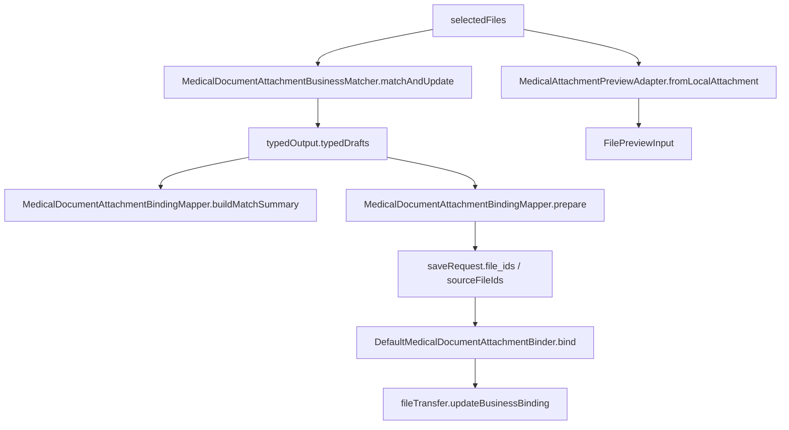

# HOS-MED-UPLOAD-0015 AI 识别报告自动匹配核心算法 iOS 对齐工单

> 状态：部分实现  
> 范围：仅覆盖“AI 识别报告自动匹配 / 结构化结果与上传附件业务绑定”这条核心算法链路，不改动服务器契约，不改动 iOS 代码。  
> 审计时间：2026-07-25  
> 参考端：`/Users/hua/Documents/project/Reference/LookHealthClient/SparkClient/`  
> 目标端：`/Users/hua/Documents/project/Reference/LookHealthClient/SparkClientHarmonyOS/`  
> 关联结论：鸿蒙端已经具备 matcher、binding mapper、binder、预览适配器、结果页附件回填等基础实现，但目录归属、数据流语义和少量模型接口仍未做到与 iOS 完全同构，需要补齐为独立工单。

## 1. 对标范围与结论

### 1.1 本工单要解决的核心问题

这张工单只对齐一条链路：

```text
upload -> ocr -> type_recognition -> extract -> attachment_binding -> save
```

其中本工单聚焦的是最后两段：

1. 结构化结果与上传附件的业务归属匹配
2. 将本地预览 ID / 远端 file id / 最终业务记录绑定为同一条闭环

iOS 端这一段是完整的、清晰拆分的：

1. `MedicalDocumentAttachmentBusinessMatcher.matchAndUpdate(files:output:)`
2. `MedicalDocumentUploadViewModel` 进入 `attachmentBinding` step
3. `MedicalDocumentAttachmentBindingMapper` 生成远端 `file_ids`
4. `DefaultMedicalDocumentAttachmentBinder` 在保存后回写业务绑定
5. `MedicalUploadLocalFile.previewInput` 给预览层直接使用

鸿蒙端目前已经有对应能力，但拆分方式不完全同构：

1. `MedicalDocumentAttachmentBusinessMatcher.ets` 负责本地草稿挂载
2. `MedicalDocumentAttachmentBindingMapper.ets` 负责本地 ID → 远端 ID 映射
3. `DefaultMedicalDocumentAttachmentBinder.ets` 负责保存后回写业务绑定
4. `MedicalAttachmentPreviewAdapter.ets` 承担了 iOS `previewInput` 类似职责
5. `MedicalDocumentUploadViewModel.ets` 在 `ATTACHMENT_BINDING` 阶段串起整条链路

### 1.2 iOS 端真实实现

iOS 的核心特点是“先匹配草稿，再组装保存绑定，再在保存后回写业务归属”。

其关键点不是单纯给附件打标签，而是要把以下三个层面的数据同时保持一致：

1. `typedOutput.envelope.sourceFiles`
2. `typedOutput.typedResult` 中各个节点的 `attachmentFileIds`
3. 保存完成后文件中心里的 `business_type / business_id`

### 1.3 鸿蒙端真实实现

鸿蒙并不是没有这条链路，而是已经做成了多段式实现：

1. `MedicalDocumentAttachmentBusinessMatcher` 完成结果草稿的本地匹配
2. `MedicalDocumentAttachmentBindingMapper` 把本地 previewId 解析为远端 file ids
3. `DefaultMedicalDocumentAttachmentBinder` 将保存后的远端 file id 回写到最终业务
4. `MedicalAttachmentPreviewAdapter` 负责本地与远端附件的统一预览
5. `MedicalDocumentUploadViewModel` 在识别流程中统一调度

### 1.4 结论

当前鸿蒙的状态是：

- 核心算法已有实现
- 目录职责基本成型
- 但“对齐 iOS 的命名、归属、纯度、结果封装方式”还不完全一致

因此本工单不应写成“从零实现”，而应写成：

1. 补齐目录同构性
2. 补齐模型接口对齐
3. 补齐缺失的公共适配层
4. 补齐测试与验收项

## 2. 华为端目录设计

### 2.1 iOS 端对应目录

```text
SparkClient/SparkClient/Projects/Features/MedicalDocumentUpload/
├── Domain/
│   └── MedicalDocumentAttachmentBusinessMatcher.swift
├── Infrastructure/
│   └── DefaultMedicalDocumentAttachmentBinder.swift
├── Presentation/
│   └── MedicalDocumentUploadViewModel.swift
└── Domain/
    └── MedicalDocumentUploadModels.swift  # 内含 MedicalUploadLocalFile.previewInput
```

### 2.2 鸿蒙端当前目录

```text
SparkClientHarmonyOS/entry/src/main/ets/Projects/Features/MedicalDocumentUpload/
├── Application/
│   ├── MedicalDocumentUploadAssembly.ets
│   ├── MedicalDocumentUploadViewModel.ets
│   ├── UploadMedicalDocumentFilesUseCase.ets
│   └── MedicalDocumentUploadCheckpointStore.ets
├── Domain/
│   ├── MedicalDocumentAttachmentBusinessMatcher.ets
│   ├── MedicalDocumentAttachmentBindingMapper.ets
│   ├── MedicalDocumentAttachmentBindingModels.ets
│   ├── MedicalDocumentUploadModels.ets
│   └── MedicalDocumentTypedModels.ets
└── Infrastructure/
    └── DefaultMedicalDocumentAttachmentBinder.ets
```

### 2.3 鸿蒙端关联公共目录

```text
SparkClientHarmonyOS/entry/src/main/ets/Projects/Features/Home/Presentation/MedicalLists/Shared/
├── MedicalAttachmentPreviewAdapter.ets
└── MedicalAttachmentBindingBridge.ets

SparkClientHarmonyOS/entry/src/main/ets/Projects/Core/UI/FilePreview/
└── FilePreviewInput.ets
```

### 2.4 目录设计上仍未完全对齐的地方

| iOS 职责 | 鸿蒙现状 | 建议补齐方向 |
| --- | --- | --- |
| `MedicalUploadLocalFile.previewInput` 作为模型属性 | 当前是 `MedicalAttachmentPreviewAdapter.fromLocalAttachment()` 生成预览输入 | 若要严格对齐 iOS，建议把预览输入能力上收进 `MedicalUploadLocalFile` 或在 `MedicalDocumentUpload` 域内提供等价门面 |
| `MedicalDocumentAttachmentBusinessMatcher.matchAndUpdate` 以纯结果返回新 output | 当前鸿蒙是就地修改 `typedOutput` | 若要强化同构，可补纯函数封装，避免上层误以为 matcher 会新建输出 |
| `DefaultMedicalDocumentAttachmentBinder` 的业务回写 | 已有，但与 `BindingMapper` 分段存在 | 建议在工单内明确两者职责边界，避免后续重复写文件绑定逻辑 |
| matcher / binder 单元测试位 | 有测试，但主要集中在 `MedicalDocumentUpload0010` | 建议补 matcher / mapper / binder / preview adapter 四类稳定回归用例 |

## 3. 分层职责与请求链路

### 3.1 iOS 的职责拆分

| 层级 | iOS 文件 | 职责 |
| --- | --- | --- |
| 核心匹配 | `MedicalDocumentAttachmentBusinessMatcher.swift` | 根据 OCR 文本把本地上传附件匹配到对应草稿节点 |
| 上传步骤 | `MedicalDocumentUploadViewModel.swift` | 在 `attachmentBinding` step 触发匹配，并进入结果页 |
| 远端 ID 映射 | 同一链路中的附属 mapper | 将本地附件映射到远端文件 ID |
| 保存后回写 | `DefaultMedicalDocumentAttachmentBinder.swift` | 把上传文件业务归属写回最终医疗业务 |
| 本地预览 | `MedicalUploadLocalFile.previewInput` | 为 UI / 附件卡片提供统一预览模型 |

### 3.2 鸿蒙当前职责拆分

| 层级 | 鸿蒙文件 | 当前状态 |
| --- | --- | --- |
| 核心匹配 | `MedicalDocumentAttachmentBusinessMatcher.ets` | 已实现 |
| ID 映射与保存前准备 | `MedicalDocumentAttachmentBindingMapper.ets` | 已实现 |
| 保存后回写 | `DefaultMedicalDocumentAttachmentBinder.ets` | 已实现 |
| 本地预览 | `MedicalAttachmentPreviewAdapter.ets` + `FilePreviewInput.ets` | 已实现，但目录职责不在 upload 域内 |
| Upload 流程编排 | `MedicalDocumentUploadViewModel.ets` | 已串起步骤，但依赖能力开关与草稿结构 |

### 3.3 目标请求链路



### 3.4 当前偏差

鸿蒙现在是“功能链路已通，但职责归属不够像 iOS”：

1. iOS 更偏“结果对象变换”
2. 鸿蒙更偏“共享模型原地更新 + 预览适配器外置”
3. iOS 的 matcher 与 binder 语义更集中
4. 鸿蒙的 binding 逻辑被拆到了 matcher / mapper / binder / bridge 多处

这不是坏事，但如果目标是“目录结构一致、数据模型一致、页面模块一致、流程一致”，就需要把这些差异在工单内明确标注为补齐项。

## 4. 核心关键技术与实现方案

### 4.1 iOS 关键代码示例

#### 4.1.1 主入口：结构化结果与附件匹配

```swift
let matchedOutput = MedicalDocumentAttachmentBusinessMatcher.matchAndUpdate(
    files: selectedFiles,
    output: output
)
typedOutput = matchedOutput
```

这一步是 iOS 整条链路的核心开关点。  
它的语义是：**匹配动作必须以完整输出对象为输入和输出，不允许只改一部分草稿而忽略 envelope 信息。**

#### 4.1.2 保留 envelope，替换 sourceFiles

```swift
return MedicalDocumentTypedExtractionOutput(
    envelope: MedicalDocumentRecognitionEnvelope(
        memberID: output.envelope.memberID,
        sourceFiles: files,
        rawOCRText: output.envelope.rawOCRText,
        typeResolution: output.envelope.typeResolution
    ),
    typedResult: typedResult,
    extractedJSON: output.extractedJSON,
    payloadPreview: output.payloadPreview
)
```

这里说明 iOS 的 matcher 不是“重新发明一个 output”，而是：

1. 保留成员归属
2. 保留 OCR 原文
3. 保留类型识别结果
4. 只替换附件和匹配后的 typedResult

#### 4.1.3 结果页进入 attachmentBinding

```swift
currentStep = .attachmentBinding
let matchedOutput = MedicalDocumentAttachmentBusinessMatcher.matchAndUpdate(
    files: selectedFiles,
    output: output
)
typedOutput = matchedOutput
stage = .result
```

这说明 iOS 把“附件自动匹配”当成识别流水线中的独立步骤，而不是保存页的附属逻辑。

#### 4.1.4 本地预览模型

```swift
var previewInput: FilePreviewInput {
    FilePreviewInput(
        id: id,
        fileURL: fileURL,
        displayName: displayName,
        mimeType: mimeType,
        utTypeIdentifier: nil
    )
}
```

这说明 iOS 文件模型本身就能直接对接预览层，鸿蒙则是通过 adapter 提供同等能力。

### 4.2 鸿蒙关键代码示例

#### 4.2.1 核心 matcher

```ts
export class MedicalDocumentAttachmentBusinessMatcher {
  static matchAndUpdate(
    files: MedicalAttachmentInput[],
    output: MedicalDocumentTypedExtractionOutput
  ): MedicalDocumentTypedExtractionOutput {
    const tree = MedicalDocumentAttachmentBusinessMatcher.matchTree(files, output.typedDrafts);
    output.typedDrafts = tree;
    output.envelope.fileCount = files.length;
    return output;
  }
}
```

鸿蒙当前的 matcher 已经具备“按文档类型分发”的能力，但语义上更偏原地更新。

#### 4.2.2 保存前 binding 组装

```ts
static prepare(
  tree: MedicalDocumentTypedDraftTree,
  files: MedicalAttachmentInput[]
): MedicalDocumentPreparedAttachmentBinding {
  const prepared = new MedicalDocumentPreparedAttachmentBinding();
  prepared.kind = tree.kind;
  prepared.businessType = MedicalDocumentAttachmentBusinessTypes.forKind(tree.kind);
  prepared.matchedLocalFileIds = localIds;
  prepared.remoteFileIds =
    MedicalDocumentAttachmentBindingMapper.remoteFileIdsFromLocal(localIds, files);
  prepared.fileIdsForSave = prepared.remoteFileIds.slice();
  return prepared;
}
```

这段说明鸿蒙已经在做 iOS 里“匹配后再转成保存文件 ID”的工作，只是拆得更细。

#### 4.2.3 保存后业务回写

```ts
await this.fileTransfer.updateBusinessBinding(
  fileId, businessType, businessId, generation
);
```

这段已经实现了 iOS `DefaultMedicalDocumentAttachmentBinder` 的核心职责。

#### 4.2.4 结果页流程编排

```ts
this.typedOutput = MedicalDocumentAttachmentBusinessMatcher.matchAndUpdate(
  this.selectedFiles,
  this.typedOutput
);
this.attachmentMatchSummary = MedicalDocumentAttachmentBindingMapper.buildMatchSummary(
  this.typedOutput.typedDrafts,
  this.selectedFiles
);
this.preparedAttachmentBinding = MedicalDocumentAttachmentBindingMapper.prepare(
  this.typedOutput.typedDrafts,
  this.selectedFiles
);
```

这说明鸿蒙已经把“匹配结果 + 保存前准备”分成了两个明确阶段。

#### 4.2.5 本地预览适配

```ts
return FilePreviewInput.create(
  file.sourceUri,
  displayName,
  file.mimeType,
  file.previewId.length > 0 ? file.previewId : undefined
);
```

这是鸿蒙版 `previewInput` 的等价实现，当前放在 Home Shared 里。

### 4.3 目录结构没有完全对齐的补充建议

如果要“更像 iOS”，建议补以下三项：

1. 在 `MedicalDocumentUpload/Domain` 内补一个面向预览的门面层，避免预览能力散落到 Home Shared
2. 给 `MedicalDocumentAttachmentBusinessMatcher` 补一个“纯输入纯输出”的结果封装，降低调用方对原地修改的依赖
3. 把 matcher / mapper / binder / preview adapter 的测试用例收拢成同一组回归约定，避免后续维护时语义漂移

## 5. 接口契约与数据模型

### 5.1 iOS 关键数据模型

- `MedicalUploadLocalFile`
- `MedicalDocumentTypedExtractionOutput`
- `MedicalDocumentRecognitionEnvelope`
- `MedicalDocumentTypedResult`
- `MedicalDocumentAttachmentBusinessMatcher`

### 5.2 鸿蒙关键数据模型

- `MedicalUploadLocalFile`
- `MedicalAttachmentInput`
- `MedicalDocumentTypedExtractionOutput`
- `MedicalDocumentTypedDraftTree`
- `MedicalDocumentAttachmentMatchSummary`
- `MedicalDocumentPreparedAttachmentBinding`
- `MedicalDocumentSaveReceipt`

### 5.3 iOS-HarmonyOS 对照矩阵

| 能力 | iOS | 鸿蒙 | 备注 |
| --- | --- | --- | --- |
| 本地附件挂载 | `MedicalDocumentAttachmentBusinessMatcher.matchAndUpdate` | `MedicalDocumentAttachmentBusinessMatcher.matchAndUpdate` | 已对齐，鸿蒙是 ArkTS 版 |
| 保留 envelope | 通过新建 `MedicalDocumentTypedExtractionOutput` 完成 | 通过原地更新 `typedOutput` 完成 | 语义略不同，建议补纯函数门面 |
| 本地预览输入 | `MedicalUploadLocalFile.previewInput` | `MedicalAttachmentPreviewAdapter.fromLocalAttachment` | 职责等价，目录位置不一致 |
| 远端 file id 映射 | iOS 绑定链路内部完成 | `MedicalDocumentAttachmentBindingMapper.remoteFileIdsFromLocal` | 已对齐 |
| 保存后业务回写 | `DefaultMedicalDocumentAttachmentBinder` | `DefaultMedicalDocumentAttachmentBinder` | 已对齐 |
| 上传后结果页 | 识别页结果对象天然携带附件 | 通过 `typedOutput` + `preparedAttachmentBinding` | 已对齐，但代码结构更分散 |

### 5.4 当前需要补充的模型说明

鸿蒙端虽然已有 `MedicalUploadLocalFile.toAttachment()`，但仍建议补一层文档说明，明确以下字段语义：

1. `localId` 对应 iOS `previewId`
2. `remoteFile.id` 对应 iOS 的远端附件 ID
3. `uploadState` 是业务态，不是网络态
4. `ocrText` 只作为匹配输入，不应污染保存契约

## 6. iOS-HarmonyOS 功能对照矩阵

### 6.1 核心算法对照

| iOS 文件 | 鸿蒙文件 | 结论 |
| --- | --- | --- |
| `MedicalDocumentAttachmentBusinessMatcher.swift` | `MedicalDocumentAttachmentBusinessMatcher.ets` | 已实现 |
| `DefaultMedicalDocumentAttachmentBinder.swift` | `DefaultMedicalDocumentAttachmentBinder.ets` | 已实现 |
| `MedicalDocumentUploadViewModel.swift` | `MedicalDocumentUploadViewModel.ets` | 已实现流程编排 |
| `MedicalUploadLocalFile.previewInput` | `MedicalAttachmentPreviewAdapter.ets` | 已实现等价能力 |

### 6.2 结果页附件回填相关

| iOS | 鸿蒙 | 结论 |
| --- | --- | --- |
| 结果页直接持有完整输出并继续保存 | `typedOutput` 已持有草稿树和 envelope | 已接近 |
| 保存前根据草稿生成 `file_ids` | `MedicalDocumentAttachmentBindingMapper.prepare()` | 已对齐 |
| 保存后把 `business_type/business_id` 回写文件中心 | `DefaultMedicalDocumentAttachmentBinder.bind()` | 已对齐 |
| 单文件预览直接从模型导出 | 通过 adapter 导出 | 目录不完全同构 |

## 7. 示例工程与官方文档参考结论

### 7.1 参考工程

- iOS 参考工程：`/Users/hua/Documents/project/Reference/LookHealthClient/SparkClient/`
- 鸿蒙目标工程：`/Users/hua/Documents/project/Reference/LookHealthClient/SparkClientHarmonyOS/`

### 7.2 本工单建议优先检查的代码位

1. `/Users/hua/Documents/project/Reference/LookHealthClient/SparkClient/SparkClient/Projects/Features/MedicalDocumentUpload/Domain/MedicalDocumentAttachmentBusinessMatcher.swift`
2. `/Users/hua/Documents/project/Reference/LookHealthClient/SparkClient/SparkClient/Projects/Features/MedicalDocumentUpload/Infrastructure/DefaultMedicalDocumentAttachmentBinder.swift`
3. `/Users/hua/Documents/project/Reference/LookHealthClient/SparkClient/SparkClient/Projects/Features/MedicalDocumentUpload/Domain/MedicalDocumentUploadModels.swift`
4. `/Users/hua/Documents/project/Reference/LookHealthClient/SparkClientHarmonyOS/entry/src/main/ets/Projects/Features/MedicalDocumentUpload/Domain/MedicalDocumentAttachmentBusinessMatcher.ets`
5. `/Users/hua/Documents/project/Reference/LookHealthClient/SparkClientHarmonyOS/entry/src/main/ets/Projects/Features/MedicalDocumentUpload/Domain/MedicalDocumentAttachmentBindingMapper.ets`
6. `/Users/hua/Documents/project/Reference/LookHealthClient/SparkClientHarmonyOS/entry/src/main/ets/Projects/Features/MedicalDocumentUpload/Infrastructure/DefaultMedicalDocumentAttachmentBinder.ets`
7. `/Users/hua/Documents/project/Reference/LookHealthClient/SparkClientHarmonyOS/entry/src/main/ets/Projects/Features/Home/Presentation/MedicalLists/Shared/MedicalAttachmentPreviewAdapter.ets`

### 7.3 现阶段结论

这条链路在鸿蒙端已经不是“缺实现”，而是“需要补同构边界说明”和“补目录归属一致性”。  
如果不补这些说明，后续很容易出现：

1. matcher 和 mapper 职责重叠
2. preview adapter 被误认为只是首页共享组件
3. binder 与保存 use case 的边界被打乱

## 8. 实施拆分与验收

### 8.1 建议拆分

1. 先补文档中的目录结构与职责声明
2. 再补 matcher / binder / preview adapter 的同构说明
3. 最后补测试矩阵和验收口径

### 8.2 验收标准

| 验收项 | 期望结果 |
| --- | --- |
| matcher 输入输出 | 识别结果的附件关联能稳定写回 typedDrafts |
| file id 映射 | 本地 previewId 能稳定映射到远端 file id |
| 保存后回写 | file center 的 businessType / businessId 能正确更新 |
| 预览输入 | 本地和远端附件都能统一进入 FilePreviewInput |
| 目录可读性 | 开发者能一眼分出 Domain / Infrastructure / Shared / Application 的职责边界 |

### 8.3 最小回归用例

建议至少覆盖：

1. 体检报告附件全量匹配
2. 检查报告按 OCR 文本匹配到子报告
3. 病历文档按就诊 / 症状 / 根节点顺序兜底
4. 处方 / 用药计划 / 药箱的 file id 回填
5. 预览适配器对本地文件和远端文件的一致输出

## 9. 风险与待确认项

### 9.1 风险

1. 如果只看 `MedicalDocumentUploadViewModel.ets`，容易误以为匹配逻辑“已经全在 ViewModel 里”
2. 如果只看 `MedicalAttachmentPreviewAdapter.ets`，容易误以为预览能力属于 Home 模块，而不是 upload 业务的公共能力
3. 如果只看 `MedicalDocumentAttachmentBindingMapper.ets`，容易忽略保存后 binder 的必要性

### 9.2 待确认项

1. 是否需要把 `MedicalAttachmentPreviewAdapter` 进一步上收为 `MedicalDocumentUpload` 域内公共组件
2. 是否需要为 matcher 增加一个非原地修改的纯函数包装
3. 是否需要把 matcher / mapper / binder 的测试从 `MedicalDocumentUpload0010` 拆成更细的专用用例

### 9.3 本工单最终判断

鸿蒙端在“AI 识别报告自动匹配（核心算法）”上已经有实现基础，但还没有做到完全 iOS 同构。  
**建议把本工单定位为：已实现基础能力，待补齐目录边界、模型归属和测试规范的对齐工单。**
