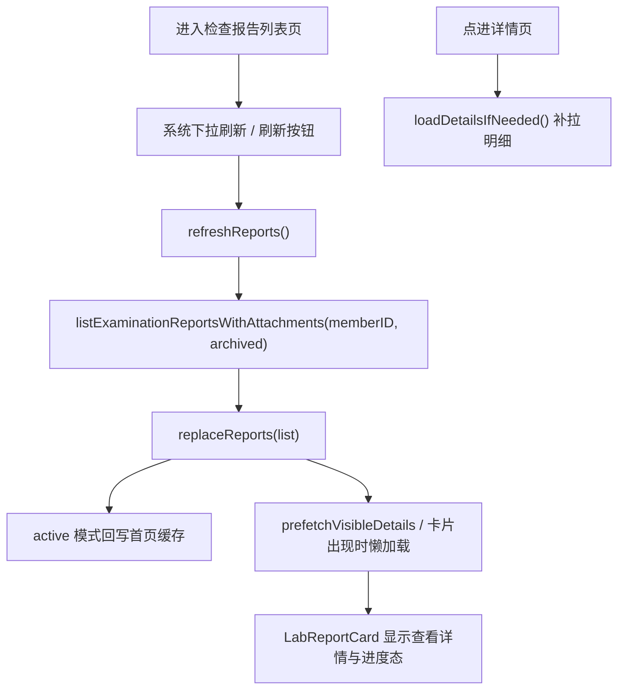

# HOS-MED-UPLOAD-0017 检查报告列表页下拉刷新 iOS 对齐工单

> 状态：部分实现  
> 范围：仅覆盖“医疗检查报告列表页下拉刷新 / 列表回写 / 归档首次加载 / 卡片明细懒加载”这条链路，不改动服务器契约，不改动 iOS 代码。  
> 审计时间：2026-07-25  
> 参考端：`/Users/hua/Documents/project/Reference/LookHealthClient/SparkClient/`  
> 目标端：`/Users/hua/Documents/project/Reference/LookHealthClient/SparkClientHarmonyOS/`  
> 关联结论：鸿蒙端已经具备检查报告列表刷新能力、首页缓存回写能力、明细懒加载能力和详情页补拉明细能力，但交互入口仍是“刷新按钮”，不是 iOS 同款系统下拉刷新，需要补齐页面手势与状态组织上的同构性。

## 1. 对标范围与结论

### 1.1 本工单要解决的核心问题

本工单只对齐以下四件事：

1. iOS 列表页的系统下拉刷新
2. 刷新后只更新检查报告摘要和附件，不主动拉明细
3. active 模式下把刷新结果回写首页 completeData 缓存
4. 归档模式首次进入时主动拉一次，而不是依赖下拉刷新

这里最容易混淆的是“列表刷新”和“卡片明细懒加载”：

- 列表刷新只更新报告头部列表
- 明细懒加载是每个 `LabReportCard` 出现后单独拉取
- 详情页补拉明细是另一条独立的加载链路

### 1.2 iOS 端真实实现

iOS 端的关键特征是：

1. `ScrollView` 上直接挂 `.refreshable`
2. `refreshReports()` 只调 `listExaminationReportsWithAttachments`
3. 刷新结果通过 `viewModel.replaceReports(refreshedReports)` 替换列表缓存
4. active 模式下通过 `onReportsUpdated` 回写首页 `completeData.examinationReports`
5. `LabReportCard` 的 `medExamDetails` 仍由卡片出现时懒加载，不跟随下拉刷新一起拉

### 1.3 鸿蒙端真实实现

鸿蒙端已经具备对应业务能力，但交互入口不同：

1. `ExaminationReportsListPage.ets` 使用右上角「刷新」文字按钮
2. `refreshReports()` 已调用 `listExaminationReportsWithAttachments`
3. active 模式下通过 `HomeMedicalRouteSupport.patchExaminationReports()` 回写首页缓存
4. `ExaminationDetailLazyLoadController` 负责卡片明细懒加载
5. `ExaminationReportDetailPage.ets` 负责详情页的明细补拉

### 1.4 结论

鸿蒙当前并不是“没有刷新”，而是：

- 数据刷新链路已具备
- 状态回写链路已具备
- 明细懒加载链路已具备
- 但 UI 入口仍不是 iOS 的系统下拉刷新手势

因此本工单的重点不是重做数据接口，而是把列表页交互和状态语义补齐到 iOS 风格。

## 2. 华为端目录设计

### 2.1 iOS 端真实目录

```text
SparkClient/SparkClient/Projects/Features/Home/Presentation/MedicalLists/ExaminationReports/
├── ExaminationReportsListPage.swift
├── LabReportCard.swift
├── ExaminationReportDetailPage.swift
└── ...

SparkClient/SparkClient/Projects/Features/Home/Presentation/MedicalLists/Shared/
├── MedicalAttachmentComponents.swift
└── ...

SparkClient/SparkClient/Projects/Features/Home/Presentation/
└── HomeMedicalRouteSupport.swift
```

### 2.2 鸿蒙端当前目录

```text
SparkClientHarmonyOS/entry/src/main/ets/Projects/Features/Home/Presentation/MedicalLists/ExaminationReports/
├── ExaminationReportsListPage.ets
├── LabReportCard.ets
├── ExaminationReportDetailPage.ets
├── ExaminationReportSummaryDetailPage.ets
├── ExaminationReportCategory.ets
├── ExaminationReportDetailSupport.ets
├── ExaminationReportServerMutationService.ets
└── ExaminationReportDraftMapping.ets

SparkClientHarmonyOS/entry/src/main/ets/Projects/Features/Home/Presentation/
├── HomeMedicalRouteSupport.ets
└── HomeViewModel.ets
```

### 2.3 目录设计上仍未完全对齐的地方

| iOS 职责 | 鸿蒙现状 | 建议补齐方向 |
| --- | --- | --- |
| `ScrollView + .refreshable` | 当前是右上角「刷新」按钮触发 `refreshReports()` | 若要严格对齐 iOS，需要补系统下拉刷新手势 |
| 列表刷新逻辑 | 已有 `refreshReports()` | 保持逻辑不变，只调整入口和状态组织 |
| 首页缓存回写 | 已有 `HomeMedicalRouteSupport.patchExaminationReports()` | 已对齐 |
| 卡片明细懒加载 | 已有 `ExaminationDetailLazyLoadController` | 已对齐 |
| 详情页补拉明细 | 已有 `ExaminationReportDetailPage.loadDetailsIfNeeded()` | 已对齐 |

## 3. 分层职责与请求链路

### 3.1 iOS 的职责拆分

| 层级 | iOS 文件 | 职责 |
| --- | --- | --- |
| 列表 UI | `ExaminationReportsListPage.swift` | 承载 `.refreshable` 和列表渲染 |
| 刷新逻辑 | 同文件 `refreshReports()` | 只拉摘要列表和附件 |
| 数据 API | `MedicalQueryAPI.swift` | `listExaminationReportsWithAttachments()` |
| 回写首页缓存 | `HomeMedicalRouteSupport.swift` | 把 active 刷新结果写回 `completeData.examinationReports` |
| 明细懒加载 | `MedExamDetailLazyLoadViewModel.swift` | `loadDetailsIfNeeded()` |
| 详情页补拉 | `ExaminationReportDetailPage.swift` | `.task + loadDetailsIfNeeded()` |

### 3.2 鸿蒙当前职责拆分

| 层级 | 鸿蒙文件 | 当前状态 |
| --- | --- | --- |
| 列表 UI | `ExaminationReportsListPage.ets` | 已实现，但入口是刷新按钮 |
| 刷新逻辑 | `refreshReports()` | 已实现 |
| 数据 API | `SparkMedicalQueryAPI.listExaminationReportsWithAttachments()` | 已实现 |
| 回写首页缓存 | `HomeMedicalRouteSupport.patchExaminationReports()` | 已实现 |
| 明细懒加载 | `ExaminationDetailLazyLoadController.loadDetailsIfNeeded()` | 已实现 |
| 详情页补拉 | `ExaminationReportDetailPage.ets` | 已实现 |

### 3.3 目标请求链路



### 3.4 当前偏差

鸿蒙现在与 iOS 的核心偏差不是数据，而是入口语义：

1. iOS 是用户在列表区域下拉触发刷新
2. 鸿蒙是用户点击「刷新」文字按钮
3. iOS 的刷新和列表容器天然绑定
4. 鸿蒙的刷新更像一个显式动作按钮

如果目标是“UI 样式和交互完全对齐 iOS”，这部分必须补成手势式刷新，不只是保留按钮。

## 4. 核心关键技术与实现方案

### 4.1 iOS 关键代码示例

#### 4.1.1 列表页系统下拉刷新

```swift
.refreshable {
    await refreshReports()
}
```

这说明 iOS 的刷新入口是容器能力，不是按钮。

#### 4.1.2 刷新逻辑只拉摘要

```swift
private func refreshReports() async {
    guard memberID > 0 else {
        logger.warning("检查报告列表下拉刷新跳过：缺少成员 ID", module: .home)
        return
    }

    do {
        let refreshedReports = try await medicalQueryAPI.listExaminationReportsWithAttachments(
            memberID: memberID,
            archived: archiveMode.query
        )
        viewModel.replaceReports(refreshedReports)
    } catch {
        notificationClient.error(...)
    }
}
```

这段说明刷新时不应该顺带拉明细。  
明细仍然留给卡片懒加载和详情页补拉。

#### 4.1.3 首页缓存回写

```swift
onExaminationReportsUpdated: { reports in
    homeViewModel.updateMedicalCompleteData { $0.examinationReports = reports }
},
```

这说明 active 模式下的刷新，不只是更新本页列表，还要同步首页缓存。

#### 4.1.4 明细懒加载

```swift
.task {
    onLoadDetails(report.id)
}
```

以及：

```swift
guard reports[index].medExamDetails == nil else { return }
```

这说明 iOS 明确把“列表刷新”和“卡片明细加载”拆成两个阶段。

### 4.2 鸿蒙关键代码示例

#### 4.2.1 刷新入口

```ts
Text('刷新')
  .fontSize(14)
  .fontColor('#0A84FF')
  .onClick(() => {
    this.refreshReports();
  })
```

鸿蒙当前确实能刷新，但入口是显式按钮，不是系统下拉。

#### 4.2.2 刷新逻辑

```ts
private async refreshReports(): Promise<void> {
  const query = this.medicalQuery;
  const homeVm = this.homeVm;
  if (!query || !homeVm) {
    return;
  }
  const memberID = this.memberID();
  if (memberID <= 0) {
    this.errorText = '未选中成员';
    return;
  }
  this.refreshing = true;
  this.errorText = '';
  const archived = medicalArchiveQueryForMode(this.archiveMode);
  const canPatch = this.archiveMode === MedicalArchiveListMode.ACTIVE;
  try {
    const list = await query.listExaminationReportsWithAttachments(memberID, archived);
    this.reports = list;
    this.ensureController(list);
    if (canPatch) {
      HomeMedicalRouteSupport.patchExaminationReports(homeVm, list);
    }
    this.prefetchVisibleDetails();
  } catch (e) {
    this.errorText = `${e}`;
  } finally {
    this.refreshing = false;
  }
}
```

这段已经和 iOS 的刷新业务基本一致，只差交互容器和视觉语义。

#### 4.2.3 首页缓存回写

```ts
static patchExaminationReports(
  homeVm: HomeViewModel,
  reports: RemoteExaminationReportWithAttachments[]
): void {
  homeVm.updateMedicalCompleteData((data) => {
    data.examinationReports = reports;
  });
}
```

这说明 active 刷新结果会写回首页缓存，和 iOS 的设计一致。

#### 4.2.4 明细懒加载

```ts
ctrl.loadDetailsIfNeeded(list[i].id).then(() => {
  this.syncLoadingIds();
  this.tick += 1;
});
```

以及：

```ts
guard reports[index].medExamDetails == nil else { return }
```

鸿蒙和 iOS 在明细懒加载语义上是对齐的。

#### 4.2.5 详情页补拉

```ts
await this.loadDetailsIfNeeded();
```

鸿蒙详情页同样是独立补拉，不依赖列表下拉刷新。

### 4.3 需要补齐的关键能力

如果要严格对齐 iOS，本工单建议补以下能力：

1. 把 `ExaminationReportsListPage.ets` 的「刷新」按钮改成系统下拉刷新
2. 保留现有 `refreshReports()` 逻辑，不改数据接口
3. 列表页刷新时只拉摘要和附件，不把 `medExamDetails` 混进刷新链路
4. active 模式继续回写首页缓存，保持现状
5. 归档模式首次进入时仍主动拉一次，不依赖下拉刷新

## 5. 接口契约与数据模型

### 5.1 iOS 关键模型

- `RemoteExaminationReportWithAttachments`
- `MedicalQueryAPI.listExaminationReportsWithAttachments`
- `MedExamDetailLazyLoadViewModel`
- `ExaminationReportDetailPage`
- `HomeMedicalRouteSupport`

### 5.2 鸿蒙关键模型

- `RemoteExaminationReportWithAttachments`
- `SparkMedicalQueryAPI.listExaminationReportsWithAttachments`
- `ExaminationDetailLazyLoadController`
- `ExaminationReportsListPage`
- `HomeMedicalRouteSupport`

### 5.3 iOS-HarmonyOS 功能对照矩阵

| 能力 | iOS | 鸿蒙 | 结论 |
| --- | --- | --- | --- |
| 下拉刷新入口 | `.refreshable` | 刷新按钮 | 逻辑对齐，交互未对齐 |
| 刷新列表数据 | `refreshReports()` | `refreshReports()` | 已对齐 |
| 列表 API | `listExaminationReportsWithAttachments()` | 同名能力 | 已对齐 |
| 首页缓存回写 | `onReportsUpdated` → `updateMedicalCompleteData` | `HomeMedicalRouteSupport.patchExaminationReports()` | 已对齐 |
| 卡片明细懒加载 | `MedExamDetailLazyLoadViewModel.loadDetailsIfNeeded()` | `ExaminationDetailLazyLoadController.loadDetailsIfNeeded()` | 已对齐 |
| 详情页补拉明细 | `.task + loadDetailsIfNeeded()` | `ExaminationReportDetailPage.ets` | 已对齐 |

## 6. 页面 UI 与项目架构建议

### 6.1 推荐的鸿蒙页面职责边界

| 层级 | 应承担的职责 | 不建议承担的职责 |
| --- | --- | --- |
| `ExaminationReportsListPage.ets` | 列表容器、下拉刷新、筛选、搜索、列表渲染 | 具体 API 业务分支散落在各个卡片里 |
| `ExaminationDetailLazyLoadController` | 明细懒加载 | 列表刷新 |
| `HomeMedicalRouteSupport.ets` | 首页缓存回写 | UI 展示 |
| `ExaminationReportDetailPage.ets` | 详情页补拉和编辑入口 | 列表刷新 |

### 6.2 UI 样式建议

1. 优先补系统下拉刷新手势，而不是只保留刷新按钮
2. 刷新态建议用列表级 loading，而不是破坏现有筛选 chip 布局
3. active / archived 两种模式要继续保持不同的缓存语义
4. 卡片明细加载态建议继续沿用 `LabReportCard` 的现有进度样式
5. 刷新失败提示建议保持页面级轻提示，不中断列表浏览

## 7. 实施拆分与验收

### 7.1 建议拆分

1. 先补列表容器下拉刷新手势
2. 再保持 `refreshReports()` 的数据逻辑不变
3. 然后验证 active 回写首页缓存
4. 最后补归档模式首次进入刷新和明细懒加载一致性

### 7.2 验收标准

| 验收项 | 期望结果 |
| --- | --- |
| 列表页交互 | 用户在检查报告列表页可通过下拉刷新触发数据更新 |
| 刷新数据范围 | 只更新摘要列表和附件，不把明细混入刷新链路 |
| active 回写 | 刷新后首页 `completeData.examinationReports` 同步更新 |
| archived 首次加载 | 归档模式进入后主动刷新一次 |
| 明细懒加载 | `medExamDetails` 仍然按卡片出现时单独加载 |
| 详情页补拉 | 从列表进入详情页仍可独立补拉缺失明细 |

### 7.3 最小回归用例

建议至少覆盖：

1. active 模式下拉刷新成功
2. active 模式下拉刷新失败提示
3. archived 模式首次进入自动刷新
4. 列表刷新后首页缓存同步
5. 卡片出现时明细懒加载
6. 详情页打开后补拉明细

## 8. 风险与待确认项

### 8.1 风险

1. 如果只把“刷新按钮”当成已对齐，会忽略 iOS 系统下拉刷新的交互语义
2. 如果把明细懒加载和列表刷新混成一条链路，后续会造成数据重复请求
3. 如果只看 active 模式，容易漏掉 archived 首次加载的独立语义

### 8.2 待确认项

1. 鸿蒙是否要求严格实现系统下拉刷新手势，还是保留按钮但补充下拉入口
2. 刷新失败时是否要和 iOS 一样使用页面级通知而不是局部文本提示
3. archived 模式是否要保留首次进入自动刷新的一次性加载行为

### 8.3 本工单最终判断

鸿蒙端在检查报告列表刷新这件事上，业务数据链路和缓存回写都已经具备，但交互入口与 iOS 仍不完全一致。  
**建议把本工单定位为：刷新逻辑已实现，待补齐系统下拉刷新手势与列表容器交互同构的对齐工单。**
