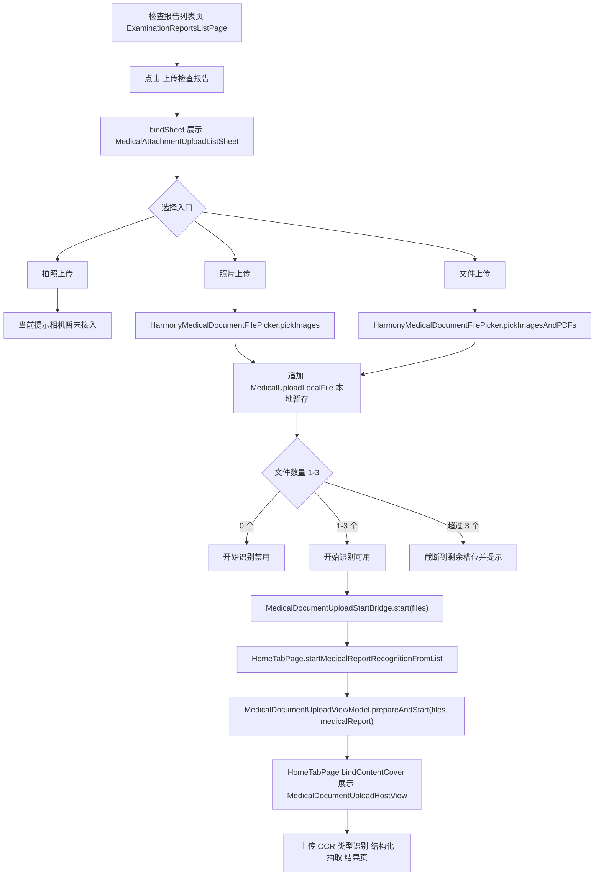

# HOS-MED-UPLOAD-0018 检查报告列表上传 Sheet iOS 对齐工单

## 1. 对标范围与结论

本工单对齐 iOS `MedicalAttachmentUploadListSheet.swift` 在检查报告列表页的轻量上传入口，HarmonyOS 已新增独立 `MedicalAttachmentUploadListSheet.ets`，并接入 `ExaminationReportsListPage.ets` 底部「上传检查报告」按钮。

参考 iOS 源码位置：

| iOS 文件 | 结构职责 | HarmonyOS 对应 |
| --- | --- | --- |
| `SparkClient/SparkClient/Projects/Features/Home/Presentation/MedicalLists/Shared/MedicalAttachmentUploadListSheet.swift` | `MedicalDocumentKind` 上传配置、`MedicalListBottomActionBar`、`MedicalAttachmentUploadListSheet`、`MedicalAttachmentPhotosPickerBridge` | `MedicalDocumentKind.ets` 上传配置、`MedicalAttachmentUploadListSheet.ets`、列表页底部 `bindSheet` |
| `SparkClient/SparkClient/Projects/Features/Home/Presentation/MedicalLists/ExaminationReports/ExaminationReportsListPage.swift` | `MedicalListBottomActionBar(documentKind: .medicalReport, onUploadConfirmed:)`，确认后 `prepareAndStart(files:kind:)` | `ExaminationReportsListPage.ets` 点击按钮弹 Sheet，确认后通过 `MedicalDocumentUploadStartBridge` 触发 VM |
| `SparkClient/SparkClient/Projects/Features/MedicalDocumentUpload/Presentation/MedicalDocumentUploadViewModel.swift` | `prepareAndStart(files:kind:)` 重置 VM、注入文件与类型并打开识别流程 | `MedicalDocumentUploadViewModel.ets` 新增 `prepareAndStart(files, kind)` |
| `SparkClient/SparkClient/Projects/Features/MedicalDocumentUpload/Presentation/MedicalDocumentUploadHostView.swift` | 全屏识别 Host | 已有 `MedicalDocumentUploadHostView.ets`，由 `HomeTabPage.ets` 的 `bindContentCover` 统一展示 |
| `SparkClient/SparkClient/Projects/App/Resources/zh-Hans.lproj/Localizable.strings` | 检查报告 Sheet 文案 | ArkTS 先使用代码内中文常量，文案与 iOS fallback 对齐 |

结论：检查报告入口主流程已对齐。点击「上传检查报告」会弹出 Sheet；Sheet 显示三入口、空态、缩略图三列、本地暂存、清空、删除单项、开始识别禁用态；相册/文件选择复用现有 `HarmonyMedicalDocumentFilePicker`；确认后调用现有全屏上传识别流程。

## 2. 华为端目录设计

新增/修改目录结构：

```text
SparkClientHarmonyOS/entry/src/main/ets/
├── Projects/App/
│   └── HomeTabPage.ets                                      # 注册列表页上传启动桥，打开全屏识别 Host
├── Projects/Features/Home/Presentation/MedicalLists/
│   ├── ExaminationReports/ExaminationReportsListPage.ets    # 底部上传按钮弹 Sheet
│   └── Shared/MedicalAttachmentUploadListSheet.ets          # 新增：列表页轻量上传 Sheet
└── Projects/Features/MedicalDocumentUpload/
    ├── Domain/MedicalDocumentKind.ets                       # 扩展上传配置
    └── Presentation/
        ├── MedicalDocumentUploadStartBridge.ets             # 新增：二级页到 HomeTab 全屏 Host 的桥
        └── MedicalDocumentUploadViewModel.ets               # 新增 prepareAndStart(files, kind)
```

本工单没有修改 `MedicalDocumentUploadHostView.ets`、`MedicalDocumentUploadPickingView.ets` 和底层上传/识别 UseCase。Sheet 是列表页的轻量选取入口；Host/Picking 仍是确认后的上传识别全屏流程。

## 3. 分层职责与请求链路

页面跳转/弹窗流程：



分层说明：

| 层级 | 代码位置 | 职责 |
| --- | --- | --- |
| 列表页 | `ExaminationReportsListPage.ets` | 控制 Sheet 展示、确认后交给上传启动桥 |
| Sheet UI | `MedicalAttachmentUploadListSheet.ets` | 三入口、本地暂存、数量限制、缩略图和底部操作 |
| 系统选择能力 | `HarmonyMedicalDocumentFilePicker.ets` / `MedicalDocumentFilePicker.ets` | 封装 `PhotoViewPicker`、`DocumentViewPicker`，统一返回 `MedicalUploadLocalFile` |
| 跨层启动 | `MedicalDocumentUploadStartBridge.ets` | 将二级列表页确认事件传回持有全屏 Cover 的 HomeTab |
| 上传识别状态机 | `MedicalDocumentUploadViewModel.ets` | `prepareAndStart` 注入文件和类型，进入现有上传识别管线 |
| 全屏流程 | `MedicalDocumentUploadHostView.ets` | 展示 picking/processing/result，维持既有识别体验 |

## 4. 核心关键技术与实现方案

`MedicalDocumentKind.ets` 新增 `MedicalAttachmentUploadKindConfig` 和 `medicalAttachmentUploadConfig(kind)`。检查报告配置为：

| 配置项 | medicalReport 值 | iOS 对齐点 |
| --- | --- | --- |
| `fileNamePrefix` | `medical_report` | `attachmentUploadFileNamePrefix` |
| `maxFileCount` | `3` | `attachmentUploadMaxFileCount` |
| `cameraMaxCaptureCount` | `3` | `attachmentUploadReportCameraMaxCaptureCount` |
| `sheetTitle` | `选择检查报告图片` | `attachmentUploadSheetTitle` |
| `headerTitle` | `选择上传方式` | `attachmentUploadSheetHeaderTitle` |
| `headerSubtitle` | `可一次选择多张检查、检验或影像报告图片，确认后开始识别。` | `attachmentUploadSheetHeaderSubtitle` |
| `emptyTitle` | `尚未选择文件` | `attachmentUploadSheetEmptyTitle` |
| `emptySubtitle` | `可拍照、从相册选择或上传 PDF/图片` | `attachmentUploadSheetEmptySubtitle` |
| `autoPresentation` | `CAMERA` | iOS 打开 Sheet 后 0.5 秒自动弹相机 |

`MedicalAttachmentUploadListSheet.ets` UI 结构：

```text
┌────────────────────────────┐
│ 取消     选择检查报告图片      │
├────────────────────────────┤
│ 选择上传方式                  │
│ 可一次选择多张检查、检验...      │
│ [拍照上传] [照片上传] [文件上传] │
│                              │
│ 空态 或 3 列缩略图网格          │
├────────────────────────────┤
│ [清空]              [开始识别] │
└────────────────────────────┘
```

选择规则：

| 入口 | 当前 HarmonyOS 行为 | 复用能力 |
| --- | --- | --- |
| 拍照上传 / 即时拍摄 | 展示 toast：`拍照上传暂未接入，请先使用相册或文件上传` | 未发现已有相机 picker/runtime，暂不平行发明 |
| 照片上传 / 选择相册 | 调用 `HarmonyMedicalDocumentFilePicker.pickImages(context, remainingSlots)` | 复用 `PhotoViewPicker` |
| 文件上传 / PDF/图片 | 调用 `HarmonyMedicalDocumentFilePicker.pickImagesAndPDFs(context, remainingSlots)` | 复用 `DocumentViewPicker` |

华为官方资料参考：

| 官方资料 | URL | 本次结论 |
| --- | --- | --- |
| Core File Kit 选择用户文件 | https://developer.huawei.com/consumer/cn/doc/harmonyos-guides/select-user-file | Picker 会拉起系统预置选择器，由用户完成授权/选择 |
| `ohos.file.picker` API 参考 | https://developer.huawei.com/consumer/cn/doc/harmonyos-references-V13/js-apis-file-picker-V13 | 当前工程已有 `DocumentViewPicker` 封装，继续复用 |
| PhotoPicker/PhotoViewPicker 指南 | https://developer.huawei.com/consumer/cn/doc/harmonyos-guides/component-guidelines-photoviewpicker | 后续若升级新版照片选择器，应在 `MedicalDocumentFilePicker.ets` 统一替换 |

## 5. 接口契约与数据模型

本工单不新增后端 API。确认后沿用现有上传识别管线：

```text
MedicalUploadLocalFile
  -> toAttachment()
  -> MedicalAttachmentInput[]
  -> MedicalDocumentUploadViewModel.prepareAndStart(files, MedicalDocumentKind.MEDICAL_REPORT)
  -> UploadMedicalDocumentFilesUseCase
  -> OCR / 类型识别 / 结构化抽取 / 结果页
```

字段级对齐：

| iOS `MedicalUploadLocalFile` 概念 | HarmonyOS 字段 | 类型 | 来源 | 消费位置 |
| --- | --- | --- | --- | --- |
| 本地标识 | `localId` | `string` | Picker 生成的 `previewId` | 缩略图 key、删除、上传关联 |
| 本地 URL/URI | `uri` | `string` | Photo/Document Picker URI | 预览、上传请求 sourceUri |
| 展示名 | `displayName` | `string` | URI 文件名或 fallback | 缩略图、文件上传 originalName |
| MIME | `mimeType` | `string` | picker 或后缀推断 | 格式判断、上传请求 mimeType |
| 文件大小 | `sizeBytes` | `number` | 已上传远端记录或后续补齐 | 当前 Sheet 不强依赖 |
| MD5 | `fileMd5` | `string` | 上传阶段补齐 | 断点/远端文件校验 |
| 远端文件 | `remoteFile` | `ManagedFileRecord?` | 上传完成后 | OCR 输入、附件绑定 |
| OCR 文本 | `ocrText` | `string` | OCR 阶段补齐 | 类型识别/结构化抽取 |

## 6. iOS-HarmonyOS 功能对照矩阵

| 功能点 | iOS 状态 | HarmonyOS 状态 | 说明 |
| --- | --- | --- | --- |
| 独立 Sheet 组件 | 已实现 | 已实现 | 新增 `MedicalAttachmentUploadListSheet.ets` |
| 检查报告标题 | `选择检查报告图片` | 已对齐 | 代码内中文常量 |
| 三入口 tile | 已实现 | 已实现 | 拍照、照片、文件均可见 |
| 相册选择 | PhotosPicker bridge | 已实现 | 复用 `pickImages` |
| 文件选择 | fileImporter 图片/PDF | 已实现 | 复用 `pickImagesAndPDFs` |
| 相机入口 | 自定义/系统相机 | 部分实现 | 入口可见且 0.5 秒自动触发，但当前降级为 toast |
| 最多 3 个文件 | 已实现 | 已实现 | 超出截断并提示 |
| 空态 | 已实现 | 已实现 | 标题/副标题对齐 |
| 三列缩略图 | 已实现 | 已实现 | 复用 `MedicalDocumentFilePreviewSquareCard` |
| 删除单个文件 | 已实现 | 已实现 | 按 `localId` 删除 |
| 清空 | 已实现 | 已实现 | 底部按钮 |
| 未选择禁用开始识别 | 已实现 | 已实现 | `canStart()` |
| 确认进入识别流程 | `prepareAndStart(files:kind:)` | 已实现 | 新增 ArkTS 等价方法 |

## 7. 示例工程与官方文档参考结论

本地复用优先级：

| 本地实现 | 可复用内容 | 不复制/不改动内容 |
| --- | --- | --- |
| `MedicalDocumentUploadPickingView.ets` | 选文件调用方式、缩略图卡片、底部操作语义 | 不复用全屏 picking 页面作为列表轻量 Sheet |
| `HarmonyMedicalDocumentFilePicker.ets` | 统一返回 `MedicalUploadLocalFile` | 不在 Sheet 内直接操作底层 picker API |
| `MedicalDocumentFilePicker.ets` | `PhotoViewPicker` / `DocumentViewPicker` 封装、图片/PDF 后缀限制 | 暂不在本工单升级 deprecated API |
| `MedicalDocumentUploadHostView.ets` | 确认后的全屏识别流程 | 不新增第二个 Host |

官方资料结论：HarmonyOS 选择用户文件推荐通过系统 Picker 完成，当前工程已有封装且构建通过；相机能力未在现有医疗上传模块中发现可复用实现，因此本工单不新增底层 Camera Kit 实现，避免引入权限、生命周期和文件落盘的新风险。

## 8. 实施拆分与验收

已完成代码改动：

| 文件 | 改动 |
| --- | --- |
| `entry/src/main/ets/Projects/Features/Home/Presentation/MedicalLists/Shared/MedicalAttachmentUploadListSheet.ets` | 新增 Sheet UI、三入口、本地暂存、缩略图、清空、删除、开始识别 |
| `entry/src/main/ets/Projects/Features/MedicalDocumentUpload/Domain/MedicalDocumentKind.ets` | 新增上传配置模型并覆盖 `medicalReport` |
| `entry/src/main/ets/Projects/Features/Home/Presentation/MedicalLists/ExaminationReports/ExaminationReportsListPage.ets` | 底部按钮弹 Sheet，确认后启动上传识别 |
| `entry/src/main/ets/Projects/Features/MedicalDocumentUpload/Presentation/MedicalDocumentUploadStartBridge.ets` | 新增列表页到 HomeTab 全屏 Host 的启动桥 |
| `entry/src/main/ets/Projects/App/HomeTabPage.ets` | 注册启动桥，转换本地文件并打开 full screen Host |
| `entry/src/main/ets/Projects/Features/MedicalDocumentUpload/Presentation/MedicalDocumentUploadViewModel.ets` | 新增 `prepareAndStart(files, kind)` |

验收清单：

- [x] 点击检查报告列表「上传检查报告」弹出 `MedicalAttachmentUploadListSheet`。
- [x] Sheet 显示三种入口：拍照上传、照片上传、文件上传。
- [x] 未选择文件时「开始识别」禁用。
- [x] 选择 1-3 个图片/PDF 后展示三列缩略图。
- [x] 支持删除单个缩略图。
- [x] 支持清空全部。
- [x] 超过 3 个时只追加剩余槽位并提示。
- [x] 确认后回传本地文件列表，进入 `prepareAndStart(files, .MEDICAL_REPORT)`。
- [x] 不破坏既有 `MedicalDocumentUploadHostView` 全屏流程。
- [x] `bash scripts/assemble_hap.sh` 构建成功。

验证命令：

```bash
cd /Users/hua/Documents/project/Reference/LookHealthClient/SparkClientHarmonyOS
bash scripts/assemble_hap.sh
```

验证结果：`BUILD SUCCESSFUL in 19 s 766 ms`。构建日志仍有既有警告，包括第三方 `@aliyun/oss`、`lv-markdown-in` 的 ArkTS warning、资源名冲突、部分 deprecated picker/toast API；本工单新增代码未造成编译错误。

## 9. 风险与待确认项

差异点及原因：

| 差异 | iOS | HarmonyOS 当前 | 原因/后续 |
| --- | --- | --- | --- |
| 相机 | 打开 Sheet 后 0.5 秒自动弹相机，可拍照产出文件 | 0.5 秒自动触发相机入口，但提示「拍照上传暂未接入」 | 现有 HarmonyOS 医疗上传模块未发现相机 picker/runtime；不在本工单平行新增 Camera Kit |
| 文案本地化 | `Localizable.strings` | 代码内中文常量 | 工程医疗上传部分已有大量中文常量；后续可统一迁移到资源文件 |
| 图标 | iOS SF Symbol `camera/photo/doc` | 使用工程已验证存在的系统 symbol 近似 | 避免引入未知 symbol 资源编译风险 |
| Picker API | PhotosPicker / fileImporter | 复用现有 `PhotoViewPicker` / `DocumentViewPicker` 封装 | 构建日志提示部分 API deprecated，后续应统一升级底层 `MedicalDocumentFilePicker.ets` |

待确认项：

- 是否已有其他模块的真实相机能力可迁入医疗上传入口；若有，应接入 `MedicalAttachmentUploadListSheet.presentCamera()`。
- 是否要把本次 Sheet 文案迁入 `AppScope/resources/*/string.json`，与 iOS `Localizable.strings` 建立 key 级映射。
- 真机上需补验：相册/文件 Picker 返回 URI 的可预览性、上传服务对 `datashare://` 或 `file://` URI 的读取稳定性、OCR 对 PDF 输入的表现。
