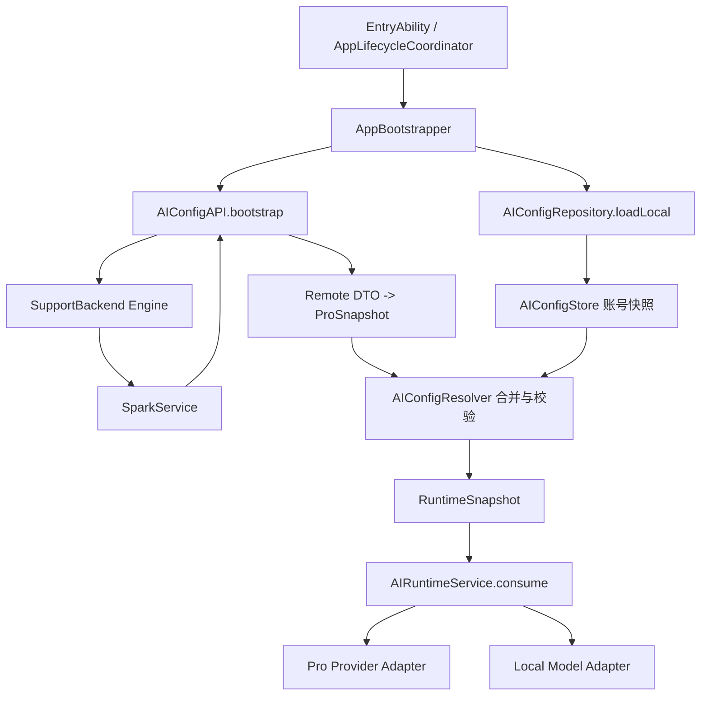
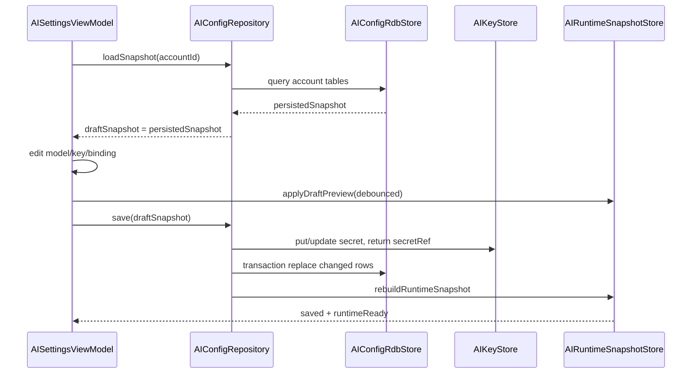

# AI 配置生命周期与本地、Pro 统一消费

> 本文是 HarmonyOS 端 AI 设置、远端 Pro 配置、本地模型和统一消费层的实施基线。iOS 参考行为见 [AI 配置生命周期与本地、Pro 统一消费](../../../SparkClient/总领文档/AI 设置与本地模型/AI 配置生命周期与本地、Pro 统一消费.md)。后台契约以 `SparkService` 实际代码为准；本文只描述已核验代码、明确目标和验收边界。

## 1. 对标范围与结论

### 1.1 对标范围

| 范围 | iOS 参考能力 | HarmonyOS 当前证据 | 结论 |
| --- | --- | --- | --- |
| 本地配置 | 账号隔离的本地快照、Provider、模型、场景绑定、偏好和本地 GGUF 元数据 | `Core/AI/Domain/AIConfigModels.ets`、`Core/AI/Infrastructure/AIConfigRdbStore.ets`、`AIConfigSchema.ets`、`LocalModelFileService.ets` 已存在 | 部分实现，需事务和文件完整性收口 |
| Pro 配置 | SparkService bootstrap、ETag、revision、Pro 场景和小任务 | `AIConfigAPI.ets` 已接 bootstrap 解码入口 | 部分对齐 |
| 统一消费 | 本地/Pro 解析为 `AIResolvedConfig`，运行时只依赖统一模型 | `Core/AI/Application/AIConfigResolver.ets`、`Core/AI/Runtime/AIRuntimeService.ets`、`AIProviderAdapter.ets`、`OpenAICompatibleProviderAdapter.ets` 已存在 | 部分实现，本地 GGUF Adapter 仍为占位 |
| 账号生命周期 | 登录后预热、账号切换隔离、登出清理、鉴权失效回退 | `AccountSessionRuntime.ets`、`AppLifecycleCoordinator.ets`、`AppBootstrapper.ets` 已接入账号激活、seed、Runtime、远端刷新和失效清理 | 部分实现，需补全请求取消、模型句柄和文件清理 |
| 后端交互 | wrapped response、Bearer、ETag、重试、串行写入、试用和连通性测试 | `SupportBackend`、Engine、Token、ETag、Retry、Serial 已落地 | 部分对齐，需真实联调 |

### 1.2 结论

HarmonyOS 端已落地“本地快照优先、远端配置刷新、统一解析后消费”的主链路。API Key、Token 和模型文件不进入普通 Preferences；Pro 配置不能直接被页面或业务模块消费，必须经过 `AIConfigRepository` 和 `AIConfigResolver`。当前交付状态是：本地 RDB/seed、HUKS secretRef、Pro overlay、Resolver、远程文本 Provider 和聚合设置页已有实现；完整设置子页面、RDB 原子事务、HUKS 失败安全收口、GGUF 下载/推理和真机联调仍未完成。

## 2. 华为端目录设计

### 2.1 当前代码与目标目录

```text
entry/src/main/ets/
├── App/
│   ├── AppBootstrapper.ets                         # 当前：账号级 AI bootstrap
│   └── AppContainer.ets                            # 当前：组合根
├── Core/
│   ├── AI/
│   │   ├── Domain/AIConfigModels.ets               # 当前：本地/Pro/统一模型
│   │   ├── Application/AIConfigRepository.ets      # 当前：生命周期与刷新
│   │   ├── Application/AIConfigResolver.ets        # 当前：场景解析
│   │   ├── Infrastructure/AIConfigStore.ets        # 当前：快照存储抽象
│   │   ├── Infrastructure/AIConfigRdbStore.ets    # 当前：RDB 实现
│   │   ├── Infrastructure/AIKeyStore.ets           # 当前：HUKS/API Key 封装
│   │   └── Runtime/AIRuntimeService.ets             # 当前：统一消费
│   └── Networking/SupportBackend.ets                # 当前：唯一网络组合根
├── Foundation/Security/                             # 当前：Token/HUKS/日志
└── Projects/Core/Networking/API/AI/AIConfigAPI.ets  # 当前：AI 后端接口
```

### 2.2 分层规则

| 层 | 职责 | 禁止事项 |
| --- | --- | --- |
| AISettings Presentation | 编辑草稿、展示状态、触发保存/刷新/试用 | 不能直接构造 `NetworkRequest` 或读取 API Key |
| AIConfigRepository | 读取快照、调用 SparkService、合并 revision、发布运行时快照 | 不能把未校验 DTO 直接暴露给业务 |
| AIConfigStore | 账号命名空间、版本化快照、原子写入、迁移 | 不能持久化明文 API Key |
| AIConfigResolver | 按场景、来源、默认模型和能力解析 | 不能修改本地或远端源数据 |
| AIRuntimeService | 接收通用请求，选择 Provider 或本地模型，输出统一响应/事件 | 不能让调用方依赖 Pro DTO 或本地存储字段 |
| AIConfigAPI/SupportBackend | HTTP、鉴权、ETag、重试、错误转换 | 页面不能绕过组合根 |

## 3. 分层职责与请求链路

### 3.1 启动、刷新和消费链路



### 3.2 生命周期状态

| 状态 | 进入条件 | 可消费内容 | 失败处理 |
| --- | --- | --- | --- |
| `empty` | 账号无快照 | 无 | 仅显示配置未准备 |
| `localReady` | 本地快照校验成功 | 本地可用场景 | 后台刷新可异步继续 |
| `refreshing` | 正在请求 bootstrap | 继续使用上一次运行时快照 | GET 可合并，不阻塞已存在消费 |
| `remoteReady` | revision 校验并原子落盘成功 | 本地+Pro 合并结果 | 发布新 runtime |
| `degraded` | 非鉴权网络失败或远端字段不兼容 | 上一次有效快照 | 记录原因，不清空有效配置 |
| `invalidated` | 401、401xx 或会话切换 | 停止账号消费 | 清理账号运行时和敏感凭证，回登录/新账号 |

### 3.3 账号隔离规则

所有快照键、ETag、运行时缓存、模型文件目录和 API Key 引用都必须包含 `accountId`。登录账号切换时先停止旧账号运行时，再切换存储命名空间；登出和服务端鉴权失效时清理 API Key 引用、临时请求和本地模型运行时句柄。模型文件可按产品策略保留公共文件，但不能保留旧账号的启用关系或密钥。

## 4. 核心关键技术与实现方案

### 4.1 本地存储方案

本项目目标正式实现采用 `@kit.ArkData` 的 `relationalStore.RdbStore` 持久化 AI 配置。AI 配置具有 Provider、模型、场景、小任务、模型文件和账号之间的关系，符合 ArkData 关系型数据库的适用场景；不再把完整配置快照放入 Preferences 或 JSON 文件。RDB 保存结构化配置和索引，HUKS 保存 API Key，模型二进制仍位于应用沙箱，数据库只保存模型文件索引。

官方资料明确：RDB 底层基于 SQLite，支持事务、索引、外键、参数化 SQL 和预编译 SQL；默认存在读连接和单写连接，同一时间只能有一个写操作；单条数据建议不超过 2MB，结果集使用完必须 `close()`。因此本功能所有写操作进入同一个 `AIConfigRdbStore` 写队列，prompt、医疗正文和 GGUF 二进制不得写入 RDB。

### 4.1.1 RDB 组合根与初始化

目标代码目录：

```text
entry/src/main/ets/Core/AI/Infrastructure/
├── AIConfigDatabase.ets       # getRdbStore、建库、schema migration、关闭
├── AIConfigRdbStore.ets       # 账号配置 CRUD 和事务
├── AIConfigSchema.ets         # 表名、列名、版本和 DDL
├── AIConfigMappers.ets        # RDB 行 <-> 领域模型
└── AIKeyStore.ets             # HUKS secretRef，不写 RDB
```

`AppContainer` 只创建一个共用 `AppRelationalDatabase`（库名 `spark_client.db`）并注入 `AIConfigRepository`。数据库 Context 必须来自同一个 `UIAbilityContext`，避免因 Context 不同创建出多个同名数据库。建议配置：

```ts
import { relationalStore } from '@kit.ArkData';

const APP_STORE_CONFIG: relationalStore.StoreConfig = {
  name: 'spark_client.db',
  securityLevel: relationalStore.SecurityLevel.S3,
  encrypt: true,
  isReadOnly: false
};
```

> 说明：库为应用本地关系库，后续对话 / 知识库等模块共用同一文件，表以 `ai_*` / `chat_*` / `kb_*` 前缀分区；不再使用 `spark_ai_config.db` 专库名。

首次启动调用 `relationalStore.getRdbStore(context, AI_STORE_CONFIG)`，随后读取 `PRAGMA user_version`。建表、索引、外键和版本号写入必须在 `createTransaction()` 中完成；任一 DDL 失败都 `rollback()`，不得出现半套 schema。数据库异常码 `14800011` 进入受控重建流程：备份可恢复的非敏感配置、删除并重建 RDB、重新导入经过校验的配置，API Key 只通过 HUKS 引用恢复。

### 4.1.2 AI 配置数据库表

数据库名：`spark_client.db`（跨模块共用）。AI 业务表均带 `account_id` 并以 `ai_` 为前缀，主键使用 `TEXT` UUID 或受控字符串，禁止使用 UI 临时索引作为业务主键。

```sql
CREATE TABLE IF NOT EXISTS ai_account_meta (
  account_id INTEGER PRIMARY KEY,
  schema_version INTEGER NOT NULL,
  remote_revision TEXT,
  remote_etag TEXT,
  last_remote_sync_at TEXT,
  sync_state TEXT NOT NULL,
  created_at TEXT NOT NULL,
  updated_at TEXT NOT NULL
);

CREATE TABLE IF NOT EXISTS ai_provider (
  id TEXT NOT NULL,
  account_id INTEGER NOT NULL,
  name TEXT NOT NULL,
  company TEXT NOT NULL,
  kind TEXT NOT NULL,
  request_url TEXT,
  secret_ref TEXT,
  is_enabled INTEGER NOT NULL DEFAULT 1,
  position INTEGER NOT NULL DEFAULT 0,
  source TEXT NOT NULL,
  updated_at TEXT NOT NULL,
  PRIMARY KEY (account_id, id),
  FOREIGN KEY (account_id) REFERENCES ai_account_meta(account_id) ON DELETE CASCADE
);

CREATE TABLE IF NOT EXISTS ai_model (
  id TEXT NOT NULL,
  account_id INTEGER NOT NULL,
  provider_id TEXT NOT NULL,
  name TEXT NOT NULL,
  display_name TEXT NOT NULL,
  base_model_name TEXT,
  model_type TEXT NOT NULL,
  capabilities_json TEXT NOT NULL,
  context_window INTEGER,
  price_tier TEXT,
  is_default INTEGER NOT NULL DEFAULT 0,
  is_enabled INTEGER NOT NULL DEFAULT 1,
  source TEXT NOT NULL,
  updated_at TEXT NOT NULL,
  PRIMARY KEY (account_id, id),
  FOREIGN KEY (account_id, provider_id) REFERENCES ai_provider(account_id, id) ON DELETE CASCADE
);

CREATE TABLE IF NOT EXISTS ai_scenario_binding (
  account_id INTEGER NOT NULL,
  scenario TEXT NOT NULL,
  model_id TEXT NOT NULL,
  temperature REAL,
  max_tokens INTEGER,
  system_provision TEXT,
  is_default INTEGER NOT NULL DEFAULT 0,
  position INTEGER NOT NULL DEFAULT 0,
  enabled INTEGER NOT NULL DEFAULT 1,
  source TEXT NOT NULL,
  updated_at TEXT NOT NULL,
  PRIMARY KEY (account_id, scenario, model_id),
  FOREIGN KEY (account_id, model_id) REFERENCES ai_model(account_id, id) ON DELETE CASCADE
);

CREATE TABLE IF NOT EXISTS ai_small_task (
  account_id INTEGER NOT NULL,
  code TEXT NOT NULL,
  name TEXT NOT NULL,
  brief TEXT,
  prompt TEXT NOT NULL,
  icon TEXT,
  tool_list_json TEXT NOT NULL,
  source TEXT NOT NULL,
  enabled INTEGER NOT NULL DEFAULT 1,
  updated_at TEXT NOT NULL,
  PRIMARY KEY (account_id, code)
);

CREATE TABLE IF NOT EXISTS ai_model_file (
  account_id INTEGER NOT NULL,
  model_id TEXT NOT NULL,
  path TEXT NOT NULL,
  size_bytes INTEGER NOT NULL,
  sha256 TEXT NOT NULL,
  download_state TEXT NOT NULL,
  downloaded_at TEXT,
  error_code TEXT,
  updated_at TEXT NOT NULL,
  PRIMARY KEY (account_id, model_id),
  FOREIGN KEY (account_id, model_id) REFERENCES ai_model(account_id, id) ON DELETE CASCADE
);

CREATE TABLE IF NOT EXISTS ai_preferences (
  account_id INTEGER PRIMARY KEY,
  default_source TEXT NOT NULL,
  allow_network INTEGER NOT NULL DEFAULT 1,
  allow_local_model INTEGER NOT NULL DEFAULT 1,
  selected_provider_id TEXT,
  selected_model_id TEXT,
  updated_at TEXT NOT NULL,
  FOREIGN KEY (account_id) REFERENCES ai_account_meta(account_id) ON DELETE CASCADE
);
```

`capabilities_json`、`tool_list_json` 只保存小型结构化 JSON；查询时映射为 ArkTS 对象，不把 JSON 当作整个数据库替代品。`api_key`、`prompt`、报告正文、图片、音频和 GGUF 内容不进入上述表。

### 4.1.3 索引和约束

```sql
CREATE INDEX IF NOT EXISTS idx_ai_provider_account_enabled
  ON ai_provider(account_id, is_enabled, position);
CREATE INDEX IF NOT EXISTS idx_ai_model_account_provider
  ON ai_model(account_id, provider_id, is_enabled);
CREATE INDEX IF NOT EXISTS idx_ai_binding_account_scenario
  ON ai_scenario_binding(account_id, scenario, enabled, position);
CREATE INDEX IF NOT EXISTS idx_ai_task_account_enabled
  ON ai_small_task(account_id, enabled, code);
CREATE INDEX IF NOT EXISTS idx_ai_file_account_state
  ON ai_model_file(account_id, download_state);
```

业务层还必须校验“每个场景最多一个有效默认模型”。这是跨行规则，不能只依赖 SQLite 普通唯一索引：写入整批远端 binding 后，在同一事务中统计每个 `scenario` 的默认项，超过一个则回滚并进入 `degraded`。

### 4.1.4 Schema 版本与迁移

| 版本 | 内容 | 迁移策略 |
| --- | --- | --- |
| 1 | 账号元数据、Provider、模型、场景绑定、小任务、偏好、模型文件 | 新库建表、索引和外键 |
| 2 | 增加 `remote_etag`、`sync_state` | `ALTER TABLE ai_account_meta ADD COLUMN ...` |
| 3 | 增加 `source`、能力字段和小任务启用状态 | 补默认值；旧数据标记为 `local` |
| 4 | 增加模型文件 sha256、大小和下载状态 | 缺失文件标记 `missing`，不自动认为 ready |

迁移入口采用：`currentVersion = SELECT user_version` → 按版本递增执行迁移 → 每一步校验表/列 → `PRAGMA user_version = targetVersion` → commit。升级失败必须 rollback；不能直接删除数据库。降级只在开发/测试明确允许，生产包不执行破坏性降级。

### 4.1.5 RDB CRUD 规则

| 操作 | ArkData API | 项目实现 |
| --- | --- | --- |
| 读取当前账号配置 | `query()` / `querySql()` | 所有谓词带 `account_id = currentAccountId`；ResultSet `finally` close |
| 保存设置草稿 | `insert()` / `update()` | 只写本地 source；Provider secret 先写 HUKS，再写 `secret_ref` |
| 远端整批替换 | `createTransaction()` + `execute()`/`insert()` | 先删除当前账号的 Pro 行，再批量插入新 revision，成功后更新 meta |
| 删除账号数据 | `delete()` | 事务内删除 meta，由外键级联清理业务表，再删除 HUKS secrets 和模型文件 |
| 查询场景默认 | `RdbPredicates` | `equalTo('account_id', id)`、`equalTo('scenario', scenario)`、`equalTo('is_default', 1)` |
| 复杂合并查询 | 参数化 `querySql()` | SQL 使用 `?` bindArgs，禁止拼接用户输入 |

写入不在页面线程直接执行；Repository 将写任务送入单写队列，同账号顺序执行。单次查询控制在 5000 条以内，AI 配置正常不会达到该规模；小任务或模型目录批量导入按批次处理。

### 4.1.6 Repository 伪代码

```ts
export class AIConfigRdbStore {
  private store?: relationalStore.RdbStore;
  private writeTail: Promise<void> = Promise.resolve();

  async load(accountId: number): Promise<AIConfigSnapshot | undefined> {
    const db = await this.database.open();
    const result = await db.querySql(
      'SELECT ... FROM ai_account_meta WHERE account_id = ?', [accountId]
    );
    try {
      return await this.database.mapSnapshot(accountId, result);
    } finally {
      result.close();
    }
  }

  async replaceRemote(accountId: number, snapshot: ProBootstrapSnapshot, etag?: string): Promise<void> {
    this.writeTail = this.writeTail.then(async () => {
      const db = await this.database.open();
      const tx = await db.createTransaction({});
      try {
        await tx.execute('DELETE FROM ai_scenario_binding WHERE account_id = ?', [accountId]);
        await tx.execute('DELETE FROM ai_provider WHERE account_id = ? AND source = ?', [accountId, 'pro']);
        // 校验默认模型、能力字段和场景后批量插入。
        await this.database.insertProRows(tx, accountId, snapshot);
        await tx.execute(
          'UPDATE ai_account_meta SET remote_revision = ?, remote_etag = ?, sync_state = ?, updated_at = ? WHERE account_id = ?',
          [snapshot.revision, etag ?? '', 'remoteReady', new Date().toISOString(), accountId]
        );
        await tx.commit();
      } catch (err) {
        await tx.rollback();
        throw err;
      }
    });
    return this.writeTail;
  }
}
```

实际 ArkTS 代码需以目标 SDK 24 的 `Transaction` 方法签名复核；伪代码用于固定职责、事务边界和账号条件，不作为可直接编译代码。

| 数据 | 建议位置 | 是否敏感 | 规则 |
| --- | --- | --- | --- |
| `AIConfigSnapshot` | `filesDir/ai-config/{accountId}/snapshot.json` | 否，含引用信息 | 只保存非秘密配置，版本化迁移 |
| API Key | HUKS/安全密钥服务，快照只存 `secretRef` | 是 | 禁止日志、Preferences、普通文件和 DTO 回显 |
| GGUF/本地模型 | `filesDir/ai-models/{modelId}/` | 否，可能含付费资产 | 下载临时文件校验后改名；记录大小、sha256、状态 |
| ETag | `filesDir/network/etag/{accountScope}.json` | 否 | 由现有 `ETagStore` 管理，账号切换清理 |
| 运行时快照 | 内存 `RuntimeSnapshot` | 可能包含 endpoint 引用 | 不落盘；会话失效立即释放 |

### 4.2 本地存储数据模型

#### `AIConfigSnapshot`

| 字段 | ArkTS 类型 | 必填 | 说明 |
| --- | --- | --- | --- |
| `schemaVersion` | `number` | 是 | 本地模型版本，当前建议 `1` |
| `accountId` | `number` | 是 | 账号命名空间，不能从 UI 传入覆盖当前会话 |
| `revision` | `string` | 否 | 最近一次远端成功 revision |
| `source` | `'local' \| 'merged'` | 是 | 快照来源标记 |
| `providers` | `LocalProvider[]` | 是 | 本地 Provider 配置 |
| `models` | `LocalModel[]` | 是 | 本地模型目录 |
| `scenarioBindings` | `LocalScenarioBinding[]` | 是 | 场景到模型的本地绑定 |
| `smallTasks` | `LocalSmallTask[]` | 是 | 本地小任务定义 |
| `preferences` | `AIUserPreferences` | 是 | 默认来源、联网策略、隐私开关 |
| `modelFiles` | `LocalModelFile[]` | 是 | GGUF 文件状态和校验信息 |
| `updatedAt` | `string` | 是 | ISO 8601 |

#### 本地子模型

| 模型 | 字段（类型） | 规则 |
| --- | --- | --- |
| `LocalProvider` | `id:string`, `name:string`, `company:string`, `kind:'api'\|'local'`, `requestUrl:string?`, `secretRef:string?`, `isEnabled:boolean`, `position:number` | `secretRef` 指向 HUKS；`requestUrl` 必须 HTTPS 或受控本地地址 |
| `LocalModel` | `id:string`, `name:string`, `displayName:string`, `providerId:string`, `baseModelName:string?`, `modelType:'remote'\|'gguf'`, `capabilities:ModelCapabilities`, `contextWindow:number?`, `priceTier:string?`, `isDefault:boolean`, `isEnabled:boolean` | `gguf` 必须有关联文件；默认模型按场景唯一 |
| `ModelCapabilities` | `supportsText:boolean`, `supportsSearch:boolean`, `supportsMultimodal:boolean`, `supportsReasoning:boolean`, `supportsToolUse:boolean`, `supportsVoiceGen:boolean`, `supportsImageGen:boolean`, `supportsDeepReasoning:boolean`, `reasoningControllable:boolean` | 缺失能力按 `false`，不得乐观推断 |
| `LocalScenarioBinding` | `scenario:string`, `modelId:string`, `temperature:number?`, `maxTokens:number?`, `systemProvision:string?`, `isDefault:boolean`, `position:number`, `enabled:boolean` | 场景枚举必须兼容后端 `ScenarioKey` |
| `LocalSmallTask` | `code:string`, `name:string`, `brief:string?`, `prompt:string`, `toolList:string[]`, `source:'Local'`, `isEnabled:boolean` | code 唯一；提示词不写日志 |
| `AIUserPreferences` | `defaultSource:'local'\|'pro'\|'auto'`, `allowNetwork:boolean`, `allowLocalModel:boolean`, `selectedProviderId:string?`, `selectedModelId:string?`, `lastRemoteRevision:string?` | 默认 `auto`；无网络时不得强制 Pro |
| `LocalModelFile` | `modelId:string`, `path:string`, `sizeBytes:number`, `sha256:string`, `downloadState:'missing'\|'downloading'\|'ready'\|'failed'`, `downloadedAt:string?`, `errorCode:string?` | 路径只能位于应用私有目录；ready 前不得加载 |

### 4.3 Pro 数据模型

SparkService 返回 `{code,msg,data}`，`data` 内使用 camelCase 字段；HarmonyOS DTO 需要兼容当前后端实际字段，同时保留未知字段以便前向兼容。后端字段来源为 [`ai_config/views.py`](../../../SparkService/ai_config/views.py)、[`ai_config/models.py`](../../../SparkService/ai_config/models.py)。

#### `ProBootstrapSnapshot`

| 字段 | ArkTS 类型 | 后端来源/说明 |
| --- | --- | --- |
| `revision` | `string` | Provider、模型、绑定、试用策略和小任务更新时间最大值 |
| `scenarios` | `Record<string, ProScenarioConfig[]>` | `ScenarioKey` 分组；非 Pro 返回空对象 |
| `smallTasks` | `ProSmallTask[]` | 当前服务端代码的 Service 小任务可能未按请求场景过滤，客户端需按 code 去重 |
| `trialStatus` | `AITrialStatus` | 非 Pro bootstrap 也可能带试用状态 |
| `trialMessage` | `string?` | 服务端提示 |

#### `ProScenarioConfig`

| 字段 | ArkTS 类型 | 必填/规则 |
| --- | --- | --- |
| `name` | `string` | 是，服务端模型名称 |
| `displayName` | `string` | 是，展示名 |
| `identity` | `string` | 是，模型身份标识 |
| `baseModelName` | `string?` | 基础模型名 |
| `company` | `string` | 是，Provider 公司标识，客户端规范化为大写 key |
| `endpoint` | `string?` | 请求地址，禁止展示到日志 |
| `apiKey` | `string?` | 仅 Pro 响应可能存在；不得落盘、不得进入 UI 状态日志 |
| `supportsSearch` / `supportsMultimodal` | `boolean` | 能力字段 |
| `supportsReasoning` / `supportsToolUse` | `boolean` | 能力字段 |
| `supportsVoiceGen` / `supportsImageGen` | `boolean` | 能力字段 |
| `supportsText` / `supportsDeepReasoning` | `boolean` | 能力字段 |
| `reasoningControllable` | `boolean` | 是否可控制推理 |
| `priceTier` | `string?` | 价格等级 |
| `systemProvision` | `string?` | 系统提示词/配置片段 |
| `icon` / `briefDescription` | `string?` | UI 元数据 |
| `aiScenarios` / `aiToolScenarios` | `string[]` | 绑定的场景和工具场景 |
| `relatedTaskCodes` | `string[]` | 关联小任务 code |
| `source` | `'pro'` | 服务端构造值 |
| `isDefault` | `boolean` | 场景默认模型 |
| `temperature` / `maxTokens` | `number?` | 场景参数 |

#### SparkService 模型到客户端模型映射

| SparkService 实体 | 后端字段 | HarmonyOS 领域字段 | 处理 |
| --- | --- | --- | --- |
| `AIProviderKeyConfig` | `kind,name,company,key,request_url,is_using,capability_class,source,position` | `ProProvider` | `key` 仅进入内存，再转 `secretRef` 或请求注入 |
| `AIModelCatalog` | `name,display_name,company,supports_*,price_tier,icon,related_task_codes` | `ProModel` | 缺失 boolean 默认 false |
| `AIScenarioModelBinding` | `scenario,identity,model,temperature,max_tokens,is_default,system_provision,ai_tool_scenarios,related_task_codes` | `ProScenarioConfig` | 按 `scenario` 分组；默认模型唯一 |
| `TrialModelPolicyItem` | 与绑定相同并带试用策略 | `TrialScenarioOverride` | 试用可覆盖模型，但必须标注来源和失效时间 |
| `SmallTask` | `code,name,brief,prompt,icon,tool_list,source,is_deleted` | `ProSmallTask` | `is_deleted=true` 不可消费 |

### 4.4 通用消费模型

统一消费层不能暴露本地/Pro DTO。建议定义以下模型：

| 模型 | 字段 | 说明 |
| --- | --- | --- |
| `AIScenario` | 后端 19 个枚举值：`reportInterpretation`、`medicalExamPlanGeneration`、`healthSummary`、`healthRiskAssessment`、`healthAdvice`、`nutritionAdvice`、`exerciseAdvice`、`medicationAdvice`、`symptomAnalysis`、`diseaseEducation`、`medicalRecordSummary`、`labResultInterpretation`、`imagingReportInterpretation`、`voiceMedicalAssistant`、`imageMedicalAssistant`、`generalChat`、`searchAssistant`、`toolAssistant`、`smallTask` | 字符串枚举必须保留未知值降级能力 |
| `AIResolvedConfig` | `scenario`, `source:'local'\|'pro'`, `providerId`, `modelId`, `modelName`, `endpoint`, `secretRef`, `capabilities`, `temperature`, `maxTokens`, `systemProvision`, `relatedTaskCodes`, `revision`, `isTrial`, `isReady` | 运行时唯一输入 |
| `AIProviderAdapter` | `providerId`, `kind`, `send(request):Promise<AIRuntimeResponse>`, `cancel(requestId):void`, `healthCheck():Promise<ProviderHealth>` | Pro API 和本地 GGUF 均实现同一协议 |
| `AIRuntimeTextRequest` | `requestId`, `scenario`, `messages`, `attachments`, `tools`, `reasoning`, `stream`, `preferredSource`, `timeoutMs` | 调用方只表达意图和输入 |
| `AIRuntimeMessage` | `role:'system'\|'user'\|'assistant'\|'tool'`, `content:string`, `attachments?` | 不携带后端 DTO |
| `AIRuntimeResponse` | `requestId`, `text`, `finishReason`, `usage`, `source`, `modelId`, `isDegraded`, `createdAt` | Pro/本地统一输出 |
| `AIRuntimeEvent` | `started`, `delta`, `toolCall`, `progress`, `completed`, `failed`, `cancelled` | 流式消费统一事件 |

### 4.5 统一的消费场景

| 场景 | 默认能力 | 首期要求 | 无可用模型时 |
| --- | --- | --- | --- |
| 报告解读 `reportInterpretation` | 文本 + 医疗上下文 | 可选择 Pro 或本地文本模型 | 返回可解释配置缺失 |
| 体检方案生成 `medicalExamPlanGeneration` | 文本 + 结构化输出 | 单独维护场景绑定，不复用报告解读 | 禁止静默串场景 |
| 健康总结/风险评估 | 文本 | 统一 `messages` 和 `maxTokens` | 降级为不可用 |
| 营养/运动/用药建议 | 文本，必要时工具 | 工具能力由 `supportsToolUse` 控制 | 不发送未声明工具 |
| 症状分析/疾病教育 | 文本 + 可选搜索 | 搜索能力由 `supportsSearch` 控制 | 明确无联网状态 |
| 检验/影像报告解读 | 文本 + 多模态 | 多模态能力不足时阻止请求 | 提示需要支持图片的模型 |
| 语音/图片助手 | 语音或图片生成/理解 | 只消费能力声明为 true 的模型 | 不做能力猜测 |
| 通用对话/搜索/工具助手 | 文本、搜索、工具 | 按场景解析，不直接传模型名 | 回退到场景默认模型 |
| 小任务 | 固定 prompt + `toolList` | 以 `code` 去重，Pro 服务任务覆盖同 code 本地任务 | 使用本地任务或提示不可用 |

### 4.6 账号级目录持久化实现

#### 4.6.1 iOS 到 HarmonyOS 的职责对照

| iOS 业务职责 | iOS 实现 | HarmonyOS 实现 | 持久化结果 |
| --- | --- | --- | --- |
| 账号配置聚合 | `AISettingsSnapshot` | `AIConfigSnapshot` | 由多个 RDB 表按 `accountId` 组装 |
| 目录类数据 | Core Data `AIProviderEntity`、`AIModelEntity`、`AIScenarioModelBindingEntity`、`AISmallTaskEntity` | `ai_provider`、`ai_model`、`ai_scenario_binding`、`ai_small_task` | RDB 行数据 |
| 轻量偏好 | `PreferencesPayload` + UserDefaults | `ai_preferences` | RDB 单行，避免普通 KV 与目录状态分裂 |
| 本地模型文件 | Application Support/LocalModels | `context.filesDir/ai-models/{accountId}/{modelId}/` | RDB 保存元数据，文件系统保存二进制 |
| 运行时缓存 | `AIRuntimeConfigStore` | 内存 `AIRuntimeSnapshotStore` | 不落盘，账号切换释放 |
| Key 安全 | iOS 现状需补 Keychain 迁移 | `AIKeyStore` + HUKS | RDB 只保存 `secretRef` |

#### 4.6.2 `AIConfigRepository` 对外方法

```text
loadSnapshot(accountId): Promise<AIConfigSnapshot>
ensureSeeded(accountId): Promise<SeedResult>
saveDraft(accountId, draft): Promise<void>
save(accountId, snapshot): Promise<void>
deleteAccountData(accountId): Promise<void>
loadProOverlay(accountId): Promise<ProBootstrapSnapshot | undefined>
refreshRemote(accountId, clientVersion): Promise<RefreshResult>
buildRuntime(accountId): Promise<RuntimeSnapshot>
```

Repository 内部必须先校验当前会话的 `accountId`，调用方不得传入任意账号 ID。`loadSnapshot` 的读取顺序为：打开 RDB → 确认 schema → 读取 `ai_account_meta` → 读取 Provider/Model/Binding/Task/Preference/File → 组装领域快照 → 校验引用完整性 → 返回。任何 ResultSet 都必须在 `finally` 中关闭。

#### 4.6.3 目录读取和数据修复

读取到孤儿数据时不得让整个账号配置崩溃：

| 异常 | 修复动作 | 状态 |
| --- | --- | --- |
| Binding 找不到 Model | 忽略该 binding，写入脱敏诊断计数 | `degraded` |
| Model 找不到 Provider | 将模型标记 `isEnabled=false` | `degraded` |
| File 记录路径不存在 | 更新 `downloadState=missing` | `localReady` 但本地模型不可用 |
| 多个默认模型 | 按 position 最小者作为临时默认，并安排事务修复 | `degraded` |
| revision 缺失 | 使用本地 snapshot revision 为空 | `localReady` |
| 偏好字段非法 | 回退到 `defaultSource=auto` | `localReady` |

修复只允许改变本地派生状态和无效引用，不得静默覆盖用户选择；需要覆盖用户配置时必须有显式“恢复默认配置”操作。

### 4.7 首次账号种子灌库

#### 4.7.1 种子来源和结构

HarmonyOS 资源目录建议：

```text
entry/src/main/resources/rawfile/ai/
├── providers.json
├── models.json
├── scenario_bindings.json
├── small_tasks.json
├── preferences.json
└── source/AISettings/
    ├── APIKeys.json                 # iOS 原始初始化源文件，原样保留
    └── AllModels.json               # iOS 原始初始化源文件，原样保留
```

`source/AISettings/APIKeys.json` 和 `source/AISettings/AllModels.json` 已从 iOS 工程原路径 `/Users/hua/Documents/project/Reference/LookHealthClient/SparkClient/SparkClient/Projects/App/Resources/AISettings/` 原样复制到 HarmonyOS。它们是跨端共享的初始数据源，不是运行时直接消费模型；HarmonyOS 首次登录由 `AIConfigSeedLoader` 读取原始文件，完成字段映射、引用校验和脱敏后写入 `ai_provider`、`ai_model`、`ai_preferences` 等 RDB 表。现有 `providers.json`、`models.json` 等文件属于 HarmonyOS 规范化 seed 视图，后续必须由同一导入器生成或校验，不能形成第二套人工维护的数据源。

种子只包含非敏感默认 Provider、模型能力、场景绑定、小任务和偏好；不得把真实 API Key 放进 rawfile、资源 JSON 或测试 fixture。若产品提供系统默认 Pro 模型，种子只记录 `source=localSeed` 和 `secretRef` 占位，真正凭证由登录后的 SparkService 或用户设置提供。

#### 4.7.2 灌库规则

1. 用户首次登录成功并完成账号认证后，由 `AppBootstrapper` 调用 `ensureSeeded(accountId)`，不得由页面自行导入。
2. `AIConfigSeedLoader` 优先读取 `rawfile/ai/source/AISettings/APIKeys.json` 和 `AllModels.json`；若源文件不存在或版本不兼容，启动失败并进入可重试的 seed 错误态，不静默使用空列表。
3. 将 iOS 字段映射为 HarmonyOS 领域字段：`requestURL -> requestUrl`、`isEnabled -> isEnabled`、`displayName -> displayName`、`supportsTextGen -> supportsText`、`supportReasoningChange -> reasoningControllable`；保留未知字段以便版本审计，但不直接写入 RDB。
4. 根据 `company` 建立 Provider 引用，根据 `name/company/identity` 建立 Model 引用，校验模型、Provider、场景引用和默认模型唯一性。
5. 在 RDB 事务中读取 `ai_account_meta`；不存在时创建账号元数据。
6. 若 `seedVersion` 已存在，直接返回 `alreadySeeded`，不得覆盖用户修改；升级只执行显式 migration 或补缺，不覆盖 `source=custom`。
7. 依照 Provider → Model → Binding → SmallTask → Preference 顺序插入，并且不把 `APIKeys.json.key` 写入 RDB；Key 为空时只创建未配置 Provider。
8. 成功后写入 `seedVersion`、`seededAt`、`syncState=localReady` 并提交事务，再调用 `loadSnapshot -> buildRuntime`。
9. 任一文件解码、字段映射、引用校验或数据库写入失败，整体 rollback，不写初始化成功标志，下次登录可重试。

建议在 `ai_account_meta` 增加：`seed_version INTEGER`、`seeded_at TEXT`。种子版本升级不能自动覆盖已有账号；新版本只允许执行显式 migration 或补缺字段迁移。

#### 4.7.3 灌库验收

| 验收 | 结果 |
| --- | --- |
| 新账号首次进入 | RDB 出现该账号默认目录和场景绑定 |
| 同账号二次启动 | 不重复插入、不覆盖用户选择 |
| 两个账号交替登录 | Provider、Model、Binding、Task 不交叉 |
| 空种子/解码失败 | 不写 `seedVersion`，下次可重试 |
| API Key 缺失 | 只影响对应 Provider，不阻断无密钥本地模型 |

### 4.8 设置页草稿、保存与运行时缓存同步

#### 4.8.1 三份状态必须分离

| 状态 | 所在位置 | 是否持久化 | 用途 |
| --- | --- | --- | --- |
| `persistedSnapshot` | RDB | 是 | 重启恢复、账号切换 |
| `draftSnapshot` | `AISettingsViewModel` 内存 | 否 | 设置页即时预览和未保存提示 |
| `runtimeSnapshot` | `AIRuntimeSnapshotStore` 内存 | 否 | 推理消费 |

草稿变化不能直接写 RDB；可在 300ms 防抖后更新 runtime 预览，但只能标记 `runtimeSource=draft`。用户点击保存后，Repository 执行校验、事务写入和 runtime 重建，成功后才同步 `persistedSnapshot`、`lastPersistedSnapshot` 和 `runtimeSnapshot`。

#### 4.8.2 设置页操作流程



#### 4.8.3 保存规则

- Provider Key 变更必须先写入 HUKS，成功获得 `secretRef` 后再写 RDB；HUKS 写失败时 RDB 不变。
- 模型删除、场景绑定修改和偏好修改在同一 RDB 事务中完成，避免保存半成品。
- 保存成功后重新计算 `localRevision`，格式建议为 `local-{updatedAt}-{hash}`；该 revision 只表示本地版本，不冒充 SparkService revision。
- 保存失败时保留 `draftSnapshot` 和 `hasUnsavedChanges=true`，不得回退 UI 输入，也不得发布失败的 runtime。
- 运行时重建失败时持久化仍可成功，但状态为 `persisted/localReady + runtimeDegraded`，下次启动重试。

### 4.9 本地模型文件安装、导入与删除

#### 4.9.1 文件目录和元数据

```text
{filesDir}/ai-models/{accountId}/{modelId}/
├── {safeFileName}.gguf
└── {safeFileName}.gguf.part
```

文件名必须经过安全化处理，不能使用用户输入直接拼接路径。下载或导入先写 `.part` 临时文件，完成大小和 SHA-256 校验后再 rename 为正式文件，并在同一业务操作中更新 `ai_model_file.download_state=ready`。RDB 不存 GGUF 二进制、不存 prompt、不存模型上下文内容。

#### 4.9.2 安装、导入、删除流程

| 操作 | 具体步骤 | 失败回滚 |
| --- | --- | --- |
| 远程安装 | 创建模型目录 → 下载临时文件 → 校验扩展名/大小/hash → rename → 写 `ai_model` 和 `ai_model_file` → 绑定可选场景 | 删除 `.part`，RDB 保留 `missing/failed` 诊断状态 |
| 用户导入 | 文件选择器返回 URI → 复制到沙箱临时文件 → 只允许 `.gguf` → 生成唯一安全文件名 → 校验 → 建立 `LOCAL` Provider/Model/File | 不创建 Model/Binding 行 |
| 删除模型 | 停止使用该模型的 runtime → 删除场景 binding → 删除 model file → 删除 model → 删除 LOCAL Provider（无其他模型时）→ 清 HUKS secret | 删除失败保留可重试状态，不删除仍可用的 RDB 元数据 |
| 重新安装 | 保留 modelId 和场景绑定 → 新文件校验成功后替换 path/hash/state | 新文件失败继续使用旧 ready 文件 |

删除模型前必须检查：是否为当前场景唯一默认模型、是否有正在执行的请求、是否被小任务关联。正在消费时先返回 `modelInUse` 或排队到请求完成；不能直接删除运行时正在打开的文件。

#### 4.9.3 HarmonyOS 文件 API 边界

文件选择器、沙箱复制、目录创建和删除由 `LocalModelFileService` 负责；UI 只接收 `LocalModelFileState`。文件操作不得放在 ArkUI build 阶段；大文件复制/校验应进入异步任务，并报告 `downloadProgress`。实际 File Kit API、URI 权限和后台任务能力按目标 API 24 真机复核。

### 4.10 运行时初始化与本地/Pro 合并

#### 4.10.1 初始化阶段

```text
账号登录
  → AccountSessionRuntime.activateUser(accountId)
  → AIConfigRepository.ensureSeeded(accountId)
  → load persisted local snapshot
  → publish local runtime snapshot
  → 若 allowNetwork=true，调用 SparkService bootstrap
  → 解码并校验 Pro overlay
  → 本地/Pro 合并
  → 校验每个消费场景
  → 发布 RuntimeReady
```

本地快照读取成功即可进入 `localReady`，不应等待 Pro 网络请求；Pro 刷新在后台执行。非 Pro bootstrap 返回空 `scenarios` 是业务成功，不能清空本地模型。Pro 请求失败只进入 `degraded`，继续使用旧的 local runtime。

#### 4.10.2 合并优先级

1. 用户在本地显式选择的有效模型。
2. 本地场景默认模型。
3. 试用策略指定的有效 Pro 模型。
4. Pro 场景默认模型。
5. 本地可用模型列表的第一项。
6. 无模型则返回 `missingModelForScenario`。

同名模型的去重必须使用稳定键：`providerCompany + modelName + baseModelName`，不能只比较展示名。若本地模型和 Pro 模型同名但 endpoint/capability 不同，应保留两个模型并使用不同 `modelId`，避免错误丢弃。小任务按 `code` 合并：本地用户修改优先，Pro 只补充本地不存在的 code；`is_deleted=true` 的远端任务不消费。

#### 4.10.3 Runtime 快照结构

```text
RuntimeSnapshot {
  accountId
  state: localReady | refreshing | remoteReady | degraded | invalidated
  localRevision
  remoteRevision?
  scenarios: Map<AIScenario, AIResolvedConfig[]>
  effectiveDefaults: Map<AIScenario, modelId>
  smallTasks: Map<code, ResolvedSmallTask>
  providers: Map<providerId, RuntimeProviderRef>
  createdAt
}
```

Runtime 快照只保存 Provider 引用、模型能力、endpoint 和 `secretRef`，不保存明文 Key；实际请求发送前由 `AIKeyStore` 按当前账号读取密钥。发布新快照采用不可变对象替换，正在进行的请求继续使用旧快照，下一次请求使用新快照。

### 4.11 本地模型推理路由

#### 4.11.1 路由决策

```text
AIRuntimeService.generateText(request)
  → 校验 session/accountId
  → 从 RuntimeSnapshot 解析 scenario
  → 检查 isReady 和 capability
  → modelType == gguf && fileState == ready && allowLocalModel
      → LocalModelAdapter
  → 否则 source == pro/localRemote
      → OpenAICompatibleProviderAdapter
  → 否则返回 noAvailableModel
```

调用方只能提交 `AIRuntimeTextRequest`，不能传入任意 endpoint 或 model name 绕过 Resolver。医疗报告、体检方案、症状分析等场景要先验证模型能力；没有 `supportsMultimodal` 时不得把图片强制转成文本后伪装成多模态支持。

#### 4.11.2 本地模型路由状态

| 状态 | 条件 | 行为 |
| --- | --- | --- |
| `localReady` | 文件存在、hash 通过、模型加载成功 | 使用 Local Adapter |
| `localFileMissing` | RDB 有 Model，但文件不存在 | 提示重新导入/安装，不自动走云端，除非场景策略允许降级 |
| `localLoading` | 首次加载 GGUF | 合并相同 modelId 的并发加载请求 |
| `localMemoryUnavailable` | 内存不足或加载失败 | 释放本地句柄，按策略切 Pro 或返回明确错误 |
| `remoteFallback` | allowNetwork 且 Pro/远端模型有效 | 使用远端 Adapter，响应标记 `isDegraded=true` |
| `localDisabled` | 用户关闭本地模型 | 不加载本地文件 |

当前 HarmonyOS 工程没有真实 GGUF engine，故 `LocalModelAdapter` 只能先完成接口、文件状态和路由验证；未完成真实 engine、token 流、取消、内存回收和医疗场景验收前，不得宣称本地推理完成。

### 4.12 整体业务流程

#### 4.12.1 冷启动和账号准备

1. `EntryAbility` 创建 `AppContainer` 和 `SupportBackend`。
2. `AppLifecycleCoordinator` 等待网络状态完成评估。
3. `AppSessionStore` 恢复会话；未登录只显示登录入口。
4. 已登录账号执行设备准备，再调用 `AppBootstrapper.bootstrapAccountIfNeeded(accountId)`。
5. AI bootstrap 先读 RDB；没有种子则灌库；本地快照有效即可发布 local runtime。
6. Pro 用户且允许网络时调用 bootstrap；非 Pro 保持本地运行时。
7. 主 Tab 放行前只要求 AI 进入可解释状态：`localReady`、`remoteReady` 或 `degraded`，鉴权失效必须中止。

#### 4.12.2 设置页保存

`SettingsPage` → `AISettingsViewModel` → `AIConfigRepository.save` → HUKS 写 Key → RDB 事务 → Runtime Snapshot 替换 → 页面显示保存成功。任何一步失败都保留草稿，并通过统一通知返回可操作错误。

#### 4.12.3 账号切换和登出

账号切换顺序必须是：停止旧账号请求 → 释放旧模型句柄 → 清空旧 runtime → 关闭/切换账号查询上下文 → 激活新账号 → 读取新账号 RDB。登出顺序必须是：撤销 session → 清除 Token → 清除 AI runtime/临时请求 → 删除或保留本地模型文件按产品策略执行 → 清除 HUKS 引用和账号配置。任何情况下新账号不得读取旧账号的 RDB 行。

### 4.13 状态模型

#### 4.13.1 配置状态

| 状态 | 触发 | 可执行操作 | 不允许 |
| --- | --- | --- | --- |
| `uninitialized` | 无 `ai_account_meta` 或无 seedVersion | 灌库 | 直接推理 |
| `seeding` | 正在首次种子事务 | 等待/取消页面 | 并发第二次灌库 |
| `localReady` | 本地快照校验成功 | 设置、离线本地消费 | 假设 Pro 已加载 |
| `draft` | 设置页有未保存修改 | 预览、保存、放弃 | 当作重启后数据 |
| `refreshing` | 请求 SparkService | 继续旧 runtime | 清空本地配置 |
| `remoteReady` | Pro overlay 合并成功 | 全部允许场景 | 把 Pro DTO 暴露给 UI |
| `degraded` | 网络/字段/文件部分失败 | 可用场景继续消费、重试 | 静默改变用户模型 |
| `invalidated` | 401、登出、账号切换 | 清理并回登录 | 继续发请求 |

#### 4.13.2 单次请求状态

`created → resolving → loadingModel → sending → streaming → completed`；异常分支为 `failed`，用户取消为 `cancelled`。每个请求携带 `accountId`、`runtimeRevision` 和 `requestId`，账号失效后所有未完成请求收到 `sessionInvalidated`，不得用新账号继续发送。

### 4.14 数据与持久化总表

| 数据 | RDB | 文件系统 | HUKS | 内存 | 清理时机 |
| --- | --- | --- | --- | --- | --- |
| Provider 元数据 | `ai_provider` | 否 | `secretRef` | RuntimeProviderRef | 账号删除/Provider 删除 |
| API Key | 否 | 否 | 是 | 请求期间短暂读取 | 登出、Key 替换 |
| Model 元数据 | `ai_model` | 否 | 否 | ResolvedConfig | 账号删除/模型删除 |
| 场景绑定 | `ai_scenario_binding` | 否 | 否 | RuntimeSnapshot | 账号删除/模型删除 |
| 小任务 | `ai_small_task` | 否 | 否 | effectiveSmallTasks | 账号删除/远端替换 |
| GGUF | `ai_model_file` 仅索引 | `.gguf` | 否 | 模型句柄 | 模型删除/账号策略 |
| 草稿 | 否 | 否 | 否 | ViewModel | 保存/放弃/页面销毁 |
| ETag/revision | `ai_account_meta` + `ETagStore` | 网络缓存实现 | 否 | 请求上下文 | 账号失效/配置替换 |

### 4.15 字段一致性与版本边界

| 边界 | 兼容规则 |
| --- | --- |
| 后端 snake_case → ArkTS | 网络 DTO 层完成映射，领域层统一 camelCase；领域层不得出现两套字段名 |
| `source` | `localSeed`、`localUser`、`pro`、`trial`、`merged` 分开；不使用 Boolean 推断来源 |
| 场景枚举 | 保留后端 `medical_exam_plan_generation` 的独立值；未知场景写诊断并不阻断其他场景 |
| Boolean 能力 | 缺失默认为 false；不能根据模型名称推断多模态、搜索或工具能力 |
| 数值参数 | `temperature` 限制在后端允许范围；`maxTokens` 必须大于 0，超界回退服务端/场景默认 |
| revision | SparkService revision 与 localRevision 分开保存；不能用本地时间覆盖远端 revision |
| schemaVersion | 数据库 schema 版本与远端 revision 分开；schema migration 不触发 Pro 刷新 |
| Pro 字段新增 | DTO 保留未知字段或忽略；旧客户端不得因新增字段失败 |
| Pro 字段删除 | 缺失字段使用兼容默认；涉及安全/endpoint/key 的缺失必须标记不可用 |
| 小任务删除 | `is_deleted=true` 不消费；本地用户自定义任务不被远端删除 |
| API Key | 后端明文响应只允许内存短生命周期；RDB 永远只存 `secretRef` |

### 4.16 AI 配置接入项目公共 KV Store

AI 不直接创建 `distributedKVStore`。接入路径为：

```text
AIConfigRepository
  → AISettingsKVAdapter
  → ProjectKeyValueStore
  → ProjectKVManager
  → @kit.ArkData distributedKVStore
```

AI 采用两个公共存储范围：

| Store | 模式 | AI 用途 | 禁止内容 |
| --- | --- | --- | --- |
| `project_local_kv_v1` | `SINGLE_VERSION`, `autoSync=false` | 当前设备的轻量缓存、最后一次运行状态、模型选择校验缓存 | 完整模型目录、Key、prompt |
| `project_sync_kv_v1` | `DEVICE_COLLABORATION`, `autoSync=true` | 用户明确允许同步的 `defaultSource`、`allowNetwork`、偏好版本 | API Key、GGUF、Pro DTO、医疗数据 |

跨设备同步到达后，不能直接改写 `ai_scenario_binding` 或 `ai_model`。处理顺序为：读取 KV envelope → 校验 accountId/schemaVersion → 判断目标模型在本设备是否存在 → 写入本地偏好候选 → 由 `AIConfigRepository` 重新解析 Runtime。若 selectedModelId 在当前设备不存在，则保留偏好记录但运行时回退到有效本地/Pro 默认，并产生 `modelUnavailableOnDevice` 状态。

KV 与 RDB 的一致性规则：RDB `ai_preferences` 是当前 AI 配置事实；KV 是项目公共轻量镜像或跨设备候选值。保存设置时由 Repository 先完成 RDB 事务，再更新 KV；KV 更新失败不能回滚已经成功的 RDB 保存，但必须标记 `kvMirrorPending` 并在下次启动重试。KV 变化事件不能直接触发网络请求，必须进入 AI 配置事件队列并合并处理。

这保证了 iOS 的“UserDefaults 轻量偏好 + Core Data 目录 + 运行时缓存”职责在 HarmonyOS 中对应为“公共 KV + ArkData RDB + 内存 Runtime”，同时不把 KV 误用成关系数据库或密钥仓库。

## 5. 接口契约与数据模型

### 5.1 SparkService 接口

| 操作 | 方法与路径 | 请求 | 响应 `data` | 缓存/并发 | HarmonyOS 状态 |
| --- | --- | --- | --- | --- | --- |
| AI 配置 bootstrap | `GET /api/v1/ai/config/bootstrap/` | query `platform=harmonyos`, `client_version=1.0.0` | `revision`, `scenarios`, `smallTasks`, 非 Pro 还含 `trial_status`,`trial_message` | Bearer；ETag；TTL 60s；`ai.config.bootstrap` 串行/合并 | 已实现接口入口，未落本地 |
| 试用状态 | `GET /api/v1/ai/trial/status/` | 无 body | `status,is_active,grant_source,started_at,expires_at,remaining_seconds,note` | Bearer；不使用 ETag | 已实现 DTO 入口，字段需核对 snake/camel 转换 |
| 申请试用 | `POST /api/v1/ai/trial/apply/` | `{note:string}` | `submitted,application_id,sequence,status,message` | Bearer；非幂等；禁止自动重试 | 已实现接口入口 |
| Provider 连通性测试 | `POST /api/v1/ai/providers/test-connection/` | `{request_url,api_key,model}` | `{ok,reachable,message}` | Bearer；8 秒后端探测；客户端禁止自动重试 | 已实现接口入口 |

### 5.2 通用响应和错误

后端统一返回 `{code,msg,data}`。`code=0` 为成功；业务失败可能 HTTP 200 但 `code=-1`，客户端必须先解包业务码再决定成功。HTTP 401 或后端 401xx 进入 `SessionInvalidation`；429/500/502/503/504 和传输错误只对幂等请求按重试策略处理。所有日志仅保留 requestId、状态码、耗时和脱敏错误，不记录 `api_key`、prompt、医疗正文或完整 endpoint query。

### 5.3 HarmonyOS API 实现要求

当前 `AIConfigAPI.ets` 已实现：

- bootstrap 使用 `platform=harmonyos`、可选 `client_version`，Bearer、ETag、60 秒 TTL、`ai.config.bootstrap` 串行键和默认重试。
- trial status 使用鉴权 GET，不带 ETag。
- trial apply 和 provider test 使用鉴权 POST、high priority、关闭自动重试。
- `SupportBackend` 统一装配 `AIConfigAPI`、`AuthTokenProvider`、`ETagStore`、`DeviceCache` 和 `SupportNetworkEngine`。

待补齐：将 `Object` DTO 改为字段完整的 ArkTS 类型；将 snake_case 后端字段统一映射为领域 camelCase；在 `AIConfigRepository` 中执行 revision、默认模型、能力字段、unknown scenario 和小任务去重校验；bootstrap 成功后原子写入快照并发布 `RuntimeSnapshot`。

### 5.4 后端字段风险

| 风险 | 证据 | 处理 |
| --- | --- | --- |
| trial 字段存在 snake_case/camelCase 差异 | SparkService 视图输出和客户端 DTO 命名不同 | 解码器同时兼容并在联调固定响应样本 |
| `medical_exam_plan_generation` 已在后端枚举 | `ScenarioKey` 与 binding 支持该值 | HarmonyOS 必须单独保留，禁止映射成报告解读 |
| Service 小任务当前代码未按请求 code 过滤 | `views.py` 的过滤逻辑被注释 | 客户端按 `code` 去重；后端修复过滤后仍兼容 |
| Pro `api_key` 可能随 bootstrap 返回 | `_build_pro_scenarios` 输出字段 | 只存 HUKS 引用或内存短生命周期；日志和快照脱敏 |

## 6. iOS-HarmonyOS 功能对照矩阵

| 对照项 | iOS 证据/行为 | HarmonyOS 证据/目标 | 状态 | 验收差异 |
| --- | --- | --- | --- | --- |
| SparkService bootstrap | `AIConfigAPI.swift`：Bearer、ETag、60s、serial key、wrapped response | `AIConfigAPI.ets` 已同路径和策略 | 部分对齐 | DTO 仍是 `Object`，尚未持久化和发布 runtime |
| 本地快照 | Core Data/UserDefaults 组合，账号隔离和迁移 | `AIConfigStore`、`AIConfigRdbStore`、`AIConfigSchema` 已实现 | 部分实现 | 需原子写、schema migration、崩溃恢复和登出清理测试 |
| API Key | iOS Keychain/引用模型 | `AIKeyStore` + `HuksAesGcmCipher`，快照只存 `secretRef` | 部分实现 | HUKS 失败不得回退明文内存；补轮换/删除测试 |
| Pro/本地合并 | `AIResolvedConfig` 统一解析 | `AIConfigResolver` 已实现来源/能力过滤 | 部分实现 | 补 revision 回退、用户字段冲突和原因码 |
| 统一消费 | `AIRuntimeService`/Provider Adapter | `Core/AI/Runtime` 已实现远程文本入口 | 部分实现 | 业务只能传 `AIRuntimeTextRequest`；GGUF Adapter 仍占位 |
| 启动 bootstrap | iOS 账号准备阶段刷新并可降级 | `AppBootstrapper.ets`：seed 失败不 prepared；`aiRuntimeReady` AppStorage；Pro revision/空 payload 保护 | 部分对齐 | 补请求取消与完整文件清理 |
| 试用与连通性测试 | iOS API 已有完整请求模型 | HarmonyOS API 入口已存在 | 部分对齐 | 需补 UI、测试样本和密钥清理 |

本功能必须在全局矩阵中维护同名行，见 [iOS-HarmonyOS 功能对照矩阵](../iOS-HarmonyOS功能对照矩阵.md)。

## 7. 示例工程与官方文档参考结论

### 7.1 本地 HarmonyOS 示例

| 示例 | 绝对路径 | 可借鉴 | 禁止复制 |
| --- | --- | --- | --- |
| Express RDB 示例 | `/Users/hua/Documents/project/Reference/LookHealthClient/SparkClientHarmonyOS/开发详细技术文档/agc-template-market-harmonyos-demos-main/ShoppingTemplate/Express/commons/lib_foundation/src/main/ets/database/RdbHelper.ets`、`ParcelDB.ets` | RDB 初始化、DDL、索引、事务、ResultSet | 示例使用 S1/未加密库和演示数据；本项目必须使用账号 scope、加密库和参数绑定 |
| HomeDecoration 网络模块 | `/Users/hua/Documents/project/Reference/LookHealthClient/SparkClientHarmonyOS/开发详细技术文档/agc-template-market-harmonyos-demos-main/HouseAndHomeTemplate/HomeDecoration/commons/network/src/main/ets/apis/HttpRequest.ets` | 网络请求封装和模块边界 | 不复制其业务模型、缓存键和服务地址 |
| Community ChatInput | `/Users/hua/Documents/project/Reference/LookHealthClient/SparkClientHarmonyOS/开发详细技术文档/agc-template-market-harmonyos-demos-main/SocialTemplate/Community/components/chat_input/src/main/ets/components/ChatInputComponent.ets` | Preferences 只保存轻量首次提示，并在使用后 flush | 不复制为 API Key、Token 或 Prompt 的存储方案 |

### 7.2 官方能力

| 能力 | 官方文档 | 目标 API Level/结论 |
| --- | --- | --- |
| ArkData 关系型数据库 | [ArkData API 参考](https://developer.huawei.com/consumer/cn/doc/harmonyos-references/arkdata-api)、[ArkData ArkTS API](https://developer.huawei.com/consumer/cn/doc/harmonyos-references/arkdata-arkts)、[relationalStore](https://developer.huawei.com/consumer/cn/doc/harmonyos-references/js-apis-data-relationalstore) | 目标 SDK 6.1.1/API 24；使用 `@kit.ArkData`、`getRdbStore`、`createTransaction`、`querySql`、`ResultSet.close`，签名需以 DevEco 实际 SDK 复核 |
| HTTP 请求 | [HTTP 请求](https://developer.huawei.com/consumer/cn/doc/harmonyos-guides/http-request) | 目标 SDK 24；实际 API 以 DevEco/设备版本复核 |
| 密钥与安全存储 | [Universal Keystore Kit ArkTS](https://developer.huawei.com/consumer/cn/doc/harmonyos-references/universal-keystore-arkts) | API 24 复核 HUKS 接口、密钥生命周期和导入限制 |
| 文件与应用沙箱 | [HarmonyOS 官方文档中心](https://developer.huawei.com/consumer/cn/doc/) | 以 API 24 的应用沙箱、文件权限和后台任务能力为准 |

## 8. 实施拆分与验收

### 8.1 本次 ArkTS 编译验证

验证工程：`/Users/hua/Documents/project/Reference/LookHealthClient/SparkClientHarmonyOS`  
目标 SDK：`6.1.1(24)`；兼容 SDK：`6.1.0(23)`  
验证命令：

```bash
JAVA_HOME="/Applications/DevEco-Studio.app/Contents/jbr/Contents/Home" \
PATH="/Applications/DevEco-Studio.app/Contents/tools/node/bin:/Applications/DevEco-Studio.app/Contents/jbr/Contents/Home/bin:$PATH" \
DEVECO_SDK_HOME="/Applications/DevEco-Studio.app/Contents/sdk" \
/Applications/DevEco-Studio.app/Contents/tools/hvigor/hvigor/bin/hvigor.js \
  --mode module -p product=default assembleHap --no-daemon
```

验证结果：`CompileArkTS` 错误数为 0，`assembleHap` 成功，输出 `/Users/hua/Documents/project/Reference/LookHealthClient/SparkClientHarmonyOS/entry/build/default/outputs/default/entry-default-unsigned.hap`。仍有既有 ArkTS warning（异常处理提示、废弃 `showDialog`）和未配置签名 warning；它们不阻断本次编译，但应纳入后续清理。

| 阶段 | 交付 | 验收 |
| --- | --- | --- |
| P0 契约 | 完整 Pro DTO、snake/camel 解码、19 场景枚举、后端样本 fixture | 真实响应和错误响应可解码；未知字段不崩溃 |
| P1 数据库与本地存储 | 已有 `AppRelationalDatabase`、`AIConfigRdbStore`、schemaVersion、账号 scope、HUKS secretRef | 重启保留；账号切换不串数据；迁移可回滚；密钥不出 RDB、普通文件和日志；补全事务/原子密文写入 |
| P2 合并解析 | 已有 `AIConfigRepository`、`AIConfigResolver`、默认模型和能力校验 | local/pro/试用/无网络四类场景逐字段一致；补冲突和 revision 回退 |
| P3 运行时 | 已有 `AIRuntimeService`、远程 Provider adapter；本地 adapter 占位 | 文本 Provider 端到端消费；GGUF 只有真实加载器、能力和内存验收后开放 |
| P4 生命周期 | `AppBootstrapper` 已接 local-first、刷新、降级、失效清理 | 同账号并发只请求一次；401 不进入主消费；登出清理请求、Runtime、Key 和文件句柄 |
| P5 UI/联调 | `AISettingsPage`/`AISettingsViewModel` 已有聚合页；Provider/Model/Task 子页面待补 | 真机 + SparkService 联调，记录 requestId、revision、ETag，并完成截图逐页验收 |

建议测试文件：`entry/src/test/ets/AI/AIConfigDecode.test.ets`、`AIConfigStore.test.ets`、`AIConfigResolver.test.ets`、`AIRuntimeService.test.ets`、`entry/src/ohosTest/ets/test/AIConfigIntegration.test.ets`。在 P0-P2 完成前不将项目总览中的 AI 状态标为“已对齐”。

## 9. 风险与待确认项

| 风险/待确认 | 影响 | 处理 |
| --- | --- | --- |
| HarmonyOS 本地推理库、GGUF 加载器和目标设备内存预算未确认 | 本地模型无法承诺可运行 | 先交付配置/统一消费协议；运行时适配器通过能力探测后启用 |
| SparkService 是否允许 HarmonyOS 接收 Pro `api_key` | 密钥泄露风险 | 后端优先返回 secret 引用；否则仅内存使用并禁止持久化 |
| `trial_status`、`is_active` 等字段命名尚未以真实 HarmonyOS 响应固定 | 试用状态错误 | 保存脱敏 fixture，兼容两种命名并增加契约测试 |
| AI bootstrap 失败时当前启动仍标记账号 complete | 用户可能进入无配置状态 | 改为 localReady/degraded 状态；只有可解释的降级结果才放行 |
| 远端场景绑定和本地场景绑定冲突 | 错用模型或串场景 | Resolver 明确优先级：用户显式选择 > 试用策略 > Pro 默认 > 本地默认 > 不可用，并记录 source |
| 医疗内容、prompt、附件进入网络日志 | 隐私与合规风险 | 日志脱敏、正文不落盘、请求体不打印；增加安全审查 |
| 真实接口联调、真机性能和断网恢复尚未完成 | 不能宣称生产可用 | 按 P0-P5 验收，状态保持“部分对齐/待实现” |

本次针对启动日志“暂无厂商”、首次登录 seed、非首次缓存恢复、KV/RDB 边界和自定义供应商新增的业务偏差，见 [AI 启动、账号缓存与供应商配置跨端偏差修复工单](./AI 启动、账号缓存与供应商配置跨端偏差修复工单.md)。
