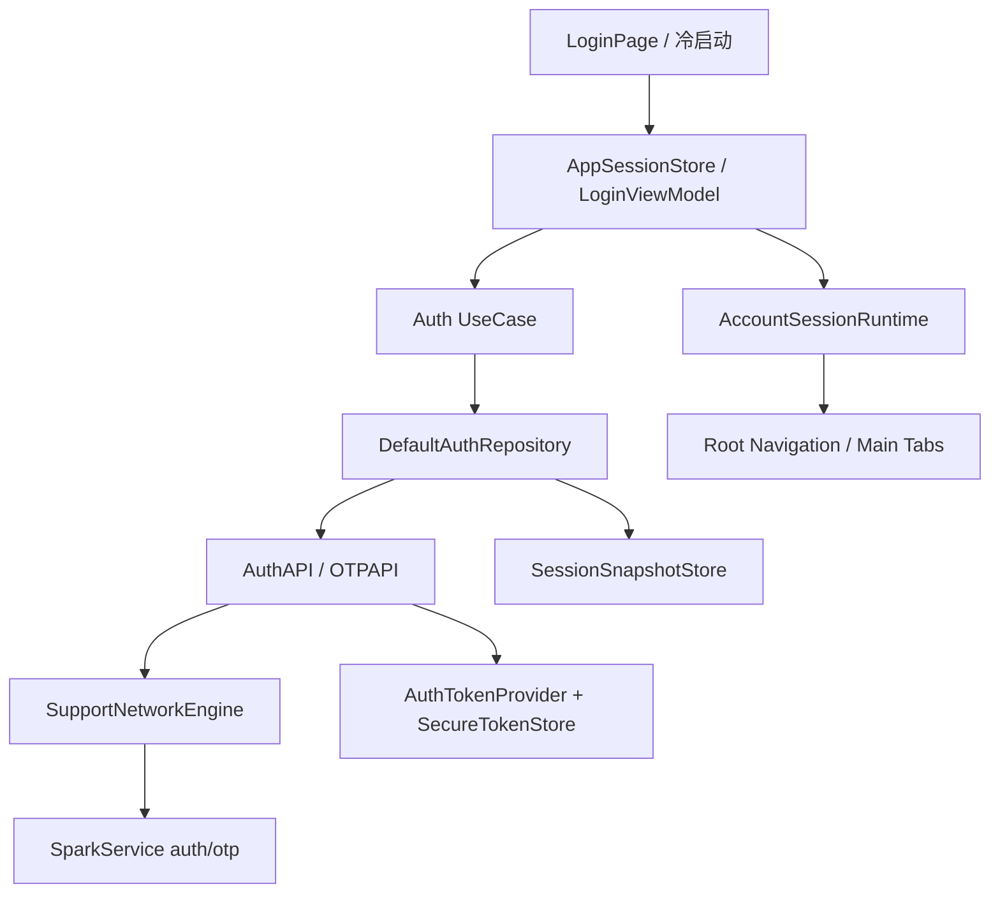

# SupportClientHuawei｜会话与认证详细技术方案

## 1. 对标范围与结论

本文定义 `SupportClientHuawei` 会话与认证模块的 HarmonyOS 目标实现方案，对标 iOS [会话与认证需求](../../../../SupportClient/总领文档/会话与认证/会话与认证需求.md) 与同一后端 `SparkService` 的账号契约。

**当前实现状态（2026-07-22）：** 已完成两项 iOS-HarmonyOS 刷新契约修复。刷新现在与登录共同使用 Asset Store 的安装级 `device_id`，并复用 `DeviceCredentialStore.AUTH_BUNDLE_ID`（`cn.Zhaodk.Health`）作为 `bundle_id`；此前 Provider 的遗留默认值为 `cn.zhaodk.SupportClient`，会使服务端把有效的 Refresh Token 判定为设备会话不匹配并返回 401。刷新暂时不可用保持本地会话，只有服务端明确认证失效才允许进入全局退出链路。华为账号仍为「即将支持」占位，真实服务端刷新联调仍需验证。

| 范围 | 证据 | 结论 |
| --- | --- | --- |
| 后端事实源 | `SparkService/SparkService/urls.py`、`accounts/urls.py`、`accounts/auth/views.py`、`accounts/auth/serializers.py`、`accounts/otp/views.py`、`accounts/otp/serializers.py`、`accounts/services/device_session_service.py`、`accounts/services/device_login_service.py` | `/api/v1/auth/*` 与 `/api/v1/otp/*` 是多端统一契约；设备会话、刷新、退出和错误码以服务端为准。 |
| iOS 参考端 | `Projects/Features/Auth/`、`Projects/App/Sources/App/AppSessionStore.swift`、`Projects/Foundation/Security/SparkKeychain.swift`、`Projects/Core/Networking/API/Auth/AuthAPI.swift`、`OTPAPI.swift`、`SupportClientTests/Networking/` | 已实现 Apple 登录、手机号 OTP、设备游客账号、会话恢复、登出和失效清理。 |
| HarmonyOS 当前端 | `AuthAPI.ets`、`OTPAPI.ets`、`AuthTokenProvider.ets`、`SecureTokenStore.ets`、`SparkAssetStore.ets`、`DeviceCredentialStore.ets`、`DefaultAuthRepository.ets`、`AppSessionStore.ets`、`entry/src/test/ets/Networking/NetworkModule.test.ets` | 登录、启动恢复、Token 刷新和登出底座已实现；本次修复刷新使用与登录一致的持久化 device ID；华为账号为占位按钮。 |
| 后台管理关联 | `backoffice-web/需求文档/后台管理需求文档.md`、`backoffice-web/需求文档/用户管理/*` | 后台展示设备、会话、身份和撤销结果；客户端不得形成另一套设备会话语义。后台具体 API 与服务复用关系后续在账号管理方案继续核验。 |

结论：华为端不应重新设计认证协议。会话生命周期与截图级登录体验已闭环；下一阶段视产品确认接入华为账号换票。

## 2. 华为端目录设计

| 参考端目录/文件 | 参考端职责 | HarmonyOS 现有目录/文件 | HarmonyOS 目标目录/文件 | 状态 | 说明 |
| --- | --- | --- | --- | --- | --- |
| `Projects/Features/Auth/Presentation/LoginView.swift`、`LoginConductor.swift` | 登录页、协议门控、手机号 OTP 子流程 | `LoginPage.ets`、`PhoneLoginPage.ets`、`OtpVerifyPage.ets`、`components/*` | 同左 | 已实现 | 截图级 UI；华为账号占位 |
| `LoginViewModel.swift` | 防重复提交、调用 UseCase、提交 session | `LoginViewModel.ets` | 同左 | 已实现 | 协议门禁、倒计时、错误映射；不直连 HTTP |
| `AuthRepository.swift`、UseCase | 认证领域边界 | `Domain/AuthRepository.ets`、`Application/*UseCase.ets` | 同左 | 已实现 | 设备/OTP/恢复/登出 |
| `DefaultAuthRepository.swift` | API、快照、设备凭证、Token 收口 | `Infrastructure/DefaultAuthRepository.ets` | 同左 | 已实现 | 复用 AuthAPI/OTPAPI |
| `SessionSnapshotStore.swift` | 持久化 `UserSession` 快照 | `Infrastructure/SessionSnapshotStore.ets` | 同左 | 已实现 | 私有文件 JSON，不含 Token |
| `UserSession.swift` | 领域会话模型 | `Projects/Core/Domain/Entities/UserSession.ets` | 同左 | 已实现 | 兼容 snake/camel 别名 |
| `SparkKeychain.swift` | 安装级设备 ID 与 device secret | `Foundation/Security/DeviceCredentialStore.ets` | 同左 | 已实现 | 沙箱加密文件；已废弃 Preferences `DeviceIdentity` |
| `AppSessionStore.swift` | 全局会话状态和恢复 | `App/AppSessionStore.ets` | 同左 | 已实现 | RestoreSessionUseCase + generation |
| `AccountSessionRuntime.swift` | 账号切换、缓存和路由重置 | `App/AccountSessionRuntime.ets` | 同左 | 部分实现 | 快照清理与切换标记；AI/文件缓存钩子待扩 |

## 3. 分层职责与请求链路



| 阶段 | 触发 | 输入 | 参与模块 | 成功 | 临时失败/恢复 | 永久失败/清理 | 用户可见状态 |
| --- | --- | --- | --- | --- | --- | --- | --- |
| 冷启动恢复 | `EntryAbility` 初始化后 | 本地快照、Token | `AppSessionStore`、`RestoreSessionUseCase`、`DefaultAuthRepository` | `signedIn(UserSession)` 并合并远端 session | Token 刷新暂不可用时保留快照 | 明确业务鉴权失效（401xx/403xx 或设备会话失效消息）清理；网关无业务体时保留快照等待重试 | 启动态转登录或主框架 |
| 设备游客账号 | 登录页游客入口 | `bundleId`、`deviceId`、`deviceSecret` | `LoginViewModel`、`SignInWithDeviceUseCase`、`AuthAPI.deviceLogin` | 写 Token、快照、`isDeviceAccount=true` | 网络错误可重试 | 设备凭证不可用或 40061/40361/40161 阻断 | 进入主框架或显示设备账号失败 |
| 手机号 OTP | 手机号页发码/验码 | `phoneNumber`、`otpId`、`code`、`device_id`；仅已完成设备登录时携带已登记 `device_secret` | `OTPAPI.requestPhoneOTP`、`verifyPhoneOTP` | 写 Token、快照、`signInMethod=phone` | 发码/验码失败保留页面状态 | 新安装不得生成临时 secret；匿名 OTP 的 401/40162 不触发全局退出 | OTP 页、倒计时、错误提示 |
| Apple 登录 | iOS 主路径；HarmonyOS 需产品确认替代入口 | `identityToken`、`nonce`、Apple user | `AuthAPI.appleLogin` | 写 Token、快照、`signInMethod=apple` | 用户取消不清 session | token/nonce/bundle 校验失败 | HarmonyOS 当前待确认是否展示 |
| 退出登录 | 设置/账号页 | 当前 Token | `SignOutUseCase`、`AuthAPI.logout`、`AppSessionStore` | 本地 Token/快照/账号缓存清理 | 服务端登出失败仍清本地 | 无 | 回到登录页 |

## 4. 核心关键技术与实现方案

### 4.1 会话状态与冷启动恢复

iOS 事实：`AppSessionStore.restoreIfNeeded()` 保证冷启动只恢复一次；`DefaultAuthRepository.restoreSession()` 先读 `SessionSnapshotStore`，再通过 `AuthTokenProvider.authorizationHeaderValue()` 预热/刷新 Token，随后调用 `/api/v1/auth/session/` 合并远端 `UserSession`。Token 临时刷新失败时保留快照；明确失效时清 Token、快照和设备认证状态。

HarmonyOS 当前实现：`AppSessionStore.ets`、`RestoreSessionUseCase.ets`、`SessionSnapshotStore.ets` 已接入组合根。恢复顺序与 iOS 对齐：读取快照 → `authorizationHeaderValue()` 触发必要刷新 → `/api/v1/auth/session/` 合并远端会话；临时刷新失败保留快照，明确刷新失效清理 Token、快照和账号缓存。

```ts
// 伪代码：职责骨架，未在目标工程编译验证。
export enum SessionStateKind { Loading, SignedOut, SignedIn }

export class UserSession {
  accountId: number = 0
  email: string = ''
  displayName: string = ''
  signedInAtMs: number = 0
  signInMethod: string = 'device'
  isPro: boolean = false
  isNewUser: boolean = false
  isDeviceAccount: boolean = false
}

export class AppSessionStore {
  private didRestore: boolean = false
  async restoreIfNeeded(): Promise<void> {
    if (this.didRestore) { return }
    this.didRestore = true
    const session = await this.restoreUseCase.execute()
    this.state = session ? SessionState.signedIn(session) : SessionState.signedOut()
  }
}
```

官方参考：[通过用户首选项实现数据持久化(ArkTS)](https://developer.huawei.com/consumer/cn/doc/HarmonyOS-Guides/data-persistence-by-preferences) 用于普通元数据；[Universal Keystore Kit ArkTS API](https://developer.huawei.com/consumer/cn/doc/harmonyos-references/universal-keystore-arkts) 用于密钥保护。均需按目标 API 24 复核。

### 4.2 Token、设备凭证与安全边界

华为端已有 `AuthTokenProvider.ets`、`SecureTokenStore.ets` 和 `SessionInvalidation.ets`。这些覆盖 access/refresh token 的存储、刷新和失效通知，但不等同于设备游客账号凭证存储。设备账号由 `DeviceCredentialStore.ets` 管理安装级 `deviceId` 和高熵 `deviceSecret`。

**本次确定性修复：** `AuthTokenProvider` 已使用与 `AuthAPI.deviceLogin` 相同的 `SparkAssetStore` 安装级 `device_id`；但刷新 Provider 仍遗留 `cn.zhaodk.SupportClient` 的默认 `bundle_id`，而实际 `AppScope/app.json5` 与 `DeviceCredentialStore.AUTH_BUNDLE_ID` 均为 `cn.Zhaodk.Health`。后端按设备会话校验 refresh 时，这一 bundle 不一致会让 Access Token 的自然续期演变为 Refresh 401，随后触发 Token 清理和 `signedOut`。现已改为复用 `AUTH_BUNDLE_ID`，并增加默认 Refresh body 的 `bundle_id` 回归测试。`SessionInvalidation` 同步 iOS：403 永远不退出；临时刷新失败和无效刷新响应不升级为 `refreshFailed`。

刷新失败语义也已与 iOS 对齐：只有解析到明确的 401xx/403xx 业务码或 `token_not_valid`、`device_mismatch` 等明确失效消息时才清理本地会话；网关 401、HTML、无业务体或 5xx 按临时不可用处理，保留本地快照等待后续恢复。

后端事实：`DeviceLoginSerializer` 要求 `bundle_id`、`device_id`、`device_secret`；`DeviceLoginService` 禁止仅靠裸 `device_id` 登录，`DeviceCredentialService.verify_or_register` 会校验或注册设备密钥；`DeviceSessionService` 会在登录/刷新/退出时维护 `AccountDeviceSession`。

目标规则：

- `deviceId` 是安装级稳定标识；`deviceSecret` 是认证秘密，必须安全保存。
- `AuthTokens` 只能由 `AuthTokenProvider` 管理；登录 API 返回后立即写安全存储。
- `SessionSnapshotStore` 保存 `UserSession`，不保存任何 token 或 secret。
- `SessionInvalidation` 收到 401、`token_not_valid`、`device_session_replaced` 等明确失效时清 Token、ETag 和普通设备缓存，并通知 `AppSessionStore` 进入 `signedOut`。

### 4.3 登录入口、协议门控与页面状态

iOS `LoginView` 在用户同意法律协议前不发起 Apple、手机号或设备游客登录；`LoginViewModel.isLoading` 阻止重复提交；Apple 用户取消不会清理已有会话。

HarmonyOS 可借鉴本地 aggregated login 模板的半模态、协议复选框和验证码倒计时，但实现必须替换为本项目 `AuthRepository`。示例 `AggregatedLoginVM.ets` 中的第三方 SDK、硬编码 AppId、模拟手机号、页面内 toast 文案和单例状态不应直接复制。

目标页面：

- `LoginPage.ets`：设备游客入口、手机号入口、协议确认、可选 Huawei/Apple 替代入口。
- `PhoneLoginPage.ets`：手机号输入、国家码归一化、发码。
- `OtpVerifyPage.ets`：验证码输入、倒计时、重发、提交。
- `LoginViewModel.ets`：唯一调用 UseCase 的 UI 编排层。

### 4.4 API 契约、字段别名与响应包装

服务端 Serializer 使用 snake_case，例如 `identity_token`、`bundle_id`、`device_id`、`device_secret`、`otp_id`、`phone_number`；iOS 与华为 DTO 使用 camelCase，例如 `identityToken`、`bundleId`、`deviceId`、`deviceSecret`、`otpId`、`phoneNumber`。当前 `SupportAPIResponseDecoder` 需要继续承担 snake/camel 兼容，严禁在页面里手工拼字段。

后端普通登录接口使用 `success_response(data, code=0, msg=...)` 包装；`TokenRefreshView` 直接返回 token 根对象。华为端 `AuthAPI.ets` 已按这一区别实现 `executeDecoded` 和 token 写入，后续 Auth Feature 应复用现有 API。

### 4.5 账号切换、退出和路由清理

iOS `AccountSessionRuntime` 负责账号切换、缓存清理和路由重建。后端 `DeviceSessionService.activate_session_on_login` 会撤销同安装实例的旧用户设备会话；`logout_current_session` 会把当前 session 标记为 `LOGGED_OUT`，并将 trusted device 置为 revoked。

HarmonyOS 需要新增 `AccountSessionRuntime.ets`：

- 登录替换已有账号前，进入 `isAccountSwitchInProgress`。
- 登录成功后，以新 `accountId` 清理账号级 ETag、文件、AI 设置、路由栈和 ViewModel 缓存。
- 登录失败或用户取消时，回滚账号切换标记。
- 退出登录时，不管 `AuthAPI.logout()` 的服务端结果如何，清本地 Token、快照、ETag 和账号级运行时。

### 4.6 官方资料与本地示例结论

| 类型 | 标题/代码位置 | URL/绝对路径 | 可借鉴内容 | 禁止直接复制/版本注意事项 |
| --- | --- | --- | --- | --- |
| 官方 | 发送网络请求（ArkTS） | https://developer.huawei.com/consumer/cn/doc/harmonyos-guides/http-request | HTTP 请求、取消、关闭和网络权限依据 | 实际 API 签名以 SDK 24 编译为准。 |
| 官方 | Universal Keystore Kit ArkTS API | https://developer.huawei.com/consumer/cn/doc/harmonyos-references/universal-keystore-arkts | Token/device secret 密钥保护依据 | HUKS 不等于可把明文 Token 放 Preferences。 |
| 官方 | 通过用户首选项实现数据持久化(ArkTS) | https://developer.huawei.com/consumer/cn/doc/HarmonyOS-Guides/data-persistence-by-preferences | 普通会话元数据/协议确认态参考 | 敏感凭证禁止存 Preferences；写后需 flush。 |
| 官方 | 组件导航 Navigation、Tabs | https://developer.huawei.com/consumer/cn/doc/harmonyos-guides/arkts-navigation-navigation、https://developer.huawei.com/consumer/cn/doc/harmonyos-guides/arkts-navigation-tabs | 登录局部导航、主框架切换 | 与路由方案统一，不从网络回调直接跳页。 |
| 本地示例 | `.../GovernmentService/Application/components/aggregated_login/src/main/ets/utils/LoginSheetUtils.ets` | `/Users/hua/Documents/project/Reference/ClientSub-project/SparkAndroid/Package/Huawei/agc-template-market-harmonyos-demos-main/LifestyleAndServiceTemplate/GovernmentService/Application/components/aggregated_login/src/main/ets/utils/LoginSheetUtils.ets` | 半模态登录容器和局部 `Navigation` | 不复制第三方 SDK、硬编码 AppId。 |
| 本地示例 | `.../aggregated_login/src/main/ets/viewmodel/AggregatedLoginVM.ets` | `/Users/hua/Documents/project/Reference/ClientSub-project/SparkAndroid/Package/Huawei/agc-template-market-harmonyos-demos-main/LifestyleAndServiceTemplate/GovernmentService/Application/components/aggregated_login/src/main/ets/viewmodel/AggregatedLoginVM.ets` | 协议门控、验证码倒计时、登录中状态 | 模拟数据、toast 文案、单例 ViewModel 不可直接生产复用。 |
| 本地示例 | `LiveStreaming/.../TokenHeaderInterceptor.ts`、`TokenRefreshInterceptor.ts` | `/Users/hua/Documents/project/Reference/ClientSub-project/SparkAndroid/Package/Huawei/agc-template-market-harmonyos-demos-main/MovieTVAndLivestreamingTemplate/LiveStreaming/commons/server/src/main/ets/handler/interceptor/` | Header 注入与刷新拦截位置 | 示例无完整安全存储/刷新单飞/失效分类，不可直接照搬。 |
| 本地示例 | `PreferenceUtil.ts` | `/Users/hua/Documents/project/Reference/ClientSub-project/SparkAndroid/Package/Huawei/agc-template-market-harmonyos-demos-main/TravelTemplate/TravelGuide/components/module_base/src/main/ets/common/PreferenceUtil.ets` | Preferences 封装、flush 使用 | 示例会打印 value，生产必须移除，且不能保存 Token。 |

## 5. 接口契约与数据模型

### 5.1 通用数据与状态

| 模型/属性 | 外部字段名 | ArkTS 类型 | 必填 | 敏感 | 来源与验证 | 生命周期/持久化 | 兼容规则 |
| --- | --- | --- | --- | --- | --- | --- | --- |
| `UserSession.accountId` | `user_id` / `userId` / `accountId` | `number` | 是 | 否 | iOS `UserSession.swift`、后端登录结果 | `SessionSnapshotStore` | iOS 兼容 `accountId/userId`；华为解码需兼容 snake/camel。 |
| `UserSession.email` | `email` | `string` | 否 | 可能 | 后端登录/session 结果 | 快照 | 空字符串可表示设备账号。 |
| `UserSession.displayName` | `display_name` / `displayName` | `string` | 否 | 否 | 后端、iOS merge 逻辑 | 快照 | 缺失时用后端或手机号兜底。 |
| `UserSession.signedInAtMs` | 本地字段 | `number` | 是 | 否 | iOS `signedInAt` | 快照 | 远端 session 合并时保留本地时间。 |
| `UserSession.signInMethod` | `sign_in_method` / `signInMethod` | `'device' \| 'apple' \| 'google' \| 'phone' \| 'email'` | 是 | 否 | 后端/iOS | 快照 | 未识别值降级为当前登录方式。 |
| `UserSession.isPro` | `is_pro` / `isPro` | `boolean` | 否 | 否 | 后端 `LoginService._apply_is_pro` | 快照 | 缺失默认 false。 |
| `UserSession.isNewUser` | `is_new_user` / `isNewUser` | `boolean` | 否 | 否 | 登录结果 | 快照 | 恢复时缺失沿用本地。 |
| `UserSession.isDeviceAccount` | `is_device_account` / `isDeviceAccount` | `boolean` | 否 | 否 | 后端/iOS | 快照 | 设备登录默认 true；旧快照默认 false。 |
| `AuthTokens.accessToken` | `access_token` / `accessToken` / `access` | `string` | 是 | 是 | 后端 Auth/OTP/refresh | `AuthTokenProvider` + `SecureTokenStore` | 禁止写入 `UserSession`。 |
| `AuthTokens.refreshToken` | `refresh_token` / `refreshToken` / `refresh` | `string` | 是 | 是 | 后端 Auth/OTP/refresh | `AuthTokenProvider` + `SecureTokenStore` | 刷新成功后覆盖旧 token。 |
| `DeviceCredential.deviceId` | `device_id` / `deviceId` | `string` | 是 | 中 | 后端 Serializer、iOS `SparkKeychain` | `DeviceCredentialStore` | 安装级稳定。 |
| `DeviceCredential.deviceSecret` | `device_secret` / `deviceSecret` | `string` | 设备登录必填；手机号 OTP 仅复用已登记值 | 是 | 后端 `DeviceLoginSerializer` / OTP | `DeviceCredentialStore` 安全存储 | 匿名设备登记和新安装 OTP 不得创建或发送临时 secret。 |

### 5.2 按 API、存储或系统对象逐项展开

| 操作/模型 | 输入/输出 | 后端契约/方法与路径或系统 API | 鉴权/权限 | HTTP/业务错误与 Request ID | 缓存/并发策略 | 消费位置 | 证据 |
| --- | --- | --- | --- | --- | --- | --- | --- |
| 设备游客登录 | 输入 `bundle_id/device_id/device_secret/attestation?`；输出 token、用户信息、`account_resolution` | `POST /api/v1/auth/device/login/` | AllowAny；设备密钥必填 | 40061 缺字段，40361 禁用，40961 冲突，40161 等设备凭证错误需映射 | 登录按钮单飞；成功写 Token 和快照 | `SignInWithDeviceUseCase` | `accounts/auth/serializers.py`、`accounts/auth/views.py`、`device_login_service.py`、`AuthAPI.ets` |
| 手机号发码 | 输入 `phone_number/provider_uid/bundle_id/device_id/scene/user_id?`；输出 `otp_id/expires_in` | `POST /api/v1/otp/phone/request/` | `login` AllowAny；绑定/注销场景需 auth | 后端归一化 E.164；错误保留页面状态 | 发码中禁重复；倒计时本地状态 | `RequestPhoneOTPUseCase` | `accounts/otp/serializers.py`、`otp/views.py`、`OTPAPI.ets` |
| 手机号验码 | 输入 `otp_id/phone_number/code/bundle_id/device_id/device_secret`；输出 token、用户信息 | `POST /api/v1/otp/phone/verify/` | AllowAny | 验码错误/过期不写 session；Request ID 进入日志 | 提交单飞；成功写 Token 和快照 | `SignInWithPhoneOTPUseCase` | `accounts/otp/views.py`、`otp_service.py`、`OTPAPI.ets` |
| Apple 登录 | 输入 `identity_token/authorization_code?/nonce?/user/email/full_name/bundle_id/device_id/device_secret` | `POST /api/v1/auth/apple/login/` | AllowAny | 40023 缺 bundle，40321 bundle 不允许，40123 sub 缺失，40124 nonce mismatch | 平台登录回调单飞；取消不清 session | iOS 已实现；HarmonyOS 入口待产品确认 | `AppleLoginSerializer`、`LoginService.authenticate_apple_and_issue_tokens`、`AuthAPI.ets` |
| 当前会话 | 输出最新 `user_id/email/display_name/is_pro/is_new_user/sign_in_method/is_device_account` | `GET /api/v1/auth/session/` | Bearer | 401/设备会话失效触发 `SessionInvalidation` | 冷启动只执行一次；可与 Token 刷新串联 | `RestoreSessionUseCase` | `CurrentSessionView`、`DefaultAuthRepository.swift`、`AuthAPI.ets` |
| 登出 | 输出空对象 | `POST /api/v1/auth/logout/` | Bearer + 设备会话校验 | 服务端失败也必须本地清理 | 防重复；清 Token/快照/账号缓存 | `SignOutUseCase` | `LogoutView`、`DeviceSessionService.logout_current_session`、`AuthAPI.ets` |
| Token 刷新 | 输入 `refresh/refresh_token/bundle_id/device_id`；输出 token 根对象 | `POST /api/v1/auth/token/refresh/` | AllowAny | 40102 token invalid，40103 inactive，40104/40105/40106/40107 设备会话错误 | `AuthTokenProvider` 刷新单飞；`device_id` 与登录相同；原请求最多重放一次 | 网络底座 | `TokenRefreshView`、`DeviceSessionService.validate_refresh_request`、`AuthTokenProvider.ets`、`SparkAssetStore.ets` |

## 6. iOS-HarmonyOS 功能对照矩阵

本功能已同步维护到 `开发详细技术文档/iOS-HarmonyOS功能对照矩阵.md`。相关摘录如下：

| 参考端能力/证据 | 可观察行为 | HarmonyOS 实现/证据 | 官方能力 | 本地示例 | 对齐状态 | 差异与处理 |
| --- | --- | --- | --- | --- | --- | --- |
| iOS `Projects/Features/Auth/`、`AppSessionStore.swift`、`SparkKeychain.swift`、`SupportAuthSessionPersistenceTests.swift` | Apple/手机号/设备登录、冷启动恢复、登出、Token 刷新和失效清理 | `UserSession`、`SessionSnapshotStore`、`DeviceCredentialStore`、`DefaultAuthRepository`、UseCases、`AppSessionStore`、`AccountSessionRuntime`、`AuthDomain.test.ets`；华为账号占位按钮 | HTTP、Preferences、沙箱加密、Navigation/Tabs，API 24 | aggregated_login、LiveStreaming Token 拦截器 | 部分对齐 | 领域底座已闭环；截图级 OTP/协议 UI 与 Account Kit 换票待做；Apple 入口不做。 |

## 7. 示例工程与官方文档参考结论

| 类型 | 标题/代码位置 | URL/绝对路径 | 可借鉴内容 | 禁止直接复制/版本注意事项 |
| --- | --- | --- | --- | --- |
| 官方 | 发送网络请求（ArkTS） | https://developer.huawei.com/consumer/cn/doc/harmonyos-guides/http-request | HTTP 请求、取消、关闭、`INTERNET` 权限 | 以 SDK 24 编译签名为准。 |
| 官方 | Universal Keystore Kit ArkTS API | https://developer.huawei.com/consumer/cn/doc/harmonyos-references/universal-keystore-arkts | Token 和 device secret 密钥保护 | 不能把 HUKS 当普通字符串仓库。 |
| 官方 | 通过用户首选项实现数据持久化(ArkTS) | https://developer.huawei.com/consumer/cn/doc/HarmonyOS-Guides/data-persistence-by-preferences | 法律协议确认态、非敏感快照元数据 | Token、OTP、device secret 禁止存入。 |
| 官方 | Navigation / Tabs | https://developer.huawei.com/consumer/cn/doc/harmonyos-guides/arkts-navigation-navigation、https://developer.huawei.com/consumer/cn/doc/harmonyos-guides/arkts-navigation-tabs | 登录局部路由与主框架切换 | 路由必须由会话状态驱动。 |
| 本地 | aggregated_login 登录组件 | `/Users/hua/Documents/project/Reference/ClientSub-project/SparkAndroid/Package/Huawei/agc-template-market-harmonyos-demos-main/LifestyleAndServiceTemplate/GovernmentService/Application/components/aggregated_login/src/main/ets/` | 半模态、协议门控、OTP 倒计时 | 第三方 SDK、模拟数据、硬编码 AppId 不可复制。 |
| 本地 | LiveStreaming Token 拦截器 | `/Users/hua/Documents/project/Reference/ClientSub-project/SparkAndroid/Package/Huawei/agc-template-market-harmonyos-demos-main/MovieTVAndLivestreamingTemplate/LiveStreaming/commons/server/src/main/ets/handler/interceptor/` | Header 注入与刷新重放插入点 | 无完整安全存储和会话失效分类。 |
| 本地 | PreferenceUtil | `/Users/hua/Documents/project/Reference/ClientSub-project/SparkAndroid/Package/Huawei/agc-template-market-harmonyos-demos-main/TravelTemplate/TravelGuide/components/module_base/src/main/ets/common/PreferenceUtil.ets` | Preferences 封装和 flush | 示例打印 value，生产必须移除。 |

## 8. 实施拆分与验收

| 阶段 | 目标文件/模块 | 依赖 | 实施结果 | 自动化测试 | 人工验收 |
| --- | --- | --- | --- | --- | --- |
| 1. 领域模型与快照 | `UserSession.ets`、`SessionSnapshotStore.ets` | Decoder、私有文件 | 已实现 | `AuthDomain.test.ets` 编解码/损坏/无快照 | 冷启动状态正确 |
| 2. 设备凭证 | `DeviceCredentialStore.ets` | 沙箱加密文件 | 已实现 | deviceId 稳定、空 secret 阻断 | 游客登录不生成假 session |
| 3. Repository/UseCase | `AuthRepository`、`DefaultAuthRepository`、UseCases | `AuthAPI`、`OTPAPI`、`AuthTokenProvider` | 已实现 | 单飞、同 device ID 刷新、恢复/登出分支 | 设备登录后等待 access 过期并观察自动刷新成功 |
| 4. UI 与协议门控 | 截图级 Login/Phone/OTP | 路由、资源文案 | 待实现（UI 方案） | 协议门禁单测 | 见 UI 设计图方案 |
| 5. 会话运行时 | `AppSessionStore`、`AccountSessionRuntime` | 路由、ETag | 部分实现 | 失效清快照、generation | AI/文件缓存清理待扩 |
| 6. 集成验收 | 登录全链路 | SparkService | 部分完成：mock 已覆盖刷新 device ID；真机仍待联调 | mock + 真机 | 登录后等待 access 过期、冷启动恢复、网络临时失败、明确失效、退出 |

必须覆盖的验收项：

- Apple/手机号/设备登录都进入同一 `UserSession` 生命周期；HarmonyOS Apple 等价入口若产品不做，需标注不适用或替代。
- 冷启动只恢复一次，且区分“临时刷新失败保留快照”和“明确失效清理”。
- 退出登录无论服务端结果如何，都清 Token、快照和账号级缓存。
- 401、`token_not_valid`、`device_session_replaced`、`device_mismatch` 触发失效收口。
- Token、OTP、device secret、identity token 不进普通 Preferences、日志和错误文案。
- 所有新增 ArkTS 实现必须通过目标工程 `assembleHap`，否则文档代码只能保持“伪代码/职责骨架”。

## 9. 风险与待确认项

| 编号 | 风险/待确认项 | 影响模块 | 证据 | 依赖方 | 关闭条件 |
| --- | --- | --- | --- | --- | --- |
| AUTH-R1 | HarmonyOS 是否提供 Apple 登录入口或以华为账号/手机号替代，产品未确认 | 登录入口、账号绑定 | iOS 有 Apple；华为端为占位按钮「即将支持」 | 产品/后端 | 明确换票 endpoint 后接 Account Kit |
| AUTH-R2 | `DeviceCredentialStore` 已落地（沙箱加密）；可再强化 HUKS | 设备游客账号 | `DeviceCredentialStore.ets` | HarmonyOS 开发 | 首期已关闭；HUKS 为增强项 |
| AUTH-R3 | 会话快照字段 snake/camel 兼容必须统一在 decoder/repository，不可散落页面 | 所有登录/恢复 | 后端 snake_case，iOS/Huawei DTO camelCase | 客户端开发 | 字段映射单测覆盖所有 Auth/OTP 响应。 |
| AUTH-R4 | 后台管理端设备/会话展示与客户端 session 状态的服务复用关系需继续核验 | 后台审计、账号管理 | backoffice 文档存在设备/会话展示 | 后端/后台 | 账号管理方案中补充后台 API 与 service 证据。 |
| AUTH-R5 | 失效已驱动 UI `signedOut` 并清快照 | 会话失效、路由 | `RouteCoordinator` + `AccountSessionRuntime.onAuthInvalidated` | App/Routing | 已关闭 |
| AUTH-R6 | 示例登录模板含模拟数据、第三方 SDK 和日志输出，不可作为生产代码来源 | 登录 UI | aggregated_login 示例代码 | 客户端开发 | 只复用结构思想，生产代码通过 ArkTS 编译和安全审查。 |
