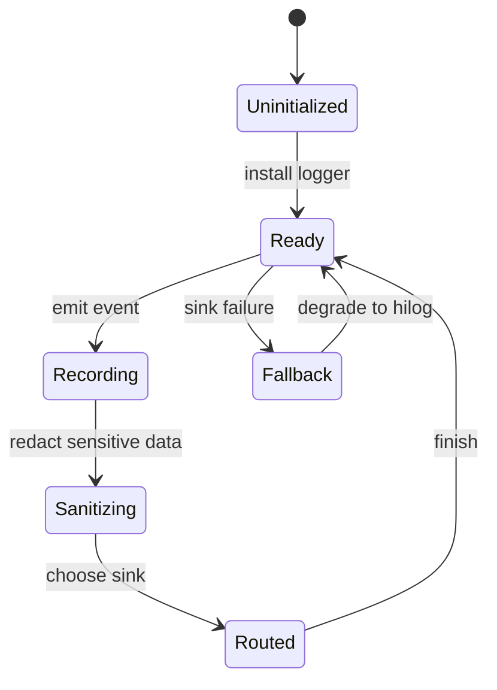

# SupportClientHuawei 日志系统详细技术方案

## 1. 对标范围与结论

- **参考端与证据：** [日志系统需求](/Users/hua/Documents/project/Reference/ClientSub-project/SparkAndroid/SupportClient/总领文档/基础工程与运行环境/日志系统需求.md)；真实 iOS 实现在 [Foundation/Logger.swift](/Users/hua/Documents/project/Reference/ClientSub-project/SparkAndroid/SupportClient/SupportClient/Foundation/Logger.swift)。该实现已有 `LogLevel`（verbose/debug/info/warning/error）、`LogModule`、阈值过滤、可替换 handler、单行截断和 `os.Logger`/`print` 降级。Android 空壳不作为本次对标证据。
- **HarmonyOS 目标端与现状：** `SupportClientHuawei` 已落地统一日志基础设施：`Foundation/Logging/{Logger,LogLevel,LogModule,LogEvent,LogSanitizer,StartupLogger,NetworkLogger,ErrorLogger}.ets`；`AppContainer` 按环境配置等级；`EntryAbility` 使用 StartupLogger/ErrorLogger，不再直接 `JSON.stringify(err)`。
- **目标用户能力：** 通过统一日志入口记录启动、网络、认证、页面交互和异常排查信息，并能按等级、分类和上下文进行脱敏诊断。
- **结论：** HarmonyOS 端日志系统本体为“已实现”（仅 hilog 输出，无文件/远端 sink）；网络门面 `NetworkLogger` 已委托统一 `Logger`。

## 2. 华为端目录设计

| 参考端目录/文件 | 参考端职责 | HarmonyOS 现有目录/文件 | HarmonyOS 目标目录/文件 | 状态 | 说明 |
| --- | --- | --- | --- | --- | --- |
| `SupportClient/总领文档/基础工程与运行环境/日志系统需求.md` | 日志系统需求与验收 | `开发详细技术文档/基础工程与运行环境/日志系统详细技术方案.md` | 同左 | 已实现 | 方案与代码均已落地 |
| `SupportClient` 启动入口 | 启动时注入日志 | `entryability/EntryAbility.ets`、`App/AppContainer.ets` | 同左 | 已实现 | EntryAbility 使用 StartupLogger；AppContainer 配置 Logger |
| `SupportClientHuawei` 网络方案 | 网络脱敏与 Request ID | `Core/Networking/`、`Foundation/Logging/` | 同左 | 部分对齐 | 网络与统一日志已接通；会话 accountHash 待会话模块 |

## 3. 分层职责与请求链路

日志系统的触发入口主要来自三个地方：应用启动、业务动作和异常处理。它不改变业务流程，只记录可诊断信息。

| 阶段 | 触发 | 输入 | 参与模块 | 成功 | 临时失败/恢复 | 永久失败/清理 | 用户可见状态 |
| --- | --- | --- | --- | --- | --- | --- | --- |
| 启动日志 | `EntryAbility` 创建或前台切换 | 启动阶段、构建类型、版本、页面名 | `Logger`、`StartupLogContext` | 记录一次结构化启动事件 | 日志通道不可用时降级到 `hilog` 默认输出 | 不阻塞启动；不保留敏感数据 | 不直接暴露 |
| 业务日志 | 页面、ViewModel、Repository 发生关键动作 | 模块名、requestId、账号摘要 | `Logger`、`RequestLogContext`、`LogSanitizer` | 输出带上下文和脱敏的日志 | 脱敏失败时裁剪为摘要 | 不回写业务状态 | 不直接暴露 |
| 异常日志 | 捕获到错误、超时、401、取消 | 错误类型、阶段、请求摘要 | `Logger`、`ErrorContextBuilder` | 输出可排查错误信息 | 远端 sink 失败则回退本地 | 不影响页面继续运行 | 由业务层单独决定 |



## 4. 核心关键技术与实现方案

### 4.1 日志基础设施

#### 目标和职责边界

在 HarmonyOS 端，建议定义一个应用级 `Logger` 抽象，负责统一等级、分类、格式和输出策略；底层使用 `hilog` 实际打印。页面、Repository 和网络层只依赖日志接口，不直接调用 `hilog`。

#### iOS 当前实现与关键代码证据

`Logger.swift` 已将等级、模块、输出 handler 与阈值过滤集中到 `SupportLogger`；`ConsoleLogger` 是业务依赖的轻量接口，`LogMessageSanitizer.singleLineSnippet` 会合并换行并限制长度为 200 字符。HarmonyOS 必须对齐这些**可观察行为**，而不是只对齐“能打印一行文字”。

#### HarmonyOS 实现路径、ArkTS 目标文件和生命周期

- 建议目标目录：`entry/src/main/ets/Foundation/Logging/`
- 建议目标文件：`Logger.ets`、`LogLevel.ets`、`LogContext.ets`、`LogSanitizer.ets`
- 生命周期：在 `EntryAbility` 或 `App` 容器初始化时创建单例或受控实例，应用前后台切换不重复创建。

#### 官方文档、URL、目标 API Level 与用途

- [ohos.hilog (HiLog日志打印)](https://developer.huawei.com/consumer/cn/doc/harmonyos-references/js-apis-hilog) 用于 ArkTS 运行时日志输出。目标 API Level：24，实施前需按当前 SDK 复核签名和可用性。
- [hilog-Command Line Tools-Performance Analysis Kit-Debugging](https://developer.huawei.com/consumer/en/doc/harmonyos-guides/hilog) 用于查看和过滤设备端日志。目标 API Level：24，实施前需复核命令行能力与设备限制。
- [Application Development Overview-Getting Started](https://developer.huawei.com/consumer/en/doc/harmonyos-guides/application-dev-guide) 用于确认 Stage/ArkTS 基础生命周期入口。目标 API Level：24，实施前需复核具体生命周期回调。

#### 本地 HarmonyOS 示例路径、可借鉴点、禁止复制点

| 本地示例路径 | 可借鉴内容 | 禁止复制内容 |
| --- | --- | --- |
| `/Users/hua/Documents/project/Reference/ClientSub-project/SparkAndroid/Package/Huawei/agc-template-market-harmonyos-demos-main/FinanceTemplate/MoneyTrack/components/asset_base/src/main/ets/utils/Logger.ets` | 将 `debug/info/warn/error` 统一包到一个 `Logger` 类 | 直接沿用 `0xff00`、`BillBase` 和固定双参数 format；示例没有脱敏和字段白名单 |
| `SupportClientHuawei/entry/src/main/ets/entryability/EntryAbility.ets` | 真实模板已使用 `hilog` 覆盖 UIAbility 生命周期点 | 复制 `testTag`/`DOMAIN=0x0000`，或将 `JSON.stringify(err)` 作为生产错误日志 |

#### 核心 ArkTS 代码骨架

```ts
import { hilog } from '@kit.PerformanceAnalysisKit'

export enum LogLevel {
  DEBUG,
  INFO,
  WARN,
  ERROR
}

export interface LogContext {
  module: string
  requestId?: string
  route?: string
  operation?: string
  elapsedMs?: number
  retryCount?: number
  accountHash?: string
}

export class Logger {
  private readonly domain: number = 0xFF00

  constructor(private readonly prefix: string) {}

  info(message: string, context?: LogContext): void {
    hilog.info(this.domain, this.prefix, '%{public}s', this.format(message, context))
  }

  private format(message: string, context?: LogContext): string {
    // 先白名单序列化，再交给 LogSanitizer；不得 stringify 任意错误/请求对象。
    return context ? `${message} ${JSON.stringify(context)}` : message
  }
}
```

骨架只表示职责边界；实际 `hilog` 格式串、类型和调用签名必须以目标 SDK 官方文档为准。

#### 安全、权限、并发、取消、失败、清理与验收规则

- 日志内容必须先脱敏再输出。
- 日志不可携带明文 Token、API Key、OTP、STS Secret、身份证号、手机号和完整 Cookie。
- 并发写入应避免阻塞 UI 线程，必要时通过轻量队列或异步调度缓冲。
- 清理策略仅针对未来的文件 sink；当前若仅使用 `hilog`，无需持久化清理。

### 4.2 日志上下文与脱敏

#### 目标和职责边界

上下文模块负责补足“谁、在哪个阶段、针对哪个请求”的信息；脱敏模块负责删除敏感片段。两者都不做业务判定。

#### iOS 当前实现与关键代码证据

参考端网络模块要求日志脱敏、Request ID 和业务用途标识，说明日志上下文是跨模块约束，而不是日志模块独享职责。

#### HarmonyOS 实现路径、ArkTS 目标文件和生命周期

- `RequestLogContext`：记录 `requestId`、接口名、状态码、耗时、重试次数。
- `SessionLogContext`：记录账号摘要、登录态、页面阶段。
- `StartupLogContext`：记录启动阶段、ability 生命周期和版本信息。
- `LogSanitizer`：统一对 `Authorization`、token、password、API key、STS secret、手机号、邮箱等脱敏。

#### 官方文档、URL、目标 API Level 与用途

- [ohos.hilog (HiLog日志打印)](https://developer.huawei.com/consumer/cn/doc/harmonyos-references/js-apis-hilog) 用于结构化日志输出和公共字段格式控制。
- [hdc命令](https://developer.huawei.com/consumer/cn/doc/harmonyos-guides/hdc) 用于本地抓取日志、切换日志级别和查看落盘内容。目标 API Level：24。

#### 本地 HarmonyOS 示例路径、可借鉴点、禁止复制点

| 本地示例路径 | 可借鉴内容 | 禁止复制内容 |
| --- | --- | --- |
| `/Users/hua/Documents/project/Reference/ClientSub-project/SparkAndroid/Package/Huawei/agc-template-market-harmonyos-demos-main/SocialTemplate/Community/products/entry/src/main/ets/viewmodels/IndexVM.ets` | 了解业务成功/失败时如何借助统一日志与弹窗做诊断 | 把 `JSON.stringify(err)` 原样输出到生产日志 |
| `/Users/hua/Documents/project/Reference/ClientSub-project/SparkAndroid/Package/Huawei/agc-template-market-harmonyos-demos-main/HouseAndHomeTemplate/RentAndBuy/components/aggregated_login/src/main/ets/common/Logger.ets` | 了解统一日志封装的最小形态 | 不做脱敏直接打印对象 |

#### 核心 ArkTS 代码骨架

```ts
export class LogSanitizer {
  redact(input: string): string {
    return input
      .replace(/(Bearer\s+)[^\s]+/g, '$1***')
      .replace(/("?(?:token|apiKey|password|secret)"?\s*:\s*")[^"]+"/ig, '$1***"')
  }
}
```

#### 安全、权限、并发、取消、失败、清理与验收规则

- 脱敏失败时应裁剪，不可降级为明文输出。
- 上下文对象要短生命周期，避免跨账号污染。
- 日志系统不应在 UI 页面层处理敏感规则。

### 4.3 启动、网络和异常诊断日志

#### 目标和职责边界

启动日志用于记录 Stage 启动和首屏准备；网络日志用于记录请求、重试、401 和取消；异常日志用于记录错误分类和恢复路径。

#### iOS 当前实现与关键代码证据

参考端总领文档已把网络、启动和日志列为基础工程和运行环境的一部分。参考端 Android 子工程当前仍只有模板页面，因此华为端也应把该能力视为基础设施待实现，而不是业务页面里的临时打印。

#### HarmonyOS 实现路径、ArkTS 目标文件和生命周期

- `StartupLogger`：记录 `EntryAbility` 生命周期中的初始化、恢复、前后台切换。
- `NetworkLogger`：由网络模块调用，记录请求级诊断。
- `ErrorLogger`：统一记录业务异常、系统异常和降级路径。

#### 官方文档、URL、目标 API Level 与用途

- [ohos.hilog (HiLog日志打印)](https://developer.huawei.com/consumer/cn/doc/harmonyos-references/js-apis-hilog) 用于日志输出。
- [hdc命令](https://developer.huawei.com/consumer/cn/doc/harmonyos-guides/hdc) 用于设备侧查看和导出日志。

#### 本地 HarmonyOS 示例路径、可借鉴点、禁止复制点

| 本地示例路径 | 可借鉴内容 | 禁止复制内容 |
| --- | --- | --- |
| `/Users/hua/Documents/project/Reference/ClientSub-project/SparkAndroid/Package/Huawei/agc-template-market-harmonyos-demos-main/SocialTemplate/Community/sdk/instant_messaging/src/main/ets/control/CMChatTencent.ets` | 了解 SDK 初始化、登录成功/失败时的日志插入点 | 把聊天 SDK 的全量返回对象直接打到应用日志里 |
| `/Users/hua/Documents/project/Reference/ClientSub-project/SparkAndroid/Package/Huawei/agc-template-market-harmonyos-demos-main/HouseAndHomeTemplate/RentAndBuy/components/aggregated_login/src/main/ets/pages/LoginService.ets` | 了解登录交互中如何记录关键成功/失败事件 | 复制示例中的完整业务文案和试验性打印 |

#### 核心 ArkTS 代码骨架

```ts
export class StartupLogger {
  constructor(private readonly logger: Logger) {}

  logAbilityCreate(stage: string): void {
    this.logger.info(`ability_create_${stage}`, { module: 'startup' })
  }
}
```

#### 安全、权限、并发、取消、失败、清理与验收规则

- 日志失败不得影响启动流程和页面切换。
- 网络日志应复用网络模块的 `requestId`。
- 401、重试、取消和业务失败必须能在日志里区分。

### 4.4 结构化事件、字段白名单与输出策略

#### 目标和职责边界

日志不是把对象 `JSON.stringify` 后输出。每条事件先构造**字段白名单**，再脱敏、截断、按阈值过滤，最后才传给 `hilog`。这样才可与 iOS 的模块、等级和单行输出语义对齐，并避免目标工程当前 `EntryAbility.ets` 中 `JSON.stringify(err)` 的模板写法被扩散到生产代码。

#### 建议目标接口与代码骨架

```ts
export type LogLevel = 'verbose' | 'debug' | 'info' | 'warn' | 'error'

export interface LogEvent {
  event: string                 // 如 ability.window_content_loaded
  module: 'APP' | 'AUTH' | 'NETWORK' | 'ROUTING' | 'LIFECYCLE' | 'GENERAL'
  level: LogLevel
  timestampMs: number           // 仅诊断字段，不作为业务事实
  requestId?: string            // 网络模块生成；无则不补造
  route?: string                // 仅逻辑路由名，不含 URL query
  operation?: string            // allowlist 操作名
  code?: string | number        // 系统/业务错误码，不放完整错误对象
  elapsedMs?: number
  retryCount?: number
  accountHash?: string          // 不可逆短摘要；禁止 accountId/token
  detail?: string               // 脱敏且单行截断后最多 200 字符
}

// 目标形态；hilog 的最终格式串与参数个数以 SDK 24 API 为准。
function emit(event: LogEvent): void {
  const safe = sanitizeAndTruncate(event)
  hilog.info(DOMAIN, 'SupportClient', '%{public}s', JSON.stringify(safe))
}
```

#### 关键实现规则

1. `event` 使用 `module.action.result` 小写点分名；禁止把用户输入、URL、手机号或服务端 message 拼入 event。
2. `module` 必须是有限枚举，和 iOS `LogModule` 对齐；新增模块需同时补测试和对照矩阵。
3. 错误对象只提取 `name`、数值 `code` 与经清洗的短 `message`；不得输出 `stack`、headers、body、Want 全量对象或 `JSON.stringify(err)`。
4. debug/verbose 仅由构建/诊断策略开启；error 也必须经过相同脱敏器。日志失败、序列化失败和 sink 失败必须吞掉并回退，不能抛回业务线程。
5. 未来接入 `HiTraceChain` 时只透传 trace ID；华为官方说明该能力可将 hilog、应用事件和性能打点按同一标识关联，不能将该 ID 当成用户/会话标识。

## 5. 接口契约与数据模型

### 5.1 通用数据与状态

| 模型/属性 | 外部字段名（JSON/DB/Preferences/文件） | ArkTS 类型 | 必填 | 敏感 | 来源与验证 | 生命周期/持久化 | 兼容规则 |
| --- | --- | --- | --- | --- | --- | --- | --- |
| `LogLevel` | `debug` / `info` / `warn` / `error` | `enum` | 是 | 否 | 由构建类型与环境控制 | 进程内 | 与 `hilog` 级别映射 |
| `LogContext.requestId` | `requestId` | `string` | 视场景而定 | 否 | 由网络模块生成 | 单次请求 | 缺失时输出占位值 |
| `LogContext.accountId` | `accountId`/摘要 | `string` | 否 | 是/摘要化 | 由会话模块提供 | 账号生命周期 | 不得输出明文凭证 |
| `LogContext.sessionId` | `sessionId`/摘要 | `string` | 否 | 是/摘要化 | 由会话模块提供 | 会话生命周期 | 不得输出 token |
| `LogSanitizer` | 无 | service | 是 | 是 | 根据统一规则验证 | 无持久化 | 规则缺失时裁剪 |

### 5.2 `LogEvent` 字段字典（实现前固定）

| 字段 | ArkTS 类型/约束 | 是否必填 | 允许来源 | 脱敏/验证规则 | 示例 | 禁止内容 |
| --- | --- | --- | --- | --- | --- | --- |
| `event` | `string`，`^[a-z][a-z0-9_.]{2,80}$` | 是 | 代码常量 | allowlist；不可含动态值 | `network.request.failed` | URL、手机号、服务端文案 |
| `module` | `LogModule` 枚举 | 是 | 调用方常量 | 未识别值归为 `GENERAL` 并在测试失败 | `NETWORK` | 任意 feature 名/用户输入 |
| `level` | `LogLevel` 枚举 | 是 | Logger API | 由方法确定，调用方不得传任意字符串 | `error` | 服务端返回值 |
| `timestampMs` | `number`，Unix ms | 是 | `Date.now()` | 仅诊断；不持久化 | `1784332800000` | 用户设备序列号 |
| `requestId` | 最大 128 字符 ASCII | 否 | 网络模块 | 不可由 URL/query 拼接；超长丢弃 | `req_abc123` | Authorization/trace header 全量 |
| `route` | 最大 80 字符逻辑名 | 否 | RouteCoordinator | 只允许注册路由名 | `settings.account` | deep link 原始 URL |
| `operation` | 最大 80 字符 | 否 | 代码常量 | allowlist | `session.restore` | 用户输入 |
| `code` | `string \| number` | 否 | 系统/业务错误码 | 只记录 code，不记录完整 response | `401` | 响应 body |
| `elapsedMs` | `number >= 0` | 否 | 计时器 | 四舍五入整数；不与用户数据关联 | `248` | 高精度性能原始轨迹 |
| `retryCount` | `number`，0–3（当前网络策略） | 否 | 网络模块 | 超范围裁剪 | `1` | 未限制的任意数 |
| `accountHash` | `string` | 否 | 会话层 | HMAC/不可逆摘要；无密钥时不记录 | `a1b2…` | accountId、手机号、token |
| `detail` | 单行 `string`，最多 200 字符 | 否 | 清洗后的错误摘要 | 先 redact、再截断；失败置 `redaction_failed` | `timeout` | stack、headers、Cookie、body |

### 5.3 按 API、存储或系统对象逐项展开

| 操作/模型 | 输入/输出 | 方法与路径或系统 API | 鉴权/权限 | 缓存/并发策略 | 消费位置 | 证据 |
| --- | --- | --- | --- | --- | --- | --- |
| `Logger.info/debug/warn/error` | 字符串 + 上下文 | `@kit.PerformanceAnalysisKit` / `hilog` | 无 | 允许异步队列或即时输出 | App、Feature、Network、Auth | 官方 `ohos.hilog` 文档 |
| `hilog` 设备查看 | 应用日志输出 | `hdc shell hilog -w start/stop` | 调试设备连接 | 与设备日志落盘机制一致 | 开发与测试 | 官方 `hdc` 文档 |
| `HiTraceChain`（后续可选） | trace ID / 关联日志 | `@ohos.hiTraceChain`（SDK API 复核后接入） | 无业务权限 | 只在链路边界创建/传递 | 网络、异步任务、性能排查 | 官方 HiTrace 文档 |

未能从真实来源确认的字段必须写“待确认”，不得猜测。

## 6. iOS-HarmonyOS 功能对照矩阵

| 参考端能力/证据 | 可观察行为 | HarmonyOS 实现/证据 | 官方能力 | 本地示例 | 对齐状态 | 差异与处理 |
| --- | --- | --- | --- | --- | --- | --- |
| 日志系统需求 | 统一输出、脱敏、Request ID、启动/网络/认证诊断 | `Foundation/Logging/*.ets`、`entry/src/test/ets/Logging/LoggingSystem.test.ets` | `hilog`、`hdc` | MoneyTrack Logger 仅形态参考 | 已实现 | 仅 hilog；无文件 sink；accountHash 待会话模块 |

## 7. 示例工程与官方文档参考结论

| 类型 | 标题/代码位置 | URL/绝对路径 | 可借鉴内容 | 禁止直接复制/版本注意事项 |
| --- | --- | --- | --- | --- |
| 官方文档 | `ohos.hilog (HiLog日志打印)` | https://developer.huawei.com/consumer/cn/doc/harmonyos-references/js-apis-hilog | ArkTS 日志打印子系统、日志级别、格式串输出 | 签名以目标 SDK 24 当前版本为准 |
| 官方文档 | `hdc命令` | https://developer.huawei.com/consumer/cn/doc/harmonyos-guides/hdc | 设备日志获取、落盘与调试命令 | 命令参数和落盘行为需按当前版本复核 |
| 本地示例 | `MoneyTrack/asset_base/.../utils/Logger.ets` | `/Users/hua/Documents/project/Reference/ClientSub-project/SparkAndroid/Package/Huawei/agc-template-market-harmonyos-demos-main/FinanceTemplate/MoneyTrack/components/asset_base/src/main/ets/utils/Logger.ets` | 四级 `hilog` 包装的最小形态 | 固定域、前缀、格式串和无脱敏实现不能复制 |
| 本地工程 | `EntryAbility.ets` | `/Users/hua/Documents/project/Reference/ClientSub-project/SparkAndroid/SupportClientHuawei/entry/src/main/ets/entryability/EntryAbility.ets` | 真实 UIAbility 生命周期日志插入位置 | `JSON.stringify(err)`、`testTag` 与模板域值必须替换为白名单事件 |

## 8. 实施拆分与验收

| 阶段 | 目标文件/模块 | 依赖 | 实施结果 | 自动化测试 | 人工验收 | 状态 |
| --- | --- | --- | --- | --- | --- | --- |
| 1 | `Foundation/Logging/Logger.ets` | `hilog` | 统一等级和输出入口 | 日志等级过滤测试 | 页面不再直接调用低层输出 | 已完成 |
| 2 | `Foundation/Logging/LogSanitizer.ets` | 字符串/上下文模型 | 敏感字段统一脱敏 | 脱敏规则测试 | Token、API Key、手机号不出现在日志里 | 已完成 |
| 3 | `StartupLogger.ets`、`NetworkLogger.ets` | 启动与网络模块 | 启动和网络链路诊断可追踪 | 请求 ID 传递测试 | 启动失败、401、重试能看懂 | 已完成 |

覆盖正常、空数据、权限拒绝、网络/系统异常、取消、并发、账号切换、前后台、数据清理、脱敏日志等与当前功能相关的情形。

## 9. 风险与待确认项

| 编号 | 风险/待确认项 | 影响模块 | 证据 | 依赖方 | 关闭条件 |
| --- | --- | --- | --- | --- | --- |
| 1 | `hilog` 具体格式串和 API 签名需按目标 SDK 24 复核 | Logger | 官方 `ohos.hilog` 文档 | HarmonyOS SDK | 实现前完成官方文档复核 |
| 2 | 是否需要文件 sink 或远端日志平台 | 诊断扩展 | 当前仅有基础模板 | 产品/测试 | 明确是否仅保留本地日志 |
| 3 | 启动和网络日志的账号摘要字段定义 | 上下文与脱敏 | 当前无业务实现 | 会话与认证、网络模块 | 统一字段字典后再落地 |
