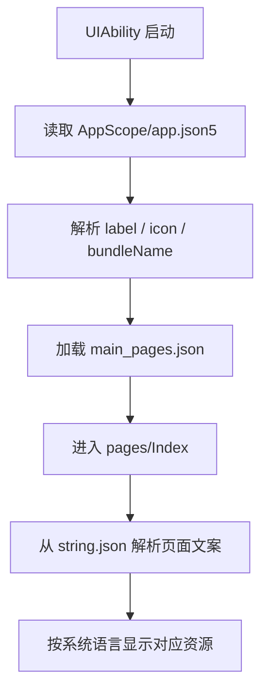

# SupportClientHuawei 资源与多语言详细技术方案

## 1. 对标范围与结论

- **参考端与证据：** iOS `SupportClient/总领文档/基础工程与运行环境/资源与多语言需求.md`；资源目录 `SupportClient/SupportClient/Projects/App/Resources/en.lproj/Localizable.strings`、`SupportClient/SupportClient/Projects/App/Resources/zh-Hans.lproj/Localizable.strings`、`SupportClient/SupportClient/Projects/App/Resources/en.lproj/InfoPlist.strings`、`SupportClient/SupportClient/Projects/App/Resources/zh-Hans.lproj/InfoPlist.strings`。
- **HarmonyOS 目标端与现状：** 已落地 `base`/`zh_CN`/`en_US` 字符串分层、产品基线文案、`Index.ets` 资源化、`Foundation/L10n/L10n.ets` 与 `BackendErrorLocalizer` 资源键映射；跟随系统语言，无应用内切语言。
- **目标用户能力：** 应用名称、入口页标题、页面文案、权限说明和图标资源可按语言与场景统一管理，系统语言切换后 UI 文案可正确跟随。
- **结论：** 资源与多语言能力为“已实现”（本期最小集）；AI 种子 JSON、第二相机专用表仍待对应功能模块。

## 2. 华为端目录设计

| 参考端目录/文件 | 参考端职责 | HarmonyOS 现有目录/文件 | HarmonyOS 目标目录/文件 | 状态 | 说明 |
| --- | --- | --- | --- | --- | --- |
| `Projects/App/Resources/en.lproj/Localizable.strings`、`zh-Hans.lproj/Localizable.strings` | 按语言分离用户可见文本 | `entry/.../base|zh_CN|en_US/element/string.json` | 同左 | 已实现 | 限定符为 `zh_CN`/`en_US` |
| `Projects/App/Resources/en.lproj/InfoPlist.strings`、`zh-Hans.lproj/InfoPlist.strings` | App 名称、权限说明等系统文案本地化 | `AppScope/.../string.json`、`module.json5` 权限 reason | 同左 | 已实现 | 应用名与权限用途说明已多语言 |
| `Projects/App/Resources/Assets.xcassets/AppIcon.appiconset` | 应用图标 | `entry/.../base/media/` | 同左 | 已有基础能力 | 图标与启动图已绑定 |
| `Projects/App/Resources/Assets.xcassets/SecondCamera` | 功能图标与颜色资源 | `base/media/` | 同左 | 待实现 | 待第二相机模块 |
| `Projects/App/Resources/AISettings/*.json` | 业务配置资源 | 无 | `rawfile/` 或后续 | 不适用 | 本期不做 |
| iOS 资源需求文档 | 需求定义 | `Index.ets`（`$r`）、`Foundation/L10n/L10n.ets` | 同左 | 已实现 | 首页与 L10n 已落地 |

## 3. 分层职责与请求链路

### 3.1 启动与资源加载流程



### 3.2 状态表

| 阶段 | 触发 | 输入 | 参与模块 | 成功 | 临时失败/恢复 | 永久失败/清理 | 用户可见状态 |
| --- | --- | --- | --- | --- | --- | --- | --- |
| 应用启动 | EntryAbility 创建窗口 | `app.json5`、`main_pages.json`、媒体资源 | EntryAbility、资源系统 | 应用名称、图标、初始页面可见 | 资源缺失时回退到默认资源 | 缺失 label/icon 需在构建期修正 | 启动页正常显示 |
| 页面渲染 | `Index.ets` build | `string.json` | ArkUI、资源管理器 | 文案按资源键显示 | 资源未找到时显示占位/报错 | 直接硬编码的文本无法随语言切换 | 页面文案可翻译 |
| 语言切换 | 系统语言变更或应用内偏好变更 | locale、语言偏好 | i18n、资源加载器、页面状态 | 重新解析对应语言资源 | 语言包缺失时回退默认语言 | 无默认语言时视为构建缺陷 | UI 文案切换到目标语言 |

## 4. 核心关键技术与实现方案

### 4.1 应用标签、图标和启动资源

#### 目标和职责边界

HarmonyOS 应用名称、图标和入口页应统一通过资源配置管理，避免把显示信息直接写死在页面里。`AppScope/app.json5` 负责应用级 label/icon/bundleName，`entry/src/main/module.json5` 负责 ability label/description/icon/startWindow 资源绑定。`bundleName` 是稳定包标识，不属于可翻译资源，也不得在任何 locale 目录覆盖。

#### iOS 当前实现

iOS 已把应用名称、权限说明和大量业务文案放入 `Localizable.strings` / `InfoPlist.strings`，并使用 `Assets.xcassets` 管理图标与功能素材。说明项目在参考端已经建立了完整的资源化边界。

#### HarmonyOS 实现路径

- `SupportClientHuawei/AppScope/app.json5`
- `SupportClientHuawei/AppScope/resources/base/element/string.json`
- `SupportClientHuawei/entry/src/main/module.json5`
- `SupportClientHuawei/entry/src/main/resources/base/element/string.json`
- `SupportClientHuawei/entry/src/main/resources/base/media/`

#### 官方资料

- [Application Configuration File (Stage Model)](https://developer.huawei.com/consumer/en/doc/harmonyos-guides/config-file-stage)
- [资源分类与访问](https://developer.huawei.com/consumer/cn/doc/harmonyos-guides/resource-categories-and-access)
- [I18n)-ArkTS API-Localization Kit（本地化开发服务）-应用框架](https://developer.huawei.com/consumer/cn/doc/harmonyos-references-v5/js-apis-i18n-V5)

用途：确认 `app.json5` / `module.json5` 的资源引用方式、`string.json` / `color.json` / `media` 的分类规则，以及 locale / i18n 能力边界。具体 locale qualifier 以目标 SDK 24 文档/DevEco 生成目录为准。

#### 本地参考

- `/Users/hua/Documents/project/Reference/ClientSub-project/SparkAndroid/SupportClientHuawei/AppScope/app.json5`
- `/Users/hua/Documents/project/Reference/ClientSub-project/SparkAndroid/SupportClientHuawei/entry/src/main/resources/base/element/string.json`
- `/Users/hua/Documents/project/Reference/ClientSub-project/SparkAndroid/Package/Huawei/agc-template-market-harmonyos-demos-main/SocialTemplate/Community/AppScope/resources/base/element/string.json`
- `/Users/hua/Documents/project/Reference/ClientSub-project/SparkAndroid/Package/Huawei/agc-template-market-harmonyos-demos-main/EducationTemplate/Exam/AppScope/resources/base/element/string.json`

可借鉴内容：

- App 名称、模块描述、ability 标签都通过资源键管理。
- 启动图标、启动背景色、主页路径都在配置文件中统一定义。

禁止直接复制内容：

- 模板中的占位包名、占位 label、占位说明文案。
- 业务无关的演示文本。

#### 示意骨架

```ts
@Entry
@Component
struct Index {
  build() {
    Column() {
      Text($r('app.string.app_name'))
      Text($r('app.string.home_title'))
    }
  }
}
```

这只是资源引用示意，具体字符串键需要按真实资源表定义；不存在的键不能在代码中硬写。

### 4.2 多语言资源分层

#### 目标和职责边界

多语言能力要求同一资源键在不同语言目录下返回不同文案。HarmonyOS 当前工程尚未建立语言目录分层，因此必须先确定目录策略，再逐步把页面文案迁移到资源系统。

#### iOS 当前实现

iOS 使用 `en.lproj` 与 `zh-Hans.lproj` 分离 `Localizable.strings`、`InfoPlist.strings` 和功能专用 `SecondCamera.strings`。这说明多语言不是单一字符串表，而是“按语言目录 + 按功能资源文件”的组合。

#### HarmonyOS 实现路径

可采用与项目规范一致的资源组织方式，把语言差异放入各语言目录，并在页面统一使用 `$r('app.string.xxx')`。具体目录和语言切换 API 需要按目标 SDK 版本复核。

#### 官方资料

- [ohos.i18n (Internationalization)](https://developer.huawei.com/consumer/en/doc/harmonyos-references/js-apis-i18n)
- [Resource](https://developer.huawei.com/consumer/en/doc/harmonyos-references/ts-types)

用途：确认 locale 管理能力和资源引用机制。

#### 本地参考

- `/Users/hua/Documents/project/Reference/ClientSub-project/SparkAndroid/SupportClient/SupportClient/Projects/App/Resources/en.lproj/Localizable.strings`
- `/Users/hua/Documents/project/Reference/ClientSub-project/SparkAndroid/SupportClient/SupportClient/Projects/App/Resources/zh-Hans.lproj/Localizable.strings`
- `/Users/hua/Documents/project/Reference/ClientSub-project/SparkAndroid/SupportClient/SupportClient/Projects/App/Resources/en.lproj/InfoPlist.strings`
- `/Users/hua/Documents/project/Reference/ClientSub-project/SparkAndroid/SupportClient/SupportClient/Projects/App/Resources/zh-Hans.lproj/InfoPlist.strings`

#### 关键规则

1. 页面内禁止散落英文或中文硬编码。
2. 功能文案、权限文案、错误文案统一走资源表。
3. 默认语言必须完整，非默认语言可以逐步补齐，但缺项要明确回退策略。

### 4.3 页面级资源消耗与状态更新

#### 目标和职责边界

页面层只消费资源，不负责维护资源表。`Index.ets`、后续主页、设置页和登录页都应通过 `Resource` 引用获取文案、颜色和图标，不在页面组件中拼接静态文本。

#### 目前实现

`SupportClientHuawei/entry/src/main/ets/pages/Index.ets` 还在使用 `@State message = 'Hello World'`，点击后切换为 `Welcome`，说明当前仍是演示页面，未接入统一资源表。虽然应用名 `app_name` 已在 `AppScope/resources/base/element/string.json` 中定义，但主页正文、页面标题和业务文案仍然没有迁移到同一套资源键。

#### 目标实现

- 页面文案全部替换为资源键。
- 切换系统语言时由框架重新解析资源。
- 不同功能页面可以共用同一个字符串命名规范，例如 `auth.*`、`settings.*`、`home.*`。

#### 验收规则

- 页面中不存在硬编码业务文案。
- 语言切换后，主要入口页可正确显示目标语言。
- App 名称、权限描述和功能标题统一从资源读取。

### 4.4 测试与校验

#### 目标

资源与多语言模块的测试应覆盖资源键缺失、默认语言回退、图标与 label 绑定、页面文案切换和系统语言变化。

#### 本地可运行参考

- `SupportClientHuawei/entry/src/test/LocalUnit.test.ets`
- `SupportClientHuawei/entry/src/ohosTest/module.json5`
- `Package/Huawei/agc-template-market-harmonyos-demos-main/SocialTemplate/Community/products/entry/src/test/LocalUnit.test.ets`

#### 禁止复用

- 只验证模板字符串的空洞测试。
- 不断言真实资源键的测试。

### 4.5 资源键命名、构建校验与语言回退

#### 固定的命名与所有权

资源键不是页面文件名的镜像，按“功能域.对象.用途”命名；同一语义只保留一个键，文案变化不能通过新增近义键逃避翻译维护。建议在文案字典中维护 owner、默认语言和是否允许变量插值。

| 域 | 键模式 | 示例 | owner | 是否允许参数 | 说明 |
| --- | --- | --- | --- | --- | --- |
| 应用与系统 | `app.*` / `ability.*` | `app.name`、`ability.entry.label` | App | 否 | 对应 `app.json5` / `module.json5` 引用，安装前必须存在 |
| 通用 | `common.action.*` / `common.error.*` | `common.action.confirm` | Foundation | 是，命名参数 | 不能把 feature 文案塞入 common |
| 认证 | `auth.*` | `auth.otp.resend` | Auth | 是 | 隐私/协议/错误文案与 API 错误码映射分离 |
| 设置 | `settings.*` | `settings.account.title` | Settings | 否 | 只服务 Settings 范围 |
| 相机 | `camera.*` | `camera.permission.explain` | SecondCamera | 是 | 权限用途文案由产品/法务确认 |

#### 语言选择与回退策略

1. 基线语言为 `base`；每次新增键先在基线语言完整落地，再补 `zh-Hans`、`en` 等已批准语言。
2. 资源加载遵循系统/应用偏好匹配；某语言没有相同键时回退至 `base`。若基线也没有，则视为构建缺陷，不允许用页面硬编码补救。
3. 应用内“手动切语言”不是当前需求中的既有能力；在产品未确认前只支持系统语言/框架资源刷新。若未来引入应用偏好语言，必须定义偏好 key、作用域、重启/刷新语义与与系统语言的优先级。
4. `string.json` 只存用户可见静态文本；服务器业务内容、远端开关、证书、密钥、URL、设备/账号数据不能进入资源文件。

#### 最小构建守卫（示意）

```ts
// 建议作为本地检查/CI 规则，而不是运行时修复。
const requiredResourceRefs = [
  '$string:app_name',
  '$string:module_desc',
  '$string:EntryAbility_desc',
  '$string:EntryAbility_label'
]
// 读取配置中的 $string:* 后与 base/element/string.json 的 name 集合比较；
// 任一缺失即失败。当前 app_name 应在该检查中失败。
```

此处不建议伪造运行时 `ResourceManager` API 骨架；资源目录、限定符和语言切换的实际 API 必须在 DevEco SDK 24 POC 中编译验证后再进入实现代码。

## 5. 接口契约与数据模型

### 5.1 通用数据与状态

| 模型/属性 | 外部字段名（JSON/DB/Preferences/文件） | ArkTS 类型 | 必填 | 敏感 | 来源与验证 | 生命周期/持久化 | 兼容规则 |
| --- | --- | --- | --- | --- | --- | --- | --- |
| 应用名称 | `app.json5.app.label`、`string.json.app_name` | `string` | 是 | 否 | `AppScope/resources/base/element/string.json` 已定义 `app_name` | 安装包级别 | 默认语言必须存在；缺失即构建阻断 |
| 模块描述 | `module.json5.module.description` | `string` | 是 | 否 | 当前项目已存在 | 构建时读取 | 多语言目录可覆盖 |
| Ability 标签 | `module.json5.abilities[].label` | `string` | 是 | 否 | 当前项目已存在 | 构建时读取 | 与应用名/页面标题一致 |
| 启动背景色 | `color.json.start_window_background` | `Color`/hex string | 是 | 否 | 当前项目已存在 | 启动页级别 | 保持浅/深色兼容 |
| 页面文案 | `string.json` 各资源键 | `string` | 否 | 否 | 当前项目部分存在 | 页面级，随语言切换 | 缺失时回退默认语言 |

### 5.2 配置与资源文件字段字典

| 文件/字段 | 当前值或现状 | 类型 | 必填 | 可本地化 | 验证规则 | 消费者 | 当前结论 |
| --- | --- | --- | --- | --- | --- | --- | --- |
| `AppScope/app.json5.app.bundleName` | `cn.zhaodk.SupportClient` | `string` | 是 | 否 | 包标识稳定、符合发布配置；变更需迁移策略 | 系统安装/应用身份 | 已存在，不得翻译 |
| `AppScope/app.json5.app.label` | `$string:app_name` | 资源引用 | 是 | 是 | 引用键必须在基线资源存在 | 系统应用名 | 已定义于 `AppScope/resources/base/element/string.json` |
| `AppScope/app.json5.app.icon` | `$media:layered_image` | 媒体引用 | 是 | 否（可按限定资源适配） | 对应媒体资源必须存在 | 系统图标 | 已配置，需实际构建验证 |
| `module.json5.module.name` | `entry` | `string` | 是 | 否 | 模块标识稳定，不能随文案改动 | 构建系统 | 已存在 |
| `module.json5.module.description` | `$string:module_desc` | 资源引用 | 是 | 是 | 基线键必须存在 | 系统模块描述 | 已存在 |
| `abilities[0].name` | `EntryAbility` | `string` | 是 | 否 | 与 `mainElement`、`srcEntry` 一致 | Ability 框架 | 已存在 |
| `abilities[0].label` | `$string:EntryAbility_label` | 资源引用 | 是 | 是 | 基线键必须存在 | 桌面/系统展示 | 已存在 |
| `abilities[0].description` | `$string:EntryAbility_desc` | 资源引用 | 是 | 是 | 基线键必须存在 | 系统描述 | 已存在 |
| `abilities[0].startWindowIcon` | `$media:startIcon` | 媒体引用 | 是 | 否 | 媒体文件/资源名存在 | 启动窗口 | 已配置 |
| `abilities[0].startWindowBackground` | `$color:start_window_background` | 色彩引用 | 是 | 否 | `color.json` 含同名键、深浅色策略已验证 | 启动窗口 | 已配置，需 UI 验收 |
| `AppScope/base/element/string.json.string[].name` | `app_name` | `string` | 是 | 是 | 全局唯一；与 `$string:app_name` 精确匹配 | ArkUI/配置 | 已定义 |
| `entry/base/element/string.json.string[].name` | `module_desc`、`EntryAbility_desc`、`EntryAbility_label` | `string` | 是 | 是 | 全局唯一；与 `$string:*` 精确匹配 | ArkUI/配置 | 已定义，但仍为模板英文占位 |
| `entry/base/element/string.json.string[].value` | 模板英文占位 | `string` | 是 | 是 | 不可含 secret/服务端数据；参数规则需在字典定义 | ArkUI/配置 | 需改成产品基线文案 |
| `pages/Index.ets` 文案 | `Hello World` / `Welcome` | 字面量 | 否 | 否 | CI 禁止用户可见业务文本硬编码 | 首页 | 待迁移到资源键 |

### 5.3 文案变量、数量与格式规则

| 场景 | 数据模型 | 必填字段 | 校验与本地化规则 | 错误处理 |
| --- | --- | --- | --- | --- |
| 带名称欢迎语 | `{ displayName: string }` | `displayName` | 长度 1–40；以参数方式格式化，禁止字符串拼接 | 缺失时用通用称谓或不展示名称 |
| 数量文案 | `{ count: number }` | `count` | 非负整数；不同语言的单复数/量词由资源规则处理 | 非法值记录诊断并回退 `0`/隐藏 |
| 时间日期 | `{ instantMs: number, locale?: string }` | `instantMs` | 以 i18n/系统 locale 格式化；不可把格式化后字符串缓存成业务事实 | 无效时间显示统一占位 |
| 服务端错误 | `{ code: string, fallbackKey: string }` | `code` | 后端 code 映射本地资源键，禁止直显服务端 message | 未命中使用 `common.error.unknown` |
| 权限用途说明 | `{ permission: string, purposeKey: string }` | 两者 | permission 与 `module.json5`/业务权限声明对应；文案需产品/法务确认 | 缺说明时阻止相关能力进入发布验收 |

### 5.4 资源与系统对象

| 操作/模型 | 输入/输出 | 方法与路径或系统 API | 鉴权/权限 | 缓存/并发策略 | 消费位置 | 证据 |
| --- | --- | --- | --- | --- | --- | --- |
| 读取应用 label/icon | `app.json5` / 系统标签 | `AppScope/app.json5` | 无 | 构建期缓存 | 启动时 | 当前项目已有 |
| 读取字符串 | 资源键 / 文案 | `$r('app.string.xxx')` | 无 | 框架缓存 | 所有页面 | 官方资源引用方式 + 本地模板 |
| locale 切换 | 当前语言 / 新语言 | 系统/应用偏好语言与资源匹配能力（SDK 24 POC 后定 API） | 无 | 由框架调度刷新 | 全局 UI | [资源分类与访问](https://developer.huawei.com/consumer/cn/doc/harmonyos-guides/resource-categories-and-access)、[I18n)-ArkTS API-Localization Kit（本地化开发服务）-应用框架](https://developer.huawei.com/consumer/cn/doc/harmonyos-references-v5/js-apis-i18n-V5) |
| 权限说明文案 | 资源键 / 权限用途说明 | `InfoPlist.strings` 对标的资源文案 | 无 | 构建期与发布期同步 | 权限弹窗、设置页 | iOS 参考端已验证 |

## 6. iOS-HarmonyOS 功能对照矩阵

| 参考端能力/证据 | 可观察行为 | HarmonyOS 实现/证据 | 官方能力 | 本地示例 | 对齐状态 | 差异与处理 |
| --- | --- | --- | --- | --- | --- | --- |
| `en.lproj` / `zh-Hans.lproj` 多语言目录 | 同一键在不同语言下显示不同文案 | `resources/{base,zh_CN,en_US}/element/string.json`、`Index.ets` | `ohos.i18n`、`$r(...)` | 工程内 locale 目录 | 已实现 | 跟随系统语言；无应用内偏好 |
| `Localizable.strings` / `InfoPlist.strings` | 权限说明、应用名和 UI 文案资源化 | `AppScope`/`entry` string.json、`module.json5` reason | 资源系统 + 应用配置 | 同上 | 已实现 | 产品基线中/英已齐 |
| `Assets.xcassets` 图标资源 | 图标与功能素材按资产目录管理 | `base/media/` | 媒体资源目录 | 同上 | 已验证对齐（图标层面） | 业务图标待功能模块 |

## 7. 示例工程与官方文档参考结论

| 类型 | 标题/代码位置 | URL/绝对路径 | 可借鉴内容 | 禁止直接复制/版本注意事项 |
| --- | --- | --- | --- | --- |
| 官方文档 | HarmonyOS 开发文档中心：资源与本地化索引 | https://developer.huawei.com/consumer/cn/doc/ | 核对“资源限定与访问”“应用国际化”“应用偏好语言”“多语言适配”等当前 SDK 条目 | 页面/API 随版本更新；以目标 SDK 24 内容为准 |
| 官方文档 | ArkTS Resource 类型参考 | https://developer.huawei.com/consumer/en/doc/harmonyos-references/ts-types | 核对 `$r(...)` 等资源类型在组件属性中的使用语义 | 不用泛化类型页推断 locale 限定目录名称 |
| 官方文档 | Localization Kit 导航（国际化与本地化） | https://developer.huawei.com/consumer/cn/doc/harmonyos-guides/system-language-and-region | 复核系统语言区域、应用偏好语言、多语言适配与测试入口 | 若 URL/章节迁移，回到开发文档中心按标题检索；具体 API 必须 POC 编译验证 |
| 本地示例 | `/Users/hua/Documents/project/Reference/ClientSub-project/SparkAndroid/SupportClientHuawei/AppScope/app.json5` | 绝对路径 | 应用 label/icon 通过资源键管理 | 占位 label 不能直接沿用到生产 |
| 本地示例 | `/Users/hua/Documents/project/Reference/ClientSub-project/SparkAndroid/SupportClientHuawei/entry/src/main/resources/base/element/string.json` | 绝对路径 | 资源键组织方式 | 目前只有单语言占位文案 |
| 本地示例 | `/Users/hua/Documents/project/Reference/ClientSub-project/SparkAndroid/SupportClientHuawei/entry/src/main/ets/pages/Index.ets` | 绝对路径 | 页面当前状态是硬编码演示，便于识别待迁移点 | `Hello World` 和 `Welcome` 不可进入正式文案 |
| 本地示例 | `/Users/hua/Documents/project/Reference/ClientSub-project/SparkAndroid/Package/Huawei/agc-template-market-harmonyos-demos-main/SocialTemplate/Community/AppScope/resources/base/element/string.json` | 绝对路径 | 模板项目如何通过资源键组织应用名和模块说明 | 模板占位值不可复制 |
| 本地示例 | `/Users/hua/Documents/project/Reference/ClientSub-project/SparkAndroid/SupportClient/SupportClient/Projects/App/Resources/en.lproj/Localizable.strings` | 绝对路径 | iOS 侧双语字符串表的组织方式 | 不能把 iOS 文件结构直接搬到 HarmonyOS |

## 8. 实施拆分与验收

| 阶段 | 目标文件/模块 | 依赖 | 实施结果 | 自动化测试 | 人工验收 | 状态 |
| --- | --- | --- | --- | --- | --- | --- |
| 1 | `AppScope/app.json5`、`module.json5` | 资源命名规范 | 应用名、模块描述、Ability 标签资源化 | 配置检查 | 应用名称正确显示 | 已完成 |
| 2 | `string.json` | 资源键命名表 | 页面文案抽离 | 单测/快照 | 切换页面后文案仍正确 | 已完成 |
| 3 | locale 目录 | 官方 i18n 能力 | 双语或多语资源可切换 | 语言切换测试 | 系统语言切换后 UI 可读 | 已完成 |
| 4 | `main_pages.json`、`Index.ets` | 页面资源引用 | 首页不再硬编码 | 资源缺失测试 | 启动页和入口页一致 | 已完成 |
| 5 | 图标和启动背景 | `base/media`、`color.json` | 图标与启动样式规范化 | 构建校验 | 启动页样式稳定 | 已有（保持） |

## 9. 风险与待确认项

| 编号 | 风险/待确认项 | 影响模块 | 证据 | 依赖方 | 关闭条件 |
| --- | --- | --- | --- | --- | --- |
| R-01 | 语言目录和资源键规范尚未统一 | 全部文案 | 当前仅有 `base/element/string.json` | 设计/开发 | 确认多语言目录和命名规则 |
| R-02 | 页面仍有硬编码文本 | 首页 | `Index.ets` 使用 `Hello World` / `Welcome` | 前端实现 | 页面文案全部资源化 |
| R-03 | 权限说明文案是否需要按语言分发 | 权限与设置页 | iOS 参考端已使用 `InfoPlist.strings` | 产品/法务 | 确认语言覆盖范围 |
| R-04 | HarmonyOS 语言切换 API 与资源目录是否需要按目标 SDK 调整 | 全局 locale | 官方文档需按 SDK 24 复核 | 平台实现 | 通过 SDK 24 POC 验证 |
| R-05 | `app.json5` 引用了不存在的 `$string:app_name` | 安装包 label/构建 | 当前 `app.json5` 与 `base/element/string.json` 实际内容 | 基础工程 | 在基线资源补齐 `app_name` 并完成构建校验 |
| R-06 | 是否支持应用内独立语言偏好尚未确认 | 多语言状态与设置页 | 当前仅有系统语言需求，无实现 | 产品/设计 | 明确“跟随系统”或“应用内选择”及可支持语言表 |
