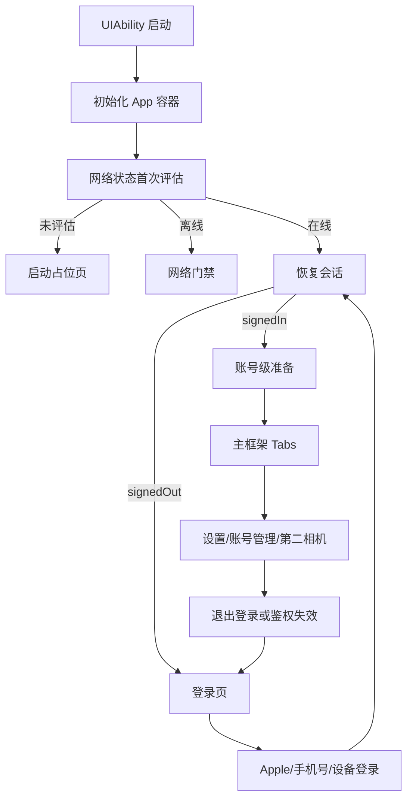

# SupportClientHuawei｜路由与页面导航详细技术方案

## 1. 对标范围与结论

- **参考端与证据：** `SupportClient/总领文档/基础工程与运行环境/路由与页面导航需求.md`；参考实现主要来自 `SupportClient/Projects/App/Sources/App/AppCoordinatorView.swift`、`SupportClient/Projects/App/Sources/App/Architecture/RouteCoordinator.swift`、`SupportClient/Projects/App/Sources/App/Architecture/AppLifecycleCoordinator.swift`、`SupportClient/Projects/Features/Auth/Presentation/LoginView.swift`、`SupportClient/Projects/Features/Auth/Presentation/PhoneLoginView.swift`、`SupportClient/Projects/Features/Settings/Presentation/SettingsView.swift`、`SupportClient/Projects/Features/SecondCamera/Presentation/SecondCameraHomeView.swift`。
- **HarmonyOS 目标端与现状：** 路由壳已落地：`AppSessionStore` / `RouteCoordinator` / `DeviceIdentity` / `NotificationHost`；根页 `pages/Index.ets` 按会话态切换；主框架 `MainTabsPage`（首页/对话/设置，`Tabs` + `BarPosition.End`）；二级页经 `appRouter` 压入根 `NavPathStack`，跳转后统一隐藏底部 Tab（对齐 Recycling）；登录壳支持设备游客登录与手机号/OTP 局部导航；设置支持账号、AI 设置、升级登录 `bindSheet`、退出登录；`SessionInvalidation` 经 `RouteCoordinator` 幂等回登录。
- **目标用户能力：** 冷启动后可进入根页面；登录态和未登录态可切换；主框架可通过底部 Tab 进入首页、对话和设置；二级业务页全屏展示（无底部 Tab）；设置可进入账号管理与 AI 设置；系统鉴权失效可回到登录态。
- **结论：** 华为端已实现可运行的**路由壳**（`UIAbility + Navigation + Tabs + 根 NavPathStack/appRouter`）。完整 OTP 闭环、Apple 登录、深链 allowlist 等仍待后续模块。

**当前实现状态（2026-07-23）：** 根栈二级导航与 Tab 隐藏已按 Recycling 模式落地；单测见 `entry/src/test/ets/Routing/RoutingShell.test.ets`。

## 2. 华为端目录设计

| 参考端目录/文件 | 参考端职责 | HarmonyOS 现有目录/文件 | HarmonyOS 目标目录/文件 | 状态 | 说明 |
| --- | --- | --- | --- | --- | --- |
| `SupportClient/Projects/App/Sources/ContentView.swift` | App 入口壳、通知宿主、系统路由入口 | `pages/Index.ets` + `App/NotificationHost.ets` | `entry/src/main/ets/pages/Index.ets` | 已实现（壳） | 根协调页承载会话态与 toast 覆盖层 |
| `SupportClient/Projects/App/Sources/App/Architecture/RouteCoordinator.swift` | 系统事件统一路由 | `App/RouteCoordinator.ets` | `entry/src/main/ets/App/RouteCoordinator.ets` | 已实现（壳） | 已接 `SessionInvalidation`；深链为空实现预留 |
| `SupportClient/Projects/App/Sources/App/AppCoordinatorView.swift` | 根会话路由、Tab 容器、升级登录 sheet | `App/AppSessionStore.ets`、`Projects/App/MainTabsPage.ets` | 同上 | 已实现（壳） | 会话恢复简化为 refresh token 有无 |
| `SupportClient/Projects/Features/Auth/Presentation/LoginView.swift`、`PhoneLoginView.swift` | 登录页和手机号/OTP 局部路由 | `Projects/Features/Auth/LoginPage.ets`、`PhoneLoginPage.ets`、`OtpVerifyPage.ets` | `Projects/Features/Auth/` | 已实现 | 设备/OTP 局部 Navigation；协议 Web 同栈 |
| `SupportClient/Projects/Features/Settings/Presentation/SettingsView.swift` | 设置页入口与 AI 跳转 | `Projects/Features/Settings/SettingsPage.ets` | `Projects/Features/Settings/` | 部分实现 | 账号/升级 sheet/退出已有；AI 设置待后续 |
| `SupportClient/Projects/Features/AccountManagement/Presentation/AccountManagementView.swift` | 账号管理页和退出/注销 | `Projects/Features/AccountManagement/AccountPlaceholderPage.ets` | `Projects/Features/AccountManagement/` | 部分实现 | 占位页；退出在设置页 |
| `SupportClient/Projects/Features/SecondCamera/Presentation/SecondCameraHomeView.swift` | 第二相机全屏路由和预览回流 | `Projects/Features/SecondCamera/CameraPlaceholderPage.ets` | `Projects/Features/SecondCamera/` | 部分实现 | Tab 占位；真实相机待模块 |
| `SupportClient/Projects/App/Sources/App/Notification/NotificationHostView.swift` | banner/toast/alert 覆盖层 | `App/NotificationHost.ets` | `App/NotificationHost.ets` | 部分实现 | 最小 toast 状态；无推送业务 |

路由壳目录已按业务职责拆分；OTP/相机/深链完整能力仍按阶段补齐。

## 3. 分层职责与请求链路

### 3.1 当前实现事实

```text
EntryAbility.onCreate
  → L10n.bindContext + AppContainer.live
  → AppSessionStore.restoreIfNeeded（异步）
  → RouteCoordinator.start（订阅 SessionInvalidation）
EntryAbility.onWindowStageCreate
  → windowStage.loadContent('pages/Index')
  → Index 按 AppStorage sessionState 展示 Launch / Login / MainTabs
```

### 3.2 目标端主流程



### 3.3 状态表

| 阶段 | 触发 | 输入 | 参与模块 | 成功 | 临时失败/恢复 | 永久失败/清理 | 用户可见状态 |
| --- | --- | --- | --- | --- | --- | --- | --- |
| 启动 | `UIAbility.onWindowStageCreate` | `Want`、窗口阶段 | `EntryAbility`、App 容器 | 加载根页面 | 窗口未就绪重试 | 入口异常则停在系统层 | 启动占位页 |
| 恢复 | 网络可用后首次评估 | 会话快照、Token | SessionStore、Lifecycle | 进入登录页或主框架 | 网络恢复后重试 | 清理会话后回登录 | 启动页/登录页 |
| 登录 | 登录按钮、手机号 OTP、设备登录 | 用户输入、认证结果 | 登录页、认证仓储 | 更新会话并进入主框架 | OTP 失败可重发 | 明确失效则清理 | 登录页/OTP 页 |
| 主框架 | 会话已恢复且账号准备完成 | `UserSession` | Tab 容器、各 Feature | 展示首页/相机/设置 | 某 tab 局部失败不影响其他 tab | 账号失效回登录 | 主界面 |
| 升级登录 | 游客账号点账户入口 | 游客会话 | 设置页、登录 sheet | 切换为正式账号 | 取消 sheet | 关闭 sheet 保持当前态 | 半模态登录页 |
| 鉴权失效 | 401 / 服务端失效通知 | 失效消息 | RouteCoordinator、Lifecycle | 回到未登录态 | 再次失效忽略重复处理 | 清理 token 和账号缓存 | 强制回登录 |

## 4. 核心关键技术与实现方案

### 4.1 入口与生命周期

**目标和职责边界：** `EntryAbility` 只负责应用窗口生命周期和根页面挂载；真正的导航状态应由 App 容器和会话协调器管理，避免 UIAbility 里直接写业务跳转逻辑。

**iOS 当前实现：** `ContentView` 包裹 `NotificationHostView` 并启动 `AppCoordinatorView`；`AppCoordinatorView` 根据 `AppSessionStore` / `AppLifecycleCoordinator` 选择启动页、登录页或主框架。

**HarmonyOS 实现路径：**

- `entry/src/main/ets/entryability/EntryAbility.ets` 保留为应用级入口。
- `entry/src/main/ets/App/` 新建 App 容器、会话存储、路由协调器和生命周期协调器。
- `entry/src/main/ets/pages/Index.ets` 从 Hello World 改为根路由页，承载启动占位、登录页和主框架切换。

**官方资料：**

- [Application Development Overview](https://developer.huawei.com/consumer/en/doc/harmonyos-guides/application-dev-guide)。
- [UIAbility组件概述](https://developer.huawei.com/consumer/cn/doc/harmonyos-guides/uiability-overview)。
- [UIAbility组件生命周期](https://developer.huawei.com/consumer/cn/doc/harmonyos-guides/uiability-lifecycle)。
- 目标 API Level：`6.1.1(24)`，实施前需按当前 SDK 再复核签名。

**本地示例：**

- `/Users/hua/Documents/project/Reference/ClientSub-project/SparkAndroid/Package/Huawei/agc-template-market-harmonyos-demos-main/HouseAndHomeTemplate/HomeDecoration/products/entry/src/main/ets/pages/MainEntry.ets`：可借鉴 `Navigation + Tabs + TabsController` 的页面组织方式，不能直接复制业务 tab 项、全局路由键和资源名。
- `/Users/hua/Documents/project/Reference/ClientSub-project/SparkAndroid/Package/Huawei/agc-template-market-harmonyos-demos-main/HouseAndHomeTemplate/RentAndBuy/product/entry/src/main/ets/pages/Index.ets`：可借鉴顶层 `Navigation(RouterModule.stack)` 包裹 `Tabs` 的组合方式，不能复制其特定 RouterModule 绑定或业务路由命名。

**ArkTS 代码骨架（示意）：**

```ts
@Entry
@Component
struct RootIndex {
  @State sessionState: 'loading' | 'signedOut' | 'signedIn' = 'loading'
  private stack: NavPathStack = new NavPathStack()

  build() {
    Navigation(this.stack) {
      if (this.sessionState === 'loading') {
        LaunchPlaceholder()
      } else if (this.sessionState === 'signedOut') {
        LoginPage()
      } else {
        MainTabsPage()
      }
    }.hideTitleBar(true)
  }
}
```

**安全、权限与验收规则：**

- UIAbility 内不能直接持有 Token、API Key 或具体路由 payload。
- 启动页与登录页切换必须可重入，不依赖一次性页面初始化顺序。
- 任何根路由实现都要把“未评估”和“离线”分开。

### 4.2 根页面、Tabs 和页面栈

**目标和职责边界：** `Index` 持有唯一业务根 `NavPathStack`；`MainTabsPage` 只承载底部 Tab 根内容；**所有二级页**经 `appRouter.jumpPage` 压入根栈，覆盖 Tab 壳，从而统一隐藏底部 Tab（对齐 Recycling `phoneRouterControl.jumpPage` / `ValuationInfoHostPage`）。

**iOS 当前实现：** `SupportMainCoordinatorView` 内使用 `TabView`，首页、相机、设置各自有独立 `NavigationStack`；设置页通过 `NavigationPath` 进入账号管理页。iOS 可用 `.toolbar(.hidden, for: .tabBar)` 隐藏 Tab；鸿蒙侧采用「根栈覆盖」实现同等效果。

**HarmonyOS 实现路径（已落地）：**

- `pages/Index.ets`：`Navigation(rootStack)` + `navDestination(AppRootNavDestinationBuilder)`；会话壳内容为 `MainTabsPage`。
- `Projects/App/MainTabsPage.ets`：`Tabs` + `BarPosition.End`（首页 / 对话 / 设置），**Tab 内不再套二级 Navigation**。
- `App/Navigation/AppRouter.ets`：绑定根栈，提供 `jumpPage` / `popPage` / `clear`。
- `App/Navigation/AppRootNavDestination.ets`：集中解析 `home.*` / `chat.detail` / `settings.account` / `settings.ai`。
- 登录模块内部仍可用局部 `NavPathStack`（不影响主框架 Tab）。
- 游客升级入口继续用 `bindSheet`。

**本地示例：**

- `开发详细技术文档/agc-template-market-harmonyos-demos-main/LifestyleAndServiceTemplate/Recycling/products/entry/src/main/ets/pages/HomePage.ets`：`Tabs` + `BarPosition.End`。
- 同目录 `Index.ets` + `oh_router` `PhoneRouterManager.jumpPage`：二级页压根栈、离开 Tab 壳。
- 同工程 `ValuationInfoHostPage.ets`：宿主页 + `jumpPage` 填写估价信息。

**ArkTS 代码骨架（示意）：**

```ts
// Index
Navigation(this.rootStack) {
  MainTabsPage() // Tabs 仅根内容
}
.navDestination((name: string) => AppRootNavDestinationBuilder(name))

// 任意 Tab 内跳二级
appRouter.jumpPage('home.medical.healthExam')
```

**安全、权限与验收规则：**

- 二级页打开后底部 Tab 必须不可见；返回 `popPage` 后 Tab 恢复。
- 登出 / 非 `signedIn` 时 `appRouter.clear()` 清空根栈。
- 账号切换后清掉与账号绑定的缓存（含 `HomeViewModel` cache）。
- Tab 根页之间不共享可变页面实例；二级页通过 `AppContainer.createHomeViewModel()` 复用同账号缓存 VM。

### 4.3 登录页、局部导航和半模态弹层

**目标和职责边界：** 登录页需要支持 Apple / 手机号 / OTP / 游客升级等局部流程；同意协议弹层、OTP 页面和升级登录 sheet 都属于登录模块内部路由，不影响主框架状态。

**iOS 当前实现：** `LoginView` 使用局部 `LoginRoute.phone` 进入手机号登录页，`PhoneLoginView` 再进入 OTP 验证；游客账号在主框架设置页通过 `sheet` 打开升级登录页；法律确认通过 sheet 单独确认。

**HarmonyOS 实现路径：**

- 登录主页面建议放在 `Projects/Features/Auth/`。
- 手机号/OTP 适合用 `Navigation(this.loginStack)` + 子页面 push。
- 协议确认和升级登录建议用统一的半模态容器，复用 `sheet` 样式。
- 登录成功后，由会话状态切换驱动返回主框架，不在登录页里手工跳回主页。

**官方资料：**

- [Navigation 页面路由](https://developer.huawei.com/consumer/cn/doc/harmonyos-guides/arkts-navigation-navigation)。
- [支持焦点处理](https://developer.huawei.com/consumer/cn/doc/HarmonyOS-Guides/arkts-common-events-focus-event)。

**本地示例：**

- `/Users/hua/Documents/project/Reference/ClientSub-project/SparkAndroid/Package/Huawei/agc-template-market-harmonyos-demos-main/LifestyleAndServiceTemplate/GovernmentService/Application/components/aggregated_login/src/main/ets/utils/LoginSheetUtils.ets`：可借鉴统一登录 sheet 的打开/关闭组织方式，不能直接复制其微信 SDK、硬编码 AppId 或示例文案。
- `/Users/hua/Documents/project/Reference/ClientSub-project/SparkAndroid/Package/Huawei/agc-template-market-harmonyos-demos-main/LifestyleAndServiceTemplate/GovernmentService/Application/components/aggregated_login/src/main/ets/viewmodel/AggregatedLoginVM.ets`：可借鉴登录页内通过 `NavPathStack.pushPathByName` 进入手机号登录页的局部路由方式，不能复制其微信登录和明文示例账号。

**ArkTS 代码骨架（示意）：**

```ts
Navigation(this.loginStack) {
  LoginHomePage({
    onPhoneLogin: () => this.loginStack.pushPathByName('PhoneLoginPage'),
    onUpgradeGuest: () => this.showUpgradeSheet = true
  })
}

// 升级登录 sheet 仅示意，具体 API 以当前 SDK 为准
// 采用组件绑定方式，关闭回调必须只改变本地弹层状态。
Column() { SettingsPage() }
  .bindSheet(this.showUpgradeSheet, UpgradeLoginPage(), {
    onDisappear: () => { this.showUpgradeSheet = false }
  })
```

**安全、权限与验收规则：**

- 协议确认结果可持久化，但不得写入敏感凭证。
- 手机号、OTP 和登录态切换不得在日志中明文输出。
- 登录取消后回到原页，不能进入主框架。

#### 路由状态机与并发闸门

所有外部事件先转换为 `RouteEvent`，由根协调器串行消费；不能让网络回调、通知点击和 `onForeground` 同时直接 push/pop 页面。事件处理需有 generation（账号/会话代次）校验：异步任务返回时 generation 不一致则丢弃结果，避免旧账号把新账号带回旧页面。

```ts
type RouteEvent =
  | { type: 'SESSION_RESTORED'; generation: number; accountId?: number }
  | { type: 'AUTH_INVALIDATED'; generation: number; reasonCode: string }
  | { type: 'TAB_SELECTED'; tab: MainTab }
  | { type: 'OPEN_ROUTE'; name: RouteName; params?: RouteParams }
  | { type: 'SHEET_DISMISSED'; sheet: SheetName }

class RouteCoordinator {
  private handlingInvalidation = false
  handle(event: RouteEvent): void {
    if (event.type === 'AUTH_INVALIDATED') {
      if (this.handlingInvalidation) return
      this.handlingInvalidation = true
      // 先清会话和账号级栈，再置 signedOut；finally 内恢复开关。
    }
  }
}
```

### 4.4 系统事件、深链和通知覆盖层

**目标和职责边界：** 系统鉴权失效、深链和通知都应先进入统一入口，再决定是展示提示还是切回登录态；通知覆盖层只负责展示，不负责改写页面栈。

**iOS 当前实现：** `RouteCoordinator` 监听 `SupportAuthSessionInvalidation` 通知；`ContentView` 启动系统路由并接收 `onOpenURL`；`NotificationHostView` 只是 UI 覆盖层。

**HarmonyOS 实现路径：**

- `EntryAbility` 或 App 容器中建立统一事件接入点。
- 使用事件总线或页面级状态对象接 deep link、登录失效和通知点击。
- 通知提示建议作为覆盖层组件，而不是独立顶层页面。

**官方资料：**

- [应用生命周期概述](https://developer.huawei.com/consumer/cn/doc/harmonyos-guides/application-lifecycle)。
- [UIAbility组件生命周期](https://developer.huawei.com/consumer/cn/doc/harmonyos-guides/uiability-lifecycle)。

**本地示例：**

- `/Users/hua/Documents/project/Reference/ClientSub-project/SparkAndroid/Package/Huawei/agc-template-market-harmonyos-demos-main/HouseAndHomeTemplate/HomeDecoration/components/module_posting/src/main/ets/pages/FeedbackPage.ets`：可借鉴通过页面栈进入子页面后保持上层状态的写法，不能复制其业务路由名。
- `/Users/hua/Documents/project/Reference/ClientSub-project/SparkAndroid/Package/Huawei/agc-template-market-harmonyos-demos-main/SocialTemplate/Community/commons/common/src/main/ets/ui/MessageJumpManager.ets`：可借鉴消息点击后的统一跳转管理思想，不能复制其社交业务路由或消息结构。

**ArkTS 代码骨架（示意）：**

```ts
class RouteCoordinator {
  onAuthInvalidated(message: string) {
    this.lifecycle.signOutAndReset(message)
  }

  onDeepLink(url: string) {
    this.notificationCenter.handleLink(url)
  }
}
```

**安全、权限与验收规则：**

- 鉴权失效必须统一清理 token 和账号缓存。
- 深链参数不得直接作为路由键进入全局状态。
- 通知覆盖层不可阻塞主路由的恢复逻辑。

### 4.5 测试、清理与失败恢复

**目标和职责边界：** 路由模块需要覆盖启动、登录、Tab 切换、弹层关闭、账号切换和鉴权失效的恢复路径；如果没有自动化测试，必须在文档中明确为缺口。

**iOS 当前实现：** 现有测试主要集中在认证会话持久化和失效通知，未见专门的导航 UI 测试。

**HarmonyOS 实现路径：**

- 为根页面状态切换写 UI 测试。
- 为 `Tabs` / `NavPathStack` / `sheet` 的边界行为写单元或 UI 测试。
- 为鉴权失效和登录恢复写端到端测试。

**官方资料：**

- [Black-box Test with Coverage](https://developer.huawei.com/consumer/cn/doc/harmonyos-guides/ide-ui-test)。

**本地示例：**

- `entry/src/ohosTest/ets/test/Ability.test.ets`：可作为 UIAbility 测试入口的参考。
- `entry/src/test/LocalUnit.test.ets`：可作为本地单元测试结构的参考。

**ArkTS 代码骨架（示意）：**

```ts
test('signedOut shows login page', async () => {
  const page = await launchAppRoot()
  expect(page.findText('登录')).toBeTruthy()
})
```

**安全、权限与验收规则：**

- 测试中不得打印 Token、OTP、API Key 或完整错误原文。
- 账号切换、登出和恢复都必须清理页面状态与缓存。

## 5. 接口契约与数据模型

### 5.1 通用数据与状态

| 模型/属性 | 外部字段名（JSON/DB/Preferences/文件） | ArkTS 类型 | 必填 | 敏感 | 来源与验证 | 生命周期/持久化 | 兼容规则 |
| --- | --- | --- | --- | --- | --- | --- | --- |
| `sessionState` | 内存状态 | `'loading' \| 'signedOut' \| 'signedIn'` | 是 | 否 | App 生命周期与会话恢复 | 仅内存 | 与 iOS 会话枚举语义一致 |
| `preparedAccountId` | 内存状态 | `number \| undefined` | 否 | 否 | 账号准备完成后写入 | 仅内存 | 只用于主框架准入 |
| `mainTabIndex` | 内存状态 | `number` | 是 | 否 | Tabs 选中回调 | 仅内存 | Tab 顺序由产品定义 |
| `loginStack` | 内存状态 | `NavPathStack` | 否 | 否 | 登录页内部路由 | 仅内存 | 仅登录模块使用 |
| `settingsStack` | 内存状态 | `NavPathStack` | 否 | 否 | 设置页内部路由 | 仅内存 | 仅设置模块使用 |
| `showUpgradeSheet` | 内存状态 | `boolean` | 否 | 否 | 游客账户点击账户入口 | 仅内存 | 关闭后应恢复原状态 |
| `initialLegalAccepted` | `AppStorage` 键 | `boolean` | 否 | 低 | 首次协议确认 | 可跨启动 | 仅保存接受状态，不保存凭证 |

### 5.2 路由名称、参数与持久化字段字典

| 模型/字段 | ArkTS 类型 | 必填 | 生产来源 | 校验与安全规则 | 生命周期 | 对齐 iOS 证据 |
| --- | --- | --- | --- | --- | --- | --- |
| `RouteName` | `'home' \| 'settings' \| 'account.management' \| 'auth.phone' \| 'auth.otp' \| 'camera.home'` | 是 | 代码枚举 | 禁止直接使用 URL/path/页面文件名；未注册名称拒绝跳转 | 进程内 | `NavigationPath`/`LoginRoute` |
| `MainTab` | `'home' \| 'camera' \| 'settings'` | 是 | Tabs 点击或受控跳转 | 与 `mainTabIndex` 双向映射只维护一处 | 进程内 | iOS 三个 `TabView` 分支 |
| `RouteParams.phone` | `string` | 仅 OTP 路由 | 用户输入 | 仅在 Auth 内存态暂存；E.164/产品规则校验；日志遮蔽 | 登录页关闭即清理 | `PhoneLoginView` |
| `RouteParams.otpChallengeId` | `string` | 仅 OTP 路由 | 认证服务 | 不放 URL、不持久化；过期即清空 | 登录会话 | `OTPVerifyView` |
| `RouteParams.returnRoute` | `RouteName` | 否 | 受控调用方 | 只允许 allowlist；不可接受外部 deep link 原串 | 当前路由会话 | 升级登录 sheet 返回 |
| `RouteEvent.generation` | `number` | 是 | SessionStore 单调递增 | 事件与当前 generation 不等立即丢弃 | 账号/会话切换 | iOS 账号准备门禁 |
| `DeepLinkIntent` | `{ host: string; path: string; query: Record<string,string> }` | 否 | Want/系统入口 | allowlist host/path；query 逐键长度/字符校验；不得透传 token | 单次事件 | `ContentView.onOpenURL` |
| `NotificationIntent` | `{ type: string; entityId?: string }` | 否 | 推送点击 | 类型、ID 均需 allowlist/格式校验；先过登录态门禁 | 单次事件 | NotificationHost/RouteCoordinator |

### 5.3 路由转移表

| 当前状态 | 事件 | 前置条件 | 目标状态/动作 | 必须清理 | 幂等规则 |
| --- | --- | --- | --- | --- | --- |
| `loading` | `SESSION_RESTORED` | generation 一致、网络已评估 | `signedOut` 或账号准备态 | 启动占位局部状态 | 重复事件只接受第一条有效结果 |
| `signedOut` | 登录成功 | 协议接受、认证结果有效 | 账号准备态 | 登录错误/OTP 明文 | 同一 challenge 只处理一次 |
| 账号准备态 | 准备成功 | `preparedAccountId === session.accountId` | `signedIn`、展示主 Tab | 旧账号所有 NavPathStack | 未命中不得进主框架 |
| `signedIn` | `AUTH_INVALIDATED` | generation 一致 | `signedOut` | token、账号缓存、三条页面栈、所有 sheet | 同一 generation 只登出一次 |
| 任意主 Tab | `OPEN_ROUTE` | route allowlist 命中 | 当前 Tab 局部 push 或受控切 Tab | 无关 Tab 不清理 | 只影响归属栈 |
| 任意 | `SHEET_DISMISSED` | sheet 与当前状态一致 | 回到打开前页面 | Sheet 临时输入/订阅 | 重复 dismiss 不报错 |

### 5.4 按路由对象逐项展开

| 操作/模型 | 输入/输出 | 方法与路径或系统 API | 鉴权/权限 | 缓存/并发策略 | 消费位置 | 证据 |
| --- | --- | --- | --- | --- | --- | --- |
| 根启动 | 输入：`UIAbility`、窗口阶段；输出：根页面 | `EntryAbility.onWindowStageCreate()`、`windowStage.loadContent('pages/Index')` | 系统窗口能力 | 单次创建，避免重复加载 | 应用根壳 | `entry/src/main/ets/entryability/EntryAbility.ets` |
| 主框架 | 输入：会话状态；输出：首页/相机/设置 | `Navigation` + `Tabs` + `TabContent` | 无额外权限 | 每个 tab 独立状态对象 | 根页面 | 目标设计，参考 iOS 主协调器 |
| 登录页导航 | 输入：登录方式、协议状态、手机号、OTP；输出：登录页/OTP 页/主框架 | `Navigation(this.loginStack)`、`pushPathByName` | 登录认证权限按业务定义 | OTP 页面与登录页共享局部栈 | Auth 模块 | 参考 `LoginView` / `PhoneLoginView` |
| 升级登录弹层 | 输入：游客会话；输出：半模态登录页 | `bindSheet` / 自定义 sheet 容器 | 无额外权限 | 关闭后必须回到设置页原位 | Settings 模块 | 参考 iOS `sheet` 及本地登录 sheet 示例 |
| 鉴权失效事件 | 输入：失效消息；输出：回登录态 | 系统事件/通知接入点 | 账号级失效处理权限按业务定义 | 只允许一次处理，防重复退出 | 根生命周期 | 参考 iOS `RouteCoordinator` |

## 6. iOS-HarmonyOS 功能对照矩阵

| 参考端能力/证据 | 可观察行为 | HarmonyOS 实现/证据 | 官方能力 | 本地示例 | 对齐状态 | 差异与处理 |
| --- | --- | --- | --- | --- | --- | --- |
| 根会话路由 | 启动后按会话状态进入启动页、登录页或主框架 | `AppSessionStore.ets`、`pages/Index.ets`、`LaunchPlaceholder.ets`、`MainTabsPage.ets` | `UIAbility`、`Navigation`、`Tabs` | `HouseAndHomeTemplate/HomeDecoration/.../MainEntry.ets` | 部分对齐 | 恢复简化为 refresh token；完整账号准备门禁待会话模块 |
| 登录页局部导航 | 手机号页、OTP 页、升级登录 sheet | `LoginPage.ets`（设备登录 + phone/otp 占位）、`SettingsPage` bindSheet | `Navigation`、`NavPathStack`、`bindSheet` | `GovernmentService/.../LoginSheetUtils.ets` | 部分对齐 | 真实 OTP/Apple 未做；设备登录已接 `AuthAPI.deviceLogin` |
| 设置页二级路由 | 从设置进入账号管理和 AI 设置 | `SettingsPage.ets` → `AccountPlaceholderPage.ets` | `Navigation`、`pushPathByName` | GovernmentService NavPathStack 样例 | 部分对齐 | AI 设置入口待后续；退出登录已接 |
| 第二相机弹层 | 全屏相机和结果回流 | `CameraPlaceholderPage.ets` Tab 占位 | `Navigation`、弹层 | Navigation/Tabs 样例 | 部分对齐 | 真实相机在第二相机方案中对标 |
| 鉴权失效回登录 | 401 后回到未登录态 | `RouteCoordinator.ets` + `SessionInvalidation` + generation 幂等 | 事件订阅 | — | 部分对齐 | 深链/推送仍预留 |

## 7. 示例工程与官方文档参考结论

| 类型 | 标题/代码位置 | URL/绝对路径 | 可借鉴内容 | 禁止直接复制/版本注意事项 |
| --- | --- | --- | --- | --- |
| 官方文档 | Application Development Overview | https://developer.huawei.com/consumer/en/doc/harmonyos-guides/application-dev-guide | 了解 Stage 模型、UIAbility 与应用结构 | 版本与签名需按 API Level 24 复核 |
| 官方文档 | UIAbility组件概述 | https://developer.huawei.com/consumer/cn/doc/harmonyos-guides/uiability-overview | 入口能力和窗口承载职责 | 不可把 UIAbility 写成业务路由器 |
| 官方文档 | UIAbility组件生命周期 | https://developer.huawei.com/consumer/cn/doc/harmonyos-guides/uiability-lifecycle | 启动、前后台和销毁时机 | 生命周期回调不可滥用为页面状态机 |
| 官方文档 | 组件导航(Navigation) (推荐) | https://developer.huawei.com/consumer/cn/doc/harmonyos-guides/arkts-navigation-navigation | 页面栈、子页面和页面路由 | 具体 API 签名以当前 SDK 为准 |
| 官方文档 | Using Tabs (Tabs) | https://developer.huawei.com/consumer/cn/doc/harmonyos-guides/arkts-navigation-tabs | 主框架 tab 切换与页签组织 | 不要把 tab 状态做成全局单例 |
| 本地示例 | `HomeDecoration/.../pages/MainEntry.ets` | `/Users/hua/Documents/project/Reference/ClientSub-project/SparkAndroid/Package/Huawei/agc-template-market-harmonyos-demos-main/HouseAndHomeTemplate/HomeDecoration/products/entry/src/main/ets/pages/MainEntry.ets` | `Navigation + Tabs + TabsController` 的组合 | 业务路由名、资源名和卡片跳转逻辑不可直接复制 |
| 本地示例 | `GovernmentService/.../utils/LoginSheetUtils.ets` | `/Users/hua/Documents/project/Reference/ClientSub-project/SparkAndroid/Package/Huawei/agc-template-market-harmonyos-demos-main/LifestyleAndServiceTemplate/GovernmentService/Application/components/aggregated_login/src/main/ets/utils/LoginSheetUtils.ets` | 统一登录 sheet 的打开/关闭组织方式 | 不可复制第三方 SDK、AppId 和示例文案 |
| 本地示例 | `GovernmentService/.../viewmodel/AggregatedLoginVM.ets` | `/Users/hua/Documents/project/Reference/ClientSub-project/SparkAndroid/Package/Huawei/agc-template-market-harmonyos-demos-main/LifestyleAndServiceTemplate/GovernmentService/Application/components/aggregated_login/src/main/ets/viewmodel/AggregatedLoginVM.ets` | `NavPathStack.pushPathByName` 的局部登录路由思路 | 不可复制微信/华为账号登录实现和明文测试数据 |

## 8. 实施拆分与验收

| 阶段 | 目标文件/模块 | 依赖 | 实施结果 | 自动化测试 | 人工验收 |
| --- | --- | --- | --- | --- | --- |
| 1 | `EntryAbility`、App 容器、根页面 | UIAbility、Navigation、Tabs | 根页面不再是 Hello World | 启动页快照测试 | 能进入目标根页 |
| 2 | 会话与登录路由 | SessionStore、Auth、sheet | 登录页和 OTP 子页可切换 | 登录状态切换测试 | 可从登录回到主框架 |
| 3 | 主框架 Tab | Tabs、独立页面栈 | 首页/相机/设置互不干扰 | Tab 切换测试 | tab 状态稳定 |
| 4 | 账号与半模态 | Settings、Account、Upgrade sheet | 设置页可进入账号管理与升级登录 | sheet 打开/关闭测试 | 游客与正式账号路径正确 |
| 5 | 系统事件与通知 | RouteCoordinator、Notification | 失效通知能回登录态 | 失效事件测试 | 通知/深链不破坏主路由 |

覆盖项需要包括：启动、登录态、空状态、错误恢复、账号切换、前后台、弹层关闭和日志脱敏。

## 9. 风险与待确认项

| 编号 | 风险/待确认项 | 影响模块 | 证据 | 依赖方 | 关闭条件 |
| --- | --- | --- | --- | --- | --- |
| R-01 | 当前华为端仍是模板壳，没有根路由实现 | 全部路由 | `EntryAbility.ets`、`Index.ets` | App 容器 | 完成根路由与会话状态源 |
| R-02 | Apple 登录在 HarmonyOS 上需要产品替代方案 | 登录路由 | iOS 端已有 Apple 登录；华为端无对应实现 | 产品/账号方案 | 确认手机号/设备/第三方替代方式 |
| R-03 | 登录 sheet、通知覆盖层和全屏相机可能出现关闭竞态 | 半模态与弹层 | iOS 已体现 sheet/fullScreenCover 竞态防护；华为端未实现 | 组件实现 | 为关闭回调和状态重入补测试 |
| R-04 | 根页面、tab 和二级栈缺少自动化测试 | 路由整体 | 当前仅基础测试目录 | 测试工程 | 增加 UIAbility 与组件测试 |
| R-05 | 深链与系统失效的统一入口尚未定义 | 系统事件 | 当前无 RouteCoordinator 代码 | App 容器 | 明确事件总线或页面状态驱动方案 |
