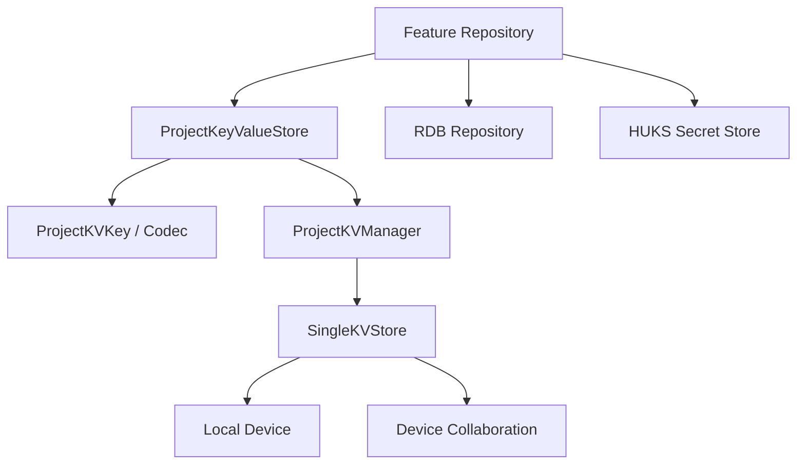

# 键值存储与跨设备同步详细技术方案

> 本文定义 HarmonyOS 项目的公共键值存储能力。它对齐 iOS 的 `UserDefaults`/轻量偏好职责，并补充 HarmonyOS `@kit.ArkData` 的 `distributedKVStore` 单版本与设备协同能力。它不是 AI 专属服务；AI 配置只是第一个接入模块。

## 1. 对标范围与结论

### 1.1 对标范围

| 能力 | iOS 参考 | HarmonyOS 方案 | 状态 |
| --- | --- | --- | --- |
| 轻量本地偏好 | 按账号 UserDefaults payload | `ProjectKeyValueStore` + `SINGLE_VERSION` | 目标设计 |
| 设备间同步偏好 | iOS 由业务/后端决定是否同步 | `DEVICE_COLLABORATION` + `autoSync` | 需真机和多设备验证 |
| 账号隔离 | key 中包含 ownerAccountID | 公共 key 生成器包含 accountId | 已有 `DeviceCache` 局部实现，待公共化 |
| 敏感数据 | 不应放 UserDefaults | HUKS `secretRef` | 不进入 KV |
| 复杂关系目录 | Core Data | ArkData RDB | 由 AI 数据库方案负责 |

### 1.2 结论

公共存储分为三类：

1. `ProjectKeyValueStore`：小型、扁平、可序列化的偏好和状态。
2. `relationalStore.RdbStore`：有关系、需要查询/事务/外键的数据。
3. HUKS/安全存储：Token、API Key、STS Secret、设备密钥。

跨设备自动同步只允许同步可重放、可覆盖、无敏感信息的用户偏好。AI 的 Provider、模型目录、场景绑定和本地模型文件不通过 KV 跨设备同步；Pro 配置以 SparkService 为事实源，本地模型始终是设备本地资源。

## 2. 华为端目录设计

```text
entry/src/main/ets/
├── Core/Storage/
│   ├── ProjectKeyValueStore.ets       # 公共 KV 门面
│   ├── ProjectKVManager.ets           # KVManager 单例和 store 生命周期
│   ├── ProjectKVStoreOptions.ets      # storeId、模式、加密、同步配置
│   ├── ProjectKVKey.ets               # 账号/功能/字段 key 规范
│   ├── ProjectKVCodec.ets             # JSON/类型/版本编解码
│   ├── ProjectKVChangeBus.ets         # 变更回调转异步事件
│   └── ProjectKVMigration.ets         # key 版本迁移和清理
├── Core/AI/Infrastructure/
│   └── AISettingsKVAdapter.ets        # AI 偏好接入，不直接依赖 KV API
├── Projects/Core/Networking/Caching/
│   └── DeviceCache.ets                 # 逐步迁移到公共门面
└── App/
    └── AppContainer.ets                # 唯一组合根装配
```

### 2.1 公共门面职责

`ProjectKeyValueStore` 统一处理：

- `KVManager` 创建和复用。
- `SingleKVStore` 打开、关闭、删除。
- `put/get/delete` 的 Promise 化封装。
- storeId、account scope、key 长度和值大小校验。
- schemaVersion 和 JSON payload 版本迁移。
- `dataChange` 回调的异步分发和去重。
- 登出时按账号前缀清理。
- 错误码、超限、数据库损坏和设备协同失败的统一日志脱敏。

页面、ViewModel 和业务 Repository 不得直接 import `distributedKVStore`。

## 3. 分层职责与请求链路



### 3.1 AppContainer 装配

`AppContainer` 初始化时创建一个公共 `ProjectKVManager`，注入到 `DeviceCache`、`LegalAcceptanceStore`、`AISettingsKVAdapter` 等 Repository。不同功能使用不同 `storeId` 或命名空间，不能在每个页面重复创建 KVManager。

```text
AppContainer
  → ProjectKVManager(context, bundleName)
  → ProjectKeyValueStore.local(manager)
  → ProjectKeyValueStore.syncable(manager)
  → DeviceCache / LegalAcceptanceStore / AISettingsKVAdapter
```

### 3.2 单设备和跨设备两种模式

| 模式 | `KVStoreType` | `autoSync` | 适用数据 | 说明 |
| --- | --- | --- | --- | --- |
| 本地轻量 KV | `SINGLE_VERSION` | `false` | 设备缓存、协议确认、UI 记忆 | 只在本机生效 |
| 设备协同 KV | `DEVICE_COLLABORATION` | `true` | 明确允许跨设备的用户偏好 | 依赖 HarmonyOS 设备协同环境，必须真机验证 |

`encrypt=true`、`securityLevel=S3` 作为公共默认；加密不等于可以存放 API Key，密钥仍必须使用 HUKS。

## 4. 核心关键技术与实现方案

### 4.1 KVManager 和 Store 生命周期

```ts
import { distributedKVStore } from '@kit.ArkData';
import { common } from '@kit.AbilityKit';

export class ProjectKVManager {
  private manager?: distributedKVStore.KVManager;
  private readonly context: common.Context;
  private readonly bundleName: string;

  constructor(context: common.Context, bundleName: string) {
    this.context = context;
    this.bundleName = bundleName;
  }

  openManager(): distributedKVStore.KVManager {
    if (!this.manager) {
      this.manager = distributedKVStore.createKVManager({
        bundleName: this.bundleName,
        context: this.context
      });
    }
    return this.manager;
  }
}
```

实际 ArkTS API 的 callback 签名以目标 SDK 24 复核；公共层可把 callback 包装为 Promise，但不能在 Promise 回调中直接更新 UI。

### 4.2 公共 Store 配置

```text
local storeId:  project_local_kv_v1
sync storeId:   project_sync_kv_v1
appId:          cn.zhaodk.SupportClient
securityLevel:  S3
encrypt:        true
backup:         false
```

设备协同 KV 的 `autoSync=true` 只适用于白名单字段。Store 建立后才允许执行 put/get/delete；关闭账号时调用 `closeKVStore`，只有用户明确删除应用全部数据时才调用 `deleteKVStore`。

### 4.3 Key 设计

Key 格式统一为：

```text
{scope}.{accountId}.{feature}.{field}.v{schemaVersion}
```

示例：

```text
account.1024.ai.preferences.v1
account.1024.ai.sync_state.v1
account.1024.settings.legal_accepted.v1
device.anonymous.network.last_registration.v1
```

Key 生成器必须做长度校验。官方约束为设备协同库 Key 不超过 896 bytes、单版本库 Key 不超过 1KB，Value 小于 4MB；项目实际限制建议更严格：Key 小于 512 bytes，Value 小于 256KB，避免把完整配置和正文塞进 KV。

### 4.4 Value 编解码和版本

Value 只允许官方支持的 `string | number | boolean | Uint8Array`。业务对象统一编码成带版本的 JSON：

```json
{
  "schemaVersion": 1,
  "accountId": 1024,
  "updatedAt": "2026-07-20T10:00:00Z",
  "payload": {
    "defaultSource": "auto",
    "allowNetwork": true
  }
}
```

读取流程：读取原始值 → 校验类型 → JSON parse → 校验 `schemaVersion` 和 accountId → 迁移旧版本 → 返回领域对象。解析失败只删除当前坏 key 或回退默认值，不清除其他功能数据。

### 4.5 公共 Repository 接口

```text
getString(key): Promise<string | undefined>
getBoolean(key, fallback): Promise<boolean>
getNumber(key, fallback): Promise<number>
getJson<T>(key, decoder): Promise<T | undefined>
putString(key, value): Promise<void>
putJson(key, value, schemaVersion): Promise<void>
delete(key): Promise<void>
clearScope(accountId, feature?): Promise<void>
subscribe(scope, listener): Unsubscribe
close(): Promise<void>
```

公共层不返回 `any` 给业务；`getJson<T>` 必须传入 decoder，decoder 负责字段白名单、默认值和版本迁移。

### 4.6 变更订阅

`dataChange` 回调中禁止阻塞操作和 UI 修改。公共层收到变化后只做：解析 key → 放入异步事件队列 → 去重 → 在 Repository/Runtime 层处理。AI 变更事件应携带：`accountId`、`feature`、`key`、`sourceDevice`、`updatedAt`、`schemaVersion`。

同一 key 连续变化只保留最后一次；处理回调失败时记录诊断，不在回调中同步重试或发网络请求。

## 5. 接口契约与数据模型

### 5.1 公共 KV 数据模型

| 模型 | 字段 | 存储模式 | 是否跨设备 |
| --- | --- | --- | --- |
| `ProjectKVEnvelope` | `schemaVersion, accountId, updatedAt, payload` | JSON string | 取决于 store |
| `KVSyncMetadata` | `lastAppliedAt, sourceDeviceId, conflictVersion, syncState` | JSON string | 可同步，但不作为后台事实源 |
| `KVFeatureScope` | `feature, accountId, storeType` | 内存 | 否 |
| `KVChangeEvent` | `key, accountId, feature, sourceDevice, updatedAt` | 内存事件 | 否 |

### 5.2 AI 使用 KV 的字段

AI 只允许使用以下轻量数据：

```json
{
  "schemaVersion": 1,
  "accountId": 1024,
  "updatedAt": "2026-07-20T10:00:00Z",
  "payload": {
    "defaultSource": "auto",
    "allowNetwork": true,
    "allowLocalModel": true,
    "selectedProviderId": "openai",
    "selectedModelId": "gpt-4o-mini",
    "lastRemoteRevision": "2026-07-20T09:58:00Z",
    "lastLocalRevision": "local-2026-07-20T09:59:00Z",
    "syncState": "remoteReady"
  }
}
```

但以下数据禁止进入 KV：

- API Key、Token、STS Secret、设备密钥。
- `AIProvider`、`AIModel`、`AIScenarioBinding` 完整目录。
- GGUF 文件、模型路径列表、完整 prompt、医疗报告、图片和音频。
- Runtime Provider adapter、模型句柄、流式响应。

### 5.3 AI 与 RDB/HUKS/KV 的分工

| AI 数据 | KV | RDB | HUKS/文件 |
| --- | --- | --- | --- |
| 默认来源、联网开关 | 是 | 可由 RDB 镜像 | 否 |
| 当前选择模型 ID | 是，需校验本设备仍存在 | 可保留正式目录关系 | 否 |
| Provider/模型/场景目录 | 否 | 是 | Key 只存 HUKS |
| API Key | 否 | 只存 secretRef | HUKS |
| Pro revision/同步状态 | 轻量镜像可存 | `ai_account_meta` 是主记录 | 否 |
| GGUF 文件 | 否 | 仅文件索引 | 应用沙箱文件 |
| 草稿 | 内存 | 保存成功后写 RDB | 否 |

RDB 与 KV 同时存在同一个偏好字段时，RDB 的 `ai_preferences` 是 AI 配置本地事实，KV 只作为项目级轻量镜像/跨设备候选值。启动时必须通过 `AIConfigRepository` 统一读取和校验，页面不能分别读取两个来源。

## 6. iOS-HarmonyOS 功能对照矩阵

| 对照项 | iOS 行为 | HarmonyOS 目标 | 状态 |
| --- | --- | --- | --- |
| 轻量偏好 | UserDefaults 按账号 payload | 公共 `ProjectKeyValueStore`，统一 envelope 和 key 规则 | 部分对齐 |
| 协议确认/设备缓存 | UserDefaults/本地缓存 | `SINGLE_VERSION` KV，沿用 `LegalAcceptanceStore`、`DeviceCache` 语义 | 部分对齐 |
| AI 偏好 | `PreferencesPayload` | KV 轻量镜像 + RDB 正式配置 | 待实现 |
| 跨设备偏好 | 由业务决定是否同步 | `DEVICE_COLLABORATION` 白名单字段 + change listener | 待真机验证 |
| 敏感数据 | 不进入 UserDefaults | HUKS，不进入 KV | 设计已确定 |

## 7. 示例工程与官方文档参考结论

### 7.1 官方文档

| 文档 | URL | 用途 |
| --- | --- | --- |
| 键值型数据库持久化 | https://developer.huawei.com/consumer/cn/doc/harmonyos-guides/data-persistence-by-kvstore | KVManager、SingleKVStore、put/get/delete、dataChange |
| ArkData API | https://developer.huawei.com/consumer/cn/doc/harmonyos-references/arkdata-api | `@kit.ArkData` 模块总览 |
| 关系型数据库 | https://developer.huawei.com/consumer/cn/doc/harmonyos-references/js-apis-data-relationalstore | RDB 与 KV 的职责边界 |
| HUKS | https://developer.huawei.com/consumer/cn/doc/harmonyos-references/universal-keystore-arkts | API Key/Token 的安全保存 |

### 7.2 当前工程示例

| 文件 | 当前事实 | 公共化处理 |
| --- | --- | --- |
| `entry/src/main/ets/Projects/Core/Networking/Caching/DeviceCache.ets` | Preferences、账号 scope、内存缓存和 flush | 改为注入 `ProjectKeyValueStore.local`，保留 DeviceCache 业务接口 |
| `entry/src/main/ets/App/LegalAcceptanceStore.ets` | Preferences 保存协议版本和确认态 | 改为 `ProjectKeyValueStore.local`，不改变外部行为 |
| `entry/src/main/ets/App/AppContainer.ets` | 组合根装配基础服务 | 增加 `ProjectKVManager` 和两个 store |

## 8. 实施拆分与验收

| 阶段 | 交付 | 验收 |
| --- | --- | --- |
| KV-P0 | `ProjectKVManager`、本地 store、Promise API、key/size 校验 | 16 个 store 限制下无重复打开；异常可诊断 |
| KV-P1 | `ProjectKeyValueStore.local` 接入 DeviceCache/LegalAcceptanceStore | 既有登录、设备登记、协议流程行为不变 |
| KV-P2 | AI `AISettingsKVAdapter` 和 RDB/KV 一致性规则 | 偏好可恢复；RDB 目录不被 KV 覆盖 |
| KV-P3 | 设备协同 store、白名单同步、dataChange 异步事件 | 两台 HarmonyOS 设备安全同步；敏感字段不会同步 |
| KV-P4 | 账号切换、登出、版本迁移和坏数据修复 | A/B 账号不串；旧 key 可迁移；单 key 损坏不影响其他功能 |

## 9. 风险与待确认项

| 风险 | 处理 |
| --- | --- |
| 设备协同能力依赖真实设备和系统环境 | 不能只用模拟器宣称已支持；完成双设备测试后再标记已对齐 |
| KV Value 小于 4MB但不代表适合大对象 | 项目限制 256KB；完整 AI 快照继续使用 RDB |
| `autoSync` 可能产生远端覆盖 | 只同步用户偏好；使用 `updatedAt + conflictVersion`，冲突需可解释 |
| KV 回调不可阻塞 | 回调只入队，业务异步处理，不在回调直接更新 UI |
| 跨设备本地模型不存在 | 只同步 selectedModelId；目标设备无该模型时回退本地/Pro 默认 |
| 账号退出后 KV 仍残留 | 所有 key 必须带 accountId，登出执行 scope 清理或明确保留策略 |
| KV 与 RDB 双写不一致 | 由 `AIConfigRepository` 统一提交；KV 只做镜像，不允许页面自行双写 |
