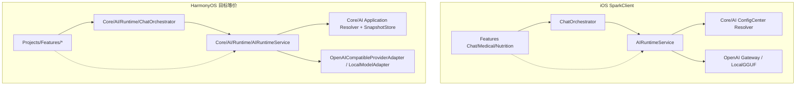

# SparkClientHarmonyOS｜AI Runtime 推理编排详细技术方案

> 核验日期：2026-07-22（纠偏工单 HOS-AIRUNTIME-ALIGN-0001 实施后）  
> 模式：技术方案 + **已按纠偏工单改业务代码**  
> 关联纠偏工单：`AI Runtime 推理编排鸿蒙实现偏差纠正工单.md`  
> 上游参考（iOS）：`SparkClient/总领文档/对话、AI Runtime 与工具调用/AI Runtime 推理编排需求.md`  
> 上游依赖（HarmonyOS）：  
> - `AI 设置与本地模型/AI 配置生命周期与本地、Pro 统一消费详细技术方案.md`（Resolver / Snapshot / RDB / HUKS）  
> - `AI 设置场景配置（厂商key、模型、默认模型配置、小任务）详细技术方案.md`（页面与保存）  
> - `基础工程与运行环境/网络模块详细技术方案.md`、`会话与认证详细技术方案.md`  
> 本页职责：在「配置已解析为 `RuntimeSnapshot` / `AIResolvedConfig`」之后，对齐 iOS 的**统一推理消费**、目录架构、业务流程与 Runtime 数据模型。  
> **禁止**在本页重定义 AI 设置状态机、RDB schema、HUKS Key 生命周期；**禁止**展开 ToolHub 执行器细节（另专题，当前仅 `debug_echo` 联调工具）。

## 1. 对标范围与结论

### 1.1 代码事实审计（2026-07-22 纠偏实施后）

| 模块 | 当前代码证据 | 接入证据 | 文档状态 | 下一步 |
| --- | --- | --- | --- | --- |
| 配置层 `Core/AI` | Repository / Resolver / `ScenarioPolicyResolver`（精确 preferred） | Bootstrap → publish | 上游部分实现 | Pro overlay / override 单测加深 |
| 统一消费 `AIRuntimeService` | `generateTextStream` 主路径；account/generation 门禁；tools 降级 | `AppContainer` | **本轮落地** | 真机长流 |
| SSE / Encoder | `AIRuntimeSseParser` + `OpenAIChatBodyEncoder` + Adapter | Runtime | **本轮落地** | 厂商矩阵 |
| `ChatOrchestrator` | ≤30 轮 + ToolHub 定义出站 | `AppContainer` + Chat UseCase | **骨架+真实入口** | 多模态历史 / LocalOCR |
| Chat Feature | `Features/Chat` Domain/RDB/UseCase/MessageRunActor/`ChatTabPage` | 主 Tab「对话」 | **本轮落地** | Outbox 同步另专题 |
| ToolHub | `Runtime/ToolHub/` + Consent/Audit/Sink + `debug_echo` + `/audit_tools` | Orchestrator | **联调级** | 业务工具/授权持久化 |
| Playground | AI 设置 Runtime 联调 | 仅诊断 | 保留 | 不得替代生产 Chat |
| 本地 GGUF | `localEngineUnavailable` | — | 占位正确 | 独立引擎工单 |
| 非 chat 消费者 | `StructuredRuntimeClient`（医疗文档类型识别样例）已装配；正式 Feature 消费仍缺 | AppContainer | **骨架入口** | Feature 逐场景接入 |

### 1.2 后端与后台管理证据

| 契约层 | 真实来源 | 对齐内容 | 禁止行为 |
| --- | --- | --- | --- |
| AI 配置 | SparkService AI Config + 本地 RDB/HUKS（上游文档） | 场景枚举、能力位、endpoint、secretRef | Runtime 另造配置源 |
| 模型推理 HTTP | 厂商 OpenAI 兼容 `AIResolvedConfig.endpoint` | Chat Completions / SSE；Bearer = HUKS 明文 Key | 伪装成 `/api/v1/`；Key 进 Preferences/日志 |
| 后台管理 | backoffice AI 配置（若有） | 同源领域配置；**不是**推理代理 | admin payload 改写 Runtime DTO |

### 1.3 参考端与目标端

- **参考端架构事实：** iOS 拆为 `Projects/Core/AI/`（配置）+ `Projects/Core/AIRuntime/`（推理编排/网关/Orchestrator）；统一入口 `AIRuntimeService.generateTextStream`；聊天走 `ChatOrchestrator`；其它 Feature 直连 Runtime。
- **目标端现状：** HarmonyOS 将 Runtime **嵌在** `Core/AI/Runtime/`（可接受，职责须与 iOS `AIRuntime` 包等价）；统一入口已是 `generateTextStream`（`generateText` 为非流式便捷封装）；`ChatOrchestrator`、最小 Chat Feature、联调级 ToolHub、`StructuredRuntimeClient` 均已落地，但仍未达到 iOS 业务完整度。
- **目标用户能力：** 任意业务只提交 `AIRuntimeTextRequest`；按场景统一选模、降级、路由、流式/取消；聊天可多轮 tool；本地 GGUF 未就绪时显式失败。

### 1.4 结论

| 类别 | 项 |
| --- | --- |
| 架构已对齐（语义） | 「配置不发推理 / Runtime 不持久化配置 / Feature 不直连厂商 HTTP」 |
| 目录部分对齐 | Runtime 嵌套于 `Core/AI/Runtime/`；Orchestrator/Cancellation/ToolHub/Prompt 已存在；`AIRuntimeModels` 仍嵌在 `AIConfigModels` |
| 统一消费已落地 | `generateTextStream` 主路径 + Adapter SSE；Agent baseModel / 真机长流仍需验收 |
| 数据模型部分对齐 | 场景 wire 值一致；Request/Message/Event/Reasoning/ToolCall 已加宽，schema 结构化仍弱于 iOS |
| 业务流程部分对齐 | Chat 最小闭环（主 Tab→RDB→UseCase→Orchestrator→Actor）；非 chat 仅有 `StructuredRuntimeClient` 样例 |

---

## 2. 华为端目录设计（对齐 iOS 项目架构）

### 2.1 架构原则（必须与 iOS 一致）

```text
iOS:
  Core/AI              → 配置、Resolver、Snapshot、LocalModel 文件
  Core/AIRuntime       → 统一消费、Gateway、Orchestrator、ToolHub、Runtime DTO
  Features/*           → 只调 AIRuntimeServing / ChatOrchestrator

HarmonyOS 目标等价:
  Core/AI/Application|Domain|Infrastructure  → 同 iOS Core/AI
  Core/AI/Runtime                            → 同 iOS Core/AIRuntime（物理嵌套，逻辑独立）
  Projects/Features/*                        → 同 iOS Features
```

硬规则：

1. **统一消费唯一入口：** `AIRuntimeService`（目标补齐 `generateTextStream`）；禁止 Feature/`ViewModel` 直接 `http.createHttp` 打厂商。
2. **配置与推理分离：** Resolver/RDB/HUKS 只产出 `RuntimeSnapshot`；推理层只读 snapshot，不写 RDB。
3. **聊天与非聊天分流：** 仅 Chat 经 `ChatOrchestrator`；医疗/营养/知识库直连 Runtime（与 iOS 相同）。
4. **不得**再建平行第二套 `AIRuntimeService` 入口（除非整体搬迁并删旧入口）。

### 2.2 iOS → HarmonyOS 文件级映射

| iOS 路径（事实） | iOS 职责 | HarmonyOS 现有 | HarmonyOS 目标 | 状态 |
| --- | --- | --- | --- | --- |
| `Core/AI/AIScenario.swift` | 19 场景枚举 | `Domain/AIConfigModels.ets` → `AIScenario` | 保持 | 已对齐 wire |
| `Core/AI/AIConfigCenter.swift` | resolve / prewarm | `Application/AIConfigRepository.ets` + Resolver | 保持现名 | 上游 |
| `Core/AI/ScenarioPolicyResolver.swift` | preferred > override > default | `AIConfigResolver.ets` | 保持；消费侧对齐优先级语义 | 部分 |
| `Core/AI/AIConfigModels.swift` | 目录行、运行态 Resolved | `AIConfigModels.ets` | 保持；推理字段见 §5 | 部分 |
| `Core/AI/AIClientFactory.swift` | 由 Resolved 造 client | Adapter 内拼 HTTP | 可继续内聚在 Adapter | 平台差异可接受 |
| `Core/AIRuntime/AIRuntimeModels.swift` | Request/Message/Event/Tool/Reasoning/Error | **嵌在** `AIConfigModels.ets` | **建议拆** `Runtime/AIRuntimeModels.ets`（或分区注释） | 待对齐 |
| `Core/AIRuntime/AIRuntimeService.swift` | `generateTextStream` 路由/降级 | `Runtime/AIRuntimeService.ets` | 同文件扩展流式 API | 部分 |
| `Core/AIRuntime/AIRuntimeGateway.swift` | 网关协议 | `AIProviderAdapter.ets` | 保持抽象 | 部分 |
| `OpenAICompatibleTextGateway.swift` | SSE | `OpenAICompatibleProviderAdapter.ets` | 同文件扩流式 | 部分 |
| `LocalGGUFTextGateway.swift` | 本地占位 | `LocalModelAdapter.ets` | 同左 | 占位 |
| `AIRuntimeCancellation.swift` | 取消令牌 | `Runtime/AIRuntimeCancellation.ets` | Token + Adapter.destroy | **已落地**（端到端真机待验） |
| `AIRuntimeOutputLog.swift` / `RequestLogRedactor.swift` | 输出日志/脱敏 | `AIRuntimeOutputLog.ets` / `AIRuntimeRequestLogRedactor.ets` | 同左 | **已落地** |
| `ChatOrchestrator.swift` | 聊天编排 | `Runtime/ChatOrchestrator.ets` | ≤30 轮 / 空输出 / tool lock / reasoning 三分支 | **骨架+真实入口** |
| `ChatOrchestratorInferenceOptions.swift` | Composer 开关 | 同目录独立文件 | 同左 | **已落地** |
| `OpenAIReasoningPayload.swift` | 厂商 reasoning 字段 | `Runtime/OpenAIReasoningPayload.ets` | 同左 | **已落地** |
| `ChatSystemPromptResolver.swift` / `PromptLocalizer.swift` | 系统提示/兜底文案 | 同 Runtime | date keyword / 优先级 | **已落地** |
| `ToolHub/**` | 工具 | `Runtime/ToolHub/**` | Consent/Audit/Sink + `debug_echo` | **联调级** |
| `Features/Chat/.../SendChatMessageUseCase.swift` | 发送→Orchestrator | `Projects/Features/Chat/...` | 最小闭环 + MessageRunActor | **部分实现** |
| `App/.../AssemblyProducts.swift` | AIAssembly + ChatAssembly | `App/AppContainer.ets` | Runtime + Orchestrator + Chat + StructuredRuntimeClient | **已装配** |

### 2.3 目标目录树（对齐 iOS 职责）

```text
entry/src/main/ets/
├── App/
│   └── AppContainer.ets
│       # 装配：AIRuntimeSnapshotStore → AIRuntimeService
│       # 目标：+ ChatOrchestrator + ToolHub（Chat Feature 注入）
├── Core/AI/
│   ├── Application/          # ≈ iOS Core/AI 配置编排
│   │   ├── AIConfigRepository.ets
│   │   ├── AIConfigResolver.ets
│   │   └── ProOverlayMaterializer.ets
│   ├── Domain/
│   │   └── AIConfigModels.ets          # 配置 +（当前）Runtime DTO
│   ├── Infrastructure/                 # RDB / HUKS / Seed / LocalModel 文件
│   └── Runtime/                        # ≈ iOS Core/AIRuntime
│       ├── AIRuntimeService.ets        # 当前：统一消费
│       ├── AIRuntimeSnapshotStore.ets  # 当前：内存快照
│       ├── AIProviderAdapter.ets
│       ├── OpenAICompatibleProviderAdapter.ets
│       ├── LocalModelAdapter.ets
│       ├── AIRuntimeModels.ets         # 目标：从 Domain 拆出或分区
│       ├── AIRuntimeCancellation.ets   # 目标
│       ├── AIRuntimeOutputLog.ets      # 目标
│       ├── AIRuntimeRequestLogRedactor.ets  # 目标
│       ├── OpenAIReasoningPayload.ets  # 目标
│       ├── ChatOrchestrator.ets        # 目标
│       ├── ChatOrchestratorInferenceOptions.ets  # 目标
│       ├── ChatSystemPromptResolver.ets / PromptLocalizer.ets  # 目标
│       └── ToolHub/                    # 目标（专题）
└── Projects/Features/
    ├── Chat/                           # 目标：SendChatMessageUseCase → Orchestrator
    ├── MedicalDocumentUpload/          # 目标：直连 Runtime + scenario
    ├── Nutrition/                      # 目标：直连 Runtime
    └── Knowledge/                      # 目标：直连 Runtime
```

### 2.4 文档目录

```text
开发详细技术文档/对话、AI Runtime 与工具调用/
└── AI Runtime 推理编排详细技术方案.md   # 本文件
# 规划（有代码或用户点名再建）：工具调用与审计 / 消息发送 / 对话线程 / 问报告
```

---

## 3. 分层职责与请求链路（对齐 iOS 业务流程）

### 3.1 分层职责（与 iOS 同语义）

| 层 | 职责 | 允许 | 禁止 |
| --- | --- | --- | --- |
| Presentation | UI 状态、停止按钮、流式展示 | 持有 `requestId`/Token；调 UseCase | 读 secretRef、拼厂商 URL |
| Feature Application | 发送管线、抽取 UseCase | 构造 `AIRuntimeTextRequest` / 调 Orchestrator | 自建第二 Runtime |
| ChatOrchestrator | 历史组包、工具白名单、≤30 轮、空输出 | 调 `AIRuntimeServing` + ToolHub | 直接 HTTP |
| AIRuntimeService | **统一消费**：选模、降级、路由、日志 | 读 Snapshot；调 Adapter | 写 RDB；绕过能力门禁 |
| AIConfigResolver / Repository | 产出 Snapshot | 上游文档范围 | 发推理请求 |
| Provider Adapter | 厂商/本地协议适配 | HTTP/引擎；脱敏日志 | 业务 tool 循环 |

### 3.2 统一消费主链路（必须对齐 iOS `generateTextStream` 步骤序）

#### 3.2.1 iOS 当前事实（基线）

```text
调用方
  → AIRuntimeService.generateTextStream(request)
  → guard messages 非空；checkCancellation
  → configCenter.resolve(scenario, preferredModelName)
  → 读 effective bundles；modelSupportsTools → 必要时清空 tools / toolChoice=.none
  → resolveLocalModelSelection？
       yes → LocalGGUFTextGateway.generateTextStream
       no  → Agent 则 model:=baseModelName
            → AIClientFactory.makeClient(resolved, temp/topP/maxTokens override)
            → OpenAICompatibleTextGateway.generateTextStream
  → 包装流：转发 text/reasoning/toolCall/completed；成功 OutputLog；取消传播
```

#### 3.2.2 HarmonyOS 当前事实

```text
调用方（目前仅单测）
  → AIRuntimeService.generateText(request)
  → snapshot 未就绪 → sessionInvalidated
  → pickResolved(snap, request)   // 内存列表，非每次走 Resolver
  → supportsText / multimodal 门禁
  → !supportsToolUse → request.tools = []   // 但 Adapter 本来就不发 tools
  → modelType==gguf → LocalModelAdapter（固定失败）
       else → OpenAICompatibleProviderAdapter.send（stream:false 整包）
  → collectEvents：伪流式（整段当一次 delta）
```

#### 3.2.3 HarmonyOS 目标（对齐 iOS 可观察行为）

```text
任意 Feature / Orchestrator
  → AIRuntimeService.generateTextStream(request)   // 主路径；generateText 可作非流式便捷封装
  → messages 空 → 对齐 emptyMessages（勿静默成功）
  → checkCancellation
  → 从 Snapshot 按 iOS 同优先级选模：
       preferredModelName 精确命中（失败则 noAvailableModel，禁止「包含匹配」误命中）
       else runtimeOverride（若上游提供）
       else scenario 默认行（default → isDefault → first）
  → tools 降级：!supportsToolUse（Agent 取自身∨base）→ tools=[] + toolChoice=none
  → 本地？(provider local / modelType gguf + localFilename) → LocalAdapter 流
  → 否则 Agent 出站 model=baseModelName；温度/topP/maxTokens 请求覆盖优先于 Resolved
  → OpenAI Adapter：stream 时 requestInStream+SSE；cancel→destroy
  → 事件：textDelta / reasoningDelta / toolCallDelta / completed
  → OutputLog + Redactor
```

| 阶段 | 触发 | 输入 | 参与模块 | 成功 | 临时失败 | 永久失败 | 用户可见 |
| --- | --- | --- | --- | --- | --- | --- | --- |
| 配置就绪 | Bootstrap | accountId | Repository→SnapshotStore | ready/degraded | 远端降级 | 401 失效 | 上游门禁 |
| 统一选模 | generate* | scenario/preferred | Service.pickResolved≈Resolver | AIResolvedConfig | — | noAvailableModel | 引导设置 |
| 能力门禁 | 同上 | capabilities | Service | 通过 | — | capabilityDenied | 换模型 |
| tools 降级 | !supportsToolUse | tools | Service | 清空 | — | — | 纯文本 |
| 路由 | modelType/provider | Resolved | Service | local/remote | — | localEngineUnavailable | 明确文案 |
| 远程推理 | remote | endpoint+key+msgs | OpenAI Adapter | 流/整包 | 可上层重试 | httpError/providerError | 增量或整段 |
| 本地推理 | gguf | 文件 | Local Adapter | 目标真推理 | — | 当前占位错误 | 不可用 |
| 聊天编排 | 发送 | history+flags | Orchestrator | OrchestratorOutput | tool 等待用户 | emptyOutput/length | 气泡/错误卡 |
| 取消 | 停止 | token/requestId | 全链路 | cancelled | — | — | 停增量 |
| 账号清理 | 登出/切号 | accountId | invalidate+clear | 无残留请求 | — | — | 不可再推 |

### 3.3 聊天路径业务流程（对齐 iOS `ChatOrchestrator`）

```text
ChatDetailViewModel.send / regenerate
  → SendChatMessageUseCase
  → MessageRunActor（助手占位 + partial 落库）
  → ChatOrchestrator.generateReply
       1. checkCancellation
       2. useTools? ToolHub.runIfNeeded（显式 /tool 可 bypass 模型）
       3. makeRuntimeMessages（system/成员/历史/OCR/多模态）
       4. applyOutboundUserTurn(userInput, healthResourceContext)
       5. filteredToolDefinitions(useKnowledgeBag/useWebSearch/allowedToolNames)
       6. loop ≤ 30:
            generateTextStream(scenario=chat)
            collect → onPartial
            无 tool_calls：空文 → emptyOutput；否则返回
            有 tool_calls：executeToolCall → role=tool 回灌
            isAwaitingUserInput → 锁定 tools + system 禁止再调工具
       7. 超轮次 → fallbackAssistantText, finishReason=length
```

HarmonyOS：**编排主路径已落地**（`ChatOrchestrator` + 主 Tab Chat）；步骤序、上限 30、空输出、tool lock、reasoning 三分支与 DeepSeek `reasoning_content` 回传已对齐骨架；仍缺多模态历史、完整业务工具与远端同步。

### 3.4 非 chat 直连（对齐 iOS 调用表）

| 调用方（iOS 事实） | scenario wire | HarmonyOS 目标 |
| --- | --- | --- |
| Medical 类型识别 | `medical_document_type_recognition` | UseCase → `generateTextStream`，自管 JSON 解码 |
| Medical 结构化/分类型抽取 | `medical_*_extraction` 等 | 同上 |
| Nutrition 摄入抽取 | `nutrition_intake_extraction` | 同上 |
| Nutrition 食物描述 | `optimization_visual`（多模态） | 需 `supportsMultimodal`；禁止无能力时装文本冒充 |
| Knowledge 润色 | `optimization_text` | 直连 |
| Knowledge 翻译 | `chat` + 专用 prompt（iOS 事实） | 同行为，勿另造 scenario |
| ToolHub 内部二次 AI | `medical_structured_extraction` / `optimization_text` | 直连 Runtime，不经 Orchestrator |

### 3.5 组合根装配（对齐 iOS AIAssembly / ChatAssembly）

**当前 HarmonyOS：**

```text
AppContainer
  → AIRuntimeSnapshotStore
  → AIConfigRepository(…, runtimeStore)
  → AIRuntimeService(snapshotStore, AIKeyStore, AccountSessionRuntime)
       默认 remote=OpenAICompatibleProviderAdapter(keys)
       默认 local=LocalModelAdapter()
  → AppBootstrapper → buildRuntime → publish snapshot
```

**目标（对齐 iOS）：**

```text
AI 装配（已有扩展）
  → + 流式 Gateway 能力 + Cancellation + OutputLog

Chat 装配（新建）
  → ToolHub(runtimeService, …)
  → ChatOrchestrator(runtimeService, toolHub, fileCache)
  → SendChatMessageUseCase(orchestrator, messageRunActor, …)
```

登出/切号：必须 `aiRuntimeService.invalidateAccount` + `snapshotStore.clear`（已有）；目标再 **cancel 全部 in-flight**。

---

## 4. 核心关键技术与实现方案

### 4.1 统一消费契约（对齐 iOS「只提交请求、不暴露本地/Pro DTO」）

**目标：** 与上游「统一消费」一致：调用方只表达意图；不得传 endpoint/明文 Key/绕过 Resolver 的任意 model。

| 规则 | iOS | HarmonyOS 当前 | 目标 |
| --- | --- | --- | --- |
| 唯一入口 | `AIRuntimeServing.generateTextStream` | `generateTextStream` 主路径；`generateText` 便捷封装 | 保持；真机长流验收 |
| 选模 | 每次 resolve | 读已发布 Snapshot | 语义对齐 Resolver 优先级；preferred 未命中必须失败 |
| preferred 匹配 | 精确模型名 | **精确匹配**（禁止 fuzzy） | 保持；补 Agent 用例 |
| tools 降级 | 清空 + toolChoice.none + 日志 | Service 层已降级 | 继续验 Provider body 不出 tools |
| Agent | 出站换 baseModelName | Runtime 已读 baseModel | 加深单测与日志 |
| 采样覆盖 | request 覆盖 Resolved | Adapter/Encoder 已支持请求级覆盖 | 保持 |
| API Key | Resolved.apiKey 或工厂注入 | `secretRef` → HUKS | 保持 HUKS；推理侧永不落盘明文 |
| 空 messages | `emptyMessages` | Service 校验 | 对齐失败码 |
| 成功日志 | OutputLog | `AIRuntimeOutputLog` + Redactor | 保持脱敏 |

伪代码（示意，非可粘贴实现）：

```ts
// 伪代码：统一消费 — 对齐 iOS 步骤序
async generateTextStream(req: AIRuntimeTextRequest): Promise<EventSource /* 示意 */> {
  if (req.messages.length === 0) { return failEmptyMessages(req); }
  checkCancellation(req);
  const resolved = pickResolvedExact(snap, req); // preferred 精确失败 → noAvailableModel
  if (!resolved) { return failNoModel(req); }
  const effective = degradeToolsIfNeeded(req, resolved); // Agent: self ∨ base supportsToolUse
  if (isLocal(resolved)) { return localAdapter.stream(effective, resolved); }
  const apiModel = agentBaseOrSelf(resolved); // baseModelName
  return remoteAdapter.stream(effective, resolved.withModel(apiModel));
}
```

### 4.2 远程 Adapter：非流式 → SSE（对齐 iOS Gateway）

| 能力 | iOS OpenAICompatibleTextGateway | HO 当前 | 目标 |
| --- | --- | --- | --- |
| 传输 | URLSession bytes SSE | `http.request` 整包 | `requestInStream` + `on('dataReceive')` |
| `stream` 字段 | true（聊天） | body 写死 false；request.stream 未读 | 尊重 `request.stream` |
| 事件 | text/reasoning/toolCall/completed | 无增量 | 四类事件对齐（可用 HO Event.kind 映射） |
| tools | 请求体携带 | **不携带** | supportsToolUse 时携带 schema + tool_choice |
| reasoning 请求 | OpenAIReasoningBuilder 按厂商 | 无 | 独立 `OpenAIReasoningPayload.ets` |
| 多模态 | contentParts + inline JPEG 前缀 | 仅 string content | 对齐 parts；无能力则 capabilityDenied |
| 取消 | token + onTermination→cancel | Set 软取消 | `destroy()` + off 监听 |
| 超时 | ~300s / ~900s | timeoutMs 默认 60s | 聊天上调与 iOS 同量级可配置 |

**官方：** [发送网络请求（ArkTS）](https://developer.huawei.com/consumer/cn/doc/harmonyos-guides/http-request) — `requestInStream` / `dataReceive` / `destroy`（API 24 复核）。  
**本地示例：** LiveStreaming network interceptors — 只借分层；禁 Mock/全量日志/Preferences Token。

### 4.3 本地 Adapter（对齐 iOS 占位语义）

两端均为占位：iOS echo +「临时禁用」；HO `localEngineUnavailable`。  
验收：**不得**把占位正文标成已对齐本地推理。开放引擎后：仍走统一入口；通常无 tools。

### 4.4 ChatOrchestrator（对齐 iOS 行为清单）

实现前验收清单（与 iOS 总领一致）：

- [ ] `ChatOrchestratorInferenceOptions`：`useTools/useKnowledgeBag/useWebSearch/reasoningEnabled/reasoningEffortTier/allowedToolNames`
- [ ] reasoning 映射：可控制 / 强制开 / promptFallback 三分支
- [ ] `maxToolRounds = 30`；超限 fallback + `finishReason=length`
- [ ] 空正文 → 可见错误（对齐 `emptyOutput`）
- [ ] `isAwaitingUserInput` → 锁定 tools
- [ ] DeepSeek 思考模式下 assistant tool 消息回传 `reasoning_content`
- [ ] 问报告 `healthResourceContext` 合并不破坏多模态 parts
- [ ] UI 参考 BookRead `customer_service_chat` **仅布局**；禁 `ChatMockService`

### 4.5 取消 / 账号 / 日志

| 项 | iOS | HO 当前 | 目标 |
| --- | --- | --- | --- |
| 取消 | `AIRuntimeCancellationToken` | requestId Set | Token + Adapter.destroy + Event.cancelled |
| 账号 | 会话配置隔离 | invalidateAccount + clear | + 取消 in-flight |
| 日志 | OutputLog + Redactor | 失败 warn | 禁止 Key/messages 全文；记录 scenario/model/source/cost |

---

## 5. 接口契约与数据模型（字段级对齐 iOS）

> 「HO 当前」来自 `AIConfigModels.ets` / Runtime 代码核验；「目标」必须与 iOS 总领可观察行为一致。配置持久化字段仍归上游 AI 设置文档。

### 5.1 `AIScenario`（已对齐 wire）

| wire（两端一致） | 用途 |
| --- | --- |
| `chat` | 主聊天 / 部分翻译 |
| `embedding` / `voice` | 向量 / 语音配置分流 |
| `medical_structured_extraction` 等 7 个医疗抽取/识别 | 医疗上传 |
| `optimization_text` / `optimization_visual` | 润色 / 视觉 |
| `context_folding` / `router` / `model_config` | 元场景 |
| `report_interpretation` | 报告解读 |
| `nutrition_intake_extraction` | 营养 |
| `medical_exam_plan_generation` | 体检计划；**bundle 可映射到 report_interpretation**（iOS 事实，HO Resolver 需同行为） |

### 5.2 选模结果 `AIResolvedConfig`：iOS 最小运行态 vs HO 扩展态

iOS 运行态核心：`endpoint: URL`, `model`, `apiKey?`, `temperature`, `maxTokens`, `source`。  
HO 扩展了能力与 secretRef（**允许**，消费规则须兼容 iOS）。

| 字段 | iOS | HO 当前 | 统一消费用法 | 对齐要求 |
| --- | --- | --- | --- | --- |
| endpoint | URL | `endpoint?: string` | 远程 POST URL | 缺省 → noEndpoint |
| model / modelName | `model` | `modelName` + `modelId` | 出站 `model`；Agent 可换 base | 出站名与展示名策略对齐 iOS |
| apiKey / secretRef | 明文可选 apiKey | `secretRef` → HUKS | Bearer | **禁止**明文写入 Snapshot 落盘 |
| temperature / maxTokens | 有 | 可选 number | 可被 request 覆盖 | 补齐 topP 请求覆盖 |
| source | `AIConfigSource` 枚举 | string `local/pro/trial/...` | 日志与降级 | 与上游一致 |
| capabilities.* | 目录行，resolve 时查 | 嵌在 Resolved | 门禁 | 必须含 Text/ToolUse/Multimodal/Reasoning/Controllable |
| modelType | 由 provider 推断 | `remote`/`gguf` | 路由 | 与 local provider 一致 |
| baseModelName | 在目录行 | 模型有字段 | Agent 出站 | **Runtime 必须使用** |
| systemProvision | prompt 侧 | 有 | Adapter 可注入 system | 勿打乱调用方 system 顺序约定 |
| company / providerId | 目录 | 有 | reasoning 厂商表、日志 | — |

### 5.3 `AIRuntimeTextRequest` 字段对齐

| 字段 | iOS | HO 当前 | 目标 | 必填 | 敏感 |
| --- | --- | --- | --- | --- | --- |
| scenario | AIScenario | string wire | 同 iOS | 是 | 否 |
| messages | [AIRuntimeMessage] | AIRuntimeMessage[] | 同结构扩展 | 是（非空） | 可能 |
| tools | [AIRuntimeToolDefinition] | `Object[]` | **显式 ToolDefinition 类型** | 否 | 否 |
| toolChoice | auto/none | **无** | 增加 enum/string | 否 | 否 |
| reasoning | AIRuntimeReasoningOptions | `boolean` | **升级为对象**：isEnabled/effortTier/usePromptFallback | 否 | 否 |
| preferredModelName | 有 | 有 | 精确匹配 | 否 | 否 |
| providerCompanyUppercased | 有 | 无（用 Resolved.company） | 可从 Resolved 推导 | 否 | 否 |
| temperature/topP/maxTokens | 有 | 无请求级 | **补齐** | 否 | 否 |
| cancellationToken | 有 | 无（仅 requestId cancel） | Token 或等价 | 否 | 否 |
| stream | （网关侧） | boolean 未消费 | **必须消费** | 否 | 否 |
| requestId | 无同名字段 | 有 | 保留 | 是 | 否 |
| accountId | 会话隐含 | 有 | 保留 | 否 | 否 |
| preferredSource | 无同名 | local/pro | 可保留为 HO 扩展，不得破坏 preferredModel 优先 | 否 | 否 |
| attachments | 多模态走 contentParts | 无 | contentParts 优先，与 iOS 一致 | 否 | 可能 |

### 5.4 `AIRuntimeMessage` / 多模态 / ToolCall

| 字段 | iOS | HO 当前 | 目标 |
| --- | --- | --- | --- |
| role | system/user/assistant/tool | string | 同四角色校验 |
| content | String? | string | 可空（tool_calls 轮次） |
| contentParts | text / image_url | **无** | 补齐；`spark:inline-jpeg-base64:` 约定对齐 iOS |
| toolCalls | [id,name,arguments] | **无** | 补齐 |
| toolCallID / name | tool 轮次 | **无** | 补齐 |
| reasoningContent | DeepSeek 回传 | **无** | 补齐 |

| 流事件 iOS | HO Event.kind 映射目标 | 载荷 |
| --- | --- | --- |
| textDelta | `delta`（或拆 `textDelta`） | deltaText |
| reasoningDelta | 建议新增 `reasoningDelta` 或 delta 元数据 | reasoning 增量 |
| toolCallDelta | `toolCall` | index/id/name/argumentsDelta |
| completed | `completed` | AIRuntimeResponse（含 toolCalls/finishReason/usage） |
| — | `started`/`failed`/`cancelled`/`progress` | HO 可保留；iOS 用 throw/终止表达 |

### 5.5 `AIRuntimeResponse` / 错误

| 字段 | iOS TextResponse | HO Response | 目标 |
| --- | --- | --- | --- |
| text | 有 | 有 | 同 |
| reasoningText | 有 | **无** | 补 |
| model | 有 | modelId | 保留实际出站模型名 |
| tokens | 有 | usage 对象 | 同 |
| toolCalls | 有 | **无** | 补 |
| finishReason | 有 | 有 | 同 |
| error | AIRuntimeError enum | 字符串码 | 稳定码表；聊天空输出对齐 emptyOutput |

| 错误（对齐语义） | iOS | HO 当前码 | 说明 |
| --- | --- | --- | --- |
| 空消息 | emptyMessages | （缺） | 目标补 |
| 空输出 | emptyOutput | （缺，Orchestrator） | 聊天路径必须 |
| 非法响应 | invalidResponse | providerError | 可映射 |
| 传输 | transport | httpError/providerError | — |
| 服务端 | server | httpError | — |
| 取消 | CancellationError | cancelled | destroy 后必达 |
| 无模型 | missingModelForScenario | noAvailableModel | — |
| 未就绪 | runtimeNotBootstrapped | sessionInvalidated | — |
| 本地不可用 | modelLoadFailed 等 | localEngineUnavailable | — |

### 5.6 厂商 Chat Completions 契约（推理，非 SparkService）

| 项 | 契约 |
| --- | --- |
| URL | `POST {endpoint}` 完整厂商 URL |
| Auth | `Authorization: Bearer {HUKS(secretRef)}` |
| Body 非流式（当前） | model, messages, stream:false, temperature?, max_tokens? |
| Body 目标流式 | stream:true；tools?/tool_choice?；reasoning 厂商字段 |
| 成功 | choices[0].message.content / SSE data 行 |
| 失败 | 映射 httpError/providerError；**不要**改写成 SparkService `code` |
| 缓存 | 默认不缓存对话 |
| requestId | 客户端日志关联；与 SparkService middleware id 无关 |

### 5.7 SparkService

仅配置链路；字段字典见上游 AI 设置两份方案。Runtime **禁止**平行定义 bootstrap DTO。

### 5.8 `ChatOrchestratorInferenceOptions`（目标，对齐 iOS）

| 字段 | 含义 | 默认（对齐 iOS `.default`） |
| --- | --- | --- |
| useTools | 是否启用工具循环 / 暴露 schema | true |
| useKnowledgeBag | 过滤知识库相关工具 | true |
| useWebSearch | 过滤联网相关工具 | true |
| reasoningEnabled | 用户是否要思考 | false |
| reasoningEffortTier | 0...3 | 0 |
| allowedToolNames | 小任务白名单 | nil |

---

## 6. iOS-HarmonyOS 功能对照矩阵（摘录）

全表：`开发详细技术文档/iOS-HarmonyOS功能对照矩阵.md`。

| 参考端能力 | 可观察行为 | HarmonyOS 证据 | 对齐状态 | 差异与处理 |
| --- | --- | --- | --- | --- |
| 目录：AI + AIRuntime 分离 | 配置/推理分包 | Runtime 嵌在 Core/AI/Runtime | 部分对齐 | 逻辑等价；禁止第二入口 |
| 统一入口 generateTextStream | 全业务共用 | `generateTextStream` 主路径 | **已落地** | 真机长流 |
| 选模优先级 | preferred 精确失败 | 精确匹配 | **已落地** | Agent 加深 |
| tools 降级+出站 | 无能力不带 schema | Service 降级；ToolHub 出站 `debug_echo` | 部分对齐 | 业务工具专题 |
| Agent baseModel | 出站替换 | Runtime 已用 | 部分对齐 | 加深单测 |
| SSE 四类事件 | 真流式 | requestInStream + Parser | **代码已落地** | 真机半行/错误 |
| ChatOrchestrator | 30 轮/空输出/lock | `ChatOrchestrator.ets` + 主 Tab | **骨架+入口** | 多模态/同步 |
| 非 chat 直连表 | 多 Feature | `StructuredRuntimeClient` 样例 | 部分 | Feature 逐项 |
| 取消 | Token+destroy | Token + destroy | **代码已落地** | 端到端验收 |
| 场景枚举 19 | wire 一致 | AIScenario.allKnown | 已验证对齐 | — |
| GGUF | 占位 | 占位错误码 | 部分对齐（语义） | 禁伪造成功 |
| Request/Message 模型 | parts/toolCalls/reasoning | 已加宽 | 部分对齐 | 多模态 parts |

---

## 7. 示例工程与官方文档参考结论

| 类型 | 位置 | 可借鉴 | 禁止 |
| --- | --- | --- | --- |
| 官方 | https://developer.huawei.com/consumer/cn/doc/harmonyos-guides/http-request | requestInStream / dataReceive / destroy | 不按 API 24 复核就复制签名 |
| 官方 | https://developer.huawei.com/consumer/cn/doc/ | Kit 检索 | — |
| 本地 | `agc-.../LiveStreaming/.../network/` | 分层 | Mock、全量日志、Preferences Token |
| 本地 | `agc-.../BookRead/components/customer_service_chat/` | 聊天气泡 UI | ChatMockService 当 Runtime |
| 项目 | `Core/Networking` + `AIKeyStore` | 生产 HTTP/HUKS | 厂商 Key 走用户 refresh |
| 上游 | `AI 设置与本地模型/*统一消费*` | Snapshot/Resolver | 本页重写状态机 |
| iOS 总领 | `AI Runtime 推理编排需求.md` | 行为基线 | 逐行翻译 Swift |

---

## 8. 实施拆分与验收

| 阶段 | 目标 | 依赖 | 对齐 iOS 验收 | 测试 |
| --- | --- | --- | --- | --- |
| P0 | 本文档 + 矩阵 | iOS 总领 | 架构/模型差距表可评审 | — |
| P1 | Request/Message/Tool 模型加宽；tools 出站；精确 preferred | Snapshot | 无能力模型出站无 tools；preferred 误名失败 | 扩展 `AIRuntimeService.test.ets` |
| P2 | generateTextStream + SSE + destroy 取消 | Network Kit | 增量事件；停止无续写 | 流式/取消测试 |
| P3 | Agent baseModel 出站；采样覆盖 | 目录 baseModelName | 日志 agent≠API model | 单测 |
| P4 | ChatOrchestrator + InferenceOptions + 空输出/30 轮 | P2；ToolHub 可先空 | 无工具纯对话对齐 | 假 Adapter |
| P5 | ToolHub 专题 | P4 | 另档 | 另档 |
| P6 | Chat/Medical/Nutrition/Knowledge 接入 | P2/P4 | 直连表 scenario 正确 | Feature 测 |
| P7 | Local 真引擎或保持明确不可用 | 设备 | 不伪装 | healthCheck |

覆盖清单：

- [ ] 统一入口：业务零直连厂商 HTTP  
- [ ] 选模：preferred 精确；失败可见  
- [ ] tools 降级 + 出站一致  
- [ ] Agent baseModel  
- [ ] 真 SSE 四类事件  
- [ ] 取消 destroy  
- [ ] 聊天编排行为清单  
- [ ] 非 chat scenario 表  
- [ ] Key 不进日志/Preferences  
- [ ] GGUF 不伪造成功  

**本轮已改 `.ets`（纠偏工单实施）；`assembleHap` 以工单实施记录为准。**

---

## 9. 风险与待确认项

| 编号 | 风险/待确认 | 影响 | 证据 | 关闭条件 |
| --- | --- | --- | --- | --- |
| R1 | 真机长流证据不足 | 聊天体验 | 代码已 SSE | 真机验收 |
| R2 | 取消端到端未验 | 配额浪费 | Token+destroy 已有 | 页面/账号切换联测 |
| R3 | 业务 tools 未齐 | 无法真实 tool_call | 仅 debug_echo | ToolHub 专题 |
| R4 | preferred 误配 | 选模失败 | 已精确 | 保持 |
| R5 | baseModelName 边界 | Agent 错误 | Runtime 已读 | 加深单测 |
| R6 | Message 多模态 parts | 多模态断裂 | parts 字段部分 | §5 继续 |
| R7 | reasoning 厂商矩阵 | effort/fallback | Options+Policy 已有 | 厂商矩阵 |
| R8 | Chat 未达 iOS 完整度 | 主路径可用但缺同步/附件 | 最小闭环已落地 | Chat 专题 |
| R9 | Runtime DTO 嵌在配置模型 | 边界模糊 | AIConfigModels.ets | 拆文件或分区 |
| R10 | SparkService 推理代理？ | 契约 | 无 | 有 OpenAPI 前禁止假设 |
| R11 | medical_exam_plan_generation bundle 映射 | 选模 | iOS 映射 report | Resolver 同行为 |
| R12 | demo Chat Mock | 误用 | BookRead | 评审禁止 |

---

## 附录 A：上游/下游文档边界

```text
SparkService AI Config + 本地 RDB/HUKS
        ↓
AI 配置生命周期 / 场景配置（Resolver、Snapshot、UI）
        ↓
本文件：统一推理消费、目录架构、数据模型、编排设计（对齐 iOS AIRuntime）
        ↓
（规划）工具调用与审计 / 消息发送 / 问报告
        ↓
全局矩阵、项目汇总
```

新增 Request 字段或 Snapshot 状态：先改上游配置文档与 Resolver，再改本页与矩阵。

## 附录 B：与 iOS「统一消费」一句话对照

| iOS | HarmonyOS 目标 |
| --- | --- |
| Feature →（可选 Orchestrator）→ `AIRuntimeService.generateTextStream` → Gateway | Feature →（可选 Orchestrator）→ `AIRuntimeService.generateTextStream` → ProviderAdapter |
| 配置中心 resolve 每次请求 | Snapshot 已由上游发布；Service 内选模语义必须与 Resolver 一致 |
| 明文 apiKey 在 Resolved | secretRef + HUKS；消费瞬间取用 |
| 流事件驱动 UI | 同语义 Event；禁止仅整包假 delta 冒充已对齐流式 |

## 附录 C：项目架构对照简图


