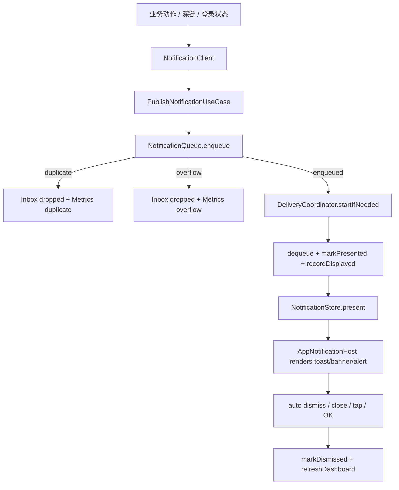

# SupportClientHuawei｜应用内通知详细技术方案

## 1. 对标范围与结论

- **后端与后台管理证据：** 应用内通知本身是客户端本地反馈能力，不依赖新增后端 API。本次未提供 `SparkService` 后端工程路径；若未来将服务端消息、后台运营通知或 Push payload 纳入应用内通知，必须重新读取后端路由、DTO/Serializer、service、permission、后台管理入口和测试。当前文档仅覆盖本地 toast/banner/alert、通知历史和展示指标，不设计平行 endpoint。
- **参考端与证据：** iOS `SupportClient/Projects/App/Sources/ContentView.swift`、`App/AppContainer.swift`、`App/Architecture/AssemblyProducts.swift`、`App/Notification/NotificationHostView.swift`、`App/Notification/NotificationFullScreenCover.swift`、`Projects/Core/Notification/Domain/NotificationModels.swift`、`Application/NotificationClient.swift`、`NotificationStore.swift`、`PublishNotificationUseCase.swift`、`NotificationDeliveryCoordinator.swift`、`Infrastructure/NotificationQueue.swift`、`NotificationInboxStore.swift`、`NotificationMetricsStore.swift`，以及 `SupportClient/总领文档/应用内通知/应用内通知需求.md`。
- **HarmonyOS 目标端与现状：** `SupportClientHuawei` 已落地 `Projects/Core/Notification`（Models/Queue/Inbox/Metrics/Store/Delivery/Client）、`App/Notification/NotificationAssembly.ets`、根级 `AppNotificationHost`（顶部 toast/banner）、`promptAction.showDialog` alert、以及 `LoginViewModel` 经 `NotificationClient` 的统一反馈。旧 `NotificationHost` 仅作转发 facade；`AuthToast` 已移除。系统 Push / Notification Kit（P6）未做。
- **目标用户能力：** 登录、深链、网络失败、账号升级、未来 AI/文件/OCR/相机等业务都通过统一入口发布应用内通知；用户能看到 toast、banner、alert；重复通知被抑制；通知历史与基础指标可用于诊断。
- **结论：** 华为端应用内通知 **P1–P5 已落地**（部分对齐：无系统 Push；无通知中心 Dashboard UI；fullScreenCover 共用根 Host）。

**当前实现状态（2026-07-18）：** P1–P5 已完成；单测见 `entry/src/test/ets/Notification/`；inbox 登出/鉴权失效/账号切换时清空。

## 2. 华为端目录设计

| 参考端目录/文件 | 参考端职责 | HarmonyOS 现有目录/文件 | HarmonyOS 目标目录/文件 | 状态 | 说明 |
| --- | --- | --- | --- | --- | --- |
| `ContentView.swift` | 根视图套 `NotificationHostView`，启动系统事件和 dashboard 刷新 | `entry/src/main/ets/pages/Index.ets` | 保持根 `Stack/Navigation`，接入 `AppNotificationHost` 组件 | 已实现 | 顶部 Host overlay；移除底部旧 toast Text。 |
| `AppContainer.swift` / `NotificationAssembly` | 装配 Store、Queue、Inbox、Metrics、Delivery、Client | `entry/src/main/ets/App/AppContainer.ets`、`App/NotificationHost.ets` | `entry/src/main/ets/App/Notification/NotificationAssembly.ets`、`NotificationClient.ets`、`NotificationStore.ets`、`NotificationDeliveryCoordinator.ets` | 已实现 | 旧 `NotificationHost` 转发 `NotificationClient.info`。 |
| `NotificationModels.swift` | level、presentation、intent、message、inbox、metrics、drop reason | 无 | `entry/src/main/ets/Projects/Core/Notification/Domain/NotificationModels.ets` | 已实现 | ArkTS 显式 class；rawValue 与 iOS 对齐。 |
| `NotificationClient.swift` | 业务发布协议和快捷方法 | 无；`LoginViewModel.ets` 直接写 `state.toastText` 或 `notificationHost.showToast` | `entry/src/main/ets/Projects/Core/Notification/Application/NotificationClient.ets` | 已实现 | 业务侧依赖 `NotificationClient`；禁止直接写 AppStorage toast key。 |
| `PublishNotificationUseCase.swift` | 入队、丢弃日志、启动投递 | 无 | `entry/src/main/ets/Projects/Core/Notification/Application/PublishNotificationUseCase.ets` | 已实现 | 与队列/投递协调器组合。 |
| `NotificationQueue.swift` | actor 队列、2 秒去重、128 容量、tap action 旁路 | 无 | `entry/src/main/ets/Projects/Core/Notification/Infrastructure/NotificationQueue.ets` | 已实现 | Promise 链串行入队。 |
| `NotificationDeliveryCoordinator.swift` | 串行消费、展示、自动消失、alert 等待 | 无 | `entry/src/main/ets/Projects/Core/Notification/Application/NotificationDeliveryCoordinator.ets` | 已实现 | toast/banner 自动消失；alert 用 `promptAction.showDialog`。 |
| `NotificationStore.swift` | 当前 toast/banner/alert、inbox、metrics、tap actions | `AppStorage` key `app.notificationToast` | `entry/src/main/ets/Projects/Core/Notification/Application/NotificationStore.ets` | 已实现 | AppStorage 只承载 UI JSON 摘要；兼容旧 toast 文本 key。 |
| `NotificationHostView.swift` | SwiftUI overlay + alert | `pages/Index.ets` 内联 Text overlay、`AuthToast.ets` | `entry/src/main/ets/App/Notification/AppNotificationHost.ets`、`NotificationBanner.ets`、`NotificationToast.ets` | 已实现 | 根级 Host；`AuthToast` 已删除。 |
| `NotificationInboxStore.swift` | JSON 文件保存最多 500 条历史 | 无 | `entry/src/main/ets/Projects/Core/Notification/Infrastructure/NotificationInboxStore.ets` | 已实现 | `filesDir/SupportClient/notification_inbox.json`；登出/失效/切换清空。 |
| `NotificationMetricsStore.swift` | 内存指标快照 | 无 | `entry/src/main/ets/Projects/Core/Notification/Infrastructure/NotificationMetricsStore.ets` | 已实现 | 与 iOS 一致先内存。 |
| `NotificationFullScreenCover.swift` | 全屏弹层内复用通知 Host | 无直接等价 | 由 `bindSheet` / `NavDestination` 内容套 `AppNotificationHost` 或共享根 Host | 部分对齐 | 共用根 Host，不复制专用 Host。 |
| `PushAdapter.swift` | 系统推送授权边界 | 无系统通知代码 | `entry/src/main/ets/Core/Notification/PushAdapter.ets`（未来） | 待实现/当前不适用 | P6 不做；应用内通知不要求系统通知权限。 |

目标文档目录为 `开发详细技术文档/应用内通知/`，沿用 iOS 参考端 `总领文档/应用内通知/` 业务名称。

## 3. 分层职责与请求链路

应用内通知不是网络请求链路，而是本地事件投递链路。目标分层如下：

- **Presentation：** `Index.ets` 根 `Stack` 挂载 `AppNotificationHost`；`NotificationToast`、`NotificationBanner`、`NotificationAlertDialog` 只负责渲染，不做业务判断。
- **Application：** `NotificationClient`、`PublishNotificationUseCase`、`NotificationDeliveryCoordinator` 负责发布、入队、投递、自动消失和 dashboard 刷新。
- **Domain：** `NotificationIntent`、`NotificationMessage`、`NotificationLevel`、`NotificationPresentation`、`NotificationDropReason`、`NotificationInboxItem`、`NotificationMetricsSnapshot`。
- **Infrastructure/Platform：** `NotificationQueue`、`NotificationInboxStore`、`NotificationMetricsStore`、文件 JSON 持久化、AppStorage/Observed 状态桥接、ArkUI PromptAction/Dialog 能力。

| 阶段 | 触发 | 输入 | 参与模块 | 成功 | 临时失败/恢复 | 永久失败/清理 | 用户可见状态 |
| --- | --- | --- | --- | --- | --- | --- | --- |
| 业务发布 | 登录/深链/网络失败/业务操作 | `NotificationIntent` 或快捷方法参数 | `NotificationClient`、业务 ViewModel | 创建发布任务 | 调用方无需等待 | intent 为空或 message 为空时拒绝并记录 | 无或后续通知 |
| 入队 | `PublishNotificationUseCase.execute` | intent、dedupeKey、source、presentation | `NotificationQueue` | message 入队、inbox queued、metrics enqueued | 重复或溢出时 dropped | 丢弃消息进入 inbox dropped | 暂无 |
| 投递启动 | 入队成功 | queue 状态 | `NotificationDeliveryCoordinator` | 消费循环启动 | 已在消费则复用循环 | 协调器销毁时停止 | 暂无 |
| 展示 | dequeue message | message、tap action | `NotificationStore`、Host 组件 | toast/banner/alert 可见 | AppStorage 更新失败时降级内存 | 当前 message dismiss | 顶部/底部提示或 alert |
| 关闭 | 自动计时、关闭按钮、点击、确认 | message id | Store、Delivery、Inbox、Metrics | dismissed 记录 | 自动计时取消后仍清理当前状态 | tap action 移除 | 通知消失 |
| Dashboard 刷新 | 入队/丢弃/展示/关闭/启动 | inbox、metrics | Delivery、Store | Store 可观察状态更新 | 文件读取失败为空 | 持久化失败记日志 | 未来调试/通知中心可见 |



## 4. 核心关键技术与实现方案

### 4.1 发布入口与业务依赖收敛

目标和职责边界：业务模块只发布通知意图，不直接操作 `AppStorage`、Host UI 或局部 toast 状态。认证、深链、未来 AI/文件/OCR/相机均复用同一 `NotificationClient`。

iOS 当前实现与证据：`NotificationClient.swift` 提供 `success/error/warning/info/publish`；`DefaultNotificationClient` 通过 `PublishNotificationUseCase` 异步入队；`LoginViewModel.swift` 使用 `notificationClient.success/error/warning/info`；`ContentView.swift` 在 `onOpenURL` 中发布 deeplink info。

HarmonyOS 当前实现与目标：当前 `LoginViewModel.ets` 在 `showComingSoon()` 中调用 `container.notificationHost.showToast('即将支持')`，发码成功则只写 `state.toastText`；目标是注入 `NotificationClient`，保留 `AuthToast` 过渡期，但新增业务必须走统一客户端。

官方资料：

- `AppStorage：应用全局的UI状态存储`：`https://developer.huawei.com/consumer/cn/doc/harmonyos-guides/arkts-appstorage`。用于根 Host 与业务状态解耦的全局 UI 状态桥接；需按 API 24 复核。
- `PersistentStorage：持久化存储UI状态`：`https://developer.huawei.com/consumer/cn/doc/harmonyos-guides/arkts-persiststorage`。仅用于理解 AppStorage 可持久化能力；本模块通知历史更适合显式文件存储，不建议把完整 inbox 交给 PersistentStorage。

本地示例：

- `/Users/hua/Documents/project/Reference/ClientSub-project/SparkAndroid/Package/Huawei/agc-template-market-harmonyos-demos-main/SocialTemplate/Community/components/aggregated_login/src/main/ets/viewmodel/AggregatedLoginVM.ets`：可借鉴 ViewModel 中触发 toast 的业务位置；禁止复制页面/VM 直接调用 `promptAction.showToast` 的分散模式，目标项目应统一走 `NotificationClient`。

ArkTS 职责骨架（伪代码，未编译验证）：

```ts
// 伪代码：具体 ArkTS 类型、import 与装饰器以目标工程 API 24 编译为准
export interface NotificationClient {
  publish(intent: NotificationIntent): void;
  success(message: string, title?: string, source?: string): void;
  error(message: string, title?: string, source?: string): void;
  warning(message: string, title?: string, source?: string): void;
  info(message: string, title?: string, source?: string): void;
}

export class DefaultNotificationClient implements NotificationClient {
  constructor(private readonly useCase: PublishNotificationUseCase) {}

  publish(intent: NotificationIntent): void {
    this.useCase.execute(intent).catch((err: Object) => {
      ErrorLogger.log('notification.publish_failed', LogModule.NOTIFICATION, err);
    });
  }

  success(message: string, title?: string, source: string = 'app'): void {
    this.publish(NotificationIntent.toast(title, message, NotificationLevel.SUCCESS, source));
  }
}
```

安全与验收规则：通知 message 进入 UI 和 inbox 前必须由业务层提供用户可见、脱敏文案；不得将 token、OTP、手机号全量、API Key、STS Secret、请求 header/body 作为通知内容。

### 4.2 队列、去重、容量和并发

目标和职责边界：实现 iOS 等价的串行队列、2 秒去重、128 最大深度、丢弃原因、tap action 旁路和 metrics/inbox 记录。HarmonyOS 没有 Swift actor，应用层应使用私有数组 + Promise 串行入口，保证同一 JS/ArkTS 运行环境下的入队/出队顺序。

iOS 当前实现与证据：`NotificationQueue.swift` 是 actor；`dedupeWindow=2.0`、`maxQueueDepth=128`；重复或溢出时 `recordDropped` 和 `markDropped`；成功时 `appendQueued` 和 `recordEnqueued`；`pendingTapActions` 按 UUID 保存闭包。

HarmonyOS 当前实现与目标：当前无队列；`NotificationHost.ets.showToast` 直接覆盖 `app.notificationToast`，重复调用会覆盖旧通知，没有自动消失、去重、inbox 或 metrics。目标新增 `NotificationQueue.ets`。

官方资料：

- `ArkTS并发概述` 可从 HarmonyOS 文档中心按目标 API Level 复核；本功能首期无需 TaskPool，多数操作可用 Promise/async 顺序队列完成。
- `AppStorage：应用全局的UI状态存储`：用于 Store → UI 的当前消息桥接，而非队列本体。

本地示例：

- `/Users/hua/Documents/project/Reference/ClientSub-project/SparkAndroid/Package/Huawei/agc-template-market-harmonyos-demos-main/MovieTVAndLivestreamingTemplate/LiveStreaming/commons/utils/src/main/ets/network/interceptor/TokenRefreshInterceptor.ts`：可借鉴“单个共享异步任务协调后续请求”的思路；禁止复制其 Token 业务、完整日志和缺少安全存储的实现细节。

ArkTS 职责骨架（伪代码，未编译验证）：

```ts
export class NotificationQueue {
  private readonly dedupeWindowMs: number = 2000;
  private readonly maxQueueDepth: number = 128;
  private messages: NotificationMessage[] = [];
  private lastSeenByKey: Map<string, number> = new Map();
  private tapActions: Map<string, NotificationTapAction> = new Map();

  async enqueue(intent: NotificationIntent): Promise<NotificationEnqueueResult> {
    const message = NotificationMessage.fromIntent(intent);
    const now = Date.now();
    const previous = this.lastSeenByKey.get(message.dedupeKey);
    if (previous !== undefined && now - previous < this.dedupeWindowMs) {
      await this.metrics.recordDropped(NotificationDropReason.DUPLICATE);
      await this.inbox.markDropped(message, NotificationDropReason.DUPLICATE, now);
      return NotificationEnqueueResult.dropped(message, NotificationDropReason.DUPLICATE);
    }
    if (this.messages.length >= this.maxQueueDepth) {
      await this.metrics.recordDropped(NotificationDropReason.QUEUE_OVERFLOW);
      await this.inbox.markDropped(message, NotificationDropReason.QUEUE_OVERFLOW, now);
      return NotificationEnqueueResult.dropped(message, NotificationDropReason.QUEUE_OVERFLOW);
    }
    this.messages.push(message);
    this.lastSeenByKey.set(message.dedupeKey, now);
    await this.inbox.appendQueued(message);
    await this.metrics.recordEnqueued();
    return NotificationEnqueueResult.enqueued(message);
  }
}
```

验收规则：重复通知 2 秒内不展示；队列满 128 后新消息 dropped；即使 dropped 也进入 inbox；队列本体不得放入 AppStorage。

### 4.3 投递协调与 Host 展示

目标和职责边界：投递协调器负责串行消费和生命周期；Host 只负责展示 `NotificationStore` 当前状态。toast/banner 自动消失，alert 等待用户确认，banner 可关闭/点击。

iOS 当前实现与证据：`NotificationDeliveryCoordinator.swift` 用 `isConsuming` 防重入；toast 默认 2 秒、最短 0.4 秒；banner 默认 2.8 秒、最短 0.6 秒；alert 等待 `waitForAlertDismissal`；`NotificationHostView.swift` 通过 overlay 和 `.alert` 展示。

HarmonyOS 当前实现与目标：当前 `Index.ets` 直接在根 `Stack` 底部渲染 `toastText`，没有计时清理；`AuthToast.ets` 是登录页面内部组件。目标新增根 `AppNotificationHost.ets`，用 `Stack` overlay 渲染 toast/banner；alert 可用自定义 dialog 或 ArkUI `AlertDialog` / `UIContext.getPromptAction().openCustomDialog`。

官方资料：

- `自定义弹窗选型与开发`：`https://developer.huawei.com/consumer/cn/doc/harmonyos-guides/custom-dialog-select-develop`。官方指出 `showToast` 只支持文本提示，图文混合可用 `UIContext.getPromptAction().openCustomDialog()`；本模块 banner/alert 需要自定义 UI。
- `弹出框概述`：`https://developer.huawei.com/consumer/cn/doc/harmonyos-guides/arkts-base-dialog-overview`。用于确认 ArkUI 弹窗、`getPromptAction` 和系统弹窗冲突等约束。
- `不依赖UI组件的全局自定义弹出框(openCustomDialog)`：`https://developer.huawei.com/consumer/cn/doc/harmonyos-guides/arkts-uicontext-custom-dialog`。用于未来 alert 或全局对话框，不直接替代根 overlay。

本地示例：

- `/Users/hua/Documents/project/Reference/ClientSub-project/SparkAndroid/Package/Huawei/agc-template-market-harmonyos-demos-main/BusinessTemplate/DailySchedule/components/aggregated_login/src/main/ets/views/QuickLoginPage.ets`：可借鉴 `getUIContext().getPromptAction().showToast` 的 API 调用位置；禁止复制页面内散点 toast 作为最终架构。
- `/Users/hua/Documents/project/Reference/ClientSub-project/SparkAndroid/Package/Huawei/agc-template-market-harmonyos-demos-main/SocialTemplate/Community/components/check_app_update/src/main/ets/utils/DialogController.ets`：可借鉴 `ComponentContent` + `openCustomDialog/closeCustomDialog` 的全局弹窗形态；禁止复制静态全局上下文和更新弹窗业务逻辑。

ArkTS 职责骨架（伪代码，未编译验证）：

```ts
@Component
export struct AppNotificationHost {
  @StorageLink('app.notification.currentToast') toastJson: string = '';
  @StorageLink('app.notification.currentBanner') bannerJson: string = '';

  build() {
    Stack() {
      // content 由 Index.ets 外层组合，这里只示意通知 overlay
      Column() {
        if (this.bannerJson.length > 0) {
          NotificationBanner({ json: this.bannerJson })
        }
        if (this.toastJson.length > 0) {
          NotificationToast({ json: this.toastJson })
        }
      }
      .align(Alignment.Top)
      .padding({ top: 8, left: 12, right: 12 })
    }
  }
}
```

验收规则：根 Host 覆盖启动页、登录页和主 Tab；alert 未关闭时不消费下一条；banner close 不触发 tap；tap 先 dismiss 再执行主线程动作。

### 4.4 收件箱、指标与文件持久化

目标和职责边界：保留最近 500 条通知历史，记录 queued/presented/dismissed/droppedReason，指标记录 enqueued/displayed/dropped/latency。文件持久化失败不能影响通知展示。

iOS 当前实现与证据：`NotificationInboxStore.swift` 默认 Application Support `SupportClient/notification_inbox.json`，最多 500 条，使用 `AtomicFileWriter.write`；`NotificationMetricsStore.swift` 指标只在内存。

HarmonyOS 当前实现与目标：当前无 inbox/metrics。目标在 `context.filesDir/SupportClient/notification_inbox.json` 或等价私有目录写 JSON；使用 Core File Kit `file.fs` 或项目已有文件工具封装原子写。若通知内容含账号敏感信息，应按 accountId 分文件或在登出/账号切换时清理。

官方资料：

- `ohos.file.fs (文件管理)`：`https://developer.huawei.com/consumer/cn/doc/harmonyos-references/js-apis-file-fs-V14`。用于私有文件读写、打开、写入和关闭；需按目标 API 24 复核。
- `通过用户首选项实现数据持久化(ArkTS)`：`https://developer.huawei.com/consumer/cn/doc/HarmonyOS-Guides/data-persistence-by-preferences`。Preferences 适合小型普通偏好，不适合完整通知历史 JSON；本模块只在配置类状态需要时参考。

本地示例：

- `/Users/hua/Documents/project/Reference/ClientSub-project/SparkAndroid/SupportClientHuawei/entry/src/main/ets/Projects/Features/Auth/Infrastructure/SessionSnapshotStore.ets`：项目内可借鉴 filesDir 下 JSON 持久化、解析失败降级和测试替换路径；禁止把通知敏感明文长期保存而不设账号清理。

ArkTS 职责骨架（伪代码，未编译验证）：

```ts
export class NotificationInboxStore {
  private readonly maxItems: number = 500;
  private items: NotificationInboxItem[] = [];

  constructor(private readonly filePath: string, private readonly logger: Logger) {
    this.items = this.loadItems();
  }

  async appendQueued(message: NotificationMessage): Promise<void> {
    this.items.unshift(NotificationInboxItem.queued(message));
    this.trim();
    await this.persistSafely();
  }

  private async persistSafely(): Promise<void> {
    try {
      const text = JSON.stringify(this.items);
      await AtomicTextFile.write(this.filePath, text);
    } catch (err) {
      ErrorLogger.log('notification.inbox_persist_failed', LogModule.NOTIFICATION, err as Object);
    }
  }
}
```

验收规则：重启后能加载历史；超过 500 条裁剪旧项；写入失败只记 warning；账号敏感通知必须明确清理策略。

### 4.5 系统通知与 Push 边界

目标和职责边界：应用内通知是前台 UI 反馈，不要求系统通知权限。系统通知、Push Token、后台点击拉起属于后续 Push 模块，不能混入当前本地队列的验收。

iOS 当前实现与证据：`Core/Notification/PushAdapter.swift` 仅请求 `UNUserNotificationCenter` 授权；`应用内通知需求.md` 明确 Push/远端 payload 不属于当前模块。

HarmonyOS 当前实现与目标：当前无 `notificationManager` 或 Push Kit 接入。未来如需后台通知，应新增 `Core/Notification/PushAdapter.ets` 并声明最小权限；远端 payload 转应用内通知时仍需经过 `NotificationClient`，并由路由/会话判断可见性。

官方资料：

- `@ohos.notificationManager (NotificationManager模块)`：`https://developer.huawei.com/consumer/cn/doc/harmonyos-references/js-apis-notificationmanager`。官方说明该模块提供发布、更新、取消通知、通知渠道和通知使能状态等能力；`publish(NotificationRequest)` 可能返回通知禁用、无权限、频率上限、网络不可达等错误。当前应用内 toast/banner 不依赖它。
- `点击消息通知跳转应用页面的方案`：`https://developer.huawei.com/consumer/cn/doc/architecture-guides/news-v1_2-ts_43-0000002309693434`。可作为未来系统通知点击路由参考，当前不落实现。

本地示例：

- 本地模板库中未选择系统通知发布样例作为本功能生产参考；多数示例使用页面 toast/dialog。若未来做 Push，应重新检索 `notificationManager` 和 Push Kit 示例。

验收规则：没有系统通知权限时，应用内通知仍可正常展示；系统通知失败不应污染本地 toast/banner 队列；Push payload 不得绕过会话和路由安全边界。

## 5. 接口契约与数据模型

### 5.1 通用数据与状态

| 模型/属性 | 外部字段名（JSON/DB/Preferences/文件） | ArkTS 类型 | 必填 | 敏感 | 来源与验证 | 生命周期/持久化 | 兼容规则 |
| --- | --- | --- | --- | --- | --- | --- | --- |
| `NotificationLevel.SUCCESS` | `success` | `string enum` | 是 | 否 | iOS `NotificationLevel.success` | message/inbox JSON | 与 iOS rawValue 对齐。 |
| `NotificationLevel.ERROR` | `error` | `string enum` | 是 | 否 | iOS `NotificationLevel.error` | message/inbox JSON | 默认展示为 banner。 |
| `NotificationLevel.WARNING` | `warning` | `string enum` | 是 | 否 | iOS `NotificationLevel.warning` | message/inbox JSON | 默认展示为 banner。 |
| `NotificationLevel.INFO` | `info` | `string enum` | 是 | 否 | iOS `NotificationLevel.info` | message/inbox JSON | 默认展示为 toast。 |
| `NotificationPresentation.TOAST` | `toast` | `string enum` | 是 | 否 | iOS `NotificationPresentation.toast` | message/inbox JSON | 自动消失默认 2 秒。 |
| `NotificationPresentation.BANNER` | `banner` | `string enum` | 是 | 否 | iOS `NotificationPresentation.banner` | message/inbox JSON | 自动消失默认 2.8 秒。 |
| `NotificationPresentation.ALERT` | `alert` | `string enum` | 是 | 否 | iOS `NotificationPresentation.alert` | message/inbox JSON | 用户确认后继续队列。 |
| `NotificationDropReason.DUPLICATE` | `duplicate` | `string enum` | 否 | 否 | iOS `NotificationDropReason.duplicate` | inbox JSON | 2 秒 dedupe window。 |
| `NotificationDropReason.QUEUE_OVERFLOW` | `queueOverflow` | `string enum` | 否 | 否 | iOS `queueOverflow` | inbox JSON | 队列深度 128。 |
| 当前 toast | `app.notification.currentToast` 或兼容 `app.notificationToast` | `string`/JSON string | 否 | 取决于 message | 当前 `NotificationHost.ets` + 目标 Store | AppStorage 内存 | 兼容旧 key 迁移期只承载文本。 |
| 当前 banner | `app.notification.currentBanner` | JSON string | 否 | 取决于 message | 目标设计 | AppStorage 内存 | 只存可展示摘要，不存闭包。 |
| 当前 alert | `app.notification.currentAlert` | JSON string 或 Store 对象引用 | 否 | 取决于 message | 目标设计 | Store 内存 | alert 阻塞队列。 |
| Inbox 文件 | `notification_inbox.json` | JSON array | 否 | 可能 | iOS inbox JSON | filesDir 私有文件 | 含敏感内容时需账号隔离/清理。 |
| Metrics 快照 | 无外部字段或 `NotificationMetricsSnapshot` | class | 否 | 否 | iOS metrics | 内存 | 重启归零，除非后续明确持久化。 |

### 5.2 按 API、存储或系统对象逐项展开

| 操作/模型 | 输入/输出 | 后端契约/方法与路径或系统 API | 鉴权/权限 | HTTP/业务错误与 Request ID | 缓存/并发策略 | 消费位置 | 证据 |
| --- | --- | --- | --- | --- | --- | --- | --- |
| `NotificationIntent` | 输入：title?、message、level、presentation、dedupeKey?、source、autoDismissAfter?、onTap?；输出：`NotificationMessage` | 本地领域模型，无后端 API | 无系统权限；message 必须脱敏 | 无 HTTP；业务错误由上游转用户文案 | 未入队前短生命周期 | `NotificationClient.publish` | iOS `NotificationModels.swift` |
| `NotificationMessage` | id、title?、message、level、presentation、source、dedupeKey、enqueuedAt、autoDismissAfter? | 本地领域模型 | 无 | 无 | 队列中 FIFO；id 用于 dismiss/tap | Queue、Store、Inbox | iOS `NotificationMessage.from(intent:)` |
| 发布快捷方法 | `success/error/warning/info` | 本地方法 | 无 | 无 | fire-and-forget；异常只记日志 | 业务 ViewModel | iOS `DefaultNotificationClient`、HarmonyOS `LoginViewModel.ets` 当前待收敛 |
| 入队 | intent → enqueued/dropped | 本地 `NotificationQueue.enqueue` | 无 | 无 | dedupe 2 秒；max 128；tapAction 按 id 旁路 | UseCase、Delivery | iOS `NotificationQueue.swift` |
| 投递 | message → Store 当前状态 | 本地 `NotificationDeliveryCoordinator` | 无 | 无 | `isConsuming` 防重入；alert 阻塞 | App Host | iOS `NotificationDeliveryCoordinator.swift` |
| Toast 展示 | currentToast | ArkUI 根 overlay；可选 `promptAction.showToast` 作为临时系统 toast | 不需要系统通知权限 | 无 | 默认 2 秒，最短 0.4 秒 | `Index.ets`/`AppNotificationHost.ets` | iOS `NotificationHostView.swift`、HarmonyOS `Index.ets` |
| Banner 展示 | currentBanner + tap action | ArkUI 自定义 overlay | 无 | 无 | 默认 2.8 秒，关闭清 tapAction | 根 Host | iOS banner view；HarmonyOS 待实现 |
| Alert 展示 | currentAlert | ArkUI `AlertDialog` 或 `UIContext.getPromptAction().openCustomDialog` | 无 | 无 | 等待用户 OK，继续队列 | 根 Host/Dialog | iOS `.alert`；官方 custom dialog 文档 |
| Inbox 持久化 | `[NotificationInboxItem]` JSON | Core File Kit `file.fs` 私有文件 | 无外部权限；私有目录 | 文件错误只记日志 | max 500；写失败不阻塞展示 | Delivery dashboard | iOS `NotificationInboxStore.swift`、官方 file.fs |
| Metrics | enqueued/displayed/drop/latency | 本地内存对象 | 无 | 无 | 原子更新由单线程/Promise 队列保证 | Dashboard/测试 | iOS `NotificationMetricsStore.swift` |
| 系统通知发布 | `NotificationRequest` | `notificationManager.publish` | 未来需通知授权/通知使能 | 可能出现 1600004/1600014/1600020/1600009 等错误 | 系统通知由系统队列管理 | 未来 PushAdapter | 官方 `NotificationManager`；当前不实现 |

待确认字段与规则：

| 项 | 待确认内容 | 影响 |
| --- | --- | --- |
| 账号隔离 | inbox 是否按 accountId 分文件，或登出/账号切换时清理 | 涉及账号隐私和历史可见性 |
| UI 位置 | HarmonyOS toast/banner 顶部还是底部，与 iOS 顶部 overlay 是否严格一致 | 涉及视觉验收 |
| Alert 实现 | 使用 ArkUI `AlertDialog` 还是 `openCustomDialog` | 涉及阻塞队列和测试方式 |
| 系统通知 | 是否接入 Push Kit/Notification Kit，以及 payload 到本地通知的映射 | 涉及权限和后台点击路由 |

## 6. iOS-HarmonyOS 功能对照矩阵

全局矩阵文件为 `开发详细技术文档/iOS-HarmonyOS功能对照矩阵.md`；本功能相关行如下：

| 参考端能力/证据 | 可观察行为 | HarmonyOS 实现/证据 | 官方能力 | 本地示例 | 对齐状态 | 差异与处理 |
| --- | --- | --- | --- | --- | --- | --- |
| iOS `NotificationClient`、`NotificationQueue`、`NotificationDeliveryCoordinator`、`NotificationHostView`、`NotificationInboxStore`、`NotificationMetricsStore`、`总领文档/应用内通知/应用内通知需求.md` | 业务统一发布 toast/banner/alert；2 秒去重；128 队列容量；收件箱最多 500 条；指标记录展示与丢弃；banner 支持点击 | `Projects/Core/Notification/**`、`App/Notification/*`、`AppContainer.notificationClient`、`Index`+`AppNotificationHost`、`LoginViewModel` 经 Client 发布、`entry/src/test/ets/Notification/*` | ArkUI AppStorage、`promptAction.showDialog`、Core File Kit `file.fs` API 24 | `aggregated_login` toast、`DialogController.ets`、`SessionSnapshotStore.ets` | 部分对齐 | P1–P5 已落地；P6 Push 未做；无 Dashboard UI；inbox 登出/切换清空 |

## 7. 示例工程与官方文档参考结论

| 类型 | 标题/代码位置 | URL/绝对路径 | 可借鉴内容 | 禁止直接复制/版本注意事项 |
| --- | --- | --- | --- | --- |
| 官方 | AppStorage：应用全局的UI状态存储 | https://developer.huawei.com/consumer/cn/doc/harmonyos-guides/arkts-appstorage | 根 Host 与业务状态解耦；AppStorage 适合当前可观察 UI 状态。 | 不把队列、完整 inbox、敏感通知内容都塞进 AppStorage。 |
| 官方 | PersistentStorage：持久化存储UI状态 | https://developer.huawei.com/consumer/cn/doc/harmonyos-guides/arkts-persiststorage | 了解 AppStorage 可持久化机制。 | 通知历史需要自主读写和账号清理，不建议直接用 PersistentStorage 承载完整 inbox。 |
| 官方 | 自定义弹窗选型与开发 | https://developer.huawei.com/consumer/cn/doc/harmonyos-guides/custom-dialog-select-develop | 图文 banner/alert 可用自定义 UI 或 PromptAction custom dialog。 | `showToast` 只适合文本提示，不满足 iOS banner/alert 等价能力。 |
| 官方 | 弹出框概述 | https://developer.huawei.com/consumer/cn/doc/harmonyos-guides/arkts-base-dialog-overview | alert/dialog 的 UIContext 与系统弹窗约束。 | 需按 API 24 复核弹窗焦点、系统权限弹窗冲突和生命周期。 |
| 官方 | ohos.file.fs (文件管理) | https://developer.huawei.com/consumer/cn/doc/harmonyos-references/js-apis-file-fs-V14 | inbox JSON 私有文件读写。 | V14 页面需按目标 SDK API 24 签名复核；写入要封装为原子/安全失败。 |
| 官方 | NotificationManager模块 | https://developer.huawei.com/consumer/cn/doc/harmonyos-references/js-apis-notificationmanager | 未来系统通知发布、取消、通知使能和错误码参考。 | 当前应用内通知不依赖系统通知权限；不要为 toast/banner 强制申请通知权限。 |
| 本地示例 | 聚合登录 toast | `/Users/hua/Documents/project/Reference/ClientSub-project/SparkAndroid/Package/Huawei/agc-template-market-harmonyos-demos-main/SocialTemplate/Community/components/aggregated_login/src/main/ets/viewmodel/AggregatedLoginVM.ets` | ViewModel 在业务结果处触发用户反馈的位置可参考。 | 禁止保留页面/VM 到处直接 `promptAction.showToast`；目标必须统一 `NotificationClient`。 |
| 本地示例 | 全局自定义弹窗控制 | `/Users/hua/Documents/project/Reference/ClientSub-project/SparkAndroid/Package/Huawei/agc-template-market-harmonyos-demos-main/SocialTemplate/Community/components/check_app_update/src/main/ets/utils/DialogController.ets` | `ComponentContent`、`openCustomDialog`、`closeCustomDialog` 形态可参考。 | 禁止复制静态全局 context、应用升级业务逻辑和无状态隔离写法。 |
| 本地项目 | SessionSnapshotStore 文件持久化 | `/Users/hua/Documents/project/Reference/ClientSub-project/SparkAndroid/SupportClientHuawei/entry/src/main/ets/Projects/Features/Auth/Infrastructure/SessionSnapshotStore.ets` | filesDir JSON 读写、解码失败降级、测试替换路径。 | 通知历史可能含隐私，不能照搬会话快照生命周期；必须补账号隔离/清理。 |

## 8. 实施拆分与验收

| 阶段 | 目标文件/模块 | 依赖 | 实施结果 | 自动化测试 | 人工验收 |
| --- | --- | --- | --- | --- | --- |
| P0 文档与矩阵 | `开发详细技术文档/应用内通知/应用内通知详细技术方案.md`、全局矩阵 | iOS 应用内通知需求、目标端现状 | 已完成 | Markdown 路径校验 | 评审范围、状态和风险是否准确 |
| P1 领域模型 | `Projects/Core/Notification/Domain/NotificationModels.ets` | 无 | 已完成 | `NotificationModels.test.ets` | 字段与 iOS rawValue 对齐 |
| P2 Queue/Metrics/Inbox | `NotificationQueue.ets`、`NotificationMetricsStore.ets`、`NotificationInboxStore.ets` | 文件工具、Logger | 已完成 | `NotificationQueue.test.ets` | 重复通知不刷屏，历史可恢复 |
| P3 Client/UseCase/Delivery | `NotificationClient.ets`、`PublishNotificationUseCase.ets`、`NotificationDeliveryCoordinator.ets`、`NotificationAssembly`、`AppContainer` | P1/P2 | 已完成 | `NotificationDelivery.test.ets` | 多条通知按顺序展示 |
| P4 根 Host UI | `AppNotificationHost.ets`、`NotificationToast.ets`、`NotificationBanner.ets`、`Index.ets` | ArkUI、AppStorage | 已完成 | 根 Host 人工验收 | 启动页/登录页/主 Tab 均可展示 |
| P5 业务接入收敛 | `AppContainer.ets`、`LoginViewModel.ets` | P3/P4 | 已完成 | Auth 反馈走 Client | `AuthToast` 已删除 |
| P6 系统通知边界 | 未来 `Core/Notification/PushAdapter.ets` | Notification Kit/Push Kit | 未做 | — | 无系统权限时应用内通知仍工作 |

验收清单：

- 正常：success/info 展示 toast，warning/error 展示 banner，自定义 alert 等待用户确认。
- 空数据：空 message 不入队，记录诊断。
- 重复：2 秒内相同 dedupeKey dropped duplicate。
- 溢出：队列 128 后 dropped queueOverflow。
- 并发：连续发布多条通知按 FIFO 串行展示。
- 取消/关闭：toast/banner 自动消失；banner 关闭不触发 tap；tap 先 dismiss 再执行动作。
- 账号切换/登出：敏感通知历史按策略隔离或清理。
- 前后台：前台应用内通知不依赖系统通知权限；后台系统通知另走 Push 边界。
- 日志：不得打印通知中的敏感内容；持久化失败只记录脱敏错误。

## 9. 风险与待确认项

| 编号 | 风险/待确认项 | 影响模块 | 证据 | 依赖方 | 关闭条件 |
| --- | --- | --- | --- | --- | --- |
| N-01 | 旧覆盖式 toast 已被 Queue/Store/Delivery 替代 | App/Notification | `NotificationAssembly` + Client | App 基础层 | 已关闭：业务走 `NotificationClient` |
| N-02 | 认证局部 AuthToast 双路径 | Auth UI、Notification | 已删除 `AuthToast.ets` | 会话与认证 | 已关闭：统一 `NotificationClient` |
| N-03 | inbox 账号隔离 | NotificationInboxStore、AccountSessionRuntime | 单文件 + 登出/失效/切换 `clear()` | 产品/安全 | 已关闭（清理策略）；按 accountId 分文件未做 |
| N-04 | Alert 实现选型 | Delivery | `promptAction.showDialog` | UI | 已关闭 |
| N-05 | 系统通知与应用内通知边界未来可能混淆 | PushAdapter、RouteCoordinator | iOS `PushAdapter.swift` 与应用内通知分离 | 产品/Push 后续需求 | Push 技术方案单独建立（P6 未做） |
| N-06 | 实现需 CompileArkTS 验收 | 所有目标 ETS | P1–P5 代码已落地 | 实现阶段 | 已关闭：`entry:default@CompileArkTS` 通过（PackageHap 仍可能因本机 Java 环境失败） |
