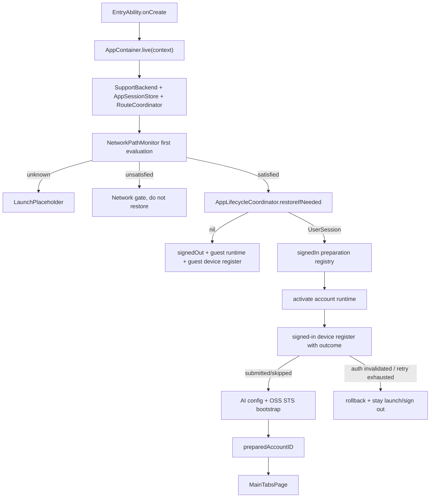

# SupportClientHuawei｜应用启动链路详细技术方案

## 1. 对标范围与结论

- **后端与后台管理证据：** 本次未提供 `SparkService` 后端工程路径；启动链路涉及的后端事实只能来自 iOS/HarmonyOS 客户端已消费的 API path。已确认客户端消费路径包括 `/api/v1/auth/session/`、`/api/v1/auth/device/login/`、Token 刷新、AI config bootstrap、未来设备登记 `/api/v1/device/register/` 待后端代码确认。后台管理端是否复用同一服务层当前未确认。
- **参考端与证据：** iOS `SupportClient/Projects/App/Sources/SupportClientApp.swift`、`App/AppContainer.swift`、`App/AppBootstrapper.swift`、`App/Architecture/AppLifecycleCoordinator.swift`、`App/AppSessionStore.swift`、`App/AppCoordinatorView.swift`、`App/DeviceRegistrationCoordinator.swift`、`App/DeviceRegistrationRequestOutcome.swift`、`App/Architecture/SignedInSessionPreparationRegistry.swift`，以及 `总领文档/应用启动链路/应用启动链路需求.md`。
- **HarmonyOS 目标端与现状：** `SupportClientHuawei` 已具备 `EntryAbility`、`AppContainer`、`AppLifecycleCoordinator`、`AppSessionStore`、`RouteCoordinator`、`AccountSessionRuntime`、`SignedInSessionPreparationRegistry`、`DeviceRegistrationCoordinator`、`SupportSystemInfo`、`AppBootstrapper`、`DeviceAPI`、`NetworkPathMonitor`、`pages/Index`（prepared 门禁 + 网络门禁）。冷启动在网络 `satisfied` 后恢复会话；已登录串行设备登记 + AI bootstrap 后标记 prepared 再进主 Tab；设备凭证 HUKS 已接；OSS STS 明确跳过；SecureToken HUKS 仍待。
- **目标用户能力：** 冷启动后根据网络和会话状态稳定进入启动页、登录页或主框架；登录后不展示未准备完成的账号数据；Token 明确失效时回登录态并清理账号级运行时；网络不可用时不批量触发失败请求。
- **结论：** 华为端启动链路 **P1–P5 已落地**；设备登记 **P3–P6 已落地**（部分对齐：OSS/SecureToken HUKS/真机联调仍待）。

## 2. 华为端目录设计

| 参考端目录/文件 | 参考端职责 | HarmonyOS 现有目录/文件 | HarmonyOS 目标目录/文件 | 状态 | 说明 |
| --- | --- | --- | --- | --- | --- |
| `SupportClientApp.swift` | iOS App 入口与容器创建 | `entryability/EntryAbility.ets` | 保持 | 已实现 | `onCreate` 绑 L10n + `AppContainer.live`；`onForeground` 轻量登记 |
| `ContentView` / `AppCoordinatorView` | 根视图分流 | `pages/Index.ets`、`NetworkGateView.ets`、`NotificationHost.ets` | 同左 | 已实现 | offline 门禁 + prepared 后 MainTabs |
| `AppContainer.swift` | 组合根 | `App/AppContainer.ets` | 同左 | 已实现 | 装配 lifecycle/prep/device/bootstrap；不再立即 restore |
| `AppLifecycleCoordinator.swift` | 冷启动编排 | `App/AppLifecycleCoordinator.ets` | 同左 | 已实现 | 网络 satisfied 后一次性 restore |
| `AppSessionStore.swift` | 根会话状态 | `App/AppSessionStore.ets` | 同左 | 已实现 | restore 调 runtime；enterSignedIn 钩子触发准备 |
| `NetworkPathMonitor.swift` | 网络评估 | `Foundation/NetworkPathMonitor.ets` | 同左 | 已实现 | lifecycle 订阅 |
| `DeviceRegistrationCoordinator.swift` | 设备登记 | `App/DeviceRegistrationCoordinator.ets`、`API/Device/DeviceAPI.ets` | 同左 | 已实现 | snake_case；3 次退避 |
| `AppBootstrapper.swift` | 账号 bootstrap | `App/AppBootstrapper.ets` | 同左 | 部分对齐 | AI 已接；OSS 显式 skip |
| `SignedInSessionPreparationRegistry.swift` | prepared 单飞 | `App/SignedInSessionPreparationRegistry.ets` | 同左 | 已实现 | `app.preparedAccountId` |
| `RouteCoordinator.swift` | 失效事件 | `App/RouteCoordinator.ets` | 同左 | 已实现 | 转交 lifecycle |
| `AccountSessionRuntime.swift` | 账号运行时 | `App/AccountSessionRuntime.ets` | 同左 | 部分对齐 | activateUser + currentAccountId；AI/文件缓存待扩 |
| 测试 | 启动/登记/bootstrap | `entry/src/test/ets/Startup/*.test.ets` | 同左 | 已实现 | StartupLifecycle / DeviceRegistration / AppBootstrapper |

目标文档目录为 `开发详细技术文档/应用启动链路/`，与 iOS 参考端 `总领文档/应用启动链路/` 保持同名业务目录。

## 3. 分层职责与请求链路

启动链路应拆为四层：

- **Presentation：** `EntryAbility.ets` 只加载根页；`pages/Index.ets` 根据根状态渲染启动页、登录页、主框架和网络门禁。
- **Application：** `AppLifecycleCoordinator.ets` 统一调度冷启动、网络门控、会话恢复、未登录清理、已登录准备和鉴权失效。
- **Domain/State：** `AppSessionStore.ets`、`SignedInSessionPreparationRegistry.ets`、`AccountSessionRuntime.ets` 持有会话、prepared、generation 和账号运行时状态。
- **Infrastructure/Platform：** `SupportBackend`、`NetworkPathMonitor`、`AuthRepository`、`DeviceRegistrationCoordinator`、`AppBootstrapper`、安全存储、Preferences、HTTP 和系统事件。

| 阶段 | 触发 | 输入 | 参与模块 | 成功 | 临时失败/恢复 | 永久失败/清理 | 用户可见状态 |
| --- | --- | --- | --- | --- | --- | --- | --- |
| Ability 创建 | `EntryAbility.onCreate` | `UIAbilityContext`、环境配置 | `L10n`、`AppContainer`、`StartupLogger` | 容器单例创建 | 容器创建失败记录启动日志 | 不能继续业务初始化 | 启动页或加载失败 |
| 窗口加载 | `onWindowStageCreate` | `WindowStage` | `windowStage.loadContent('pages/Index')` | 根页可渲染 | loadContent 失败记录错误 | 无页面可见 | 系统启动失败 |
| 网络首次评估 | `NetworkPathMonitor.start()` | 默认网络状态 | `connection.createNetConnection`、`getDefaultNet` | `hasEvaluated=true` 且 satisfied | unknown 时继续等待或降级 | unsatisfied 时不恢复会话 | 启动页 + 网络门禁 |
| 会话恢复 | 网络可用后 | 快照、Token、远端 session | `AppSessionStore`、`RestoreSessionUseCase`、`DefaultAuthRepository` | `.signedIn` 或 `.signedOut` | Token 暂不可用时保留快照 | 明确失效清 token/快照 | 登录页或启动页 |
| 未登录处理 | `.signedOut` | 无会话 | `AccountSessionRuntime`、`DeviceRegistrationCoordinator` | guest 运行时与游客登记 | 登记失败只记日志 | 不阻塞登录 | 登录页 |
| 已登录准备 | `.signedIn(session)` | `UserSession` | `SignedInSessionPreparationRegistry`、`AccountSessionRuntime`、设备登记、`AppBootstrapper` | `preparedAccountID=session.accountId` | 设备登记有限重试、AI/OSS 预热失败降级策略待定 | 鉴权失效或重试耗尽回滚 | 启动页，完成后主 Tab |
| 鉴权失效 | 网络层 `SessionInvalidation` | status/code/message/source | `RouteCoordinator`、`AppLifecycleCoordinator`、`AppSessionStore` | 回到 signedOut | 重复事件去重 | 清 token、快照、账号运行时 | 登录页 |



## 4. 核心关键技术与实现方案

### 4.1 UIAbility 入口与单例组合根

目标和职责边界：`EntryAbility` 只负责系统生命周期、资源绑定、容器创建和根页面加载；业务状态迁移全部进入 `AppLifecycleCoordinator`。

iOS 当前实现：`SupportClientApp.swift` 使用 `@State private var container = AppContainer.live()`，`WindowGroup` 注入 `ContentView` 与 Core Data context。

HarmonyOS 当前实现：`EntryAbility.ets` 在 `onCreate` 中绑定 `L10n` 并调用 `AppContainer.live(this.context)`；`onWindowStageCreate` 加载 `pages/Index`；`onDestroy` 停止网络监听。

HarmonyOS 目标路径：

- 保留 `EntryAbility.ets` 的单一入口。
- `AppContainer.live()` 创建 `AppLifecycleCoordinator` 后，不再直接调用 `sessionStore.restoreIfNeeded()`；改为由生命周期协调器等待网络评估后触发。
- `AppContainer.resetForTests()` 同时停止 lifecycle、route、network 订阅，避免单测污染。

官方资料：

- `UIAbility组件生命周期`：`https://developer.huawei.com/consumer/cn/doc/HarmonyOS-Guides/uiability-lifecycle`。用于确认 `onCreate`、`onWindowStageCreate`、`onForeground`、`onBackground`、`onDestroy` 的触发顺序，需按目标 API 24 复核。
- `Stage模型开发概述`：`https://developer.huawei.com/consumer/en/doc/harmonyos-guides/stage-model-development-overview`。用于确认 Stage 模型中 Ability 与窗口阶段职责边界。

本地示例：

- `/Users/hua/Documents/project/Reference/ClientSub-project/SparkAndroid/Package/Huawei/agc-template-market-harmonyos-demos-main/HouseAndHomeTemplate/RentAndBuy/product/entry/src/main/ets/entryability/EntryAbility.ets`：可借鉴 `onWindowStageCreate` 中设置窗口、加载 `pages/Index` 和生命周期日志；禁止复制微信登录回调、测试用户写入和 `JSON.stringify(err)` 风格日志。

ArkTS 职责骨架（伪代码，未编译验证）：

```ts
// 伪代码：具体导入与类型以目标工程 SDK API 24 编译为准
export default class EntryAbility extends UIAbility {
  onCreate(want: Want, launchParam: AbilityConstant.LaunchParam): void {
    L10n.bindContext(this.context);
    const container = AppContainer.live(this.context);
    container.lifecycle.onAbilityCreated();
  }

  onWindowStageCreate(windowStage: window.WindowStage): void {
    windowStage.loadContent('pages/Index', (err) => {
      if (err.code) {
        StartupLogger.windowContentFailed(err.code);
        return;
      }
      AppContainer.shared()?.lifecycle.onWindowReady();
    });
  }

  onDestroy(): void {
    AppContainer.shared()?.shutdown();
  }
}
```

验收规则：容器只创建一次；Ability 前后台不会重复恢复会话；窗口销毁只释放 UI/监听资源，不清登录态。

### 4.2 网络评估门控

目标和职责边界：启动链路必须区分“网络尚未评估”和“确认无网络”。只有已评估且可用时，才恢复会话和执行远端 bootstrap。

iOS 当前实现：`AppCoordinatorView` 持有 `NetworkPathMonitor`，`.loading` 的 `.task(id:)` 调用 `bootstrapLaunchAfterNetworkEvaluation(networkHasEvaluated:networkSatisfied:)`；网络不可用显示 `NetworkGateView`。

HarmonyOS 当前实现：`SupportBackend` 创建并启动 `NetworkPathMonitor`；`NetworkPathMonitor.ets` 有 `unknown/satisfied/unsatisfied` 与 `hasEvaluated`；但 `AppContainer.live()` 当前立即调用 `sessionStore.restoreIfNeeded()`，未等待网络首次评估。

HarmonyOS 目标路径：

- `AppLifecycleCoordinator` 订阅 `backend.networkPathMonitor`。
- 首次 `hasEvaluated=false` 时保持 `loading`。
- `unsatisfied` 时发布网络门禁 UI 状态，不调用恢复会话。
- 从 `unsatisfied/unknown` 变为 `satisfied` 时调用 `restoreIfNeeded()`；若已恢复过，不重复。

官方资料：

- `ohos.net.connection (网络连接管理)`：`https://developer.huawei.com/consumer/cn/doc/harmonyos-references/js-apis-net-connection`。用于 `connection.createNetConnection()`、`register()`、`netAvailable/netLost/netUnavailable`、`getDefaultNet()`；官方说明 `getDefaultNet` 需要 `ohos.permission.GET_NETWORK_INFO`，目标端需补充权限或避免调用需权限 API。
- `发送网络请求（ArkTS）`：`https://developer.huawei.com/consumer/cn/doc/harmonyos-guides/http-request`。用于 HTTP request 生命周期、销毁和网络权限。

本地示例：

- `/Users/hua/Documents/project/Reference/ClientSub-project/SparkAndroid/Package/Huawei/agc-template-market-harmonyos-demos-main/MovieTVAndLivestreamingTemplate/LiveStreaming/commons/utils/src/main/ets/utils/NetConnectionUtil.ts`：可借鉴 `createNetConnection`、`netAvailable/netLost/netUnavailable` 和 listener 集合；禁止复制其默认 Wi-Fi 初始状态、注释掉的 register、完整网络类型日志和 `null` 单例写法。

ArkTS 职责骨架（伪代码，未编译验证）：

```ts
export class AppLifecycleCoordinator {
  private didBootstrapLaunch: boolean = false;

  start(): void {
    this.backend.networkPathMonitor.subscribe((status, hasEvaluated) => {
      this.handleNetwork(status, hasEvaluated).catch((err: Object) => {
        ErrorLogger.log('startup.network_gate_failed', LogModule.LIFECYCLE, err);
      });
    });
  }

  private async handleNetwork(status: NetworkPathStatus, hasEvaluated: boolean): Promise<void> {
    if (!hasEvaluated) {
      this.publishNetworkGate('evaluating');
      return;
    }
    if (status !== 'satisfied') {
      this.publishNetworkGate('offline');
      return;
    }
    if (this.didBootstrapLaunch) {
      return;
    }
    this.didBootstrapLaunch = true;
    await this.sessionStore.restoreIfNeeded();
    await this.handleCurrentSessionState('coldLaunch');
  }
}
```

验收规则：断网冷启动不请求 `/api/v1/auth/session/`；网络恢复后只触发一次会话恢复；`GET_NETWORK_INFO` 权限和隐私说明需与 `module.json5` 资源同步。

### 4.3 会话恢复与根路由状态

目标和职责边界：会话恢复只更新根状态，不直接让主框架展示旧账号数据；账号准备完成前 UI 仍显示启动页。

iOS 当前实现：`AppSessionStore.restoreIfNeeded()` 冷启动只恢复一次；`DefaultAuthRepository.restoreSession()` 使用快照 + Token + `fetchCurrentSession()`；明确失效清理，临时失败保留快照。

HarmonyOS 当前实现：`AppSessionStore.ets` 有 `loading/signedOut/signedIn`、`restoreStarted`、`generation`；`DefaultAuthRepository.restoreSession()` 读取 `SessionSnapshotStore`、预热 `AuthTokenProvider`、调用 `AuthAPI.currentSession()`；`pages/Index.ets` 直接按 sessionState 显示登录页或主 Tab。

HarmonyOS 目标路径：

- `AppSessionStore` 继续作为根会话状态源。
- 新增 `preparedAccountID` 或 `startup.accountPrepared` AppStorage 键；`signedIn` 但未 prepared 时显示 `LaunchPlaceholder`。
- `AppSessionStore.enterSignedIn(session)` 只表示认证完成，不表示账号运行时准备完成。
- `AppLifecycleCoordinator` 监听或显式处理 `.signedIn` 后的账号准备。

官方资料：

- `Navigation`：`https://developer.huawei.com/consumer/cn/doc/harmonyos-references/ts-basic-components-navigation`。用于根 `Navigation` 容器与 `NavPathStack`。
- `Using Tabs (Tabs)`：`https://developer.huawei.com/consumer/cn/doc/harmonyos-guides/arkts-navigation-tabs`。用于主框架 `Tabs` 结构。

本地示例：

- `/Users/hua/Documents/project/Reference/ClientSub-project/SparkAndroid/Package/Huawei/agc-template-market-harmonyos-demos-main/HouseAndHomeTemplate/HomeDecoration/products/entry/src/main/ets/pages/MainEntry.ets`：可借鉴 `Navigation + Tabs + controller` 的组合和事件注销；禁止复制全局 VM 单例作为业务状态真相。
- `/Users/hua/Documents/project/Reference/ClientSub-project/SparkAndroid/Package/Huawei/agc-template-market-harmonyos-demos-main/HouseAndHomeTemplate/RentAndBuy/product/entry/src/main/ets/pages/Index.ets`：可借鉴 `Navigation(RouterModule.stack)` 包裹 Tabs；禁止复制模板路由常量和业务图标。

ArkTS 职责骨架（伪代码，未编译验证）：

```ts
export const PREPARED_ACCOUNT_ID_KEY: string = 'app.preparedAccountId';

@Entry
@Component
struct Index {
  @StorageLink(SESSION_STATE_KEY) sessionState: string = 'loading';
  @StorageLink(PREPARED_ACCOUNT_ID_KEY) preparedAccountId: number = -1;
  @StorageLink('app.currentAccountId') currentAccountId: number = -1;

  build() {
    Navigation(this.rootStack) {
      if (this.sessionState === 'signedOut') {
        LoginPage()
      } else if (this.sessionState === 'signedIn' && this.preparedAccountId === this.currentAccountId) {
        MainTabsPage()
      } else {
        LaunchPlaceholder()
      }
    }
  }
}
```

验收规则：登录成功后如果设备登记/账号 bootstrap 未完成，不进入主 Tab；旧账号 prepared 不能放行新账号。

### 4.4 已登录账号准备、设备登记与账号级 bootstrap

目标和职责边界：已登录准备必须串行化并可回滚。设备登记失败、鉴权失效或账号切换时，不能继续 AI/OSS bootstrap。

iOS 当前实现：

- `SignedInSessionPreparationRegistry` 合并同一账号 in-flight 任务，成功后 `.prepared(accountID)`。
- `DeviceRegistrationCoordinator.requestRegisterWithLimitedRetry` 最多 3 次，退避 0ms、300ms、600ms，返回 `submitted/skippedSameLaunchSubmission/failedRetryable/authSessionInvalidated`。
- `AppBootstrapper.bootstrapAccountIfNeeded` 执行 AI prewarm、remote config refresh 和 OSS STS prefetch，并按 accountID 去重。

HarmonyOS 当前实现：

- `SignInWithDeviceUseCase` 有单飞。
- `AIConfigAPI.bootstrap` 已存在 API 雏形。
- `SupportDeviceAPI` 仍为空壳；没有 `DeviceRegistrationCoordinator`、`AppBootstrapper` 和 signed-in preparation registry。
- `AccountSessionRuntime` 只记录当前账号和清理快照，AI/文件/OSS 运行时清理尚未接入。

HarmonyOS 目标路径：

- 新增 `SignedInSessionPreparationRegistry.ets`，状态为 `idle/preparing/prepared`。
- 新增 `DeviceRegistrationRequestOutcome.ets` 与 `DeviceRegistrationCoordinator.ets`。
- 新增 `AppBootstrapper.ets`，首期可只接 `AIConfigAPI.bootstrap`，OSS/File 未实现时明确跳过并记录待实现，不伪造成功。
- `AccountSessionRuntime.onSignedIn(session)` 扩展为 `activateUser(accountId)`，在账号切换时清路由、AI/OSS/File 运行时。

后端接口待确认：

- iOS 文档提到 `/api/v1/device/register/`；华为端当前 `SupportDeviceAPI` 未实现。必须以后端路由/serializer 确认字段后再写 ArkTS DTO。
- `AIConfigAPI.bootstrap(clientVersion?)` 已存在，但账号级使用时要确认是否需要 owner account scope、ETag 和鉴权。
- OSS STS 预取在华为端尚无 API/Store，不能标记为已实现。

ArkTS 职责骨架（伪代码，未编译验证）：

```ts
export type DeviceRegistrationOutcome =
  'submitted' | 'skippedSameLaunchSubmission' | 'failedRetryable' | 'authSessionInvalidated';

export class SignedInSessionPreparationRegistry {
  private preparingAccountId?: number;
  private preparedId?: number;
  private inFlight?: Promise<void>;

  async runIfNeeded(accountId: number, operation: () => Promise<void>): Promise<void> {
    if (this.preparedId === accountId) {
      return;
    }
    if (this.inFlight && this.preparingAccountId === accountId) {
      await this.inFlight;
      return;
    }
    this.preparingAccountId = accountId;
    this.inFlight = operation().finally(() => {
      this.inFlight = undefined;
      this.preparingAccountId = undefined;
    });
    await this.inFlight;
  }

  markPrepared(accountId: number): void {
    this.preparedId = accountId;
    AppStorage.setOrCreate(PREPARED_ACCOUNT_ID_KEY, accountId);
  }
}
```

验收规则：同账号并发只跑一次；设备登记返回失败时不执行 AI/OSS；账号切换后旧账号 prepared 作废；OSS 未实现阶段必须在文档和测试中标为待实现。

### 4.5 鉴权失效、账号清理与安全存储

目标和职责边界：401 或明确 token 失效消息只通过统一事件进入生命周期清理；业务页面不能自行清 token 或跳登录。

iOS 当前实现：`SupportAuthSessionInvalidation` 判断 401、401xx 和明确 token 失效消息；`RouteCoordinator` 监听事件并调用 `AppLifecycleCoordinator.handleServerAuthInvalidationIfNeeded`；生命周期清理 token、快照、设备登记、账号运行时和 bootstrap。

HarmonyOS 当前实现：`SessionInvalidation.ets` 可判断 401、401xx、`token_not_valid/invalid_token/token_expired`；`RouteCoordinator` 订阅后调用 `AppSessionStore.handleAuthInvalidated`；`SupportBackend` 订阅失效事件并清 token、ETag、DeviceCache；`AccountSessionRuntime.onAuthInvalidated` 清快照。

HarmonyOS 目标路径：

- `RouteCoordinator` 收到事件后转给 `AppLifecycleCoordinator.handleServerAuthInvalidation(source)`。
- 生命周期先暂停设备登记和准备任务，再调用 `sessionStore.handleAuthInvalidated(generation)`，最后清 account runtime 和 bootstrap state。
- Token 与设备密钥不得写入 Preferences；当前 `SecureTokenStore` 和 `DeviceCredentialStore` 是沙箱加密文件，后续需升级或验证 HUKS。

官方资料：

- `Universal Keystore Kit（密钥管理服务）`：`https://developer.huawei.com/consumer/cn/doc/harmonyos-guides/huks-overview`。用于敏感 token/deviceSecret 的密钥管理边界。
- `ohos.data.preferences (用户首选项)`：`https://developer.huawei.com/consumer/cn/doc/harmonyos-references-v5/js-apis-data-preferences-V5`。Preferences 适合轻量普通数据，但官方说明存在多进程并发风险，不能存明文 Token。

验收规则：403 不触发会话失效；重复 invalidation 去重；旧 generation 事件不影响新登录；日志不输出 token、deviceSecret、Authorization、STS Secret。

## 5. 接口契约与数据模型

### 5.1 通用数据与状态

| 模型/属性 | 外部字段名（JSON/DB/Preferences/文件） | ArkTS 类型 | 必填 | 敏感 | 来源与验证 | 生命周期/持久化 | 兼容规则 |
| --- | --- | --- | --- | --- | --- | --- | --- |
| 会话状态 | `app.sessionState` | `'loading' \| 'signedOut' \| 'signedIn'` | 是 | 否 | `AppSessionStore.ets` | AppStorage，进程内 UI 状态 | 仅根会话源写入 |
| 会话 generation | `app.sessionGeneration` | `number` | 是 | 否 | `AppSessionStore.ets` | AppStorage，进程内 | 失效事件必须匹配 generation |
| 当前账号 ID | 建议 `app.currentAccountId` | `number` | signedIn 必填 | 低敏 | 目标设计 | AppStorage + 内存 | 只来源于 `UserSession.accountId` |
| prepared 账号 ID | 建议 `app.preparedAccountId` | `number` | signedIn 准备完成后必填 | 低敏 | 目标设计 | AppStorage + registry 内存 | 必须等于当前账号才展示主 Tab |
| 网络状态 | `NetworkPathStatus` | `'unknown' \| 'satisfied' \| 'unsatisfied'` | 是 | 否 | `NetworkPathMonitor.ets` | 内存 | unknown 不等于 offline |
| 网络是否已评估 | `hasEvaluatedPath` | `boolean` | 是 | 否 | `NetworkPathMonitor.ets` | 内存 | false 时不恢复会话 |
| 会话快照 | `session/user_session.json` | `UserSession` JSON | signedIn 后必填 | 是，含账号身份摘要 | `SessionSnapshotStore.ets` | filesDir 私有文件 | 不含 Token/deviceSecret |
| Token | SecureTokenStore 内部文件 | access/refresh token | 登录后必填 | 是 | `SecureTokenStore.ets` | filesDir 沙箱加密；建议 HUKS | 不进 Preferences/日志 |
| 设备凭证 | `secure-device/device.enc` | `deviceId/deviceSecret/bundleId` | 设备登录/OTP 必填 | 是 | `DeviceCredentialStore.ets` | filesDir 沙箱加密；建议 HUKS | deviceSecret 不进日志 |
| 失效标记 | `SessionInvalidation.invalidating` | `boolean` | 否 | 否 | `SessionInvalidation.ets` | 静态内存 | 清理完成后必须复位 |
| 账号准备状态 | `idle/preparing/prepared` | enum/string | 是 | 否 | 目标设计 | registry 内存 | 失败回滚 idle |

### 5.2 按 API、存储或系统对象逐项展开

| 操作/模型 | 输入/输出 | 后端契约/方法与路径或系统 API | 鉴权/权限 | HTTP/业务错误与 Request ID | 缓存/并发策略 | 消费位置 | 证据 |
| --- | --- | --- | --- | --- | --- | --- | --- |
| 当前会话恢复 | 输入：access/refresh token；输出：`CurrentSessionResult` | `GET /api/v1/auth/session/` | Bearer Token | 401/401xx 触发会话失效；其他网络错误可保留快照 | `restoreStarted` 防重复；TokenProvider refresh 单飞 | `DefaultAuthRepository.restoreSession()` | `AuthAPI.ets`、`DefaultAuthRepository.ets`、iOS `DefaultAuthRepository.swift` |
| 设备账号登录 | 输入：`bundleId/deviceId/deviceSecret`；输出：认证上下文 | `POST /api/v1/auth/device/login/` | 无 Bearer；设备密钥参与认证 | 业务错误按网络层解码；成功写 token/快照 | `SignInWithDeviceUseCase` 单飞 | `LoginViewModel.signInWithDevice()` | `AuthAPI.ets`、`SignInWithDeviceUseCase.ets` |
| 登出 | 输入：当前 token；输出：无 | iOS/HarmonyOS `AuthAPI.logout()`，具体 path 以后端为准 | Bearer Token | 服务端失败仍清本地 | 本地清理幂等 | `SettingsPage.ets`、`DefaultAuthRepository.signOut()` | `DefaultAuthRepository.ets` |
| 设备登记 | 输入：设备系统信息、user/account、pushToken、appVersion 等；输出：`DeviceRegistrationOutcome` | iOS 消费 `/api/v1/device/register/`；华为端待后端确认 | 游客不带 token；已登录带 token | 401/401xx 返回 `authSessionInvalidated`；可恢复错误有限重试 | 同启动周期 `lastRegisteredKey` 去重；已登录最多 3 次 | 目标 `DeviceRegistrationCoordinator` | iOS `DeviceRegistrationCoordinator.swift`；华为 `SupportDeviceAPI` 当前空壳 |
| AI 配置 bootstrap | 输入：accountID/clientVersion；输出：AI config bootstrap result | `AIConfigAPI.bootstrap(clientVersion?)`，path 以后端确认 | 已登录 Bearer | 401 中止账号准备；普通失败可降级策略待定 | 按 accountId 去重 | 目标 `AppBootstrapper` | `AIConfigAPI.ets`、iOS `AppBootstrapper.swift` |
| OSS STS 预取 | 输入：accountID；输出：STS 凭证 | iOS `SupportOSSAPI`；华为端待实现 | 已登录 Bearer | 401 中止；STS Secret 敏感 | 内存短生命周期，不落 Preferences | 目标 `AppBootstrapper` | iOS `AppBootstrapper.swift`；华为端无 Store |
| 网络状态监听 | 输入：系统默认网络 | `connection.createNetConnection()`、`register()`、`getDefaultNet()` | `getDefaultNet` 需 `ohos.permission.GET_NETWORK_INFO`；HTTP 需 INTERNET | 系统错误只影响门控状态，不当作业务失败 | start/stop 幂等 | `SupportBackend.networkPathMonitor` | `NetworkPathMonitor.ets`、官方 connection 文档 |
| Preferences 普通缓存 | 输入：普通 KV | `@kit.ArkData preferences` | 不存敏感凭证 | flush 失败需记录脱敏日志 | 不跨进程并发 | `DeviceCache.ets` 等 | 官方 Preferences 文档 |

待后端确认字段：

| 接口/模型 | 字段 | 当前来源 | 待确认内容 |
| --- | --- | --- | --- |
| `/api/v1/device/register/` | `deviceID/deviceId` | iOS `DeviceRegistrationRequest` | 服务端 JSON 字段名、是否 snake_case、是否 required |
| `/api/v1/device/register/` | `userID/accountID` | iOS 启动链路 | 服务端是否同时接收 user 与 account，游客传 null 还是省略 |
| `/api/v1/device/register/` | `pushToken/notificationsEnabled` | iOS 请求 | 华为 Push Kit 接入前是否允许空 token |
| AI bootstrap | `clientVersion/ownerAccountID` | HarmonyOS `AIConfigAPI.bootstrap` 与 iOS `AppBootstrapper` | 后端是否从 token 推导 owner，是否需要显式 accountId |
| OSS STS | `accessKeyId/accessKeySecret/securityToken/expiration/bucket` | iOS OSS 文档 | 华为端字段、过期、bucket_name 兼容规则 |

## 6. iOS-HarmonyOS 功能对照矩阵

本功能已同步维护到 `开发详细技术文档/iOS-HarmonyOS功能对照矩阵.md`。摘录如下：

| 参考端能力/证据 | 可观察行为 | HarmonyOS 实现/证据 | 官方能力 | 本地示例 | 对齐状态 | 差异与处理 |
| --- | --- | --- | --- | --- | --- | --- |
| iOS `SupportClientApp`、`AppLifecycleCoordinator`、`DeviceRegistrationCoordinator`、`AppBootstrapper`、`SignedInSessionPreparationRegistry` | 网络评估后恢复；游客登记；已登录设备登记+AI/OSS，prepared 后进主 Tab；401 中止 | `AppLifecycleCoordinator.ets`、`DeviceRegistrationCoordinator.ets`、`DeviceAPI.ets`、`AppBootstrapper.ets`、`SignedInSessionPreparationRegistry.ets`、`NetworkGateView.ets`、`Index.ets`、`entry/src/test/ets/Startup/*` | UIAbility、Network Kit、Navigation/Tabs，API 24 | RentAndBuy / LiveStreaming | 部分对齐 | P1–P5 已落地；OSS skip；HUKS 待 P6 |

## 7. 示例工程与官方文档参考结论

| 类型 | 标题/代码位置 | URL/绝对路径 | 可借鉴内容 | 禁止直接复制/版本注意事项 |
| --- | --- | --- | --- | --- |
| 官方 | UIAbility组件生命周期 | `https://developer.huawei.com/consumer/cn/doc/HarmonyOS-Guides/uiability-lifecycle` | `onCreate/onWindowStageCreate/onForeground/onBackground/onDestroy` 的阶段职责 | 需按目标 API 24 复核；不要把业务路由塞进 Ability 回调 |
| 官方 | ohos.net.connection 网络连接管理 | `https://developer.huawei.com/consumer/cn/doc/harmonyos-references/js-apis-net-connection` | `createNetConnection`、`register`、`getDefaultNet`、网络事件 | `getDefaultNet` 需 `GET_NETWORK_INFO`；无特殊说明接口默认不支持并发 |
| 官方 | 发送网络请求（ArkTS） | `https://developer.huawei.com/consumer/cn/doc/harmonyos-guides/http-request` | HTTP request、销毁、网络权限 | 具体 `http` API 签名以 DevEco SDK 24 编译为准 |
| 官方 | Navigation 组件 | `https://developer.huawei.com/consumer/cn/doc/harmonyos-references/ts-basic-components-navigation` | 根路由容器和 `NavPathStack` | 主路由需由会话状态驱动，不能让网络回调直接操作页面栈 |
| 官方 | Tabs 开发指导 | `https://developer.huawei.com/consumer/cn/doc/harmonyos-guides/arkts-navigation-tabs` | 主框架 Tab 布局 | 账号 prepared 前不能展示 Tabs |
| 官方 | Universal Keystore Kit 简介 | `https://developer.huawei.com/consumer/cn/doc/harmonyos-guides/huks-overview` | 敏感 Token/deviceSecret 的密钥保护方向 | HUKS 保护密钥，不等于明文 token 可进 Preferences |
| 官方 | ohos.data.preferences 用户首选项 | `https://developer.huawei.com/consumer/cn/doc/harmonyos-references-v5/js-apis-data-preferences-V5` | 普通轻量 KV 状态 | 官方提示多进程并发风险；禁止存 Token、STS、deviceSecret |
| 本地示例 | RentAndBuy `EntryAbility.ets` | `/Users/hua/Documents/project/Reference/ClientSub-project/SparkAndroid/Package/Huawei/agc-template-market-harmonyos-demos-main/HouseAndHomeTemplate/RentAndBuy/product/entry/src/main/ets/entryability/EntryAbility.ets` | Ability 生命周期、窗口设置、加载 Index | 禁止复制微信登录模拟、用户写入、全量错误 JSON 日志 |
| 本地示例 | RentAndBuy `pages/Index.ets` | `/Users/hua/Documents/project/Reference/ClientSub-project/SparkAndroid/Package/Huawei/agc-template-market-harmonyos-demos-main/HouseAndHomeTemplate/RentAndBuy/product/entry/src/main/ets/pages/Index.ets` | `Navigation + Tabs` 根壳 | 禁止复制模板全局 RouterModule 作为本项目业务真相 |
| 本地示例 | HomeDecoration `MainEntry.ets` | `/Users/hua/Documents/project/Reference/ClientSub-project/SparkAndroid/Package/Huawei/agc-template-market-harmonyos-demos-main/HouseAndHomeTemplate/HomeDecoration/products/entry/src/main/ets/pages/MainEntry.ets` | Tabs controller、事件订阅/注销 | 禁止复制卡片跳转和 VM 单例状态 |
| 本地示例 | LiveStreaming `NetConnectionUtil.ts` | `/Users/hua/Documents/project/Reference/ClientSub-project/SparkAndroid/Package/Huawei/agc-template-market-harmonyos-demos-main/MovieTVAndLivestreamingTemplate/LiveStreaming/commons/utils/src/main/ets/utils/NetConnectionUtil.ts` | Network Kit 监听事件与 listener 集合 | 禁止复制默认 Wi-Fi 状态、注释掉的 register、完整网络日志 |

## 8. 实施拆分与验收

| 阶段 | 目标文件/模块 | 依赖 | 实施结果 | 自动化测试 | 人工验收 |
| --- | --- | --- | --- | --- | --- |
| P0 启动文档对齐 | 文档与矩阵 | — | 已完成 | — | — |
| P1 生命周期协调器 | `AppLifecycleCoordinator.ets`、`AppContainer.ets` | Session/Network/Route | 已完成 | `StartupLifecycle.test.ets` | 断网冷启动不 restore |
| P2 prepared 门禁 | `SignedInSessionPreparationRegistry.ets`、`Index.ets` | Session | 已完成 | 同账号单飞、reset | 未 prepared 不进主 Tab |
| P3 设备登记 | `DeviceRegistrationCoordinator.ets`、`DeviceAPI.ets` | 后端 serializer | 已完成 | `DeviceRegistration.test.ets` | 游客非阻塞；失败不 bootstrap |
| P4 账号级 bootstrap | `AppBootstrapper.ets` | AIConfigAPI | 部分完成 | `AppBootstrapper.test.ets` | AI 已接；OSS skip |
| P5 鉴权失效统一回收 | `RouteCoordinator` → lifecycle | SessionInvalidation | 已完成 | generation/重置 | 401 回登录且清 prepared |
| P6 安全存储强化 | DeviceCredential HUKS；SecureToken 仍待 | HUKS | 设备凭证已完成 | DeviceCredential + AuthDomain | SecureToken HUKS 另开 |

验收情形：

- 正常：有网络 + 无快照 → 登录页；有网络 + 有有效快照 → 启动页 → prepared → 主 Tab。
- 空数据：快照缺失、快照损坏、无 refresh token 均进入 signedOut。
- 权限：使用 `getDefaultNet` 时声明并解释 `GET_NETWORK_INFO`；未声明时不得调用需要权限的接口。
- 网络异常：offline 不恢复；临时 token 刷新失败可保留快照；明确 401 清理。
- 取消/并发：同账号准备单飞，账号切换或失效取消/回滚准备。
- 账号切换：旧 generation 事件不影响新账号；旧 prepared 不放行新账号。
- 前后台：`onForeground` 可触发轻量网络/设备重登记策略，但不能重复冷启动恢复。
- 日志：启动、网络、认证、设备登记、AI/OSS bootstrap 有阶段日志，且字段脱敏。

## 9. 风险与待确认项

| 编号 | 风险/待确认项 | 影响模块 | 证据 | 依赖方 | 关闭条件 |
| --- | --- | --- | --- | --- | --- |
| R1 | `/api/v1/device/register/` 字段 | 设备登记 | SparkService serializer + DeviceAPI | 后端 | **已关闭**：snake_case DTO 已落地 |
| R2 | 立即 restore 未等网络 | 冷启动 | 旧 AppContainer | 客户端 | **已关闭**：lifecycle 门控 |
| R3 | signedIn 直接 MainTabs | 主框架 | 旧 Index | 客户端 | **已关闭**：prepared 门禁 |
| R4 | 缺 lifecycle/bootstrap/registry | 启动完整性 | — | 客户端 | **已关闭** |
| R5 | 设备登记缺失 | 启动 | — | 客户端 | **已关闭** |
| R6 | AI/OSS bootstrap | 已登录准备 | AppBootstrapper | AI/文件 | **部分关闭**：AI 已接；OSS 仍 skip |
| R7 | GET_NETWORK_INFO | 网络门控 | module.json5 | 客户端 | **已关闭**：已声明 |
| R8 | HUKS 强化 | 安全存储 | DeviceCredential 已 HUKS；SecureToken 待 | 安全 | 部分关闭 |
| R9 | 后台管理服务复用 | 多端契约 | — | 后端/后台 | 待确认 |
| R10 | 前台完整重登记 | 前后台 | onForeground 轻量 | 产品 | 轻量游客补登记已接；完整策略待产品 |
| R8 | Token/deviceSecret 当前为沙箱加密文件，HUKS 强化未验证 | 安全存储 | `SecureTokenStore.ets`、`DeviceCredentialStore.ets` | 安全/客户端 | HUKS POC 编译运行，敏感数据不进 Preferences |
| R9 | 后台管理端是否复用同一会话/设备服务未确认 | 多端统一契约 | 本次未提供后端/后台路径 | 后端/后台 | 项目总览补充后台管理 API 与 service 关系 |
| R10 | 前台恢复 `.signedInForeground` 等价策略未接入 | 前后台生命周期 | iOS 枚举存在，华为端无对应入口 | 产品/客户端 | 明确前台设备重登记策略并加入生命周期测试 |
