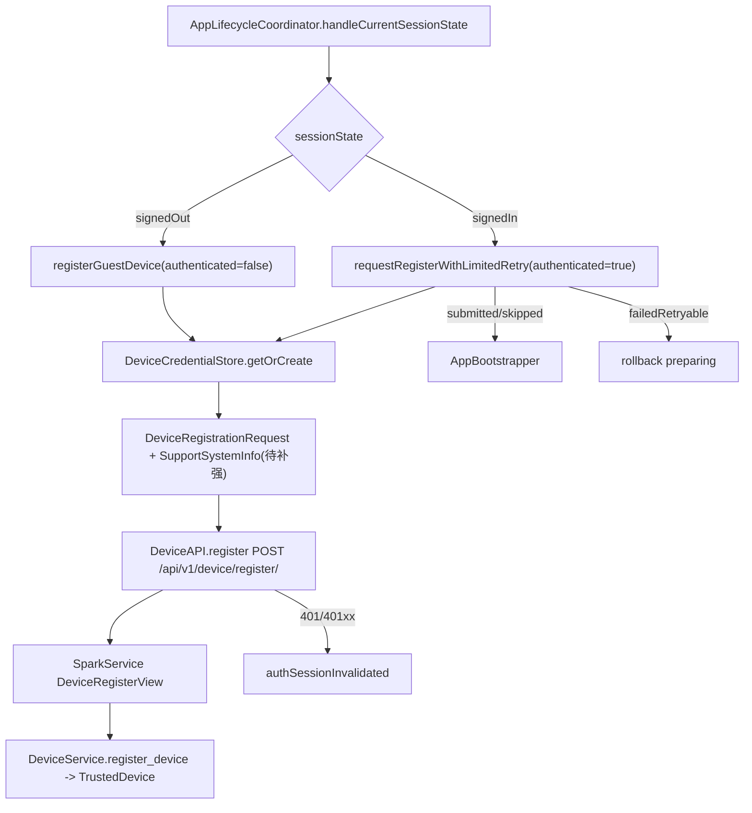

# SupportClientHuawei｜设备登记详细技术方案

## 1. 对标范围与结论

- **后端与后台管理证据：** `SparkService/SparkService/urls.py` 将 `api/v1/` include 到 `accounts.urls`；`SparkService/accounts/urls.py` 暴露 `POST /api/v1/device/register/`；`accounts/device/serializers.py` 定义 `DeviceRegisterSerializer`；`accounts/device/views.py` 的 `DeviceRegisterView` 处理匿名/已认证登记；`accounts/services/device_service.py` upsert `TrustedDevice`；`accounts/services/device_session_service.py` 校验已认证登记与当前设备会话匹配；`accounts/tests_device_service.py` 覆盖 push token、匿名升级、revoked 行复用、用户隔离；后台 `backoffice/views.py`、`backoffice/serializers.py`、`backoffice-web/src/api/modules/users.ts`、`backoffice-web/src/views/DevicesView.vue` 复用 `TrustedDevice` 做设备列表与吊销。
- **参考端与证据：** iOS `SupportClient/SupportClient/Projects/App/Sources/App/DeviceRegistrationCoordinator.swift`、`DeviceRegistrationRequestOutcome.swift`、`Architecture/AppLifecycleCoordinator.swift`、`Core/Networking/SupportAPIs.swift`、`Foundation/Utilities.swift`、`Projects/Foundation/Security/SparkKeychain.swift`；总领文档 `SupportClient/总领文档/应用启动链路/设备登记需求.md`。
- **HarmonyOS 目标端与现状：** `SupportClientHuawei` 已落地 `DeviceRegistrationCoordinator`、`DeviceAPI`、`SupportSystemInfo`、`DeviceCredentialStore`（HUKS AES-GCM + 安全随机，HUKS 不可用时安全 XOR 回退）、`DeviceRegistrationSubmittedSnapshot` / `DeviceCache` 跨启动摘要、生命周期游客/已登录/前台登记与 3 次退避。Push token 仍为空（未接 Push）。
- **目标用户能力：** 冷启动未登录时匿名登记设备；恢复或登录成功后带 Token 登记当前账号设备；设备登记成功或同启动/摘要去重后才允许账号级 bootstrap；明确 401/401xx 时回到未登录态；后台设备管理能看到同一 `TrustedDevice` 画像并可吊销。
- **结论：** 华为端设备登记 **P3–P6 已落地**（部分对齐：P7 真机/后台联调未做；Push 未接；后台「系统版本」文案属 backoffice 仓库）。

**当前实现状态（2026-07-18）：** P0–P6 完成；单测见 `entry/src/test/ets/Startup/DeviceRegistration.test.ets`；`CompileArkTS` 通过。

设备登记不是游客设备账号登录。游客登录使用 `POST /api/v1/auth/device/login/` 与 `SignInWithDeviceUseCase`，设备登记使用 `POST /api/v1/device/register/` 与 `DeviceRegistrationCoordinator`；前者签发会话，后者上报设备画像。

## 2. 华为端目录设计

| 参考端目录/文件 | 参考端职责 | HarmonyOS 现有目录/文件 | HarmonyOS 目标目录/文件 | 状态 | 说明 |
| --- | --- | --- | --- | --- | --- |
| `App/DeviceRegistrationCoordinator.swift` | 设备登记协调、去重、重试、鉴权中止 | `entry/src/main/ets/App/DeviceRegistrationCoordinator.ets` | 保持并注入 SystemInfo/DeviceCache | 已实现 | 真实系统画像 + 跨启动摘要 skip |
| `App/DeviceRegistrationRequestOutcome.swift` | outcome 与 retry policy | `entry/src/main/ets/App/DeviceRegistrationRequestOutcome.ets` | 保持 | 已实现 | `submitted/skippedSameLaunchSubmission/failedRetryable/authSessionInvalidated` 与 0/300/600ms |
| `Core/Networking/SupportAPIs.swift` | `SupportDeviceAPI.register` | `entry/src/main/ets/Projects/Core/Networking/API/Device/DeviceAPI.ets` | 保持 | 已实现 | 响应兼容 `created`/`registered`、`device_id`/`bundle_id` |
| `Architecture/AppLifecycleCoordinator.swift` | 未登录/已登录调用时机 | `entry/src/main/ets/App/AppLifecycleCoordinator.ets` | 保持 | 已实现 | 含 signedInForeground 前台登记 |
| `AssemblyProducts.swift` / `AppContainer.swift` | DI 创建登记协调器 | `entry/src/main/ets/App/AppContainer.ets` | 保持 | 已实现 | 注入 `SupportSystemInfo` + `backend.deviceCache` |
| `SupportSystemInfo` | App/系统/设备/地区采集 | `Foundation/SupportSystemInfo.ets` | `entry/src/main/ets/Foundation/SupportSystemInfo.ets` | 已实现 | bundle/display/i18n/deviceInfo；可注入 FixedSystemInfo |
| `SparkKeychain` | 安装级 device id 和 secret | `Foundation/Security/DeviceCredentialStore.ets` | HUKS AES-GCM + SecureRandom | 已实现 | HUKS 失败时 SecureRandom XOR 回退；旧 XOR 文件可迁移 |
| `DeviceCache.lastDeviceRegistrationSnapshot` | 跨启动登记摘要 | `DeviceCache.ets` + `DeviceRegistrationSubmittedSnapshot.ets` | 同左 | 已实现 | Preferences 作用域 JSON |
| iOS 测试 | 设备登记 outcome/重试/失效 | `DeviceRegistration.test.ets` | Coordinator fake API 分支 | 已实现 | 成功/去重/重试/401/created 解码/跨启动 skip |

文档目录沿用参考端业务目录：`开发详细技术文档/应用启动链路/设备登记详细技术方案.md`。

## 3. 分层职责与请求链路

设备登记只属于启动链路和网络 API，不属于登录页面。页面不得直接调用 `DeviceAPI.register`。

| 阶段 | 触发 | 输入 | 参与模块 | 成功 | 临时失败/恢复 | 永久失败/清理 | 用户可见状态 |
| --- | --- | --- | --- | --- | --- | --- | --- |
| 冷启动网络门控 | `NetworkPathMonitor` satisfied | 网络状态 | `AppLifecycleCoordinator` | 继续恢复会话 | `unknown/offline` 等待 | 无 | 启动页/网络门禁 |
| 未登录登记 | `sessionState=signedOut` | 安装级 `deviceId`、bundle、平台画像 | `DeviceRegistrationCoordinator.registerGuestDevice`、`DeviceAPI` | 后端 upsert 匿名 `TrustedDevice` | 网络/5xx 只记日志，不阻塞登录 | 无 | 登录页继续显示 |
| 已登录登记 | 会话恢复或登录成功 | `UserSession.accountId`、Token、设备画像 | `requestRegisterWithLimitedRetry` | `submitted` 或同启动跳过，进入 AI bootstrap | `failedRetryable` 最多 3 次 | 重试耗尽回滚 prepared | 启动页停留，不进主框架 |
| 鉴权失效 | 401 / 401xx / token_not_valid | 网络错误 | `DeviceRegistrationCoordinator`、`SessionInvalidation`、`AppLifecycleCoordinator` | 中止并回未登录 | 重复失效事件去重 | 清会话、reset 登记/准备/bootstrap | 登录页 |
| 后台设备管理 | 管理端查询/吊销 | `TrustedDevice` 行 | `AdminDeviceListView`、`AdminDeviceRevokeView` | 后台可见设备与状态 | 无 | 吊销后影响后续设备会话校验 | 客户端下一次鉴权/登记可能失效 |



依赖方向：

- `AppLifecycleCoordinator` 依赖 `DeviceRegistrationCoordinator`，不依赖具体 HTTP Transport。
- `DeviceRegistrationCoordinator` 依赖 `DeviceAPI` 和 `DeviceCredentialStore`，后续应依赖 `SupportSystemInfo`。
- `DeviceAPI` 依赖 `SupportBackendConfiguration`，只声明 path、strategy、DTO 和解码。
- `DeviceCredentialStore` 只管理安装级凭证，不知道会话状态。

## 4. 核心关键技术与实现方案

### 4.1 后端契约与后台管理同源

目标和职责边界：设备登记的唯一后端契约来自 `SparkService/accounts/device/*` 与 `TrustedDevice`，客户端不得新增 HarmonyOS 私有 path 或字段名。

iOS 当前事实：`SupportDeviceAPI.register` 调用 `/api/v1/device/register/`，通过 `authenticated` 控制 `requiresAuth`；iOS 请求模型使用 camelCase，但编码器 `convertToSnakeCase` 使服务端收到 snake_case。

HarmonyOS 当前实现：`DeviceAPI.ets` 直接使用 snake_case DTO，`new NetworkStrategy(authenticated, false, authenticated ? 'device.register.auth' : 'device.register.guest', false, 'normal', RetryConfig.disabled())`，由协调器自行做 3 次重试。

服务端事实：

- `accounts/urls.py`：`path("device/register/", DeviceRegisterView.as_view(), name="device_register")`。
- `DeviceRegisterView`：无 Authorization 允许匿名登记；有 Authorization 必须通过 `SparkJWTAuthentication`，失败抛 `APIError("token_not_valid", code=40102, status_code=401)`。
- 已认证登记会调用 `DeviceSessionService.validate_authenticated_device_register`，校验 active session 的 `bundle_id/device_id` 与请求匹配。
- `DeviceService.register_device` 返回 `{ id, device_id, bundle_id, created }`；服务端 `success_response` 包裹为 `{ code, msg, data }`。
- 后台 `/api/admin/v1/users/devices/` 列表和 `/api/admin/v1/users/devices/{id}/revoke/` 复用 `TrustedDevice`，不是另一套设备模型。

官方资料：

- HarmonyOS `发送网络请求（ArkTS）`：https://developer.huawei.com/consumer/cn/doc/harmonyos-guides/http-request 。用于 HTTP request、销毁与 `ohos.permission.INTERNET`。
- HarmonyOS 网络连接管理 `connection`：https://developer.huawei.com/consumer/en/doc/atomic-guides-V5/atomic-net-connection-manager-V5 。用于网络状态前置门控。

本地示例：

- `/Users/hua/Documents/project/Reference/ClientSub-project/SparkAndroid/Package/Huawei/agc-template-market-harmonyos-demos-main/HouseAndHomeTemplate/HomeDecoration/commons/network/src/main/ets/apis/HttpRequest.ets`：可借鉴独立网络模块和 API 封装边界；禁止复制 mock 数据和演示 endpoint。
- `/Users/hua/Documents/project/Reference/ClientSub-project/SparkAndroid/Package/Huawei/agc-template-market-harmonyos-demos-main/ShoppingTemplate/ComprehensiveMall/commons/lib_network/src/main/ets/https/Request.ets`：可借鉴请求层统一包装；禁止复制 `httpsmock` 与业务静态数据。

ArkTS 骨架（伪代码；当前目标工程已有可编译实现，以下仅表达职责）：

```ts
// 伪代码：字段和 API 已在 DeviceAPI.ets 落地，后续重点是补 SystemInfo
const strategy = new NetworkStrategy(
  authenticated,
  false,
  authenticated ? 'device.register.auth' : 'device.register.guest',
  false,
  'normal',
  RetryConfig.disabled()
);
const op = new CacheableSupportNetworkOperation(
  'Device.Register',
  'DeviceAPI',
  new NetworkRequest('POST', '/api/v1/device/register/', strategy, [], {}, request)
);
```

验收规则：无 Token 时不得加 Authorization；有 Token 时服务端 401 不得降级匿名登记；响应需兼容 `created`，并保留 `requestId` 诊断。

### 4.2 生命周期调度、去重与有限重试

目标和职责边界：设备登记由生命周期统一调度，失败不能由页面直接吞掉；已登录登记是账号级 bootstrap 的前置门。

iOS 当前事实：`registerGuestDevice` 不阻塞登录页；`requestRegisterWithLimitedRetry` 最多 3 次，退避 0/300/600ms；`lastRegisteredKey = authenticated-userID-installationDeviceID`；`authSessionInvalidated` 阻断账号 bootstrap。

HarmonyOS 当前实现：

- `AppLifecycleCoordinator.handleCurrentSessionState` 在 `signedOut` 时异步 `registerGuestDevice('guestColdLaunch')`。
- `runSignedInPreparation` 先 `accountRuntime.activateUser`，再 `requestRegisterWithLimitedRetry`；非 `submitted/skippedSameLaunchSubmission` 回滚 preparing。
- `DeviceRegistrationCoordinator` 使用 `lastRegisteredKey = authenticated-userId-deviceId`，`signedInForeground` 可绕过冷启动去重。
- `DeviceRegistrationRetryPolicy` 已覆盖 3 次与 0/300/600ms，测试位于 `StartupLifecycle.test.ets`。

官方资料：

- UIAbility 生命周期：https://developer.huawei.com/consumer/cn/doc/HarmonyOS-Guides/uiability-lifecycle 。用于前后台补偿登记和资源释放时机。
- ArkTS 异步并发基础以当前 SDK/ArkTS 编译门为准；文档代码不得替代编译验证。

本地示例：

- `.../MovieTVAndLivestreamingTemplate/LiveStreaming/commons/utils/src/main/ets/utils/NetConnectionUtil.ts`：可借鉴监听列表与网络变化触发；禁止复制默认 Wi-Fi 初始值和未注销监听。

ArkTS 骨架（伪代码；当前目标工程已有类似实现）：

```ts
async requestRegisterWithLimitedRetry(session: UserSession): Promise<DeviceRegistrationOutcome> {
  for (let i = 0; i < DeviceRegistrationRetryPolicy.maxAttempts; i++) {
    const waitMs = DeviceRegistrationRetryPolicy.backoffBeforeAttempt(i);
    if (waitMs > 0) {
      await delay(waitMs);
    }
    const outcome = await this.requestRegister(session.accountId, true, 'signedInColdLaunch');
    if (outcome !== 'failedRetryable') {
      return outcome;
    }
  }
  return 'failedRetryable';
}
```

验收规则：同一账号并发准备只执行一次；`failedRetryable` 不进入主 Tab；`authSessionInvalidated` 必须触发统一回登录态；前台登记不得重复冷启动 restore。

### 4.3 设备信息采集与平台字段

目标和职责边界：`DeviceRegistrationCoordinator` 不应硬编码平台画像；应由 `SupportSystemInfo.ets` 采集并返回稳定结构，方便测试和平台适配。

iOS 当前事实：`SupportSystemInfo` 提供 `installationDeviceID`、bundle、appVersion、buildVersion、platform、systemVersion、deviceModel、deviceName、screenSize、screenScale、timezone、languageCode、regionCode、countryCode、isSimulator`。

HarmonyOS 当前实现缺口：`DeviceRegistrationCoordinator.ets` 目前写死：

- `app_version='1.0.0'`
- `build_version='1'`
- `platform='harmonyos'`
- `system_version=''`
- `device_model='harmonyos'`
- `device_model_name='phone'`
- `screen_size=''`
- `time_zone=''`
- `language_code=''`
- `region_code=''`
- `country_code=''`

目标实现：

- 新增 `Foundation/SupportSystemInfo.ets`。
- 从 `bundleManager` 或 Ability context 读取 bundle/name/version（具体 API 以 SDK 24/DevEco 6.1.1 编译验证）。
- 从 display/window 或媒体查询能力读取屏幕尺寸与密度。
- 从 i18n/intl 或系统 locale 能力读取语言、地区、时区。
- 保留 `platform='harmonyos'`；若后端只允许 `ios/android`，需后端确认枚举扩展，不在客户端伪装为 `ios`。

官方资料：

- HarmonyOS 文档中心：https://developer.huawei.com/consumer/cn/doc/ 。需按 API 24 复核 bundle、display、i18n、system parameter API。
- ArkTS 起步与静态类型：https://developer.huawei.com/consumer/en/doc/harmonyos-guides/arkts-get-started 。用于提醒严格类型和编译门。

本地示例：

- `SupportClientHuawei/Foundation/L10n/L10n.ets` 已有资源/上下文绑定，可为 locale 能力封装提供入口，但不能直接承担设备信息职责。

ArkTS 骨架（伪代码，未编译验证）：

```ts
export class SupportSystemInfoSnapshot {
  appVersion: string = '';
  buildVersion: string = '';
  bundleId: string = '';
  platform: string = 'harmonyos';
  systemVersion: string = '';
  deviceModel: string = '';
  deviceModelName: string = '';
  deviceName: string = '';
  screenSize: string = '';
  screenScale?: number;
  timeZone: string = '';
  languageCode: string = '';
  regionCode: string = '';
  countryCode: string = '';
  isSimulator: boolean = false;
}
```

验收规则：字段为空不会破坏登记，但后台设备列表会失去诊断价值；首个版本至少补 bundle/app version/system version/language/country/screen scale。

### 4.4 安装级设备凭证与安全存储

目标和职责边界：`deviceId` 是安装级标识；`deviceSecret` 属于游客设备登录凭证。设备登记只发送 `device_id`，游客登录才发送 `device_secret`。两者都不能保存在普通 Preferences 或日志。

iOS 当前事实：`SparkKeychain.getOrCreateDeviceID()` 持久化安装级 ID；`getOrCreateDeviceSecret()` 使用安全随机数，保存失败会拒绝返回内存 secret。

HarmonyOS 当前实现：

- `DeviceCredentialStore.ets` 使用应用私有目录 `secure-device/device.enc` 保存 `deviceId/deviceSecret/bundleId`。
- 另有 `.aes.key` 沙箱文件，使用 XOR 混淆，注释已说明后续替换为 HUKS。
- `getOrCreate` 生成 `hm_${randomHex(16)}` 和 `randomHex(32)`，但使用 `Math.random()`，不满足高熵凭证要求。

官方资料：

- Universal Keystore Kit 概述：https://developer.huawei.com/consumer/cn/doc/harmonyos-guides/huks-overview 。
- Universal Keystore Kit ArkTS API：https://developer.huawei.com/consumer/cn/doc/harmonyos-references/universal-keystore-arkts 。
- 应用文件访问 / Core File Kit 需按 API 24 复核，目标工程当前已使用 `@kit.CoreFileKit`。

本地示例：

- 技能知识库记录 LiveStreaming/PreferenceUtil 只能用于普通元数据；禁止把 token、STS、deviceSecret 放 Preferences。
- `SupportClientHuawei/Foundation/Security/SecureTokenStore.ets` 与 `DeviceCredentialStore.ets` 可复用封装边界，但二者都应升级 HUKS，不应把 XOR 视为生产加密。

ArkTS 骨架（伪代码，未编译验证）：

```ts
// 伪代码：HUKS 参数、随机数 API 和错误码必须以 SDK 24 编译验证
class DeviceCredentialStore {
  async getOrCreate(): Promise<DeviceCredential> {
    const loaded = await this.loadEncryptedByHuks();
    if (loaded) {
      return loaded;
    }
    const credential = new DeviceCredential(
      SecureRandom.hex(16),
      SecureRandom.hex(32),
      AUTH_BUNDLE_ID
    );
    await this.saveEncryptedByHuks(credential);
    return credential;
  }
}
```

验收规则：保存失败必须阻断游客登录；设备登记可以失败重试，但不得生成每次启动变化的 `deviceId`；日志只允许 hash/尾号，不输出 `deviceSecret`。

### 4.5 缓存、日志与测试

目标和职责边界：设备登记需要可诊断、可测试、可恢复，但不得泄露敏感字段。

当前 HarmonyOS 状态：

- 日志使用 `Logger` + `LogSanitizer`，可脱敏 token/secret 字段。
- `DeviceCache.ets` 有 account scope 和 Preferences，适合普通设备元数据，但没有结构化 `lastDeviceRegistrationSnapshot`。
- 测试覆盖 DTO 默认值、outcome gate、retry policy、preparation registry 与 bootstrap 分支；未覆盖 `DeviceRegistrationCoordinator` 的 fake API 成功/失败/401/同启动去重。

目标实现：

- 增加 `DeviceRegistrationSubmittedSnapshot`：`accountId?`、`isAuthenticated`、`bundleId`、`deviceId`、`countryCode`、`regionCode`、`notificationsEnabled?`、`pushTokenHash?`、`authorizationStatusRaw?`。
- `DeviceCache` 只存普通摘要，不存 push token 原文、token、secret。
- 增加 fake `DeviceAPI` 测试：匿名成功、已登录成功、同启动跳过、`SupportNetworkError.http(401)` 返回 `authSessionInvalidated`、普通错误重试 3 次。

官方资料：

- Preferences / ArkData：https://developer.huawei.com/consumer/en/doc/harmonyos-guides/start-with-ets-stage 搜索入口中包含 Preferences ArkTS 资料；使用时需按 API 24 复核 `getPreferences/put/flush`。
- hilog 与 hdc 资料已在日志系统文档中记录；设备登记沿用项目 Logger。

本地示例：

- `ShoppingTemplate/Express/commons/lib_foundation/src/main/ets/utils/PreferenceUtil.ets` 可借鉴 Preferences flush 形态；禁止复制打印 value 的行为。

验收规则：设备登记日志包含 operation、reason、authenticated、outcome、requestId；不包含 Authorization、deviceSecret、pushToken 原文；后台可通过 request_id 串联服务端日志。

## 5. 接口契约与数据模型

### 5.1 通用数据与状态

| 模型/属性 | 外部字段名（JSON/DB/Preferences/文件） | ArkTS 类型 | 必填 | 敏感 | 来源与验证 | 生命周期/持久化 | 兼容规则 |
| --- | --- | --- | --- | --- | --- | --- | --- |
| 安装级设备 ID | `device_id` / `deviceId` | `string` | 是 | 中 | `DeviceCredentialStore.getOrCreate`、服务端 serializer 必填 | 安装级，沙箱安全文件；卸载后消失 | 登记请求使用 snake_case；响应兼容 snake/camel |
| 游客设备密钥 | `deviceSecret` 文件字段；游客登录为 `device_secret` | `string` | 游客登录必填 | 高 | `DeviceCredentialStore`、设备登录需求 | 安装级安全存储 | 设备登记不得发送 |
| 同启动去重 key | 无外部字段 | `string` | 否 | 低 | `DeviceRegistrationCoordinator.lastRegisteredKey` | 进程内 | `authenticated-userId-deviceId` |
| 登记 outcome | 无外部字段 | union string | 是 | 低 | `DeviceRegistrationRequestOutcome.ets` | 单次请求 | `submitted/skippedSameLaunchSubmission` 放行 bootstrap |
| 后端设备行 | `TrustedDevice` | DB row | 是 | 中/含 push token 高 | `accounts/models.py` | 服务端持久化 | 匿名 `(bundle_id,device_id,user=NULL)`；已登录 `(bundle_id,device_id,user)` |
| 后台吊销状态 | `is_revoked` | `boolean` | 是 | 低 | `AdminDeviceRevokeView` | 服务端持久化 | 后续设备会话校验读取 |

### 5.2 `POST /api/v1/device/register/`

服务端证据：`SparkService/accounts/urls.py`、`accounts/device/serializers.py`、`accounts/device/views.py`、`accounts/services/device_service.py`、`accounts/services/device_session_service.py`、`common/response.py`、`common/exception_handlers.py`。

| 字段 | JSON 名 | ArkTS 类型 | 服务端类型/规则 | 必填 | 敏感 | HarmonyOS 当前来源 | 当前状态 |
| --- | --- | --- | --- | --- | --- | --- | --- |
| device id | `device_id` | `string` | `CharField(max_length=255)` | 是 | 中 | `DeviceCredentialStore.deviceId` | 已实现 |
| user id | `user_id` | `number?` | `IntegerField(required=False, allow_null=True)` | 否 | 中 | `UserSession.accountId` | 已实现但命名语义需确认 user/account |
| push token | `push_token` | `string` | max 512，空串允许 | 否 | 高 | 当前空串 | 待推送模块 |
| 通知开关 | `notifications_enabled` | `boolean` | default false | 否 | 低 | 当前 false | 待推送权限 |
| App 版本 | `app_version` | `string` | max 50 | 否 | 低 | 当前 `1.0.0` | 待真实采集 |
| 构建号 | `build_version` | `string` | max 50 | 否 | 低 | 当前 `1` | 待真实采集 |
| 包标识 | `bundle_identifier` | `string` | max 255 | 否 | 低 | `cred.bundleId` | 已实现但来源固定常量 |
| bundle id | `bundle_id` | `string` | max 255；缺失时报 40002 | 逻辑必填 | 低 | `cred.bundleId` | 已实现 |
| 平台 | `platform` | `string` | max 20 | 否 | 低 | `harmonyos` | 已实现，需后端枚举确认 |
| 系统版本 | `system_version` | `string` | max 50 | 否 | 低 | 空串 | 待实现 |
| 设备型号 | `device_model` | `string` | max 100 | 否 | 低 | `harmonyos` | 待实现 |
| 友好型号 | `device_model_name` | `string` | max 100 | 否 | 低 | `phone` | 待实现 |
| 设备名 | `device_name` | `string` | max 255 | 否 | 中 | 空串 | 待实现；注意隐私 |
| 屏幕尺寸 | `screen_size` | `string` | max 50 | 否 | 低 | 空串 | 待实现 |
| 屏幕 scale | `screen_scale` | `number?` | `FloatField(allow_null)` | 否 | 低 | 未填 | 待实现 |
| 时区 | `time_zone` | `string` | max 50 | 否 | 低 | 空串 | 待实现 |
| 语言 | `language_code` | `string` | max 10 | 否 | 低 | 空串 | 待实现 |
| 地区 | `region_code` | `string` | max 10 | 否 | 低 | 空串 | 待实现 |
| 国家 | `country_code` | `string` | max 10 | 否 | 低 | 空串 | 待实现 |
| 模拟器 | `is_simulator` | `boolean` | default false | 否 | 低 | false | 部分实现 |

响应与错误：

| 操作/模型 | 输入/输出 | 后端契约/方法与路径或系统 API | 鉴权/权限 | HTTP/业务错误与 Request ID | 缓存/并发策略 | 消费位置 | 证据 |
| --- | --- | --- | --- | --- | --- | --- | --- |
| 设备登记 | `DeviceRegistrationRequest` -> `{id, device_id, bundle_id, created}` 包裹响应 | `POST /api/v1/device/register/` | 无 Authorization 为匿名；有 Authorization 必须 JWT + active device session | 成功 `{code:0,msg:"device_registered",data}`；缺 `device_id` 40001；缺 bundle 40002；token 失效 40102；设备会话异常 40104/40105/40106 | API retry disabled；Coordinator 对已登录做 3 次退避；同启动 key 去重 | `DeviceRegistrationCoordinator`、`AppLifecycleCoordinator` | 服务端 `DeviceRegisterView` / `DeviceService` / `DeviceSessionService` |
| 后台设备列表 | `page/page_size/q/user_id/is_revoked` -> `items/pagination` | `GET /api/admin/v1/users/devices/` | AdminOnly | 包裹响应；后台 RBAC | 服务端分页 | `DevicesView.vue` | `AdminDeviceListView`、`fetchDevices` |
| 后台吊销 | `{is_revoked}` -> `AdminDeviceSerializer` | `POST /api/admin/v1/users/devices/{id}/revoke/` | `button:user:device:revoke` | 包裹响应；写审计 | 无客户端缓存 | `DevicesView.vue` | `AdminDeviceRevokeView` |

兼容注意：

- HarmonyOS `DeviceRegistrationResponse` 当前字段是 `deviceId/userId/registered`；服务端实际返回 `device_id/bundle_id/created`。应新增 `created?: boolean` 或将 `registered` 兼容 `created`。
- 服务端只对显式携带字段应用 patch；字段为空且显式携带可能清空 push token，字段缺省则保留旧值。客户端后续接入推送时必须区分“未接入/未改变”和“主动清空”。
- 已登录登记的 `user_id` 只用于画像；服务端真实身份来自 JWT，不允许客户端伪造 user。

## 6. iOS-HarmonyOS 功能对照矩阵

全局矩阵已维护在 `开发详细技术文档/iOS-HarmonyOS功能对照矩阵.md`。本功能相关行摘录：

| 参考端能力/证据 | 可观察行为 | HarmonyOS 实现/证据 | 官方能力 | 本地示例 | 对齐状态 | 差异与处理 |
| --- | --- | --- | --- | --- | --- | --- |
| iOS `DeviceRegistrationCoordinator.swift` + `SupportAPIs.swift`；后端 `DeviceRegisterView` + `DeviceService` | 未登录匿名登记；已登录带 Token 登记；3 次退避；401 中止；后台可查设备 | `DeviceRegistrationCoordinator.ets`、`DeviceAPI.ets`、`SupportSystemInfo.ets`、`DeviceCredentialStore.ets`、`DeviceRegistrationSubmittedSnapshot.ets`、`AppLifecycleCoordinator.ets`、`DeviceRegistration.test.ets` | HTTP、Network Kit、HUKS、Core File Kit、Preferences，API 24 | HomeDecoration network、LiveStreaming NetConnectionUtil | 部分对齐 | P0–P6 已落地；P7 联调/Push/后台文案未做 |

## 7. 示例工程与官方文档参考结论

| 类型 | 标题/代码位置 | URL/绝对路径 | 可借鉴内容 | 禁止直接复制/版本注意事项 |
| --- | --- | --- | --- | --- |
| 官方 | 发送网络请求（ArkTS） | https://developer.huawei.com/consumer/cn/doc/harmonyos-guides/http-request | HTTP request 生命周期、网络权限、销毁 | 具体 API 签名以 API 24 SDK 编译为准 |
| 官方 | Network Connection Management | https://developer.huawei.com/consumer/en/doc/atomic-guides-V5/atomic-net-connection-manager-V5 | `createNetConnection`、默认网络、网络可用事件 | 网络权限与首次评估状态必须结合项目实现 |
| 官方 | Universal Keystore Kit 概述 | https://developer.huawei.com/consumer/cn/doc/harmonyos-guides/huks-overview | HUKS 作为凭证保护边界 | HUKS 保护密钥，不代表可明文保存 secret |
| 官方 | Universal Keystore Kit ArkTS API | https://developer.huawei.com/consumer/cn/doc/harmonyos-references/universal-keystore-arkts | 后续替换 `DeviceCredentialStore` 的密钥生成/加解密 | 参数与错误码需按 API 24 POC |
| 本地示例 | HomeDecoration network | `/Users/hua/Documents/project/Reference/ClientSub-project/SparkAndroid/Package/Huawei/agc-template-market-harmonyos-demos-main/HouseAndHomeTemplate/HomeDecoration/commons/network/src/main/ets/apis/HttpRequest.ets` | 独立网络模块和 API 请求封装 | Mock 与业务演示数据不可复制 |
| 本地示例 | ComprehensiveMall lib_network | `/Users/hua/Documents/project/Reference/ClientSub-project/SparkAndroid/Package/Huawei/agc-template-market-harmonyos-demos-main/ShoppingTemplate/ComprehensiveMall/commons/lib_network/src/main/ets/https/Request.ets` | 请求层统一封装和类型目录 | `httpsmock`、硬编码商品业务不可复制 |
| 本地示例 | LiveStreaming NetConnectionUtil | `/Users/hua/Documents/project/Reference/ClientSub-project/SparkAndroid/Package/Huawei/agc-template-market-harmonyos-demos-main/MovieTVAndLivestreamingTemplate/LiveStreaming/commons/utils/src/main/ets/utils/NetConnectionUtil.ts` | 网络监听与 listener 集合 | 默认网络状态、未注销监听、过量日志不可复制 |

## 8. 实施拆分与验收

| 阶段 | 目标文件/模块 | 依赖 | 实施结果 | 自动化测试 | 人工验收 |
| --- | --- | --- | --- | --- | --- |
| P0 后端契约确认 | `SparkService/accounts/device/*`、`accounts/services/device_service.py` | 后端工程 | 已确认 | `accounts/tests_device_service.py` | 服务端返回字段、错误码、后台列表与吊销可解释 |
| P1 API DTO 与路径 | `DeviceAPI.ets` | 网络模块 | 已完成 | `DeviceRegistration.test.ets` 默认值 + `created` 解码 | 抓包确认 `POST /api/v1/device/register/` |
| P2 生命周期接入 | `AppLifecycleCoordinator.ets`、`AppContainer.ets` | 启动链路 | 已完成 | `StartupLifecycle.test.ets` | 未登录不阻塞登录页；已登录失败不进主 Tab |
| P3 协调器分支测试 | `DeviceRegistrationCoordinator.ets` | fake `DeviceAPI`、fake credentials | 已完成 | 成功/失败/401/去重/created | 本地测试证明重试 3 次和 auth 中止 |
| P4 系统信息采集 | `Foundation/SupportSystemInfo.ets` | bundle/display/i18n/system API | 已完成 | FixedSystemInfo + Coordinator 字段断言 | 后台可见版本、系统、机型、地区 |
| P5 安全存储强化 | `DeviceCredentialStore.ets` + `HuksAesGcmCipher` + `SecureRandom` | HUKS | 已完成 | AuthDomain 凭证稳定性；HUKS 回退路径 | 卸载前不变，保存失败阻断游客登录 |
| P6 跨启动摘要 | `DeviceCache.ets`、`DeviceRegistrationSubmittedSnapshot.ets` | Preferences | 已完成 | snapshot 编解码与跨启动 skip | 摘要未变可跳过重复登记 |
| P7 联调验收 | 后端 + iOS + HarmonyOS + backoffice | 测试账号、设备 | 未做 | — | 匿名行升级、用户隔离、后台吊销后客户端回登录态 |

验收清单：

- [ ] 无 Authorization 的冷启动登记不会携带 Token。
- [ ] 有 Authorization 的已登录登记必须匹配当前 active device session。
- [ ] 40102、40104、40105、40106 都被归类为 `authSessionInvalidated` 或统一会话失效。
- [ ] `failedRetryable` 重试耗尽后不进入 AI/OSS bootstrap。
- [ ] 同启动重复 `authenticated-userId-deviceId` 返回 `skippedSameLaunchSubmission`。
- [ ] 设备信息字段不再是占位值。
- [ ] `deviceSecret`、Authorization、push token 原文不进入日志、Preferences、后台普通列表。
- [ ] 后台 `/users/devices` 能看到 HarmonyOS platform、版本、机型、last_seen，并可吊销。

## 9. 风险与待确认项

| 编号 | 风险/待确认项 | 影响模块 | 证据 | 依赖方 | 关闭条件 |
| --- | --- | --- | --- | --- | --- |
| DR-01 | HarmonyOS 系统画像占位 | 后台设备诊断 | `SupportSystemInfo.ets` 已接入 | HarmonyOS | 已关闭 |
| DR-02 | `DeviceCredentialStore` Math.random 与 XOR | 游客设备登录安全 | HUKS + SecureRandom；HUKS 失败回退 SecureRandom XOR | HarmonyOS 安全 | 已关闭（回退仅作兼容） |
| DR-03 | 服务端 `created` 与客户端 `registered` | 响应解码 | `DeviceAPI.decodeResponse` 兼容 | HarmonyOS | 已关闭 |
| DR-04 | `user_id` 使用 accountId 语义 | 服务端画像 | HarmonyOS `UserSession.accountId` | 后端/客户端 | 保持现状；JWT 为准 |
| DR-05 | 后台列名「iOS 版本」 | 后台显示 | `DevicesView.vue` | 后台管理 | 未做（非本仓库） |
| DR-06 | 跨启动登记摘要 | 增量登记 | `DeviceRegistrationSubmittedSnapshot` + DeviceCache | HarmonyOS | 已关闭 |
| DR-07 | 真机联调 | 证据链 | CompileArkTS 已通过 | HarmonyOS QA | P7 未做 |

