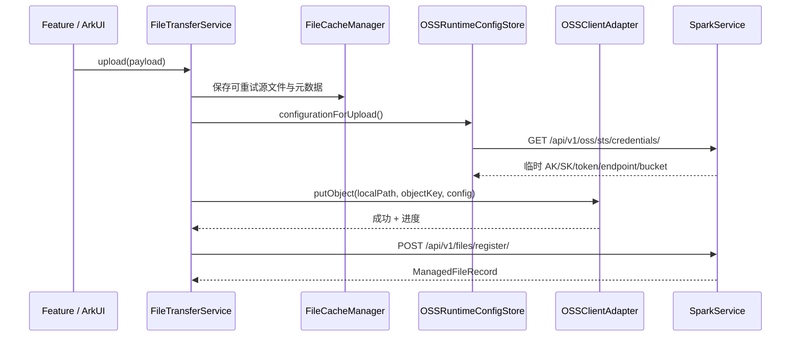

# 文件与 OSS 详细技术方案

## 1. 对标范围与结论

本方案以 iOS [文件与 OSS](../../../SparkClient/总领文档/网络、文件、OSS%20与同步基础设施/文件与OSS需求.md) 与 `SparkService/file_manager/` 为事实基线，规划 HarmonyOS 的上传、OSS STS、远端登记、下载缓存、业务绑定与删除能力。

截至 2026-07-24，HarmonyOS 已完成 FileStorage / OSS 公共服务，并完成对标 iOS 的公共服务层加固（流式下载、generation 全覆盖、`pending_delete`、冷启动登记恢复、门面 API、诚实阶段进度），通过目标工程 API 24 的 `CompileArkTS` 与 `assembleHap`。`@aliyun/oss` 本地 Vendor 仍通过 `file:` 依赖引入；Feature 接入（P5）已覆盖聊天附件、药箱附件、以及 AI 上传报告的 UPLOAD 步骤（`UploadMedicalDocumentFilesUseCase`），其余医疗业务绑定与 OCR 后续步骤待续。

| 项目 | iOS/后端现状 | HarmonyOS 目标 | 结论 |
| --- | --- | --- | --- |
| SDK 引入 | iOS 有 Objective-C bridge 目录；其中 `AliyunOSSSDK/OSSLog.swift` 不是完整 SDK 源码 | 完整包固化到 `entry/third_party/aliyun-oss/`，用 `file:` 引用 | **已实现**：Vendor + adapter 唯一 import |
| STS | `GET /api/v1/oss/sts/credentials/`，iOS 内存快照、提前续期 | 相同接口，内存快照，到期前 300 秒刷新 | **已实现**：`OSSRuntimeConfigStore` + bootstrap 预热 |
| 上传 | OSS 直传后 `POST /api/v1/files/register/` | “私有缓存 → 直传 → 登记” + URI staging + `uploaded_unregistered` 恢复 | **已实现+加固**：bootstrap/前台异步 `retryRegister` |
| 下载 | iOS 有缓存/MD5，直接解释 `filePath` 有歧义 | 先取 `download-url`，流式写 `.part` 校验后原子提交 | **已实现+加固**：`requestInStream`；不走 `filePath` 直链 |
| 删除/门面 | 远端删除；本地常漏清 | `pending_delete` 补偿；`cachedURL` / `publicHTTPSURLForObjectKey` | **已实现+加固** |
| Feature 接入 | 医疗/聊天/处方等 | 仅经 `FileTransferService` | **部分实现（P5）**：聊天附件、药箱附件、AI 上传报告 UPLOAD 步骤已接入；其余医疗业务绑定待续 |

后端路由已确认：`/api/v1/files/`（列表、登记、绑定、下载 URL、删除）及 `/api/v1/oss/`（STS）。文件二进制不进入业务 JSON 请求。

## 2. 华为端目录设计

```text
SparkClientHarmonyOS/
├── entry/
│   ├── oh-package.json5                         # @aliyun/oss 的本地 file: 依赖
│   ├── third_party/aliyun-oss/
│   │   ├── VENDOR.md                             # Vendor 版本、来源和引入边界
│   │   ├── aliyun-oss/                           # @aliyun/oss 2.0.0-beta.1 完整包
│   │   ├── ohos-xml-js/                          # @ohos/xml_js 1.0.3
│   │   ├── ohos-sax/                             # @ohos/sax 1.0.3
│   │   ├── types-mime/                           # @types/mime 3.0.3
│   │   └── mime/                                 # mime 3.0.0
│   └── src/main/ets/
│       ├── Core/
│       │   ├── FileStorage/
│       │   │   ├── FileStorageModels.ets          # DTO、领域、状态、错误
│       │   │   ├── FileCacheManager.ets           # 私有目录、.part、MD5、LRU、账号清理
│       │   │   ├── FileCacheRepository.ets        # RDB file_cache_record
│       │   │   └── FileTransferService.ets        # 上传/下载/登记/绑定/删除唯一门面
│       │   └── Storage/AppRelationalDatabase.ets  # file_cache_record migration
│       ├── Projects/Core/
│       │   ├── Networking/API/{File/FileAPI.ets, OSS/OSSAPI.ets}
│       │   └── OSS/
│       │       ├── OSSRuntimeConfig.ets           # STS DTO；仅内存
│       │       ├── OSSRuntimeConfigStore.ets      # 提前刷新、single-flight
│       │       └── OSSClientAdapter.ets           # 唯一 import @aliyun/oss 的位置
│       └── App/{AppContainer,AppBootstrapper,AccountSessionRuntime}.ets
└── 开发详细技术文档/文件与 OSS/文件与OSS详细技术方案.md
```

依赖方向固定为 Feature/UI → `FileTransferService` → File API、OSS adapter、Cache → Network Kit/Core File Kit/本地 Vendor SDK。页面、业务 UseCase、`FileAPI` 均不得直接 import `@aliyun/oss`。

### 本地包引入规范

当前 `entry/oh-package.json5` 已采用本地依赖：

```json5
{
  "dependencies": {
    "@aliyun/oss": "file:./third_party/aliyun-oss/aliyun-oss"
  }
}
```

1. 在隔离目录通过官方 OHPM 获取指定版本；保存来源、版本、许可证、完整包清单及 SHA-256。
2. 检查 SDK 包根的 `oh-package.json5`，把**包根内容**完整复制到 `entry/third_party/aliyun-oss/aliyun-oss/`，并将 3 个直接依赖及 `@ohos/sax` 完整落到同一 Vendor 目录；不复制开发机全局 `oh_modules`。
3. 枚举直接和传递依赖；无法由 lock 复现者也 Vendor 到 `third_party/` 并改为明确 `file:` 路径。不得依赖开发者缓存。
4. 用 `file:` 配置后执行依赖检查与 `assembleHap`；断网重装同样必须成功。
5. 升级 SDK 必须新建版本记录，并重新验收 STS、上传、下载、断网构建。

用户指定的 `agc-template-market-harmonyos-demos-main/HouseAndHomeTemplate/HomeDecoration/products/entry/oh-package.json5` 已实际使用 `file:../../commons/...` 本地源码依赖，说明 `file:` 组织方式可用；它不证明第三方 SDK 转依赖已完整固化，不能照抄后省略 POC。

本次已使用 OHPM-compatible CLI 5.0.10 从官方 OHPM registry 下载 `@aliyun/oss@2.0.0-beta.1` 及全部转依赖，并生成 `entry/oh-package-lock.json5`；Vendor 目录约 1.1 MB、193 个文件（含原始 registry lock）。本地依赖已经通过目标工程 API 24 的 `CompileArkTS` 与 `assembleHap` 验证；构建仍有既有异常处理/deprecated warning、本地依赖 module-info 提示和未配置签名提示，但没有编译错误。

### 当前已落盘的使用方式

开发者在项目根或 `entry` 目录重新安装时，使用当前 `entry/oh-package.json5` 的本地依赖即可：

```bash
cd /Users/hua/Documents/project/Reference/LookHealthClient/SparkClientHarmonyOS/entry
ohpm install --no-link
```

解析依据是 `entry/oh-package-lock.json5` 和 `third_party/aliyun-oss/` 下的相对 `file:` 依赖。生成的 `entry/oh_modules/` 是安装产物，已被 `.gitignore` 排除；必须提交的是 `third_party/`、lock/manifest 和许可证，不是 `oh_modules` 软链接。

未来实现 `OSSClientAdapter.ets` 时，唯一 SDK import 形态为（示意代码，未编译）：

```ts
import Client, { RequestError } from '@aliyun/oss';
```

SDK 包入口由 `file:./third_party/aliyun-oss/aliyun-oss` 解析；业务代码不应写 `../../third_party/...` 的相对 import，也不应直接引用 Vendor 内的 `src/main/harmony/*.d.ets`。

## 3. 分层职责与请求链路



下载：Feature → `FileTransferService.download(record, options, token, observer)` → 本地命中且 MD5 正确则返回 → `GET /api/v1/files/{id}/download-url/` → `requestInStream` 边收边写 `payload.part`（有 `Content-Length` 时按写入字节更新 progress）→ 校验大小/MD5 → 原子 rename → 写 RDB → 返回本地 URI。不得以 `filePath` 绕过服务端访问控制。

删除：先 `DELETE /api/v1/files/{id}/`（后端软删除），成功后清缓存/RDB（无 uuid 时 `findByFileId`）；网络失败标 `pending_delete` 并可 `retryPendingDeletes`，不声称远端已删。绑定更新用 `PATCH /api/v1/files/business/update/`，入口带 generation 校验。

## 4. 核心关键技术与实现方案

### 4.1 HarmonyOS 具体实现单元与调用约束

以下是**目标 ArkTS 职责骨架，不是已编译代码**；方法名、SDK 参数类型须以 P0 下载包和本工程 API 24 DevEco SDK 为准。它用于让开发者按真实工程现有模式实现，而不是把 iOS 类名机械翻译。

| 目标文件 | 对外方法/输入 | 内部实现 | 不负责的事情 |
| --- | --- | --- | --- |
| `FileStorageModels.ets` | `ManagedFileRecord`、`FileUploadRequest`、`FileTransferSnapshot`、`FileTransferError` | 显式 `fromJson`/`toRegisterBody`，校验 UUID、文件名、MD5、状态字符串 | 不发 HTTP、不调用 SDK、不读文件 |
| `FileAPI.ets` | `list(query)`、`register(body)`、`updateBinding(input)`、`downloadUrl(fileId)`、`remove(fileId)` | 仿照现有 `AIConfigAPI` 建 `NetworkRequest`，经 `SupportBackendConfiguration.executeDecoded` 解包 `data` | 不解析 OSS SDK 错误、不写缓存 |
| `OSSAPI.ets` | `credentials()` | GET STS、严格将 snake_case 解码成 runtime DTO | 不缓存 secret |
| `OSSRuntimeConfigStore.ets` | `getForUpload()`、`invalidate()` | 内存 `snapshot`、`refreshPromise` 单飞、epoch 秒校验、提前 300 秒刷新 | 不写 RDB/Preferences/HUKS；STS 本身短期，不应持久化 |
| `OSSClientAdapter.ets` | `upload(input, onProgress, cancelToken)` | 构造 Vendor `Client`、把私有本地 path 转 `FilePath`、调用 put、归一化错误 | 不生成 objectKey、不登记后端 |
| `FileCacheManager.ets` | `stageUpload`、`lookupReady`、`commitDownload`、`removeIncompleteParts`、`clearAccount` | 名称清理、流式写 `.part`、fd close、hash、rename、沙箱路径验证 | 不发送业务 API、不决定业务归属 |
| `FileCacheRepository.ets` | `upsert`、`find`、`findByFileId`、`listByState`、`markState`、`delete` | 使用注入的 `AppRelationalDatabase.queue` 串行执行 RDB 写入 | 不直接访问页面状态 |
| `FileTransferService.ets` | `upload`、`download`、`cachedURL`、`publicHTTPSURLForObjectKey`、`list`、`bind`、`delete`、`retryRegister`、`recoverAfterSignedIn`、`clearAccount` | 唯一事务编排入口、observer、取消、补偿、generation 全覆盖 | UI 渲染、直接依赖 Vendor SDK |

所有 DTO 使用显式 class/interface 和 decoder；不可把网络 JSON 或 SDK 回调结果强转成 `Record`/`any`。所有异常在 adapter 边界转为 `FileTransferError`，调用方只依据 `code`、`stage`、`retryable` 和脱敏 `message` 做展示。

**伪代码：上传事务。**

```text
upload(request, observer):
  assert request.accountId == session.currentAccountId
  local = cache.stageUpload(accountId, sourceUri, safeOriginalName)
  metadata = inspect(local): size, mimeType, md5
  fileUuid = randomUuid(); objectKey = makeUtcObjectKey(fileUuid, safeOriginalName)
  emit(preparing/cached)
  config = stsStore.getForUpload()                 # 内存单飞；到期前刷新
  emit(uploading)
  oss.upload(local.path, objectKey, config, throttledProgress, cancelToken)
  assert session.generation == request.generation  # 切号后拒绝继续登记
  emit(registering)
  record = fileApi.register(metadata + objectKey + business fields)
  cache.bindRemoteIdentity(local, record)
  emit(completed, record)
  return record
on failure:
  if OSS 已成功且 register 失败: repository.markState(uploadedUnregistered)
  else: repository.markState(failed)
  throw normalizedError
```

进度状态不可只用 `number`：`FileTransferSnapshot` 至少包含 `transferId`、`accountIdHash`、`fileUuid`、`phase`、`bytesSent`、`totalBytes`、`progress`、`remoteFileId?`、`retryable`、`updatedAt`。`phase` 只能为 `preparing|cached|acquiringCredentials|uploading|registering|completed|failed|cancelled|uploadedUnregistered|downloading`；解析未知值必须降为 `failed` 并记录无敏感诊断码。上传进度为阶段值 `0→0.2(cached)→0.4(STS)→0.7(uploading)→0.9(registering)→1`，SDK 无字节回调时不伪造 `bytesSent`；下载在有 `Content-Length` 时按累计写入更新 progress。

### 4.2 File API 与现有网络底座的实现方式

`FileAPI.ets` 必须复制现有 `AIConfigAPI.ets` 的分层方式，而不是使用页面 `http.createHttp()`：每个操作构造 `NetworkRequest(method, path, NetworkStrategy, query, headers, body)`，再通过 `configuration.executeDecoded` 取 `data`。目标策略如下：

| 操作 | `NetworkStrategy` 语义 | 重试/串行 | 原因 |
| --- | --- | --- | --- |
| `credentials` | 鉴权、非缓存 | `oss.sts.<account>` 串行；可对短暂网络错误重试一次 | 避免并发签发与过期快照覆盖 |
| `list` | 鉴权、ETag 缓存 | `files.list.<account>.<normalizedQuery>`；GET 可按网络底座默认重试 | 同一业务查询合并、304 复用 body |
| `register` | 鉴权、非缓存 | `files.register.<fileUuid>` 串行；**禁止自动重试 POST** | OSS 已成功时仅由 `uploadedUnregistered` 显式重试，避免重复记录 |
| `updateBinding` | 鉴权、非缓存 | `files.bind.<fileId>` 串行；不自动重试 | 避免覆盖新绑定 |
| `downloadUrl` | 鉴权、非缓存 | `files.url.<fileId>` 单飞；GET 可重试 | URL 可能短期有效，不能落 ETag/磁盘 |
| `remove` | 鉴权、非缓存 | `files.delete.<fileId>` 串行；不自动重试 | 软删除结果必须由用户的显式再试驱动 |

`register` 解码后必须检查 `id > 0`、`file_uuid` 非空、`object_key` 与本次请求相同；不一致时归类为 `serverContractViolation`，保留本地 `uploadedUnregistered` 记录，绝不能删除其重试证据。请求/响应的 `requestId` 仅进脱敏结构化日志并可显示为客服定位号。

### 4.3 SQLite migration 与 Repository 细节

当前 `AppRelationalDatabase.migrate()` 使用全库 `PRAGMA user_version` 且只调 `AIConfigSchema`。因此文件模块**不能**增加独立的 `FileCacheSchema.MODULE_VERSION` 后自行写 `user_version`：AI 与文件会相互跳过 migration。

目标改造方式：将迁移协调提升为单一 `AppDatabaseSchema`（或等价 registry），统一维护 `APP_SCHEMA_VERSION`；其 DDL 依次调用 AI 与 FileStorage 的 `ddlStatements()`，升级也在同一事务/单写队列中执行。AI 现有表不改字段语义。文件模块的第一个版本只包含下列 DDL（伪 SQL，待真正 migration 时按 ArkData API 编译验证）：

```sql
CREATE TABLE IF NOT EXISTS file_cache_record (
  account_id_hash TEXT NOT NULL,
  file_id INTEGER NOT NULL,
  file_uuid TEXT NOT NULL,
  local_path TEXT NOT NULL,
  original_name TEXT NOT NULL,
  file_size INTEGER NOT NULL,
  file_md5 TEXT,
  object_key TEXT,
  state TEXT NOT NULL,
  last_accessed_at INTEGER NOT NULL,
  created_at INTEGER NOT NULL,
  updated_at INTEGER NOT NULL,
  PRIMARY KEY (account_id_hash, file_uuid)
);
CREATE INDEX IF NOT EXISTS idx_file_cache_account_access
  ON file_cache_record(account_id_hash, last_accessed_at);
CREATE INDEX IF NOT EXISTS idx_file_cache_account_state
  ON file_cache_record(account_id_hash, state);
```

Repository 写入使用 `appDatabase.queue.enqueue(async () => ...)`；在成功 rename 后再 `upsert(state='ready')`。若 rename 成功、RDB 写入失败，则下次启动扫描账户目录：仅恢复符合 UUID 目录和 MD5 的文件，其余删除；这避免“文件已存在但数据库看不到”的永久泄漏。反过来，RDB 标记 `ready` 但路径不存在或 hash 不符时，读取时删除记录并重新下载。

### 4.4 文件 URI、复制、hash 与取消

文件选择后的 URI 可能不是普通沙箱路径。选择层只交给 `FileTransferService` 一个 `sourceUri`；服务先解析并复制到账号私有 staging 目录，再上传，不能把外部 URI 长期存进 RDB。复制必须分块读写，避免视频/扫描 PDF 一次性读为 `ArrayBuffer`；每轮写入后检查 `CancelToken` 和账户 generation。哈希在 staging 文件关闭后计算，先验证 `stat.size` 与已写字节一致。

文件名实行白名单：移除路径分隔符、控制字符与 `..`，限制 UTF-8 字节数；空名回退 `unnamed_file`。为避免不同原名覆盖，目录由 `fileUuid` 决定，文件名只用于展示和 objectKey 最后一段。`FileCacheManager` 必须验证最终路径仍以当前账户 root 前缀开头，拒绝任何路径穿越。

取消语义：上传阶段取消时调用 Vendor 请求取消（若实际版本提供）；登记阶段一旦请求已发出不可假装取消成功，应等待响应或标为 `unknownRegistrationOutcome`，重新查询/人工重试而不是再次盲发 POST。下载取消只删除 `.part`，绝不删已验证 `ready` 文件。

### 4.5 STS、桶配置与客户端生命周期

`OSSRuntimeConfig` 完整字段：`accessKeyId`、`accessKeySecret`、`securityToken`、`expirationEpochSeconds`、`bucketName`、`region`、`endpoint`，来自接口 `data`。`accessKeySecret`/`securityToken` 不得写 Preferences、RDB、文件、崩溃报告或日志。

`OSSRuntimeConfigStore` 仅在 `AppContainer` 生命周期内，使用共享 Promise 防并发签发；当前时间 ≥ `expiration - 300s` 即刷新。401、字段无效、账户变更或登出立即丢弃快照。桶、endpoint、region 均由服务端给出，客户端不硬编码生产值；V4 签名 region 必须与服务端一致。

`OSSClientAdapter` 统一 Vendor SDK 的 `Client`、`FilePath` 与错误，映射为 `FileTransferError`。上传使用本地路径而不是将大文件常驻 `ArrayBuffer`；进度建议 100ms/1% 节流。日志仅保留错误类别、HTTP 状态、request-id，禁止 AK/SK/token/签名 URL。

生命周期接入必须落到现有真实入口：`AppContainer` 创建一套 `FileTransferService` 并注入当前 `SupportBackendConfiguration`、`AppRelationalDatabase`、`context.filesDir`；`AppBootstrapper` 在已登录且网络可用后异步预热 STS，并触发 `recoverAfterSignedIn`（清理不完整 `.part`、恢复 `uploaded_unregistered`、重试 `pending_delete`），失败不阻塞主 Tab；`AppLifecycleCoordinator.onForeground` 对已登录账号调用 `onForegroundResume`；`AccountSessionRuntime.setOnAccountDataCleared` 的回调中调用 `fileTransferService.clearAccount` 和 `stsStore.invalidate()`。每次登录/换号增加 session generation，upload/download/bind/delete 入口与完成回调比对 generation，旧账户回调只清理自身临时资源，不能更新当前 UI 或登记到新账户。

前后台规则：进入后台时保留已落盘 staging/`.part` 和 RDB 状态，但取消 UI observer；恢复后仅对 `uploaded_unregistered` 发起登记恢复，删除不完整 `.part` 并允许重新下载。不可假设 Vendor SDK 上传可跨进程/跨重启继续；若产品需要后台大文件续传，必须在 P0 后按 SDK 实际 multipart/checkpoint 能力单独立项。

### 4.6 错误映射、用户状态与重试边界

| 来源 | `FileTransferError.code` | `stage` | `retryable` | UI/数据处理 |
| --- | --- | --- | --- | --- |
| 文件 URI 无法读取、名称非法、大小超限 | `sourceInvalid` | `preparing` | 否 | 显示“文件不可读取/不支持”，不创建远端记录 |
| 私有目录、fd、hash、rename 失败 | `localIoFailed` | `cached` 或 `downloading` | 是（空间不足除外） | 保留安全诊断；删除残留 `.part` |
| 无网、DNS、超时 | `networkUnavailable` | `acquiringCredentials`/`registering`/`downloading` | 是 | 显示重试；不盲重试登记 |
| 401/会话失效 | `unauthorized` | 任意 API 阶段 | 否（交给会话刷新后重进） | 使当前 observer 结束；不落敏感错误详情 |
| STS 过期/签名失败 | `credentialsExpired` | `uploading` | 是一次 | invalidate 后重新取 STS；再次失败结束 |
| OSS 4xx 文件/权限错误 | `ossRejected` | `uploading` | 否 | 保留 HTTP/request-id；不透露 bucket/签名 |
| OSS 5xx/可恢复传输错误 | `ossTransientFailure` | `uploading` | 是 | 从 staging 重传；次数、退避由产品配置 |
| OSS 成功、登记失败 | `registrationPending` | `registering` | 是 | 状态 `uploadedUnregistered`，只重试登记 |
| 后端 403/404 下载 URL | `fileUnavailable` | `downloading` | 否 | 删除本地 cache record，展示无权限/文件不存在 |
| MD5 或大小不一致 | `integrityMismatch` | `downloading` | 是一次 | 删除 `.part`/错误终稿，重新获取 URL 下载一次 |
| 用户取消 | `cancelled` | 当前阶段 | 是（由用户重新发起） | 删除 `.part`；保留已验证文件 |

页面/UseCase 只能订阅 `FileTransferSnapshot`：`preparing` 显示文件检查、`uploading` 显示可取消进度、`registering` 显示“正在保存附件”、`uploadedUnregistered` 显示“已上传，等待保存，重试”、`completed` 返回 `ManagedFileRecord`。不向页面暴露 Vendor Client、STS 字段、本地绝对路径或 OSS request 对象。

### 缓存、完整性与清理

正式缓存放在 `context.filesDir/SparkClient.FileCache/<sha256(accountId)>/<fileUuid-lowercase>/`。`cacheDir` 仅用于可被系统清理的短暂预览，不能保存离线附件或上传重试源。私有 `filesDir` 不需额外读写权限；用户外部 URI 必须先复制入私有目录。

写入一律 `.part` → close fd → MD5/大小校验 → 原子 rename；失败删除 `.part`。缓存键为 `accountId + fileUuid`，绝不能只用文件名。账号切换/登出清理其目录、RDB 和关联任务。

`file_cache_record` 表完整字段：

| 字段 | 类型/约束 | 说明 |
| --- | --- | --- |
| `account_id_hash` | TEXT NOT NULL | 不存明文账号；隔离键 |
| `file_id` | INTEGER NOT NULL | 服务端主键 |
| `file_uuid` | TEXT NOT NULL | 与 account 联合唯一 |
| `local_path` | TEXT NOT NULL | 私有沙箱绝对路径 |
| `original_name` | TEXT NOT NULL | 展示名 |
| `file_size` | INTEGER NOT NULL | 字节数 |
| `file_md5` | TEXT | 小写 MD5，可空 |
| `object_key` | TEXT | 排障字段，不是授权 URL |
| `state` | TEXT NOT NULL | `ready`/`downloading`/`failed`/`pending_delete`/`uploaded_unregistered`/`staging` |
| `mime_type` / `business_type` / `business_id` / `is_public` | TEXT/INTEGER | 登记恢复所需业务上下文 |
| `last_accessed_at` | INTEGER NOT NULL | LRU 毫秒 epoch |
| `created_at` / `updated_at` | INTEGER NOT NULL | 毫秒 epoch |

联合唯一索引 `(account_id_hash, file_uuid)`；索引 `(account_id_hash, last_accessed_at)`、`(account_id_hash, state)`、`(account_id_hash, file_id)`。缓存容量、单文件限制与医疗文件保留期未确认前，不启用自动回收。

### 4.7 所有业务场景统一上传方案

上传不是医疗文档、聊天、处方、用药计划各自实现一套 OSS 逻辑。HarmonyOS 必须只装配一套 `FileTransferService`；业务场景只负责准备本地输入和业务归属，公共服务负责文件身份、缓存、STS、OSS、服务端登记、进度、失败和清理。

```text
业务页面/Feature UseCase
  ├─ 医疗文档：本地文件 + medical_document_upload_source + memberId
  ├─ 聊天附件：本地图片/文件 + chat_attachment + messageDraftId
  ├─ 检查/处方/用药：本地文件 + 对应 businessType + 业务记录临时 ID
  └─ 其他附件：本地文件 + 后端已确认的 businessType/businessId
          ↓ 仅构造 FileUploadRequest
FileTransferService.upload(request)
  1. sourceUri → 私有 staging
  2. UUID / 安全文件名 / MIME / size / MD5
  3. 账号缓存写入
  4. OSSRuntimeConfigStore 获取 STS
  5. OSSClientAdapter.putObject
  6. FileAPI.register（更新服务端 file_manager 数据）
  7. 返回 ManagedFileRecord
          ↓
业务 UseCase 保存自己的业务记录
          ↓
FileTransferService.updateBusinessBinding(fileId, finalBusinessType, finalBusinessId)
```

业务 Feature 不得：

- 创建 `Client`、读取 `accessKeySecret`、拼接 endpoint 或 objectKey。
- 直接写 `entry/third_party`、`filesDir`、`oh_modules` 或调用 `FileAPI.register`。
- 为聊天、医疗、处方分别维护 MD5、上传进度或失败重试。
- 在 OSS 上传成功后直接把 objectKey 当作业务附件；只有 `register` 返回的 `ManagedFileRecord` 才能进入业务保存流程。

### 4.8 场景到公共上传服务的映射

| 场景 | 业务侧准备 | 首次登记字段 | 上传完成后业务动作 | 最终绑定 |
| --- | --- | --- | --- | --- |
| 医疗文档源文件 | `sourceUri`、显示名、成员 ID | `businessType=medical_document_upload_source`、`businessId=memberId`、`isPublic=false` | 后端保存医疗文档/抽取任务成功后，得到业务记录 ID | `PATCH` 为具体医疗文档类型 + 保存回执 ID |
| 聊天图片/附件 | `sourceUri`、消息草稿 ID、消息附件临时 ID | `businessType=chat_attachment`、`businessId=messageDraftId`、`isPublic=false` | 将 `ManagedFileRecord` 的 `id/fileUuid/originalName/mimeType` 放入待发送消息模型；消息发送成功后按后端契约绑定消息 ID | 后端已确认的聊天业务类型 + message ID；若服务端只认草稿 ID，保持初始绑定 |
| 检查报告/健康资料 | `sourceUri`、检查记录临时 ID | 业务方传后端已确认的 `businessType/businessId` | 业务保存接口只引用 `fileId` 或附件数组，不重新上传 | 业务记录保存成功后更新为正式记录 ID |
| 处方/用药计划/药箱附件 | `sourceUri`、对应业务草稿 ID | 分别使用 `prescription_batch`、`medication_plan`、`medicine_box`（须与后端契约一致） | 业务保存成功后保留 `ManagedFileRecord`，失败则文件仍为已登记但待绑定 | `PATCH` 为正式业务 ID |
| 重试已有上传 | 已有本地 `transferId/fileUuid` 和 staging 文件 | 不重新生成业务记录；先查询/重试登记 | `uploadedUnregistered` 只调用 register，不再次 putObject | 登记成功后继续原业务保存/绑定 |

业务 ID 未产生时不能伪造正式 ID。使用临时 UUID 只作为初始 `businessId`，业务记录成功后必须调用公共绑定接口更新；后端是否允许临时绑定、是否自动迁移关系，必须以 `SparkService` 契约为准。

### 4.9 “OSS 成功后更新服务端文件数据”的精确顺序

1. `FileTransferService` 生成 `fileUuid` 和 `objectKey`，写入本地传输上下文；此时服务端没有文件记录。
2. `FileCacheManager` 将源文件写入账号 staging/cache；本地成功不代表远端成功。
3. `OSSClientAdapter` 使用 STS 调用 `putObject(objectKey, localPath)`；OSS 成功只说明对象存在，不说明 `file_manager` 有记录。
4. 立刻调用 `POST /api/v1/files/register/`，提交：`file_uuid`、`original_name`、`file_size`、`mime_type`、`file_path=object_key`、`object_key`、`storage_type=oss`、`business_type`、`business_id`、`is_public`、`file_md5`。
5. 后端 `FileRegistrationView` 校验当前用户并创建 `ManagedFile` 与初始 `ManagedFileBusinessRelation`，返回完整 `ManagedFileRecord`；客户端必须验证返回 `id/file_uuid/object_key` 与本次传输一致。
6. 只有拿到返回记录后，业务 UseCase 才保存自己的业务实体/消息。业务保存失败不能删除已登记文件，必须保留 `fileId` 供重试或后续清理。
7. 业务实体成功保存后，调用 `PATCH /api/v1/files/business/update/` 更新 `file_id`、正式 `business_type`、正式 `business_id`；返回的记录替换本地旧记录。
8. 如果第 4 步失败，状态是 `uploadedUnregistered`：保存登记负载和 objectKey，重试 register；不可无条件重新上传造成重复对象。
9. 如果第 7 步失败，文件已登记但绑定未完成：保留 `ManagedFileRecord`，业务层展示“附件待关联”，只重试 binding；不可把上传重新开始。

这里的“更新服务端文件数据”有两个层次：

| 层次 | 后端动作 | 何时发生 |
| --- | --- | --- |
| 文件登记 | `POST /api/v1/files/register/` 创建 `ManagedFile` + 初始 relation | OSS `putObject` 成功之后 |
| 业务归属更新 | `PATCH /api/v1/files/business/update/` 更新 relation | 业务主记录/消息保存成功之后 |

两者不能合并成“OSS 上传成功后只传一个 URL”，也不能由客户端直接写数据库。后端软删除同理：客户端只能调用 `DELETE /api/v1/files/{id}/`，不能直接删除 OSS 或假定服务端记录已删除。

### 4.10 所有业务场景统一下载方案

医疗详情页、聊天消息、处方详情、用药计划和药箱页面只接收 `ManagedFileRecord` 或 `fileId`，全部调用同一个：

```text
Feature → FileTransferService.download(record, options)
  → FileCacheManager.lookup(accountHash, fileUuid)
  → 文件存在且 size/MD5 正确：直接返回本地 path
  → 未命中/损坏/forceRefresh：FileAPI.downloadUrl(record.id)
  → GET 返回 { url }
  → 使用系统 HTTP/SDK 下载到同目录 .part
  → 校验 HTTP 成功、size、MD5
  → 原子 rename → FileCacheRepository.upsert(ready)
  → 返回 LocalFileHandle
```

下载公共服务负责：账号隔离、缓存命中、MD5、`.part` 清理、URL 不落盘、取消和错误映射。业务页面只负责把 `LocalFileHandle` 转成图片预览、文档预览或附件卡片，不关心 OSS URL。

与 iOS 的复用关系：HarmonyOS 复用 iOS `FileTransferService` 的公共语义、`FileCacheManager` 的账号 namespace/UUID/MD5、`FileAPI` 的接口契约、`SparkOSSConfigurationStore` 的 STS 生命周期；平台差异只放在 `OSSClientAdapter`、Core File Kit I/O 和 Network Kit 下载实现。iOS 当前 `download(file:)` 会直接使用 `filePath`，而 `SparkFileAPI` 已有 `download-url`；HarmonyOS 统一采用后端 `download-url`，并将该差异记录为安全修正，不在各业务页面复制旧分支。

### 上传、登记、列表与删除

上传状态机：`preparing → cached → acquiringCredentials → uploading → registering → completed`。失败包含 `stage`、可显示错误与 `retryable`。OSS 成功而登记失败为 `uploadedUnregistered`：保留对象键、缓存和登记负载，优先只重试登记。

对象键沿用 iOS：`SparkClient/<UTC yyyyMMdd>/<fileUuid>/<sanitizedOriginalName>`。上传前生成随机 UUID、大小、MIME（未知为 `application/octet-stream`）和小写 MD5。`businessType` 是后端字符串契约，客户端不得猜测未知值。

列表为 `GET /api/v1/files/?business_type=&business_id=&is_public=`，使用现有 ETag 机制，缓存键含账号和完整 query。展示附件时只能以 `id` 请求下载 URL，不从 `objectKey` 拼公共地址。

## 5. 接口契约与数据模型

### 远端文件模型

| ArkTS | JSON | 类型 | 必填 | 约束 |
| --- | --- | --- | --- | --- |
| `id` | `id` | number | 是 | 绑定/下载/删除主键 |
| `fileUuid` | `file_uuid` | string | 是 | 最大 64；缓存身份 |
| `filePath` | `file_path` | string | 是 | 可为空字符串，不替代下载 URL |
| `originalName` | `original_name` | string | 是 | 最大 255 |
| `fileSize` | `file_size` | number | 是 | 非负字节数 |
| `mimeType` | `mime_type` | string | 是 | 最大 128 |
| `fileMd5` | `file_md5` | string | 是 | 可空；比较时小写 |
| `isPublic` | `is_public` | boolean | 是 | 访问范围 |
| `businessType` | `business_type` | string | 是 | 当前绑定类型 |
| `businessId` | `business_id` | string | 是 | 可为空字符串 |
| `objectKey` | `object_key` | string | 是 | 最大 1024，不是下载地址 |
| `storageType` | `storage_type` | string | 是 | 默认 `oss`，最大 32 |
| `createdAt` | `created_at` | string | 是 | 服务端原始时间 |

### HarmonyOS 本地命令模型

| 模型/字段 | ArkTS 类型 | 必填 | 来源与校验 | 敏感性/持久化 |
| --- | --- | --- | --- | --- |
| `FileUploadRequest.transferId` | string | 是 | UI 生成 UUID；只用于本地状态关联 | 非敏感；RDB 可追踪 |
| `accountId` / `generation` | number | 是 | `AppSessionStore`；开始和每个异步边界校验 | 账号 ID 不写普通文件；表中仅 hash |
| `sourceUri` | string | 是 | 选择器返回；必须复制进私有 staging | 仅短时内存，不持久化外部 URI |
| `originalName` | string | 是 | 选择器/业务传入；白名单清理、空名回退 | 非敏感；可写远端/缓存元数据 |
| `businessType` | string | 是 | 业务 UseCase；长度 ≤64，来自后端约定常量 | 非敏感；远端登记字段 |
| `businessId` | string | 否 | 业务记录/临时 ID；长度 ≤64，缺省空串 | 非敏感；远端登记字段 |
| `isPublic` | boolean | 是 | Feature 明确传入，默认 false | 非敏感；远端登记字段 |
| `mimeType` | string | 是 | 本地推断或 `application/octet-stream` | 非敏感；远端登记字段 |
| `expectedMd5` | string | 否 | 已有远端记录下载时提供；正则为 32 位小写 hex | 非敏感；不得信任用户输入 |
| `CancelToken.cancelled` | boolean | 是 | service 内部；每次分块/回调检查 | 仅内存 |

本地 `FileTransferError` 字段固定为 `code`、`stage`、`retryable`、`requestId?`、`httpStatus?`、`safeMessage`；禁止携带原始 SDK error、Authorization、STS、完整本地路径或签名 URL。`ManagedFileRecord` 是唯一能交还业务 Feature 的远端附件对象。

### 接口

| 目的 | 方法/路径 | 请求或返回完整字段 | 规则 |
| --- | --- | --- | --- |
| STS | `GET /api/v1/oss/sts/credentials/` | `access_key_id`,`access_key_secret`,`security_token`,`expiration`,`bucket_name`,`region`,`endpoint` | Bearer；只内存消费 |
| OSS 上传 | SDK `putObject` | 本地路径、objectKey、runtime config、进度 | 支持取消、错误映射 |
| 登记 | `POST /api/v1/files/register/` | `file_uuid`,`original_name`,`file_size`,`mime_type`,`file_path`,`object_key`,`storage_type`,`business_type`,`business_id`,`is_public`,`file_md5` | OSS 成功后；`object_key` 必填 ≤1024 |
| 列表 | `GET /api/v1/files/` | `business_type`,`business_id`,`is_public` → 文件模型列表 | 参数可选，支持 ETag |
| 绑定 | `PATCH /api/v1/files/business/update/` | `file_id`≥1, `business_type`≤64, `business_id`≤64 | 所有者可更新 |
| 下载 URL | `GET /api/v1/files/{id}/download-url/` | `{ url }` | 服务端业务权限检查后返回 |
| 删除 | `DELETE /api/v1/files/{id}/` | `{ id }` | 服务端软删除，成功后清本地 |

所有 HTTP 响应由现有 `SupportBackend` 解包 `{ code, msg, data }`，继承 Token 刷新、Request ID 和脱敏；DTO 显式 snake_case → camelCase，不依赖隐式转换。

## 6. iOS-HarmonyOS 功能对照矩阵

| 子能力 | iOS 语义 | HarmonyOS 目标 | 状态/差异 |
| --- | --- | --- | --- |
| SDK 本地引入 | Objective-C bridge/Xcode 依赖，仓库 bridge 不是 Vendor | `third_party/aliyun-oss/{aliyun-oss,ohos-xml-js,ohos-sax,types-mime,mime}` + `file:`，唯一 adapter import | **已实现**：`OSSClientAdapter` 唯一 import |
| STS | 300 秒提前刷新、内存快照 | 同语义，single-flight | **已实现** |
| 上传/登记 | UUID/MD5/UTC object key，上传成功再登记 | 私有源缓存、直传、`uploaded_unregistered` + bootstrap 恢复 | **已实现+加固**（相对 iOS 更强） |
| 下载/缓存 | 账号目录、MD5；`filePath` 存歧义 | download-url、流式 `.part`+MD5+原子 rename+RDB | **已实现+加固**（安全修正：不走 `filePath` 直链） |
| 列表/绑定/删除 | `FileAPI.swift` | `FileAPI.ets` + ETag + `pending_delete` 补偿 | **已实现+加固** |
| 门面 API | `cachedURL` / 公网 HTTPS 拼装 | `cachedURL`、`publicHTTPSURLForObjectKey`（下载仍走 download-url） | **已实现** |
| Feature 接入 | 各业务 Feature 调公共门面 | 医疗/聊天等经 `FileTransferService` | **部分实现（P5）**：`ChatAttachmentPreprocessor`、`MedicalDocumentAttachmentUploader`（药箱）、`UploadMedicalDocumentFilesUseCase`（AI 上传报告 UPLOAD）已接入；OCR 后绑定与更多医疗表单待续 |

## 7. 示例工程与官方文档参考结论

| 来源 | 可复用结论 | 不复制的部分 |
| --- | --- | --- |
| [HomeDecoration entry oh-package](../agc-template-market-harmonyos-demos-main/HouseAndHomeTemplate/HomeDecoration/products/entry/oh-package.json5) | `file:` 可指向本地源码目录 | 不把示例的局部依赖当作第三方 SDK 固化方案 |
| [ComprehensiveMall FileUtils](../agc-template-market-harmonyos-demos-main/ShoppingTemplate/ComprehensiveMall/components/feedback/src/main/ets/utils/FileUtils.ets) | `fileIo`、`cacheDir`、fd close 的基本用法 | 无账号隔离、MD5/原子提交，不适合医疗附件缓存 |
| 本项目 `Core/AI/Infrastructure/LocalModelFileService.ets` | `filesDir` 和名称清理原则 | 文件模块独立维护缓存模型 |
| [阿里云 Harmony SDK 快速入门](https://help.aliyun.com/zh/oss/developer-reference/quick-start-with-harmony-sdk) | `@aliyun/oss`、`Client`、`FilePath`、STS，SDK 公测 | 实际 API/依赖以下载版本为准 |
| [阿里云配置客户端](https://help.aliyun.com/zh/oss/developer-reference/configure-client-using-harmony-sdk) | V4 签名关联 OSS region/endpoint | 只消费服务端配置，不硬编码 |
| [HarmonyOS 文件处理](https://developer.huawei.com/consumer/cn/doc/harmonyos-guides/file-processing-apps-startup) | 私有文件目录与 Core File Kit | 以 API 24 SDK 的实际类型检查为准 |

## 8. 实施拆分与验收

1. **P0 Vendor POC**：已获得完整包、`VENDOR.md`、本地 `file:` 和 lock；已完成当前环境的 `CompileArkTS` 与 `assembleHap` 验证，剩余真机/断网重装验证。
2. **P1 契约/装配**：**已完成** — DTO、File/OSS API、runtime store、`AppDatabaseSchema`、AppContainer 装配；401/过期/single-flight/切号清空已接线。
3. **P2 OSS adapter**：**已完成** — 上传、session close 取消、错误映射；SDK 无字节进度回调，上传用阶段进度。
4. **P3 缓存/下载**：**已完成+加固** — RDB `file_cache_record`（含业务列）、流式 `.part`、MD5、原子 rename、download-url、账号隔离、不完整 `.part` 清理。
5. **P4 公共服务验收**：**已实现+本轮加固** — generation 全覆盖、`pending_delete`、登记冷启动恢复、门面 API、单测扩展与 `assembleHap`；端到端联调仍待环境。
6. **P5 Feature 接入**：**部分实现** — 聊天附件、药箱附件、AI 上传报告 `UploadMedicalDocumentFilesUseCase`（选图/PDF → OSS → register 元数据）已接通；处方/用药计划等其余附件场景与上传后 OCR 流水线待续。

验收覆盖：无网、取消/切后台、STS 临期、OSS 成功但登记失败、登记成功但业务保存失败、绑定失败后单独重试、下载中断、MD5 不符、同名不同账号、无权限下载、软删、登出清理与离线构建。至少使用医疗文档、聊天附件、一个正式业务附件三组输入验证：三组的 OSS put、File register、缓存、下载和错误处理调用路径必须完全相同，仅 `businessType/businessId` 与最终绑定动作不同。日志不得含 AK/SK/token/签名 URL。

## 9. 风险与待确认项

| 风险/待确认 | 影响 | 处理 |
| --- | --- | --- |
| 当前环境没有 DevEco SDK/JDK 构建链 | 不能完成 `CompileArkTS/assembleHap` 真机前验证 | 在 DevEco 环境执行离线本地依赖安装、编译和 HAP 构建；保留命令/日志 |
| SDK 公测 | API/包结构可能变化 | 锁版本/hash，adapter 隔离，升级重验收 |
| 服务端无角色时可能回退静态凭证 | 长期密钥可能下发 | 生产必须配置 STS role；客户端拒绝异常生产配置 |
| download-url 可能为直链 | 私有桶/时效待确认 | 后端确认签名、CDN、撤销策略；客户端不持久化 URL |
| 容量、保留期、医疗合规未知 | 自动 LRU 可能误删 | 确认后才启用自动回收 |
| 业务类型未集中 | 字符串契约易漂移 | 后端清单 + 客户端集中常量/测试 |
