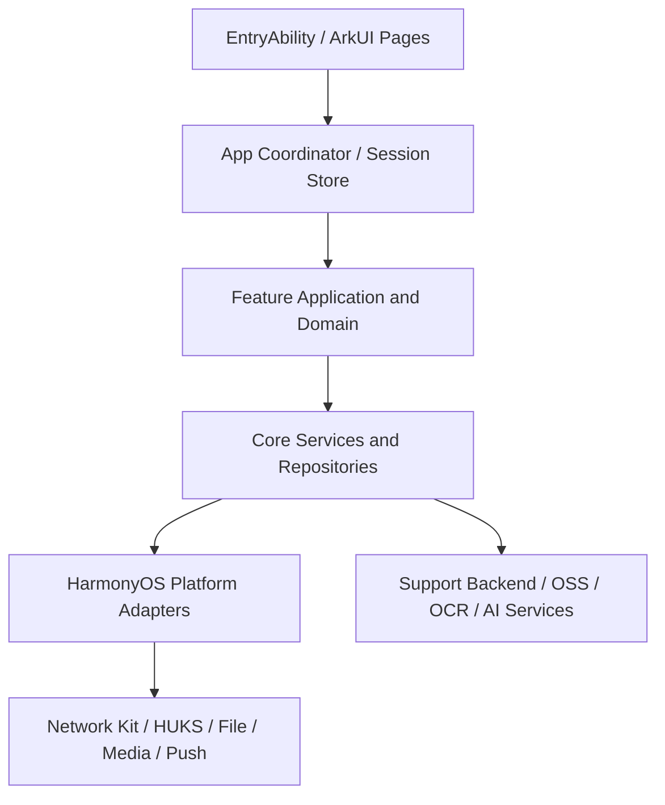

# SupportClientHuawei 项目汇总

## 1. 文档定位

本文档是 `SupportClientHuawei` 的项目总览与 iOS 对标入口，用于说明项目目标、当前工程事实、参考端目录、核心功能、平台差异、迁移优先级和文档体系。

参考端为 [SupportClient 项目汇总](../../SupportClient/总领文档/项目汇总.md)。该 iOS 项目是功能与后台契约的当前事实基线；本文不将 Swift 代码逐行转换为 ArkTS，而要求业务契约和可观察行为保持一致。

当前华为端已从 Stage 空模板推进到**网络底座 + 统一日志 + 资源多语言已实现**：`AppContainer`、`SupportBackend`、`Foundation/Logging`、`base/zh_CN/en_US` 字符串与 `L10n` 均已落在 `entry`；认证 UI、AI、文件、OCR、相机、设置等业务页面仍待迁移。本文中未标注“已实现”的目标设计仍为待迁移方案。

关联文档：

- [iOS 项目汇总](../../SupportClient/总领文档/项目汇总.md)
- [iOS 网络模块需求](../../SupportClient/总领文档/基础工程与运行环境/网络模块需求.md)
- [iOS 日志系统需求](../../SupportClient/总领文档/基础工程与运行环境/日志系统需求.md)
- [iOS 路由与页面导航需求](../../SupportClient/总领文档/基础工程与运行环境/路由与页面导航需求.md)
- [iOS 应用内通知需求](../../SupportClient/总领文档/应用内通知/应用内通知需求.md)
- [HarmonyOS 网络模块详细技术方案](./基础工程与运行环境/网络模块详细技术方案.md)
- [HarmonyOS 日志系统详细技术方案](./基础工程与运行环境/日志系统详细技术方案.md)
- [HarmonyOS 资源与多语言详细技术方案](./基础工程与运行环境/资源与多语言详细技术方案.md)
- [HarmonyOS 路由与页面导航详细技术方案](./基础工程与运行环境/路由与页面导航详细技术方案.md)
- [HarmonyOS 应用启动链路详细技术方案](./应用启动链路/应用启动链路详细技术方案.md)
- [HarmonyOS 应用内通知详细技术方案](./应用内通知/应用内通知详细技术方案.md)
- [HarmonyOS 键值存储与跨设备同步详细技术方案](./基础工程与运行环境/键值存储与跨设备同步详细技术方案.md)
- [HarmonyOS 会话与认证详细技术方案](./会话与认证/会话与认证详细技术方案.md)
- [HarmonyOS 账户管理详细技术方案](./设置与账户管理/账户管理详细技术方案.md)
- [HarmonyOS 账户管理 UI 设计图](../账户管理UI设计图.md)
- [HarmonyOS 文件与 OSS 详细技术方案](./文件与 OSS/文件与OSS详细技术方案.md)
- [AI 上传报告入口装配与文件 OSS 上传 iOS 对齐工单](./AI 上传报告/HOS-MED-UPLOAD-0001-入口装配与文件OSS上传iOS对齐工单.md)
- [AI 上传报告 OCR 与文本合并 iOS 对齐工单](./AI 上传报告/HOS-MED-UPLOAD-0002-OCR与文本合并iOS对齐工单.md)
- [AI 上传报告医疗文档类型判定 iOS 对齐工单](./AI 上传报告/HOS-MED-UPLOAD-0003-医疗文档类型判定iOS对齐工单.md)
- [AI 上传报告 OCR 识别失败真机问题修复 iOS 对齐工单](./AI 上传报告/HOS-MED-UPLOAD-0004-OCR识别失败真机问题修复iOS对齐工单.md)
- [AI 上传报告 OCR 初始化超时与预热兜底 iOS 对齐工单](./AI 上传报告/HOS-MED-UPLOAD-0005-OCR初始化超时与预热兜底iOS对齐工单.md)
- [AI 上传报告结构化抽取 iOS 对齐工单](./AI 上传报告/HOS-MED-UPLOAD-0006-结构化抽取iOS对齐工单.md)
- [HarmonyOS 首页医疗接口详细技术方案](./首页、成员与医疗画像/首页医疗接口详细技术方案.md)
- [HarmonyOS 首页医疗数据缓存详细技术方案](./首页、成员与医疗画像/首页医疗数据缓存详细技术方案.md)
- [HarmonyOS 首页成员模块详细技术方案](./首页、成员与医疗画像/首页成员模块详细技术方案.md)
- [HarmonyOS 体检报告详细技术方案](./首页、成员与医疗画像/体检报告详细技术方案.md)
- [HarmonyOS 医疗检查报告详细技术方案](./首页、成员与医疗画像/医疗检查报告详细技术方案.md)
- [HarmonyOS AI Runtime 推理编排详细技术方案](./对话、AI Runtime 与工具调用/AI Runtime 推理编排详细技术方案.md)
- [HarmonyOS iOS-HarmonyOS 功能对照矩阵](./iOS-HarmonyOS功能对照矩阵.md)
- [HarmonyOS 官方开发文档中心](https://developer.huawei.com/consumer/cn/doc/)

## 2. 项目概览

### 2.1 项目定位

`SupportClientHuawei` 的目标是以 HarmonyOS/ArkTS 实现与 `SupportClient` 相同的客户端业务闭环：账号会话、AI 设置、文件与 OSS、OCR、第二相机、首页与设置。

参考端已具备的核心能力：

- 手机验证码、Apple 登录、设备游客账号、Token 刷新与会话恢复。
- 账号资料、身份绑定/修改、账号注销。
- AI Provider、模型、API Key、远端配置、试用状态和本地配置持久化。
- 文件元数据、OSS STS、上传下载、业务绑定、缓存与删除。
- 阿里云、本地服务和系统 Vision OCR 的编排、融合与文档提取。
- 第二相机的拍照、录像、相册、多媒体预览、编辑与导出。
- 首页、第二相机、设置三个主 Tab，以及账号、网络和启动状态的全局协调。

华为端当前已具备的能力：

- `entry` 单入口模块，设备类型为 `phone`。
- Stage 模型 `EntryAbility`，可加载 `pages/Index`；`onCreate` 一次性初始化 `AppContainer`。
- 网络底座：`SupportBackend` + Engine/Transport/Token/401/Retry/串行/ETag/领域 API；`ohos.permission.INTERNET` 已声明。
- 主页面通过 `$r('app.string.home_*')` 显示欢迎文案（无 Hello World 硬编码）。
- 备份 Extension 声明、应用图标、启动窗口和基础 unit/ohosTest 测试。
- 资源多语言：`base`/`zh_CN`/`en_US` 字符串；`L10n` 供非 UI 读取。
- 应用内通知 P1–P5：`NotificationClient` + Queue/Store/Delivery/Inbox/Metrics + 根级 `AppNotificationHost`；`LoginViewModel` 统一发布；P6 Push 未做。

### 2.2 推荐架构形态

目标形态保持为：

> 模块化单体客户端（Modular Monolith）+ 功能垂直切片（Feature Vertical Slice）+ 基础能力适配层。

理由：所有业务共享同一会话、同一后台、文件与 AI 配置；目前需要清晰模块边界和可测试性，但没有拆成多个独立应用或进程的必要。HarmonyOS 端可以随工程增长把稳定基础能力拆入 HAR/HSP，但不应在空模板阶段提前拆分。

### 2.3 跨端架构原则

- 参考端与华为端共享业务目录、功能名称、接口契约、领域模型语义和验收结果。
- 平台实现允许不同：SwiftUI/ArkUI、Keychain/HUKS、URLSession/Network Kit、Swift actor/ArkTS Promise 队列。
- 页面只负责 UI 状态，不能直接创建 HTTP、存储、OSS、OCR、相机或安全凭证对象。
- 全局会话、账号清理、路由、网络门控和启动流程必须有唯一协调入口。
- Token、API Key、OTP、STS Secret、身份凭证和用户隐私字段不得写入普通 Preferences、文件缓存或日志。
- 账号级 AI、文件、ETag、媒体和运行时状态必须按账号命名空间隔离。

## 3. 工程目录与当前状态

### 3.1 iOS 参考端目录

```text
SupportClient/
├── SupportClient/
│   ├── App/                         # 装配、启动、会话、路由、通知
│   ├── Core/                        # AI、数据库、文件、网络、通知、UI
│   ├── Foundation/                  # 原子操作、日志、JWT、网络监控
│   ├── Projects/
│   │   ├── Core/                    # Domain、Networking、OCR、OSS、Device
│   │   └── Features/                # Auth、Account、AISettings、SecondCamera、Settings、Memory
│   ├── Resources/ 与 Assets.xcassets/
│   └── SupportClientApp.swift
├── SupportClientTests/
├── 需求文档/
└── 总领文档/
```

### 3.2 HarmonyOS 当前实际目录

```text
SupportClientHuawei/
├── AppScope/
│   ├── app.json5
│   └── resources/
├── entry/
│   ├── src/main/
│   │   ├── ets/
│   │   │   ├── App/                    # AppContainer、BackendEnvironment
│   │   │   ├── Core/Networking/        # SupportBackend、SupportAPIs
│   │   │   ├── Projects/Core/Networking/  # Engine、Transport、API、Cache
│   │   │   ├── Foundation/             # SecureTokenStore、JWT、NetworkPathMonitor、Logging
│   │   │   ├── entryability/EntryAbility.ets
│   │   │   ├── entrybackupability/
│   │   │   └── pages/Index.ets
│   │   ├── module.json5
│   │   └── resources/
│   ├── src/test/
│   └── src/ohosTest/
├── build-profile.json5
├── oh-package.json5
└── 开发详细技术文档/
```

工程配置事实：根 `build-profile.json5` 只有 `entry` 模块；目标 SDK 为 `6.1.1(24)`，兼容 SDK 为 `6.1.0(23)`；应用 bundleName 为 `cn.Zhaodk.Health`；入口为 `EntryAbility`；`installationFree=false`；`module.json5` 已声明 `ohos.permission.INTERNET`；相机、相册、通知等业务权限仍未声明。

### 3.3 参考端业务目录到华为端映射

| 参考端业务目录 | iOS 当前职责 | 华为端当前代码目录 | 华为端目标代码语义目录 | 文档目录 | 状态 |
| --- | --- | --- | --- | --- | --- |
| 基础工程与运行环境 | 环境、网络、日志、路由、资源 | `App/`、`Core/Networking/`、`Foundation/`、网络/日志/路由/资源方案 | `App/`、`Core/Networking/`、`Foundation/` | `基础工程与运行环境/` | 网络、日志、资源多语言、路由壳已实现 |
| 路由与页面导航 | 根会话切换、登录局部导航、主框架 Tab、系统事件 | `App/AppSessionStore.ets`、`RouteCoordinator.ets`、`pages/Index.ets`、`Projects/App/`、`Projects/Features/{Auth,Settings,AccountManagement,SecondCamera}/` | `App/`、`Projects/App/`、`Projects/Features/Auth/`、`Projects/Features/Settings/` | `基础工程与运行环境/` | 路由壳已实现；登录 OTP/协议局部导航已接；相机/深链待后续 |
| 资源与多语言 | 应用名称、权限说明、页面文案、图标、启动背景 | `AppScope/`、`entry/src/main/resources/`、`zh_CN`/`en_US`、`Foundation/L10n/` | `AppScope/`、`entry/src/main/resources/`、语言目录 | `基础工程与运行环境/` | 资源与双语已实现；AI/相机专用资源待功能模块 |
| 会话与认证 | 登录、Token、会话恢复、登出 | `Projects/Features/Auth/`、`UserSession.ets`、`DeviceCredentialStore.ets`、`AppSessionStore.ets`、`AccountSessionRuntime.ets`、`LoginViewModel.ets` | `Projects/Features/Auth/`、`Projects/Core/Domain/Entities/`、`App/`、`Foundation/Security/` | `会话与认证/` | 领域底座 + 截图级登录 UI 已实现；华为账号占位 |
| 应用启动链路 | Container、Bootstrap、生命周期、网络门控 | `EntryAbility.ets`、`AppContainer.ets`、`AppLifecycleCoordinator.ets`、`AppBootstrapper.ets`、`DeviceRegistrationCoordinator.ets`、`SupportSystemInfo.ets`、`SignedInSessionPreparationRegistry.ets`、`pages/Index.ets` | `App/` | `应用启动链路/` | 启动 P1–P5 + 设备登记 P3–P6；OSS 待后续 |
| 应用内通知 | toast、banner、alert、通知队列、收件箱、指标 | `Projects/Core/Notification/`、`App/Notification/`、`AppContainer.ets`、`pages/Index.ets`、`LoginViewModel.ets` | `Projects/Core/Notification/`、`App/Notification/` | `应用内通知/` | P1–P5 已落地；P6 Push 未做 |
| 主框架与首页 Tab | Tab、全局路由、首页组合 | `Projects/App/MainTabsPage.ets`、`HomeTabPage.ets` | `Projects/App/`、`App/` | `主框架与首页 Tab/` | 三 Tab 壳已实现；首页业务待丰富 |
| 首页、成员与医疗画像 | 成员列表 + complete-data 双段式聚合、卡片统计、内存缓存注入与字段回写；成员模块分区与 SetupFlow；体检/检查报告列表/明细/写链路 | `API/Medical` + `Features/Home` + `MemberContext` + HomeTab（参考：iOS `Features/Home/`、`API/Medical/`、`首页成员模块.md`、`体检报告.md`、`医疗检查报告.md`） | 同左 + 饮食区/汇总子流、独立检查深度页 | `首页、成员与医疗画像/首页医疗接口详细技术方案.md`、`首页医疗数据缓存详细技术方案.md`、`首页成员模块详细技术方案.md`、`体检报告详细技术方案.md`、`医疗检查报告详细技术方案.md` | 接口/缓存部分对齐；成员：default-off + SetupFlow 主路径已通，饮食区待渲；体检：独立列表/卡片/详情/懒加载已通，OCR 待；检查：list+patch 已通，`ExaminationReports/` 深度页待实现 |
| AI 设置与本地模型 | Provider、模型、远端配置、本地 RDB、统一消费 | `Projects/Core/AI/`、`Projects/Core/Networking/API/AI/AIConfigAPI.swift`、[AI 配置生命周期与本地、Pro 统一消费](../../SparkClient/总领文档/AI 设置与本地模型/AI 配置生命周期与本地、Pro 统一消费.md)、[AI 设置场景配置](../../SparkClient/总领文档/AI 设置与本地模型/AI 设置场景配置（厂商key、模型、默认模型配置、小任务）.md) | `Core/AI/`、`Core/Storage/`、`Projects/Core/Networking/API/AI/AIConfigAPI.ets`、`App/AppBootstrapper.ets`、`Projects/Features/AISettings/` | `AI 设置与本地模型/AI 配置生命周期与本地、Pro 统一消费详细技术方案.md`、`AI 设置与本地模型/AI 设置场景配置（厂商key、模型、默认模型配置、小任务）详细技术方案.md`、`AI 设置与本地模型/AI 启动、账号缓存与供应商配置跨端偏差修复工单.md` | 部分对齐：本地 seed/RDB、HUKS、Repository、Resolver、Runtime 和聚合设置页已接入；P0 启动就绪门禁、Pro revision/Key 契约、首次/非首次缓存边界和自定义供应商闭环待修复 |
| 对话、AI Runtime 与工具调用 | 统一推理入口、流式、取消、tools 降级；聊天编排与工具（编排层） | iOS `Core/AIRuntime/`、`Features/Chat/`、[AI Runtime 推理编排需求](../../SparkClient/总领文档/对话、AI Runtime 与工具调用/AI Runtime 推理编排需求.md) | `Core/AI/Runtime/`（薄层已有）；无 Chat/ToolHub/Orchestrator | `对话、AI Runtime 与工具调用/AI Runtime 推理编排详细技术方案.md` | 部分对齐：`AIRuntimeService` + 远程非流式 Adapter + GGUF 占位 + 单测；真 SSE、硬取消、ChatOrchestrator、业务消费待实现 |
| 文件与 OSS | 上传、下载、STS、元数据、缓存 | 无；仅 `Core/AI/Infrastructure/LocalModelFileService.ets` 可作私有文件目录参考 | `Core/FileStorage/`、`Projects/Core/OSS/`、`Projects/Core/Networking/API/{File,OSS}/`、`entry/third_party/aliyun-oss/`、`MedicalDocumentUpload/Application/UploadMedicalDocumentFilesUseCase.ets` | `文件与 OSS/文件与OSS详细技术方案.md` | 公共服务 P0–P4 已落地；P5 已接通聊天/药箱/AI 上传报告 UPLOAD |
| AI 上传报告 | 入口装配、文件选择、源文件 OSS 上传、OCR/type/extract/save pipeline | iOS `Projects/Features/MedicalDocumentUpload/`、`Projects/Core/OCR/`、用户提供 ArkTS 参考骨架 | `Projects/Features/MedicalDocumentUpload/`、`Projects/App/HomeTabPage.ets`、`App/AppContainer.ets`、`Home/Presentation/MedicalLists/MedicalDocumentAttachmentUploader.ets` | `AI 上传报告/HOS-MED-UPLOAD-0001-入口装配与文件OSS上传iOS对齐工单.md` | 前两阶段部分对齐：入口可拉起、OSS 上传基本跑通；文件 Picker、capability 装配、断点、错误归一化待补；OCR 之后全链路待后续 |
| AI 上传报告 OCR 与文本合并 | OCR 编排、PDF 文本层、扫描件 OCR、多文件文本合并、医学术语纠错、类型识别前输入 | iOS `Projects/Core/OCR/`、`ExtractTypedMedicalDocumentUseCase.swift`、`ResolveMedicalDocumentTypeUseCase.swift` | OCR 多引擎并发；PDF 文本层优先；按文件/页顺序合并；纠错后交给类型识别 | `Projects/Core/OCR/*`、`MedicalDocumentOCRUseCase.ets`、`ResolveMedicalDocumentTypeUseCase.ets`、`MedicalDocumentOCRTextMerger.ets` | `AI 上传报告/HOS-MED-UPLOAD-0002-OCR与文本合并iOS对齐工单.md` | 已实现 OCR+合并+本地类型识别；结构化抽取/AI 类型兜底待下一工单；真机 Vision/PDF 待验收 |
| AI 上传报告 OCR 识别失败真机修复 | 上传截图/图片后应完成 OCR 或给出可操作错误，不能因释放异常直接失败 | iOS `OCROrchestrator.swift`、`OCRDocumentExtractor.swift` | 图片解码和 Vision 失败不被释放阶段覆盖；多引擎失败隔离 | `HarmonyBuiltInOCREngine.ets`、`HarmonyBuiltInOCRSession.ets`、`OCRImageSourceAdapter.ets`、`OCROrchestrator.ets`、`OCRDiagnostics.ets` | `AI 上传报告/HOS-MED-UPLOAD-0004-OCR识别失败真机问题修复iOS对齐工单.md` | 已实施：fd 读图 + Session + 安全释放 + 阶段化错误 + 多引擎隔离；待真机验收 browser/相册/空白图 |
| AI 上传报告 OCR 初始化超时与预热兜底 | 系统 OCR 初始化超时时自动预热、重试、熔断或降级，避免每次等待 5 秒后失败 | iOS `OCROrchestrator.swift` | Vision 无显式阻塞 init；多引擎失败隔离；OCR 重试不重复上传 | `HarmonyBuiltInOCRSession.ets`、`OCRWarmupCoordinator.ets`、`OCRFallbackPolicy.ets`、`OCROrchestrator.ets`、`MedicalDocumentUploadViewModel.ets` | `AI 上传报告/HOS-MED-UPLOAD-0005-OCR初始化超时与预热兜底iOS对齐工单.md` | 已实施：预热 + 状态机 + reset/retry + keepAlive + cooldown + rootCause 文案；待真机验收 |
| AI 上传报告医疗文档类型判定 | OCR 后自动判断病历、体检、检查、处方、用药计划、家庭药箱，并允许手动覆盖 | iOS `DefaultMedicalDocumentTypeResolver.swift`、`ResolveMedicalDocumentTypeUseCase.swift`、`MedicalPromptFactory.swift`、`MedicalDocumentUploadViewModel.swift` | 手动选择优先；本地规则命中直接返回；未命中调用 AI Runtime 并解码 JSON `kind/confidence/reason` | `DefaultMedicalDocumentTypeResolver.ets`、`MedicalDocumentTypeAIClient.ets`、`MedicalDocumentTypeResponseDecoder.ets`、`LocalMedicalDocumentTypeResolver.ets` | `AI 上传报告/HOS-MED-UPLOAD-0003-医疗文档类型判定iOS对齐工单.md` | 已实现 manual/localRules/AI/fallback；低置信确认与单测已补；真机 AI 待验 |
| 第二相机 | 相机、相册、编辑、保存 | 无 | `Projects/Features/SecondCamera/` | `第二相机/` | 待实现 |
| 设置与账户管理 | 设置页账户入口、账号资料、身份、绑定、换绑、注销、退出登录 | `Projects/Features/Settings/`、`Projects/Features/AccountManagement/{Domain,Application,Infrastructure,Presentation}/`、`Projects/Core/Networking/API/Account/` | `Projects/Features/Settings/`、`Projects/Features/AccountManagement/` | `设置与账户管理/` | P1–P6 已落地（phone/email 全流程；Huawei ComingSoon；P7 联调未做） |
| Memory | 个性化记忆与提示词仓库 | 无 | `Projects/Features/Memory/` | 后续按参考端实际功能文档创建 | 待实现 |

文档目录必须沿用参考端的业务名称。上述除已存在的网络方案外均为规划目录，本次不创建空目录或空功能文档。

## 4. 应用分层、组合根与依赖方向

参考端当前依赖方向为：

```text
Presentation / App
        ↓
Feature Application + Domain
        ↓
Core Infrastructure
        ↓
Platform API / External Services
```

HarmonyOS 目标端应保持等价职责，而非复制 iOS 文件数量：



建议目标语义目录（网络相关已落地，其余仍为规划）：

```text
entry/src/main/ets/
├── App/                            # AppContainer、BackendEnvironment（已实现）
├── Core/                           # SupportBackend、SupportAPIs（已实现）
├── Foundation/                     # SecureTokenStore、JWT、NetworkPathMonitor、Logging（已实现）
├── Projects/Core/                  # Networking Engine/API/Cache（已实现）
└── Projects/Features/              # Auth、Account、AISettings、SecondCamera…（待实现）
```

## 5. 启动与全局生命周期

### 5.1 iOS 当前启动流程

```text
SupportClientApp
  → AppContainer.live()
  → NetworkPathMonitor 评估网络
  → AppLifecycleCoordinator
  → AppSessionStore.restoreIfNeeded()
      ├─ 无会话：登录
      └─ 有会话：账号级准备
          ├─ 设备登记
          ├─ AI 配置预热/刷新
          ├─ OSS STS 预取
          └─ 主 Tab
```

关键证据：`SupportClientApp.swift`、`AppContainer.swift`、`AppBootstrapper.swift`、`AppLifecycleCoordinator.swift`、`AppSessionStore.swift`、`AppCoordinatorView.swift`。

### 5.2 HarmonyOS 当前与目标

当前 `EntryAbility` 已实现完整 Ability 生命周期；`AppContainer` 装配网络、日志、Auth UseCases 与 `AppLifecycleCoordinator`；冷启动在网络 `satisfied` 后恢复会话；`Index` 按网络门禁 / 会话态 / `preparedAccountId` 分流启动页、登录页或主 Tab。设备登记已补 `SupportSystemInfo`、HUKS 凭证与跨启动摘要；OSS STS 与 Token 存储 HUKS 仍待后续。

目标流程：

```text
EntryAbility.onCreate / onWindowStageCreate
  → AppContainer 初始化（一次）
  → NetworkPathMonitor 首次评估
  → AppLifecycleCoordinator 恢复会话
      ├─ signedOut：认证入口
      └─ signedIn：设备登记、AI 配置、OSS 凭证及主框架准备
  → ArkUI 主路由
```

关键约束：应用级初始化只能执行一次；账号级准备以 accountId 去重；网络“尚未评估”和“确认离线”必须分开；前后台切换不能重复登录、设备登记或路由跳转。

HarmonyOS 应用生命周期与 UIAbility/Stage 模型的具体 API 与行为需以目标 SDK 24 在[官方文档中心](https://developer.huawei.com/consumer/cn/doc/)复核。

## 6. 核心功能模块地图

| 模块 | 参考端关键代码/文档 | 参考端已实现能力 | HarmonyOS 目标实现重点 | 当前状态 |
| --- | --- | --- | --- | --- |
| App 装配与生命周期 | `App/`、`Projects/App/`、[应用启动链路](../../SupportClient/总领文档/应用启动链路/) | Container、会话、路由、网络门控、通知 | AppContainer、SessionStore、Lifecycle、Bootstrap | P1–P5 已实现（AI bootstrap；OSS skip） |
| 路由与页面导航 | `AppCoordinatorView.swift`、`RouteCoordinator.swift`、`LoginView.swift`、`SecondCameraHomeView.swift`、[路由与页面导航需求](../../SupportClient/总领文档/基础工程与运行环境/路由与页面导航需求.md) | 启动态/登录态/主框架态切换，Tab、sheet、fullScreenCover、系统失效回退 | `Navigation`、`Tabs`、`NavPathStack`、sheet/popup、事件总线 | 路由壳已实现；单测 `RoutingShell.test.ets`；OTP/相机/深链待后续 |
| 应用内通知 | `Projects/Core/Notification/`、`App/Notification/`、[应用内通知需求](../../SupportClient/总领文档/应用内通知/应用内通知需求.md) | toast、banner、alert、队列去重、收件箱、指标、业务反馈入口 | ArkUI 根 Host、NotificationClient、Promise 队列、私有文件 inbox、指标快照 | P1–P5 已实现；单测 `entry/src/test/ets/Notification/`；P6 Push 未做 |
| 日志系统 | `Foundation/`、[日志系统需求](../../SupportClient/总领文档/基础工程与运行环境/日志系统需求.md) | 统一日志入口、脱敏、Request ID、启动/网络/认证诊断 | `Foundation/Logging/`、`StartupLogger`、`NetworkLogger`、`LogSanitizer` | 代码已实现；仅 hilog，无文件 sink |
| 网络与 Backend API | `Projects/Core/Networking/`、[网络模块需求](../../SupportClient/总领文档/基础工程与运行环境/网络模块需求.md) | Engine、Token、401、重试、ETag、日志、领域 API | Network Kit Transport、SecureTokenStore、Promise 单飞与账号缓存 | 代码已实现；联调与会话模块接入待完成 |
| 会话与认证 | `Projects/Features/Auth/`、[会话与认证需求](../../SupportClient/总领文档/会话与认证/会话与认证需求.md) | Apple/OTP/设备登录、会话恢复、登出 | 领域底座 + 截图级登录 UI（协议门禁/手机号/OTP/Web）；华为占位 | 领域 + UI 已实现（`AuthDomain.test.ets`、`AuthUi.test.ets`）；华为换票待做 |
| 设置与账户管理 | `Projects/Features/Settings/`、`Projects/Features/AccountManagement/`、[账户管理需求](../../SupportClient/总领文档/设置与账户管理/账户管理需求.md) | 设置入口、身份列表、绑定/修改、注销、退出登录 | ArkUI 设置入口、AccountManagement Feature、AccountIdentity/Deactivation API、OTP、会话清理 | 部分对齐；[账户管理详细技术方案](./设置与账户管理/账户管理详细技术方案.md) |
| AI 设置与运行时 | `Projects/Features/AISettings/`、`Core/AI/`、`Core/Storage/`、[AI 配置生命周期与本地、Pro 统一消费](../../SparkClient/总领文档/AI 设置与本地模型/AI 配置生命周期与本地、Pro 统一消费.md) | Provider/模型/配置、CoreData/UserDefaults、远端同步、本地/Pro 统一消费 | ArkTS RDB、HUKS API Key、SparkService bootstrap、Resolver 与 Runtime | 部分对齐：API 入口、启动 bootstrap、本地 RDB、HUKS、Resolver、Runtime 已实现；公共 KV 镜像、完整 UI、GGUF 推理和生产安全收口待完善 |
| 对话、AI Runtime 与工具调用 | iOS `Core/AIRuntime/`、`Features/Chat/`、[AI Runtime 推理编排需求](../../SparkClient/总领文档/对话、AI Runtime 与工具调用/AI Runtime 推理编排需求.md)；鸿蒙方案 [AI Runtime 推理编排详细技术方案](./对话、AI Runtime 与工具调用/AI Runtime 推理编排详细技术方案.md) | 真 SSE、ChatOrchestrator 多轮、tools 降级、取消、业务直连 Runtime | 扩展现有 `Core/AI/Runtime`：真流式、硬取消、Orchestrator、Feature 消费；ToolHub 另专题 | 部分对齐：薄层 Runtime + 非流式远程 + GGUF 占位 + 单测；无 Chat/ToolHub |
| 文件、OSS 与缓存 | `Core/FileStorage/`、`Projects/Core/OSS/` | STS、上传下载、MD5、元数据、缓存 | 私有文件目录、上传 SDK 适配、STS 生命周期、账号隔离 | 待实现 |
| AI 上传报告 OCR 与文本合并 | `Projects/Core/OCR/`、`Projects/Features/MedicalDocumentUpload/Application/ExtractTypedMedicalDocumentUseCase.swift`、`ResolveMedicalDocumentTypeUseCase.swift` | 多引擎、PDF 文本层、扫描件 OCR、多文件文本合并、术语修正、类型识别前输入 | HarmonyOS OCR/第三方/后端适配器与统一编排，按文件边界输出 `mergedOCRText` | 已实施 OCR+合并+本地类型识别；待补真机 PDF/预处理/多引擎并发；[OCR 与文本合并工单](./AI%20上传报告/HOS-MED-UPLOAD-0002-OCR与文本合并iOS对齐工单.md) |
| AI 上传报告 OCR 识别失败真机修复 | `OCROrchestrator.swift`、`OCRDocumentExtractor.swift` | 图片解码、Vision 识别、资源释放、引擎失败隔离 | HarmonyOS 修复 `release of undefined`，按官方 fd 读取路径包装通用内置 OCR，补 session 生命周期、安全释放、阶段化错误和 URI 读取 fallback | 已实施（待真机验）；[OCR 识别失败真机修复工单](./AI%20上传报告/HOS-MED-UPLOAD-0004-OCR识别失败真机问题修复iOS对齐工单.md) |
| AI 上传报告 OCR 初始化超时与预热兜底 | `OCROrchestrator.swift` | OCR 引擎准备、重试、熔断、兜底 | HarmonyOS 补系统 OCR 预热、init 超时 reset+retry、短 TTL 保活、cooldown 熔断和错误 rootCause | 已实施（待真机验）；[OCR 初始化超时工单](./AI%20上传报告/HOS-MED-UPLOAD-0005-OCR初始化超时与预热兜底iOS对齐工单.md) |
| AI 上传报告医疗文档类型判定 | `DefaultMedicalDocumentTypeResolver.swift`、`ResolveMedicalDocumentTypeUseCase.swift`、`MedicalPromptFactory.swift`、`MedicalDocumentUploadViewModel.swift` | 手动选择、本地规则、AI 兜底、类型 JSON 解码、低置信确认 | HarmonyOS 默认 resolver 接入 `Core/AI/Runtime`，输出稳定 `MedicalDocumentTypeResolution` | 已实现；[医疗文档类型判定工单](./AI%20上传报告/HOS-MED-UPLOAD-0003-医疗文档类型判定iOS对齐工单.md) |
| AI 上传报告结构化抽取 | `ExtractTypedMedicalDocumentUseCase.swift`、`DefaultTypedMedicalDocumentExtractor.swift`、`MedicalPromptFactory.swift`、`StructuredJSONStreamDecoder.swift`、`MedicalExtractionErrorNormalizer.swift` | Prompt 组装、Structured JSON 解码、错误归一化、retry feedback、Typed 输出 | Prompt 工厂 / Runtime Client / Decoder / Normalizer / Typed Mapper / ResultPage 已接通；有 AIRuntime 时打开 extraction | 已实现（待真机）；[结构化抽取工单](./AI%20上传报告/HOS-MED-UPLOAD-0006-结构化抽取iOS对齐工单.md) |
| 第二相机 | `Projects/Features/SecondCamera/` | 相机、录像、相册、编辑、保存 | Camera/Photo/Media 能力、权限、编辑与文件/OCR 串联 | 待实现 |
| 主框架与设置 | `Projects/Features/Settings/`、`AppCoordinatorView.swift` | Tab、入口、设置 | ArkUI Navigation/Tabs、全局状态响应 | Tab + 设置壳已实现；账户管理见设置与账户管理；AI 设置待后续 |
| Memory | `Projects/Features/Memory/` | 个性化记忆、提示词/AI 数据边界 | 领域模型、持久化和 AISettings 协作 | 待实现 |

## 7. 关键业务流程与对标要求

### 7.1 登录、游客账号与会话恢复

参考端：读取会话快照与 Token；Access Token 有效则恢复；临期时刷新；明确刷新失效时清理并进入登录；设备游客可升级为正式身份。

华为端要求：使用安全 Token 存储、账号级 SessionStore、共享刷新 Promise、一次性 401 失效事件；游客升级前后必须明确 AI/文件缓存的迁移或隔离策略。Apple 登录在 HarmonyOS 是否提供等价入口不能假定，需按产品选择替代流程并在账号模块中明确。

### 7.2 AI 配置同步

参考端：先读取账号 CoreData 快照，再后台刷新远端配置；编辑后区分本地保存、远端同步和 Runtime 更新。

华为端要求：同样区分草稿、本地快照、远端成功和运行时生效；Provider API Key 不得进入普通配置存储。远端 Bootstrap 的 API 字段、ETag、账号隔离和失败回退已在网络方案中定义。

### 7.3 文件、OSS 与 OCR

参考端：媒体/文件输入 → 生成 UUID、MIME、大小、MD5 → STS → 上传 → 文件元数据注册与业务绑定；OCR 经过预处理、多引擎编排、融合、术语修正和文档提取。

华为端要求：媒体产生与文件上传解耦；文件缓存置于应用私有目录；STS 只驻留内存；OCR 页面不可直接调用云 SDK 或私有服务地址；上传失败必须能区分本地读取、STS、上传、注册和绑定阶段。

### 7.4 第二相机与媒体链路

参考端：权限 → 拍照/录像/相册 → 预览/编辑 → 导出保存 → 上传、OCR 或业务绑定。

华为端要求：相机、相册、编辑、保存均通过平台适配器隔离；每项系统权限都有申请时机、拒绝态、前后台恢复和资源释放规则；媒体输出使用稳定领域模型连接文件、OSS 和 OCR。

## 8. 数据、状态与持久化边界

| 状态类型 | 参考端承载 | HarmonyOS 目标承载 | 安全与清理要求 |
| --- | --- | --- | --- |
| 瞬时 UI | View/ViewModel | ArkUI 页面状态/状态对象 | 页面离开即释放，不持久化敏感数据 |
| 会话 | `AppSessionStore` | `AppSessionStore.ets` | 登录、登出、失效由唯一协调器变更 |
| Token | Keychain + TokenProvider | HUKS/加密 `SecureTokenStore` | 不进 Preferences、日志、ETag 或普通文件 |
| 账号领域状态 | Repository/Domain | Feature Repository/Domain | 必须带 account scope |
| AI 配置 | CoreData + RuntimeStore | 账号隔离数据层 + RuntimeStore | API Key 另行安全保护 |
| 文件缓存 | FileCacheManager | `context.filesDir`/缓存目录 | 文件与 metadata 按账号隔离，支持完整性校验与清理 |
| 网络 ETag | ETagStore | 私有 metadata/body 缓存 | URL、query、鉴权指纹隔离；304 无 body 为错误 |
| 设备元数据 | DeviceCache | Preferences/安全边界明确的设备存储 | 普通元数据可存；Token/STS 不可存 |

## 9. HarmonyOS 平台资料与本地参考

| 类别 | 官方资料/本地证据 | 本项目用途 | 可借鉴与限制 |
| --- | --- | --- | --- |
| 应用开发入口 | [HarmonyOS 开发文档中心](https://developer.huawei.com/consumer/cn/doc/) | 按 SDK 24 复核 Stage、ArkTS、权限、系统 Kit API | 页面随 SDK 迭代，实施前必须复核具体签名 |
| 资源与国际化 | [Resource](https://developer.huawei.com/consumer/en/doc/harmonyos-references/ts-types)、[ohos.i18n (Internationalization)](https://developer.huawei.com/consumer/en/doc/harmonyos-references/js-apis-i18n) | 资源键、locale 管理与多语言目录 | 目录与 API 以当前 SDK 为准，不能沿用旧版习惯 |
| 日志 | [ohos.hilog (HiLog日志打印)](https://developer.huawei.com/consumer/cn/doc/harmonyos-references/js-apis-hilog)；[hdc命令](https://developer.huawei.com/consumer/cn/doc/harmonyos-guides/hdc) | 统一运行时日志输出、设备端日志获取与调试 | 必须先脱敏再打印；设备端日志仅用于开发诊断 |
| HTTP | [发送网络请求（ArkTS）](https://developer.huawei.com/consumer/cn/doc/harmonyos-guides/http-request) | 统一 Transport、取消、超时与会话关闭 | 仅网络模块使用；SDK 方法签名以 DevEco 当前版本为准 |
| 密钥保护 | [Universal Keystore Kit ArkTS API](https://developer.huawei.com/consumer/cn/doc/harmonyos-references/universal-keystore-arkts) | Token/API Key 的密钥保护基础 | HUKS 保护密钥，不等于允许明文凭证写 Preferences |
| HTTP/Token/网络状态示例 | `/Users/hua/Documents/project/Reference/ClientSub-project/SparkAndroid/Package/Huawei/agc-template-market-harmonyos-demos-main/MovieTVAndLivestreamingTemplate/LiveStreaming/commons/utils/src/main/ets/` | 拦截器链、网络监听、Preferences 组织方式 | 可借鉴层次；`MockAdapter`、完整 Header/body/response 日志、普通 Preferences 存凭证不可复制 |
| 网络模块化示例 | `/Users/hua/Documents/project/Reference/ClientSub-project/SparkAndroid/Package/Huawei/agc-template-market-harmonyos-demos-main/NewsTemplate/News/commons/network/` | 后期将稳定网络能力提取为 commons/HAR 的参考 | 当前空模板不应过早拆分 |

## 10. 迁移顺序与实施阶段

| 阶段 | 目标 | 依赖 | 结果 |
| --- | --- | --- | --- |
| 1. 工程与基础 | AppContainer、环境、日志、路由、网络和安全存储 | Stage 生命周期、权限、官方 API | 可启动、可诊断、可安全访问后台 |
| 2. 会话闭环 | 设备/OTP 登录、Token、会话恢复、登出 | 网络、HUKS、SessionStore | 登录与冷启动可验证 |
| 3. 主框架与账号 | Tab、设置、账号资料、身份绑定、注销 | 会话、路由、OTP | 正式用户主路径可用 |
| 4. AI 与数据 | AI 设置、远端配置、账号隔离持久化 | 会话、存储、网络 | 配置可同步并生效 |
| 5. 文件与 OCR | 文件缓存、STS、上传下载、OCR 编排 | 网络、私有文件、媒体输入 | 媒体可转为业务数据 |
| 6. 第二相机与完善 | 相机、相册、编辑、媒体链路、通知、弱网恢复 | 文件、OCR、权限 | 与 iOS 主体验闭环对齐 |

## 11. 测试与验收策略

### 11.1 单元与模块测试

- 网络：URL、包裹/直接解码、刷新单飞、401、重试、ETag、缓存隔离、日志脱敏。
- 会话：Token 过期、恢复、游客升级、登出和会话失效。
- AI：本地快照、远端合并、API Key 安全边界和 Runtime 刷新。
- 文件/OCR：MD5、缓存、STS 过期、上传失败阶段、引擎选择和结果转换。
- 媒体：权限拒绝、取消、导出失败、资源释放和前后台恢复。

### 11.2 集成与端到端验收

- 冷启动进入登录或恢复主框架，且不重复执行账号准备。
- 登录后设备登记、AI 刷新与 OSS 凭证流程按依赖完成。
- 网络断开、恢复、401、Token 刷新失败、账号切换均有可理解 UI 与正确清理。
- 从第二相机/相册产生的媒体可以预览、保存、上传、OCR 并绑定业务。
- 日志可由 Request ID/业务流程定位，但不包含 Token、OTP、API Key、STS Secret 或完整敏感 body。

## 12. 当前差距、风险与待确认项

| 编号 | 风险/待确认项 | 当前证据 | 影响 | 关闭条件 |
| --- | --- | --- | --- | --- |
| R-01 | 路由壳已落地，完整 OTP/相机/账号业务未完成 | `AppSessionStore`、`RouteCoordinator`、`MainTabsPage`、登录/设置壳已接 `SessionInvalidation` | 真实 OTP、第二相机、账号准备门禁、深链仍待模块 | 按功能方案继续补齐 |
| R-02 | 后端是否接受 HarmonyOS `bundleId`、`platform`、设备标识 | iOS API 当前以 iOS bundle/平台调用 | 登录、设备登记、AI Bootstrap | 后端确认枚举并通过真实接口测试 |
| R-03 | Apple 登录在 HarmonyOS 的产品替代路径 | iOS 有 Apple 登录；华为端无对应实现 | 账号入口与身份绑定 | 产品确认使用手机号/设备/其他登录方式及迁移策略 |
| R-04 | HarmonyOS 对 OSS SDK、OCR 引擎、相机/相册编辑能力的最终选型 | 目标工程尚无依赖 | 文件、OCR、第二相机 | 每个能力按 SDK 24 官方文档和 POC 验证 |
| R-05 | 账号缓存、游客升级、注销后的媒体/AI 数据清理与迁移 | iOS 规则存在，华为端尚无数据层 | 隐私、数据串用 | 各功能方案明确 account scope、迁移与清理测试 |
| R-06 | 当前工程缺少相机、相册、通知等业务权限声明 | `module.json5` 已有 INTERNET；媒体权限未见 | 相机/相册/通知相关功能无法运行 | 按实际模块最小化声明并验收授权拒绝路径 |

## 13. 文档体系与后续维护

当前已存在的华为端专项文档：

- [网络模块详细技术方案](./基础工程与运行环境/网络模块详细技术方案.md)
- [日志系统详细技术方案](./基础工程与运行环境/日志系统详细技术方案.md)
- [资源与多语言详细技术方案](./基础工程与运行环境/资源与多语言详细技术方案.md)
- [路由与页面导航详细技术方案](./基础工程与运行环境/路由与页面导航详细技术方案.md)
- [应用启动链路详细技术方案](./应用启动链路/应用启动链路详细技术方案.md)
- [应用内通知详细技术方案](./应用内通知/应用内通知详细技术方案.md)
- [会话与认证详细技术方案](./会话与认证/会话与认证详细技术方案.md)

后续按 iOS 参考端的实际业务目录创建功能文档，不预创建空目录：

```text
开发详细技术文档/
├── 项目汇总.md
├── iOS-HarmonyOS功能对照矩阵.md
├── 基础工程与运行环境/
│   ├── 网络模块详细技术方案.md
│   ├── 日志系统详细技术方案.md
│   ├── 资源与多语言详细技术方案.md
│   ├── 路由与页面导航详细技术方案.md
│   └── 键值存储与跨设备同步详细技术方案.md
├── 会话与认证/
├── 应用启动链路/
├── 应用内通知/
├── 主框架与首页 Tab/
├── AI 设置与本地模型/
│   ├── AI 配置生命周期与本地、Pro 统一消费详细技术方案.md
│   └── AI 设置场景配置（厂商key、模型、默认模型配置、小任务）详细技术方案.md
├── 文件与 OSS/
├── 首页、成员与医疗画像/
│   ├── 首页医疗接口详细技术方案.md
│   ├── 首页医疗数据缓存详细技术方案.md
│   ├── 首页成员模块详细技术方案.md
│   ├── 体检报告详细技术方案.md
│   └── 医疗检查报告详细技术方案.md
├── OCR/
└── 第二相机/
```

维护规则：

1. 全项目能力状态只在 `iOS-HarmonyOS功能对照矩阵.md` 维护一次。
2. 每个功能文档只维护本模块的字段、流程、官方资料、实现、测试和风险。
3. 新发现且能跨项目复用的 iOS–HarmonyOS 规律，更新“小鲸多客户端互通”技能知识库；项目私有接口、URL、账号、Token 和未确认推测只能保留在本项目文档。
4. 当华为端代码开始实现后，本文必须将“目标设计”逐项改为真实文件路径和验证状态，不能长期保留规划性描述。
