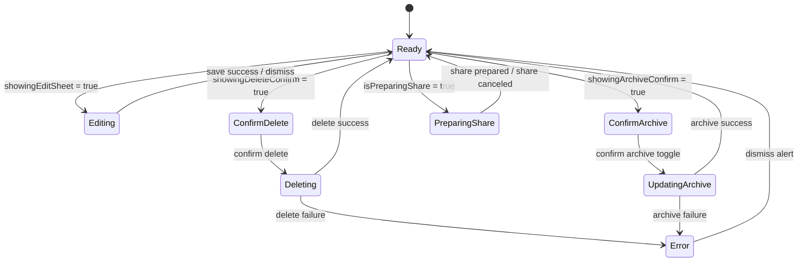

# SparkClientHarmonyOS｜药箱详情页 iOS 对齐工单

> 核验日期：2026-07-26  
> 文档性质：需求工单 + 详细设计约束  
> 参考端：`SparkClient` iOS `MedicineBoxGridView`、`MedicineBoxDetailPage`  
> 目标端：`SparkClientHarmonyOS`  
> 代码边界：本文只创建工单与设计约束，不实现任何业务代码，不修改现有页面逻辑。

## 1. 工单索引

| 工单号 | 工单名 | 状态 | 范围 |
| --- | --- | --- | --- |
| `HOS-MED-BOX-0001` | 药箱详情页 iOS 对齐 | 需求设计中 | 对齐 iOS 药箱卡片进入详情页后的信息展示、操作菜单、编辑 sheet、归档/取消归档、删除、分享、附件分区、家庭/个人模式差异、本地草稿分支和首页缓存回写语义 |

## 2. 背景与目标

### 2.1 背景

当前药箱总方案已经把“药品详情：归属、库存、有效期、附件和操作菜单”列为明确范围，但 HarmonyOS 侧仍需要一份单独工单，把详情页拆成可执行的验收目标，避免把列表页、表单页和详情页混在同一项里。

从 iOS 代码看，详情页并不是一个静态展示页，而是一个有明确状态机和操作入口的复合页面：

- 从双列卡片网格进入详情。
- 支持家庭/个人两种模式。
- 支持服务端模式与本地草稿模式。
- 支持分享、编辑、归档/取消归档、删除。
- 支持附件展示和编辑时附件状态变更。
- 支持操作失败提示、加载态、禁用态和二次确认。

### 2.2 目标

本工单只定义药箱详情页应达到的行为和边界：

1. 详情页的信息分组、字段显示、空值处理和标题规则。
2. 详情页菜单中的分享、编辑、归档/取消归档、删除。
3. 本地草稿和服务端详情的双模式差异。
4. 详情页与表单页、附件页、归档列表和首页缓存回写的关系。
5. 需要补齐的后端契约核验点和测试点。

不在本工单范围内：

- 不实现 `MedicineBoxDetailPage.ets`。
- 不实现 `MedicineBoxFormPage.ets`。
- 不实现 `MedicineBoxCard.ets`、`MedicineBoxGrid.ets`。
- 不新增后端接口实现。
- 不改现有业务代码。

## 3. iOS 参考行为

### 3.1 入口链路

`MedicineBoxGridView` 在卡片点击时通过导航进入 `MedicineBoxDetailPage`：

```text
MedicineBoxGridView
  → MainNavigationLink
  → MedicineBoxDetailPage
```

详情页由卡片网格统一进入，而不是单独通过首页按钮直接落地。

### 3.2 构造参数与页面输入

iOS 详情页并不是只接收一个 `box`，它还携带了整个编辑、分享、归档、删除和草稿回写闭环所需的上下文：

| 参数 | 类型 | 作用 | 对 HarmonyOS 的设计含义 |
| --- | --- | --- | --- |
| `mode` | `MedicineBoxDetailMode` | 决定服务端/草稿逻辑 | 详情页必须支持双模式 |
| `box` | `SparkMedicalSyncAPI.RemoteMedicineBox` | 当前展示对象 | 详情页以 DTO 为权威展示源 |
| `entryMemberID` | `Int?` | 当前入口成员 | 个人模式和家庭模式都需要入口成员门禁 |
| `memberOptions` | `[Member]` | 成员选择来源 | 家庭模式需有成员文案映射 |
| `allowsHouseholdPublic` | `Bool` | 是否允许公共药品 | 家庭模式和编辑表单需判断 |
| `typeOptions` | `[String]` | 药品类型枚举来源 | 编辑 sheet 与显示文案都依赖它 |
| `specOptionBoxes` | `[RemoteMedicineBox]` | 规格候选或联动来源 | 表单/规格选择页可共用 |
| `workflowAPI` | `SparkMedicalWorkflowAPI` | 写入、删除、归档等 | 详情页不能直连 HTTP，必须经 UseCase/Facade |
| `fileTransferService` | `FileTransferService` | 附件上传/分享前置 | 详情页附件编辑与分享依赖统一文件能力 |
| `onSaved` | `(RemoteMedicineBox) -> Void` | 保存成功回调 | 列表和首页缓存回写入口 |
| `onDeleted` | `(Int) -> Void` | 删除成功回调 | 列表移除与首页失效入口 |
| `onArchiveStateChanged` | `((Int, Bool) -> Void)?` | 归档状态变更回调 | 归档成功后必须通知上游 |
| `archiveMode` | `MedicalArchiveListMode` | 当前来自活跃/归档列表 | 详情页菜单文案与返回行为受影响 |
| `onLocalDraftSaved` | `((MedicineBoxRecognitionDraft) -> Void)?` | 草稿保存回调 | 本地草稿编辑分支的结果落点 |
| `onLocalDraftDeleted` | `(() -> Void)?` | 草稿删除回调 | 草稿态清理入口 |

### 3.3 页面状态

iOS 详情页至少包含以下状态：

- `currentBox`
- `sourceBoxDraft`
- `showingEditSheet`
- `showingDeleteConfirm`
- `showingArchiveConfirm`
- `alertMessage`
- `isDeleting`
- `isUpdatingArchiveState`
- `isEditingAttachments`
- `attachmentsDirty`
- `shareContext`
- `shareErrorMessage`
- `isPreparingShare`

这组状态说明详情页并非“一个详情文本块”，而是一个带有编辑、删除、归档、分享、附件、错误提示和草稿分支的复合状态机。

### 3.4 状态来源与派生逻辑

| 状态 | 来源 | 派生规则 | UI 影响 |
| --- | --- | --- | --- |
| `currentBox` | 传入 `box` 或 mutation 回写 | 保存/归档后更新 | 详情页所有展示字段都依赖它 |
| `sourceBoxDraft` | 传入草稿对象 | 仅在 `mode == .localDraft` 下使用 | 决定本地草稿编辑入口 |
| `resolvedEntryMemberID` | `entryMemberID ?? box.member ?? memberOptions.first?.id ?? 0` | 个人模式兜底当前成员 | 编辑 sheet 的默认成员 |
| `ownershipDisplay` | `memberOptions` + `currentBox.member` | 以 member 名称为准，家庭公共则显示公共文案 | 归属区显示 |
| `alertMessage` | mutation 失败/业务错误 | 非空即显示 operation_failed alert | 错误弹窗 |
| `shareContext` | share 预处理结果 | 非空即弹出分享 sheet | 分享入口 |
| `attachmentsDirty` | 附件编辑状态 | 只在附件变更时为真 | 控制保存/禁用语义 |

### 3.5 iOS 详情页组件树

```text
MedicineBoxDetailPage
├── List
│   ├── Section(归属)
│   │   └── MedicineBoxDetailRow
│   ├── Section(药品信息)
│   │   └── MedicineBoxDetailRow x 5
│   ├── Section(库存)
│   │   └── MedicineBoxDetailRow x 1-2
│   ├── Section(备注)
│   │   └── Text
│   └── Section(附件)
│       └── medicineBoxAttachmentsGrid
├── navigationTitle(currentBox.medicineName)
├── toolbar(Menu)
├── sheet(showingEditSheet)
├── alert(showingDeleteConfirm)
├── alert(showingArchiveConfirm)
├── alert(alertMessage)
├── sheet(shareContext)
└── alert(shareErrorMessage)
```

### 3.6 页面结构与分区

iOS 页面以 `List` 组织分组，核心分区为：

- 归属
- 药品信息
- 库存
- 备注
- 附件

标题为当前药品名称，空值时使用详情页默认标题。

### 3.7 操作菜单

右上角菜单包含：

- 分享
- 编辑
- 归档 / 取消归档
- 删除

其中：

- 分享为异步准备流程，需先组装分享上下文。
- 编辑在服务端模式打开远端表单，在本地草稿模式打开本地草稿表单。
- 归档与删除都必须二次确认。
- 失败时不得提前移除当前卡片或首页缓存。

### 3.8 iOS 详情页状态机



状态说明：

- `Ready` 是主展示态，不等于“无缓存、无请求”。
- `Editing` 覆盖服务端模式和本地草稿模式，但落库路径不同。
- `PreparingShare` 是纯异步准备，不应锁死页面。
- `Deleting`、`UpdatingArchive` 期间应禁用菜单项和重复提交。
- `Error` 仅表示当前动作失败，不代表当前对象失效。

### 3.9 iOS 详情页动作链路

| 动作 | 入口 | 前置条件 | 主流程 | 成功结果 | 失败结果 |
| --- | --- | --- | --- | --- | --- |
| 分享 | 菜单分享 | 当前对象可分享，且未在准备中 | 组装 `shareContext`，再弹分享层 | 打开分享 | 保留详情页，显示分享失败 |
| 编辑 | 菜单编辑 | 未处于删除/归档中 | 打开 `MedicineBoxFormView` | 保存后回写 `currentBox` | 保留当前对象 |
| 归档 / 取消归档 | 菜单按钮 | 当前模式允许 | 调用 archive mutation | 更新对象并通知上游 | 保留当前对象和列表 |
| 删除 | 菜单删除 | 已通过确认 | 调用 delete mutation | 回调上游移除 | 保留当前对象 |
| 附件预览 | 附件区点击 | 附件数组非空 | 打开附件预览 | 返回详情页 | 保持当前状态 |

### 3.10 sheet / alert 语义

参考实现中存在四类覆盖层：

- 编辑 sheet：用于修改现有对象。
- 分享 sheet：用于系统分享或业务分享。
- 删除确认 alert：destructive 操作前的二次确认。
- 归档确认 alert：生命周期变更前的二次确认。

这意味着 HarmonyOS 详情页不能把这些动作做成普通跳转，而应保留“先确认、再执行、执行后回写”的同构语义。

## 4. HarmonyOS 对齐目标

### 4.1 目标页面职责

HarmonyOS 详情页应承担以下职责：

1. 展示当前药箱药品完整信息。
2. 作为编辑、归档、删除、分享的统一操作入口。
3. 区分家庭/个人模式和服务端/本地草稿模式。
4. 保持与列表缓存和首页投影的一致回写语义。

### 4.2 页面边界

| 层 | 负责 | 不负责 |
| --- | --- | --- |
| 详情页 | 字段展示、操作按钮、Sheet/Dialog、附件区、路由入口 | HTTP、缓存写入、权限判断、后端字段拼接 |
| ViewModel | 状态机、加载、禁用、错误映射、刷新回写 | 直接渲染 UI、重新定义业务规则 |
| UseCase / Facade | delete/archive/share/save 编排 | ArkUI 组件、页面布局 |
| API 层 | 查询、写入、分享、附件相关请求 | 页面状态、弹窗文案 |

### 4.3 路由和导航约束

1. 详情页必须通过根导航系统进入，不能在详情页内部再套一层业务 Navigation。
2. 详情页路由参数必须至少能表达 `mode`、`box.id`、`entryMemberID`、`archiveMode`。
3. 如果从归档列表进入，返回时必须回到归档上下文，而不是默认丢回活跃列表。
4. 如果从家庭模式进入，返回后应保持原成员筛选语义。

### 4.4 详情页职责拆分建议

| 子职责 | 建议承载层 | 不建议承载层 |
| --- | --- | --- |
| 字段格式化 | ViewModel / DisplaySupport | 页面 build 内临时拼接 |
| 归属成员文案 | DisplaySupport / Member resolver | List row inline 逻辑 |
| 分享上下文组装 | UseCase / Share service | 详情页直接 new 分享对象 |
| 编辑 sheet 数据桥接 | FormModel / FormPage | 详情页本身 |
| 删除/归档 mutation | UseCase / Facade | 详情页直接调用 HTTP |

## 5. 详情页必须覆盖的内容

### 5.1 归属区

家庭模式下应显示：

- 当前药品归属成员
- 公共药品与成员药品的区分

个人模式下应默认固定当前入口成员，不应给用户展示会改变归属的入口。

### 5.2 药品信息区

应展示至少以下字段：

- 药品名称
- 药品类型
- 品牌
- 剂型
- 规格
- 剂量单位

### 5.3 库存区

应展示至少以下字段：

- 总数量
- 有效期

并明确区分：

- 过期
- 临期
- 库存不足

### 5.4 备注区

备注为空时可隐藏分区；不应展示空白块占位。

### 5.5 附件区

附件区需要支持：

- 读取并展示药品照片、处方照片等附件
- 支持附件的预览入口
- 编辑态下可切换附件编辑状态

### 5.6 操作菜单

详情页右上角菜单应保持四个核心动作：

- 分享
- 编辑
- 归档 / 取消归档
- 删除

其中归档和删除必须二次确认。

### 5.7 iOS 详情页字段字典

以下字段来自 iOS 详情页的展示与编辑需求，不代表后端已经全部返回，但它们构成详情页的最小完整面：

| 字段 | 说明 | 详情页区块 | 是否可编辑 | 失败/空值处理 |
| --- | --- | --- | --- | --- |
| `member` | 归属成员 ID | 归属区 | 编辑时可改，个人模式固定 | 空值显示家庭公共药品 |
| `medicineName` | 药品名称 | 标题 / 药品信息 | 可编辑 | 空值回退默认标题 |
| `medicineType` | 药品类型 | 药品信息 | 可编辑 | 空值不显示类型标签 |
| `brandName` | 品牌名 | 药品信息 | 可编辑 | 空值隐藏或空白显示 |
| `dosageForm` | 剂型 | 药品信息 | 可编辑 | 空值不显示 |
| `strength` | 规格/强度 | 药品信息 | 可编辑 | 结构化字段优先，legacy 文本兼容 |
| `doseUnit` | 剂量单位 | 药品信息 | 可编辑 | 与强度联动显示 |
| `totalQuantity` | 总数量 | 库存区 | 可编辑 | 空值允许，数值非法阻断保存 |
| `expireDate` | 有效期 | 库存区 | 可编辑 | 未开启日期则为 null |
| `notes` | 备注 | 备注区 | 可编辑 | 空则隐藏分区 |
| `attachments` | 附件数组 | 附件区 | 可编辑/可预览 | 空数组隐藏或空态提示 |
| `isArchived` | 是否归档 | 操作菜单 / 标题区 | 不直接编辑 | 决定菜单文案 |
| `archivedAt` | 归档时间 | 详情辅助信息 | 不直接编辑 | 仅在归档态展示 |
| `updatedAt` | 更新时间 | 详情辅助信息 | 不直接编辑 | 用于排序和变更提示 |
| `extra` | 扩展字段 | 内部桥接 | 不直接编辑 | 仅用于兼容 legacy 数据 |

### 5.8 详情页展示规则

1. 标题永远优先显示 `medicineName`，不应把品牌或规格顶到标题位。
2. 归属成员和公共药品状态必须显式表达，不能只靠空 member 推断。
3. 如果 `totalQuantity` 不存在，不应错误显示为 `0`。
4. 有效期为空时不应展示强语义空值文案，除非资源文案明确约定。
5. 附件区应优先展示缩略图，缺图时使用稳定占位图。
6. 详情页展示层不要重新计算后端状态，只做客户端提示和格式化。

### 5.9 详情页 Plain Text 草图

#### 5.9.1 服务端详情页草图

```text
┌──────────────────────────────────────┐
│ ‹ 返回           阿莫西林          ⋯  │
├──────────────────────────────────────┤
│ 归属                                   │
│ 绑定成员                         妈妈 │
├──────────────────────────────────────┤
│ 药品信息                               │
│ 药品名称                         阿莫西林│
│ 药品类型                         处方药 │
│ 品牌                             XX     │
│ 剂型                             胶囊   │
│ 规格                             0.25g  │
│ 剂量单位                         粒     │
├──────────────────────────────────────┤
│ 库存                                   │
│ 总数量                             12   │
│ 有效期                     2026-12-31  │
├──────────────────────────────────────┤
│ 备注                                   │
│ 遵医嘱服用                             │
├──────────────────────────────────────┤
│ 附件                                   │
│ [药品照片] [处方照片]                  │
├──────────────────────────────────────┤
│ 右上角菜单：分享 / 编辑 / 归档 / 删除   │
└──────────────────────────────────────┘
```

#### 5.9.2 本地草稿详情页草图

```text
┌──────────────────────────────────────┐
│ ‹ 返回           识别草稿          ⋯  │
├──────────────────────────────────────┤
│ 来源                                   │
│ 草稿来源                        上传识别│
├──────────────────────────────────────┤
│ 药品信息                               │
│ 药品名称                         阿莫西林│
│ 药品类型                         待确认 │
│ 品牌                             XX     │
│ 剂型                             胶囊   │
│ 规格                             0.25g  │
├──────────────────────────────────────┤
│ 附件                                   │
│ [识别图片] [原始附件]                  │
├──────────────────────────────────────┤
│ 右上角菜单：编辑 / 删除                 │
└──────────────────────────────────────┘
```

### 5.10 按钮状态表

| 按钮 | 默认态 | 加载态 | 失败态 | 点击结果 |
| --- | --- | --- | --- | --- |
| 分享 | 可点击 | 禁用或转圈 | 显示错误提示 | 打开分享流程 |
| 编辑 | 可点击 | 禁用 | 保持原页面 | 打开编辑 sheet |
| 归档/取消归档 | 可点击 | 禁用 | 保持当前归档状态 | 切换生命周期状态 |
| 删除 | 可点击 | 禁用 | 保持当前对象 | 打开确认再删除 |
| 附件 | 可点击 | 预览加载 | 提示失败 | 打开附件预览 |

## 6. 模式差异

### 6.1 服务端模式

服务端模式用于真实远端对象，要求：

- 支持分享
- 支持编辑 sheet
- 支持归档 / 取消归档
- 支持删除
- 操作成功后回写列表与首页缓存

### 6.2 本地草稿模式

本地草稿模式用于识别结果或未落库对象，要求：

- 进入编辑时保留草稿来源
- 编辑确认后回写草稿对象
- 删除后只处理草稿态，不触发远端删除
- 附件编辑语义与服务端模式保持一致，但保存路径不同

### 6.3 服务端模式与本地草稿模式对照

| 能力 | 服务端模式 | 本地草稿模式 |
| --- | --- | --- |
| 数据来源 | 远端 `RemoteMedicineBox` | `MedicineBoxRecognitionDraft` / 草稿桥接对象 |
| 编辑入口 | 远端表单 | 草稿表单 |
| 删除语义 | 远端 delete mutation | 仅清理草稿态 |
| 归档语义 | 远端 archive mutation | 通常不支持或仅影响本地草稿状态 |
| 分享 | 可用 | 需先确认是否允许分享草稿 |
| 首页缓存回写 | 回写 `medicineBoxes/familyMedicineBoxes` | 只回写草稿桥接，不污染正式列表 |
| 失败影响 | 保留远端对象并回退 UI | 保留草稿内容，避免丢失识别结果 |

### 6.4 家庭模式与个人模式对照

| 维度 | 家庭模式 | 个人模式 |
| --- | --- | --- |
| 入口 | 首页家庭药箱或家庭聚合列表 | 成员个人药箱或用药执行中心入口 |
| member 策略 | 可选成员或公共药品 | 固定当前入口成员 |
| 筛选影响 | 可能来自成员切换 | 不允许切换为其他成员 |
| 新增/编辑 | 可创建成员药品或公共药品 | 只对当前成员有效 |
| 分享 | 业务上通常允许 | 以服务端权限为准 |
| 列表回写 | 回写家庭投影和必要成员投影 | 回写个人投影，不写公共家庭投影 |

## 7. 关键交互约束

1. 分享前需要先准备 `shareContext`，不能直接从原始 DTO 生成。
2. 编辑态进入 sheet 后，成功保存才关闭详情页相关编辑状态。
3. 删除前必须显示确认文案，删除成功后再回调列表移除。
4. 归档 / 取消归档必须和当前 `isArchived` 状态一致。
5. 进行分享、删除、归档时，按钮必须有加载或禁用态。
6. 失败时应保留当前页面内容，不要把列表或首页缓存提前清空。
7. 如果详情页来自草稿对象，任何远端 mutation 都必须被路由层拦截。
8. 附件编辑与附件预览必须分开处理，不允许在预览态直接改写远端对象。
9. 详情页的“返回”行为不得隐式提交任何未确认变更。
10. 如果有本地未保存编辑状态，返回前应明确是否丢弃草稿。

## 8. 数据与契约核验点

### 8.1 iOS 已能确认的字段趋势

从参考代码和总方案可以确认，详情页至少依赖以下类型信息：

- `RemoteMedicineBox`
- `MedicineBoxDetailMode`
- `MedicineBoxRecognitionDraft`
- `MedicalArchiveListMode`
- `MedicalShareContext`
- `RemoteManagedFile`

### 8.2 需要继续确认的后端点

1. 药箱详情 GET 是否返回完整附件数组、归档时间和扩展字段。
2. 分享业务类型是否固定为 `medicine_box`。
3. 归档与删除是否需要单独的资源级 PATCH / DELETE 语义。
4. 公共药品 `member = null` 的编辑权限边界。
5. 本地草稿与服务端对象在编辑 sheet 中是否共享同一字段模型。
6. 附件是否支持在详情页直接替换，还是只能预览后跳转表单页。
7. `member = null` 的公共药品是否允许普通成员编辑，还是仅家庭成员/管理员可改。
8. 归档态详情页是否允许继续分享、编辑和删除，是否存在额外权限拦截。
9. 删除对象时，后端是否返回可用于页面提示的关联引用信息。
10. `updatedAt`、`archivedAt` 是否均按 date-time 字符串返回，还是部分接口只返回 date-only。

## 9. 测试与验收

### 9.1 必测场景

- 从卡片点击能进入详情页。
- 详情页标题随药品名称变化。
- 归属区、信息区、库存区、备注区、附件区都能正确渲染。
- 分享、编辑、归档、删除入口存在且状态正确。
- 归档和删除都需要二次确认。
- 服务端模式和本地草稿模式行为不同但 UI 风格一致。
- 失败时不提前移除列表项或首页缓存。
- 分享准备中重复点按不会创建多份分享上下文。
- 删除失败后页面仍停留在同一对象，不会自动返回。
- 归档失败后菜单状态恢复正确。
- 编辑 sheet 提交成功后，详情页显示应立即与回调对象一致。
- 附件为空时不会出现空白网格占位破坏布局。
- 草稿模式返回不会误触发远端 delete/archive。

### 9.2 页面验收清单

- [ ] 详情页完整展示归属、信息、库存、备注和附件。
- [ ] 菜单包含分享、编辑、归档/取消归档、删除。
- [ ] 删除与归档均有二次确认。
- [ ] 本地草稿模式进入编辑后可回写草稿，不污染远端对象。
- [ ] 分享、归档、删除的失败态不会破坏当前页面状态。
- [ ] 与首页缓存回写语义一致。
- [ ] 详情页分享准备态、编辑态、删除态、归档态都能正确禁用重复操作。
- [ ] 草稿模式与服务端模式的菜单项差异被明确体现。
- [ ] 附件区在空数据、单附件、多附件三种情况下布局稳定。
- [ ] 每次 mutation 的成功回写与失败回滚都与列表页联动。

### 9.3 路由验收清单

- [ ] 从家庭模式进入，返回后仍保持家庭上下文。
- [ ] 从个人模式进入，返回后仍保持个人上下文。
- [ ] 从归档列表进入，返回后仍保持归档上下文。
- [ ] 编辑 sheet 关闭后不丢失当前页面状态。
- [ ] 分享 sheet 关闭后不打断当前对象展示。

## 10. 进一步实施拆分建议

如果后续要把这份工单继续拆细，建议分成四个执行子块：

1. 详情页信息展示与组件拆分。
2. 编辑 sheet 与本地草稿/服务端双模式。
3. 分享、归档、删除的 mutation 和回写。
4. 附件区与预览/编辑交互。

## 11. 风险与待确认项

| 风险 | 影响 | 处理 |
| --- | --- | --- |
| 详情页和表单页边界混淆 | 后续实现会重复写 UI 和状态 | 明确详情页只负责展示与操作入口，表单另起工单 |
| 本地草稿与服务端模式模型不一致 | 编辑 sheet 容易分叉 | 先确定统一模型和差异字段 |
| 分享上下文准备不清晰 | 分享失败时会污染状态 | 先定义分享上下文生成和失败回收规则 |
| 附件编辑态定义不清晰 | 编辑与预览冲突 | 先明确附件区是否允许在详情页直接编辑 |
| 归档和删除顺序不清晰 | 列表和首页缓存可能不同步 | 统一 mutation 成功后再做回写 |
| 导航返回语义不明确 | 详情页可能错误落回默认列表 | 由入口上下文携带 archiveMode 和 member scope |
| 草稿模式与远端模式共用 sheet 逻辑 | 容易误删远端数据 | 在路由层做模式门禁 |

## 12. 下一步建议

1. 如果要继续细化，可以再拆一份 `药箱表单页 iOS 对齐工单`。
2. 如果要做实现工单，我可以继续把 `MedicineBoxDetailPage` 的字段、状态和按钮拆成 ArkTS 任务列表。
3. 如果要和现有总方案联动，我可以把本工单链接回 [`家庭药箱、个人药箱详细技术方案.md`](/Users/hua/Documents/project/Reference/LookHealthClient/SparkClientHarmonyOS/开发详细技术文档/首页、成员与医疗画像/药箱/家庭药箱、个人药箱详细技术方案.md)。
